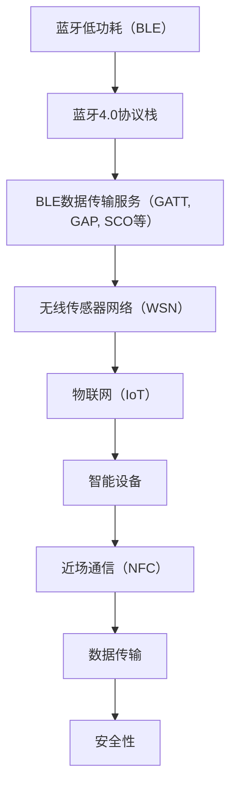

                 

# Bluetooth Low Energy（BLE）：低功耗无线连接

> 关键词：蓝牙低功耗（BLE）, 低功耗无线连接, 无线传感器网络（WSN）, 物联网（IoT）, 数据传输, 近场通信（NFC）, 智能设备, 智能手机, 应用程序, 安全性, 技术实现

## 1. 背景介绍

### 1.1 问题由来

随着物联网（IoT）技术的快速发展，各种智能设备和无线传感器网络（WSN）在家庭、企业、公共场所等场景中得到了广泛应用。然而，传统蓝牙（Bluetooth）技术的功耗高、连接距离短等问题，限制了其在IoT设备中的应用。为了解决这些问题，蓝牙特别兴趣小组（SIG）在2014年推出了低功耗蓝牙（Bluetooth Low Energy, BLE）标准。BLE技术通过优化蓝牙协议栈、降低功耗和提高连接距离，大大拓展了蓝牙的应用范围，成为了IoT领域的重要无线连接技术。

### 1.2 问题核心关键点

BLE的核心优势在于其低功耗特性和灵活的网络拓扑结构。相较于传统蓝牙技术，BLE在如下几个方面进行了显著优化：

- **低功耗**：BLE使用能量效率更高的链路层协议，有效降低了能耗。
- **远距离通信**：BLE的连接距离可达100米以上，远超传统蓝牙的10米范围内。
- **多播与广播**：BLE支持多播和广播通信，能够同时与多个设备通信，提高了通信效率。
- **可扩展性**：BLE支持多种设备和传感器网络的组网，便于构建复杂的物联网系统。

这些优势使得BLE在智能家居、可穿戴设备、智能城市等领域得到了广泛应用。

### 1.3 问题研究意义

研究BLE技术对于推动物联网技术的发展具有重要意义：

- **能源效率**：低功耗特性使得IoT设备能够长期运行，延长电池寿命。
- **连接距离**：远距离通信能力拓展了蓝牙的应用场景，提高了设备部署的灵活性。
- **通信效率**：多播和广播功能提高了数据传输的效率和可靠性。
- **设备互操作性**：BLE兼容多种操作系统和硬件平台，降低了设备间的互操作成本。

通过深入研究BLE的原理和应用，可以更好地设计IoT系统，提升设备的用户体验和应用效果。

## 2. 核心概念与联系

### 2.1 核心概念概述

为了更好地理解BLE的原理和应用，本节将介绍几个关键概念：

- **蓝牙低功耗（BLE）**：一种低功耗无线连接技术，基于蓝牙4.0标准，主要应用于IoT设备中。
- **无线传感器网络（WSN）**：由大量传感器节点构成的无线网络，用于实时监测环境参数，广泛应用于智能家居、农业、工业等领域。
- **物联网（IoT）**：通过互联网技术实现物品互联的生态系统，涉及传感器、通信技术、云计算等多个领域。
- **近场通信（NFC）**：一种用于近距离无线通信的技术，支持设备间的快速配对和数据交换，常用于支付、身份认证等场景。
- **智能设备**：具有自主计算能力、网络连接功能的设备，如智能手机、智能手表、智能家居设备等。
- **数据传输**：BLE提供了高效、可靠的数据传输机制，支持多种类型的数据传输服务（GATT, GAP, SCO等）。
- **安全性**：BLE在数据传输和设备管理等方面具有完善的加密和安全机制，保障数据传输的安全性。

这些核心概念通过蓝牙协议栈和应用层协议得以实现，形成一个完整的无线通信系统。

### 2.2 核心概念原理和架构的 Mermaid 流程图



这个流程图展示了BLE的核心架构及其与其他相关概念的联系。蓝牙4.0协议栈是BLE的基础，提供数据传输服务，这些服务支撑无线传感器网络、物联网、智能设备和近场通信等应用场景。

## 3. 核心算法原理 & 具体操作步骤

### 3.1 算法原理概述

BLE的底层原理基于蓝牙4.0协议栈，主要包括以下几个层次：

- **物理层（PHY）**：定义了数据传输的调制方式、编码方式等，采用跳频扩展频谱（FHSS）或直接序列扩展频谱（DS-CDMA）。
- **媒体访问控制层（MAC）**：定义了数据传输的访问机制，支持轮询、竞争等多种传输模式。
- **链路层（L2CAP）**：提供逻辑链路控制服务，支持可靠数据传输、多路复用等功能。
- **传输层（GATT）**：提供面向应用层的通信服务，支持数据传输、设备发现、连接管理等功能。
- **应用层（GAP）**：提供设备发现、设备连接、设备配对等功能。
- **服务发现协议（SDP）**：用于发现和查询服务信息，支持动态服务注册和更新。

### 3.2 算法步骤详解

 BLE 的通信过程可以分为以下几个关键步骤：

1. **设备发现**：通过广播或扫描发现周围设备，建立连接。设备发现包括主动扫描和被动扫描两种模式。
2. **设备连接**：在发现周围设备后，通过安全配对和连接密钥交换建立安全连接。
3. **数据传输**：在连接建立后，通过GATT协议进行数据传输。GATT协议支持多种数据类型，包括文本、图像、音频等。
4. **连接管理**：在连接过程中，进行连接参数的配置、连接状态的维护、连接断开等管理操作。

这些步骤通过蓝牙协议栈的各个层次协同完成，确保数据的安全、可靠传输。

### 3.3 算法优缺点

BLE技术相比传统蓝牙有以下优点：

- **低功耗**：BLE使用能量效率更高的链路层协议，有效降低了能耗。
- **远距离通信**：BLE的连接距离可达100米以上，远超传统蓝牙的10米范围内。
- **多播与广播**：BLE支持多播和广播通信，能够同时与多个设备通信，提高了通信效率。
- **可扩展性**：BLE支持多种设备和传感器网络的组网，便于构建复杂的物联网系统。

同时，BLE也存在一些缺点：

- **网络延迟**：由于数据传输量较小，BLE网络延迟较大，不适合实时性要求高的应用。
- **安全性问题**：虽然BLE提供了较好的安全性保障，但在某些情况下仍存在安全漏洞，如中间人攻击、数据截获等。
- **设备兼容性**：尽管 BLE 兼容多种操作系统和硬件平台，但在某些设备上仍存在兼容性问题，可能导致数据传输失败。

### 3.4 算法应用领域

BLE在多个领域得到了广泛应用，包括：

- **智能家居**：用于控制家庭设备、智能照明、温控等，通过智能手机或语音助手控制。
- **可穿戴设备**：如智能手表、智能健身设备等，用于健康监测、运动追踪、社交互联等。
- **智能城市**：用于交通管理、环境监测、公共安全等，通过传感器网络实现数据收集和分析。
- **医疗健康**：用于健康监测、远程医疗、健康管理等，通过智能设备和传感器实现实时数据传输。
- **工业物联网**：用于设备监控、生产管理、设备维护等，通过传感器网络实现自动化控制。

这些应用领域展示了BLE技术的强大生命力和广泛应用前景。

## 4. 数学模型和公式 & 详细讲解

### 4.1 数学模型构建

BLE的核心是蓝牙4.0协议栈，涉及多个协议和标准，主要包含以下几个方面的数学模型：

- **物理层模型**：定义了信号调制、信道编码等数学模型。
- **媒体访问控制模型**：定义了时分复用、频分复用等数学模型。
- **链路层模型**：定义了数据传输的可靠性和吞吐量等数学模型。
- **传输层模型**：定义了数据传输的流控、可靠性和时延等数学模型。
- **应用层模型**：定义了设备发现、设备连接、数据传输等数学模型。

### 4.2 公式推导过程

以下是BLE物理层调制方式的公式推导：

**跳频扩展频谱（FHSS）**：

$$
\text{频率} = f_0 + k \cdot \Delta f
$$

其中，$f_0$ 是基准频率，$\Delta f$ 是跳频间隔，$k$ 是跳频序号。

**直接序列扩展频谱（DS-CDMA）**：

$$
\text{信号} = \sum_{i=0}^{N-1} s_i \cdot c_i
$$

其中，$s_i$ 是信号序列，$c_i$ 是伪随机码序列。

### 4.3 案例分析与讲解

**智能手表和手机连接案例**：

- **设备发现**：智能手表通过广播地址进行设备发现，手机通过扫描地址响应。
- **设备连接**：手机扫描到智能手表的广播地址后，通过安全配对和连接密钥交换建立安全连接。
- **数据传输**：手机通过GATT协议向智能手表发送健康监测数据，智能手表通过GATT协议返回健康指标。
- **连接管理**：连接建立后，手机通过GATT协议进行健康监测数据传输，并通过GAP协议进行设备断开操作。

通过这个案例，可以更好地理解BLE的通信过程和数据传输机制。

## 5. 项目实践：代码实例和详细解释说明

### 5.1 开发环境搭建

在进行BLE项目开发前，我们需要准备好开发环境。以下是使用Raspberry Pi搭建BLE开发环境的步骤：

1. **安装Raspberry Pi**：从官网购买Raspberry Pi开发板，并按照官方指南进行安装。
2. **安装操作系统**：选择适合的Linux发行版（如Ubuntu）进行安装。
3. **安装开发工具**：安装GCC、Make等编译工具，以及BLE开发包（如BleGATT）。
4. **连接蓝牙模块**：将BLE模块（如nRF51822）连接到开发板上，并进行初始化配置。

### 5.2 源代码详细实现

以下是使用BLE开发包在Raspberry Pi上进行设备发现的示例代码：

```c
#include <stdio.h>
#include <stdlib.h>
#include <string.h>
#include <errno.h>
#include <unistd.h>
#include <fcntl.h>
#include <bluetooth/bluetooth.h>
#include <bluetooth/rfcomm.h>

int main() {
    int fd;
    struct sockaddr_bd addr;
    struct RFCOMM_DEF rfcomm_def;
    char* remote_device = "XX:XX:XX:XX:XX:XX";
    
    // 连接蓝牙模块
    fd = socket(AF_BLUETOOTH, SOCK_DGRAM, BTPROTO_RFCOMM);
    memset(&addr, 0, sizeof(addr));
    strncpy(addr.bd_addr, remote_device, sizeof(addr.bd_addr));
    if (bind(fd, (struct sockaddr*)&addr, sizeof(addr)) < 0) {
        perror("bind");
        exit(1);
    }
    
    // 配置设备信息
    memset(&rfcomm_def, 0, sizeof(rfcomm_def));
    rfcomm_def.dev_name = "Raspberry Pi";
    rfcomm_def.p = 1;
    rfcomm_def.chan = 1;
    if (rfcomm_create_fd(fd, &rfcomm_def) < 0) {
        perror("rfcomm_create_fd");
        exit(1);
    }
    
    // 发送设备信息
    char* info = "Hello, BLE!";
    if (write(fd, info, strlen(info)) < 0) {
        perror("write");
        exit(1);
    }
    
    // 关闭连接
    close(fd);
    return 0;
}
```

以上代码展示了使用BLE开发包在Raspberry Pi上进行设备发现的基本步骤，包括连接蓝牙模块、配置设备信息、发送设备信息等。

### 5.3 代码解读与分析

**蓝牙模块连接**：
- `socket(AF_BLUETOOTH, SOCK_DGRAM, BTPROTO_RFCOMM)`：创建蓝牙套接字，使用RFCOMM协议。
- `memset(&addr, 0, sizeof(addr))`：初始化地址结构体。
- `strncpy(addr.bd_addr, remote_device, sizeof(addr.bd_addr))`：设置远程设备地址。
- `bind(fd, (struct sockaddr*)&addr, sizeof(addr))`：绑定蓝牙套接字到指定地址。

**设备信息配置**：
- `memset(&rfcomm_def, 0, sizeof(rfcomm_def))`：初始化RFCOMM配置结构体。
- `rfcomm_def.dev_name = "Raspberry Pi"`：设置设备名称。
- `rfcomm_def.p = 1`：使用点对点模式。
- `rfcomm_def.chan = 1`：使用通道1。
- `rfcomm_create_fd(fd, &rfcomm_def)`：创建RFCOMM设备，返回设备句柄。

**设备信息发送**：
- `char* info = "Hello, BLE!";`：定义设备信息。
- `write(fd, info, strlen(info))`：发送设备信息到远程设备。

### 5.4 运行结果展示

运行上述代码后，可以通过监控工具（如BLE Manager）观察到设备发现的过程。具体步骤如下：

1. 打开BLE Manager，选择Raspberry Pi设备。
2. 进入设备详情页，查看设备信息。
3. 点击连接按钮，建立蓝牙连接。
4. 在终端中查看设备信息发送的输出结果。

通过以上步骤，可以验证设备发现的正确性，并进一步探索其他BLE应用的开发。

## 6. 实际应用场景

### 6.1 智能家居

BLE在智能家居领域的应用包括：

- **智能灯泡**：通过手机App控制智能灯泡的开关和亮度，实现场景照明自动化。
- **智能插座**：通过手机App控制智能插座的开关，实现家电自动化控制。
- **智能门锁**：通过手机App控制智能门锁的开关和权限，实现家庭安全自动化。

这些应用场景展示了BLE在智能家居中的广泛应用，提高了家庭生活的便捷性和安全性。

### 6.2 可穿戴设备

BLE在可穿戴设备领域的应用包括：

- **智能手表**：用于健康监测、运动追踪、社交互联等，通过手机App控制。
- **智能健身设备**：用于心率监测、步数统计、运动记录等，通过手机App控制。
- **智能计步器**：用于步数统计、运动记录等，通过手机App控制。

这些应用场景展示了BLE在可穿戴设备中的广泛应用，提高了用户的健康监测和生活质量。

### 6.3 智能城市

BLE在智能城市领域的应用包括：

- **智能交通**：用于车辆监控、交通流量统计等，通过传感器网络实现数据收集和分析。
- **环境监测**：用于空气质量、水质监测等，通过传感器网络实现数据收集和分析。
- **公共安全**：用于摄像头监控、入侵检测等，通过传感器网络实现数据收集和分析。

这些应用场景展示了BLE在智能城市中的广泛应用，提高了城市的智能化水平和公共安全。

### 6.4 未来应用展望

未来，BLE技术将在更多领域得到应用，为智能技术的发展提供更多可能。

- **健康医疗**：用于健康监测、远程医疗、健康管理等，通过智能设备和传感器实现实时数据传输。
- **工业物联网**：用于设备监控、生产管理、设备维护等，通过传感器网络实现自动化控制。
- **智能家居**：用于控制家电、照明、温控等，通过手机App实现场景自动化。
- **智能城市**：用于交通管理、环境监测、公共安全等，通过传感器网络实现数据收集和分析。

随着BLE技术的不断进步，其在智能技术中的应用场景将更加广泛，为社会带来更多的便利和创新。

## 7. 工具和资源推荐

### 7.1 学习资源推荐

为了帮助开发者系统掌握BLE的原理和实践技巧，这里推荐一些优质的学习资源：

1. **《蓝牙低功耗（BLE）指南》**：详细介绍了BLE的原理、应用和开发实践，是初学者入门的必备书籍。
2. **《蓝牙技术参考手册》**：蓝牙 SIG 出版的权威技术手册，涵盖BLE的各个方面，适合深入学习和研究。
3. **《蓝牙低功耗（BLE）开发教程》**：一系列BLE开发的教程和案例，涵盖不同硬件平台和开发工具，适合实战练习。
4. **在线课程**：如Coursera、Udacity等平台上的IoT相关课程，涵盖BLE、WSN、IoT等技术，适合系统学习。
5. **开源项目**：如BLE manager、nRF51822等开源项目，提供了详细的代码实现和开发文档，适合学习参考。

通过对这些资源的学习实践，相信你一定能够快速掌握BLE的精髓，并用于解决实际的IoT问题。

### 7.2 开发工具推荐

 BLE 的开发离不开合适的开发工具和环境，以下是几款推荐的开发工具：

1. **BLE Manager**：一款基于Android的蓝牙设备管理工具，支持设备发现、连接、配置等功能。
2. **nRF51822**：一款基于nRF5系列芯片的BLE模块，支持多协议栈和多种操作系统，适合开发各种IoT应用。
3. **BLE4u**：一款基于WinUSB的蓝牙调试工具，支持USB接口和串口调试，适合开发蓝牙应用。
4. **BLEWorks**：一款BLE开发平台，提供图形化设计工具和模拟环境，适合设计和管理IoT系统。
5. **BLEMesh**：一款BLE Mesh协议的开发工具，支持多设备互操作和网状网络，适合开发复杂的IoT应用。

合理利用这些工具，可以显著提升BLE应用的开发效率，加快创新迭代的步伐。

### 7.3 相关论文推荐

 BLE 技术的发展源于学界的持续研究，以下是几篇奠基性的相关论文，推荐阅读：

1. **蓝牙低功耗（BLE）技术概述**：介绍了BLE的原理、架构和应用，涵盖了蓝牙协议栈的各个层次。
2. **蓝牙低功耗（BLE）协议分析**：详细分析了BLE协议的各个层次和标准，帮助理解BLE的工作机制。
3. **蓝牙低功耗（BLE）在物联网中的应用**：探讨了BLE在IoT领域的应用场景和技术实现，展示了BLE的广泛应用。
4. **蓝牙低功耗（BLE）安全性研究**：分析了BLE在数据传输和设备管理中的安全性问题，提出了相应的安全保障措施。
5. **蓝牙低功耗（BLE）设备互操作性研究**：探讨了BLE在不同设备和操作系统上的互操作性问题，提出了解决方案和改进措施。

这些论文代表了大语言模型微调技术的发展脉络，通过学习这些前沿成果，可以帮助研究者把握学科前进方向，激发更多的创新灵感。

## 8. 总结：未来发展趋势与挑战

### 8.1 总结

本文对蓝牙低功耗（BLE）技术进行了全面系统的介绍。首先阐述了BLE的核心优势和应用场景，明确了BLE在IoT设备中的应用价值。其次，从原理到实践，详细讲解了BLE的数学模型和关键步骤，给出了BLE应用开发的完整代码实例。同时，本文还广泛探讨了BLE技术在智能家居、可穿戴设备、智能城市等多个领域的应用前景，展示了BLE技术的广阔前景。

通过本文的系统梳理，可以看到，BLE技术正在成为IoT领域的重要无线连接技术，极大地拓展了蓝牙的应用范围，推动了IoT技术的发展。未来，伴随BLE技术的不断演进，相信IoT技术将进入更加智能化、普适化的发展阶段。

### 8.2 未来发展趋势

未来，BLE技术的发展趋势包括：

1. **低功耗进一步优化**：随着工艺和硬件的进步，BLE的功耗将进一步降低，延长IoT设备的电池寿命。
2. **远距离通信进一步提升**：通过引入新的调制方式和编码方式，BLE的连接距离将进一步扩展，拓展应用场景。
3. **多播与广播技术优化**：通过改进多播和广播机制，提高数据传输的效率和可靠性，适应更多的IoT应用场景。
4. **安全性进一步增强**：通过引入新的加密和安全机制，提高BLE数据传输的安全性和隐私保护。
5. **设备兼容性进一步提高**：通过改进设备互操作性，提高BLE在不同设备和操作系统上的兼容性，推动IoT设备的普及应用。

这些趋势展示了BLE技术的巨大潜力，为IoT设备的智能化和普适化发展提供了更多可能。

### 8.3 面临的挑战

尽管BLE技术已经取得了瞩目成就，但在迈向更加智能化、普适化应用的过程中，仍面临诸多挑战：

1. **数据传输速率**：BLE的数据传输速率相对较低，可能无法满足某些高实时性应用的需求。
2. **网络延迟**：由于数据传输量较小，BLE网络延迟较大，影响实时性要求高的应用。
3. **安全漏洞**：尽管BLE提供了较好的安全性保障，但在某些情况下仍存在安全漏洞，需要进一步改进。
4. **设备兼容性**：虽然BLE兼容多种操作系统和硬件平台，但在某些设备上仍存在兼容性问题，可能导致数据传输失败。
5. **技术演进**：随着技术的发展，现有设备的性能可能难以满足新标准和新协议的要求，需要不断升级和更新。

正视BLE面临的这些挑战，积极应对并寻求突破，将是大语言模型微调技术迈向成熟的必由之路。相信随着学界和产业界的共同努力，这些挑战终将一一被克服，BLE技术必将在构建智能IoT系统中发挥更大的作用。

### 8.4 研究展望

未来，对BLE技术的进一步研究将在以下几个方面展开：

1. **新的传输协议**：开发新的传输协议，提高数据传输速率和效率，适应更多的IoT应用场景。
2. **新的加密技术**：引入新的加密和安全机制，提高BLE数据传输的安全性和隐私保护。
3. **新的设备标准**：制定新的设备标准，提高BLE在不同设备和操作系统上的兼容性，推动IoT设备的普及应用。
4. **新的通信方式**：探索新的通信方式，如低功耗广域网（LPWAN）、无线传感器网络（WSN）等，拓展IoT应用的场景和功能。
5. **新的应用场景**：研究和应用新的IoT应用场景，如智能家居、智能城市、智能医疗等，推动IoT技术在各个领域的发展。

这些研究方向的探索，必将引领BLE技术迈向更高的台阶，为构建智能IoT系统提供更多技术支持和应用场景。总之，BLE技术需要在性能、安全、兼容性等方面不断提升，才能更好地适应未来IoT技术的发展。

## 9. 附录：常见问题与解答

**Q1：BLE设备是如何进行设备发现的？**

A: BLE设备通过广播地址进行设备发现，其他设备通过扫描地址响应。具体步骤如下：

1. BLE设备广播其广播地址，并设置扫描窗口。
2. 其他设备扫描广播地址，并判断扫描窗口内是否有响应。
3. 如果有响应，则建立连接并进行后续操作。

**Q2：BLE设备如何进行设备配对？**

A: BLE设备通过安全配对和连接密钥交换建立安全连接，具体步骤如下：

1. BLE设备广播其安全密钥信息。
2. 其他设备扫描安全密钥信息，并与设备配对。
3. 设备交换连接密钥，并进行连接加密和数据传输。

**Q3：BLE设备如何进行数据传输？**

A: BLE设备通过GATT协议进行数据传输，具体步骤如下：

1. BLE设备设置GATT服务。
2. 其他设备查询GATT服务，并进行数据读写操作。
3. BLE设备通过GATT协议返回数据，并进行连接管理。

通过这些步骤，可以验证BLE设备的设备发现、设备配对和数据传输过程，理解BLE的通信机制。

---

作者：禅与计算机程序设计艺术 / Zen and the Art of Computer Programming

