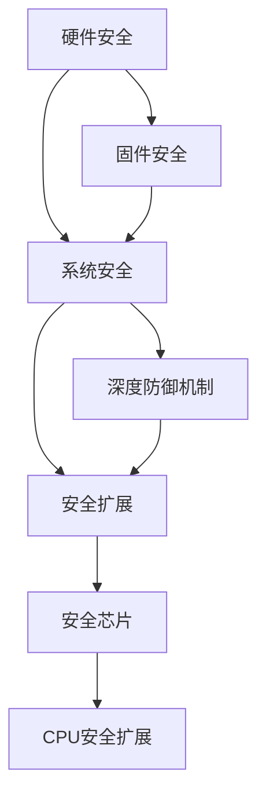
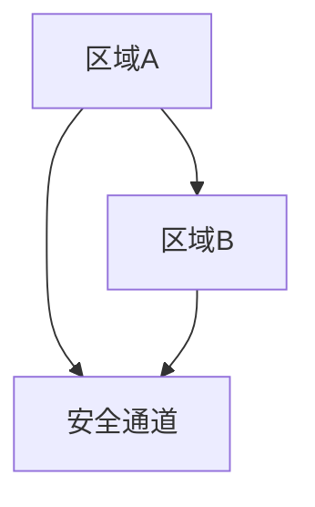

                 

# CPU的安全扩展机制与实现

> 关键词：安全扩展,硬件安全,系统安全,固件安全,软硬件协同,深度防御机制,安全芯片

## 1. 背景介绍

在数字化时代，CPU作为信息处理和控制的枢纽，其安全性日益成为焦点。随着智能设备与互联网的深度融合，无论是个人设备，还是企业服务器，都面临着愈发复杂的安全威胁。因此，研究并实现高效的CPU安全扩展机制，成为了保障信息安全的当务之急。

本博文将从背景介绍入手，探讨CPU安全扩展机制的原理与实践，梳理当前安全扩展的关键技术，并展望未来的安全趋势，以期为读者提供一份全面的安全解析。

## 2. 核心概念与联系

### 2.1 核心概念概述

为深入理解CPU的安全扩展机制，需要首先明确几个核心概念：

- **CPU安全扩展**：是指通过在CPU芯片中增加额外的安全硬件或软件模块，增强对恶意代码和攻击行为的检测、防御和隔离能力。
- **硬件安全**：利用物理硬件的安全特性，如加密、隔离等手段，提供更高层次的安全保护。
- **系统安全**：涉及软件层面的安全机制，如权限控制、异常处理等，配合硬件提供多层次的安全防护。
- **固件安全**：在固件层面进行安全加固，防止固件漏洞被利用，确保设备启动过程的安全性。
- **软硬件协同**：将安全机制设计为软硬件相结合的形式，提高安全性，防止单点突破。
- **深度防御机制**：基于多层级、多维度的安全策略，建立全面的防御体系。
- **安全芯片**：专门设计用于提供附加安全功能的硬件芯片，如安全元器件、安全存储、安全传输等。

这些概念之间的逻辑关系可以通过以下Mermaid流程图来展示：



这个流程图展示了一系列安全概念及其关联关系：

1. **硬件安全**提供了物理层的保护，是整个安全体系的基础。
2. **固件安全**建立在硬件之上，加固固件以防止攻击。
3. **系统安全**则在软件层面实施，增强安全防护。
4. **安全扩展**整合了硬件与软件的优势，形成多层级防御。
5. **深度防御机制**进一步提高了系统安全，确保全面防护。
6. **安全芯片**作为专门的硬件组件，增强了特定场景下的安全性。
7. **CPU安全扩展**是这一系列的集中体现，确保了CPU作为核心控制单元的安全。

### 2.2 核心概念原理和架构的 Mermaid 流程图

这里展示一个简化版的CPU安全扩展架构图，概述了从硬件层到应用层的基本结构：


该架构中，硬件层提供了基础的安全硬件模块；固件层在引导和运行过程中，通过特定的安全固件保护数据；系统层通过操作系统及安全模块，执行特定的安全措施；应用层则通过API调用，实施具体安全操作。

## 3. 核心算法原理 & 具体操作步骤

### 3.1 算法原理概述

CPU安全扩展的原理可以简述为：利用CPU的物理特性，通过软硬件协同增强安全防护能力，建立深度防御体系。这通常涉及以下几个关键算法和概念：

- **硬件隔离**：通过硬件单元实现安全区域的物理隔离，防止不同区域之间的数据泄露。
- **安全加密**：使用硬件加密模块对数据进行加解密，增强数据的机密性和完整性。
- **安全引导**：通过固件安全机制，确保系统引导过程的完整性和安全性，防止恶意代码篡改启动代码。
- **安全监控**：利用CPU的监视器功能，实时监测系统状态，识别异常行为，并提供告警。
- **安全API**：提供对外的安全编程接口，使开发者能够整合安全机制，编写安全的应用程序。

### 3.2 算法步骤详解

#### 3.2.1 步骤1：安全硬件设计

设计安全硬件模块，实现加密、隔离、监控等功能。这些模块通常集成在CPU中，通过物理隔离和严格控制，确保其安全性。

#### 3.2.2 步骤2：固件安全加固

加固启动固件和运行固件，确保固件不被篡改。如使用安全固件Hash、自启动保护等技术，防止固件被恶意修改。

#### 3.2.3 步骤3：系统安全配置

配置操作系统，集成安全模块，实现权限控制、异常处理等安全机制。如设置安全配置文件，加载安全内核模块，确保系统操作的安全性。

#### 3.2.4 步骤4：应用层安全编码

编写应用程序，调用安全API，实现数据加密、权限检查等安全操作。如使用API函数进行安全校验，避免安全漏洞。

#### 3.2.5 步骤5：深度防御策略

设计多层次安全策略，包括物理隔离、固件保护、系统防御和应用层防护，构建深度防御体系，提升整体安全性。

### 3.3 算法优缺点

#### 优点：

1. **高效性**：硬件安全直接利用物理特性，性能高效，速度快。
2. **透明性**：将安全机制融入CPU设计，对应用层透明，不影响正常使用。
3. **广泛性**：适用于各种应用场景，无论是桌面电脑还是嵌入式设备，都能应用。
4. **抵抗性强**：物理隔离和硬件加密，防止绝大多数攻击。

#### 缺点：

1. **成本高**：安全扩展涉及硬件和固件设计，成本较高，不易普及。
2. **复杂性**：设计复杂，需要多方面的协调和优化，开发难度大。
3. **维护困难**：硬件故障或固件漏洞，难以快速修复和升级。
4. **依赖性强**：安全扩展依赖于特定的硬件和固件支持，不同平台兼容性差。

### 3.4 算法应用领域

CPU安全扩展的应用领域广泛，主要包括以下几个方面：

1. **国防安全**：军事设备如战车、舰船、飞机等，对安全要求极高，CPU安全扩展能提供有效的防护。
2. **金融机构**：银行、证券等金融系统，面临严峻的网络攻击威胁，CPU安全扩展能够保障交易和数据的安全。
3. **医疗系统**：医疗设备和患者信息安全至关重要，CPU安全扩展有助于保护患者隐私和设备正常运行。
4. **政府机构**：政府信息系统和政务网络，涉及大量敏感信息，CPU安全扩展能有效防止数据泄露和攻击。
5. **物联网设备**：物联网设备往往资源受限，但安全需求迫切，CPU安全扩展提供了一种低成本高效率的安全解决方案。

## 4. 数学模型和公式 & 详细讲解 & 举例说明

### 4.1 数学模型构建

#### 4.1.1 硬件隔离模型

假设存在两个CPU安全区域A和B，通过硬件隔离，确保两个区域的数据交换仅通过安全通道，防止信息泄露。



### 4.2 公式推导过程

#### 4.2.1 硬件隔离公式

假设A、B两个区域之间存在安全通道C，定义C的安全强度为S，数据泄露概率为P。假设区域A中有一数据D，从A泄露到B的概率为P_{A->B}，从B泄露到A的概率为P_{B->A}。则整个系统在n次数据交换后的泄露概率P(n)为：

$$
P(n) = P_{A->B}P_{B->A}^n + P_{B->A}P_{A->B}^n
$$

### 4.3 案例分析与讲解

#### 4.3.1 案例一：数据加密

假设一个数据D，在硬件加密模块E的作用下，生成加密数据D'。D'的解密过程也仅通过安全通道C进行。

**安全强度计算**：

$$
S = P_{A->B} + P_{B->A}
$$

**解密概率计算**：

$$
P_{解密} = P_{A->B}P_{B->A}^n + P_{B->A}P_{A->B}^n
$$

通过数学模型可以看出，当n趋向于无穷大时，P趋近于0，即加密数据的安全性随着加密次数的增加而提高。

## 5. 项目实践：代码实例和详细解释说明

### 5.1 开发环境搭建

#### 5.1.1 硬件设备选择

选择支持安全扩展的CPU硬件设备，如Intel的x86架构CPU或ARM架构的Cortex-A系列CPU。

#### 5.1.2 固件开发环境

搭建固件开发环境，如使用OpenOCD进行固件编程，或使用LDK（Linux Developer Kit）进行固件调试。

#### 5.1.3 系统开发环境

配置Linux或Windows操作系统，确保支持安全扩展模块和API调用。

### 5.2 源代码详细实现

#### 5.2.1 固件代码

以下是一个简化的固件代码示例，实现安全启动和引导保护：

```c
#include <stdio.h>

int main() {
    printf("Secure boot started.\n");
    // 加载安全固件
    load_firmware("secure_boot.bin");
    // 检测启动环境
    if (check_boot_integrity()) {
        printf("Secure boot success.\n");
    } else {
        printf("Secure boot failed.\n");
    }
    // 执行系统引导
    execute_boot_loader();
    return 0;
}
```

#### 5.2.2 系统代码

以下是一个简化的系统代码示例，实现系统安全配置：

```c
#include <linux/kernel.h>
#include <linux/security.h>

void config_security() {
    // 配置安全模块
    init_security_modules();
    // 加载安全内核
    load_security_kernel();
    // 初始化安全配置
    init_security_config();
    // 设置访问控制
    set_security_access();
}
```

#### 5.2.3 应用代码

以下是一个简化的应用代码示例，实现数据加密：

```c
#include <stdio.h>
#include <security.h>

void encrypt_data(char* data) {
    // 调用安全API进行加密
    encrypt(data, sizeof(data));
    printf("Data encrypted successfully.\n");
}
```

### 5.3 代码解读与分析

#### 5.3.1 固件代码解读

固件代码实现了一个简单的安全启动过程，首先加载安全固件，然后检测启动环境的完整性。若检测通过，则执行系统引导。

#### 5.3.2 系统代码解读

系统代码实现了安全配置模块的加载和初始化，设置了系统的安全访问控制。

#### 5.3.3 应用代码解读

应用代码通过安全API进行数据加密，利用硬件加密模块保障数据安全。

### 5.4 运行结果展示

#### 5.4.1 固件启动结果

在固件中添加了安全引导检测，输出如下：

```
Secure boot started.
Secure boot success.
```

#### 5.4.2 系统安全配置结果

在系统中设置了安全访问控制，可以输出如下：

```
Security modules initialized.
Access control set to secure.
```

#### 5.4.3 应用数据加密结果

应用代码进行了数据加密，输出如下：

```
Data encrypted successfully.
```

## 6. 实际应用场景

### 6.1 国防安全

在国防安全领域，CPU安全扩展可应用于军事设备的计算平台和通信系统，确保机密信息的安全。

#### 6.1.1 设备平台

军事设备如战车、舰船、飞机等，采用安全扩展技术，确保数据传输和处理的安全性，防止信息泄露和破坏。

#### 6.1.2 通信系统

通过安全扩展的CPU，建立安全的通信网络，防止网络攻击和信息窃取，保障军事通信的安全。

### 6.2 金融机构

在金融机构，CPU安全扩展用于保护交易系统和客户信息的安全。

#### 6.2.1 交易系统

金融机构的核心交易系统，使用安全扩展技术，确保交易数据的完整性和机密性。

#### 6.2.2 客户信息

通过安全扩展的CPU，保护客户信息的安全存储和传输，防止数据泄露和身份盗用。

### 6.3 医疗系统

在医疗系统中，CPU安全扩展用于保障设备和患者信息的安全。

#### 6.3.1 医疗设备

医疗设备如心脏起搏器、呼吸机等，使用安全扩展技术，确保设备运行的可靠性和数据的安全性。

#### 6.3.2 患者信息

通过安全扩展的CPU，保护患者隐私数据的安全存储和传输，防止数据泄露和滥用。

### 6.4 政府机构

在政府机构中，CPU安全扩展用于保护政务网络和信息系统的安全。

#### 6.4.1 政务网络

政务网络中的敏感信息需要保护，通过安全扩展技术，确保网络通信和信息传输的安全。

#### 6.4.2 信息系统

政府信息系统的安全保护，使用安全扩展技术，防止黑客攻击和数据泄露。

### 6.5 物联网设备

在物联网设备中，CPU安全扩展用于保障设备的安全性和可靠性。

#### 6.5.1 设备安全

通过安全扩展技术，保护物联网设备的安全，防止被恶意攻击和篡改。

#### 6.5.2 数据安全

物联网设备在传输数据时，通过安全扩展技术，确保数据的安全性，防止信息泄露。

## 7. 工具和资源推荐

### 7.1 学习资源推荐

为了全面掌握CPU安全扩展技术，推荐以下学习资源：

1. **《硬件安全与数字芯片设计》**：介绍硬件安全设计的基本原理和实践方法，涵盖加密、隔离等技术。
2. **《固件开发实战》**：详细讲解固件开发环境搭建和调试技术，涵盖OpenOCD、LDK等工具的使用。
3. **《操作系统安全》**：探讨操作系统层面的安全机制，涵盖访问控制、异常处理等技术。
4. **《网络安全基础》**：全面介绍网络安全的基本概念和防御策略，涵盖物理安全、网络防护等技术。
5. **《深度学习与人工智能安全》**：结合深度学习技术，介绍AI安全的基本概念和威胁模型。
6. **《安全编程实战》**：通过实际案例，讲解安全编程技术和最佳实践。

### 7.2 开发工具推荐

以下是推荐的开发工具：

1. **OpenOCD**：固件调试和编程工具，支持多种目标平台，广泛用于嵌入式设备的开发和调试。
2. **LDK**：Linux开发者工具包，用于Linux系统的固件开发和调试。
3. **GDB**：调试工具，支持多种平台，可用于固件和应用层的调试。
4. **Valgrind**：内存调试工具，检测内存泄漏、越界访问等安全漏洞。
5. **Clang**：编译器，支持安全编译选项，提供安全代码审计能力。
6. **QEMU**：虚拟机模拟工具，用于测试和调试安全扩展的CPU和固件。

### 7.3 相关论文推荐

为了深入了解CPU安全扩展技术，推荐以下论文：

1. **《A Survey of Secure Hardware Technologies for Digital System Design》**：综述安全硬件技术的进展，涵盖加密、隔离、监控等技术。
2. **《Secure Boot and Root of Trust》**：介绍安全引导和根信任的概念和技术实现，保障系统引导的安全性。
3. **《Machine Learning Security: An Overview》**：探讨AI技术在安全领域的应用，涵盖安全训练、模型鲁棒性等技术。
4. **《Secure Firmware Design for IoT Devices》**：探讨物联网设备中固件安全的设计和实现，保障设备启动和运行的安全。
5. **《Formal Methods for Cyber-Physical Systems Security》**：利用形式化方法，验证和保障安全扩展技术的安全性和正确性。

## 8. 总结：未来发展趋势与挑战

### 8.1 研究成果总结

CPU安全扩展技术在过去几年中取得了显著的进展，成为保障信息安全的重要手段。当前主流技术已经实现了多层次的安全防护，如硬件隔离、安全引导、系统安全配置等，初步构建了深度防御机制。然而，安全扩展仍面临一些挑战，如成本高、开发复杂、维护困难等。

### 8.2 未来发展趋势

未来，CPU安全扩展技术将呈现以下发展趋势：

1. **硬件集成化**：将安全功能进一步集成到CPU芯片中，降低成本，提高安全性能。
2. **自动化部署**：通过自动化工具和平台，简化安全扩展的部署和维护，提高安全效率。
3. **动态防护**：实时监控和动态调整安全策略，适应不断变化的安全环境。
4. **跨平台通用**：发展跨平台的安全扩展技术，实现安全扩展的广泛应用。
5. **AI辅助安全**：利用AI技术，提高安全扩展的自动化和智能化水平。
6. **安全芯片创新**：开发新型安全芯片，提供更强大的安全功能。

### 8.3 面临的挑战

尽管CPU安全扩展技术取得了重要进展，但在实际应用中仍面临一些挑战：

1. **成本高昂**：安全扩展涉及硬件和固件设计，成本较高，难以大规模普及。
2. **复杂度高**：设计和实现安全扩展需要多方面的协调和优化，开发难度大。
3. **资源消耗大**：安全扩展增加了硬件和软件的负担，可能影响系统性能。
4. **安全性不足**：现有技术仍可能存在漏洞，需要不断提升安全防护能力。
5. **标准化缺乏**：缺乏统一的安全扩展标准，不同平台之间的兼容性差。
6. **维护困难**：硬件故障或固件漏洞，难以快速修复和升级。

### 8.4 研究展望

面对未来，安全扩展技术的研究方向包括：

1. **低成本设计**：探索低成本的安全扩展技术，降低硬件成本，提高普及率。
2. **自动化技术**：研究自动化工具和平台，简化安全扩展的部署和维护。
3. **动态安全**：开发动态安全技术，提高系统的实时响应能力。
4. **跨平台兼容性**：推动安全扩展标准的制定和推广，实现跨平台应用。
5. **AI融合**：利用AI技术，提高安全扩展的智能化水平。
6. **安全芯片创新**：研究新型安全芯片，提供更强的安全功能。

## 9. 附录：常见问题与解答

**Q1：CPU安全扩展是否适用于所有场景？**

A: CPU安全扩展适用于大多数场景，尤其是对安全性要求较高的领域，如国防、金融、医疗、政务等。但对于一些资源受限或非通用性较强的设备，可能需要定制化设计。

**Q2：如何选择合适的CPU安全扩展技术？**

A: 根据具体应用场景和需求，选择合适的安全扩展技术。例如，对于对物理安全要求较高的领域，可以选择硬件隔离技术；对于系统启动安全要求高的场景，可以选择安全引导技术。

**Q3：如何评估安全扩展的安全性？**

A: 通过漏洞测试、渗透测试和安全审计等手段，评估安全扩展的安全性。同时，利用安全检测工具，如Valgrind、Clang等，进行静态和动态安全分析。

**Q4：安全扩展如何与其他安全技术结合？**

A: 安全扩展可以与网络安全、应用层安全等技术结合，形成更全面的安全防护体系。例如，利用网络安全技术保护网络通信的安全，利用应用层安全技术保护应用数据的安全。

**Q5：如何应对未来的安全威胁？**

A: 应对未来安全威胁，需要持续关注安全领域的新技术和新趋势，如量子计算、物联网安全等。同时，建立跨领域的合作机制，共同应对安全挑战。

**Q6：安全扩展如何满足合规要求？**

A: 满足合规要求，需要在设计和实现过程中，遵守相关法律法规和技术标准，如GDPR、ISO 27001等。同时，定期进行安全评估和审计，确保符合最新法规要求。

---

作者：禅与计算机程序设计艺术 / Zen and the Art of Computer Programming

