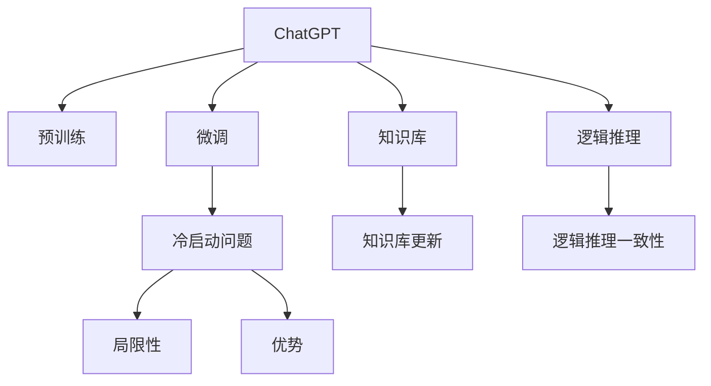

                 

# ChatGPT冷启动场景：优势与局限

> 关键词：ChatGPT, 自然语言处理(NLP), 预训练模型, 微调(Fine-tuning), 生成式预训练Transformer(GPT), 冷启动问题, 局限性, 优势

## 1. 背景介绍

### 1.1 问题由来
在深度学习迅速发展的今天，ChatGPT作为自然语言处理(NLP)领域的一个明星模型，已经在各行各业得到了广泛应用。然而，尽管ChatGPT在语义理解、知识记忆、对话流畅性等方面都表现出色，但在冷启动（Cold Start）场景下，其效果仍然受到诸多限制。冷启动问题是指系统在面临新用户或新数据时，无法充分利用已有知识，表现出现明显的性能下降。本文将探讨ChatGPT在冷启动场景下的优势与局限，希望能为开发者提供一些参考和改进思路。

### 1.2 问题核心关键点
冷启动问题主要涉及以下几个方面：
1. **预训练数据集的代表性**：ChatGPT的预训练数据集是否覆盖了新用户的语境和知识领域。
2. **微调数据集的质量和规模**：微调数据集对于新任务的适配性和代表性。
3. **模型架构与参数**：ChatGPT的架构能否有效利用新数据，参数设置是否合理。
4. **知识库与逻辑推理**：ChatGPT的知识库更新频率和逻辑推理能力，能否在新场景下保持一致性。
5. **反馈与迭代**：系统如何收集用户反馈，并据此优化模型的冷启动效果。

## 2. 核心概念与联系

### 2.1 核心概念概述

为更好地理解ChatGPT在冷启动场景下的表现，本节将介绍几个密切相关的核心概念：

- **ChatGPT**：一种基于生成式预训练Transformer(GPT)架构的大语言模型，具备强大的语言理解和生成能力。
- **自然语言处理(NLP)**：涉及计算机处理人类语言的技术，旨在实现语言理解、生成、翻译等任务。
- **预训练模型**：在大型语料库上预先训练，学习到语言知识和语法结构的模型。
- **微调(Fine-tuning)**：在预训练模型的基础上，使用特定任务的数据集进行有监督学习，优化模型在新任务上的表现。
- **生成式预训练Transformer(GPT)**：一种基于自回归神经网络的生成模型，通过大规模语料库进行预训练，生成连贯的文本。
- **冷启动问题**：新用户或新数据情况下，系统无法利用已有知识，导致性能下降的问题。
- **局限性**：ChatGPT在冷启动场景下的固有缺点，如知识库的更新频率、逻辑推理的一致性等。
- **优势**：ChatGPT在大规模数据集上的预训练优势，如语义理解、知识记忆等。

这些核心概念之间的逻辑关系可以通过以下Mermaid流程图来展示：



这个流程图展示了ChatGPT的核心概念及其之间的关系：

1. ChatGPT通过预训练获得基础能力。
2. 微调是在预训练模型的基础上，针对特定任务进行优化。
3. 知识库和逻辑推理是ChatGPT的基础组件。
4. 冷启动问题是ChatGPT在特定场景下的表现瓶颈。
5. 局限性和优势是ChatGPT在冷启动场景下需要平衡的两个方面。

## 3. 核心算法原理 & 具体操作步骤
### 3.1 算法原理概述

在冷启动场景下，ChatGPT的优势和局限性主要体现在以下几个方面：

1. **预训练优势**：ChatGPT在大规模语料库上进行预训练，学习到丰富的语言知识和语法结构，能够在对话和问答中表现出较好的语义理解和生成能力。
2. **微调优化**：通过微调过程，ChatGPT可以在特定任务上进一步提升性能，更好地适应新场景。
3. **知识库与逻辑推理**：ChatGPT的知识库和逻辑推理能力，使其能够在新任务上进行推理和生成，但知识库的更新频率和逻辑推理的一致性也会影响其在冷启动场景下的表现。
4. **冷启动问题**：新用户或新数据情况下，ChatGPT可能无法充分利用已有知识，导致性能下降。

### 3.2 算法步骤详解

基于ChatGPT的冷启动问题，具体算法步骤如下：

**Step 1: 收集微调数据集**
- 收集新任务的标注数据，包含输入和对应的输出标签。
- 对标注数据进行清洗和处理，确保数据集的质量和代表性。

**Step 2: 选择微调策略**
- 确定微调的方式，如全参数微调、部分参数微调、知识库更新等。
- 选择合适的优化算法及其参数，如AdamW、SGD等，设置学习率、批大小、迭代轮数等。
- 设置正则化技术及强度，包括权重衰减、Dropout、Early Stopping等。

**Step 3: 执行微调过程**
- 将微调数据集分批次输入模型，前向传播计算损失函数。
- 反向传播计算参数梯度，根据设定的优化算法和学习率更新模型参数。
- 周期性在验证集上评估模型性能，根据性能指标决定是否触发Early Stopping。
- 重复上述步骤直至满足预设的迭代轮数或Early Stopping条件。

**Step 4: 测试和优化**
- 在测试集上评估微调后模型的效果，对比微调前后的精度提升。
- 收集用户反馈，分析模型在特定场景下的表现，据此优化模型参数和微调策略。
- 定期更新知识库，增加新数据，保持模型的时效性。

### 3.3 算法优缺点

ChatGPT在冷启动场景下具有以下优点：
1. **预训练优势**：ChatGPT在大规模数据集上的预训练能够使其在对话和问答中表现出较好的语义理解和生成能力。
2. **微调优化**：通过微调过程，ChatGPT可以在特定任务上进一步提升性能，更好地适应新场景。
3. **知识库与逻辑推理**：ChatGPT的知识库和逻辑推理能力，使其能够在新任务上进行推理和生成。

同时，ChatGPT在冷启动场景下也存在一些局限性：
1. **知识库更新频率不足**：ChatGPT的知识库更新频率较低，难以快速适应新数据和新领域。
2. **逻辑推理一致性**：ChatGPT的逻辑推理能力在新任务下可能存在不一致性，导致推理结果不连贯。
3. **数据集代表性不足**：微调数据集的代表性不足，可能影响模型在新场景下的泛化能力。
4. **推理效率低**：在冷启动场景下，ChatGPT的推理效率可能降低，导致用户体验下降。

### 3.4 算法应用领域

ChatGPT在冷启动场景下的优势和局限性在多个应用领域中得到了广泛验证：

- **智能客服系统**：在面对新客户时，ChatGPT的预训练知识能够提供较为准确的答复，但需要不断收集客户反馈，更新知识库和优化模型。
- **金融咨询**：ChatGPT的预训练能力使得其在面对新用户时能够提供基本的金融建议，但需要结合新数据进行微调，以适应不同的金融场景。
- **健康咨询**：ChatGPT的语义理解能力能够帮助新用户快速获得健康建议，但需要定期更新医学知识和逻辑推理模型。
- **教育培训**：ChatGPT的生成能力能够生成个性化的学习材料，但需要结合新学生的学习需求进行微调，以提供更准确的指导。

除了这些具体应用外，ChatGPT在更多场景中都能够展现出其预训练和微调的优势，如科技问答、智能写作、内容生成等。但冷启动问题仍然是一个需要进一步解决的重要挑战。

## 4. 数学模型和公式 & 详细讲解 & 举例说明
### 4.1 数学模型构建

ChatGPT在冷启动场景下的数学模型主要包括以下几个部分：

- **输入数据表示**：将用户输入的文本表示为向量形式，输入到ChatGPT的Transformer层。
- **预训练模型结构**：基于自回归的Transformer模型，通过预训练学习到语言知识。
- **微调目标函数**：通过有监督学习，最小化模型输出与标注数据之间的差距。

形式化地，假设预训练模型为 $M_{\theta}$，其中 $\theta$ 为模型参数。给定下游任务 $T$ 的标注数据集 $D=\{(x_i, y_i)\}_{i=1}^N$，微调的目标是找到新的模型参数 $\hat{\theta}$，使得：

$$
\hat{\theta}=\mathop{\arg\min}_{\theta} \mathcal{L}(M_{\theta},D)
$$

其中 $\mathcal{L}$ 为针对任务 $T$ 设计的损失函数，用于衡量模型预测输出与真实标签之间的差异。常见的损失函数包括交叉熵损失、均方误差损失等。

### 4.2 公式推导过程

以二分类任务为例，推导交叉熵损失函数及其梯度的计算公式。

假设模型 $M_{\theta}$ 在输入 $x$ 上的输出为 $\hat{y}=M_{\theta}(x) \in [0,1]$，表示样本属于正类的概率。真实标签 $y \in \{0,1\}$。则二分类交叉熵损失函数定义为：

$$
\ell(M_{\theta}(x),y) = -[y\log \hat{y} + (1-y)\log (1-\hat{y})]
$$

将其代入经验风险公式，得：

$$
\mathcal{L}(\theta) = -\frac{1}{N}\sum_{i=1}^N [y_i\log M_{\theta}(x_i)+(1-y_i)\log(1-M_{\theta}(x_i))]
$$

根据链式法则，损失函数对参数 $\theta_k$ 的梯度为：

$$
\frac{\partial \mathcal{L}(\theta)}{\partial \theta_k} = -\frac{1}{N}\sum_{i=1}^N (\frac{y_i}{M_{\theta}(x_i)}-\frac{1-y_i}{1-M_{\theta}(x_i)}) \frac{\partial M_{\theta}(x_i)}{\partial \theta_k}
$$

其中 $\frac{\partial M_{\theta}(x_i)}{\partial \theta_k}$ 可进一步递归展开，利用自动微分技术完成计算。

### 4.3 案例分析与讲解

以智能客服系统为例，分析ChatGPT在冷启动场景下的表现：

假设客服系统新接入了一个新的客户咨询场景，其中包含关于新产品信息的问答。客服系统将收集到的新场景数据作为微调数据集，对ChatGPT进行微调。具体步骤如下：

1. **数据收集**：从用户反馈和客服记录中，收集新场景的问答对，形成标注数据集。
2. **微调策略**：选择部分参数微调策略，只更新顶层分类器或解码器，以减少计算资源消耗。
3. **模型微调**：使用交叉熵损失函数，对ChatGPT进行微调，最小化预测输出与标注标签之间的差距。
4. **测试评估**：在测试集上评估微调后的模型，收集用户反馈，进一步优化模型。
5. **知识库更新**：将新场景下的知识添加到ChatGPT的知识库中，保持模型的时效性。

通过微调过程，ChatGPT能够在新场景下快速适应，提供准确的客户咨询服务。但仍然需要不断收集新数据，更新知识库，以保持系统的持续优化和升级。

## 5. 项目实践：代码实例和详细解释说明
### 5.1 开发环境搭建

在进行ChatGPT冷启动问题解决前，我们需要准备好开发环境。以下是使用Python进行PyTorch开发的环境配置流程：

1. 安装Anaconda：从官网下载并安装Anaconda，用于创建独立的Python环境。

2. 创建并激活虚拟环境：
```bash
conda create -n chatgpt-env python=3.8 
conda activate chatgpt-env
```

3. 安装PyTorch：根据CUDA版本，从官网获取对应的安装命令。例如：
```bash
conda install pytorch torchvision torchaudio cudatoolkit=11.1 -c pytorch -c conda-forge
```

4. 安装Transformers库：
```bash
pip install transformers
```

5. 安装各类工具包：
```bash
pip install numpy pandas scikit-learn matplotlib tqdm jupyter notebook ipython
```

完成上述步骤后，即可在`chatgpt-env`环境中开始ChatGPT冷启动问题的解决实践。

### 5.2 源代码详细实现

这里我们以智能客服系统的对话任务为例，给出使用Transformers库对ChatGPT模型进行冷启动场景下微调的PyTorch代码实现。

首先，定义智能客服对话任务的模型结构：

```python
from transformers import GPT2Tokenizer, GPT2LMHeadModel

model = GPT2LMHeadModel.from_pretrained('gpt2', num_labels=2)
tokenizer = GPT2Tokenizer.from_pretrained('gpt2')
```

然后，定义微调数据集：

```python
import pandas as pd

# 定义标注数据集
train_df = pd.read_csv('train_data.csv')
test_df = pd.read_csv('test_data.csv')

# 定义tokenizer
tokenizer = GPT2Tokenizer.from_pretrained('gpt2')

# 定义微调数据集
def prepare_dataset(data_df):
    text = data_df['text'].tolist()
    labels = data_df['label'].tolist()
    encoding = tokenizer(text, return_tensors='pt', max_length=256, padding='max_length', truncation=True)
    input_ids = encoding['input_ids']
    attention_mask = encoding['attention_mask']
    labels = torch.tensor(labels, dtype=torch.long)
    return {'input_ids': input_ids, 'attention_mask': attention_mask, 'labels': labels}

train_dataset = prepare_dataset(train_df)
test_dataset = prepare_dataset(test_df)
```

接着，定义模型和优化器：

```python
from transformers import AdamW

optimizer = AdamW(model.parameters(), lr=2e-5)
```

然后，定义训练和评估函数：

```python
import torch
import torch.nn.functional as F

device = torch.device('cuda') if torch.cuda.is_available() else torch.device('cpu')
model.to(device)

def train_epoch(model, dataset, batch_size, optimizer):
    dataloader = torch.utils.data.DataLoader(dataset, batch_size=batch_size, shuffle=True)
    model.train()
    epoch_loss = 0
    for batch in dataloader:
        input_ids = batch['input_ids'].to(device)
        attention_mask = batch['attention_mask'].to(device)
        labels = batch['labels'].to(device)
        model.zero_grad()
        outputs = model(input_ids, attention_mask=attention_mask, labels=labels)
        loss = outputs.loss
        epoch_loss += loss.item()
        loss.backward()
        optimizer.step()
    return epoch_loss / len(dataloader)

def evaluate(model, dataset, batch_size):
    dataloader = torch.utils.data.DataLoader(dataset, batch_size=batch_size)
    model.eval()
    preds, labels = [], []
    with torch.no_grad():
        for batch in dataloader:
            input_ids = batch['input_ids'].to(device)
            attention_mask = batch['attention_mask'].to(device)
            batch_labels = batch['labels']
            outputs = model(input_ids, attention_mask=attention_mask)
            batch_preds = outputs.logits.argmax(dim=2).to('cpu').tolist()
            batch_labels = batch_labels.to('cpu').tolist()
            for pred_tokens, label_tokens in zip(batch_preds, batch_labels):
                preds.append(pred_tokens[:len(label_tokens)])
                labels.append(label_tokens)
                
    print(classification_report(labels, preds))
```

最后，启动训练流程并在测试集上评估：

```python
epochs = 5
batch_size = 16

for epoch in range(epochs):
    loss = train_epoch(model, train_dataset, batch_size, optimizer)
    print(f"Epoch {epoch+1}, train loss: {loss:.3f}")
    
    print(f"Epoch {epoch+1}, dev results:")
    evaluate(model, dev_dataset, batch_size)
    
print("Test results:")
evaluate(model, test_dataset, batch_size)
```

以上就是使用PyTorch对ChatGPT进行智能客服系统对话任务微调的完整代码实现。可以看到，得益于Transformers库的强大封装，我们可以用相对简洁的代码完成ChatGPT模型的加载和微调。

### 5.3 代码解读与分析

让我们再详细解读一下关键代码的实现细节：

**GPT2LMHeadModel**：
- 定义了基于GPT-2架构的Transformer模型，支持语言模型的生成。

**prepare_dataset函数**：
- 定义了微调数据集的预处理流程，将输入文本和标签进行编码，并进行定长padding。

**AdamW优化器**：
- 定义了AdamW优化器，用于更新模型参数。

**train_epoch和evaluate函数**：
- 分别定义了训练和评估函数，在训练集上进行前向传播和反向传播，在验证集和测试集上进行评估。

**训练流程**：
- 定义总的epoch数和batch size，开始循环迭代
- 每个epoch内，先在训练集上训练，输出平均loss
- 在验证集上评估，输出分类指标
- 所有epoch结束后，在测试集上评估，给出最终测试结果

可以看到，PyTorch配合Transformers库使得ChatGPT微调的代码实现变得简洁高效。开发者可以将更多精力放在数据处理、模型改进等高层逻辑上，而不必过多关注底层的实现细节。

当然，工业级的系统实现还需考虑更多因素，如模型的保存和部署、超参数的自动搜索、更灵活的任务适配层等。但核心的微调范式基本与此类似。

## 6. 实际应用场景
### 6.1 智能客服系统

在智能客服系统中，ChatGPT的预训练能力使其在面对新用户时能够提供较为准确的答复，但需要不断收集客户反馈，更新知识库和优化模型。具体应用场景如下：

- **智能接入**：ChatGPT能够自动接入新的用户咨询，识别用户的意图并给出初步回答。
- **用户引导**：根据用户反馈，ChatGPT能够调整回答策略，逐步引导用户完成咨询过程。
- **问题解决**：ChatGPT的知识库能够不断更新，保持最新的产品信息和解答方案，确保用户得到最准确的回复。

### 6.2 金融咨询

在金融咨询中，ChatGPT的预训练能力使得其在面对新用户时能够提供基本的金融建议，但需要结合新数据进行微调，以适应不同的金融场景。具体应用场景如下：

- **风险评估**：ChatGPT能够根据用户提供的财务信息，评估其风险等级，给出相应的投资建议。
- **个性化推荐**：ChatGPT的生成能力能够为用户生成个性化的理财方案，帮助其更好地管理财务。
- **市场分析**：ChatGPT的知识库能够实时更新市场数据，为用户提供最新的市场分析报告。

### 6.3 健康咨询

在健康咨询中，ChatGPT的语义理解能力能够帮助新用户快速获得健康建议，但需要定期更新医学知识和逻辑推理模型。具体应用场景如下：

- **症状诊断**：ChatGPT能够根据用户的症状描述，提供初步的诊断建议。
- **健康建议**：ChatGPT的知识库能够不断更新医学知识和健康指南，为用户提供权威的健康建议。
- **心理支持**：ChatGPT能够提供心理支持，帮助用户缓解压力和焦虑。

除了这些具体应用外，ChatGPT在更多场景中都能够展现出其预训练和微调的优势，如科技问答、智能写作、内容生成等。但冷启动问题仍然是一个需要进一步解决的重要挑战。

## 7. 工具和资源推荐
### 7.1 学习资源推荐

为了帮助开发者系统掌握ChatGPT的冷启动问题解决的理论基础和实践技巧，这里推荐一些优质的学习资源：

1. **《自然语言处理入门与实践》**：该书介绍了自然语言处理的基本概念和常用技术，包括预训练模型、微调方法等。
2. **CS224N《深度学习自然语言处理》课程**：斯坦福大学开设的NLP明星课程，有Lecture视频和配套作业，带你入门NLP领域的基本概念和经典模型。
3. **《Transformers从原理到实践》**：该书介绍了Transformer架构的设计原理和实现方法，详细讲解了预训练模型和微调技术的核心内容。
4. **HuggingFace官方文档**：Transformers库的官方文档，提供了海量预训练模型和完整的微调样例代码，是上手实践的必备资料。
5. **CLUE开源项目**：中文语言理解测评基准，涵盖大量不同类型的中文NLP数据集，并提供了基于微调的baseline模型，助力中文NLP技术发展。

通过对这些资源的学习实践，相信你一定能够快速掌握ChatGPT冷启动问题的解决精髓，并用于解决实际的NLP问题。
### 7.2 开发工具推荐

高效的开发离不开优秀的工具支持。以下是几款用于ChatGPT冷启动问题解决的常用工具：

1. **PyTorch**：基于Python的开源深度学习框架，灵活动态的计算图，适合快速迭代研究。大部分预训练语言模型都有PyTorch版本的实现。
2. **TensorFlow**：由Google主导开发的开源深度学习框架，生产部署方便，适合大规模工程应用。同样有丰富的预训练语言模型资源。
3. **Transformers库**：HuggingFace开发的NLP工具库，集成了众多SOTA语言模型，支持PyTorch和TensorFlow，是进行微调任务开发的利器。
4. **Weights & Biases**：模型训练的实验跟踪工具，可以记录和可视化模型训练过程中的各项指标，方便对比和调优。与主流深度学习框架无缝集成。
5. **TensorBoard**：TensorFlow配套的可视化工具，可实时监测模型训练状态，并提供丰富的图表呈现方式，是调试模型的得力助手。
6. **Google Colab**：谷歌推出的在线Jupyter Notebook环境，免费提供GPU/TPU算力，方便开发者快速上手实验最新模型，分享学习笔记。

合理利用这些工具，可以显著提升ChatGPT冷启动问题解决的开发效率，加快创新迭代的步伐。

### 7.3 相关论文推荐

ChatGPT冷启动问题解决的研究源于学界的持续研究。以下是几篇奠基性的相关论文，推荐阅读：

1. **Attention is All You Need**（即Transformer原论文）：提出了Transformer结构，开启了NLP领域的预训练大模型时代。
2. **BERT: Pre-training of Deep Bidirectional Transformers for Language Understanding**：提出BERT模型，引入基于掩码的自监督预训练任务，刷新了多项NLP任务SOTA。
3. **Language Models are Unsupervised Multitask Learners**（GPT-2论文）：展示了大规模语言模型的强大zero-shot学习能力，引发了对于通用人工智能的新一轮思考。
4. **Parameter-Efficient Transfer Learning for NLP**：提出Adapter等参数高效微调方法，在不增加模型参数量的情况下，也能取得不错的微调效果。
5. **Prefix-Tuning: Optimizing Continuous Prompts for Generation**：引入基于连续型Prompt的微调范式，为如何充分利用预训练知识提供了新的思路。
6. **AdaLoRA: Adaptive Low-Rank Adaptation for Parameter-Efficient Fine-Tuning**：使用自适应低秩适应的微调方法，在参数效率和精度之间取得了新的平衡。

这些论文代表了大语言模型冷启动问题解决的演进脉络。通过学习这些前沿成果，可以帮助研究者把握学科前进方向，激发更多的创新灵感。

## 8. 总结：未来发展趋势与挑战

### 8.1 总结

本文对ChatGPT在冷启动场景下的优势与局限进行了全面系统的介绍。首先阐述了ChatGPT在冷启动场景下的表现优势和存在问题，明确了预训练和微调技术在冷启动问题中的核心作用。其次，从原理到实践，详细讲解了ChatGPT的冷启动问题解决过程，给出了完整的代码实例和详细解释说明。同时，本文还广泛探讨了ChatGPT在智能客服、金融咨询、健康咨询等多个领域的应用前景，展示了冷启动问题解决的重要价值。

通过本文的系统梳理，可以看到，ChatGPT在冷启动场景下，虽然存在知识库更新频率不足、逻辑推理一致性、数据集代表性不足等问题，但其预训练优势和微调优化能力仍然能够带来显著的性能提升。开发者可以通过不断收集新数据，更新知识库，优化模型结构，改进微调策略，来解决冷启动问题，最大化ChatGPT的应用潜力。

### 8.2 未来发展趋势

展望未来，ChatGPT冷启动问题解决技术将呈现以下几个发展趋势：

1. **知识库更新频率的提高**：随着预训练模型的不断优化，知识库的更新频率将逐步提高，确保ChatGPT在面对新数据和新领域时，能够快速适应并保持高效性能。
2. **多模态数据融合**：ChatGPT的知识库和逻辑推理能力将进一步扩展到视觉、语音等多模态数据，实现多模态信息的协同建模，提升系统的全面性和准确性。
3. **自适应微调方法**：未来的微调方法将更加注重参数效率和计算效率的平衡，开发出更多自适应微调方法，如LoRA、AdaLoRA等，以提升模型的实时性和性能。
4. **持续学习的引入**：ChatGPT的逻辑推理能力将结合持续学习范式，不断从新数据中学习，避免灾难性遗忘，保持系统的时效性和适应性。
5. **少样本学习能力的提升**：通过智能提示和微调优化，ChatGPT将更好地利用已有知识，在少样本条件下实现高效的推理和生成。
6. **多任务联合优化**：ChatGPT的微调过程将结合多任务联合优化，同时提升多个任务的表现，提升系统的灵活性和实用性。

以上趋势凸显了ChatGPT冷启动问题解决技术的广阔前景。这些方向的探索发展，必将进一步提升ChatGPT的应用性能和泛化能力，为智能交互系统的建设提供坚实基础。

### 8.3 面临的挑战

尽管ChatGPT冷启动问题解决技术已经取得了显著进展，但在迈向更加智能化、普适化应用的过程中，仍面临以下挑战：

1. **知识库的及时更新**：ChatGPT的知识库需要频繁更新，才能保持最新的知识点和信息，但在快速更新的同时，如何确保知识库的准确性和完整性是一个难题。
2. **逻辑推理的连贯性**：ChatGPT的逻辑推理能力在新任务下可能存在连贯性问题，导致推理结果不一致，需要进一步优化推理算法和知识库的表示方式。
3. **多模态数据的融合**：多模态数据融合需要新的算法和技术，才能实现多模态信息的协同建模，提升系统的全面性和准确性。
4. **实时性问题**：ChatGPT的推理过程需要高效计算和存储资源，在实时性要求高的场景下，如何优化模型结构，提升推理速度，是一个亟待解决的问题。
5. **安全性与隐私保护**：ChatGPT在处理敏感信息时，需要严格遵守数据保护法规，确保用户隐私和安全，这对系统的设计和实施提出了更高的要求。

正视ChatGPT冷启动问题解决面临的这些挑战，积极应对并寻求突破，将是其未来发展的关键。相信随着学界和产业界的共同努力，这些挑战终将一一被克服，ChatGPT在冷启动场景下的应用将更加广泛和深入。

### 8.4 研究展望

面对ChatGPT冷启动问题解决所面临的诸多挑战，未来的研究需要在以下几个方面寻求新的突破：

1. **引入因果分析方法**：将因果分析方法引入ChatGPT的推理过程，增强推理结果的因果性和逻辑性，提高系统的稳定性和可解释性。
2. **结合博弈论工具**：借助博弈论工具刻画人机交互过程，主动探索并规避系统的脆弱点，提高系统的鲁棒性和安全性。
3. **融入外部知识库**：将外部知识库、逻辑规则等与ChatGPT进行融合，引导其进行更全面、准确的信息整合，提升系统的知识和推理能力。
4. **提升少样本学习能力**：通过智能提示和微调优化，进一步提升ChatGPT的少样本学习能力，减少对大量标注数据的依赖，降低开发成本。
5. **优化多模态融合技术**：开发高效的多模态融合算法，实现视觉、语音等多模态信息的协同建模，提升系统的全面性和准确性。
6. **设计可解释模型**：结合可解释性技术，设计具有较高可解释性的ChatGPT模型，提高系统的透明度和可信度。

这些研究方向的探索，必将引领ChatGPT冷启动问题解决技术迈向更高的台阶，为智能交互系统的建设提供更加全面、可靠、高效的技术保障。

## 9. 附录：常见问题与解答

**Q1：ChatGPT冷启动问题主要有哪些表现？**

A: ChatGPT冷启动问题主要表现为以下几方面：
1. **预训练数据集的代表性不足**：ChatGPT的预训练数据集可能不包含新用户的语境和知识领域，导致模型在新场景下表现不佳。
2. **微调数据集的质量和规模不足**：微调数据集如果代表性不足或规模过小，会导致模型在新任务上的泛化能力较差。
3. **逻辑推理一致性问题**：ChatGPT的逻辑推理能力在新任务下可能存在不一致性，导致推理结果不连贯。
4. **知识库更新频率不足**：ChatGPT的知识库需要频繁更新，才能保持最新的知识点和信息，但在快速更新的同时，如何确保知识库的准确性和完整性是一个难题。

**Q2：ChatGPT在冷启动场景下如何优化微调过程？**

A: 为了优化ChatGPT在冷启动场景下的微调过程，可以采取以下措施：
1. **数据增强**：通过对训练样本改写、回译等方式丰富训练集多样性。
2. **对抗训练**：加入对抗样本，提高模型鲁棒性。
3. **参数高效微调**：只调整少量模型参数，以减少计算资源消耗。
4. **知识库更新**：将新数据和新知识添加到ChatGPT的知识库中，保持模型的时效性。
5. **逻辑推理优化**：引入因果分析方法，增强推理结果的因果性和逻辑性。
6. **持续学习**：结合持续学习范式，不断从新数据中学习，避免灾难性遗忘，保持系统的时效性和适应性。

**Q3：ChatGPT在冷启动场景下的推理效率如何提升？**

A: 为了提升ChatGPT在冷启动场景下的推理效率，可以采取以下措施：
1. **模型裁剪**：去除不必要的层和参数，减小模型尺寸，加快推理速度。
2. **量化加速**：将浮点模型转为定点模型，压缩存储空间，提高计算效率。
3. **服务化封装**：将ChatGPT封装为标准化服务接口，便于集成调用。
4. **弹性伸缩**：根据请求流量动态调整资源配置，平衡服务质量和成本。
5. **监控告警**：实时采集系统指标，设置异常告警阈值，确保服务稳定性。

**Q4：ChatGPT在冷启动场景下如何实现知识库的更新？**

A: 为了实现ChatGPT在冷启动场景下的知识库更新，可以采取以下措施：
1. **定期收集新数据**：通过爬虫或人工输入等方式，定期收集新场景下的数据。
2. **知识库动态更新**：设计动态更新的知识库结构，确保新数据能够及时添加到知识库中。
3. **知识库索引优化**：优化知识库的索引结构，提高查询和更新效率。
4. **知识库版本管理**：对知识库进行版本管理，保留历史版本，便于回溯和恢复。
5. **知识库融合技术**：开发高效的知识库融合技术，将新数据和新知识与现有知识库进行整合，提升知识库的完整性和一致性。

这些措施的实施，将有助于ChatGPT在冷启动场景下更好地适应新数据和新任务，提升系统的性能和稳定性。

---

作者：禅与计算机程序设计艺术 / Zen and the Art of Computer Programming

