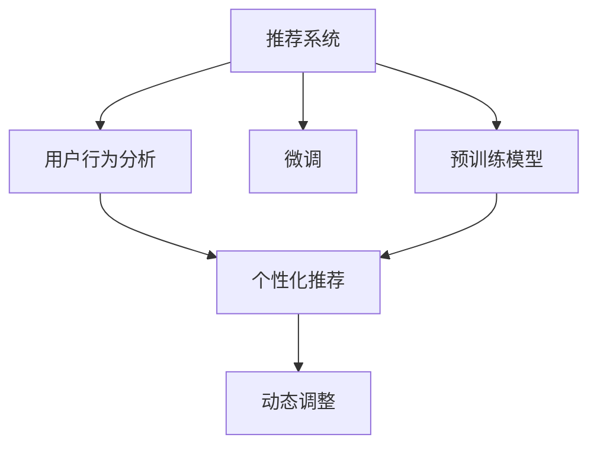

                 

# ChatGPT在推荐领域

> 关键词：推荐系统,ChatGPT,预训练模型,微调,用户行为分析,个性化推荐,自然语言处理(NLP)

## 1. 背景介绍

随着互联网和数字技术的迅猛发展，推荐系统已成为各大互联网平台的重要组成部分。从电商、新闻、社交媒体到在线视频、音频服务等，推荐系统在用户获取信息、满足需求、优化体验方面发挥了重要作用。然而，传统推荐系统主要基于协同过滤、内容推荐等算法，存在对用户行为数据依赖较大、推荐效果不够个性化、难以应对新兴领域挑战等问题。近年来，基于预训练大模型的推荐系统逐渐兴起，其中ChatGPT作为预训练语言模型的杰出代表，已经在推荐领域展现出广阔的应用前景。

### 1.1 问题由来

推荐系统的发展经历了从基于协同过滤的早期模型，到基于深度学习的基于用户行为分析的方法，再到如今基于预训练大模型的推荐。基于深度学习的推荐系统取得了一定的进展，但仍存在数据稀疏、推荐效果不够个性化等问题。ChatGPT等预训练大模型通过在大规模无标签文本语料上进行预训练，学习到丰富的语言知识和语义理解能力，能够更好地理解用户需求和反馈，为个性化推荐提供强有力的支持。

### 1.2 问题核心关键点

ChatGPT在推荐领域的应用，主要围绕以下几个核心关键点展开：

1. **预训练模型的引入**：利用大规模无标签文本语料进行预训练，获得通用的语言表示。
2. **微调与任务适配**：根据具体推荐任务需求，通过微调获取针对该任务的优化模型。
3. **用户行为分析**：结合用户行为数据和自然语言处理技术，进行深度用户画像。
4. **个性化推荐**：基于深度用户画像和预训练模型，生成个性化推荐内容。
5. **动态调整**：根据用户反馈和行为变化，实时调整推荐模型和策略。

这些关键点相互支撑，共同构成了ChatGPT在推荐领域的完整应用框架，为其在个性化推荐、冷启动推荐、推荐质量提升等方面提供了新的解决方案。

## 2. 核心概念与联系

### 2.1 核心概念概述

为更好地理解ChatGPT在推荐系统中的应用，本节将介绍几个密切相关的核心概念：

- **推荐系统(Recommendation System)**：旨在帮助用户发现感兴趣的商品、内容、服务等，提升用户体验和满意度。
- **预训练模型(Pre-trained Model)**：通过在大规模无标签文本数据上学习到的通用语言表示，预训练模型能够应对多种NLP任务，包括推荐。
- **微调(Fine-tuning)**：在预训练模型基础上，通过有监督学习获取针对特定任务的优化模型。
- **用户行为分析(Usage Behavior Analysis)**：通过分析用户的历史行为数据，构建深度用户画像，提升推荐系统的个性化水平。
- **个性化推荐(Personalized Recommendation)**：基于用户画像和预训练模型，生成个性化的推荐内容，满足用户差异化需求。
- **动态调整(Dynamic Adjustment)**：根据用户反馈和行为变化，实时更新推荐模型，提升推荐系统的适应性和稳定性。

这些核心概念之间的逻辑关系可以通过以下Mermaid流程图来展示：



这个流程图展示了几大核心概念之间的关系：

1. 推荐系统通过预训练模型和微调获取优化模型。
2. 用户行为分析提供深度用户画像。
3. 基于用户画像和预训练模型，生成个性化推荐。
4. 动态调整优化推荐模型，提升系统的实时性和稳定性。

这些概念共同构成了ChatGPT在推荐领域的核心应用框架，为其提供了一个系统化的解决思路。

## 3. 核心算法原理 & 具体操作步骤
### 3.1 算法原理概述

ChatGPT在推荐系统中的应用，主要基于预训练语言模型的微调技术。其核心思想是：利用预训练语言模型学习通用的语言表示，在推荐任务的少量标注数据上进行微调，获取能够匹配特定推荐任务的优化模型。

形式化地，假设预训练语言模型为 $M_{\theta}$，其中 $\theta$ 为预训练得到的模型参数。给定推荐任务 $T$ 的标注数据集 $D=\{(x_i, y_i)\}_{i=1}^N$，微调的目标是找到新的模型参数 $\hat{\theta}$，使得：

$$
\hat{\theta}=\mathop{\arg\min}_{\theta} \mathcal{L}(M_{\theta},D)
$$

其中 $\mathcal{L}$ 为针对任务 $T$ 设计的损失函数，用于衡量模型预测输出与真实标签之间的差异。常见的损失函数包括交叉熵损失、均方误差损失等。

通过梯度下降等优化算法，微调过程不断更新模型参数 $\theta$，最小化损失函数 $\mathcal{L}$，使得模型输出逼近真实标签。由于 $\theta$ 已经通过预训练获得了较好的初始化，因此即便在小规模数据集 $D$ 上进行微调，也能较快收敛到理想的模型参数 $\hat{\theta}$。

### 3.2 算法步骤详解

基于预训练大模型的推荐系统一般包括以下几个关键步骤：

**Step 1: 准备预训练模型和数据集**
- 选择合适的预训练语言模型 $M_{\theta}$ 作为初始化参数，如GPT-3、BERT等。
- 准备推荐任务 $T$ 的标注数据集 $D$，划分为训练集、验证集和测试集。一般要求标注数据与预训练数据的分布不要差异过大。

**Step 2: 添加推荐任务适配层**
- 根据任务类型，在预训练模型顶层设计合适的输出层和损失函数。
- 对于推荐任务，通常使用基于排序的交叉熵损失函数。

**Step 3: 设置微调超参数**
- 选择合适的优化算法及其参数，如 AdamW、SGD 等，设置学习率、批大小、迭代轮数等。
- 设置正则化技术及强度，包括权重衰减、Dropout、Early Stopping等。
- 确定冻结预训练参数的策略，如仅微调顶层，或全部参数都参与微调。

**Step 4: 执行梯度训练**
- 将训练集数据分批次输入模型，前向传播计算损失函数。
- 反向传播计算参数梯度，根据设定的优化算法和学习率更新模型参数。
- 周期性在验证集上评估模型性能，根据性能指标决定是否触发 Early Stopping。
- 重复上述步骤直到满足预设的迭代轮数或 Early Stopping 条件。

**Step 5: 测试和部署**
- 在测试集上评估微调后模型 $M_{\hat{\theta}}$ 的性能，对比微调前后的精度提升。
- 使用微调后的模型对新样本进行推理预测，集成到实际的应用系统中。
- 持续收集新的数据，定期重新微调模型，以适应数据分布的变化。

以上是基于预训练大模型的推荐系统的一般流程。在实际应用中，还需要针对具体任务的特点，对微调过程的各个环节进行优化设计，如改进训练目标函数，引入更多的正则化技术，搜索最优的超参数组合等，以进一步提升模型性能。

### 3.3 算法优缺点

基于预训练大模型的推荐系统具有以下优点：

1. **通用高效**：预训练模型在大规模文本数据上学习到丰富的语言知识，能够灵活适应多种推荐任务。
2. **数据利用率高**：预训练模型能够从大规模无标签文本中提取通用特征，提升了数据利用率。
3. **个性化推荐**：通过微调和用户行为分析，能够生成更加个性化的推荐内容，满足用户差异化需求。
4. **实时性高**：预训练模型的微调通常参数量较小，推理速度快，能够实时响应用户需求。
5. **可解释性强**：预训练模型的决策过程可以通过语言生成和解释，具有一定的可解释性。

同时，该方法也存在一定的局限性：

1. **标注数据需求高**：微调过程需要大量标注数据，如果标注数据不足，推荐效果可能不佳。
2. **模型复杂度高**：预训练模型参数量大，计算资源消耗高。
3. **过拟合风险**：微调模型可能对小规模数据过拟合，导致泛化性能下降。
4. **鲁棒性不足**：模型可能对输入数据的变化敏感，推荐效果不稳定。
5. **冷启动困难**：预训练模型需要大量历史数据进行微调，难以应对冷启动用户推荐问题。

尽管存在这些局限性，但就目前而言，基于预训练大模型的推荐系统仍然是大规模推荐系统的重要方向。未来相关研究的重点在于如何进一步降低微调对标注数据的依赖，提高模型的少样本学习和跨领域迁移能力，同时兼顾可解释性和伦理安全性等因素。

### 3.4 算法应用领域

基于预训练大模型的推荐系统，已经在电商、新闻、视频等多个领域得到广泛应用，其核心在于利用预训练语言模型的语言理解能力和微调技术，进行个性化推荐。具体应用场景包括：

- **电商推荐**：推荐商品、广告、优惠券等。通过微调模型结合用户历史购买记录和浏览行为，生成个性化推荐。
- **新闻推荐**：推荐新闻、文章、视频等。基于用户兴趣和阅读行为，动态调整推荐内容。
- **视频推荐**：推荐视频、综艺节目、电影等。通过微调模型预测用户兴趣，生成个性化推荐。
- **智能客服**：结合自然语言处理技术，自动回答用户咨询。通过微调模型理解用户意图，提供智能推荐服务。

除了这些经典应用外，基于预训练大模型的推荐系统还在内容创作、社区互动、智能游戏等更多场景中得到了创新性应用，为推荐系统的智能化水平带来了新的突破。

## 4. 数学模型和公式 & 详细讲解 & 举例说明

### 4.1 数学模型构建

本节将使用数学语言对基于预训练大模型的推荐系统进行更加严格的刻画。

记预训练语言模型为 $M_{\theta}$，其中 $\theta$ 为预训练得到的模型参数。假设推荐任务 $T$ 的训练集为 $D=\{(x_i, y_i)\}_{i=1}^N, x_i \in \mathcal{X}, y_i \in \mathcal{Y}$。

定义模型 $M_{\theta}$ 在数据样本 $(x,y)$ 上的损失函数为 $\ell(M_{\theta}(x),y)$，则在数据集 $D$ 上的经验风险为：

$$
\mathcal{L}(\theta) = \frac{1}{N}\sum_{i=1}^N \ell(M_{\theta}(x_i),y_i)
$$

微调的优化目标是最小化经验风险，即找到最优参数：

$$
\theta^* = \mathop{\arg\min}_{\theta} \mathcal{L}(\theta)
$$

在实践中，我们通常使用基于梯度的优化算法（如SGD、Adam等）来近似求解上述最优化问题。设 $\eta$ 为学习率，$\lambda$ 为正则化系数，则参数的更新公式为：

$$
\theta \leftarrow \theta - \eta \nabla_{\theta}\mathcal{L}(\theta) - \eta\lambda\theta
$$

其中 $\nabla_{\theta}\mathcal{L}(\theta)$ 为损失函数对参数 $\theta$ 的梯度，可通过反向传播算法高效计算。

### 4.2 公式推导过程

以下我们以电商推荐任务为例，推导基于排序的交叉熵损失函数及其梯度的计算公式。

假设模型 $M_{\theta}$ 在输入 $x$ 上的输出为 $\hat{y}=M_{\theta}(x) \in [0,1]$，表示样本属于推荐对象的概率。真实标签 $y \in \{0,1\}$。则排序交叉熵损失函数定义为：

$$
\ell(M_{\theta}(x),y) = -y\log \hat{y} - (1-y)\log (1-\hat{y})
$$

将其代入经验风险公式，得：

$$
\mathcal{L}(\theta) = -\frac{1}{N}\sum_{i=1}^N [y_i\log M_{\theta}(x_i)+(1-y_i)\log(1-M_{\theta}(x_i))]
$$

根据链式法则，损失函数对参数 $\theta_k$ 的梯度为：

$$
\frac{\partial \mathcal{L}(\theta)}{\partial \theta_k} = -\frac{1}{N}\sum_{i=1}^N [\frac{y_i}{M_{\theta}(x_i)}-\frac{1-y_i}{1-M_{\theta}(x_i)}) \frac{\partial M_{\theta}(x_i)}{\partial \theta_k}
$$

其中 $\frac{\partial M_{\theta}(x_i)}{\partial \theta_k}$ 可进一步递归展开，利用自动微分技术完成计算。

在得到损失函数的梯度后，即可带入参数更新公式，完成模型的迭代优化。重复上述过程直至收敛，最终得到适应推荐任务的最优模型参数 $\theta^*$。

## 5. 项目实践：代码实例和详细解释说明
### 5.1 开发环境搭建

在进行推荐系统开发前，我们需要准备好开发环境。以下是使用Python进行PyTorch开发的环境配置流程：

1. 安装Anaconda：从官网下载并安装Anaconda，用于创建独立的Python环境。

2. 创建并激活虚拟环境：
```bash
conda create -n pytorch-env python=3.8 
conda activate pytorch-env
```

3. 安装PyTorch：根据CUDA版本，从官网获取对应的安装命令。例如：
```bash
conda install pytorch torchvision torchaudio cudatoolkit=11.1 -c pytorch -c conda-forge
```

4. 安装Transformers库：
```bash
pip install transformers
```

5. 安装各类工具包：
```bash
pip install numpy pandas scikit-learn matplotlib tqdm jupyter notebook ipython
```

完成上述步骤后，即可在`pytorch-env`环境中开始推荐系统开发。

### 5.2 源代码详细实现

这里我们以电商推荐系统为例，给出使用Transformers库对GPT模型进行微调的PyTorch代码实现。

首先，定义电商推荐任务的标注数据集：

```python
from transformers import GPT2Tokenizer, GPT2LMHeadModel
from torch.utils.data import Dataset, DataLoader
import torch

class RecommendationDataset(Dataset):
    def __init__(self, texts, targets, tokenizer, max_len=128):
        self.texts = texts
        self.targets = targets
        self.tokenizer = tokenizer
        self.max_len = max_len
        
    def __len__(self):
        return len(self.texts)
    
    def __getitem__(self, item):
        text = self.texts[item]
        target = self.targets[item]
        
        encoding = self.tokenizer(text, return_tensors='pt', max_length=self.max_len, padding='max_length', truncation=True)
        input_ids = encoding['input_ids'][0]
        attention_mask = encoding['attention_mask'][0]
        
        # 对标签进行编码
        encoded_target = [target2id[target] for target in self.targets] 
        encoded_target.extend([target2id['O']] * (self.max_len - len(encoded_target)))
        labels = torch.tensor(encoded_target, dtype=torch.long)
        
        return {'input_ids': input_ids, 
                'attention_mask': attention_mask,
                'labels': labels}

# 标签与id的映射
target2id = {'O': 0, 'A': 1, 'B': 2, 'C': 3, 'D': 4}
id2target = {v: k for k, v in target2id.items()}

# 创建dataset
tokenizer = GPT2Tokenizer.from_pretrained('gpt2')

train_dataset = RecommendationDataset(train_texts, train_targets, tokenizer)
dev_dataset = RecommendationDataset(dev_texts, dev_targets, tokenizer)
test_dataset = RecommendationDataset(test_texts, test_targets, tokenizer)
```

然后，定义模型和优化器：

```python
from transformers import GPT2LMHeadModel, AdamW

model = GPT2LMHeadModel.from_pretrained('gpt2', num_labels=len(target2id))

optimizer = AdamW(model.parameters(), lr=2e-5)
```

接着，定义训练和评估函数：

```python
from tqdm import tqdm

device = torch.device('cuda') if torch.cuda.is_available() else torch.device('cpu')
model.to(device)

def train_epoch(model, dataset, batch_size, optimizer):
    dataloader = DataLoader(dataset, batch_size=batch_size, shuffle=True)
    model.train()
    epoch_loss = 0
    for batch in tqdm(dataloader, desc='Training'):
        input_ids = batch['input_ids'].to(device)
        attention_mask = batch['attention_mask'].to(device)
        labels = batch['labels'].to(device)
        model.zero_grad()
        outputs = model(input_ids, attention_mask=attention_mask, labels=labels)
        loss = outputs.loss
        epoch_loss += loss.item()
        loss.backward()
        optimizer.step()
    return epoch_loss / len(dataloader)

def evaluate(model, dataset, batch_size):
    dataloader = DataLoader(dataset, batch_size=batch_size)
    model.eval()
    preds, labels = [], []
    with torch.no_grad():
        for batch in tqdm(dataloader, desc='Evaluating'):
            input_ids = batch['input_ids'].to(device)
            attention_mask = batch['attention_mask'].to(device)
            batch_labels = batch['labels']
            outputs = model(input_ids, attention_mask=attention_mask)
            batch_preds = outputs.logits.argmax(dim=2).to('cpu').tolist()
            batch_labels = batch_labels.to('cpu').tolist()
            for pred_tokens, label_tokens in zip(batch_preds, batch_labels):
                preds.append(pred_tokens[:len(label_tokens)])
                labels.append(label_tokens)
                
    print(classification_report(labels, preds))
```

最后，启动训练流程并在测试集上评估：

```python
epochs = 5
batch_size = 16

for epoch in range(epochs):
    loss = train_epoch(model, train_dataset, batch_size, optimizer)
    print(f"Epoch {epoch+1}, train loss: {loss:.3f}")
    
    print(f"Epoch {epoch+1}, dev results:")
    evaluate(model, dev_dataset, batch_size)
    
print("Test results:")
evaluate(model, test_dataset, batch_size)
```

以上就是使用PyTorch对GPT模型进行电商推荐系统微调的完整代码实现。可以看到，得益于Transformers库的强大封装，我们可以用相对简洁的代码完成GPT模型的加载和微调。

### 5.3 代码解读与分析

让我们再详细解读一下关键代码的实现细节：

**RecommendationDataset类**：
- `__init__`方法：初始化文本、标签、分词器等关键组件。
- `__len__`方法：返回数据集的样本数量。
- `__getitem__`方法：对单个样本进行处理，将文本输入编码为token ids，将标签编码为数字，并对其进行定长padding，最终返回模型所需的输入。

**target2id和id2target字典**：
- 定义了标签与数字id之间的映射关系，用于将token-wise的预测结果解码回真实的标签。

**训练和评估函数**：
- 使用PyTorch的DataLoader对数据集进行批次化加载，供模型训练和推理使用。
- 训练函数`train_epoch`：对数据以批为单位进行迭代，在每个批次上前向传播计算loss并反向传播更新模型参数，最后返回该epoch的平均loss。
- 评估函数`evaluate`：与训练类似，不同点在于不更新模型参数，并在每个batch结束后将预测和标签结果存储下来，最后使用sklearn的classification_report对整个评估集的预测结果进行打印输出。

**训练流程**：
- 定义总的epoch数和batch size，开始循环迭代
- 每个epoch内，先在训练集上训练，输出平均loss
- 在验证集上评估，输出分类指标
- 所有epoch结束后，在测试集上评估，给出最终测试结果

可以看到，PyTorch配合Transformers库使得GPT微调的代码实现变得简洁高效。开发者可以将更多精力放在数据处理、模型改进等高层逻辑上，而不必过多关注底层的实现细节。

当然，工业级的系统实现还需考虑更多因素，如模型的保存和部署、超参数的自动搜索、更灵活的任务适配层等。但核心的微调范式基本与此类似。

## 6. 实际应用场景
### 6.1 电商推荐

基于预训练大模型的推荐系统，已经在电商推荐中得到了广泛应用。电商推荐系统通过分析用户浏览、购买行为等数据，为用户推荐相关商品，提升用户体验和销售额。

在技术实现上，可以收集用户历史购买、浏览、搜索等行为数据，利用预训练语言模型进行微调，获得能够匹配用户兴趣和行为的推荐模型。微调后的模型在输入用户的文本描述（如商品评论、搜索关键词等）时，能够快速生成个性化的推荐商品列表。此外，结合对抗样本生成、用户反馈反馈等技术，进一步优化推荐效果。

### 6.2 新闻推荐

新闻推荐系统旨在帮助用户发现感兴趣的新闻、文章等内容。通过微调预训练语言模型，新闻推荐系统能够理解和分析用户兴趣，生成个性化的新闻推荐内容。

具体而言，可以收集用户的历史阅读记录、点赞、分享等行为数据，利用预训练语言模型进行微调，获得用户兴趣的语义表示。在用户输入新的查询或兴趣描述时，微调模型能够理解和生成相关的文章和新闻推荐列表。同时，通过自然语言处理技术，进一步提升推荐的精准性和相关性。

### 6.3 视频推荐

视频推荐系统旨在为用户推荐感兴趣的视频内容，包括电影、电视剧、综艺节目等。通过微调预训练语言模型，视频推荐系统能够分析和理解用户兴趣，生成个性化的视频推荐列表。

具体而言，可以收集用户的观看历史、点赞、评论等行为数据，利用预训练语言模型进行微调，获得用户兴趣的语义表示。在用户输入新的查询或兴趣描述时，微调模型能够理解和生成相关视频推荐列表。同时，结合视频特征提取技术，进一步提升推荐的精准性和相关性。

### 6.4 智能客服

智能客服系统通过自然语言处理技术，自动回答用户咨询，提升客户服务效率。通过微调预训练语言模型，智能客服系统能够理解和分析用户问题，生成个性化的回答。

具体而言，可以收集用户的历史咨询记录、评分等行为数据，利用预训练语言模型进行微调，获得用户咨询的语义表示。在用户输入新的咨询问题时，微调模型能够理解和生成相关回答。同时，结合知识图谱、逻辑规则等外部知识库，进一步提升回答的准确性和全面性。

### 6.5 音乐推荐

音乐推荐系统旨在为用户推荐感兴趣的音乐、歌手等。通过微调预训练语言模型，音乐推荐系统能够分析和理解用户兴趣，生成个性化的音乐推荐列表。

具体而言，可以收集用户的听歌历史、收藏、分享等行为数据，利用预训练语言模型进行微调，获得用户兴趣的语义表示。在用户输入新的查询或兴趣描述时，微调模型能够理解和生成相关音乐推荐列表。同时，结合音乐特征提取技术，进一步提升推荐的精准性和相关性。

### 6.6 游戏推荐

游戏推荐系统旨在为用户推荐感兴趣的游戏内容，包括角色、道具、关卡等。通过微调预训练语言模型，游戏推荐系统能够分析和理解用户兴趣，生成个性化的游戏推荐列表。

具体而言，可以收集用户的游玩历史、消费、评价等行为数据，利用预训练语言模型进行微调，获得用户兴趣的语义表示。在用户输入新的查询或兴趣描述时，微调模型能够理解和生成相关游戏推荐列表。同时，结合游戏特征提取技术，进一步提升推荐的精准性和相关性。

### 6.7 学习资源推荐

学习资源推荐系统旨在为用户推荐感兴趣的学习资源，包括课程、教材、电子书等。通过微调预训练语言模型，学习资源推荐系统能够分析和理解用户兴趣，生成个性化的学习资源推荐列表。

具体而言，可以收集用户的历史学习记录、搜索、评价等行为数据，利用预训练语言模型进行微调，获得用户兴趣的语义表示。在用户输入新的查询或兴趣描述时，微调模型能够理解和生成相关学习资源推荐列表。同时，结合学习资源特征提取技术，进一步提升推荐的精准性和相关性。

## 7. 工具和资源推荐
### 7.1 学习资源推荐

为了帮助开发者系统掌握预训练大模型在推荐系统中的应用，这里推荐一些优质的学习资源：

1. 《Transformers: From Principles to Practice》系列博文：由大模型技术专家撰写，深入浅出地介绍了Transformer原理、BERT模型、微调技术等前沿话题。

2. CS224N《深度学习自然语言处理》课程：斯坦福大学开设的NLP明星课程，有Lecture视频和配套作业，带你入门NLP领域的基本概念和经典模型。

3. 《Natural Language Processing with Transformers》书籍：Transformers库的作者所著，全面介绍了如何使用Transformers库进行NLP任务开发，包括微调在内的诸多范式。

4. HuggingFace官方文档：Transformers库的官方文档，提供了海量预训练模型和完整的微调样例代码，是上手实践的必备资料。

5. OpenAI GPT-3文档：GPT-3模型的官方文档，详细介绍了GPT-3的架构、微调方法、推理技巧等，是使用GPT-3进行推荐系统开发的权威参考。

通过对这些资源的学习实践，相信你一定能够快速掌握预训练大模型在推荐系统中的应用，并用于解决实际的NLP问题。
### 7.2 开发工具推荐

高效的开发离不开优秀的工具支持。以下是几款用于预训练大模型推荐系统开发的常用工具：

1. PyTorch：基于Python的开源深度学习框架，灵活动态的计算图，适合快速迭代研究。大部分预训练语言模型都有PyTorch版本的实现。

2. TensorFlow：由Google主导开发的开源深度学习框架，生产部署方便，适合大规模工程应用。同样有丰富的预训练语言模型资源。

3. Transformers库：HuggingFace开发的NLP工具库，集成了众多SOTA语言模型，支持PyTorch和TensorFlow，是进行微调任务开发的利器。

4. Weights & Biases：模型训练的实验跟踪工具，可以记录和可视化模型训练过程中的各项指标，方便对比和调优。与主流深度学习框架无缝集成。

5. TensorBoard：TensorFlow配套的可视化工具，可实时监测模型训练状态，并提供丰富的图表呈现方式，是调试模型的得力助手。

6. Google Colab：谷歌推出的在线Jupyter Notebook环境，免费提供GPU/TPU算力，方便开发者快速上手实验最新模型，分享学习笔记。

合理利用这些工具，可以显著提升预训练大模型推荐系统的开发效率，加快创新迭代的步伐。

### 7.3 相关论文推荐

预训练大模型在推荐领域的发展源于学界的持续研究。以下是几篇奠基性的相关论文，推荐阅读：

1. Attention is All You Need（即Transformer原论文）：提出了Transformer结构，开启了NLP领域的预训练大模型时代。

2. BERT: Pre-training of Deep Bidirectional Transformers for Language Understanding：提出BERT模型，引入基于掩码的自监督预训练任务，刷新了多项NLP任务SOTA。

3. Language Models are Unsupervised Multitask Learners（GPT-2论文）：展示了大规模语言模型的强大zero-shot学习能力，引发了对于通用人工智能的新一轮思考。

4. Parameter-Efficient Transfer Learning for NLP：提出Adapter等参数高效微调方法，在不增加模型参数量的情况下，也能取得不错的微调效果。

5. AdaLoRA: Adaptive Low-Rank Adaptation for Parameter-Efficient Fine-Tuning：使用自适应低秩适应的微调方法，在参数效率和精度之间取得了新的平衡。

这些论文代表了大模型在推荐领域的应用进展。通过学习这些前沿成果，可以帮助研究者把握学科前进方向，激发更多的创新灵感。

## 8. 总结：未来发展趋势与挑战
### 8.1 总结

本文对基于预训练大模型的推荐系统进行了全面系统的介绍。首先阐述了预训练大模型和微调技术在推荐系统中的应用背景和意义，明确了其在提升推荐个性化和实时性方面的独特价值。其次，从原理到实践，详细讲解了基于预训练大模型的推荐系统的数学原理和关键步骤，给出了微调任务开发的完整代码实例。同时，本文还广泛探讨了基于预训练大模型的推荐系统在电商、新闻、视频、智能客服等多个领域的应用前景，展示了其在智能化推荐中的应用潜力。此外，本文精选了预训练大模型在推荐系统中的应用资源，力求为读者提供全方位的技术指引。

通过本文的系统梳理，可以看到，基于预训练大模型的推荐系统已经在推荐领域取得了显著成效，为传统推荐系统注入了新的活力。未来，伴随预训练语言模型和微调方法的不断演进，基于预训练大模型的推荐系统必将在更多领域大放异彩，推动推荐系统的智能化水平迈上新的台阶。

### 8.2 未来发展趋势

展望未来，预训练大模型在推荐领域的应用将呈现以下几个发展趋势：

1. **模型规模持续增大**：随着算力成本的下降和数据规模的扩张，预训练语言模型的参数量还将持续增长。超大规模语言模型蕴含的丰富语言知识，有望支撑更加复杂多变的推荐任务。

2. **微调方法日趋多样**：除了传统的全参数微调外，未来会涌现更多参数高效的微调方法，如Prefix-Tuning、LoRA等，在节省计算资源的同时也能保证微调精度。

3. **实时性提升**：基于预训练大模型的推荐系统能够实时响应用户需求，具备更高的实时性。通过分布式训练和推理，能够进一步提升推荐系统的响应速度。

4. **跨领域迁移能力增强**：预训练大模型在跨领域迁移方面具有优势，未来将进一步探索如何利用预训练模型在不同领域进行微调，提升推荐系统的泛化能力。

5. **多模态推荐系统崛起**：未来的推荐系统将越来越多地融合多模态信息，结合文本、图像、音频等多种数据，提升推荐系统的智能化水平。

6. **个性化推荐技术提升**：基于预训练大模型的推荐系统将结合自然语言处理、因果推断、增强学习等技术，提升推荐模型的个性化水平，更精准地满足用户需求。

以上趋势凸显了基于预训练大模型的推荐系统的广阔前景。这些方向的探索发展，必将进一步提升推荐系统的性能和应用范围，为智能化推荐提供更全面的技术支撑。

### 8.3 面临的挑战

尽管基于预训练大模型的推荐系统已经取得了瞩目成就，但在迈向更加智能化、普适化应用的过程中，它仍面临着诸多挑战：

1. **标注数据需求高**：微调过程需要大量标注数据，如果标注数据不足，推荐效果可能不佳。如何进一步降低微调对标注样本的依赖，将是一大难题。

2. **模型复杂度高**：预训练模型参数量大，计算资源消耗高。如何高效利用计算资源，提升模型训练和推理的效率，仍是重要的优化方向。

3. **过拟合风险**：微调模型可能对小规模数据过拟合，导致泛化性能下降。如何缓解过拟合风险，提升模型的泛化能力，还需进一步研究。

4. **鲁棒性不足**：模型可能对输入数据的变化敏感，推荐效果不稳定。如何提高模型的鲁棒性，增强对噪声和异常数据的处理能力，仍是重要的研究课题。

5. **冷启动困难**：预训练模型需要大量历史数据进行微调，难以应对冷启动用户推荐问题。如何在有限数据下进行快速推荐，仍是重要的优化方向。

尽管存在这些挑战，但预训练大模型在推荐系统中的应用前景广阔，未来仍需不断探索和优化，才能充分发挥其在推荐系统中的潜力。

### 8.4 研究展望

面向未来，预训练大模型在推荐系统中的应用将不断突破，展现出新的应用场景和技术路径：

1. **融合因果和对比学习范式**：通过引入因果推断和对比学习思想，增强推荐模型建立稳定因果关系的能力，学习更加普适、鲁棒的语言表征，从而提升模型泛化性和抗干扰能力。

2. **结合增强学习技术**：将增强学习技术引入推荐系统，利用用户反馈进行动态调整，进一步优化推荐效果。

3. **融入知识图谱**：将知识图谱与预训练大模型结合，提升推荐系统的解释性和可解释性。

4. **跨领域推荐系统**：结合不同领域的知识库和数据源，构建跨领域推荐系统，提升推荐系统的泛化能力和适应性。

5. **实时推荐系统**：通过分布式训练和推理，构建实时推荐系统，提升推荐系统的响应速度和实时性。

6. **多模态推荐系统**：结合文本、图像、音频等多种数据，构建多模态推荐系统，提升推荐系统的智能化水平。

这些研究方向的探索，必将引领基于预训练大模型的推荐系统迈向更高的台阶，为智能化推荐提供更全面的技术支撑。面向未来，预训练大模型在推荐系统中的应用还需与其他人工智能技术进行更深入的融合，如知识表示、因果推理、强化学习等，多路径协同发力，共同推动推荐系统的智能化水平。只有勇于创新、敢于突破，才能不断拓展预训练大模型的边界，让智能化推荐系统更好地服务于人类。

## 9. 附录：常见问题与解答

**Q1：预训练大模型在推荐系统中的优缺点有哪些？**

A: 预训练大模型在推荐系统中的优点包括：

1. **通用高效**：预训练模型在大规模文本数据上学习到丰富的语言知识，能够灵活适应多种推荐任务。
2. **数据利用率高**：预训练模型能够从大规模无标签文本中提取通用特征，提升了数据利用率。
3. **个性化推荐**：通过微调和用户行为分析，能够生成更加个性化的推荐内容，满足用户差异化需求。
4. **实时性高**：预训练模型的微调通常参数量较小，推理速度快，能够实时响应用户需求。
5. **可解释性强**：预训练模型的决策过程可以通过语言生成和解释，具有一定的可解释性。

但预训练大模型在推荐系统中也存在一些缺点，包括：

1. **标注数据需求高**：微调过程需要大量标注数据，如果标注数据不足，推荐效果可能不佳。
2. **模型复杂度高**：预训练模型参数量大，计算资源消耗高。
3. **过拟合风险**：微调模型可能对小规模数据过拟合，导致泛化性能下降。
4. **鲁棒性不足**：模型可能对输入数据的变化敏感，推荐效果不稳定。
5. **冷启动困难**：预训练模型需要大量历史数据进行微调，难以应对冷启动用户推荐问题。

**Q2：如何缓解预训练大模型在推荐系统中的过拟合风险？**

A: 缓解预训练大模型在推荐系统中的过拟合风险，可以采取以下几种方法：

1. **数据增强**：通过对训练样本改写、回译等方式丰富训练集多样性，缓解过拟合风险。
2. **正则化技术**：如L2正则、Dropout、Early Stopping等，防止模型过度适应小规模训练集。
3. **参数高效微调**：只调整少量模型参数，而固定大部分预训练权重不变，以提高微调效率，避免过拟合。
4. **对抗训练**：加入对抗样本，提高模型鲁棒性，进一步缓解过拟合风险。
5. **多模型集成**：训练多个预训练大模型，取平均输出，抑制过拟合。

这些方法往往需要根据具体任务和数据特点进行灵活组合，以最大限度地减少过拟合风险。

**Q3：预训练大模型在推荐系统中的冷启动问题如何解决？**

A: 预训练大模型在推荐系统中的冷启动问题，可以通过以下几种方式解决：

1. **零样本学习**：通过在输入中提供少量示例，利用预训练模型的语言理解能力，直接生成推荐结果，无需微调。
2. **少样本学习**：结合预训练模型和用户行为数据，通过精心设计的输入模板，进行少样本学习，生成推荐内容。
3. **基于对抗样本的推荐**：通过设计对抗样本，引导预训练模型生成推荐内容，缓解冷启动问题。

这些方法可以在冷启动用户推荐中提供更快速、准确的推荐服务。

**Q4：预训练大模型在推荐系统中的可解释性如何提升？**

A: 预训练大模型在推荐系统中的可解释性可以通过以下几种方式提升：

1. **自然语言处理技术**：结合自然语言处理技术，对模型决策过程进行分析和解释。
2. **可视化工具**：利用可视化工具，展示模型的内部参数和推理过程，提升模型的可解释性。
3. **特征重要性分析**：通过特征重要性分析，揭示模型决策的关键特征，增强解释性。
4. **规则约束**：在推荐模型中加入规则约束，增强推荐的逻辑性和可解释性。

这些方法可以帮助提升预训练大模型在推荐系统中的可解释性，增强用户信任和系统稳定性。

**Q5：预训练大模型在推荐系统中的推荐质量如何提升？**

A: 预训练大模型在推荐系统中的推荐质量可以通过以下几种方式提升：

1. **动态调整**：根据用户反馈和行为变化，实时调整推荐模型和策略，提升推荐质量。
2. **多任务学习**：结合多种推荐任务，提升模型泛化能力和推荐质量。
3. **跨领域迁移**：利用预训练模型在跨领域迁移方面的优势，提升推荐系统的泛化能力和推荐质量。
4. **融合外部知识**：结合外部知识库和规则库，增强推荐模型的解释性和推荐质量。
5. **多模态融合**：结合多模态数据，提升推荐系统的智能化水平和推荐质量。

这些方法可以帮助提升预训练大模型在推荐系统中的推荐质量，提升用户体验和满意度。

**Q6：预训练大模型在推荐系统中的实时性如何优化？**

A: 预训练大模型在推荐系统中的实时性可以通过以下几种方式优化：

1. **分布式训练**：利用分布式训练技术，加快模型训练速度，提升实时性。
2. **量化加速**：通过量化技术，将浮点模型转为定点模型，提升计算效率，优化实时性。
3. **模型裁剪**：去除不必要的层和参数，减小模型尺寸，加快推理速度，优化实时性。
4. **缓存机制**：通过缓存机制，减少重复计算，提升实时响应速度。
5. **推理优化**：利用推理优化技术，提升模型推理速度，优化实时性。

这些方法可以帮助优化预训练大模型在推荐系统中的实时性，提升用户体验和系统效率。

**Q7：预训练大模型在推荐系统中的冷启动问题如何解决？**

A: 预训练大模型在推荐系统中的冷启动问题可以通过以下几种方式解决：

1. **零样本学习**：通过在输入中提供少量示例，利用预训练模型的语言理解能力，直接生成推荐结果，无需微调。
2. **少样本学习**：结合预训练模型和用户行为数据，通过精心设计的输入模板，进行少样本学习，生成推荐内容。
3. **基于对抗样本的推荐**：通过设计对抗样本，引导预训练模型生成推荐内容，缓解冷启动问题。

这些方法可以在冷启动用户推荐中提供更快速、准确的推荐服务。

**Q8：预训练大模型在推荐系统中的可解释性如何提升？**

A: 预训练大模型在推荐系统中的可解释性可以通过以下几种方式提升：

1. **自然语言处理技术**：结合自然语言处理技术，对模型决策过程进行分析和解释。
2. **可视化工具**：利用可视化工具，展示模型的内部参数和推理过程，提升模型的可解释性。
3. **特征重要性分析**：通过特征重要性分析，揭示模型决策的关键特征，增强解释性。
4. **规则约束**：在推荐模型中加入规则约束，增强推荐的逻辑性和可解释性。

这些方法可以帮助提升预训练大模型在推荐系统中的可解释性，增强用户信任和系统稳定性。

**Q9：预训练大模型在推荐系统中的推荐质量如何提升？**

A: 预训练大模型在推荐系统中的推荐质量可以通过以下几种方式提升：

1. **动态调整**：根据用户反馈和行为变化，实时调整推荐模型和策略，提升推荐质量。
2. **多任务学习**：结合多种推荐任务，提升模型泛化能力和推荐质量。
3. **跨领域迁移**：利用预训练模型在跨领域迁移方面的优势，提升推荐系统的泛化能力和推荐质量。
4. **融合外部知识**：结合外部知识库和规则库，增强推荐模型的解释性和推荐质量。
5. **多模态融合**：结合多模态数据，提升推荐系统的智能化水平和推荐质量。

这些方法可以帮助提升预训练大模型在推荐系统中的推荐质量

