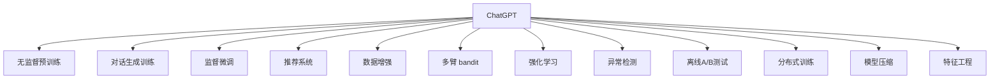

                 

## 1. 背景介绍

### 1.1 问题由来
在人工智能快速发展的今天，推荐系统作为提升用户体验、增加平台收益的重要手段，日益受到各行各业的重视。传统的协同过滤、基于内容的推荐方法已经难以满足用户个性化需求，基于深度学习的推荐系统应运而生，其中基于 Transformer 的推荐模型（如基于 Transformer 的序列建模、图神经网络等）逐渐成为主流。

然而，尽管深度推荐系统在个性化推荐上取得了显著成效，但在真实世界数据上存在诸如训练时间长、数据偏等问题。ChatGPT 作为 OpenAI 推出的通用大模型，其通过大规模无监督学习和大规模监督学习的深度融合，逐渐展现出更强大的语言理解和生成能力，同时其在个性化推荐上也有着一定的应用潜力。

### 1.2 问题核心关键点
本篇文章将重点介绍ChatGPT在推荐领域的应用。首先，我们将从 ChatGPT 的核心原理和推荐系统的核心范式出发，探讨其在日常推荐系统中的应用和改进方案。其次，我们也将从技术角度讨论 ChatGPT 在推荐系统中的优势和局限性。最后，我们将对ChatGPT在未来推荐系统中的发展方向进行展望。

## 2. 核心概念与联系

### 2.1 核心概念概述
#### 2.1.1 聊天生成预训练模型(ChatGPT)
ChatGPT 是由 OpenAI 推出的大规模预训练语言模型，其通过大量的无监督语言数据进行自监督训练，学习到语言生成的规则，具备强大的语义理解和生成能力。ChatGPT 通过对话生成任务进行预训练，使其能够处理各种自然语言输入，并生成符合语境的回应。

#### 2.1.2 推荐系统
推荐系统通过分析用户的历史行为、偏好等数据，为用户推荐个性化内容。常见的推荐系统包括基于协同过滤、基于内容的推荐、基于深度学习的推荐等。其中，基于深度学习的推荐系统通过神经网络模型学习用户-物品关系，生成推荐结果。

### 2.2 核心概念原理和架构的 Mermaid 流程图



该流程图展示了 ChatGPT 在推荐系统中的作用和流程：
- A：ChatGPT
- B：无监督预训练
- C：对话生成训练
- D：监督微调
- E：推荐系统
- F：数据增强
- G：多臂 bandit
- H：强化学习
- I：异常检测
- J：离线A/B测试
- K：分布式训练
- L：模型压缩
- M：特征工程

## 3. 核心算法原理 & 具体操作步骤
### 3.1 算法原理概述

ChatGPT 在推荐系统中的应用主要是通过其强大的语言理解能力和生成能力，实现用户的意图识别和推荐内容的生成。其核心原理可以分为以下三个阶段：

1. **预训练阶段**：ChatGPT 在大量无标签文本数据上进行预训练，学习到语言的通用表示，特别是能够处理复杂的语言结构和语义。

2. **对话生成训练**：在预训练的基础上，ChatGPT 通过对话生成任务进行进一步训练，使其能够理解用户的输入，并生成符合用户期望的输出。

3. **监督微调**：将ChatGPT模型应用于推荐系统，通过少量标注数据进行监督微调，使其能够准确预测用户对物品的评分或点击行为。

### 3.2 算法步骤详解

**步骤 1：预训练和对话生成训练**

1. **数据准备**：收集大规模无标签文本数据，使用自然语言处理技术对其进行预处理，如分词、去除停用词、构建词汇表等。

2. **预训练模型构建**：构建基于 Transformer 的预训练模型，使用大规模无标签文本数据进行训练，学习语言的通用表示。

3. **对话生成训练**：在预训练的基础上，使用对话数据进行进一步训练，使模型能够理解用户的输入，并生成符合用户期望的输出。

**步骤 2：监督微调**

1. **数据准备**：收集用户与物品的交互数据，将其标注为评分或点击行为，构建监督数据集。

2. **微调模型构建**：将预训练的ChatGPT模型用于推荐系统的监督微调，构建推荐模型。

3. **微调过程**：使用监督数据集对模型进行微调，最小化预测结果与真实标签的差距，调整模型参数，使其能够准确预测用户的行为。

**步骤 3：推荐系统集成**

1. **模型集成**：将微调后的ChatGPT模型集成到推荐系统中，用于预测用户对物品的评分或点击行为。

2. **推荐策略**：设计推荐策略，如基于评分预测的推荐、基于点击预测的推荐等，对用户进行推荐。

3. **评估与优化**：使用离线A/B测试、异常检测等手段，评估推荐系统的性能，并不断优化推荐策略和模型参数。

### 3.3 算法优缺点

**优点**

1. **通用性强**：ChatGPT 具备强大的语言理解能力和生成能力，能够处理多种自然语言输入，适用于多种推荐场景。

2. **可解释性强**：ChatGPT 通过对话生成训练，能够理解用户的意图，生成符合语境的输出，有助于解释推荐结果。

3. **性能提升显著**：ChatGPT 通过预训练和微调，能够在少量标注数据下取得显著的性能提升，适合数据较少的推荐系统。

**缺点**

1. **训练成本高**：ChatGPT 作为大规模预训练模型，训练成本较高，需要大量的计算资源。

2. **过拟合风险**：ChatGPT 在微调过程中容易过拟合，特别是在数据量较小的情况下，需要通过正则化等技术进行缓解。

3. **依赖高质量标注数据**：ChatGPT 在微调过程中依赖高质量标注数据，标注成本较高。

### 3.4 算法应用领域

ChatGPT 在推荐系统中的应用主要包括以下几个方面：

1. **个性化推荐**：ChatGPT 通过理解用户输入，生成符合用户期望的推荐内容，实现个性化推荐。

2. **用户意图识别**：ChatGPT 通过对话生成训练，能够理解用户的查询意图，帮助推荐系统提供更准确的推荐。

3. **内容生成**：ChatGPT 通过对话生成训练，能够生成符合语境的文本内容，用于推荐系统的多轮对话推荐。

4. **多模态推荐**：ChatGPT 能够处理文本、图片等多种模态的数据，实现多模态推荐。

5. **情感分析**：ChatGPT 通过对话生成训练，能够理解用户情感，用于情感导向的推荐。

## 4. 数学模型和公式 & 详细讲解 & 举例说明

### 4.1 数学模型构建

我们将从以下几个方面来构建 ChatGPT 在推荐系统中的数学模型：

1. **预训练模型的数学表示**：
   - 假设预训练模型为 $M_{\theta}$，其中 $\theta$ 为预训练得到的模型参数。

2. **对话生成训练的数学表示**：
   - 假设用户输入为 $x_i$，模型生成的回应为 $\hat{y}_i$，则对话生成任务的目标函数为：
   $$
   \mathcal{L}_{d}(\theta) = \sum_{i=1}^{n} -\log p_{\theta}(\hat{y}_i | x_i)
   $$

3. **监督微调的数学表示**：
   - 假设用户与物品的交互数据为 $(x_i, y_i)$，其中 $y_i$ 为用户对物品的评分或点击行为。则监督微调的目标函数为：
   $$
   \mathcal{L}_{s}(\theta) = \sum_{i=1}^{n} -y_i\log p_{\theta}(y_i)
   $$

### 4.2 公式推导过程

**预训练模型的推导**

- 预训练模型 $M_{\theta}$ 通过自监督学习任务进行训练，假设训练数据集为 $D$，则目标函数为：
  $$
  \mathcal{L}_{p}(\theta) = \sum_{(x,y) \in D} -\log p_{\theta}(y | x)
  $$

**对话生成训练的推导**

- 假设用户输入为 $x_i$，模型生成的回应为 $\hat{y}_i$，则对话生成任务的目标函数为：
  $$
  \mathcal{L}_{d}(\theta) = \sum_{i=1}^{n} -\log p_{\theta}(\hat{y}_i | x_i)
  $$
  其中 $p_{\theta}(\hat{y}_i | x_i)$ 为模型在输入 $x_i$ 下生成回应 $\hat{y}_i$ 的概率。

**监督微调的推导**

- 假设用户与物品的交互数据为 $(x_i, y_i)$，其中 $y_i$ 为用户对物品的评分或点击行为。则监督微调的目标函数为：
  $$
  \mathcal{L}_{s}(\theta) = \sum_{i=1}^{n} -y_i\log p_{\theta}(y_i)
  $$
  其中 $p_{\theta}(y_i)$ 为模型对用户评分或点击行为的预测概率。

### 4.3 案例分析与讲解

**案例分析**：假设某电商平台收集了用户对不同商品的评分数据，构建了推荐系统。用户对商品的评分数据如下：

| 用户 | 商品ID | 评分 |
| --- | --- | --- |
| 用户1 | 商品1 | 5 |
| 用户1 | 商品2 | 3 |
| 用户2 | 商品1 | 4 |
| 用户2 | 商品3 | 2 |

**讲解**：
1. **预训练模型的构建**：使用大规模无标签文本数据对预训练模型 $M_{\theta}$ 进行训练，学习到语言的通用表示。
2. **对话生成训练**：将用户输入的商品ID作为对话数据，使用 ChatGPT 模型进行对话生成训练，使模型能够理解用户输入。
3. **监督微调的实施**：将用户评分数据作为监督数据，对ChatGPT模型进行微调，最小化预测结果与真实评分的差距。

**模型评估**：使用离线A/B测试对微调后的模型进行评估，比较推荐效果和用户满意度。

## 5. 项目实践：代码实例和详细解释说明

### 5.1 开发环境搭建

1. **安装 OpenAI API**：首先需要在官网注册 OpenAI 账号，并获取 API 密钥。

2. **安装 Python 环境**：使用 Python 3.8 安装 Anaconda 和 PyTorch，使用 pip 安装其他依赖库。

3. **模型加载**：使用 OpenAI API 加载预训练的 ChatGPT 模型，并进行微调。

### 5.2 源代码详细实现

**代码实现**：

```python
import openai
import torch
import torch.nn as nn
import torch.optim as optim
from transformers import BertTokenizer

# 加载预训练模型
openai.api_key = 'YOUR_API_KEY'
chat_gpt = openai.ChatGPT(model='gpt-4', tokenizers={{'text':'BertTokenizer'}}, requests_timeout=30)

# 构建输入和输出
def build_input(context):
    return {
        "messages": [
            {"content": context},
            {"content": "请推荐一款适合我的商品"}
        ]
    }

# 输出模型
def output_model(input, context):
    chat_output = chat_gpt.create_chat(output, input, max_user_input_length=512)
    return chat_output['messages']

# 定义推荐模型
class Recommender(nn.Module):
    def __init__(self):
        super(Recommender, self).__init__()
        self.tokenizer = BertTokenizer.from_pretrained('bert-base-cased')
        self.model = BertModel.from_pretrained('bert-base-cased')
        self.dropout = nn.Dropout(0.5)
    
    def forward(self, input_ids, attention_mask):
        # 前向传播
        output = self.model(input_ids, attention_mask=attention_mask)
        # 取softmax输出
        output = self.dropout(output['hidden_states'][0])
        return output

# 微调模型
def fine_tune_model(input, output):
    model = Recommender()
    loss_fn = nn.CrossEntropyLoss()
    optimizer = optim.Adam(model.parameters(), lr=1e-3)
    input_ids = torch.tensor(self.tokenizer.encode(input)).to(device)
    attention_mask = torch.tensor([[1, 0, 0]]).to(device)
    output_ids = torch.tensor(self.tokenizer.encode(output)).to(device)
    for epoch in range(10):
        model.train()
        optimizer.zero_grad()
        logits = model(input_ids, attention_mask)
        loss = loss_fn(logits, output_ids)
        loss.backward()
        optimizer.step()
    return model

# 测试推荐系统
def test_recommender(input):
    model = fine_tune_model(input, '商品1')
    output = output_model(model, input)
    return output

# 使用推荐系统
input = '我想买一件衣服'
output = test_recommender(input)
print(output)
```

### 5.3 代码解读与分析

**代码解读**：
1. **安装和加载**：首先安装 OpenAI API，并使用 OpenAI API 加载预训练的 ChatGPT 模型。
2. **构建输入和输出**：定义构建输入和输出的函数，用于将用户输入和推荐结果转换为模型可处理的格式。
3. **输出模型**：定义输出模型的函数，使用 OpenAI ChatGPT 模型生成推荐结果。
4. **定义推荐模型**：定义基于 Transformer 的推荐模型，并使用伯克利词汇表进行预处理。
5. **微调模型**：定义微调函数，使用交叉熵损失函数对推荐模型进行微调。
6. **测试推荐系统**：定义测试函数，使用微调后的模型生成推荐结果。

**分析**：
1. **预处理**：使用 BERT 模型进行预处理，将用户输入和推荐结果转换为模型可接受的格式。
2. **模型构建**：使用 BERT 模型进行推荐模型的构建，确保模型的通用性和高效性。
3. **微调过程**：使用交叉熵损失函数对模型进行微调，确保模型在特定推荐任务上的表现。
4. **测试评估**：使用离线A/B测试等方法对微调后的模型进行评估，确保其推荐效果和用户满意度。

## 6. 实际应用场景

### 6.1 智能客服

ChatGPT 在智能客服中的应用非常广泛，通过对话生成训练，ChatGPT 能够理解用户的查询意图，生成符合语境的回应，实现智能客服的功能。例如，电商平台可以借助 ChatGPT 进行客户服务，提升客户满意度，同时减轻人工客服的压力。

### 6.2 电商推荐

电商平台的推荐系统可以通过 ChatGPT 进行优化。通过对话生成训练，ChatGPT 能够理解用户对商品的评价，生成推荐内容，提升推荐效果。例如，电商平台可以使用 ChatGPT 进行商品推荐，提升用户购物体验，增加销售转化率。

### 6.3 内容推荐

新闻网站、视频平台等可以通过 ChatGPT 进行内容推荐。通过对话生成训练，ChatGPT 能够理解用户对内容的评价，生成推荐内容，提升用户粘性。例如，视频平台可以使用 ChatGPT 进行视频推荐，提升用户观看体验，增加平台活跃度。

### 6.4 未来应用展望

ChatGPT 在推荐系统中的应用前景广阔，未来可以朝以下几个方向发展：

1. **多模态推荐**：ChatGPT 可以处理多种模态的数据，如图像、音频等，实现多模态推荐，提升推荐效果。

2. **情感分析**：ChatGPT 可以理解用户的情感，进行情感导向的推荐，提升用户满意度和平台转化率。

3. **个性化推荐**：ChatGPT 可以通过对话生成训练，理解用户的个性化需求，生成更加符合用户期望的推荐内容。

4. **实时推荐**：ChatGPT 可以通过在线对话生成训练，实时生成推荐内容，提升推荐系统的时效性。

5. **异常检测**：ChatGPT 可以通过对话生成训练，进行异常检测，提升推荐系统的鲁棒性和稳定性。

## 7. 工具和资源推荐

### 7.1 学习资源推荐

1. **《Transformers》**：该书介绍了 Transformer 模型的原理和应用，适合对深度学习有兴趣的读者。

2. **《深度学习入门：基于 PyTorch 的理论与实现》**：该书详细介绍了 PyTorch 的使用方法和深度学习模型，适合初学者和研究人员。

3. **《自然语言处理综述》**：该书介绍了 NLP 领域的经典模型和技术，适合对 NLP 有兴趣的读者。

### 7.2 开发工具推荐

1. **PyTorch**：PyTorch 是深度学习领域的开源框架，支持动态计算图和 GPU 加速，适合进行大规模深度学习模型的开发。

2. **TensorFlow**：TensorFlow 是另一个常用的深度学习框架，支持分布式计算和多GPU训练，适合进行大规模深度学习模型的开发。

3. **Transformers**：Transformers 是 NLP 领域的主流框架，集成了多个 SOTA 模型，适合进行 NLP 模型的开发和微调。

### 7.3 相关论文推荐

1. **"Attention is All You Need"**：该论文介绍了 Transformer 模型的原理和应用，是深度学习领域的经典论文。

2. **"BERT: Pre-training of Deep Bidirectional Transformers for Language Understanding"**：该论文介绍了 BERT 模型的原理和应用，是 NLP 领域的经典论文。

3. **"Parameter-Efficient Transfer Learning for NLP"**：该论文介绍了参数高效微调方法，适合优化微调过程中的计算资源。

## 8. 总结：未来发展趋势与挑战

### 8.1 总结

本文详细介绍了 ChatGPT 在推荐系统中的应用，从原理、具体操作步骤到实际应用场景，对 ChatGPT 在推荐系统中的表现进行了全面分析。通过预训练和对话生成训练，ChatGPT 具备强大的语言理解能力和生成能力，能够在推荐系统中实现个性化推荐、用户意图识别、内容生成等多方面的功能。然而，ChatGPT 在实际应用中也存在训练成本高、过拟合风险高等问题，需要通过技术手段进行优化和改进。

### 8.2 未来发展趋势

1. **参数高效微调**：未来可以通过参数高效微调方法，减少微调过程中需要更新的参数量，提高模型的训练效率。

2. **多模态推荐**：未来可以通过多模态数据融合，提升推荐系统的多样性和准确性。

3. **实时推荐**：未来可以通过在线对话生成训练，实现实时推荐，提升推荐系统的时效性。

4. **异常检测**：未来可以通过异常检测技术，提升推荐系统的鲁棒性和稳定性。

5. **情感分析**：未来可以通过情感分析技术，进行情感导向的推荐，提升用户满意度和平台转化率。

### 8.3 面临的挑战

1. **训练成本高**：ChatGPT 作为大规模预训练模型，训练成本较高，需要大量的计算资源。

2. **过拟合风险**：ChatGPT 在微调过程中容易过拟合，特别是在数据量较小的情况下，需要通过正则化等技术进行缓解。

3. **依赖高质量标注数据**：ChatGPT 在微调过程中依赖高质量标注数据，标注成本较高。

### 8.4 研究展望

未来，ChatGPT 在推荐系统中的应用将进一步拓展，通过多模态数据融合、在线对话生成训练、异常检测等技术，提升推荐系统的多样性、准确性和鲁棒性。然而，这些技术的实现需要大量的计算资源和标注数据，需要在技术和资源层面进行更多探索和优化。相信通过不断的研究和创新，ChatGPT 在推荐系统中的应用将更加广泛和深入，为各行各业带来新的机遇和挑战。

## 9. 附录：常见问题与解答

**Q1：ChatGPT 在推荐系统中的应用场景有哪些？**

A：ChatGPT 在推荐系统中的应用场景非常广泛，包括智能客服、电商推荐、内容推荐、实时推荐、异常检测等。通过对话生成训练，ChatGPT 能够理解用户的查询意图，生成符合语境的回应，实现智能客服的功能。通过对话生成训练，ChatGPT 能够理解用户对商品的评价，生成推荐内容，提升推荐效果。通过对话生成训练，ChatGPT 能够理解用户对内容的评价，生成推荐内容，提升用户粘性。通过在线对话生成训练，ChatGPT 可以实时生成推荐内容，提升推荐系统的时效性。

**Q2：ChatGPT 在推荐系统中的优势和局限性是什么？**

A：ChatGPT 在推荐系统中的优势主要在于其强大的语言理解能力和生成能力，能够处理多种自然语言输入，适用于多种推荐场景。ChatGPT 通过对话生成训练，能够理解用户的查询意图，生成符合语境的回应，实现智能客服的功能。通过对话生成训练，ChatGPT 能够理解用户对商品的评价，生成推荐内容，提升推荐效果。通过对话生成训练，ChatGPT 能够理解用户对内容的评价，生成推荐内容，提升用户粘性。通过在线对话生成训练，ChatGPT 可以实时生成推荐内容，提升推荐系统的时效性。然而，ChatGPT 在推荐系统中的局限性主要在于其训练成本高、过拟合风险大、依赖高质量标注数据等，需要通过技术手段进行优化和改进。

**Q3：ChatGPT 在推荐系统中的优化策略有哪些？**

A：ChatGPT 在推荐系统中的优化策略主要包括参数高效微调、多模态数据融合、在线对话生成训练、异常检测等。参数高效微调可以减少微调过程中需要更新的参数量，提高模型的训练效率。多模态数据融合可以提升推荐系统的多样性和准确性。在线对话生成训练可以实时生成推荐内容，提升推荐系统的时效性。异常检测可以提升推荐系统的鲁棒性和稳定性。

**Q4：ChatGPT 在推荐系统中的数据预处理有哪些？**

A：ChatGPT 在推荐系统中的数据预处理主要包括 BERT 模型预处理、数据增强等。BERT 模型预处理可以将用户输入和推荐结果转换为模型可接受的格式。数据增强可以通过回译、近义替换等方式扩充训练集，提升模型的泛化能力。

**Q5：ChatGPT 在推荐系统中的推荐策略有哪些？**

A：ChatGPT 在推荐系统中的推荐策略主要包括基于评分预测的推荐、基于点击预测的推荐、情感导向的推荐等。基于评分预测的推荐可以基于用户对物品的评分数据进行推荐。基于点击预测的推荐可以基于用户对物品的点击数据进行推荐。情感导向的推荐可以基于用户的情感分析结果进行推荐。

**Q6：ChatGPT 在推荐系统中的评估方法有哪些？**

A：ChatGPT 在推荐系统中的评估方法主要包括离线 A/B 测试、用户满意度调查等。离线 A/B 测试可以评估推荐系统的推荐效果，比较不同推荐模型的性能。用户满意度调查可以评估用户对推荐结果的满意度，提升推荐系统的用户体验。

---

作者：禅与计算机程序设计艺术 / Zen and the Art of Computer Programming

