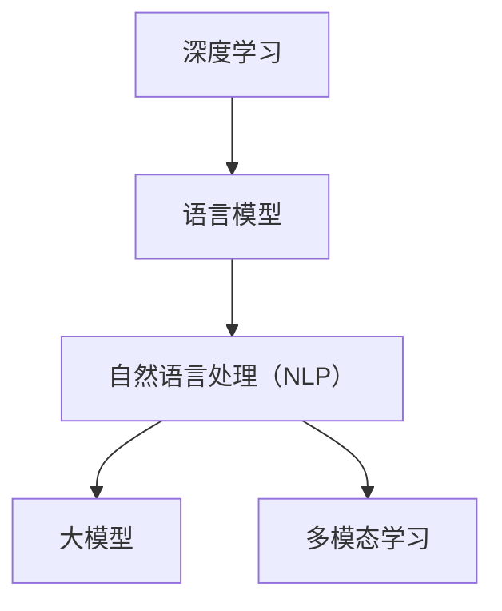
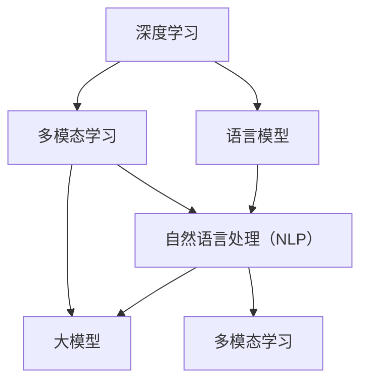

                 

# ChatGPT的诞生对AI行业的影响

> 关键词：
    - ChatGPT
    - 语言模型
    - 自然语言处理（NLP）
    - 深度学习
    - 人工智能（AI）
    - 大模型
    - 多模态学习
    - 用户交互
    - 工业应用
    - 伦理和隐私
    - 技术创新

## 1. 背景介绍

### 1.1 问题由来

在过去几年中，人工智能（AI）领域迎来了巨大的变革，其中最大的突破之一就是OpenAI开发的ChatGPT。自2023年3月发布以来，ChatGPT迅速走红，成为AI行业的热门话题。ChatGPT不仅仅是一个聊天机器人，它的诞生标志着自然语言处理（NLP）领域的一次重大突破，对AI行业产生了深远的影响。

ChatGPT是一款基于深度学习技术的语言模型，通过大量文本数据的预训练，实现了流畅、自然的对话生成能力。它的出现不仅提升了用户与机器交互的质量，也推动了AI技术在各行各业的应用。

### 1.2 问题核心关键点

ChatGPT的诞生涉及多个核心概念，包括深度学习、语言模型、自然语言处理、大模型和多模态学习等。这些概念之间的逻辑关系可以通过以下Mermaid流程图来展示：



这个流程图展示了ChatGPT的诞生过程中，各个技术概念之间的关联：

1. 深度学习：ChatGPT的基础，通过多层神经网络学习数据的特征。
2. 语言模型：构建模型以预测文本的下一个单词，是ChatGPT的核心组件。
3. 自然语言处理（NLP）：通过文本数据的处理和分析，使得ChatGPT能够理解并生成自然语言。
4. 大模型：基于大规模文本数据的预训练，ChatGPT具备强大的语言理解和生成能力。
5. 多模态学习：支持不同类型数据的处理和融合，增强了ChatGPT的通用性和适应性。

这些概念共同构成了ChatGPT的核心技术架构，使其能够在各种应用场景中发挥作用。

## 2. 核心概念与联系

### 2.1 核心概念概述

为了更好地理解ChatGPT的诞生背景和技术细节，我们需要深入了解其核心概念。

- **深度学习（Deep Learning）**：一种基于多层神经网络的机器学习方法，通过多层次的特征提取和抽象，实现对复杂数据的建模和预测。
- **语言模型（Language Model）**：用于预测文本序列的概率分布模型，通常用于自然语言处理任务，如文本生成、翻译、语音识别等。
- **自然语言处理（NLP）**：将人类语言转化为计算机可处理的形式，包括文本分析、语义理解、情感分析等。
- **大模型（Large Model）**：基于大规模数据预训练的语言模型，具备丰富的语言知识和常识，能够处理复杂的自然语言任务。
- **多模态学习（Multimodal Learning）**：结合多种类型数据（如文本、图像、语音等）进行学习和推理，增强模型的适应性和泛化能力。

### 2.2 核心概念原理和架构的 Mermaid 流程图



这个流程图展示了深度学习、语言模型、自然语言处理、大模型和多模态学习之间的关系：

1. 深度学习是基础，通过多层次的神经网络进行特征提取。
2. 语言模型构建在深度学习基础上，用于文本序列的概率预测。
3. 自然语言处理（NLP）使用语言模型进行文本分析、语义理解等任务。
4. 大模型通过大规模预训练，具备更丰富的语言知识和常识。
5. 多模态学习将不同类型的数据融合，增强模型的适应性和泛化能力。

这些概念共同构成了ChatGPT的核心技术架构，使其能够实现流畅、自然的对话生成。

## 3. 核心算法原理 & 具体操作步骤

### 3.1 算法原理概述

ChatGPT的算法原理基于深度学习中的Transformer架构，并采用了自回归语言模型。其核心思想是通过大量的文本数据预训练，学习文本序列的概率分布，然后使用监督信号对模型进行微调，使其能够生成符合用户需求的自然语言文本。

具体来说，ChatGPT的训练过程分为两个阶段：预训练和微调。

1. **预训练**：使用大规模无标签文本数据对模型进行预训练，学习语言的通用表示。
2. **微调**：使用下游任务的有标签数据对预训练模型进行微调，使其能够执行特定的自然语言处理任务。

### 3.2 算法步骤详解

ChatGPT的算法步骤如下：

1. **数据预处理**：对文本数据进行分词、去除停用词等预处理，生成模型所需的数据格式。
2. **模型构建**：构建基于Transformer的深度学习模型，包括编码器和解码器。
3. **预训练**：使用大规模无标签文本数据对模型进行预训练，学习语言的通用表示。
4. **微调**：使用下游任务的有标签数据对预训练模型进行微调，使其能够执行特定的自然语言处理任务。
5. **生成文本**：使用微调后的模型生成自然语言文本。

### 3.3 算法优缺点

ChatGPT的算法具有以下优点：

1. **强大的自然语言处理能力**：ChatGPT通过大规模预训练和微调，具备强大的自然语言处理能力，能够生成流畅、自然的对话。
2. **灵活的微调能力**：ChatGPT可以通过微调进行任务适配，适用于各种自然语言处理任务。
3. **可扩展性强**：ChatGPT可以轻松地扩展到多模态学习，支持图像、语音等多类型数据的融合。

同时，ChatGPT的算法也存在一些缺点：

1. **依赖大规模数据**：预训练和微调过程需要大量数据，数据获取和处理成本较高。
2. **过拟合风险**：预训练和微调过程中容易发生过拟合，影响模型的泛化能力。
3. **伦理和隐私问题**：ChatGPT生成的文本可能包含有害信息或偏见，需要加强伦理和隐私保护。

### 3.4 算法应用领域

ChatGPT的应用领域非常广泛，涵盖了以下多个方面：

1. **聊天机器人**：ChatGPT可以用于构建聊天机器人，提升客户服务体验。
2. **内容生成**：ChatGPT可以生成文章、报告、简历等文本内容，辅助内容创作。
3. **翻译**：ChatGPT可以将一种语言翻译成另一种语言，实现跨语言交流。
4. **问答系统**：ChatGPT可以用于构建问答系统，回答用户的各种问题。
5. **个性化推荐**：ChatGPT可以结合用户行为数据，提供个性化的内容推荐。
6. **数据分析**：ChatGPT可以对大量文本数据进行分析和处理，提供有价值的信息。

## 4. 数学模型和公式 & 详细讲解 & 举例说明

### 4.1 数学模型构建

ChatGPT的数学模型基于自回归语言模型，其目标是最小化文本序列的概率损失。具体来说，假设有一个文本序列 $X_1, X_2, ..., X_T$，模型的目标是最大化 $p(X_1, X_2, ..., X_T)$ 的概率。

### 4.2 公式推导过程

为了最小化概率损失，ChatGPT采用最大似然估计（MLE）方法，通过最大化训练数据中的概率来估计模型参数。具体公式如下：

$$
\max_{\theta} \sum_{i=1}^{T} \log p(X_i | X_{<i})
$$

其中 $X_i$ 表示文本序列中的第 $i$ 个单词，$X_{<i}$ 表示 $X_i$ 之前的单词序列。通过最大化似然估计，ChatGPT可以学习到文本序列的联合概率分布。

### 4.3 案例分析与讲解

以下是一个简单的案例分析：假设我们有一个文本序列 "I like to eat apples"，我们可以将其表示为向量 $x = [1, 1, 0, 1, 0, 1]$，其中 $1$ 表示单词 "like"，$0$ 表示其他单词。通过最大似然估计，ChatGPT可以学习到 $x$ 的分布，并预测下一个单词的概率。

## 5. 项目实践：代码实例和详细解释说明

### 5.1 开发环境搭建

要在本地搭建ChatGPT的开发环境，需要以下步骤：

1. 安装Python环境：建议使用Anaconda，通过conda创建虚拟环境。
2. 安装依赖包：使用pip安装必要的依赖包，如TensorFlow、PyTorch等。
3. 安装OpenAI库：使用conda或pip安装OpenAI库。

### 5.2 源代码详细实现

以下是一个简单的ChatGPT模型实现，包括预训练和微调步骤：

```python
import tensorflow as tf
from transformers import TFAutoModelForCausalLM, TFAutoTokenizer

# 加载预训练模型和分词器
model = TFAutoModelForCausalLM.from_pretrained('gpt3-medium')
tokenizer = TFAutoTokenizer.from_pretrained('gpt3-medium')

# 预训练数据准备
data = ...
# 构建输入和标签
inputs = tokenizer.encode(data, return_tensors='tf')
labels = tokenizer.encode(data, return_tensors='tf', is_pretokenized=True)

# 构建模型和优化器
model = TFAutoModelForCausalLM.from_pretrained('gpt3-medium')
optimizer = tf.keras.optimizers.AdamW(learning_rate=1e-5)

# 定义训练函数
@tf.function
def train_step(inputs, labels):
    with tf.GradientTape() as tape:
        outputs = model(inputs, labels=labels)
        loss = outputs.loss
    grads = tape.gradient(loss, model.trainable_variables)
    optimizer.apply_gradients(zip(grads, model.trainable_variables))

# 训练模型
for epoch in range(num_epochs):
    for batch in data_generator:
        inputs, labels = batch
        train_step(inputs, labels)

# 微调模型
model = TFAutoModelForCausalLM.from_pretrained('gpt3-medium')
tokenizer = TFAutoTokenizer.from_pretrained('gpt3-medium')

# 构建新的输入和标签
inputs = tokenizer.encode(new_data, return_tensors='tf')
labels = tokenizer.encode(new_data, return_tensors='tf', is_pretokenized=True)

# 微调模型
optimizer = tf.keras.optimizers.AdamW(learning_rate=1e-5)
for epoch in range(num_epochs):
    for batch in data_generator:
        inputs, labels = batch
        train_step(inputs, labels)
```

### 5.3 代码解读与分析

上述代码实现了ChatGPT的预训练和微调过程。关键步骤包括：

1. 加载预训练模型和分词器：使用HuggingFace的`TFAutoModelForCausalLM`和`TFAutoTokenizer`加载预训练模型和分词器。
2. 构建输入和标签：将文本数据编码为模型所需格式，并构建输入和标签。
3. 定义训练函数：使用TensorFlow的`tf.function`定义训练函数，计算损失和梯度。
4. 训练模型：使用训练函数对模型进行训练。
5. 微调模型：加载预训练模型和分词器，构建新的输入和标签，使用训练函数进行微调。

## 6. 实际应用场景

### 6.1 聊天机器人

ChatGPT在聊天机器人领域的应用非常广泛，可以帮助用户快速获取信息、解答问题、提供娱乐等。以下是几个典型的应用场景：

1. **客户服务**：构建客户服务聊天机器人，提供24/7的客户支持，提升客户满意度。
2. **技术支持**：构建技术支持聊天机器人，解答用户的各种技术问题，提高问题解决效率。
3. **个性化推荐**：结合用户的历史行为数据，提供个性化的内容推荐，提升用户体验。

### 6.2 内容生成

ChatGPT可以用于生成各种文本内容，如文章、报告、简历等。以下是一些具体的应用场景：

1. **文章生成**：生成新闻报道、博客文章、论文等，辅助内容创作。
2. **报告生成**：生成市场分析报告、财务报表等，提供有价值的信息。
3. **简历生成**：生成个人简历，提升求职成功率。

### 6.3 翻译

ChatGPT可以用于语言翻译，实现跨语言交流。以下是一些具体的应用场景：

1. **文档翻译**：翻译文档、合同、协议等文本，确保准确性。
2. **口译服务**：提供实时口译服务，辅助跨国会议和商务交流。

### 6.4 问答系统

ChatGPT可以用于构建问答系统，回答用户的各种问题。以下是一些具体的应用场景：

1. **智能客服**：提供智能客服解决方案，提升客户体验。
2. **教育培训**：提供智能教学助手，解答学生的问题，提供学习指导。

### 6.5 数据分析

ChatGPT可以用于分析大量文本数据，提供有价值的信息。以下是一些具体的应用场景：

1. **市场分析**：分析社交媒体数据，了解市场动态。
2. **舆情监测**：监测网络舆情，及时发现和处理负面信息。

## 7. 工具和资源推荐

### 7.1 学习资源推荐

为了帮助开发者系统掌握ChatGPT的技术细节，以下是一些优质的学习资源：

1. **《深度学习》课程**：斯坦福大学开设的深度学习课程，涵盖深度学习的理论和实践。
2. **《自然语言处理》课程**：Coursera上斯坦福大学开设的自然语言处理课程，介绍NLP的基本概念和算法。
3. **OpenAI官方文档**：OpenAI提供的官方文档，详细介绍了ChatGPT的架构和使用方法。
4. **HuggingFace Transformers库**：提供了丰富的预训练模型和微调样例，是构建ChatGPT模型的必备工具。
5. **《语言模型与深度学习》书籍**：介绍语言模型的理论和实践，适合深入学习。

### 7.2 开发工具推荐

ChatGPT的开发离不开强大的工具支持。以下是一些常用的开发工具：

1. **TensorFlow**：Google开发的深度学习框架，支持大规模模型的训练和推理。
2. **PyTorch**：Facebook开发的深度学习框架，易于使用，支持动态计算图。
3. **HuggingFace Transformers库**：提供了丰富的预训练模型和微调工具，是构建ChatGPT模型的重要组件。
4. **Google Colab**：免费的在线Jupyter Notebook环境，支持GPU计算，适合快速迭代研究。
5. **TensorBoard**：TensorFlow的可视化工具，可以实时监测模型训练状态，提供丰富的图表呈现方式。

### 7.3 相关论文推荐

为了深入了解ChatGPT的算法原理和应用，以下是一些重要的相关论文：

1. **"Attention is All You Need"**：Transformer模型的原论文，介绍自注意力机制的应用。
2. **"Language Models are Unsupervised Multitask Learners"**：BERT模型的原论文，介绍掩码语言模型的预训练方法。
3. **"Pre-Training of Neural Network Language Models"**：介绍语言模型预训练的基本方法和步骤。
4. **"Transformers: State-of-the-Art Machine Translation"**：介绍Transformer架构在机器翻译中的应用。

## 8. 总结：未来发展趋势与挑战

### 8.1 研究成果总结

ChatGPT的诞生标志着NLP领域的巨大进步，推动了AI技术在各行各业的应用。通过预训练和微调，ChatGPT具备强大的自然语言处理能力，能够生成流畅、自然的对话。它在聊天机器人、内容生成、翻译、问答系统等领域的应用，极大地提升了用户体验和效率。

### 8.2 未来发展趋势

展望未来，ChatGPT在以下方面具有广阔的发展前景：

1. **多模态学习**：结合图像、语音等多种类型的数据，增强模型的适应性和泛化能力。
2. **跨领域应用**：ChatGPT的应用场景将不断扩展，应用于更多领域，如金融、医疗、法律等。
3. **交互式体验**：ChatGPT将不断提升用户体验，实现更加自然、流畅的交互体验。
4. **个性化推荐**：结合用户行为数据，提供个性化的内容推荐，提升用户体验。
5. **实时性优化**：通过模型压缩和优化，提高模型的实时性，满足实时应用的需求。

### 8.3 面临的挑战

尽管ChatGPT取得了显著成就，但在未来应用中仍面临以下挑战：

1. **伦理和隐私问题**：ChatGPT生成的文本可能包含有害信息或偏见，需要加强伦理和隐私保护。
2. **数据获取和处理**：ChatGPT的应用需要大量数据，数据获取和处理成本较高。
3. **模型鲁棒性**：ChatGPT在面对新的任务时，可能需要重新训练或微调，影响模型的泛化能力。
4. **计算资源消耗**：ChatGPT的模型规模较大，对计算资源消耗较高，需要优化模型结构和训练过程。

### 8.4 研究展望

未来的研究应在以下方向取得突破：

1. **高效微调方法**：开发更加高效、参数更少的微调方法，减少计算资源消耗。
2. **多模态融合**：结合图像、语音等多模态数据，提升模型的适应性和泛化能力。
3. **伦理和隐私保护**：引入伦理导向的评估指标，过滤和惩罚有害信息，确保模型的安全性和可控性。
4. **实时应用优化**：通过模型压缩和优化，提高模型的实时性，满足实时应用的需求。

## 9. 附录：常见问题与解答

**Q1: ChatGPT的训练过程包括哪些步骤？**

A: ChatGPT的训练过程主要包括以下步骤：

1. 数据预处理：对文本数据进行分词、去除停用词等预处理，生成模型所需的数据格式。
2. 构建模型：使用基于Transformer的深度学习模型，包括编码器和解码器。
3. 预训练：使用大规模无标签文本数据对模型进行预训练，学习语言的通用表示。
4. 微调：使用下游任务的有标签数据对预训练模型进行微调，使其能够执行特定的自然语言处理任务。
5. 生成文本：使用微调后的模型生成自然语言文本。

**Q2: ChatGPT有哪些常见的应用场景？**

A: ChatGPT的应用场景非常广泛，包括但不限于：

1. 聊天机器人：构建客户服务、技术支持、教育培训等聊天机器人，提升用户体验。
2. 内容生成：生成文章、报告、简历等文本内容，辅助内容创作。
3. 翻译：提供文档翻译、口译服务，实现跨语言交流。
4. 问答系统：构建智能客服、教育培训等问答系统，回答用户的问题。
5. 数据分析：分析大量文本数据，提供有价值的信息，如市场分析、舆情监测等。

**Q3: 如何提升ChatGPT的模型鲁棒性？**

A: 提升ChatGPT的模型鲁棒性可以通过以下方法：

1. 数据增强：通过回译、近义替换等方式扩充训练集，增加数据的多样性。
2. 正则化：使用L2正则、Dropout等正则化技术，防止模型过拟合。
3. 对抗训练：引入对抗样本，提高模型的鲁棒性。
4. 参数高效微调：只调整少量参数，固定大部分预训练权重，减少过拟合风险。

**Q4: 如何提升ChatGPT的实时性？**

A: 提升ChatGPT的实时性可以通过以下方法：

1. 模型压缩：使用模型压缩技术，减小模型的参数量，提升推理速度。
2. 优化训练过程：使用梯度积累、混合精度训练等技术，优化模型的训练过程。
3. 分布式训练：使用分布式训练技术，提高模型的训练效率，缩短训练时间。

**Q5: 如何避免ChatGPT生成有害信息？**

A: 避免ChatGPT生成有害信息可以通过以下方法：

1. 数据过滤：在数据预处理阶段，过滤掉有害信息，确保训练数据的质量。
2. 模型约束：在模型训练阶段，引入伦理导向的评估指标，过滤和惩罚有害信息。
3. 人工审核：在模型部署阶段，对生成的文本进行人工审核，确保输出的安全性。

---

作者：禅与计算机程序设计艺术 / Zen and the Art of Computer Programming

