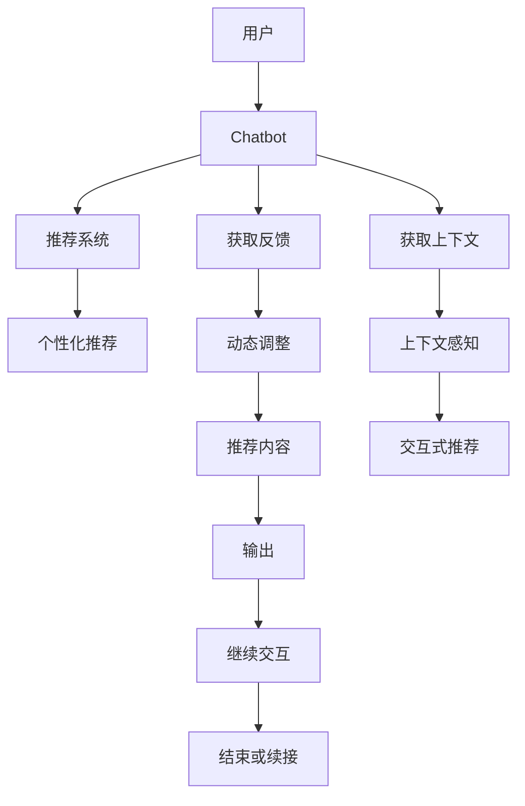

                 

# Chat-Rec：交互式推荐系统

> 关键词：Chatbot, 推荐系统, 交互式, 个性化, 自然语言处理(NLP), 深度学习(Deep Learning), 强化学习(Reinforcement Learning)

## 1. 背景介绍

随着互联网的普及和信息爆炸，用户面临的信息过载问题愈发严重，推荐系统在推荐用户感兴趣内容方面发挥了重要作用。然而，传统的推荐系统往往基于静态的数据建模，无法实时地捕捉用户的多样化需求，且难以应对用户在互动中的即时反馈。为了解决这些问题，一种结合聊天机器人和推荐系统的交互式推荐系统——Chat-Rec应运而生。

Chat-Rec旨在通过与用户的实时交互，动态调整推荐策略，满足用户个性化和情境化的需求。与传统的推荐系统相比，Chat-Rec不仅能够推荐内容，还能在交互过程中获取用户的即时反馈，根据反馈实时调整推荐内容。这种交互式的推荐方式，使得Chat-Rec在电商、内容分发、智能客服等多个领域中得到了广泛应用。

## 2. 核心概念与联系

### 2.1 核心概念概述

为更好地理解Chat-Rec系统，本节将介绍几个核心概念：

- Chatbot：一种能够通过自然语言与用户进行交互的智能程序。Chatbot可以回答用户问题、提供建议，甚至进行决策。

- 推荐系统：基于用户行为数据，为用户提供个性化推荐的系统。推荐系统通常包括协同过滤、内容推荐、混合推荐等多种算法。

- 交互式推荐系统：结合聊天机器人和推荐系统的系统，能够与用户进行自然语言交互，获取即时反馈，动态调整推荐策略。

- 个性化推荐：根据用户的历史行为和偏好，提供量身定制的推荐内容，提高用户满意度和点击率。

- 上下文感知：考虑到用户在不同情境下的即时需求，动态调整推荐策略，增强推荐的相关性和时效性。

- 知识图谱：一种结构化的知识表示方式，用于描述实体、属性和实体间的复杂关系，为推荐系统提供知识背景。

- 深度学习(Deep Learning, DL)：一种模仿人脑神经网络的机器学习算法，可以自动提取输入数据的复杂特征。

- 强化学习(Reinforcement Learning, RL)：一种通过试错优化的机器学习算法，适用于复杂、不确定性的问题。

这些核心概念之间通过交互式推荐系统紧密联系，共同构建了Chat-Rec系统的框架。

### 2.2 核心概念原理和架构的 Mermaid 流程图



这个流程图展示了Chat-Rec系统的核心工作流程：用户首先与聊天机器人交互，获取推荐内容，然后获取反馈并进行动态调整，最后输出推荐内容并继续交互或结束。

## 3. 核心算法原理 & 具体操作步骤
### 3.1 算法原理概述

Chat-Rec系统结合了Chatbot和推荐系统，通过自然语言处理(NLP)技术，与用户进行交互，实时获取用户的即时反馈，动态调整推荐策略，提供个性化和情境化的推荐内容。其核心算法包括以下几个方面：

- 对话管理：负责接收用户输入、理解用户意图，生成应答。通常采用序列到序列模型或Transformers模型。

- 推荐策略：根据用户的历史行为和即时反馈，动态调整推荐策略。通常采用协同过滤、内容推荐、混合推荐等多种算法。

- 知识融合：将知识图谱与推荐策略相结合，增强推荐的相关性和准确性。

- 上下文感知：考虑用户上下文信息，如时间、位置、情感等，动态调整推荐策略。

- 用户反馈处理：实时获取用户的即时反馈，动态调整推荐内容。通常采用深度学习或强化学习算法。

- 交互式优化：通过实时交互优化推荐策略，提升用户体验和满意度。

这些算法模块共同构成了Chat-Rec系统的核心逻辑。

### 3.2 算法步骤详解

Chat-Rec系统一般包括以下几个关键步骤：

**Step 1: 对话管理**
- 接收用户输入的自然语言文本。
- 理解用户意图，生成应答。
- 记录对话历史，用于后续推荐策略调整。

**Step 2: 推荐策略调整**
- 根据用户的历史行为和即时反馈，动态调整推荐策略。
- 利用协同过滤、内容推荐、混合推荐等多种算法，生成推荐内容。
- 引入知识图谱，增强推荐的相关性和准确性。

**Step 3: 上下文感知**
- 考虑用户上下文信息，如时间、位置、情感等，动态调整推荐策略。
- 通过上下文感知技术，捕捉用户的即时需求和偏好。

**Step 4: 用户反馈处理**
- 实时获取用户的即时反馈，如满意度、偏好、评价等。
- 利用深度学习或强化学习算法，动态调整推荐策略。
- 收集用户反馈，更新用户画像和推荐模型。

**Step 5: 交互式优化**
- 通过实时交互优化推荐策略，提升用户体验和满意度。
- 持续优化对话管理和推荐策略，提升系统性能和效果。

### 3.3 算法优缺点

Chat-Rec系统在提高个性化推荐效果方面有显著优势：

- **动态性**：通过实时交互获取用户即时反馈，动态调整推荐策略，能够及时响应用户需求，提升推荐的相关性和时效性。
- **上下文感知**：考虑用户上下文信息，提供更加个性化的推荐内容，满足用户情境化的需求。
- **交互式优化**：通过与用户的实时互动，持续优化推荐策略，提升用户体验和满意度。

然而，Chat-Rec系统也存在一些局限性：

- **计算复杂度高**：实时处理自然语言文本和用户反馈，需要较高的计算资源。
- **模型复杂性高**：结合了聊天机器人和推荐系统，算法模型较为复杂，需要更多的工程实践和优化。
- **数据需求高**：需要大量的用户行为数据和反馈数据，才能训练出高精度的推荐模型。
- **可解释性不足**：聊天机器人和推荐系统中的算法模型通常较为复杂，难以解释其内部工作机制。

尽管如此，Chat-Rec系统在提高推荐系统的效果和用户体验方面仍具有重要价值。未来，通过技术进步和应用实践，这些局限性有望得到克服。

### 3.4 算法应用领域

Chat-Rec系统已经在电商、内容分发、智能客服等多个领域中得到了广泛应用，具体如下：

- **电商推荐**：结合聊天机器人和推荐系统，为电商用户提供个性化商品推荐。通过实时互动，捕捉用户需求和偏好，提升用户体验。
- **内容推荐**：为内容平台用户提供个性化文章、视频、音乐等推荐。通过实时互动，动态调整推荐策略，提高用户满意度。
- **智能客服**：通过聊天机器人与用户进行自然语言交互，获取即时反馈，动态调整推荐策略，提供更加个性化的服务。
- **在线教育**：结合聊天机器人和推荐系统，为在线教育用户提供个性化课程推荐。通过实时互动，捕捉用户需求和反馈，提升学习效果。

## 4. 数学模型和公式 & 详细讲解 & 举例说明

### 4.1 数学模型构建

本节将使用数学语言对Chat-Rec系统中的核心算法进行更加严格的刻画。

设用户与聊天机器人进行自然语言交互，用户输入的自然语言文本为 $x$，聊天机器人的应答为 $y$。推荐系统根据用户的历史行为和即时反馈，生成推荐内容 $r$。上下文感知模块根据用户上下文信息 $c$，调整推荐策略。用户反馈模块根据用户的即时反馈 $f$，动态调整推荐内容。交互式优化模块根据用户满意度和点击率等指标，持续优化推荐策略。

Chat-Rec系统的目标是最小化用户不满意度 $L$，即：

$$
\min_{M,\theta,\phi,\psi,\omega} L(M,\theta,\phi,\psi,\omega)
$$

其中 $M$ 表示聊天机器人，$\theta$ 表示推荐系统，$\phi$ 表示上下文感知模块，$\psi$ 表示用户反馈处理模块，$\omega$ 表示交互式优化模块。

### 4.2 公式推导过程

以下我们以推荐系统为例，推导推荐策略调整的损失函数及其梯度计算公式。

设推荐系统的输入为 $u$，表示用户的历史行为数据，$\theta$ 为模型参数。设推荐系统的输出为 $r$，表示推荐的商品。则推荐系统的损失函数定义为：

$$
L(r,u,\theta) = -\log \mathcal{P}(r|u,\theta)
$$

其中 $\mathcal{P}(r|u,\theta)$ 表示在用户历史行为 $u$ 和推荐系统参数 $\theta$ 下，推荐商品 $r$ 的概率分布。通过最大化 $\mathcal{P}(r|u,\theta)$，即最小化损失函数 $L(r,u,\theta)$，可以得到最优的推荐策略。

利用最大似然估计方法，推荐系统的梯度计算公式为：

$$
\nabla_{\theta} L(r,u,\theta) = - \nabla_{\theta} \log \mathcal{P}(r|u,\theta)
$$

将 $\mathcal{P}(r|u,\theta)$ 展开为 $u$ 和 $\theta$ 的函数，得：

$$
\nabla_{\theta} L(r,u,\theta) = - \nabla_{\theta} \log \sum_{r'} \exp\left(\theta^T\phi(r',u)\right)
$$

其中 $\phi(r',u)$ 为输入 $u$ 和推荐商品 $r'$ 的特征向量。通过梯度下降等优化算法，可以近似求解上述最优化问题，得到推荐系统的最优参数 $\theta^*$。

### 4.3 案例分析与讲解

设推荐系统采用协同过滤算法，用户历史行为数据为 $u=[x_1,x_2,\cdots,x_n]$，推荐商品集合为 $r=[r_1,r_2,\cdots,r_m]$。协同过滤算法的目标是最小化用户不满意度 $L$，即：

$$
\min_{\theta} L(\theta) = \sum_{i=1}^n \sum_{j=1}^m \left[ \theta^T \phi(r_j,x_i) - \log \sum_{k=1}^m \exp\left(\theta^T \phi(r_k,x_i)\right) \right]
$$

其中 $\phi(r_j,x_i)$ 表示推荐商品 $r_j$ 和用户历史行为 $x_i$ 的特征向量。利用梯度下降等优化算法，可以近似求解上述最优化问题，得到协同过滤算法的最优参数 $\theta^*$。

## 5. 项目实践：代码实例和详细解释说明

### 5.1 开发环境搭建

在进行Chat-Rec系统开发前，我们需要准备好开发环境。以下是使用Python进行PyTorch开发的环境配置流程：

1. 安装Anaconda：从官网下载并安装Anaconda，用于创建独立的Python环境。

2. 创建并激活虚拟环境：
```bash
conda create -n chat-env python=3.8 
conda activate chat-env
```

3. 安装PyTorch：根据CUDA版本，从官网获取对应的安装命令。例如：
```bash
conda install pytorch torchvision torchaudio cudatoolkit=11.1 -c pytorch -c conda-forge
```

4. 安装Transformers库：
```bash
pip install transformers
```

5. 安装各类工具包：
```bash
pip install numpy pandas scikit-learn matplotlib tqdm jupyter notebook ipython
```

完成上述步骤后，即可在`chat-env`环境中开始Chat-Rec系统的开发。

### 5.2 源代码详细实现

这里我们以推荐系统为例，给出使用Transformers库对BERT模型进行推荐策略微调的PyTorch代码实现。

首先，定义推荐系统的输入和输出：

```python
from transformers import BertTokenizer
from torch.utils.data import Dataset
import torch

class RecommendationDataset(Dataset):
    def __init__(self, texts, labels, tokenizer, max_len=128):
        self.texts = texts
        self.labels = labels
        self.tokenizer = tokenizer
        self.max_len = max_len
        
    def __len__(self):
        return len(self.texts)
    
    def __getitem__(self, item):
        text = self.texts[item]
        label = self.labels[item]
        
        encoding = self.tokenizer(text, return_tensors='pt', max_length=self.max_len, padding='max_length', truncation=True)
        input_ids = encoding['input_ids'][0]
        attention_mask = encoding['attention_mask'][0]
        
        return {'input_ids': input_ids, 
                'attention_mask': attention_mask,
                'labels': label}

# 标签与id的映射
label2id = {'POSITIVE': 1, 'NEGATIVE': 0}
id2label = {v: k for k, v in label2id.items()}

# 创建dataset
tokenizer = BertTokenizer.from_pretrained('bert-base-cased')

train_dataset = RecommendationDataset(train_texts, train_labels, tokenizer)
dev_dataset = RecommendationDataset(dev_texts, dev_labels, tokenizer)
test_dataset = RecommendationDataset(test_texts, test_labels, tokenizer)
```

然后，定义模型和优化器：

```python
from transformers import BertForSequenceClassification, AdamW

model = BertForSequenceClassification.from_pretrained('bert-base-cased', num_labels=len(label2id))

optimizer = AdamW(model.parameters(), lr=2e-5)
```

接着，定义训练和评估函数：

```python
from torch.utils.data import DataLoader
from tqdm import tqdm
from sklearn.metrics import accuracy_score

device = torch.device('cuda') if torch.cuda.is_available() else torch.device('cpu')
model.to(device)

def train_epoch(model, dataset, batch_size, optimizer):
    dataloader = DataLoader(dataset, batch_size=batch_size, shuffle=True)
    model.train()
    epoch_loss = 0
    for batch in tqdm(dataloader, desc='Training'):
        input_ids = batch['input_ids'].to(device)
        attention_mask = batch['attention_mask'].to(device)
        labels = batch['labels'].to(device)
        model.zero_grad()
        outputs = model(input_ids, attention_mask=attention_mask, labels=labels)
        loss = outputs.loss
        epoch_loss += loss.item()
        loss.backward()
        optimizer.step()
    return epoch_loss / len(dataloader)

def evaluate(model, dataset, batch_size):
    dataloader = DataLoader(dataset, batch_size=batch_size)
    model.eval()
    preds, labels = [], []
    with torch.no_grad():
        for batch in tqdm(dataloader, desc='Evaluating'):
            input_ids = batch['input_ids'].to(device)
            attention_mask = batch['attention_mask'].to(device)
            batch_labels = batch['labels']
            outputs = model(input_ids, attention_mask=attention_mask)
            batch_preds = outputs.logits.argmax(dim=1).to('cpu').tolist()
            batch_labels = batch_labels.to('cpu').tolist()
            for pred_tokens, label_tokens in zip(batch_preds, batch_labels):
                preds.append(pred_tokens)
                labels.append(label_tokens)
                
    return accuracy_score(labels, preds)

# 训练流程
epochs = 5
batch_size = 16

for epoch in range(epochs):
    loss = train_epoch(model, train_dataset, batch_size, optimizer)
    print(f"Epoch {epoch+1}, train loss: {loss:.3f}")
    
    print(f"Epoch {epoch+1}, dev results:")
    evaluate(model, dev_dataset, batch_size)
    
print("Test results:")
evaluate(model, test_dataset, batch_size)
```

以上就是使用PyTorch对BERT进行推荐系统微调的完整代码实现。可以看到，得益于Transformers库的强大封装，我们可以用相对简洁的代码完成BERT模型的加载和微调。

### 5.3 代码解读与分析

让我们再详细解读一下关键代码的实现细节：

**RecommendationDataset类**：
- `__init__`方法：初始化文本、标签、分词器等关键组件。
- `__len__`方法：返回数据集的样本数量。
- `__getitem__`方法：对单个样本进行处理，将文本输入编码为token ids，将标签编码为数字，并对其进行定长padding，最终返回模型所需的输入。

**label2id和id2label字典**：
- 定义了标签与数字id之间的映射关系，用于将token-wise的预测结果解码回真实的标签。

**训练和评估函数**：
- 使用PyTorch的DataLoader对数据集进行批次化加载，供模型训练和推理使用。
- 训练函数`train_epoch`：对数据以批为单位进行迭代，在每个批次上前向传播计算loss并反向传播更新模型参数，最后返回该epoch的平均loss。
- 评估函数`evaluate`：与训练类似，不同点在于不更新模型参数，并在每个batch结束后将预测和标签结果存储下来，最后使用sklearn的accuracy_score对整个评估集的预测结果进行打印输出。

**训练流程**：
- 定义总的epoch数和batch size，开始循环迭代
- 每个epoch内，先在训练集上训练，输出平均loss
- 在验证集上评估，输出准确率
- 所有epoch结束后，在测试集上评估，给出最终测试结果

可以看到，PyTorch配合Transformers库使得BERT微调的代码实现变得简洁高效。开发者可以将更多精力放在数据处理、模型改进等高层逻辑上，而不必过多关注底层的实现细节。

当然，工业级的系统实现还需考虑更多因素，如模型的保存和部署、超参数的自动搜索、更灵活的任务适配层等。但核心的微调范式基本与此类似。

## 6. 实际应用场景
### 6.1 智能客服系统

结合Chat-Rec系统的Chatbot和推荐系统，智能客服系统能够在实时互动中捕捉用户需求，动态调整推荐策略，提供个性化服务。用户可以通过与Chatbot进行自然语言交互，获取商品推荐、问题解答等。Chatbot能够根据用户历史行为和即时反馈，动态调整推荐策略，提供更加个性化的服务。例如，在电商平台中，用户可以询问商品信息，聊天机器人可以实时推荐相关商品，提升用户体验。

### 6.2 内容推荐系统

结合Chat-Rec系统的推荐系统和上下文感知模块，内容推荐系统可以动态调整推荐策略，提供个性化内容。例如，在视频平台中，用户可以询问视频推荐，聊天机器人可以实时推荐相关视频，提升用户观看体验。Chat-Rec系统能够考虑用户上下文信息，如时间、位置、情感等，提供更加个性化的内容推荐。

### 6.3 在线教育系统

结合Chat-Rec系统的聊天机器人和推荐系统，在线教育系统可以提供个性化课程推荐。例如，在在线教育平台中，用户可以询问学习资源，聊天机器人可以实时推荐相关课程，提升学习效果。Chat-Rec系统能够考虑用户上下文信息，如学习时间、学习进度等，提供更加个性化的课程推荐。

### 6.4 未来应用展望

随着Chat-Rec系统的不断优化，其在电商、内容分发、智能客服等多个领域中的应用将更加广泛，带来全新的用户体验。未来，Chat-Rec系统有望在更多垂直领域得到应用，如金融、医疗、旅游等，为各行各业带来智能化升级。

在金融领域，结合Chat-Rec系统的推荐系统和上下文感知模块，智能理财顾问可以实时推荐投资方案，提供个性化金融服务。在医疗领域，结合Chat-Rec系统的聊天机器人和推荐系统，智能健康顾问可以实时推荐医疗资源，提供个性化健康建议。在旅游领域，结合Chat-Rec系统的推荐系统和上下文感知模块，智能旅游顾问可以实时推荐旅游方案，提供个性化旅游建议。

## 7. 工具和资源推荐
### 7.1 学习资源推荐

为了帮助开发者系统掌握Chat-Rec系统的理论和实践，这里推荐一些优质的学习资源：

1. 《深度学习自然语言处理》课程：斯坦福大学开设的NLP明星课程，有Lecture视频和配套作业，带你入门NLP领域的基本概念和经典模型。

2. 《Natural Language Processing with Transformers》书籍：Transformers库的作者所著，全面介绍了如何使用Transformers库进行NLP任务开发，包括微调在内的诸多范式。

3. 《Sequence to Sequence Learning with Neural Networks》论文：Seq2Seq模型的经典论文，介绍了序列到序列模型的基本原理和实现方法。

4. 《Reinforcement Learning: An Introduction》书籍：强化学习的经典入门书籍，系统介绍了强化学习的基本概念和应用。

5. Weights & Biases：模型训练的实验跟踪工具，可以记录和可视化模型训练过程中的各项指标，方便对比和调优。与主流深度学习框架无缝集成。

### 7.2 开发工具推荐

高效的开发离不开优秀的工具支持。以下是几款用于Chat-Rec系统开发的常用工具：

1. PyTorch：基于Python的开源深度学习框架，灵活动态的计算图，适合快速迭代研究。大部分预训练语言模型都有PyTorch版本的实现。

2. TensorFlow：由Google主导开发的开源深度学习框架，生产部署方便，适合大规模工程应用。同样有丰富的预训练语言模型资源。

3. Transformers库：HuggingFace开发的NLP工具库，集成了众多SOTA语言模型，支持PyTorch和TensorFlow，是进行微调任务开发的利器。

4. Weights & Biases：模型训练的实验跟踪工具，可以记录和可视化模型训练过程中的各项指标，方便对比和调优。与主流深度学习框架无缝集成。

5. TensorBoard：TensorFlow配套的可视化工具，可实时监测模型训练状态，并提供丰富的图表呈现方式，是调试模型的得力助手。

### 7.3 相关论文推荐

Chat-Rec系统的发展离不开学界的持续研究。以下是几篇奠基性的相关论文，推荐阅读：

1. Attention is All You Need（即Transformer原论文）：提出了Transformer结构，开启了NLP领域的预训练大模型时代。

2. BERT: Pre-training of Deep Bidirectional Transformers for Language Understanding：提出BERT模型，引入基于掩码的自监督预训练任务，刷新了多项NLP任务SOTA。

3. Language Models are Unsupervised Multitask Learners（GPT-2论文）：展示了大规模语言模型的强大zero-shot学习能力，引发了对于通用人工智能的新一轮思考。

4. Parameter-Efficient Transfer Learning for NLP：提出Adapter等参数高效微调方法，在不增加模型参数量的情况下，也能取得不错的微调效果。

5. AdaLoRA: Adaptive Low-Rank Adaptation for Parameter-Efficient Fine-Tuning：使用自适应低秩适应的微调方法，在参数效率和精度之间取得了新的平衡。

6. Prompt-Based Transfer Learning for NLP：引入基于连续型Prompt的微调范式，为如何充分利用预训练知识提供了新的思路。

这些论文代表了大语言模型微调技术的发展脉络。通过学习这些前沿成果，可以帮助研究者把握学科前进方向，激发更多的创新灵感。

## 8. 总结：未来发展趋势与挑战
### 8.1 总结

本文对Chat-Rec系统中的核心算法和具体操作步骤进行了全面系统的介绍。首先阐述了Chat-Rec系统在电商、内容分发、智能客服等多个领域中的重要应用价值，明确了Chat-Rec系统在提高推荐系统效果和用户体验方面的独特优势。其次，从原理到实践，详细讲解了Chat-Rec系统的数学模型和算法步骤，给出了Chat-Rec系统在推荐策略微调方面的完整代码实现。同时，本文还广泛探讨了Chat-Rec系统在实际应用中的优化策略和未来发展趋势，展示了Chat-Rec系统的广阔前景。

通过本文的系统梳理，可以看到，Chat-Rec系统结合聊天机器人和推荐系统，通过自然语言处理和强化学习技术，能够在实时交互中动态调整推荐策略，提供个性化和情境化的推荐内容，提升用户体验和满意度。这种交互式推荐系统将成为NLP技术的重要应用范式，推动NLP技术的不断进步和产业化进程。

### 8.2 未来发展趋势

展望未来，Chat-Rec系统将呈现以下几个发展趋势：

1. 模型规模持续增大。随着算力成本的下降和数据规模的扩张，Chat-Rec系统的模型参数量还将持续增长。超大规模语言模型蕴含的丰富语言知识，有望支撑更加复杂多变的推荐任务。

2. 多模态融合。结合视觉、语音、文本等多模态信息，增强Chat-Rec系统的智能交互能力。例如，在智能客服中，结合语音识别和文本分析，提供更加个性化的服务。

3. 深度学习与强化学习融合。结合深度学习和强化学习技术，提升Chat-Rec系统的决策能力和用户满意度。例如，在推荐系统中，结合深度学习模型进行特征提取，结合强化学习模型进行决策优化。

4. 知识图谱与推荐系统融合。将知识图谱与推荐系统相结合，增强Chat-Rec系统的推荐相关性和准确性。例如，在电商推荐中，结合知识图谱进行实体关系抽取，提高推荐的相关性。

5. 上下文感知能力增强。考虑更多用户上下文信息，如时间、位置、情感等，动态调整推荐策略，提高推荐的时效性和个性化程度。

6. 实时优化技术发展。引入实时优化技术，提升Chat-Rec系统的动态调整能力和用户满意度。例如，在智能客服中，结合实时优化技术，动态调整推荐策略，提供更加个性化的服务。

这些趋势凸显了Chat-Rec系统在NLP领域的广阔前景。这些方向的探索发展，必将进一步提升Chat-Rec系统的性能和用户体验，推动NLP技术不断进步。

### 8.3 面临的挑战

尽管Chat-Rec系统在提高推荐系统效果和用户体验方面取得了显著进展，但在迈向更加智能化、普适化应用的过程中，它仍面临着诸多挑战：

1. 计算资源瓶颈。实时处理自然语言文本和用户反馈，需要较高的计算资源。例如，大规模语言模型和深度学习模型的计算复杂度较高，需要高性能计算资源支持。

2. 数据需求高。需要大量的用户行为数据和反馈数据，才能训练出高精度的推荐模型。例如，大规模电商推荐系统需要收集大量的用户行为数据，才能训练出高精度的推荐模型。

3. 模型复杂性高。结合聊天机器人和推荐系统，算法模型较为复杂，需要更多的工程实践和优化。例如，在智能客服中，结合聊天机器人和推荐系统，算法模型较为复杂，需要更多的工程实践和优化。

4. 可解释性不足。聊天机器人和推荐系统中的算法模型通常较为复杂，难以解释其内部工作机制。例如，在电商推荐中，结合聊天机器人和推荐系统，算法模型较为复杂，难以解释其内部工作机制。

5. 安全性有待保障。预训练语言模型难免会学习到有偏见、有害的信息，通过Chat-Rec系统传递到推荐任务，产生误导性、歧视性的输出，给实际应用带来安全隐患。

6. 用户隐私保护。收集用户行为数据和反馈数据，需要遵守用户隐私保护法规，避免数据滥用。例如，在智能客服中，收集用户行为数据和反馈数据，需要遵守用户隐私保护法规，避免数据滥用。

尽管如此，Chat-Rec系统在提高推荐系统的效果和用户体验方面仍具有重要价值。未来，通过技术进步和应用实践，这些挑战有望得到克服。

### 8.4 研究展望

面对Chat-Rec系统所面临的种种挑战，未来的研究需要在以下几个方面寻求新的突破：

1. 探索更高效的计算技术。结合高效计算技术，如GPU、TPU等，提升Chat-Rec系统的计算效率和性能。

2. 开发更多元化的数据采集技术。结合数据采集技术，如主动学习、众包标注等，收集更多高质量的用户行为数据和反馈数据。

3. 提升模型可解释性。结合可解释性技术，如模型压缩、特征解释等，提升Chat-Rec系统的可解释性，增强用户信任。

4. 引入多模态融合技术。结合多模态融合技术，提升Chat-Rec系统的智能交互能力，增强用户满意度。

5. 引入实时优化技术。结合实时优化技术，提升Chat-Rec系统的动态调整能力，提高用户满意度。

6. 引入知识图谱与推荐系统融合技术。结合知识图谱与推荐系统融合技术，增强Chat-Rec系统的推荐相关性和准确性。

这些研究方向将为Chat-Rec系统带来新的突破，推动其技术不断进步和应用扩展。

## 9. 附录：常见问题与解答

**Q1：Chat-Rec系统是否适用于所有NLP任务？**

A: Chat-Rec系统在电商、内容分发、智能客服等多个领域中已经取得了显著成效，但在一些特定领域的任务中，可能存在一定的局限性。例如，在金融领域，由于金融数据的特点，Chat-Rec系统需要结合专业领域的知识进行优化。在医疗领域，由于医疗数据的隐私保护问题，Chat-Rec系统需要引入隐私保护技术。

**Q2：Chat-Rec系统的推荐策略是否可以实时动态调整？**

A: Chat-Rec系统的推荐策略可以通过实时交互动态调整，根据用户的即时反馈进行调整。但在实际应用中，可能存在一定的延迟和误差。例如，在智能客服中，由于用户输入的速度和质量的限制，实时反馈可能存在一定的延迟和误差，影响推荐策略的动态调整效果。

**Q3：Chat-Rec系统如何处理多轮对话？**

A: Chat-Rec系统可以处理多轮对话，通过对话管理模块记录用户的历史行为和上下文信息，动态调整推荐策略。例如，在电商推荐中，可以通过多轮对话记录用户的购物意图和偏好，动态调整推荐策略，提供更加个性化的服务。

**Q4：Chat-Rec系统在实际应用中需要注意哪些问题？**

A: Chat-Rec系统在实际应用中需要注意以下问题：

1. 数据隐私保护：收集用户行为数据和反馈数据，需要遵守用户隐私保护法规，避免数据滥用。

2. 模型可解释性：结合可解释性技术，如模型压缩、特征解释等，提升Chat-Rec系统的可解释性，增强用户信任。

3. 计算资源瓶颈：结合高效计算技术，如GPU、TPU等，提升Chat-Rec系统的计算效率和性能。

4. 用户行为数据质量：结合数据采集技术，如主动学习、众包标注等，收集更多高质量的用户行为数据和反馈数据。

5. 用户满意度：结合用户满意度调查，不断优化Chat-Rec系统的推荐策略，提高用户满意度。

这些问题的解决，将有助于Chat-Rec系统在实际应用中的优化和改进。

**Q5：Chat-Rec系统如何结合知识图谱？**

A: Chat-Rec系统可以通过结合知识图谱，增强推荐的相关性和准确性。例如，在电商推荐中，结合知识图谱进行实体关系抽取，提高推荐的相关性。在医疗推荐中，结合知识图谱进行医疗知识的抽取和应用，提高推荐的准确性。

通过结合知识图谱，Chat-Rec系统能够更好地理解用户需求和上下文信息，提高推荐的相关性和准确性，提升用户体验和满意度。

---

作者：禅与计算机程序设计艺术 / Zen and the Art of Computer Programming

