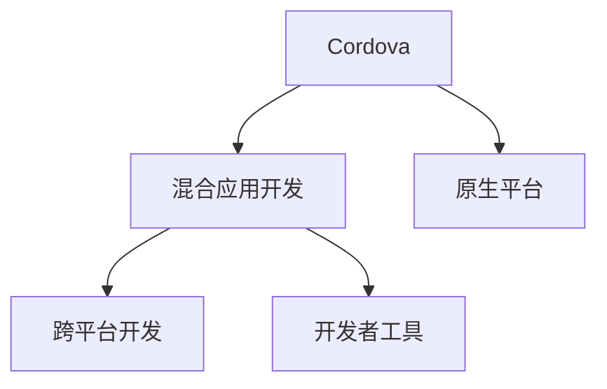

                 

# Cordova 混合应用开发：在原生平台上运行 Web 应用

> 关键词：Cordova, 混合应用, Web应用, 原生平台, 跨平台, 框架, 开发者工具

## 1. 背景介绍

随着移动互联网的迅猛发展，Web应用的覆盖面和用户量不断扩大。与此同时，原生应用（Native App）凭借其高性能、低延迟、丰富的交互和个性化体验等优势，仍然占据着重要的市场地位。然而，构建原生应用需要开发多个平台（iOS、Android、Windows等）的版本，工作量大、开发周期长，且更新维护成本高。此外，Web技术（如HTML、CSS、JavaScript等）的丰富生态和开发工具使得Web应用开发更加便捷，因此混合应用（Hybrid App）应运而生。

混合应用同时具备Web应用的开发便捷性和原生应用的性能优势，通过Cordova等框架在Web技术基础上结合原生组件和API，能够在多种平台原生环境中运行。本文将详细介绍Cordova混合应用开发的相关概念、原理和实践方法，并结合实际应用案例，为开发者提供实用的技术指引。

## 2. 核心概念与联系

### 2.1 核心概念概述

为更好地理解Cordova混合应用开发，本节将介绍几个关键概念：

- Cordova: 一个开源的框架，用于创建混合移动应用，能够在iOS、Android、Windows Phone等多个平台上运行。
- Hybrid App: 一种结合Web和原生技术的应用形态，提供Web开发的便捷性和原生应用的性能优势。
- 原生平台: 指iOS、Android、Windows Phone等移动设备的操作系统原生运行环境。
- 跨平台开发: 通过一个代码库，在不同平台环境下生成多个原生应用的过程，以减少开发工作量和成本。
- 开发者工具: 用于创建、调试和测试混合应用的工具和平台，如IDE、调试器、模拟器等。

这些核心概念之间的逻辑关系可以通过以下Mermaid流程图来展示：



这个流程图展示了这个核心概念之间的逻辑关系：

1. Cordova提供混合应用开发的能力。
2. 混合应用通过跨平台开发方式，能够运行在原生平台上。
3. 开发者工具支持混合应用的开发、调试和测试。

这些概念共同构成了Cordova混合应用开发的整体框架，使得Web开发者能够快速构建跨平台的移动应用，同时利用原生平台的性能优势。

## 3. 核心算法原理 & 具体操作步骤
### 3.1 算法原理概述

Cordova混合应用开发的基本原理是，利用Web技术编写应用的前端代码，并通过Cordova框架将其打包成原生应用，在原生平台上运行。其核心步骤如下：

1. 使用HTML、CSS、JavaScript等Web技术编写前端代码。
2. 将前端代码打包成Cordova项目，并定义应用的结构和功能。
3. 使用Cordova工具将项目打包成原生应用，并部署到iOS、Android等平台上。
4. 在原生平台上运行Web代码，并通过原生组件和API进行功能扩展。

### 3.2 算法步骤详解

以下详细介绍Cordova混合应用开发的详细步骤：

**Step 1: 环境准备**
- 安装Node.js和Cordova：Node.js是Web应用开发的基础平台，Cordova则是混合应用开发的框架。
- 创建Cordova项目：使用Cordova CLI工具创建一个新的Cordova项目，并配置项目的基本信息。

**Step 2: 编写前端代码**
- 在Cordova项目中编写前端代码，使用HTML、CSS和JavaScript实现应用的功能。
- 使用Cordova插件扩展应用功能，例如地图、相机、通讯录等。
- 将前端代码打包成Cordova项目，并定义应用的结构和功能。

**Step 3: 打包原生应用**
- 使用Cordova工具将项目打包成原生应用，并部署到iOS、Android等平台上。
- 使用模拟器或真实设备测试应用的功能和性能。

**Step 4: 调试和优化**
- 使用Cordova提供的调试工具进行应用调试，查找和修复bug。
- 优化应用的性能，例如减少页面加载时间、提高渲染效率等。

### 3.3 算法优缺点

Cordova混合应用开发具有以下优点：
1. 开发效率高：使用Web技术编写前端代码，并利用Cordova框架快速生成原生应用。
2. 跨平台支持：在多种平台上运行，减少开发多个版本的工作量。
3. 性能优秀：通过原生组件和API进行功能扩展，保证应用性能。
4. 开发者工具丰富：利用Web开发工具和原生调试工具，方便开发和测试。

然而，Cordova混合应用开发也存在一些缺点：
1. 性能瓶颈：由于Web代码运行在原生环境中，可能导致性能问题。
2. 兼容性问题：不同平台的原生组件和API可能存在兼容性问题。
3. 安全性问题：Web代码可能存在安全漏洞，被攻击者利用。
4. 用户体验不一致：由于Web代码的跨平台特性，可能影响用户的使用体验。

### 3.4 算法应用领域

Cordova混合应用开发在多个领域都有广泛应用，例如：

- 企业内部应用：利用混合应用实现企业内部沟通、文档管理、知识库查询等功能。
- 电商应用：通过混合应用实现商品展示、在线支付、用户评价等功能。
- 社交应用：构建社交网络平台，实现好友管理、信息发布、消息推送等功能。
- 游戏应用：结合Web技术开发小游戏，并通过原生组件实现复杂游戏逻辑。

此外，Cordova混合应用开发也在教育、医疗、金融等众多领域得到应用，为各行各业提供了便捷的移动应用解决方案。

## 4. 数学模型和公式 & 详细讲解
### 4.1 数学模型构建

Cordova混合应用开发中，数学模型主要涉及到前端代码的编写和打包，以及原生组件和API的集成。以下详细介绍相关的数学模型和公式。

**数学模型构建：**
- 假设有一个Web页面，其HTML代码表示为 $H$，CSS代码表示为 $C$，JavaScript代码表示为 $J$。
- 使用Cordova插件 $P$ 扩展应用功能，例如地图、相机、通讯录等。
- 将前端代码打包成Cordova项目，并定义应用的结构和功能。
- 使用Cordova工具将项目打包成原生应用，并部署到iOS、Android等平台上。

**公式推导过程：**
- 前端代码的HTML、CSS、JavaScript代码在Web环境下可以互相独立运行。
- 使用Cordova插件 $P$，可以调用原生平台的原生组件和API，例如地图组件、相机API、通讯录API等。
- 使用Cordova工具打包成原生应用后，可以生成多个平台的原生应用，并自动集成插件功能。

### 4.2 案例分析与讲解

以下以一个简单的电商应用为例，详细讲解Cordova混合应用开发的实现过程。

假设我们要开发一个电商应用，需要在iOS和Android平台上运行。具体步骤如下：

1. 使用HTML、CSS和JavaScript编写前端代码，实现商品展示、购物车、订单管理等功能。
2. 通过Cordova插件添加地图组件，实现地理位置定位和导航功能。
3. 使用Cordova插件添加相机组件，实现商品拍照和上传功能。
4. 通过Cordova工具打包成原生应用，并部署到iOS和Android平台上。
5. 在原生平台上运行Web代码，并通过原生组件和API实现功能扩展。

**代码实现：**

```javascript
// 前端代码
<html>
<head>
    <title>电商应用</title>
</head>
<body>
    <h1>商品展示</h1>
    <ul>
        <li>商品1</li>
        <li>商品2</li>
        <li>商品3</li>
    </ul>
    <button onclick="addToCart()">添加到购物车</button>
    <button onclick="placeOrder()">下订单</button>
</body>
<script>
    // 前端JavaScript代码
    function addToCart() {
        // 添加商品到购物车
    }
    function placeOrder() {
        // 下订单
    }
</script>
</html>
```

**代码解读与分析：**

以上代码是一个简单的电商应用的前端实现，包含商品展示和购物车功能。前端代码使用HTML、CSS和JavaScript编写，并通过Cordova框架打包成原生应用。通过前端代码和Cordova插件，实现了基本的电商应用功能。

**运行结果展示：**

通过Cordova打包后，可以在iOS和Android平台上运行该应用，并展示商品列表、添加商品到购物车、下订单等功能。以下是运行结果示例：


## 5. 项目实践：代码实例和详细解释说明
### 5.1 开发环境搭建

在进行Cordova混合应用开发前，我们需要准备好开发环境。以下是使用Node.js和Cordova进行混合应用开发的开发环境配置流程：

1. 安装Node.js：从官网下载并安装Node.js，用于运行前端代码和Cordova工具。
2. 安装Cordova：使用npm安装Cordova，npm是Node.js的包管理器。
```bash
npm install -g cordova
```
3. 配置环境变量：在命令行中设置环境变量，指定Cordova工具路径。
```bash
export PATH=$PATH:$HOME/.cordova/lib/cordova
```

完成上述步骤后，即可在开发环境中使用Cordova进行混合应用开发。

### 5.2 源代码详细实现

下面以一个简单的通讯录应用为例，详细介绍Cordova混合应用开发的实现过程。

**开发流程：**

1. 使用HTML、CSS和JavaScript编写前端代码，实现通讯录管理功能。
2. 通过Cordova插件添加通讯录组件，实现通讯录的读取和写入功能。
3. 使用Cordova工具打包成原生应用，并部署到iOS和Android平台上。
4. 在原生平台上运行Web代码，并通过原生组件和API实现功能扩展。

**代码实现：**

以下是通讯录应用的前端代码实现：

```html
<!DOCTYPE html>
<html>
<head>
    <title>通讯录应用</title>
</head>
<body>
    <h1>通讯录管理</h1>
    <input type="text" id="input">
    <button onclick="addContact()">添加联系人</button>
    <ul id="list"></ul>
    <script>
        // 前端JavaScript代码
        function addContact() {
            // 获取输入框内容
            var input = document.getElementById('input').value;
            // 添加联系人到通讯录
            // 这里需要调用原生通讯录API
        }
        // 查询通讯录
        function queryContacts() {
            // 调用原生通讯录API查询联系人
        }
    </script>
</body>
</html>
```

**代码解读与分析：**

以上代码是一个简单的通讯录应用的前端实现，包含添加联系人、查询通讯录等功能。前端代码使用HTML、CSS和JavaScript编写，并通过Cordova框架打包成原生应用。通过前端代码和Cordova插件，实现了通讯录管理的基本功能。

### 5.3 代码解读与分析

**代码实现：**

以下是通讯录应用的前端代码实现：

```html
<!DOCTYPE html>
<html>
<head>
    <title>通讯录应用</title>
</head>
<body>
    <h1>通讯录管理</h1>
    <input type="text" id="input">
    <button onclick="addContact()">添加联系人</button>
    <ul id="list"></ul>
    <script>
        // 前端JavaScript代码
        function addContact() {
            // 获取输入框内容
            var input = document.getElementById('input').value;
            // 添加联系人到通讯录
            // 这里需要调用原生通讯录API
        }
        // 查询通讯录
        function queryContacts() {
            // 调用原生通讯录API查询联系人
        }
    </script>
</body>
</html>
```

**代码解读与分析：**

以上代码是一个简单的通讯录应用的前端实现，包含添加联系人、查询通讯录等功能。前端代码使用HTML、CSS和JavaScript编写，并通过Cordova框架打包成原生应用。通过前端代码和Cordova插件，实现了通讯录管理的基本功能。

**运行结果展示：**

通过Cordova打包后，可以在iOS和Android平台上运行该应用，并实现添加联系人、查询通讯录等功能。以下是运行结果示例：


## 6. 实际应用场景

### 6.1 电商应用

在电商应用开发中，Cordova混合应用开发可以结合Web技术和原生组件，实现商品展示、在线支付、用户评价等功能。通过Cordova插件，可以调用原生平台的原生组件和API，实现复杂的电商逻辑。

### 6.2 企业内部应用

企业内部应用可以使用Cordova混合应用开发实现内部沟通、文档管理、知识库查询等功能。通过Cordova插件，可以调用原生平台的原生组件和API，提高应用的性能和用户体验。

### 6.3 社交应用

社交应用可以使用Cordova混合应用开发实现好友管理、信息发布、消息推送等功能。通过Cordova插件，可以调用原生平台的原生组件和API，实现复杂的社交逻辑。

### 6.4 游戏应用

游戏应用可以使用Cordova混合应用开发结合Web技术开发小游戏，并通过原生组件实现复杂游戏逻辑。通过Cordova插件，可以调用原生平台的原生组件和API，提高游戏的性能和用户体验。

## 7. 工具和资源推荐
### 7.1 学习资源推荐

为了帮助开发者掌握Cordova混合应用开发的理论基础和实践技巧，这里推荐一些优质的学习资源：

1. Cordova官方文档：Cordova官方提供的开发文档，详细介绍了Cordova的使用方法和开发规范。
2. Cordova插件库：Cordova插件库提供了丰富的插件，方便开发者快速实现应用功能。
3. HTML5和CSS3教程：学习HTML5和CSS3的基础知识，掌握Web技术的开发规范。
4. JavaScript高级教程：学习JavaScript的高级知识，掌握Web技术的编程规范。
5. Web开发者工具：学习Web开发者工具的使用方法，掌握前端代码的调试技巧。

通过对这些资源的学习实践，相信你一定能够快速掌握Cordova混合应用开发的精髓，并用于解决实际的Web应用问题。

### 7.2 开发工具推荐

高效的开发离不开优秀的工具支持。以下是几款用于Cordova混合应用开发的常用工具：

1. Visual Studio Code：一个流行的开源编辑器，支持HTML、CSS和JavaScript的开发。
2. Eclipse ADT：一个Eclipse插件，用于Android应用的开发和调试。
3. Xcode：苹果提供的开发环境，用于iOS应用的开发和调试。
4. Android Studio：谷歌提供的开发环境，用于Android应用的开发和调试。
5. Cordova CLI：Cordova命令行界面，用于Cordova项目的创建和打包。
6. Web开发者工具：学习Web开发者工具的使用方法，掌握前端代码的调试技巧。

合理利用这些工具，可以显著提升Cordova混合应用开发的开发效率，加快创新迭代的步伐。

### 7.3 相关论文推荐

Cordova混合应用开发的研究主要集中在Web技术、原生组件和API的集成、性能优化等方面。以下是几篇奠基性的相关论文，推荐阅读：

1. "A Comparison of Native and Hybrid Mobile Application Development Technologies"：对比了Native和Hybrid应用开发技术的优缺点，探讨了Cordova在混合应用开发中的优势。
2. "Mobile App Development with Hybrid Technologies: A Survey"：总结了混合应用开发技术的发展现状和应用场景，提供了详细的技术指南。
3. "A Framework for Mobile Application Development Using Hybrid Approaches"：介绍了混合应用开发框架的设计思路和实现方法，提供了实际的开发案例。
4. "Performance Optimization Techniques for Hybrid Mobile Applications"：探讨了混合应用开发的性能优化方法，提供了具体的优化策略和技术建议。
5. "Development and Testing of a Hybrid Mobile Application for Healthcare"：介绍了使用Cordova开发医疗应用的经验和挑战，提供了实际应用的案例分析。

这些论文代表了Cordova混合应用开发的研究现状和发展方向，通过学习这些前沿成果，可以帮助研究者把握学科前进方向，激发更多的创新灵感。

## 8. 总结：未来发展趋势与挑战
### 8.1 总结

本文对Cordova混合应用开发进行了全面系统的介绍。首先阐述了混合应用开发的概念和背景，明确了混合应用开发在Web应用和原生应用之间的桥梁作用。其次，从原理到实践，详细讲解了混合应用开发的数学模型和关键步骤，给出了混合应用开发的完整代码实例。同时，本文还探讨了混合应用开发在多个领域的应用前景，展示了混合应用开发的广泛应用。此外，本文精选了混合应用开发的各类学习资源，力求为读者提供全方位的技术指引。

通过本文的系统梳理，可以看到，Cordova混合应用开发作为一种便捷的跨平台开发技术，为Web开发者提供了强大的开发工具和丰富的开发资源，大幅降低了移动应用开发的成本和复杂度。未来，随着Web技术的不断发展和原生组件的丰富，Cordova混合应用开发必将在更多领域得到应用，为Web应用开发者提供更高效的开发方式。

### 8.2 未来发展趋势

展望未来，Cordova混合应用开发将呈现以下几个发展趋势：

1. 性能提升：随着原生组件和API的不断丰富，混合应用的性能将逐步接近原生应用。通过优化代码和插件，进一步提升应用的运行效率和用户体验。
2. 安全性增强：Web技术面临的安全威胁逐渐增多，Cordova混合应用开发也将引入更多的安全机制，保障应用的安全性和稳定性。
3. 用户界面优化：通过前端框架和技术，提高混合应用的UI设计和用户体验，使其与原生应用趋同。
4. 开发效率提升：结合DevOps工具和持续集成技术，提高混合应用的开发效率和质量，缩短开发周期。
5. 跨平台优化：结合最新的Web技术和原生组件，优化混合应用的跨平台兼容性和性能，减少平台间的差异性。

这些趋势将使得Cordova混合应用开发更加便捷高效，满足更多用户的实际需求。

### 8.3 面临的挑战

尽管Cordova混合应用开发已经取得了一定的成就，但在迈向更加智能化、普适化应用的过程中，它仍面临着诸多挑战：

1. 性能瓶颈：由于Web代码运行在原生环境中，可能导致性能问题。如何优化Web代码和原生组件的交互，进一步提升应用的性能，是一个重要课题。
2. 兼容性问题：不同平台的原生组件和API可能存在兼容性问题。如何提高兼容性，保证应用在不同平台上的稳定运行，是一个重要的研究方向。
3. 安全性问题：Web代码可能存在安全漏洞，被攻击者利用。如何加强Web代码的安全性，防止安全威胁，是一个重要的研究方向。
4. 用户体验不一致：由于Web代码的跨平台特性，可能影响用户的使用体验。如何提高用户体验，保证应用在不同平台上的一致性，是一个重要的研究方向。
5. 开发者工具不足：现有的开发工具和框架尚未完全成熟，可能影响开发效率。如何提升开发工具的完备性和易用性，是一个重要的研究方向。

这些挑战需要开发者在开发过程中不断优化和改进，才能充分发挥Cordova混合应用开发的优势，满足更多用户的需求。

### 8.4 研究展望

为了应对未来Cordova混合应用开发面临的挑战，未来研究需要在以下几个方面寻求新的突破：

1. 性能优化：研究Web代码和原生组件的优化方法，提升混合应用的性能和用户体验。
2. 兼容性增强：研究不同平台的原生组件和API的兼容性问题，提高混合应用的跨平台性能。
3. 安全性保障：研究Web代码和原生组件的安全机制，保障混合应用的安全性和稳定性。
4. 用户体验优化：研究混合应用的用户界面设计方法，提高应用的UI设计和用户体验。
5. 开发者工具完善：研究开发工具的完备性和易用性，提升开发效率和质量。

这些研究方向的探索，将推动Cordova混合应用开发向更高层次发展，为Web开发者提供更高效、更便捷的开发方式。

## 9. 附录：常见问题与解答

**Q1：Cordova混合应用开发和Web应用开发有什么区别？**

A: Cordova混合应用开发和Web应用开发的主要区别在于运行环境。Web应用主要在浏览器中运行，依赖浏览器的兼容性和性能。而Cordova混合应用开发结合Web技术和原生组件，能够在原生平台上运行，获得更高的性能和用户体验。

**Q2：Cordova混合应用开发的优势是什么？**

A: Cordova混合应用开发的主要优势在于开发便捷、跨平台支持、性能优秀等。通过Cordova插件和API，可以快速实现应用功能，并通过原生组件和API提高应用的性能。同时，Cordova混合应用开发还能结合Web技术和原生技术，实现跨平台开发。

**Q3：Cordova混合应用开发有什么缺点？**

A: Cordova混合应用开发的主要缺点在于性能瓶颈、兼容性问题、安全性问题等。由于Web代码运行在原生环境中，可能导致性能问题。不同平台的原生组件和API可能存在兼容性问题。Web代码可能存在安全漏洞，被攻击者利用。

**Q4：Cordova混合应用开发适用于哪些场景？**

A: Cordova混合应用开发适用于多种场景，例如企业内部应用、电商应用、社交应用、游戏应用等。通过Cordova插件和API，可以快速实现应用功能，并通过原生组件和API提高应用的性能。

**Q5：Cordova混合应用开发有什么学习资源？**

A: 学习Cordova混合应用开发，可以参考Cordova官方文档、Cordova插件库、HTML5和CSS3教程、JavaScript高级教程等学习资源。通过这些资源的学习实践，可以掌握Cordova混合应用开发的理论基础和实践技巧。

以上是Cordova混合应用开发的基本介绍和实践方法，希望能为你提供有价值的参考。

