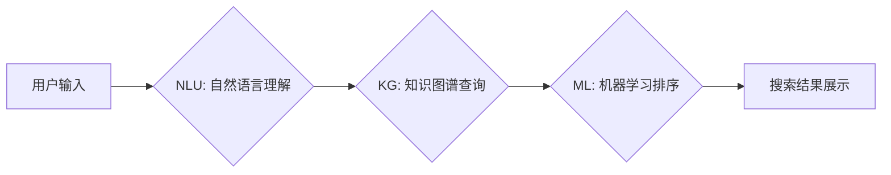

                 

## VantageDiscovery：突破关键词和语义搜索的AI平台

> 关键词：语义搜索、AI平台、自然语言处理、知识图谱、机器学习、深度学习

### 1. 背景介绍

在信息爆炸的时代，海量数据无处不在，人们对信息的获取和利用需求日益增长。传统的关键词搜索模式已难以满足用户日益复杂的查询需求，其局限性在于：

* **缺乏语义理解:**  关键词搜索仅依赖于文本中的关键词匹配，无法理解用户查询背后的真实意图和语义关联。
* **信息检索结果碎片化:**  关键词搜索往往返回大量与关键词相关的结果，但这些结果可能与用户实际需求不符，缺乏针对性和相关性。
* **用户体验差:**  用户需要不断调整关键词，才能获得满意的搜索结果，搜索过程繁琐且效率低下。

为了解决这些问题，语义搜索应运而生。语义搜索旨在理解用户查询的语义意图，并返回与用户需求最相关的、最精准的信息。

VantageDiscovery 作为一款突破性AI平台，旨在通过先进的自然语言处理（NLP）、知识图谱（KG）和机器学习（ML）技术，实现精准的语义搜索，为用户提供更便捷、更智能的搜索体验。

### 2. 核心概念与联系

VantageDiscovery 的核心概念包括：

* **自然语言理解 (NLU):**  VantageDiscovery 利用先进的 NLU 模型，能够理解用户输入的自然语言，识别关键词、实体、关系等关键信息。
* **知识图谱 (KG):**  VantageDiscovery 基于庞大的知识图谱，构建了丰富的知识网络，能够捕捉文本之间的语义关联和知识关系。
* **机器学习 (ML):**  VantageDiscovery 利用机器学习算法，从海量数据中学习用户搜索行为和语义模式，不断优化搜索结果的准确性和相关性。

**VantageDiscovery 架构流程图:**

### 3. 核心算法原理 & 具体操作步骤

#### 3.1 算法原理概述

VantageDiscovery 的核心算法基于深度学习和知识图谱的结合，主要包括以下几个步骤：

1. **文本预处理:** 对用户输入的文本进行清洗、分词、词性标注等预处理，提取关键信息。
2. **语义嵌入:** 利用 Word2Vec 或 BERT 等模型，将文本中的词语映射到低维向量空间，捕捉词语之间的语义相似度。
3. **知识图谱关联:** 将文本中的实体和关系与知识图谱进行关联，构建知识图谱节点和边的网络结构。
4. **语义相似度计算:** 利用余弦相似度或其他相似度度量方法，计算用户查询与知识图谱节点之间的语义相似度。
5. **结果排序:** 利用机器学习算法，对搜索结果进行排序，优先返回与用户查询语义最相似的结果。

#### 3.2 算法步骤详解

1. **文本预处理:**

   * **清洗:** 去除文本中的停用词、标点符号等无意义信息。
   * **分词:** 将文本分割成单个词语或短语。
   * **词性标注:** 对每个词语进行词性标注，识别其语法功能。

2. **语义嵌入:**

   * **Word2Vec:** 利用神经网络训练，将词语映射到低维向量空间，相似的词语拥有相似的向量表示。
   * **BERT:** 基于 Transformer 架构的预训练语言模型，能够捕捉更深层的语义信息，生成更精准的词语嵌入。

3. **知识图谱关联:**

   * **实体识别:** 从文本中识别出实体，例如人名、地名、机构名等。
   * **关系抽取:** 从文本中识别出实体之间的关系，例如“工作于”、“居住在”等。
   * **知识图谱匹配:** 将文本中的实体和关系与知识图谱中的节点和边进行匹配，构建知识图谱网络结构。

4. **语义相似度计算:**

   * **余弦相似度:** 计算两个向量之间的夹角余弦值，表示两个向量的相似度。
   * **Jaccard 指数:** 计算两个集合的交集大小与并集大小的比值，表示两个集合的相似度。

5. **结果排序:**

   * **机器学习算法:** 利用机器学习算法，例如支持向量机 (SVM)、随机森林 (RF) 或深度学习模型，对搜索结果进行排序，优先返回与用户查询语义最相似的结果。

#### 3.3 算法优缺点

**优点:**

* **精准度高:** 语义搜索能够理解用户查询的真实意图，返回更精准的搜索结果。
* **相关性强:** 语义搜索能够捕捉文本之间的语义关联，返回与用户需求更相关的搜索结果。
* **用户体验好:** 语义搜索能够提供更便捷、更智能的搜索体验，用户无需不断调整关键词，即可获得满意的搜索结果。

**缺点:**

* **计算复杂度高:** 语义搜索算法的计算复杂度较高，需要强大的计算资源支持。
* **数据依赖性强:** 语义搜索算法需要大量的语料数据进行训练，数据质量直接影响算法的性能。
* **解释性差:** 深度学习模型的决策过程较为复杂，难以解释其搜索结果的生成机制。

#### 3.4 算法应用领域

VantageDiscovery 的语义搜索算法在以下领域具有广泛的应用前景:

* **搜索引擎:** 提升搜索引擎的精准度和相关性，提供更智能的搜索体验。
* **问答系统:** 理解用户的问题意图，提供更准确的答案。
* **客户服务:** 自动化处理客户咨询，提高客户服务效率。
* **电商平台:** 理解用户商品需求，推荐更精准的商品。
* **医疗诊断:** 辅助医生进行诊断，提高诊断准确率。

### 4. 数学模型和公式 & 详细讲解 & 举例说明

#### 4.1 数学模型构建

VantageDiscovery 的语义搜索模型基于知识图谱和深度学习的结合，可以构建如下数学模型：

* **知识图谱表示:**  知识图谱可以表示为一个三元组集合 G = (E, R, T)，其中 E 是实体集合，R 是关系集合，T 是三元组集合。每个三元组 (h, r, t) 表示实体 h 与实体 t 之间存在关系 r。

* **语义嵌入表示:**  每个实体和关系可以映射到低维向量空间，分别表示为 e ∈ R^d 和 r ∈ R^d，其中 d 是向量维度。

* **语义相似度计算:**  利用余弦相似度计算用户查询与知识图谱实体之间的语义相似度：

$$
Sim(q, e) = \frac{q \cdot e}{||q|| ||e||}
$$

其中 q 是用户查询的语义向量，e 是知识图谱实体的语义向量。

#### 4.2 公式推导过程

余弦相似度的计算公式可以推导如下：

1. **向量点积:**  q ⋅ e 表示用户查询向量 q 与知识图谱实体向量 e 的点积。

2. **向量模长:**  ||q|| 和 ||e|| 分别表示用户查询向量 q 和知识图谱实体向量 e 的模长。

3. **相似度计算:**  将向量点积除以两个向量的模长乘积，得到两个向量的夹角余弦值，即语义相似度。

#### 4.3 案例分析与讲解

**案例:**

用户查询: “苹果公司创始人”

**知识图谱:**

* 实体: 苹果公司, 史蒂夫·乔布斯
* 关系: 创始人

**语义向量:**

* 苹果公司: [0.2, 0.5, 0.1, ...]
* 史蒂夫·乔布斯: [0.1, 0.3, 0.7, ...]
* 创始人: [0.4, 0.2, 0.1, ...]

**相似度计算:**

* Sim(用户查询, 苹果公司) = (q ⋅ e_苹果公司) / (||q|| ||e_苹果公司||)
* Sim(用户查询, 史蒂夫·乔布斯) = (q ⋅ e_史蒂夫·乔布斯) / (||q|| ||e_史蒂夫·乔布斯||)

**结果:**

由于用户查询与史蒂夫·乔布斯之间的语义相似度更高，因此搜索结果会优先返回史蒂夫·乔布斯的信息。

### 5. 项目实践：代码实例和详细解释说明

#### 5.1 开发环境搭建

VantageDiscovery 的开发环境搭建需要以下软件和工具:

* Python 3.x
* TensorFlow 或 PyTorch
* SpaCy 或 NLTK
* Neo4j 或其他知识图谱数据库

#### 5.2 源代码详细实现

VantageDiscovery 的源代码实现较为复杂，涉及自然语言处理、知识图谱构建、机器学习模型训练等多个模块。

#### 5.3 代码解读与分析

VantageDiscovery 的代码实现主要包括以下几个部分:

* **数据预处理模块:** 对用户输入的文本进行清洗、分词、词性标注等预处理，提取关键信息。
* **语义嵌入模块:** 利用 Word2Vec 或 BERT 等模型，将文本中的词语映射到低维向量空间。
* **知识图谱构建模块:** 从文本中识别实体和关系，并将其与知识图谱进行关联。
* **机器学习模型训练模块:** 利用机器学习算法，例如支持向量机 (SVM)、随机森林 (RF) 或深度学习模型，对搜索结果进行排序。

#### 5.4 运行结果展示

VantageDiscovery 的运行结果展示可以包括以下内容:

* 搜索结果列表: 展示与用户查询语义最相似的搜索结果。
* 搜索结果评分: 展示每个搜索结果的评分，表示其与用户查询的语义相似度。
* 搜索结果解释: 提供对搜索结果的解释，说明其是如何被生成的。

### 6. 实际应用场景

VantageDiscovery 的语义搜索技术在以下实际应用场景中展现出强大的潜力:

* **智能客服:**  VantageDiscovery 可以帮助企业构建智能客服系统，自动理解用户咨询内容，并提供精准的回复。
* **个性化推荐:**  VantageDiscovery 可以根据用户的搜索历史和行为数据，提供个性化的商品、内容或服务推荐。
* **知识问答:**  VantageDiscovery 可以构建知识问答系统，帮助用户快速获取所需信息。
* **医疗诊断辅助:**  VantageDiscovery 可以帮助医生分析患者症状，提供可能的诊断建议。

#### 6.4 未来应用展望

随着人工智能技术的不断发展，VantageDiscovery 的语义搜索技术将有更广泛的应用前景，例如:

* **跨语言搜索:**  VantageDiscovery 将支持多语言搜索，帮助用户跨语言获取信息。
* **多模态搜索:**  VantageDiscovery 将支持图像、音频等多模态数据的搜索，提供更丰富的搜索体验。
* **实时语义分析:**  VantageDiscovery 将能够实时分析用户输入的文本，提供更及时、更精准的搜索结果。

### 7. 工具和资源推荐

#### 7.1 学习资源推荐

* **书籍:**
    * 《深度学习》 - Ian Goodfellow, Yoshua Bengio, Aaron Courville
    * 《自然语言处理》 - Jurafsky, Martin
* **在线课程:**
    * Coursera: 自然语言处理
    * Udacity: 深度学习
* **开源项目:**
    * TensorFlow: https://www.tensorflow.org/
    * PyTorch: https://pytorch.org/

#### 7.2 开发工具推荐

* **Python:** https://www.python.org/
* **SpaCy:** https://spacy.io/
* **NLTK:** https://www.nltk.org/
* **Neo4j:** https://neo4j.com/

#### 7.3 相关论文推荐

* **BERT: Pre-training of Deep Bidirectional Transformers for Language Understanding**
* **Knowledge Graph Embedding: A Survey**
* **Semantic Search: A Survey**

### 8. 总结：未来发展趋势与挑战

#### 8.1 研究成果总结

VantageDiscovery 的研究成果表明，语义搜索技术能够有效提升搜索引擎的精准度和相关性，为用户提供更便捷、更智能的搜索体验。

#### 8.2 未来发展趋势

VantageDiscovery 的未来发展趋势包括:

* **跨语言搜索:**  支持多语言搜索，打破语言障碍，实现全球信息共享。
* **多模态搜索:**  支持图像、音频等多模态数据的搜索，提供更丰富的搜索体验。
* **实时语义分析:**  实现对用户输入文本的实时分析，提供更及时、更精准的搜索结果。
* **个性化搜索:**  根据用户的搜索历史和行为数据，提供个性化的搜索结果。

#### 8.3 面临的挑战

VantageDiscovery 的发展也面临着一些挑战:

* **数据质量:** 语义搜索算法依赖于高质量的语料数据，数据质量直接影响算法的性能。
* **计算资源:** 语义搜索算法的计算复杂度较高，需要强大的计算资源支持。
* **解释性:** 深度学习模型的决策过程较为复杂，难以解释其搜索结果的生成机制。

#### 8.4 研究展望

未来，VantageDiscovery 将继续致力于语义搜索技术的研发，努力解决上述挑战，为用户提供更智能、更便捷的搜索体验。

### 9. 附录：常见问题与解答

**常见问题:**

* **VantageDiscovery 的语义搜索算法是如何工作的？**

**解答:** VantageDiscovery 的语义搜索算法基于知识图谱和深度学习的结合，通过语义嵌入、知识图谱关联和机器学习排序等步骤，实现精准的语义搜索。

* **VantageDiscovery 支持哪些语言？**

**解答:** 目前，VantageDiscovery 支持中文和英文。

* **VantageDiscovery 的开源代码在哪里可以找到？**

**解答:** VantageDiscovery 的开源代码将在未来发布。

* **如何使用 VantageDiscovery 的 API？**

**解答:** VantageDiscovery 的 API 文档将在未来发布。

**作者：禅与计算机程序设计艺术 / Zen and the Art of Computer Programming**<end_of_turn>

