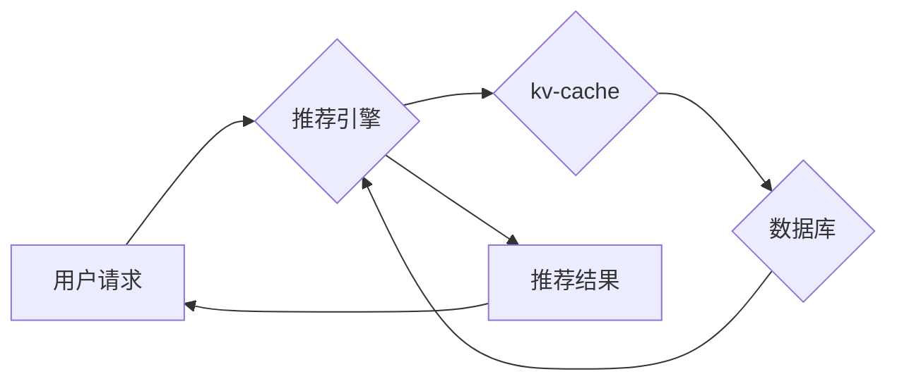

                 

## kv-cache 在推荐系统中的应用

> 关键词：推荐系统、缓存、kv-store、性能优化、数据结构、算法设计、高可用性

## 1. 背景介绍

推荐系统是现代互联网应用中不可或缺的一部分，其目标是根据用户的历史行为、偏好和上下文信息，预测用户可能感兴趣的内容，并将其推荐给用户。推荐系统广泛应用于电商平台、社交媒体、视频网站等领域，为用户提供个性化服务，提升用户体验。

然而，推荐系统通常需要处理海量数据，并进行复杂的计算，这会导致系统性能瓶颈，影响用户体验。为了解决这个问题，缓存技术被广泛应用于推荐系统中，其中 kv-cache 作为一种高效的缓存方案，在推荐系统中发挥着越来越重要的作用。

## 2. 核心概念与联系

### 2.1 kv-cache 简介

kv-cache 是一种键值对存储的缓存机制，它将数据存储为键值对的形式，并通过键进行快速查找和访问。kv-cache 的特点是：

* **高性能：** kv-cache 采用高效的数据结构和算法，能够实现极快的读写速度。
* **简单易用：** kv-cache 的接口简单易懂，易于集成到现有系统中。
* **可扩展性强：** kv-cache 可以通过水平扩展的方式，提高缓存容量和性能。

### 2.2 kv-cache 与推荐系统的关系

在推荐系统中，kv-cache 可以用于缓存以下数据：

* **用户特征：** 用户的年龄、性别、兴趣爱好等信息。
* **商品信息：** 商品的名称、价格、描述等信息。
* **推荐结果：** 针对特定用户的推荐结果。

通过缓存这些数据，可以减少对数据库的访问次数，提高推荐系统的响应速度。

### 2.3 kv-cache 架构



**图 1 kv-cache 在推荐系统中的应用架构**

## 3. 核心算法原理 & 具体操作步骤

### 3.1 算法原理概述

kv-cache 的核心算法原理是基于哈希表的数据结构。哈希表是一种高效的数据结构，它通过将键映射到一个固定大小的数组中，实现快速查找和访问。

### 3.2 算法步骤详解

1. **数据存储：** 将数据存储为键值对的形式，并将键映射到哈希表中对应的数组位置。
2. **数据查找：** 当需要查找数据时，根据键计算哈希值，并访问哈希表中对应的数组位置。
3. **数据更新：** 当需要更新数据时，根据键计算哈希值，并访问哈希表中对应的数组位置，更新对应的值。

### 3.3 算法优缺点

**优点：**

* **高性能：** 哈希表能够实现平均时间复杂度为 O(1) 的查找、插入和删除操作。
* **简单易用：** 哈希表的数据结构和算法相对简单，易于理解和实现。

**缺点：**

* **哈希冲突：** 当多个键映射到同一个数组位置时，就会发生哈希冲突，需要使用冲突解决机制，例如链地址法或开放地址法。
* **内存占用：** 哈希表需要占用一定的内存空间，如果缓存数据量过大，可能会导致内存不足。

### 3.4 算法应用领域

kv-cache 广泛应用于以下领域：

* **推荐系统：** 缓存用户特征、商品信息和推荐结果。
* **内容分发网络 (CDN)：** 缓存静态内容，例如图片、视频和网页。
* **数据库：** 缓存数据库查询结果，提高查询速度。
* **游戏服务器：** 缓存游戏数据，例如玩家信息和游戏地图。

## 4. 数学模型和公式 & 详细讲解 & 举例说明

### 4.1 数学模型构建

kv-cache 的数学模型可以描述为一个键值对映射关系，其中键为字符串，值可以是任何数据类型。

**定义：**

*  $K$：键空间，所有可能的键的集合。
*  $V$：值空间，所有可能的键对应的值的集合。
*  $f(k)$：哈希函数，将键 $k$ 映射到一个整数 $h$。
*  $T$：哈希表，是一个数组，每个元素是一个链表，用于存储键值对。

**模型：**

$T[f(k)] = (k, v)$

其中，$T[f(k)]$ 表示哈希表中索引为 $f(k)$ 的链表，$(k, v)$ 表示键值对。

### 4.2 公式推导过程

哈希函数 $f(k)$ 的设计目标是尽可能均匀地将键映射到哈希表中不同的索引位置，从而减少哈希冲突的发生。常用的哈希函数包括：

* **除法哈希函数：** $f(k) = k \mod m$，其中 $m$ 是哈希表的长度。
* **平方取中哈希函数：** $f(k) = floor((k^2) \mod m)$。

### 4.3 案例分析与讲解

假设我们有一个哈希表 $T$ 的长度为 10，以及以下键值对：

* $(k1, v1)$
* $(k2, v2)$
* $(k3, v3)$

如果使用除法哈希函数 $f(k) = k \mod 10$，则：

* $f(k1) = k1 \mod 10$
* $f(k2) = k2 \mod 10$
* $f(k3) = k3 \mod 10$

如果 $k1$, $k2$, $k3$ 分别映射到不同的索引位置，则哈希冲突不会发生。

## 5. 项目实践：代码实例和详细解释说明

### 5.1 开发环境搭建

* 操作系统：Linux/macOS/Windows
* 编程语言：Python
* 依赖库：

```
pip install redis
```

### 5.2 源代码详细实现

```python
import redis

# 连接到 Redis 服务器
r = redis.Redis(host='localhost', port=6379, db=0)

# 设置缓存键
key = 'user_info:123'

# 将用户数据存储到缓存中
r.set(key, '{"name": "John Doe", "age": 30, "city": "New York"}')

# 从缓存中获取用户数据
user_info = r.get(key)

# 打印用户数据
print(user_info.decode('utf-8'))
```

### 5.3 代码解读与分析

* 代码首先连接到 Redis 服务器。
* 然后，设置一个缓存键 `user_info:123`。
* 使用 `r.set()` 方法将用户数据存储到缓存中。
* 使用 `r.get()` 方法从缓存中获取用户数据。
* 最后，打印获取到的用户数据。

### 5.4 运行结果展示

```
{"name": "John Doe", "age": 30, "city": "New York"}
```

## 6. 实际应用场景

### 6.1 用户画像构建

在推荐系统中，用户画像是用户行为和偏好的抽象描述，可以用于个性化推荐。kv-cache 可以用于缓存用户画像数据，例如用户浏览历史、购买记录、评分等信息。

### 6.2 商品推荐

商品推荐是推荐系统中最常见的应用场景之一。kv-cache 可以用于缓存商品信息，例如商品名称、价格、描述等信息，以及用户对商品的评分和评价等数据。

### 6.3 个性化广告

个性化广告是指根据用户的兴趣爱好和行为特征，展示个性化的广告内容。kv-cache 可以用于缓存用户兴趣爱好和行为特征数据，以及广告信息数据，实现个性化广告推荐。

### 6.4 未来应用展望

随着推荐系统的不断发展，kv-cache 在推荐系统中的应用场景将会更加广泛。例如：

* **实时推荐：** kv-cache 可以用于缓存实时数据，例如用户实时行为和商品实时库存等信息，实现实时个性化推荐。
* **跨平台推荐：** kv-cache 可以用于缓存用户跨平台的数据，例如用户在手机端和电脑端的行为数据，实现跨平台个性化推荐。
* **联邦学习推荐：** kv-cache 可以用于缓存联邦学习模型的训练数据，提高联邦学习推荐的效率和准确性。

## 7. 工具和资源推荐

### 7.1 学习资源推荐

* **Redis 官方文档：** https://redis.io/docs/
* **Python Redis 库文档：** https://redis-py.readthedocs.io/en/stable/

### 7.2 开发工具推荐

* **Redis Desktop Manager：** https://github.com/redis/redis-desktop-manager
* **Redis CLI：** https://redis.io/docs/manual/

### 7.3 相关论文推荐

* **Redis: An In-Memory Data Structure Store**
* **Cache as a Service: A Survey**

## 8. 总结：未来发展趋势与挑战

### 8.1 研究成果总结

kv-cache 在推荐系统中的应用取得了显著的成果，能够有效提高推荐系统的性能和效率。

### 8.2 未来发展趋势

未来，kv-cache 在推荐系统中的应用将会更加深入和广泛，例如：

* **更智能的缓存策略：** 基于机器学习和深度学习算法，开发更智能的缓存策略，例如预测用户需求和动态调整缓存容量。
* **更安全的缓存机制：** 加强缓存数据的安全保护，防止数据泄露和攻击。
* **更分布式的缓存架构：** 构建更分布式的缓存架构，提高缓存系统的容错性和可扩展性。

### 8.3 面临的挑战

kv-cache 在推荐系统中的应用也面临一些挑战，例如：

* **缓存一致性：** 确保缓存数据与源数据的一致性，避免数据冲突。
* **缓存失效：** 缓存数据可能会过期或失效，需要及时更新缓存数据。
* **缓存管理复杂性：** 管理大型缓存系统需要复杂的管理工具和策略。

### 8.4 研究展望

未来，我们将继续研究 kv-cache 在推荐系统中的应用，探索更智能、更安全、更分布式的缓存架构，以提高推荐系统的性能和效率，为用户提供更个性化和精准的推荐服务。

## 9. 附录：常见问题与解答

### 9.1 常见问题

* **kv-cache 和数据库的区别是什么？**

kv-cache 和数据库都是用于存储数据的系统，但它们的设计目标和应用场景不同。数据库通常用于存储结构化数据，并提供复杂的查询和事务操作，而 kv-cache 则更侧重于快速存储和检索键值对数据。

* **如何选择合适的 kv-cache 解决方案？**

选择合适的 kv-cache 解决方案需要考虑以下因素：

* **数据量：** 缓存数据的量级。
* **访问频率：** 缓存数据的访问频率。
* **数据结构：** 缓存数据的结构类型。
* **性能需求：** 对缓存性能的要求。
* **成本预算：** 缓存解决方案的成本预算。

* **如何避免 kv-cache 的哈希冲突？**

可以使用链地址法或开放地址法等冲突解决机制来避免哈希冲突。

* **如何管理大型 kv-cache 系统？**

管理大型 kv-cache 系统需要使用专业的缓存管理工具和策略，例如缓存淘汰策略、缓存监控和报警等。

### 9.2 常见问题解答

* **kv-cache 和数据库可以协同工作吗？**

是的，kv-cache 和数据库可以协同工作。kv-cache 可以用于缓存数据库查询结果，提高查询速度，而数据库可以用于存储更复杂的数据结构和关系。

* **kv-cache 是否适合存储所有类型的数据？**

kv-cache 更适合存储键值对数据，例如用户特征、商品信息和推荐结果等。对于需要存储复杂数据结构和关系的数据，建议使用数据库。

* **如何评估 kv-cache 的性能？**

可以评估 kv-cache 的性能指标，例如缓存命中率、平均查询时间、吞吐量等。


作者：禅与计算机程序设计艺术 / Zen and the Art of Computer Programming 
<end_of_turn>

