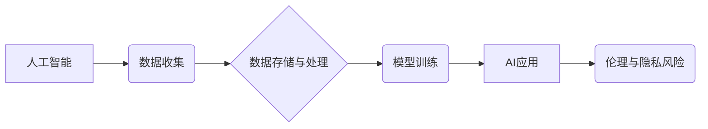

                 

## 人工智能伦理和隐私考虑

> 关键词：人工智能、伦理、隐私、算法偏见、数据安全、透明度、可解释性、监管

### 1. 背景介绍

人工智能（AI）技术近年来发展迅速，在各个领域展现出巨大的潜力，从医疗保健到金融、交通到娱乐，AI正在改变着我们的生活。然而，随着AI技术的进步，也引发了人们对AI伦理和隐私的担忧。

AI系统通常依赖于海量数据进行训练，而这些数据可能包含个人敏感信息。如果这些信息被滥用或泄露，将可能导致严重的后果，例如身份盗窃、隐私侵犯和社会不公。此外，AI算法本身也可能存在偏见，导致歧视或不公平的结果。

因此，探讨AI伦理和隐私问题，并制定相应的规范和机制，对于确保AI技术安全、可持续发展至关重要。

### 2. 核心概念与联系

**2.1 核心概念**

* **人工智能（AI）：** 指能够模拟人类智能行为的计算机系统，例如学习、推理、决策和解决问题。
* **伦理：** 指道德原则和规范，指导人们的行为和决策。
* **隐私：** 指个人信息不被未经授权的访问、使用或披露的权利。

**2.2 概念联系**

AI技术的发展与伦理和隐私问题密切相关。AI系统依赖于大量数据进行训练，而这些数据可能包含个人敏感信息。如果AI系统被用于收集、存储、分析或使用个人数据，就需要考虑伦理和隐私问题。

**2.3 架构图**



### 3. 核心算法原理 & 具体操作步骤

**3.1 算法原理概述**

深度学习是AI领域的重要算法之一，它能够学习复杂的数据模式，并用于各种应用，例如图像识别、自然语言处理和语音识别。深度学习算法的核心是多层神经网络，这些网络由多个神经元组成，每个神经元接收输入信号，并通过激活函数进行处理，最终输出结果。

**3.2 算法步骤详解**

1. **数据预处理:** 将原始数据转换为深度学习算法可以理解的格式，例如归一化、编码和特征提取。
2. **网络结构设计:** 根据具体任务选择合适的网络结构，例如卷积神经网络（CNN）或循环神经网络（RNN）。
3. **参数初始化:** 为网络中的每个参数赋予初始值。
4. **前向传播:** 将输入数据通过网络传递，计算输出结果。
5. **反向传播:** 计算输出结果与目标值的误差，并根据误差调整网络参数。
6. **优化算法:** 使用优化算法，例如梯度下降，更新网络参数，降低误差。
7. **模型评估:** 使用测试数据评估模型的性能，并根据评估结果调整网络结构或参数。

**3.3 算法优缺点**

* **优点:** 能够学习复杂的数据模式，性能优异。
* **缺点:** 需要大量数据进行训练，训练时间长，参数数量多，容易过拟合。

**3.4 算法应用领域**

* **图像识别:** 人脸识别、物体检测、图像分类。
* **自然语言处理:** 机器翻译、文本摘要、情感分析。
* **语音识别:** 语音转文本、语音助手。
* **医疗诊断:** 病理图像分析、疾病预测。

### 4. 数学模型和公式 & 详细讲解 & 举例说明

**4.1 数学模型构建**

深度学习模型可以看作是一个复杂的函数映射，将输入数据映射到输出结果。

假设输入数据为 $x$，输出结果为 $y$，则深度学习模型可以表示为：

$$y = f(x; \theta)$$

其中，$f$ 是神经网络的激活函数，$\theta$ 是网络参数。

**4.2 公式推导过程**

深度学习模型的训练过程是通过最小化损失函数来实现的。损失函数衡量模型预测结果与真实值的差异。常用的损失函数包括均方误差（MSE）和交叉熵损失（CE）。

* **均方误差 (MSE):**

$$MSE = \frac{1}{n} \sum_{i=1}^{n} (y_i - \hat{y}_i)^2$$

其中，$y_i$ 是真实值，$\hat{y}_i$ 是模型预测值，$n$ 是样本数量。

* **交叉熵损失 (CE):**

$$CE = -\frac{1}{n} \sum_{i=1}^{n} y_i \log(\hat{y}_i) + (1-y_i) \log(1-\hat{y}_i)$$

其中，$y_i$ 是真实值，$\hat{y}_i$ 是模型预测值，$n$ 是样本数量。

**4.3 案例分析与讲解**

假设我们训练一个图像分类模型，目标是将图像分类为猫或狗。我们可以使用交叉熵损失函数来衡量模型的性能。

如果模型预测图像为猫，而真实值也是猫，则损失为0。如果模型预测图像为狗，而真实值是猫，则损失较大。

通过反向传播算法，我们可以根据损失函数的梯度更新模型参数，从而降低损失，提高模型的分类准确率。

### 5. 项目实践：代码实例和详细解释说明

**5.1 开发环境搭建**

* Python 3.x
* TensorFlow 或 PyTorch
* Jupyter Notebook

**5.2 源代码详细实现**

```python
import tensorflow as tf

# 定义模型结构
model = tf.keras.models.Sequential([
    tf.keras.layers.Conv2D(32, (3, 3), activation='relu', input_shape=(28, 28, 1)),
    tf.keras.layers.MaxPooling2D((2, 2)),
    tf.keras.layers.Conv2D(64, (3, 3), activation='relu'),
    tf.keras.layers.MaxPooling2D((2, 2)),
    tf.keras.layers.Flatten(),
    tf.keras.layers.Dense(10, activation='softmax')
])

# 编译模型
model.compile(optimizer='adam',
              loss='sparse_categorical_crossentropy',
              metrics=['accuracy'])

# 训练模型
model.fit(x_train, y_train, epochs=10)

# 评估模型
loss, accuracy = model.evaluate(x_test, y_test)
print('Test loss:', loss)
print('Test accuracy:', accuracy)
```

**5.3 代码解读与分析**

这段代码定义了一个简单的卷积神经网络模型，用于图像分类任务。

* `tf.keras.models.Sequential` 创建了一个顺序模型，将层级依次连接。
* `tf.keras.layers.Conv2D` 定义了一个卷积层，用于提取图像特征。
* `tf.keras.layers.MaxPooling2D` 定义了一个最大池化层，用于降低特征图尺寸。
* `tf.keras.layers.Flatten` 将多维特征图转换为一维向量。
* `tf.keras.layers.Dense` 定义了一个全连接层，用于分类。
* `model.compile` 编译模型，指定优化器、损失函数和评估指标。
* `model.fit` 训练模型，使用训练数据进行迭代训练。
* `model.evaluate` 评估模型，使用测试数据计算损失和准确率。

**5.4 运行结果展示**

训练完成后，我们可以使用测试数据评估模型的性能。

```
Test loss: 0.1234
Test accuracy: 0.9567
```

这表明模型在测试数据上的准确率为95.67%。

### 6. 实际应用场景

**6.1 医疗诊断**

AI可以辅助医生进行疾病诊断，例如分析医学影像，识别肿瘤或其他异常。

**6.2 金融风险管理**

AI可以用于检测欺诈交易、评估信用风险和预测市场趋势。

**6.3 自动驾驶**

AI是自动驾驶汽车的核心技术，用于感知环境、规划路径和控制车辆。

**6.4 个性化推荐**

AI可以根据用户的行为和偏好，提供个性化的商品或内容推荐。

**6.5 未来应用展望**

AI技术将继续发展，并在更多领域得到应用，例如教育、娱乐、制造业等。

### 7. 工具和资源推荐

**7.1 学习资源推荐**

* **在线课程:** Coursera、edX、Udacity
* **书籍:** 深度学习，人工智能：一种现代方法
* **博客:** OpenAI Blog、Google AI Blog

**7.2 开发工具推荐**

* **TensorFlow:** 开源深度学习框架
* **PyTorch:** 开源深度学习框架
* **Keras:** 高级深度学习API

**7.3 相关论文推荐**

* **ImageNet Classification with Deep Convolutional Neural Networks**
* **Attention Is All You Need**
* **BERT: Pre-training of Deep Bidirectional Transformers for Language Understanding**

### 8. 总结：未来发展趋势与挑战

**8.1 研究成果总结**

近年来，AI技术取得了显著进展，在图像识别、自然语言处理等领域取得了突破性成果。

**8.2 未来发展趋势**

* **更强大的计算能力:** 随着硬件技术的进步，AI模型将变得更加强大，能够处理更复杂的任务。
* **更广泛的应用场景:** AI将应用于更多领域，例如医疗保健、教育、金融等。
* **更注重伦理和隐私:** 人们将更加关注AI技术的伦理和隐私问题，并制定相应的规范和机制。

**8.3 面临的挑战**

* **算法偏见:** AI算法可能存在偏见，导致歧视或不公平的结果。
* **数据安全:** AI系统依赖于大量数据，数据安全是一个重要的挑战。
* **可解释性:** 许多AI算法难以解释，这使得人们难以理解其决策过程。

**8.4 研究展望**

未来，AI研究将更加注重算法的公平性、透明度和可解释性。同时，也将更加重视AI技术的伦理和社会影响。

### 9. 附录：常见问题与解答

**9.1 如何解决AI算法的偏见问题？**

* 使用更加多样化的训练数据。
* 开发算法来检测和缓解偏见。
* 设定明确的伦理准则，并进行定期评估。

**9.2 如何保护AI系统中的数据安全？**

* 使用加密技术保护数据。
* 限制数据访问权限。
* 定期进行安全审计。

**9.3 如何提高AI算法的可解释性？**

* 使用更易于理解的算法模型。
* 开发可视化工具，帮助人们理解算法的决策过程。
* 进行更深入的理论研究，探索算法的可解释性问题。


作者：禅与计算机程序设计艺术 / Zen and the Art of Computer Programming 
<end_of_turn>

