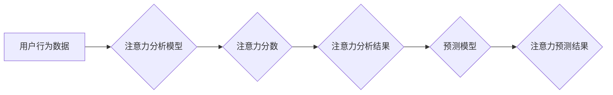

                 

## 人工智能驱动的注意力分析与预测

> 关键词：注意力机制、深度学习、自然语言处理、时间序列分析、预测模型、情感分析、用户行为分析

## 1. 背景介绍

在信息爆炸的时代，人类每天接触的海量信息中，只有极少部分信息真正能够引起我们的关注。如何有效地分析和预测用户对信息的注意力，对于提升用户体验、优化内容推荐、精准广告投放等方面具有重要意义。传统的注意力分析方法往往依赖于人工特征工程，难以捕捉复杂的信息交互模式。近年来，随着深度学习技术的快速发展，人工智能驱动的注意力分析与预测方法逐渐成为研究热点。

深度学习模型能够自动学习数据中的特征表示，并通过多层神经网络结构捕捉复杂的关系，从而实现对用户注意力更精准的分析和预测。本文将深入探讨人工智能驱动的注意力分析与预测方法，包括核心概念、算法原理、数学模型、项目实践以及实际应用场景等方面，并展望未来发展趋势和挑战。

## 2. 核心概念与联系

### 2.1 注意力机制

注意力机制（Attention Mechanism）是近年来深度学习领域的一项重要突破，它模仿了人类的注意力机制，能够帮助模型聚焦于输入序列中最重要的部分，从而提高模型的性能。

注意力机制的核心思想是赋予每个输入元素不同的权重，权重高的元素将被模型更加关注，权重低的元素则会被忽略。通过学习这些权重，模型能够自动地识别出输入序列中与目标任务相关的关键信息。

### 2.2  注意力分析与预测

注意力分析是指通过分析用户对信息的交互行为，例如阅读时长、点击次数、滑动方向等，来理解用户对信息的关注程度。注意力预测则是基于用户历史行为和信息特征，预测用户未来对信息的注意力。

人工智能驱动的注意力分析与预测方法通常结合深度学习模型和注意力机制，能够更有效地捕捉用户注意力背后的复杂因素。

**Mermaid 流程图**



## 3. 核心算法原理 & 具体操作步骤

### 3.1 算法原理概述

常见的注意力分析与预测算法包括：

* **Transformer模型:** Transformer模型是近年来深度学习领域的一项重要突破，它利用自注意力机制（Self-Attention）能够捕捉序列中不同元素之间的长距离依赖关系，在自然语言处理任务中取得了显著的成果。

* **Recurrent Neural Networks (RNNs):** RNNs是一种能够处理序列数据的深度学习模型，它通过循环神经网络结构能够捕捉序列中的时间依赖关系，在注意力分析与预测任务中也取得了不错的效果。

* **Long Short-Term Memory (LSTM):** LSTM是一种改进的RNN模型，它能够更好地解决RNNs在处理长序列数据时出现的梯度消失问题，在注意力分析与预测任务中表现更优异。

### 3.2 算法步骤详解

以Transformer模型为例，其注意力分析与预测的具体操作步骤如下：

1. **数据预处理:** 将用户行为数据和信息特征进行预处理，例如文本分词、词向量化、数值化等。

2. **编码器:** 将预处理后的数据输入到编码器中，编码器通过多层Transformer结构学习数据中的特征表示，并生成每个元素的隐藏状态。

3. **自注意力机制:** 在编码器中，自注意力机制能够捕捉每个元素与其他元素之间的关系，并生成每个元素的注意力权重。

4. **解码器:** 将编码器输出的隐藏状态输入到解码器中，解码器通过多层Transformer结构生成注意力预测结果。

5. **输出层:** 将解码器输出的注意力预测结果进行处理，例如转换为概率分布或注意力分数，最终得到注意力分析与预测结果。

### 3.3 算法优缺点

**优点:**

* 能够捕捉复杂的信息交互模式。
* 自动学习特征表示，无需人工特征工程。
* 在注意力分析与预测任务中取得了显著的成果。

**缺点:**

* 计算复杂度较高，训练时间较长。
* 对数据规模和质量要求较高。
* 模型解释性较差，难以理解模型的决策过程。

### 3.4 算法应用领域

人工智能驱动的注意力分析与预测方法在以下领域具有广泛的应用前景：

* **内容推荐:** 预测用户对不同内容的注意力，从而推荐更符合用户兴趣的内容。
* **精准广告投放:** 预测用户对不同广告的注意力，从而提高广告投放的精准度。
* **用户行为分析:** 分析用户对信息的交互行为，例如阅读时长、点击次数、滑动方向等，从而了解用户行为模式。
* **情感分析:** 分析用户对信息的评价和情感倾向，例如正面、负面、中性等。
* **机器翻译:** 提高机器翻译的准确性和流畅度，通过关注关键信息进行翻译。

## 4. 数学模型和公式 & 详细讲解 & 举例说明

### 4.1 数学模型构建

注意力机制的核心是计算每个输入元素的注意力权重。常用的注意力机制模型包括：

* **Scaled Dot-Product Attention:** 这种注意力机制通过计算输入元素与查询向量的点积，并进行缩放和softmax操作来计算注意力权重。

* **Multi-Head Attention:** 这种注意力机制使用多个独立的注意力头，每个注意力头学习不同的注意力模式，并通过拼接和线性变换来融合多个注意力头的输出。

### 4.2 公式推导过程

**Scaled Dot-Product Attention:**

设输入序列为 $X = \{x_1, x_2, ..., x_n\}$, 查询向量为 $Q$,  键向量为 $K$, 值向量为 $V$. 

1. 计算每个元素 $x_i$ 与查询向量 $Q$ 的点积:

 $$score(x_i, Q) = x_i^T Q$$

2. 对所有元素的点积进行缩放:

 $$z_i = \frac{score(x_i, Q)}{\sqrt{d_k}}$$

3. 计算softmax函数:

 $$a_i = \frac{exp(z_i)}{\sum_{j=1}^{n} exp(z_j)}$$

4. 计算注意力输出:

 $$out = \sum_{i=1}^{n} a_i V_i$$

其中 $d_k$ 是键向量的维度。

**Multi-Head Attention:**

Multi-Head Attention 将多个 Scaled Dot-Product Attention 头并行执行，每个头学习不同的注意力模式。

设有 $h$ 个注意力头，每个头的输出为 $out_h$.

最终的注意力输出为:

 $$out = Concat(out_1, out_2, ..., out_h) W_o$$

其中 $W_o$ 是一个线性变换矩阵。

### 4.3 案例分析与讲解

例如，在机器翻译任务中，输入序列为源语言文本，查询向量为目标语言词嵌入，键向量和值向量为源语言文本的词嵌入。通过注意力机制，模型能够关注源语言文本中与目标语言词相关的关键信息，从而提高翻译的准确性和流畅度。

## 5. 项目实践：代码实例和详细解释说明

### 5.1 开发环境搭建

* Python 3.6+
* TensorFlow/PyTorch

### 5.2 源代码详细实现

```python
import tensorflow as tf

# 定义 Transformer 模型
class Transformer(tf.keras.Model):
    def __init__(self, vocab_size, embedding_dim, num_heads, num_layers):
        super(Transformer, self).__init__()
        self.embedding = tf.keras.layers.Embedding(vocab_size, embedding_dim)
        self.encoder = tf.keras.layers.StackedRNNLayers(num_layers, embedding_dim)
        self.decoder = tf.keras.layers.StackedRNNLayers(num_layers, embedding_dim)
        self.attention = tf.keras.layers.MultiHeadAttention(num_heads, embedding_dim)

    def call(self, inputs):
        # 编码器
        encoder_outputs = self.encoder(inputs)
        # 解码器
        decoder_outputs = self.decoder(encoder_outputs)
        # 注意力机制
        attention_outputs = self.attention(decoder_outputs, encoder_outputs)
        return attention_outputs

# 实例化模型
model = Transformer(vocab_size=10000, embedding_dim=128, num_heads=8, num_layers=6)

# 训练模型
model.compile(optimizer='adam', loss='mse')
model.fit(x_train, y_train, epochs=10)

```

### 5.3 代码解读与分析

* **模型定义:** 代码定义了一个 Transformer 模型，包含嵌入层、编码器、解码器和注意力机制。
* **数据处理:** 训练模型需要准备训练数据，例如源语言文本和目标语言文本。
* **模型训练:** 使用 Adam 优化器和均方误差损失函数训练模型。

### 5.4 运行结果展示

训练完成后，可以使用模型预测新的文本翻译结果。

## 6. 实际应用场景

### 6.1 内容推荐系统

人工智能驱动的注意力分析与预测方法可以帮助内容推荐系统更精准地推荐用户感兴趣的内容。例如，电商平台可以根据用户的浏览历史、购买记录等信息，预测用户对不同商品的注意力，从而推荐更符合用户需求的商品。

### 6.2 精准广告投放

广告平台可以利用用户行为数据和广告特征，预测用户对不同广告的注意力，从而提高广告投放的精准度，降低广告成本。

### 6.3 用户行为分析

通过分析用户对信息的交互行为，例如阅读时长、点击次数、滑动方向等，可以了解用户行为模式，从而优化网站设计、改进用户体验。

### 6.4 未来应用展望

人工智能驱动的注意力分析与预测方法在未来将有更广泛的应用场景，例如：

* **个性化教育:** 根据学生的学习习惯和知识掌握情况，预测学生对不同学习内容的注意力，从而提供个性化的学习方案。
* **医疗诊断:** 分析患者的病历、检查结果等信息，预测患者对不同疾病的注意力，从而辅助医生进行诊断。
* **智能客服:** 通过分析用户的聊天记录和问题内容，预测用户对不同客服回复的注意力，从而提供更精准的客服服务。

## 7. 工具和资源推荐

### 7.1 学习资源推荐

* **书籍:**
    * 《深度学习》 by Ian Goodfellow, Yoshua Bengio, Aaron Courville
    * 《自然语言处理》 by Dan Jurafsky, James H. Martin
* **在线课程:**
    * Coursera: Deep Learning Specialization
    * Udacity: Deep Learning Nanodegree
* **博客和网站:**
    * TensorFlow Blog: https://blog.tensorflow.org/
    * PyTorch Blog: https://pytorch.org/blog/

### 7.2 开发工具推荐

* **TensorFlow:** https://www.tensorflow.org/
* **PyTorch:** https://pytorch.org/
* **Keras:** https://keras.io/

### 7.3 相关论文推荐

* **Attention Is All You Need:** https://arxiv.org/abs/1706.03762
* **BERT: Pre-training of Deep Bidirectional Transformers for Language Understanding:** https://arxiv.org/abs/1810.04805

## 8. 总结：未来发展趋势与挑战

### 8.1 研究成果总结

人工智能驱动的注意力分析与预测方法取得了显著的成果，在内容推荐、精准广告投放、用户行为分析等领域具有广泛的应用前景。

### 8.2 未来发展趋势

* **更强大的模型架构:** 研究更强大的注意力机制和深度学习模型架构，提高模型的性能和效率。
* **跨模态注意力分析:** 研究跨模态注意力分析方法，例如文本与图像、音频与视频的融合分析。
* **可解释性增强:** 研究注意力机制的可解释性，提高模型的透明度和可信度。

### 8.3 面临的挑战

* **数据规模和质量:** 训练高性能的注意力模型需要大量的训练数据，而高质量的数据往往难以获取。
* **计算资源:** 训练大型注意力模型需要大量的计算资源，这对于资源有限的机构或个人来说是一个挑战。
* **模型解释性:** 目前注意力机制的解释性仍然较差，难以理解模型的决策过程。

### 8.4 研究展望

未来，人工智能驱动的注意力分析与预测方法将继续发展，并应用于更多领域，为人类社会带来更多价值。


## 9. 附录：常见问题与解答

* **Q: 注意力机制是如何工作的？**

A: 注意力机制通过计算每个输入元素的注意力权重，来决定模型对每个元素的关注程度。权重高的元素将被模型更加关注，权重低的元素则会被忽略。

* **Q: Transformer模型有哪些优势？**

A: Transformer模型能够捕捉序列中不同元素之间的长距离依赖关系，在自然语言处理任务中取得了显著的成果。

* **Q: 如何评估注意力模型的性能？**

A: 常见的评估指标包括准确率、召回率、F1-score等。

* **Q: 如何选择合适的注意力机制？**

A: 选择合适的注意力机制取决于具体的应用场景和数据特点。

* **Q: 如何提高注意力模型的效率？**

A: 可以通过使用更轻量级的模型架构、优化训练参数、并行训练等方法提高模型的效率。


作者：禅与计算机程序设计艺术 / Zen and the Art of Computer Programming<end_of_turn>

