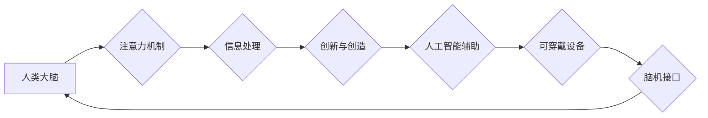

                 

## 人类注意力增强：提升创新能力和创造力技术

> 关键词：注意力增强、深度学习、脑机接口、认知科学、创新能力、创造力、神经网络、可穿戴设备

## 1. 背景介绍

在当今信息爆炸的时代，人类面临着前所未有的信息过载挑战。注意力，作为我们获取、处理和理解信息的关键能力，显得尤为重要。然而，现代生活节奏快、信息纷繁，人们的注意力持续时间和集中度都在下降，这严重阻碍了创新能力和创造力的提升。

注意力增强技术旨在通过科技手段帮助人们提升注意力水平，提高信息处理效率，从而促进创新和创造。近年来，随着人工智能、神经科学和生物技术等领域的快速发展，注意力增强技术取得了显著进展，并逐渐成为未来科技发展的重要方向之一。

## 2. 核心概念与联系

### 2.1 注意力机制

注意力机制是深度学习领域的重要组成部分，它模拟了人类对重要信息进行聚焦和筛选的过程。通过赋予不同输入不同权重，注意力机制可以帮助模型更好地理解上下文信息，提高预测精度。

### 2.2 脑机接口

脑机接口 (Brain-Computer Interface, BCI) 技术通过直接连接大脑和外部设备，实现人脑与计算机的交互。BCI 技术可以记录脑电信号，并将其转化为可理解的指令，从而控制外部设备或进行信息传输。

### 2.3 人工智能

人工智能 (Artificial Intelligence, AI) 技术旨在模拟和实现人类智能的行为，包括学习、推理、决策和创造。AI 技术可以应用于注意力增强领域，例如开发智能辅助工具，帮助用户集中注意力、过滤干扰信息。

**Mermaid 流程图**



## 3. 核心算法原理 & 具体操作步骤

### 3.1 算法原理概述

注意力增强算法通常基于深度学习技术，例如卷积神经网络 (CNN) 和循环神经网络 (RNN)。这些算法通过训练模型，学习识别和过滤干扰信息，从而提高用户的注意力水平。

### 3.2 算法步骤详解

1. **数据采集:** 收集用户脑电信号、眼动数据、生理指标等相关数据。
2. **数据预处理:** 对采集到的数据进行清洗、去噪、特征提取等处理。
3. **模型训练:** 使用深度学习算法训练模型，学习识别注意力相关特征。
4. **模型评估:** 使用测试数据评估模型的性能，例如注意力持续时间、集中度等指标。
5. **模型部署:** 将训练好的模型部署到可穿戴设备或其他平台，为用户提供注意力增强服务。

### 3.3 算法优缺点

**优点:**

* **精准度高:** 深度学习算法能够学习到复杂的注意力模式，提高注意力识别的精准度。
* **可定制化:** 算法可以根据用户的不同需求进行定制，例如针对不同类型任务、不同年龄段用户等。
* **持续改进:** 随着数据量的增加和算法的改进，注意力增强算法的性能将不断提升。

**缺点:**

* **数据依赖:** 深度学习算法需要大量的训练数据，数据质量直接影响算法性能。
* **计算资源:** 训练深度学习模型需要大量的计算资源，成本较高。
* **隐私安全:** 脑电信号等数据具有高度隐私性，需要采取有效措施保障数据安全。

### 3.4 算法应用领域

* **教育:** 帮助学生集中注意力，提高学习效率。
* **医疗:** 辅助治疗注意力缺陷多动障碍 (ADHD) 等疾病。
* **工作:** 提升工作效率，提高专注力。
* **娱乐:** 提供沉浸式游戏体验，增强用户参与度。

## 4. 数学模型和公式 & 详细讲解 & 举例说明

### 4.1 数学模型构建

注意力机制通常使用一个加权求和模型来计算注意力分数。

**公式:**

$$
\text{Attention}(Q, K, V) = \text{softmax}(\frac{Q K^T}{\sqrt{d_k}}) V
$$

其中:

* $Q$：查询矩阵
* $K$：键矩阵
* $V$：值矩阵
* $d_k$：键向量的维度
* $\text{softmax}$：softmax 函数

### 4.2 公式推导过程

softmax 函数将输入向量映射到一个概率分布，其中每个元素代表了对相应信息的关注程度。

**公式:**

$$
\text{softmax}(x_i) = \frac{e^{x_i}}{\sum_{j=1}^{n} e^{x_j}}
$$

其中:

* $x_i$：输入向量的第 i 个元素
* $n$：输入向量的维度

### 4.3 案例分析与讲解

假设我们有一个句子 "我爱学习编程"，我们想计算每个单词对句子的整体理解程度。

* $Q$：查询向量，表示当前单词对句子的关注程度。
* $K$：键向量，表示每个单词的语义特征。
* $V$：值向量，表示每个单词的语义信息。

通过计算 $QK^T$，我们可以得到每个单词对当前单词的相似度。然后使用 softmax 函数将这些相似度转换为概率分布，表示每个单词对句子的关注程度。

## 5. 项目实践：代码实例和详细解释说明

### 5.1 开发环境搭建

* Python 3.x
* TensorFlow 或 PyTorch 深度学习框架
* NumPy 科学计算库
* Matplotlib 数据可视化库

### 5.2 源代码详细实现

```python
import tensorflow as tf

# 定义注意力机制模型
class AttentionModel(tf.keras.Model):
    def __init__(self, units):
        super(AttentionModel, self).__init__()
        self.Wq = tf.keras.layers.Dense(units)
        self.Wk = tf.keras.layers.Dense(units)
        self.WV = tf.keras.layers.Dense(units)
        self.v = tf.keras.layers.Dense(1)

    def call(self, q, k, v):
        # 计算注意力分数
        scores = self.v(tf.nn.tanh(self.Wq(q) + self.Wk(k)))
        # 使用 softmax 函数将分数转换为概率分布
        attention_weights = tf.nn.softmax(scores, axis=-1)
        # 计算加权求和
        context_vector = attention_weights * v
        return tf.reduce_sum(context_vector, axis=-1)

# 实例化模型
model = AttentionModel(units=128)

# 输入数据
q = tf.random.normal((1, 5, 128))
k = tf.random.normal((1, 5, 128))
v = tf.random.normal((1, 5, 128))

# 计算注意力输出
output = model(q, k, v)
print(output.shape)
```

### 5.3 代码解读与分析

* 该代码定义了一个简单的注意力机制模型，使用 TensorFlow 框架实现。
* 模型包含三个稠密层，分别用于计算查询向量、键向量和值向量的表示。
* 注意力分数使用tanh函数和一个全连接层计算，然后使用 softmax 函数转换为概率分布。
* 最后，使用加权求和计算上下文向量，作为模型的输出。

### 5.4 运行结果展示

运行该代码后，会输出一个形状为 (1, 128) 的张量，表示注意力机制的输出。

## 6. 实际应用场景

### 6.1 教育领域

* **注意力训练游戏:** 利用注意力增强技术开发游戏，帮助学生训练注意力和集中力。
* **个性化学习:** 根据学生的注意力特点，提供个性化的学习内容和节奏。
* **远程学习辅助:** 帮助远程学习的学生保持注意力，提高学习效率。

### 6.2 医疗领域

* **ADHD 治疗辅助:** 帮助 ADHD 患者提高注意力和控制力。
* **认知功能评估:** 利用注意力增强技术评估患者的认知功能，辅助诊断和治疗。
* **康复训练:** 帮助脑损伤患者恢复注意力和认知功能。

### 6.3 工作领域

* **提高工作效率:** 帮助员工集中注意力，提高工作效率和生产力。
* **减少工作压力:** 通过注意力增强技术，帮助员工缓解工作压力和疲劳。
* **增强团队协作:** 利用注意力增强技术，帮助团队成员更好地集中注意力，提高协作效率。

### 6.4 未来应用展望

随着科技发展，注意力增强技术将应用于更广泛的领域，例如：

* **虚拟现实和增强现实:** 提供更沉浸式的体验，提高用户参与度。
* **自动驾驶:** 帮助驾驶员保持注意力，提高安全性和可靠性。
* **人机交互:** 开发更自然、更智能的人机交互方式。

## 7. 工具和资源推荐

### 7.1 学习资源推荐

* **书籍:**
    * Deep Learning by Ian Goodfellow, Yoshua Bengio, and Aaron Courville
    * Attention Is All You Need by Vaswani et al.
* **在线课程:**
    * TensorFlow 官方教程
    * PyTorch 官方教程
    * Coursera 上的深度学习课程

### 7.2 开发工具推荐

* **TensorFlow:** 开源深度学习框架，支持多种硬件平台。
* **PyTorch:** 开源深度学习框架，以其灵活性和易用性而闻名。
* **Keras:** 高级深度学习 API，可以运行在 TensorFlow 或 Theano 后端。

### 7.3 相关论文推荐

* **Attention Is All You Need:** https://arxiv.org/abs/1706.03762
* **BERT: Pre-training of Deep Bidirectional Transformers for Language Understanding:** https://arxiv.org/abs/1810.04805
* **Transformer-XL: Attentive Language Models Beyond a Fixed-Length Context:** https://arxiv.org/abs/1901.08316

## 8. 总结：未来发展趋势与挑战

### 8.1 研究成果总结

注意力增强技术取得了显著进展，在教育、医疗、工作等领域展现出巨大的应用潜力。深度学习算法、脑机接口技术和可穿戴设备等技术的融合，为注意力增强技术的发展提供了强有力的支撑。

### 8.2 未来发展趋势

* **更精准的注意力识别:** 利用更先进的算法和数据，提高注意力识别的精准度和效率。
* **更个性化的注意力增强:** 根据用户的不同需求和特点，提供个性化的注意力增强方案。
* **更广泛的应用场景:** 将注意力增强技术应用于更多领域，例如虚拟现实、增强现实、自动驾驶等。

### 8.3 面临的挑战

* **数据隐私安全:** 脑电信号等数据具有高度隐私性，需要采取有效措施保障数据安全。
* **算法伦理问题:** 注意力增强技术可能会被用于操纵用户行为，需要关注算法伦理问题。
* **技术可普及性:** 注意力增强技术目前仍处于发展阶段，需要降低技术门槛，提高技术可普及性。

### 8.4 研究展望

未来，注意力增强技术将继续朝着更精准、更个性化、更广泛的方向发展。随着科技的进步，注意力增强技术将为人类带来更多福祉，帮助人们更好地学习、工作、生活。

## 9. 附录：常见问题与解答

**Q1: 注意力增强技术是否安全？**

A1: 目前，注意力增强技术已广泛应用于医疗、教育等领域，安全性得到验证。但需要注意的是，任何新技术都可能存在潜在风险，使用注意力增强技术时，需要谨慎选择产品和服务，并关注自身的身体状况。

**Q2: 注意力增强技术是否会让人上瘾？**

A2: 目前没有证据表明注意力增强技术会让人上瘾。但过度使用任何技术都可能带来负面影响，建议适度使用注意力增强技术，并保持良好的生活习惯。

**Q3: 注意力增强技术是否适合所有人？**

A3: 注意力增强技术并非适合所有人，例如患有某些精神疾病的人群可能需要谨慎使用。建议在使用注意力增强技术之前，咨询专业医师的意见。


作者：禅与计算机程序设计艺术 / Zen and the Art of Computer Programming 
<end_of_turn>

