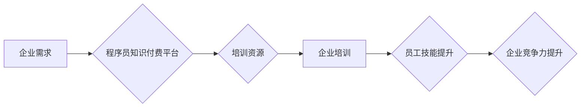

                 

## 企业培训：程序员知识付费的新蓝海

> 关键词：程序员培训、知识付费、企业需求、技术技能、人才培养、在线学习、行业趋势

### 1. 背景介绍

在当今数字化时代，科技创新日新月异，对程序员人才的需求量持续攀升。然而，传统的高校教育模式与企业实际需求之间存在一定的脱节，导致企业难以找到满足其特定技术需求的优秀人才。与此同时，程序员群体对持续学习和提升技能的需求也日益强烈。在这种背景下，企业培训应运而生，成为程序员知识付费的新蓝海。

**1.1 程序员人才市场现状**

* **需求旺盛:**  随着互联网、大数据、人工智能等技术的蓬勃发展，对程序员人才的需求量持续增长，各个行业都急需具备扎实编程技能和专业知识的程序员。
* **人才供需缺口:**  高校培养的程序员数量难以满足市场需求，而许多应届毕业生缺乏实际工作经验和企业所需技能，导致人才供需缺口不断扩大。
* **技能迭代快:**  软件开发领域技术迭代速度快，程序员需要不断学习新技术和掌握新技能才能保持竞争力。

**1.2 企业培训的机遇**

* **精准匹配:**  企业培训可以根据自身业务需求和技术方向，定制化培训课程，精准匹配企业所需人才技能。
* **快速提升:**  企业培训注重实践操作，可以帮助程序员快速掌握企业所需技能，缩短人才培养周期。
* **持续学习:**  企业培训可以建立持续学习机制，帮助程序员不断提升技能，适应技术发展趋势。

### 2. 核心概念与联系

企业培训是指企业为员工提供专业技能培训的活动，旨在提升员工的专业能力、工作效率和企业竞争力。程序员知识付费是指程序员通过付费的方式获取专业技能知识和培训资源。

**2.1 企业培训与程序员知识付费的联系**

企业培训与程序员知识付费之间存在着密切的联系。企业培训可以利用程序员知识付费平台提供的优质培训资源，为员工提供更有效的技能培训。而程序员知识付费平台则可以通过与企业合作，提供定制化培训服务，满足企业对特定技能的需求。

**2.2 企业培训模式**

* **内部培训:**  企业内部搭建培训体系，由内部专家或外部机构提供培训。
* **外部培训:**  企业与第三方培训机构合作，为员工提供培训服务。
* **在线培训:**  利用线上学习平台，提供远程培训课程和学习资源。

**2.3 Mermaid 流程图**



### 3. 核心算法原理 & 具体操作步骤

**3.1 算法原理概述**

企业培训的成功关键在于选择合适的算法和技术手段，以提高培训效率和效果。常见的算法包括：

* **推荐算法:**  根据用户的学习历史、兴趣偏好和技能水平，推荐合适的培训课程。
* **个性化学习算法:**  根据用户的学习进度和掌握情况，动态调整学习内容和难度，提供个性化的学习体验。
* **知识图谱算法:**  构建知识图谱，将不同领域的知识点进行关联，帮助用户理解知识之间的联系，提升学习效率。

**3.2 算法步骤详解**

* **数据收集:**  收集用户学习数据、技能水平数据、课程内容数据等。
* **数据预处理:**  对收集到的数据进行清洗、转换和特征提取。
* **模型训练:**  利用机器学习算法，训练推荐、个性化学习和知识图谱模型。
* **模型评估:**  评估模型的性能，并进行调整和优化。
* **系统部署:**  将训练好的模型部署到线上平台，为用户提供个性化培训服务。

**3.3 算法优缺点**

* **推荐算法:**  优点：可以根据用户需求精准推荐课程，提高用户学习兴趣。缺点：容易陷入推荐偏差，缺乏多样性。
* **个性化学习算法:**  优点：可以根据用户学习进度和掌握情况，提供个性化的学习体验。缺点：需要大量的用户数据进行训练，算法复杂度较高。
* **知识图谱算法:**  优点：可以帮助用户理解知识之间的联系，提升学习效率。缺点：构建知识图谱需要大量的人工标注和维护。

**3.4 算法应用领域**

* **在线教育平台:**  推荐课程、个性化学习路径、知识图谱辅助学习。
* **企业培训系统:**  定制化培训方案、技能评估、人才培养。
* **职业技能培训:**  职业技能推荐、学习计划制定、职业发展指导。

### 4. 数学模型和公式 & 详细讲解 & 举例说明

**4.1 数学模型构建**

推荐算法通常使用协同过滤算法，其核心思想是基于用户的相似度或物品的相似度进行推荐。

**4.2 公式推导过程**

协同过滤算法的评分预测公式如下：

$$
r_{u,i} = \bar{r}_u + \frac{\sum_{j \in N(u)} (r_{u,j} - \bar{r}_u) \cdot (r_{j,i} - \bar{r}_j)}{\sum_{j \in N(u)} (r_{u,j} - \bar{r}_u)^2}
$$

其中：

* $r_{u,i}$：用户 $u$ 对物品 $i$ 的评分
* $\bar{r}_u$：用户 $u$ 的平均评分
* $r_{u,j}$：用户 $u$ 对物品 $j$ 的评分
* $r_{j,i}$：用户 $j$ 对物品 $i$ 的评分
* $N(u)$：与用户 $u$ 相似的用户集合

**4.3 案例分析与讲解**

假设有一个电影推荐系统，用户 Alice 和 Bob 都喜欢电影 A 和 B，但 Alice 对电影 C 的评分较高，而 Bob 对电影 D 的评分较高。根据协同过滤算法，系统可以预测 Alice 对电影 D 的评分，因为 Alice 和 Bob 在电影 A 和 B 上的评分相似。

### 5. 项目实践：代码实例和详细解释说明

**5.1 开发环境搭建**

* Python 3.x
* TensorFlow 或 PyTorch
* Jupyter Notebook

**5.2 源代码详细实现**

```python
# 导入必要的库
import numpy as np
from sklearn.metrics.pairwise import cosine_similarity

# 创建用户-物品评分矩阵
ratings = np.array([
    [5, 4, 3, 0],  # 用户 1
    [4, 5, 0, 3],  # 用户 2
    [3, 0, 5, 4],  # 用户 3
    [0, 3, 4, 5]   # 用户 4
])

# 计算用户相似度
user_similarity = cosine_similarity(ratings)

# 获取用户 1 的相似用户
similar_users = np.argsort(user_similarity[0])[::-1][1:]  # 排除自身

# 预测用户 1 对物品 3 的评分
predicted_rating = np.mean([ratings[user, 2] for user in similar_users if ratings[user, 2] != 0])

# 打印预测评分
print(f"预测用户 1 对物品 3 的评分: {predicted_rating}")
```

**5.3 代码解读与分析**

* 代码首先创建了一个用户-物品评分矩阵，其中每个元素代表用户对物品的评分。
* 然后使用余弦相似度计算用户之间的相似度。
* 通过获取用户 1 的相似用户，并计算这些用户对物品 3 的评分的平均值，可以预测用户 1 对物品 3 的评分。

**5.4 运行结果展示**

运行上述代码，可以得到用户 1 对物品 3 的预测评分。

### 6. 实际应用场景

**6.1 在线教育平台**

* **课程推荐:**  根据用户的学习历史、兴趣偏好和技能水平，推荐合适的课程。
* **个性化学习路径:**  根据用户的学习进度和掌握情况，动态调整学习内容和难度，提供个性化的学习路径。
* **知识图谱辅助学习:**  构建知识图谱，将不同领域的知识点进行关联，帮助用户理解知识之间的联系，提升学习效率。

**6.2 企业培训系统**

* **定制化培训方案:**  根据企业的业务需求和技术方向，定制化培训方案，满足企业对特定技能的需求。
* **技能评估:**  通过在线测试和项目实践，评估员工的技能水平，并提供个性化的学习建议。
* **人才培养:**  建立人才培养体系，帮助员工提升技能，实现职业发展。

**6.3 职业技能培训**

* **职业技能推荐:**  根据用户的兴趣爱好和职业目标，推荐相关的职业技能培训课程。
* **学习计划制定:**  根据用户的学习目标和时间安排，制定个性化的学习计划。
* **职业发展指导:**  提供职业发展咨询和指导，帮助用户规划职业发展路径。

**6.4 未来应用展望**

随着人工智能技术的不断发展，企业培训将更加智能化、个性化和高效化。未来，企业培训将更加注重以下方面：

* **沉浸式学习:**  利用虚拟现实和增强现实技术，打造沉浸式的学习体验。
* **人工智能辅助:**  利用人工智能技术，提供个性化的学习建议、自动评估学习效果、智能答疑解惑。
* **数据驱动:**  利用数据分析技术，评估培训效果、优化培训方案、提升培训效率。

### 7. 工具和资源推荐

**7.1 学习资源推荐**

* **在线课程平台:**  Coursera、edX、Udacity、Udemy
* **技术博客:**  Hacker News、Medium、Stack Overflow
* **开源项目:**  GitHub、GitLab

**7.2 开发工具推荐**

* **编程语言:**  Python、Java、C++
* **机器学习框架:**  TensorFlow、PyTorch、Scikit-learn
* **数据可视化工具:**  Matplotlib、Seaborn、Tableau

**7.3 相关论文推荐**

* **协同过滤算法:**  "Collaborative Filtering: A User-Based Approach" by Goldberg et al. (1992)
* **推荐系统:**  "Recommender Systems: An Overview" by Adomavicius and Tuzhilin (2011)
* **深度学习:**  "Deep Learning" by Goodfellow et al. (2016)

### 8. 总结：未来发展趋势与挑战

**8.1 研究成果总结**

企业培训的数字化转型取得了显著成果，人工智能技术在企业培训中的应用不断拓展，为企业人才培养提供了新的思路和方法。

**8.2 未来发展趋势**

* **智能化:**  利用人工智能技术，实现培训方案的智能化定制、学习路径的个性化推荐、学习效果的智能评估。
* **沉浸式体验:**  利用虚拟现实和增强现实技术，打造沉浸式的培训场景，提升学习体验和效果。
* **数据驱动:**  利用数据分析技术，洞察培训效果、优化培训方案、提升培训效率。

**8.3 面临的挑战**

* **数据安全:**  企业培训平台需要保障用户数据安全和隐私。
* **算法偏见:**  人工智能算法可能存在偏见，需要进行持续的监控和优化。
* **人才培养:**  需要培养更多具备人工智能技术和培训经验的人才。

**8.4 研究展望**

未来，企业培训将更加注重个性化、智能化和数据驱动，并与其他技术领域融合发展，例如：

* **元宇宙:**  利用元宇宙技术，构建虚拟培训环境，提供更加沉浸式的学习体验。
* **区块链:**  利用区块链技术，保障培训数据的真实性和可追溯性。
* **大数据:**  利用大数据技术，挖掘用户学习行为数据，提供更加精准的个性化推荐和学习建议。

### 9. 附录：常见问题与解答

**9.1 如何选择合适的企业培训平台？**

选择企业培训平台时，需要考虑以下因素：

* **平台功能:**  平台是否提供所需的培训功能，例如课程推荐、个性化学习路径、技能评估等。
* **课程质量:**  平台提供的课程质量是否高，是否符合企业的培训需求。
* **价格:**  平台的收费标准是否合理，是否符合企业的预算。
* **服务:**  平台的服务质量如何，是否能够及时解决企业的培训问题。

**9.2 如何评估企业培训的效果？**

评估企业培训的效果可以采用以下方法：

* **问卷调查:**  对培训学员进行问卷调查，了解他们的学习体验和培训效果。
* **技能测试:**  对培训学员进行技能测试，评估他们的技能水平提升。
* **工作表现:**  观察培训学员在工作中的表现，评估他们是否能够将培训内容应用到实际工作中。

**9.3 如何利用人工智能技术提升企业培训效果？**

利用人工智能技术提升企业培训效果可以采用以下方法：

* **个性化学习路径:**  根据用户的学习进度和掌握情况，动态调整学习内容和难度，提供个性化的学习路径。
* **智能答疑解惑:**  利用人工智能技术，开发智能答疑系统，为学员提供及时有效的答疑服务。
* **自动评估学习效果:**  利用人工智能技术，自动评估学员的学习效果，并提供个性化的学习建议。


作者：禅与计算机程序设计艺术 / Zen and the Art of Computer Programming 
<end_of_turn>

