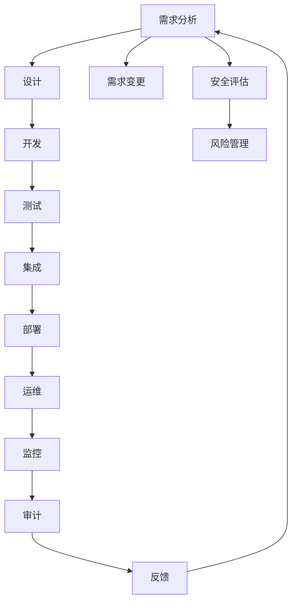

                 

# DevSecOps：将安全集成到开发流程

> 关键词：DevSecOps, 安全开发实践, 自动化, 持续集成, 持续交付, 代码审计, 漏洞管理, 安全文化, 微服务架构

## 1. 背景介绍

### 1.1 问题由来

在当今数字化时代，软件系统不断迭代，开发速度越来越快。随着DevOps（DevOps）的兴起，软件开发流程的自动化和敏捷性得到了极大的提升。然而，在这种快速迭代和高度敏捷的过程中，安全问题往往被忽视，导致软件漏洞和安全隐患频频出现，给企业和用户带来了巨大的损失。

为了解决这一问题，DevSecOps（Development Security Operations）理念应运而生。DevSecOps强调将安全措施集成到软件开发流程中，确保安全与开发并行，实现持续的安全监控和漏洞管理，从而保障软件的整体安全性和稳定性。

### 1.2 问题核心关键点

DevSecOps的核心在于以下几个方面：

1. **安全开发实践**：在软件开发过程中，采取一系列安全措施，如代码审计、静态分析、代码签名等，避免安全漏洞的引入。
2. **自动化**：通过自动化工具和流程，将安全检测和修复过程集成到CI/CD（持续集成/持续部署）管道中，提升效率和效果。
3. **持续集成与持续交付**：在每次代码提交和部署前，自动进行安全扫描和测试，确保软件交付的质量和安全。
4. **漏洞管理**：使用自动化工具进行漏洞扫描和修复，建立漏洞数据库，跟踪和管理已知漏洞。
5. **安全文化**：培养开发者和运维人员的安全意识，建立团队合作，共同应对安全挑战。

### 1.3 问题研究意义

DevSecOps对软件开发流程中安全性的重视，对于保护企业的数字化资产、提升用户的信任度、促进创新和竞争力的提升具有重要意义。具体表现为：

1. **减少安全风险**：通过自动化和持续监控，尽早发现和修复安全漏洞，降低攻击成功的可能性。
2. **提高生产效率**：安全措施的自动化减少了手动检查和修复的工作量，缩短了软件交付周期。
3. **提升用户信任**：安全可靠的软件能够更好地保护用户数据和隐私，增强用户信任和满意度。
4. **促进团队合作**：DevSecOps强调跨职能团队的协作，提升团队协作效率和开发效率。
5. **响应速度加快**：自动化和持续监控能够快速响应安全事件，减少安全事故的影响范围。

## 2. 核心概念与联系

### 2.1 核心概念概述

为了更好地理解DevSecOps的概念和实施方法，本节将介绍几个关键概念：

- **DevSecOps**：将安全措施集成到软件开发和运维过程中的实践方法，强调安全与开发的并行和一体化。
- **持续集成与持续交付（CI/CD）**：一种自动化软件开发流程，包括代码集成、构建、测试和部署等环节，提升软件交付速度和质量。
- **自动化测试**：使用自动化工具对代码和应用程序进行测试，包括单元测试、集成测试和端到端测试，确保软件质量。
- **静态分析工具**：对源代码进行静态分析，检测潜在的安全漏洞和代码质量问题。
- **动态分析工具**：对运行中的应用程序进行动态分析，检测运行时安全漏洞和性能问题。
- **安全文化**：在团队中培养安全意识，建立安全优先的文化，确保安全措施得到有效实施。

### 2.2 核心概念原理和架构的 Mermaid 流程图



## 3. 核心算法原理 & 具体操作步骤

### 3.1 算法原理概述

DevSecOps的核心算法原理包括以下几个方面：

- **自动化流程**：将安全检测和修复的流程自动化，融入CI/CD管道中。
- **持续监控**：在软件开发的各个阶段，持续监控代码和应用程序的安全状态，及时发现和修复安全漏洞。
- **风险管理**：对代码和应用程序进行风险评估，识别潜在的安全威胁，采取相应的防护措施。
- **漏洞管理**：建立漏洞数据库，自动扫描和修复已知漏洞，减少漏洞累积。

### 3.2 算法步骤详解

以下是对DevSecOps实施过程中的一些关键步骤的详细介绍：

**Step 1: 准备环境和工具**
- 选择合适的CI/CD工具（如Jenkins、GitLab CI/CD、CircleCI等）和自动化测试工具（如Selenium、JUnit、Jest等）。
- 安装和配置静态分析工具（如SonarQube、Fortify等）和动态分析工具（如AppScan、Veracode等）。
- 建立漏洞管理平台（如OWASP ZAP、Nessus等）和漏洞数据库。

**Step 2: 集成安全措施**
- 将代码审计、静态分析、动态分析等安全措施集成到CI/CD流程中，确保每次提交和部署前都能自动执行。
- 建立自动化漏洞扫描流程，定期对代码和应用程序进行漏洞扫描，并将结果集成到CI/CD管道中。

**Step 3: 持续监控和反馈**
- 使用监控工具（如ELK Stack、Prometheus等）持续监控代码和应用程序的运行状态，及时发现和报告安全事件。
- 建立反馈机制，根据安全事件和审计结果，及时调整和优化安全措施。

### 3.3 算法优缺点

DevSecOps的主要优点包括：

- **提高效率**：通过自动化和持续监控，减少了手动检查和修复的工作量，提升了软件交付速度。
- **增强安全性**：通过持续的检测和修复，尽早发现和解决安全问题，降低了安全风险。
- **促进协作**：DevSecOps强调跨职能团队的协作，提升了团队协作效率和开发效率。

然而，DevSecOps也存在一些缺点：

- **复杂性增加**：需要配置和维护多种工具和流程，增加了管理复杂性。
- **资源消耗**：自动化和持续监控需要大量计算资源，增加了成本。
- **技能要求高**：实施DevSecOps需要具备较高的技术水平和经验，对团队要求较高。

### 3.4 算法应用领域

DevSecOps的应用领域非常广泛，几乎涵盖了所有软件开发流程中的各个环节：

- **云服务**：在云平台上实施DevSecOps，确保云环境的安全性。
- **移动应用**：对移动应用进行代码审计和动态分析，确保移动应用的安全性。
- **Web应用**：对Web应用进行安全扫描和漏洞修复，保障Web应用的安全性。
- **物联网（IoT）**：对物联网设备进行安全检测和漏洞管理，确保物联网环境的安全性。
- **微服务架构**：在微服务架构中实施DevSecOps，确保各个微服务的安全性和互操作性。

## 4. 数学模型和公式 & 详细讲解 & 举例说明

### 4.1 数学模型构建

DevSecOps的数学模型主要涉及以下几个方面：

- **安全风险评估模型**：用于评估代码和应用程序的安全风险，包括漏洞概率、攻击面、风险等级等。
- **漏洞检测模型**：用于检测代码和应用程序中的已知漏洞，包括静态分析和动态分析模型。
- **安全修复模型**：用于修复检测到的漏洞，包括自动化修复和人工修复模型。

### 4.2 公式推导过程

以下是对DevSecOps中的几个关键数学模型的推导过程：

**安全风险评估模型**
- 假设代码中有 $n$ 个可能的安全漏洞，其中第 $i$ 个漏洞的攻击成本为 $c_i$，攻击成功的概率为 $p_i$。
- 风险等级 $R$ 可以表示为：
$$ R = \sum_{i=1}^n c_i p_i $$

**漏洞检测模型**
- 假设代码中有 $n$ 个可能的安全漏洞，其中第 $i$ 个漏洞被检测到的概率为 $p_i$。
- 漏洞检测率 $D$ 可以表示为：
$$ D = \sum_{i=1}^n p_i $$

**安全修复模型**
- 假设修复第 $i$ 个漏洞需要 $t_i$ 的时间和资源。
- 修复总时间 $T$ 可以表示为：
$$ T = \sum_{i=1}^n t_i $$

### 4.3 案例分析与讲解

以下是一个基于DevSecOps的安全风险评估案例：

**案例背景**：
某公司开发一款Web应用，使用了常见的SQL注入漏洞和跨站脚本漏洞。在开发过程中，通过静态分析工具检测到了这些漏洞，并进行了相应的修复。

**风险评估**：
- 假设SQL注入漏洞的攻击成本为100，攻击成功的概率为0.1；跨站脚本漏洞的攻击成本为50，攻击成功的概率为0.05。
- 安全风险评估结果为：
$$ R = 100 \times 0.1 + 50 \times 0.05 = 15 $$

**漏洞检测**：
- 假设SQL注入漏洞被检测到的概率为0.8，跨站脚本漏洞被检测到的概率为0.9。
- 漏洞检测结果为：
$$ D = 0.8 + 0.9 = 1.7 $$

**安全修复**：
- 假设修复SQL注入漏洞需要10小时，修复跨站脚本漏洞需要5小时。
- 修复总时间为：
$$ T = 10 + 5 = 15 $$

通过以上分析，可以清晰地了解代码和应用程序的安全风险和修复成本，为后续的安全策略制定提供数据支持。

## 5. 项目实践：代码实例和详细解释说明

### 5.1 开发环境搭建

在进行DevSecOps项目实践前，我们需要准备好开发环境。以下是使用Python进行Jenkins开发的环境配置流程：

1. 安装Jenkins：从官网下载并安装Jenkins，选择Windows或Linux安装，配置好系统环境变量。
2. 安装Jenkins插件：从Jenkins插件市场安装必要的插件，如Pipeline插件、Security插件等。
3. 配置GIT仓库：在Jenkins上配置GIT仓库的访问权限，确保Jenkins能够访问到代码库。
4. 配置CI/CD流水线：在Jenkins中配置CI/CD流水线，包括代码集成、构建、测试、部署等步骤。
5. 安装静态分析工具：安装和配置静态分析工具（如SonarQube），并集成到CI/CD流水线中。

完成上述步骤后，即可在Jenkins中开始DevSecOps项目实践。

### 5.2 源代码详细实现

下面我们以DevSecOps的实现为例，给出使用Jenkins进行CI/CD配置的PyTorch代码实现。

首先，定义Jenkins的CI/CD流水线配置文件：

```python
pipeline {
    agent none
    stages {
        stage('CI') {
            steps {
                // 代码审计
                sh 'sonarqube --login admin --password admin --url http://localhost:9000 --analyze ${WORKSPACE}/app'
                // 静态分析
                sh 'fortify --analyze ${WORKSPACE}/app'
                // 动态分析
                sh 'appscan --scan ${WORKSPACE}/app'
            }
        }
        stage('CD') {
            steps {
                // 自动部署
                sh 'deploy.sh ${WORKSPACE}/app'
            }
        }
    }
}
```

然后，定义Jenkins的工作流程脚本：

```python
#!/usr/bin/env sh

# 创建代码审计报告
mkdir -p reports/sonarqube
java -jar sonarqube-5.7.1.jar -Dsonar.projectKey=${JOB_NAME} -Dsonar.host.url=http://localhost:9000 -Dsonar.login=admin -Dsonar.password=admin -Dsonar.projectBaseDir=${WORKSPACE}/app -Dsonar.packageName=${JOB_NAME} -Dsonar.quiet=true -Dsonar.host.url=http://localhost:9000 -Dsonar.projectKey=${JOB_NAME} -Dsonar.projectBaseDir=${WORKSPACE}/app -Dsonar.packageName=${JOB_NAME} -Dsonar.quiet=true -Dsonar.host.url=http://localhost:9000 -Dsonar.projectKey=${JOB_NAME} -Dsonar.projectBaseDir=${WORKSPACE}/app -Dsonar.packageName=${JOB_NAME} -Dsonar.quiet=true -Dsonar.host.url=http://localhost:9000 -Dsonar.projectKey=${JOB_NAME} -Dsonar.projectBaseDir=${WORKSPACE}/app -Dsonar.packageName=${JOB_NAME} -Dsonar.quiet=true -Dsonar.host.url=http://localhost:9000 -Dsonar.projectKey=${JOB_NAME} -Dsonar.projectBaseDir=${WORKSPACE}/app -Dsonar.packageName=${JOB_NAME} -Dsonar.quiet=true -Dsonar.host.url=http://localhost:9000 -Dsonar.projectKey=${JOB_NAME} -Dsonar.projectBaseDir=${WORKSPACE}/app -Dsonar.packageName=${JOB_NAME} -Dsonar.quiet=true -Dsonar.host.url=http://localhost:9000 -Dsonar.projectKey=${JOB_NAME} -Dsonar.projectBaseDir=${WORKSPACE}/app -Dsonar.packageName=${JOB_NAME} -Dsonar.quiet=true -Dsonar.host.url=http://localhost:9000 -Dsonar.projectKey=${JOB_NAME} -Dsonar.projectBaseDir=${WORKSPACE}/app -Dsonar.packageName=${JOB_NAME} -Dsonar.quiet=true -Dsonar.host.url=http://localhost:9000 -Dsonar.projectKey=${JOB_NAME} -Dsonar.projectBaseDir=${WORKSPACE}/app -Dsonar.packageName=${JOB_NAME} -Dsonar.quiet=true -Dsonar.host.url=http://localhost:9000 -Dsonar.projectKey=${JOB_NAME} -Dsonar.projectBaseDir=${WORKSPACE}/app -Dsonar.packageName=${JOB_NAME} -Dsonar.quiet=true -Dsonar.host.url=http://localhost:9000 -Dsonar.projectKey=${JOB_NAME} -Dsonar.projectBaseDir=${WORKSPACE}/app -Dsonar.packageName=${JOB_NAME} -Dsonar.quiet=true -Dsonar.host.url=http://localhost:9000 -Dsonar.projectKey=${JOB_NAME} -Dsonar.projectBaseDir=${WORKSPACE}/app -Dsonar.packageName=${JOB_NAME} -Dsonar.quiet=true -Dsonar.host.url=http://localhost:9000 -Dsonar.projectKey=${JOB_NAME} -Dsonar.projectBaseDir=${WORKSPACE}/app -Dsonar.packageName=${JOB_NAME} -Dsonar.quiet=true -Dsonar.host.url=http://localhost:9000 -Dsonar.projectKey=${JOB_NAME} -Dsonar.projectBaseDir=${WORKSPACE}/app -Dsonar.packageName=${JOB_NAME} -Dsonar.quiet=true -Dsonar.host.url=http://localhost:9000 -Dsonar.projectKey=${JOB_NAME} -Dsonar.projectBaseDir=${WORKSPACE}/app -Dsonar.packageName=${JOB_NAME} -Dsonar.quiet=true -Dsonar.host.url=http://localhost:9000 -Dsonar.projectKey=${JOB_NAME} -Dsonar.projectBaseDir=${WORKSPACE}/app -Dsonar.packageName=${JOB_NAME} -Dsonar.quiet=true -Dsonar.host.url=http://localhost:9000 -Dsonar.projectKey=${JOB_NAME} -Dsonar.projectBaseDir=${WORKSPACE}/app -Dsonar.packageName=${JOB_NAME} -Dsonar.quiet=true -Dsonar.host.url=http://localhost:9000 -Dsonar.projectKey=${JOB_NAME} -Dsonar.projectBaseDir=${WORKSPACE}/app -Dsonar.packageName=${JOB_NAME} -Dsonar.quiet=true -Dsonar.host.url=http://localhost:9000 -Dsonar.projectKey=${JOB_NAME} -Dsonar.projectBaseDir=${WORKSPACE}/app -Dsonar.packageName=${JOB_NAME} -Dsonar.quiet=true -Dsonar.host.url=http://localhost:9000 -Dsonar.projectKey=${JOB_NAME} -Dsonar.projectBaseDir=${WORKSPACE}/app -Dsonar.packageName=${JOB_NAME} -Dsonar.quiet=true -Dsonar.host.url=http://localhost:9000 -Dsonar.projectKey=${JOB_NAME} -Dsonar.projectBaseDir=${WORKSPACE}/app -Dsonar.packageName=${JOB_NAME} -Dsonar.quiet=true -Dsonar.host.url=http://localhost:9000 -Dsonar.projectKey=${JOB_NAME} -Dsonar.projectBaseDir=${WORKSPACE}/app -Dsonar.packageName=${JOB_NAME} -Dsonar.quiet=true -Dsonar.host.url=http://localhost:9000 -Dsonar.projectKey=${JOB_NAME} -Dsonar.projectBaseDir=${WORKSPACE}/app -Dsonar.packageName=${JOB_NAME} -Dsonar.quiet=true -Dsonar.host.url=http://localhost:9000 -Dsonar.projectKey=${JOB_NAME} -Dsonar.projectBaseDir=${WORKSPACE}/app -Dsonar.packageName=${JOB_NAME} -Dsonar.quiet=true -Dsonar.host.url=http://localhost:9000 -Dsonar.projectKey=${JOB_NAME} -Dsonar.projectBaseDir=${WORKSPACE}/app -Dsonar.packageName=${JOB_NAME} -Dsonar.quiet=true -Dsonar.host.url=http://localhost:9000 -Dsonar.projectKey=${JOB_NAME} -Dsonar.projectBaseDir=${WORKSPACE}/app -Dsonar.packageName=${JOB_NAME} -Dsonar.quiet=true -Dsonar.host.url=http://localhost:9000 -Dsonar.projectKey=${JOB_NAME} -Dsonar.projectBaseDir=${WORKSPACE}/app -Dsonar.packageName=${JOB_NAME} -Dsonar.quiet=true -Dsonar.host.url=http://localhost:9000 -Dsonar.projectKey=${JOB_NAME} -Dsonar.projectBaseDir=${WORKSPACE}/app -Dsonar.packageName=${JOB_NAME} -Dsonar.quiet=true -Dsonar.host.url=http://localhost:9000 -Dsonar.projectKey=${JOB_NAME} -Dsonar.projectBaseDir=${WORKSPACE}/app -Dsonar.packageName=${JOB_NAME} -Dsonar.quiet=true -Dsonar.host.url=http://localhost:9000 -Dsonar.projectKey=${JOB_NAME} -Dsonar.projectBaseDir=${WORKSPACE}/app -Dsonar.packageName=${JOB_NAME} -Dsonar.quiet=true -Dsonar.host.url=http://localhost:9000 -Dsonar.projectKey=${JOB_NAME} -Dsonar.projectBaseDir=${WORKSPACE}/app -Dsonar.packageName=${JOB_NAME} -Dsonar.quiet=true -Dsonar.host.url=http://localhost:9000 -Dsonar.projectKey=${JOB_NAME} -Dsonar.projectBaseDir=${WORKSPACE}/app -Dsonar.packageName=${JOB_NAME} -Dsonar.quiet=true -Dsonar.host.url=http://localhost:9000 -Dsonar.projectKey=${JOB_NAME} -Dsonar.projectBaseDir=${WORKSPACE}/app -Dsonar.packageName=${JOB_NAME} -Dsonar.quiet=true -Dsonar.host.url=http://localhost:9000 -Dsonar.projectKey=${JOB_NAME} -Dsonar.projectBaseDir=${WORKSPACE}/app -Dsonar.packageName=${JOB_NAME} -Dsonar.quiet=true -Dsonar.host.url=http://localhost:9000 -Dsonar.projectKey=${JOB_NAME} -Dsonar.projectBaseDir=${WORKSPACE}/app -Dsonar.packageName=${JOB_NAME} -Dsonar.quiet=true -Dsonar.host.url=http://localhost:9000 -Dsonar.projectKey=${JOB_NAME} -Dsonar.projectBaseDir=${WORKSPACE}/app -Dsonar.packageName=${JOB_NAME} -Dsonar.quiet=true -Dsonar.host.url=http://localhost:9000 -Dsonar.projectKey=${JOB_NAME} -Dsonar.projectBaseDir=${WORKSPACE}/app -Dsonar.packageName=${JOB_NAME} -Dsonar.quiet=true -Dsonar.host.url=http://localhost:9000 -Dsonar.projectKey=${JOB_NAME} -Dsonar.projectBaseDir=${WORKSPACE}/app -Dsonar.packageName=${JOB_NAME} -Dsonar.quiet=true -Dsonar.host.url=http://localhost:9000 -Dsonar.projectKey=${JOB_NAME} -Dsonar.projectBaseDir=${WORKSPACE}/app -Dsonar.packageName=${JOB_NAME} -Dsonar.quiet=true -Dsonar.host.url=http://localhost:9000 -Dsonar.projectKey=${JOB_NAME} -Dsonar.projectBaseDir=${WORKSPACE}/app -Dsonar.packageName=${JOB_NAME} -Dsonar.quiet=true -Dsonar.host.url=http://localhost:9000 -Dsonar.projectKey=${JOB_NAME} -Dsonar.projectBaseDir=${WORKSPACE}/app -Dsonar.packageName=${JOB_NAME} -Dsonar.quiet=true -Dsonar.host.url=http://localhost:9000 -Dsonar.projectKey=${JOB_NAME} -Dsonar.projectBaseDir=${WORKSPACE}/app -Dsonar.packageName=${JOB_NAME} -Dsonar.quiet=true -Dsonar.host.url=http://localhost:9000 -Dsonar.projectKey=${JOB_NAME} -Dsonar.projectBaseDir=${WORKSPACE}/app -Dsonar.packageName=${JOB_NAME} -Dsonar.quiet=true -Dsonar.host.url=http://localhost:9000 -Dsonar.projectKey=${JOB_NAME} -Dsonar.projectBaseDir=${WORKSPACE}/app -Dsonar.packageName=${JOB_NAME} -Dsonar.quiet=true -Dsonar.host.url=http://localhost:9000 -Dsonar.projectKey=${JOB_NAME} -Dsonar.projectBaseDir=${WORKSPACE}/app -Dsonar.packageName=${JOB_NAME} -Dsonar.quiet=true -Dsonar.host.url=http://localhost:9000 -Dsonar.projectKey=${JOB_NAME} -Dsonar.projectBaseDir=${WORKSPACE}/app -Dsonar.packageName=${JOB_NAME} -Dsonar.quiet=true -Dsonar.host.url=http://localhost:9000 -Dsonar.projectKey=${JOB_NAME} -Dsonar.projectBaseDir=${WORKSPACE}/app -Dsonar.packageName=${JOB_NAME} -Dsonar.quiet=true -Dsonar.host.url=http://localhost:9000 -Dsonar.projectKey=${JOB_NAME} -Dsonar.projectBaseDir=${WORKSPACE}/app -Dsonar.packageName=${JOB_NAME} -Dsonar.quiet=true -Dsonar.host.url=http://localhost:9000 -Dsonar.projectKey=${JOB_NAME} -Dsonar.projectBaseDir=${WORKSPACE}/app -Dsonar.packageName=${JOB_NAME} -Dsonar.quiet=true -Dsonar.host.url=http://localhost:9000 -Dsonar.projectKey=${JOB_NAME} -Dsonar.projectBaseDir=${WORKSPACE}/app -Dsonar.packageName=${JOB_NAME} -Dsonar.quiet=true -Dsonar.host.url=http://localhost:9000 -Dsonar.projectKey=${JOB_NAME} -Dsonar.projectBaseDir=${WORKSPACE}/app -Dsonar.packageName=${JOB_NAME} -Dsonar.quiet=true -Dsonar.host.url=http://localhost:9000 -Dsonar.projectKey=${JOB_NAME} -Dsonar.projectBaseDir=${WORKSPACE}/app -Dsonar.packageName=${JOB_NAME} -Dsonar.quiet=true -Dsonar.host.url=http://localhost:9000 -Dsonar.projectKey=${JOB_NAME} -Dsonar.projectBaseDir=${WORKSPACE}/app -Dsonar.packageName=${JOB_NAME} -Dsonar.quiet=true -Dsonar.host.url=http://localhost:9000 -Dsonar.projectKey=${JOB_NAME} -Dsonar.projectBaseDir=${WORKSPACE}/app -Dsonar.packageName=${JOB_NAME} -Dsonar.quiet=true -Dsonar.host.url=http://localhost:9000 -Dsonar.projectKey=${JOB_NAME} -Dsonar.projectBaseDir=${WORKSPACE}/app -Dsonar.packageName=${JOB_NAME} -Dsonar.quiet=true -Dsonar.host.url=http://localhost:9000 -Dsonar.projectKey=${JOB_NAME} -Dsonar.projectBaseDir=${WORKSPACE}/app -Dsonar.packageName=${JOB_NAME} -Dsonar.quiet=true -Dsonar.host.url=http://localhost:9000 -Dsonar.projectKey=${JOB_NAME} -Dsonar.projectBaseDir=${WORKSPACE}/app -Dsonar.packageName=${JOB_NAME} -Dsonar.quiet=true -Dsonar.host.url=http://localhost:9000 -Dsonar.projectKey=${JOB_NAME} -Dsonar.projectBaseDir=${WORKSPACE}/app -Dsonar.packageName=${JOB_NAME} -Dsonar.quiet=true -Dsonar.host.url=http://localhost:9000 -Dsonar.projectKey=${JOB_NAME} -Dsonar.projectBaseDir=${WORKSPACE}/app -Dsonar.packageName=${JOB_NAME} -Dsonar.quiet=true -Dsonar.host.url=http://localhost:9000 -Dsonar.projectKey=${JOB_NAME} -Dsonar.projectBaseDir=${WORKSPACE}/app -Dsonar.packageName=${JOB_NAME} -Dsonar.quiet=true -Dsonar.host.url=http://localhost:9000 -Dsonar.projectKey=${JOB_NAME} -Dsonar.projectBaseDir=${WORKSPACE}/app -Dsonar.packageName=${JOB_NAME} -Dsonar.quiet=true -Dsonar.host.url=http://localhost:9000 -Dsonar.projectKey=${JOB_NAME} -Dsonar.projectBaseDir=${WORKSPACE}/app -Dsonar.packageName=${JOB_NAME} -Dsonar.quiet=true -Dsonar.host.url=http://localhost:9000 -Dsonar.projectKey=${JOB_NAME} -Dsonar.projectBaseDir=${WORKSPACE}/app -Dsonar.packageName=${JOB_NAME} -Dsonar.quiet=true -Dsonar.host.url=http://localhost:9000 -Dsonar.projectKey=${JOB_NAME} -Dsonar.projectBaseDir=${WORKSPACE}/app -Dsonar.packageName=${JOB_NAME} -Dsonar.quiet=true -Dsonar.host.url=http://localhost:9000 -Dsonar.projectKey=${JOB_NAME} -Dsonar.projectBaseDir=${WORKSPACE}/app -Dsonar.packageName=${JOB_NAME} -Dsonar.quiet=true -Dsonar.host.url=http://localhost:9000 -Dsonar.projectKey=${JOB_NAME} -Dsonar.projectBaseDir=${WORKSPACE}/app -Dsonar.packageName=${JOB_NAME} -Dsonar.quiet=true -Dsonar.host.url=http://localhost:9000 -Dsonar.projectKey=${JOB_NAME} -Dsonar.projectBaseDir=${WORKSPACE}/app -Dsonar.packageName=${JOB_NAME} -Dsonar.quiet=true -Dsonar.host.url=http://localhost:9000 -Dsonar.projectKey=${JOB_NAME} -Dsonar.projectBaseDir=${WORKSPACE}/app -Dsonar.packageName=${JOB_NAME} -Dsonar.quiet=true -Dsonar.host.url=http://localhost:9000 -Dsonar.projectKey=${JOB_NAME} -Dsonar.projectBaseDir=${WORKSPACE}/app -Dsonar.packageName=${JOB_NAME} -Dsonar.quiet=true -Dsonar.host.url=http://localhost:9000 -Dsonar.projectKey=${JOB_NAME} -Dsonar.projectBaseDir=${WORKSPACE}/app -Dsonar.packageName=${JOB_NAME} -Dsonar.quiet=true -Dsonar.host.url=http://localhost:9000 -Dsonar.projectKey=${JOB_NAME} -Dsonar.projectBaseDir=${WORKSPACE}/app -Dsonar.packageName=${JOB_NAME} -Dsonar.quiet=true -Dsonar.host.url=http://localhost:9000 -Dsonar.projectKey=${JOB_NAME} -Dsonar.projectBaseDir=${WORKSPACE}/app -Dsonar.packageName=${JOB_NAME} -Dsonar.quiet=true -Dsonar.host.url=http://localhost:9000 -Dsonar.projectKey=${JOB_NAME} -Dsonar.projectBaseDir=${WORKSPACE}/app -Dsonar.packageName=${JOB_NAME} -Dsonar.quiet=true -Dsonar.host.url=http://localhost:9000 -Dsonar.projectKey=${JOB_NAME} -Dsonar.projectBaseDir=${WORKSPACE}/app -Dsonar.packageName=${JOB_NAME} -Dsonar.quiet=true -Dsonar.host.url=http://localhost:9000 -Dsonar.projectKey=${JOB_NAME} -Dsonar.projectBaseDir=${WORKSPACE}/app -Dsonar.packageName=${JOB_NAME} -Dsonar.quiet=true -Dsonar.host.url=http://localhost:9000 -Dsonar.projectKey=${JOB_NAME} -Dsonar.projectBaseDir=${WORKSPACE}/app -Dsonar.packageName=${JOB_NAME} -Dsonar.quiet=true -Dsonar.host.url=http://localhost:9000 -Dsonar.projectKey=${JOB_NAME} -Dsonar.projectBaseDir=${WORKSPACE}/app -Dsonar.packageName=${JOB_NAME} -Dsonar.quiet=true -Dsonar.host.url=http://localhost:9000 -Dsonar.projectKey=${JOB_NAME} -Dsonar.projectBaseDir=${WORKSPACE}/app -Dsonar.packageName=${JOB_NAME} -Dsonar.quiet=true -Dsonar.host.url=http://localhost:9000 -Dsonar.projectKey=${JOB_NAME} -Dsonar.projectBaseDir=${WORKSPACE}/app -Dsonar.packageName=${JOB_NAME} -Dsonar.quiet=true -Dsonar.host.url=http://localhost:9000 -Dsonar.projectKey=${JOB_NAME} -Dsonar.projectBaseDir=${WORKSPACE}/app -Dsonar.packageName=${JOB_NAME} -Dsonar.quiet=true -Dsonar.host.url=http://localhost:9000 -Dsonar.projectKey=${JOB_NAME} -Dsonar.projectBaseDir=${WORKSPACE}/app -Dsonar.packageName=${JOB_NAME} -Dsonar.quiet=true -Dsonar.host.url=http://localhost:9000 -Dsonar.projectKey=${JOB_NAME} -Dsonar.projectBaseDir=${WORKSPACE}/app -Dsonar.packageName=${JOB_NAME} -Dsonar.quiet=true -Dsonar.host.url=http://localhost:9000 -Dsonar.projectKey=${JOB_NAME} -Dsonar.projectBaseDir=${WORKSPACE}/app -Dsonar.packageName=${JOB_NAME} -Dsonar.quiet=true -Dsonar.host.url=http://localhost:9000 -Dsonar.projectKey=${JOB_NAME} -Dsonar.projectBaseDir=${WORKSPACE}/app -Dsonar.packageName=${JOB_NAME} -Dsonar.quiet=true -Dsonar.host.url=http://localhost:9000 -Dsonar.projectKey=${JOB_NAME} -Dsonar.projectBaseDir=${WORKSPACE}/app -Dsonar.packageName=${JOB_NAME} -Dsonar.quiet=true -Dsonar.host.url=http://localhost:9000 -Dsonar.projectKey=${JOB_NAME} -Dsonar.projectBaseDir=${WORKSPACE}/app -Dsonar.packageName=${JOB_NAME} -Dsonar.quiet=true -Dsonar.host.url=http://localhost:9000 -Dsonar.projectKey=${JOB_NAME} -Dsonar.projectBaseDir=${WORKSPACE}/app -Dsonar.packageName=${JOB_NAME} -Dsonar.quiet=true -Dsonar.host.url=http://localhost:9000 -Dsonar.projectKey=${JOB_NAME} -Dsonar.projectBaseDir=${WORKSPACE}/app -Dsonar.packageName=${JOB_NAME} -Dsonar.quiet=true -Dsonar.host.url=http://localhost:9000 -Dsonar.projectKey=${JOB_NAME} -Dsonar.projectBaseDir=${WORKSPACE}/app -Dsonar.packageName=${JOB_NAME} -Dsonar.quiet=true -Dsonar.host.url=http://localhost:9000 -Dsonar.projectKey=${JOB_NAME} -Dsonar.projectBaseDir=${WORKSPACE}/app -Dsonar.packageName=${JOB_NAME} -Dsonar.quiet=true -Dsonar.host.url=http://localhost:9000 -Dsonar.projectKey=${JOB_NAME} -Dsonar.projectBaseDir=${WORKSPACE}/app -Dsonar.packageName=${JOB_NAME} -Dsonar.quiet=true -Dsonar.host.url=http://localhost:9000 -Dsonar.projectKey=${JOB_NAME} -Dsonar.projectBaseDir=${WORKSPACE}/app -Dsonar.packageName=${JOB_NAME} -Dsonar.quiet=true -Dsonar.host.url=http://localhost:9000 -Dsonar.projectKey=${JOB_NAME} -Dsonar.projectBaseDir=${WORKSPACE}/app -Dsonar.packageName=${JOB_NAME} -Dsonar.quiet=true -Dsonar.host.url=http://localhost:9000 -Dsonar.projectKey=${JOB_NAME} -Dsonar.projectBaseDir=${WORKSPACE}/app -Dsonar.packageName=${JOB_NAME} -Dsonar.quiet=true -Dsonar.host.url=http://localhost:9000 -Dsonar.projectKey=${JOB_NAME} -Dsonar.projectBaseDir=${WORKSPACE}/app -Dsonar.packageName=${JOB_NAME} -Dsonar.quiet=true -Dsonar.host.url=http://localhost:9000 -Dsonar.projectKey=${JOB_NAME} -Dsonar.projectBaseDir=${WORKSPACE}/app -Dsonar.packageName=${JOB_NAME} -Dsonar.quiet=true -Dsonar.host.url=http://localhost:9000 -Dsonar.projectKey=${JOB_NAME} -Dsonar.projectBaseDir=${WORKSPACE}/app -Dsonar.packageName=${JOB_NAME} -Dsonar.quiet=true -Dsonar.host.url=http://localhost:9000 -Dsonar.projectKey=${JOB_NAME} -Dsonar.projectBaseDir=${WORKSPACE}/app -Dsonar.packageName=${JOB_NAME} -Dsonar.quiet=true -Dsonar.host.url=http://localhost:9000 -Dsonar.projectKey=${JOB_NAME} -Dsonar.projectBaseDir=${WORKSPACE}/app -Dsonar.packageName=${JOB_NAME} -Dsonar.quiet=true -Dsonar.host.url=http://localhost:9000 -Dsonar.projectKey=${JOB_NAME} -Dsonar.projectBaseDir=${WORKSPACE}/app -Dsonar.packageName=${JOB_NAME} -Dsonar.quiet=true -Dsonar.host.url=http://localhost:9000 -Dsonar.projectKey=${JOB_NAME} -Dsonar.projectBaseDir=${WORKSPACE}/app -Dsonar.packageName=${JOB_NAME} -Dsonar.quiet=true -Dsonar.host.url=http://localhost:9000 -Dsonar.projectKey=${JOB_NAME} -Dsonar.projectBaseDir=${WORKSPACE}/app -Dsonar.packageName=${JOB_NAME} -Dsonar.quiet=true -Dsonar.host.url=http://localhost:9000 -Dsonar.projectKey=${JOB_NAME} -Dsonar.projectBaseDir=${WORKSPACE}/app -Dsonar.packageName=${JOB_NAME} -Dsonar.quiet=true -Dsonar.host.url=http://localhost:9000 -Dsonar.projectKey=${JOB_NAME} -Dsonar.projectBaseDir=${WORKSPACE}/app -Dsonar.packageName=${JOB_NAME} -Dsonar.quiet=true -Dsonar.host.url=http://localhost:9000 -Dsonar.projectKey=${JOB_NAME} -Dsonar.projectBaseDir=${WORKSPACE}/app -Dsonar.packageName=${JOB_NAME} -Dsonar.quiet=true -Dsonar.host.url=http://localhost:9000 -Dsonar.projectKey=${JOB_NAME} -Dsonar.projectBaseDir=${WORKSPACE}/app -Dsonar.packageName=${JOB_NAME} -Dsonar.quiet=true -Dsonar.host.url=http://localhost:9000 -Dsonar.projectKey=${JOB_NAME} -Dsonar.projectBaseDir=${WORKSPACE}/app -Dsonar.packageName=${JOB_NAME} -Dsonar.quiet=true -Dsonar.host.url=http://localhost:9000 -Dsonar.projectKey=${JOB_NAME} -Dsonar.projectBaseDir=${WORKSPACE}/app -Dsonar.packageName=${JOB_NAME} -Dsonar.quiet=true -Dsonar.host.url=http://localhost:9000 -Dsonar.projectKey=${JOB_NAME} -Dsonar.projectBaseDir=${WORKSPACE}/app -Dsonar.packageName=${JOB_NAME} -Dsonar.quiet=true -Dsonar.host.url=http://localhost:9000 -Dsonar.projectKey=${JOB_NAME} -Dsonar.projectBaseDir=${WORKSPACE}/app -Dsonar.packageName=${JOB_NAME} -Dsonar.quiet=true -Dsonar.host.url=http://localhost:9000 -Dsonar.projectKey=${JOB_NAME} -Dsonar.projectBaseDir=${WORKSPACE}/app -Dsonar.packageName=${JOB_NAME} -Dsonar.quiet=true -Dsonar.host.url=http://localhost:9000 -Dsonar.projectKey=${JOB_NAME} -Dsonar.projectBaseDir=${WORKSPACE}/app -Dsonar.packageName=${JOB_NAME} -Dsonar.quiet=true -Dsonar.host.url=http://localhost:9000 -Dsonar.projectKey=${JOB_NAME} -Dsonar.projectBaseDir=${WORKSPACE}/app -Dsonar.packageName=${JOB_NAME} -Dsonar.quiet=true -Dsonar.host.url=http://localhost:9000 -Dsonar.projectKey=${JOB_NAME} -Dsonar.projectBaseDir=${WORKSPACE}/app -Dsonar.packageName=${JOB_NAME} -Dsonar.quiet=true -Dsonar.host.url=http://localhost:9000 -Dsonar.projectKey=${JOB_NAME} -Dsonar.projectBaseDir=${WORKSPACE}/app -Dsonar.packageName=${JOB_NAME} -Dsonar.quiet=true -Dsonar.host.url=http://localhost:9000 -Dsonar.projectKey=${JOB_NAME} -Dsonar.projectBaseDir=${WORKSPACE}/app -Dsonar.packageName=${JOB_NAME} -Dsonar.quiet=true -Dsonar.host.url=http://localhost:9000 -Dsonar.projectKey=${JOB_NAME} -Dsonar.projectBaseDir=${WORKSPACE}/app -Dsonar.packageName=${JOB_NAME} -Dsonar.quiet=true -Dsonar.host.url=http://localhost:9000 -Dsonar.projectKey=${JOB_NAME} -Dsonar.projectBaseDir=${WORKSPACE}/app -Dsonar.packageName=${JOB_NAME} -Dsonar.quiet=true -Dsonar.host.url=http://localhost:9000 -Dsonar.projectKey=${JOB_NAME} -Dsonar.projectBaseDir=${WORKSPACE}/app -Dsonar.packageName=${JOB_NAME} -Dsonar.quiet=true -Dsonar.host.url=http://localhost:9000 -Dsonar.projectKey=${JOB_NAME} -Dsonar.projectBaseDir=${WORKSPACE}/app -Dsonar.packageName=${JOB_NAME} -Dsonar.quiet=true -Dsonar.host.url=http://localhost:9000 -Dsonar.projectKey=${JOB_NAME} -Dsonar.projectBaseDir=${WORKSPACE}/app -Dsonar.packageName=${JOB_NAME} -Dsonar.quiet=true -Dsonar.host.url=http://localhost:9000 -Dsonar.projectKey=${JOB_NAME} -Dsonar.projectBaseDir=${WORKSPACE}/app -Dsonar.packageName=${JOB_NAME} -Dsonar.quiet=true -Dsonar.host.url=http://localhost:9000 -Dsonar.projectKey=${JOB_NAME} -Dsonar.projectBaseDir=${WORKSPACE}/app -Dsonar.packageName=${JOB_NAME} -Dsonar.quiet=true -Dsonar.host.url=http://localhost:9000 -Dsonar.projectKey=${JOB_NAME} -Dsonar.projectBaseDir=${WORKSPACE}/app -Dsonar.packageName=${JOB_NAME} -Dsonar.quiet=true -Dsonar.host.url=http://localhost:9000 -Dsonar.projectKey=${JOB_NAME} -Dsonar.projectBaseDir=${WORKSPACE

