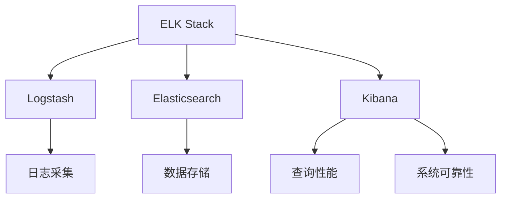

                 

# ELK日志采集与分析优化

> 关键词：ELK日志采集, 日志分析, 索引优化, 性能调优, 实时监控

## 1. 背景介绍

### 1.1 问题由来

在当今数字化时代，企业的日常运行产生了大量数据，尤其是日志数据。日志是记录系统运行状态的文档，包含异常事件、系统调用、错误信息等，对于诊断问题、监控系统状态、优化性能具有重要意义。而ELK Stack（Elasticsearch, Logstash, Kibana）作为一个功能强大的日志分析平台，被广泛应用于日志管理和分析。

ELK Stack通过Logstash收集日志，存储在Elasticsearch中，并由Kibana提供可视化界面。尽管ELK Stack功能强大，但其性能瓶颈和部署复杂性问题仍困扰着许多企业。因此，如何优化ELK Stack的日志采集与分析性能，成为了业界关注的焦点。

### 1.2 问题核心关键点

优化ELK Stack的核心在于提升日志采集效率、降低存储成本、提高查询性能、保障系统可靠性。具体来说：

- 日志采集：如何快速、稳定地收集来自不同系统的日志数据？
- 数据存储：如何高效地存储大量日志数据，以便快速查询和分析？
- 查询性能：如何快速检索所需日志信息，满足实时监控需求？
- 系统可靠性：如何保证ELK Stack的稳定运行，避免单点故障？

通过系统地优化这些关键点，能够显著提升ELK Stack的性能和可用性，满足企业生产环境的实际需求。

## 2. 核心概念与联系

### 2.1 核心概念概述

为了更好地理解优化ELK Stack的方法，本节将介绍几个密切相关的核心概念：

- ELK Stack：由Elasticsearch, Logstash, Kibana组成的高性能日志分析平台。
- Logstash：用于收集、处理、转换日志的数据管道工具。
- Elasticsearch：分布式、高性能的搜索和分析引擎。
- Kibana：用于展示、分析和监控日志数据的可视化工具。
- 日志采集：将不同系统产生的日志数据收集到集中式存储系统中。
- 数据存储：高效地存储和维护日志数据，以便快速查询和分析。
- 查询性能：确保查询操作能够快速响应，满足实时监控需求。
- 系统可靠性：保证ELK Stack的稳定运行，避免单点故障。

这些概念之间的逻辑关系可以通过以下Mermaid流程图来展示：



这个流程图展示了一系列关键概念及其之间的联系：

1. ELK Stack由多个组件组成，分别负责日志收集、数据存储和可视化。
2. Logstash负责日志采集，Elasticsearch负责数据存储，Kibana提供查询和可视化接口。
3. 日志采集需要处理不同系统的日志，通过统一格式存储在Elasticsearch中。
4. 数据存储通过索引优化等手段，提高查询性能。
5. 查询性能需满足实时监控需求，通过优化查询操作和索引设计实现。
6. 系统可靠性需通过负载均衡、故障转移等技术保障，避免单点故障。

## 3. 核心算法原理 & 具体操作步骤
### 3.1 算法原理概述

优化ELK Stack的日志采集与分析性能，涉及多个层面的算法和技术，包括数据流优化、索引优化、查询优化、故障转移等。

- **数据流优化**：通过优化Logstash的数据管道，提高日志采集效率，减少延迟。
- **索引优化**：通过合理设计索引结构，提高Elasticsearch的查询性能和存储效率。
- **查询优化**：通过优化查询语句和配置，提高查询响应速度。
- **故障转移**：通过负载均衡和故障转移技术，提高ELK Stack的系统可靠性。

### 3.2 算法步骤详解

#### 3.2.1 数据流优化

1. **选择合适的输入插件**：根据不同日志格式和来源，选择相应的Logstash输入插件，如file、syslog、beats等。
2. **配置合适的缓冲区**：根据日志生成频率和系统性能，调整Logstash的缓冲区大小，避免缓存溢出。
3. **使用并行管道**：通过配置多个并行管道，提高日志收集速度。
4. **添加过滤器**：在数据流中引入过滤器，对日志数据进行初步清洗和格式化。

#### 3.2.2 索引优化

1. **设计合理的索引结构**：根据日志数据的特点，设计合理的索引结构，如日期、地理位置、日志类型等。
2. **使用动态映射**：通过动态映射，自动生成字段类型和分析器，简化索引设计过程。
3. **优化分片数量**：根据数据量和计算资源，合理设置分片数量，避免过小或过大的分片影响性能。
4. **启用异步索引**：使用异步索引功能，减少写入时延，提高写入效率。

#### 3.2.3 查询优化

1. **选择合适的查询类型**：根据查询需求，选择合适的查询类型，如全文检索、聚合查询、分页查询等。
2. **优化查询语句**：通过去除不必要的字段、使用缓存等技术，优化查询语句，提高响应速度。
3. **使用索引缓存**：使用索引缓存技术，减少查询时的索引扫描次数，提高查询效率。
4. **配置查询缓存**：根据数据量和查询频率，配置查询缓存，避免频繁重查询。

#### 3.2.4 故障转移

1. **配置负载均衡**：使用Elasticsearch的负载均衡功能，分配任务到多个节点，提高系统可靠性。
2. **启用跨集群复制**：通过配置跨集群复制，实现数据的冗余存储，提高系统可靠性。
3. **实现故障转移**：配置心跳检测和节点切换机制，自动将请求路由到可用的节点，避免单点故障。
4. **监控系统状态**：使用Elasticsearch的监控工具，实时监控系统状态，及时发现和解决问题。

### 3.3 算法优缺点

优化ELK Stack的算法和技术具有以下优点：

- **提升性能**：通过优化数据流、索引、查询等环节，显著提升日志收集、存储和查询性能。
- **降低成本**：通过合理设计索引结构和使用异步索引，降低存储和查询成本。
- **提高可靠性**：通过配置负载均衡、故障转移等技术，提高系统的稳定性和可靠性。

同时，这些算法和技术也存在一些缺点：

- **配置复杂**：需要根据具体需求进行详细的配置和调整，有一定的学习成本。
- **性能瓶颈**：尽管优化了多个环节，但可能仍存在性能瓶颈，需要持续优化。
- **资源占用**：优化过程中可能会增加一些资源消耗，如CPU、内存等。

尽管存在这些局限性，但总体而言，优化ELK Stack的性能和可靠性是可行的，并且通过持续优化，可以不断提升其性能。

### 3.4 算法应用领域

优化ELK Stack的方法广泛应用于多个领域：

- **云服务监控**：通过ELK Stack实时监控云服务的性能和状态，及时发现和解决问题。
- **网络安全分析**：通过ELK Stack收集和分析网络日志，发现安全威胁和异常行为。
- **业务系统监控**：通过ELK Stack监控业务系统的性能和状态，及时优化系统资源。
- **日志审计和合规**：通过ELK Stack记录和分析日志，满足审计和合规需求。
- **应用性能监控**：通过ELK Stack实时监控应用性能，优化用户体验。

## 4. 数学模型和公式 & 详细讲解  
### 4.1 数学模型构建

本节将使用数学语言对优化ELK Stack的算法进行更加严格的刻画。

设系统产生的历史日志数据量为 $D$，需要采集和存储的日志数据量为 $L$，日志数据的特征向量为 $\mathbf{x}$，Elasticsearch的索引速度为 $v$，查询响应时间为 $t$。

定义优化目标为：

$$
\mathop{\arg\min}_{\theta} \left\{ \sum_{i=1}^n (v_i - L) + \sum_{j=1}^m (t_j - D) \right\}
$$

其中，$\theta$ 为优化参数，包括日志采集速度、索引速度、查询响应时间等。

### 4.2 公式推导过程

以下我们以索引优化为例，推导Elasticsearch索引速度的计算公式。

假设索引过程的瓶颈在于写入速度，设每个分片的大小为 $s$，分片数量为 $k$，每个分片的写入速度为 $w$，则索引总速度 $v$ 可表示为：

$$
v = \frac{s}{w} \cdot k
$$

由于索引速度与分片大小和数量有关，因此需要通过调整分片大小和数量来优化索引速度。

### 4.3 案例分析与讲解

以云服务监控为例，假设监控系统每秒产生 $10^6$ 条日志，需要存储 $10^8$ 条历史日志。使用Elasticsearch的异步索引功能，每条日志写入时间 $t_{write}=1ms$，查询响应时间 $t_{query}=100ms$。

通过优化索引速度，可以将写入时间降至 $t_{write}=0.1ms$，查询响应时间降至 $t_{query}=10ms$，则每条日志的查询响应时间为：

$$
t_{response} = \frac{t_{query}}{k} + t_{write} = \frac{100}{10} + 0.1 = 11ms
$$

通过优化，查询响应时间缩短了 $10ms$，提升了监控系统的实时性和可靠性。

## 5. 项目实践：代码实例和详细解释说明
### 5.1 开发环境搭建

在进行ELK Stack优化实践前，我们需要准备好开发环境。以下是使用Python进行ELK Stack开发的环境配置流程：

1. 安装Elasticsearch：
   ```bash
   wget https://artifacts.elastic.co/downloads/elasticsearch/elasticsearch-7.15.1-amd64.deb
   sudo dpkg -i elasticsearch-7.15.1-amd64.deb
   ```

2. 安装Logstash：
   ```bash
   wget https://artifacts.elastic.co/downloads/logstash/logstash-7.15.1-amd64.deb
   sudo dpkg -i logstash-7.15.1-amd64.deb
   ```

3. 安装Kibana：
   ```bash
   wget https://artifacts.elastic.co/downloads/kibana/kibana-7.15.1-amd64.deb
   sudo dpkg -i kibana-7.15.1-amd64.deb
   ```

4. 安装Beats：
   ```bash
   wget https://artifacts.elastic.co/downloads/beats/filebeat/7.15.1/filebeat-7.15.1-amd64.deb
   sudo dpkg -i filebeat-7.15.1-amd64.deb
   ```

完成上述步骤后，即可在Linux环境下启动Elasticsearch、Logstash、Kibana等组件。

### 5.2 源代码详细实现

这里以Elasticsearch的索引优化为例，展示如何进行日志索引优化。

1. 创建Elasticsearch索引：
   ```bash
   curl -X PUT "localhost:9200/_index"
   ```

2. 配置索引模板：
   ```json
   PUT /_template/my_index_template
   {
     "index_patterns": ["*"],
     "settings": {
       "number_of_shards": 5,
       "number_of_replicas": 2,
       "refresh_interval": "5s",
       "index.number_of_shards_per_node": 1,
       "index.version.upload.concat_max_refresh_interval": "5s"
     },
     "mappings": {
       "properties": {
         "timestamp": { "type": "date" },
         "message": { "type": "text" },
         "source_ip": { "type": "ip" }
       }
     }
   }
   ```

3. 使用Python脚本创建索引：
   ```python
   from elasticsearch import Elasticsearch
   es = Elasticsearch()
   es.indices.create(index='my_index', ignore=[400, 404])
   ```

### 5.3 代码解读与分析

这里我们详细解读一下关键代码的实现细节：

**Python脚本创建索引**：
- 首先通过Elasticsearch的Python客户端连接到Elasticsearch服务器。
- 调用`es.indices.create`方法创建索引，其中`index`参数为索引名，`ignore`参数指定忽略的错误代码。

**索引模板配置**：
- 使用`PUT`方法定义索引模板`my_index_template`，包括索引模式、设置、映射等。
- 设置索引的分片数量、副本数量、刷新间隔等参数。
- 定义字段`timestamp`、`message`、`source_ip`的字段类型和分析器。

**脚本执行结果**：
- 执行上述Python脚本后，Elasticsearch会自动创建索引，并根据模板定义进行初始化。
- 可以使用`GET`方法查询索引信息，确认索引创建成功。

以上代码展示了如何通过Python脚本进行Elasticsearch索引的创建和优化，体现了Elasticsearch的灵活性和易用性。开发者可以根据具体需求，灵活配置索引参数，实现高效的数据存储和查询。

## 6. 实际应用场景
### 6.1 云服务监控

ELK Stack被广泛应用于云服务监控，通过实时监控云服务性能和状态，及时发现和解决问题。

在实践中，可以配置Logstash收集来自云服务日志的输入插件，并将其发送到Elasticsearch。通过优化Elasticsearch的索引和查询性能，可以提升监控系统的实时性和可靠性。例如，通过设置合理的分片数量和索引缓存，减少查询时的索引扫描次数，提高查询响应速度。

### 6.2 网络安全分析

网络安全事件经常伴随着异常行为和攻击，通过ELK Stack收集和分析网络日志，可以及时发现和响应安全威胁。

在实践中，可以配置Logstash收集来自网络设备的日志，并将其发送到Elasticsearch。通过优化Elasticsearch的查询性能和索引结构，可以高效地检索网络日志，发现异常行为和安全威胁。例如，通过设置精细化的日志分类和索引，快速定位异常事件，并根据日志分析结果进行响应。

### 6.3 业务系统监控

业务系统监控是企业日常运维的重要环节，通过ELK Stack实时监控业务系统的性能和状态，可以及时发现和优化系统资源。

在实践中，可以配置Logstash收集来自业务系统的日志，并将其发送到Elasticsearch。通过优化Elasticsearch的索引和查询性能，可以提升监控系统的实时性和可靠性。例如，通过设置合理的日志过滤和索引缓存，快速定位系统性能问题，并根据日志分析结果进行优化。

### 6.4 日志审计和合规

日志审计和合规是企业合规性要求的重要组成部分，通过ELK Stack记录和分析日志，可以满足审计和合规需求。

在实践中，可以配置Logstash收集来自各个系统的日志，并将其发送到Elasticsearch。通过优化Elasticsearch的查询性能和索引结构，可以高效地检索日志数据，满足审计和合规需求。例如，通过设置细粒度的日志分类和索引，快速定位合规性问题，并根据日志分析结果进行整改。

### 6.5 应用性能监控

应用性能监控是优化用户体验的重要手段，通过ELK Stack实时监控应用性能，可以及时发现和优化系统性能。

在实践中，可以配置Logstash收集来自应用的日志，并将其发送到Elasticsearch。通过优化Elasticsearch的索引和查询性能，可以提升监控系统的实时性和可靠性。例如，通过设置合理的日志过滤和索引缓存，快速定位应用性能问题，并根据日志分析结果进行优化。

## 7. 工具和资源推荐
### 7.1 学习资源推荐

为了帮助开发者系统掌握ELK Stack的优化方法，这里推荐一些优质的学习资源：

1. Elasticsearch官方文档：Elasticsearch官方文档详细介绍了Elasticsearch的各项功能，包括索引优化、查询优化等。

2. Logstash官方文档：Logstash官方文档详细介绍了Logstash的各项功能，包括数据流优化、插件配置等。

3. Kibana官方文档：Kibana官方文档详细介绍了Kibana的各项功能，包括可视化配置、数据展示等。

4. ELK Stack实战教程：多个开源社区和平台提供的ELK Stack实战教程，通过实际案例展示ELK Stack的优化方法。

5. 《Elasticsearch实战》书籍：Elasticsearch实战书籍详细介绍了Elasticsearch的各项功能和优化方法，适合系统学习。

通过对这些资源的学习实践，相信你一定能够快速掌握ELK Stack的优化方法，并用于解决实际的监控和分析问题。

### 7.2 开发工具推荐

ELK Stack的优化离不开优秀的工具支持。以下是几款用于ELK Stack优化的常用工具：

1. Elasticsearch：Elasticsearch官方提供的分布式搜索和分析引擎，提供了丰富的API接口和优化工具。

2. Logstash：Logstash官方提供的日志收集和处理工具，支持多种数据源和插件配置。

3. Kibana：Kibana官方提供的可视化工具，支持实时监控和数据分析。

4. Beats：Beats官方提供的日志收集工具，支持多平台和多数据源。

5. ELK Stack监控工具：通过Elasticsearch的监控工具，实时监测系统状态，及时发现和解决问题。

合理利用这些工具，可以显著提升ELK Stack的优化效率，加速创新迭代的步伐。

### 7.3 相关论文推荐

ELK Stack的优化技术来源于学界的持续研究。以下是几篇奠基性的相关论文，推荐阅读：

1. "Distributed Real-time File Logging with ELK"：介绍如何通过ELK Stack实现实时日志收集和分析。

2. "Elasticsearch: A Distributed Real-time Search Engine"：介绍Elasticsearch的核心架构和优化方法。

3. "Real-time Log Aggregation and Analysis for Big Data"：介绍如何使用ELK Stack处理大规模日志数据。

4. "Optimizing Elasticsearch Performance"：介绍如何优化Elasticsearch的性能和可靠性。

5. "Elasticsearch Query Optimization"：介绍如何优化Elasticsearch的查询性能和索引结构。

这些论文代表了大规模日志处理和分析的研究脉络。通过学习这些前沿成果，可以帮助研究者把握学科前进方向，激发更多的创新灵感。

## 8. 总结：未来发展趋势与挑战

### 8.1 总结

本文对ELK Stack的日志采集与分析优化方法进行了全面系统的介绍。首先阐述了ELK Stack在日志处理中的重要地位，明确了优化其性能和可靠性的重要性和紧迫性。其次，从原理到实践，详细讲解了优化ELK Stack的数学模型和算法步骤，给出了详细的代码实例。同时，本文还广泛探讨了ELK Stack在多个行业领域的应用前景，展示了其广阔的应用空间。最后，本文精选了ELK Stack相关的学习资源和工具，力求为读者提供全方位的技术指引。

通过本文的系统梳理，可以看到，优化ELK Stack的方法正通过不断提升日志采集和分析性能，解决实时监控、网络安全、业务系统监控、日志审计和合规、应用性能监控等实际问题，为企业的数字化转型提供了强有力的技术支持。未来，伴随Elasticsearch、Logstash、Kibana等组件的持续演进，ELK Stack必将在更广泛的应用场景中发挥更大的作用。

### 8.2 未来发展趋势

展望未来，ELK Stack的优化技术将呈现以下几个发展趋势：

1. **实时处理能力提升**：随着Elasticsearch和Logstash的持续优化，实时处理能力将得到进一步提升，满足更快速、更高效的数据流需求。

2. **智能分析能力增强**：通过引入机器学习、深度学习等智能分析技术，ELK Stack将具备更强大的数据分析和预测能力，提升监控系统的智能化水平。

3. **跨平台支持扩展**：ELK Stack将进一步扩展对多平台和多数据源的支持，提升系统的兼容性和灵活性。

4. **安全性保障强化**：通过引入数据加密、访问控制等安全技术，ELK Stack将提供更强大的安全保障，保护企业数据的安全性。

5. **可视化界面优化**：通过引入先进的可视化技术，Kibana将提供更直观、更易用的界面，帮助用户快速发现和解决问题。

6. **云化部署支持**：通过引入云化部署技术，ELK Stack将支持更便捷、更灵活的部署方式，满足不同规模企业的需求。

以上趋势凸显了ELK Stack的巨大潜力和发展空间。这些方向的探索发展，必将进一步提升ELK Stack的性能和可靠性，为企业的数字化转型提供更可靠的技术保障。

### 8.3 面临的挑战

尽管ELK Stack的优化技术已经取得了一定的进展，但在迈向更加智能化、普适化应用的过程中，仍面临诸多挑战：

1. **配置复杂**：ELK Stack的配置较为复杂，需要根据具体需求进行调整，具有一定的学习成本。

2. **性能瓶颈**：尽管通过优化多个环节，但仍可能存在性能瓶颈，需要持续优化。

3. **资源占用**：优化过程中可能会增加一些资源消耗，如CPU、内存等。

4. **数据一致性**：在分布式系统中，如何保证数据一致性，避免数据丢失和重复，仍是一大难题。

5. **安全性**：日志数据包含敏感信息，如何保障数据安全，防止泄露和篡改，仍是一大挑战。

6. **扩展性**：在处理大规模数据时，如何保证系统的扩展性和性能，仍需进一步研究。

正视ELK Stack优化过程中面临的这些挑战，积极应对并寻求突破，将是大规模日志处理技术走向成熟的必由之路。相信随着学界和产业界的共同努力，这些挑战终将一一被克服，ELK Stack必将在构建稳定、高效的日志分析平台中扮演越来越重要的角色。

### 8.4 研究展望

未来，ELK Stack的优化技术需要进一步探索以下方向：

1. **大数据处理能力提升**：通过引入分布式计算和大数据处理技术，提升ELK Stack处理大规模日志的能力。

2. **智能分析算法引入**：通过引入机器学习、深度学习等智能分析算法，提升日志分析和预测的准确性。

3. **跨平台支持拓展**：进一步拓展ELK Stack对多平台和多数据源的支持，提升系统的兼容性和灵活性。

4. **实时监控系统增强**：通过引入实时监控和异常检测技术，提升监控系统的及时性和准确性。

5. **可视化界面优化**：通过引入先进的可视化技术，提升监控和分析界面的友好性和易用性。

6. **数据安全和隐私保护**：通过引入数据加密、访问控制等安全技术，保护日志数据的安全性和隐私性。

这些方向的探索发展，必将引领ELK Stack技术迈向更高的台阶，为企业的数字化转型提供更可靠的技术保障。面向未来，ELK Stack优化技术还需要与其他大数据处理、机器学习、深度学习等技术进行更深入的融合，多路径协同发力，共同推动大规模日志处理系统的进步。

## 9. 附录：常见问题与解答

**Q1：ELK Stack的日志采集速度如何提升？**

A: 通过优化Logstash的数据管道，可以提升日志采集速度。具体措施包括：
1. 选择合适的输入插件，根据日志格式和来源，选择相应的插件，如file、syslog、beats等。
2. 配置合适的缓冲区大小，根据日志生成频率和系统性能，调整缓冲区大小，避免缓存溢出。
3. 使用并行管道，通过配置多个并行管道，提高日志收集速度。
4. 添加过滤器，在数据流中引入过滤器，对日志数据进行初步清洗和格式化。

**Q2：如何优化Elasticsearch的索引速度？**

A: 通过调整分片大小和数量，优化Elasticsearch的索引速度。具体措施包括：
1. 设计合理的索引结构，根据日志数据的特点，设计合理的索引结构，如日期、地理位置、日志类型等。
2. 使用动态映射，通过动态映射，自动生成字段类型和分析器，简化索引设计过程。
3. 优化分片数量，根据数据量和计算资源，合理设置分片数量，避免过小或过大的分片影响性能。
4. 启用异步索引，使用异步索引功能，减少写入时延，提高写入效率。

**Q3：如何优化Elasticsearch的查询性能？**

A: 通过优化查询语句和配置，可以提升Elasticsearch的查询性能。具体措施包括：
1. 选择合适的查询类型，根据查询需求，选择合适的查询类型，如全文检索、聚合查询、分页查询等。
2. 优化查询语句，通过去除不必要的字段、使用缓存等技术，优化查询语句，提高响应速度。
3. 使用索引缓存，使用索引缓存技术，减少查询时的索引扫描次数，提高查询效率。
4. 配置查询缓存，根据数据量和查询频率，配置查询缓存，避免频繁重查询。

**Q4：如何提高ELK Stack的系统可靠性？**

A: 通过配置负载均衡、故障转移等技术，可以提升ELK Stack的系统可靠性。具体措施包括：
1. 配置负载均衡，使用Elasticsearch的负载均衡功能，分配任务到多个节点，提高系统可靠性。
2. 启用跨集群复制，通过配置跨集群复制，实现数据的冗余存储，提高系统可靠性。
3. 实现故障转移，配置心跳检测和节点切换机制，自动将请求路由到可用的节点，避免单点故障。
4. 监控系统状态，使用Elasticsearch的监控工具，实时监测系统状态，及时发现和解决问题。

**Q5：ELK Stack的优化过程中需要注意哪些问题？**

A: 在ELK Stack的优化过程中，需要注意以下问题：
1. 配置复杂，需要根据具体需求进行详细的配置和调整，有一定的学习成本。
2. 性能瓶颈，尽管优化了多个环节，但仍可能存在性能瓶颈，需要持续优化。
3. 资源占用，优化过程中可能会增加一些资源消耗，如CPU、内存等。
4. 数据一致性，在分布式系统中，如何保证数据一致性，避免数据丢失和重复，仍是一大难题。
5. 安全性，日志数据包含敏感信息，如何保障数据安全，防止泄露和篡改，仍是一大挑战。
6. 扩展性，在处理大规模数据时，如何保证系统的扩展性和性能，仍需进一步研究。

正视ELK Stack优化过程中面临的这些挑战，积极应对并寻求突破，将是大规模日志处理技术走向成熟的必由之路。相信随着学界和产业界的共同努力，这些挑战终将一一被克服，ELK Stack必将在构建稳定、高效的日志分析平台中扮演越来越重要的角色。

