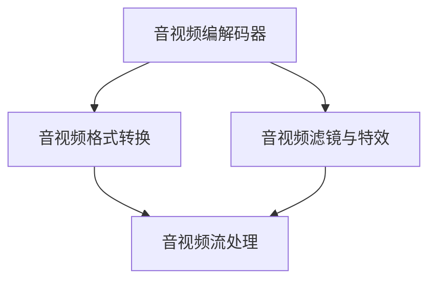

                 

# FFmpeg音视频处理入门

音视频处理是大数据时代的重要应用领域，涵盖了音视频编码、解码、剪辑、转换等方方面面。FFmpeg作为一个开源、跨平台的音视频处理工具，功能强大、灵活多样，广泛运用于各个领域。本文将带你全面了解FFmpeg的基本原理、核心算法、应用场景，并给出具体的项目实践示例。

## 1. 背景介绍

### 1.1 问题由来

随着互联网和移动互联网的飞速发展，音视频数据的生产和消费量呈爆炸式增长。智能手机的普及、在线教育的兴起、视频直播的火爆等现象，都推动了音视频处理技术的发展。音视频数据的复杂性、多样性和庞大性，使得处理、存储和传输变得尤为关键，对音视频处理技术提出了更高的要求。

### 1.2 问题核心关键点

音视频处理的核心目标是实现对音视频的压缩和解压缩、剪辑和分割、转换和合并、提取和插入等操作。FFmpeg通过以下几个核心概念实现这些目标：

- **音视频编解码**：实现对音视频数据的编码和解码，压缩和解压。
- **音视频格式转换**：支持多种音视频格式之间的相互转换，如MP3、MP4、AVI等。
- **音视频剪辑与特效**：实现音视频剪辑、字幕添加、滤镜应用等特效操作。
- **音视频流处理**：实现音视频流的实时编码和解码，支持流媒体传输。

### 1.3 问题研究意义

FFmpeg作为音视频处理领域的经典工具，具有以下研究意义：

1. **开源共享**：FFmpeg完全免费开源，易于获取和部署，推动了全球音视频处理技术的普及。
2. **高性能**：基于FFmpeg开发的应用可以在保持音视频质量的同时，极大提升处理效率。
3. **跨平台支持**：支持Linux、Windows、macOS等主流操作系统，适合跨平台开发和部署。
4. **功能全面**：支持多种音视频编解码器、格式转换、滤镜、特效等，可以满足多样化的音视频处理需求。
5. **社区活跃**：拥有庞大用户社区，不断有新功能和新插件加入，保持技术领先。

## 2. 核心概念与联系

### 2.1 核心概念概述

FFmpeg的核心概念包括以下几个关键方面：

- **音视频编解码器**：FFmpeg支持多种音视频编解码器，如X264、X265、MPV、MKV等。编解码器负责对音视频数据进行压缩和解压缩，以提高存储和传输效率。

- **音视频格式**：FFmpeg支持多种音视频格式，如MP3、MP4、AVI、MKV等。格式转换允许在不同格式之间无缝切换，便于不同场景下的音视频处理。

- **音视频滤镜与特效**：FFmpeg提供了丰富的滤镜和特效，如模糊、锐化、去噪、裁剪等，可以实现各种复杂的音视频处理效果。

- **音视频流处理**：FFmpeg支持音视频流的实时编码和解码，适合流媒体传输和直播。

### 2.2 核心概念原理和架构的 Mermaid 流程图



以上图表展示了FFmpeg核心概念的联系，说明音视频数据在FFmpeg内部按照编解码、格式转换、滤镜特效、流处理等步骤进行处理。

## 3. 核心算法原理 & 具体操作步骤

### 3.1 算法原理概述

FFmpeg的音视频处理主要依赖于其内部集成的各种编解码器和滤镜特效插件。这些插件封装了底层的音视频编解码算法，以及各种滤镜特效的实现。FFmpeg通过读取输入文件，选择合适的编解码器进行压缩或解压，然后根据需求应用各种滤镜特效，最后输出到目标文件中。

### 3.2 算法步骤详解

1. **文件读取与输出**：
   - 使用命令行或API读取输入文件，如`ffmpeg -i input.mp4 output.mp4`。
   - 选择输出文件格式，如`-vcodec h264 -acodec aac`。

2. **音视频编解码**：
   - 选择合适的编解码器进行压缩或解压。
   - 设置编解码器的参数，如比特率、帧率、分辨率等。

3. **音视频滤镜与特效**：
   - 应用各种滤镜特效，如模糊、锐化、去噪等。
   - 设置滤镜特效的参数，如模糊度、锐化强度等。

4. **音视频流处理**：
   - 对音视频流进行实时编码和解码。
   - 设置编解码器的参数，如编码器、帧率、分辨率等。

5. **输出与优化**：
   - 输出处理后的音视频文件，如`ffmpeg -i input.mp4 output.mp4`。
   - 优化输出性能，如设置硬件加速、调整编码质量等。

### 3.3 算法优缺点

**优点**：
- **功能全面**：支持多种音视频格式、编解码器、滤镜特效等，功能丰富。
- **跨平台支持**：支持Linux、Windows、macOS等多个平台，易于部署。
- **开源免费**：完全免费开源，社区活跃，持续更新。

**缺点**：
- **配置复杂**：需要一定的配置经验和系统环境，不适合初学者。
- **性能开销大**：处理大量音视频数据时，可能会消耗大量系统资源。
- **依赖环境**：依赖外部插件和编解码器，插件不兼容可能导致功能异常。

### 3.4 算法应用领域

FFmpeg在音视频处理领域具有广泛的应用，涵盖以下场景：

- **音视频编辑**：如剪辑、合并、分割等。
- **音视频转换**：如格式转换、转换编解码器等。
- **音视频压缩**：如实时编码、压缩流传输等。
- **音视频特效**：如滤镜、特效、字幕等。
- **音视频流处理**：如流媒体直播、流传输等。

## 4. 数学模型和公式 & 详细讲解 & 举例说明

### 4.1 数学模型构建

FFmpeg在音视频处理中主要涉及以下几个数学模型：

- **音视频编解码模型**：基于率失真优化理论，对音视频数据进行编码和解码，以实现最小化失真和最小化码率。
- **音视频滤镜特效模型**：基于各种数学模型和算法，实现滤镜和特效效果，如模糊、锐化、去噪等。
- **音视频流处理模型**：基于实时编码和解码模型，实现音视频流的实时处理和传输。

### 4.2 公式推导过程

以音视频编解码模型为例，设输入数据为$x$，编解码后的数据为$y$，编码器输出的码率为$R$，则基于率失真优化理论的编解码模型为：

$$
\min_{x,y} R(D(x,y)) + \lambda D(x,y)
$$

其中$D(x,y)$表示失真度量，$\lambda$为失真惩罚系数。

### 4.3 案例分析与讲解

以X264编解码器为例，推导其基于率失真优化理论的编解码过程：

1. **输入**：原始音视频数据$x$。
2. **编码**：使用X264编解码器将$x$编码成压缩数据$y$，同时计算码率$R$。
3. **解码**：使用X264编解码器将$y$解码成重构数据$\hat{x}$，并计算解码失真度$\hat{D}$。
4. **优化**：调整编解码参数，使得$R$和$D(x,\hat{x})$达到最优。

## 5. 项目实践：代码实例和详细解释说明

### 5.1 开发环境搭建

1. **安装FFmpeg**：
   - 在Linux系统上，使用`sudo apt-get install ffmpeg`命令安装FFmpeg。
   - 在Windows系统上，下载FFmpeg源代码，使用Visual Studio或MinGW进行编译。

2. **配置环境**：
   - 在项目中添加`ffmpeg`到PATH环境变量中。
   - 使用`ffmpeg -v -version`命令验证安装成功。

### 5.2 源代码详细实现

**音视频剪辑示例**：
```bash
ffmpeg -i input.mp4 -ss 00:01:00 -to 00:02:00 -c copy output.mp4
```

**音视频格式转换示例**：
```bash
ffmpeg -i input.mp4 -c:v libx264 -preset veryslow output.mp4
```

**音视频滤镜特效示例**：
```bash
ffmpeg -i input.mp4 -vf "vgrayscale" output.mp4
```

### 5.3 代码解读与分析

**音视频剪辑**：
- `-ss`参数：设置起始时间点，从00:01:00开始剪切。
- `-to`参数：设置结束时间点，在00:02:00结束。
- `-c copy`参数：仅复制音视频流，不重新编码。

**音视频格式转换**：
- `-c:v libx264`参数：选择X264编解码器。
- `-preset veryslow`参数：设置编码速度为最慢，以获得更高质量。

**音视频滤镜特效**：
- `-vf`参数：设置滤镜特效。
- `vgrayscale`：将视频转为灰度。

### 5.4 运行结果展示

执行上述命令后，输入文件`input.mp4`将被剪辑为00:01:00至00:02:00的片段，保存为`output.mp4`。转换后的视频文件格式为MP4，使用X264编解码器，分辨率和帧率保持不变。经过灰度滤镜特效后，视频输出为灰度模式。

## 6. 实际应用场景

### 6.1 智能媒体

FFmpeg在智能媒体领域有广泛应用，如视频直播、点播、互动广告等。通过FFmpeg，可以实现音视频流的实时编码、解码和传输，满足大流量、高并发的需求。

### 6.2 网络安全

FFmpeg可用于网络安全领域，如音视频取证、入侵检测等。通过FFmpeg，可以提取和分析网络通信中的音视频数据，识别异常行为，保障网络安全。

### 6.3 实时游戏

FFmpeg在实时游戏领域也具有重要作用，如视频录制、回放、分析等。通过FFmpeg，可以实现游戏中的实时视频录制，以及回放和分析，帮助开发者优化游戏性能。

### 6.4 未来应用展望

FFmpeg作为音视频处理领域的经典工具，其应用场景将不断扩展，涵盖更多领域：

- **智能交通**：实时监控和分析交通视频，优化交通流量。
- **智能医疗**：实时处理和分析医疗影像，提高诊断效率。
- **智能家居**：实时处理和分析家居音视频数据，提升生活便利性。

## 7. 工具和资源推荐

### 7.1 学习资源推荐

1. **官方文档**：FFmpeg官方文档提供详细的API和命令行操作说明，是学习FFmpeg的基础。
2. **在线教程**：如YouTube上的FFmpeg教程，详细讲解FFmpeg的使用方法和技巧。
3. **书籍**：《FFmpeg音视频处理实践》一书，系统介绍FFmpeg的原理和应用。
4. **社区讨论**：在FFmpeg官方论坛和GitHub上，可以查找问题，分享经验。

### 7.2 开发工具推荐

1. **IDE**：如Visual Studio Code，支持FFmpeg插件，方便开发调试。
2. **终端工具**：如Bash、PowerShell，适合命令行操作。
3. **编译工具**：如MinGW，支持Windows系统编译FFmpeg源代码。

### 7.3 相关论文推荐

1. **FFmpeg编码器的研究论文**：如《X264编码器优化研究》，介绍X264编码器的原理和优化方法。
2. **FFmpeg滤镜特效的研究论文**：如《FFmpeg滤镜特效实现》，介绍滤镜特效的算法和实现方法。
3. **FFmpeg音视频流处理的研究论文**：如《FFmpeg流处理优化研究》，介绍流处理的算法和优化方法。

## 8. 总结：未来发展趋势与挑战

### 8.1 研究成果总结

FFmpeg在音视频处理领域取得了诸多研究成果，主要包括以下几个方面：

1. **音视频编解码**：优化编解码算法，提高压缩和解压缩效率。
2. **音视频滤镜特效**：开发多种滤镜特效，丰富音视频处理效果。
3. **音视频流处理**：优化流处理算法，提高实时编码和解码性能。

### 8.2 未来发展趋势

FFmpeg作为音视频处理领域的经典工具，未来将呈现以下几个发展趋势：

1. **跨平台优化**：支持更多操作系统，优化跨平台兼容性。
2. **功能扩展**：增加更多编解码器、滤镜特效和流处理功能。
3. **性能优化**：优化算法和硬件加速，提升处理性能。
4. **生态系统构建**：完善插件和库，构建完整的音视频处理生态系统。

### 8.3 面临的挑战

FFmpeg在音视频处理领域的发展也面临诸多挑战：

1. **配置复杂**：需要一定的配置经验和系统环境，不适合初学者。
2. **性能开销大**：处理大量音视频数据时，可能会消耗大量系统资源。
3. **依赖环境**：依赖外部插件和编解码器，插件不兼容可能导致功能异常。

### 8.4 研究展望

未来FFmpeg的研究方向包括：

1. **跨平台兼容**：进一步优化跨平台兼容性，支持更多操作系统和硬件环境。
2. **性能提升**：优化算法和硬件加速，提升处理性能。
3. **功能丰富**：增加更多编解码器、滤镜特效和流处理功能。
4. **生态系统完善**：构建完整的音视频处理生态系统，方便开发者使用和部署。

## 9. 附录：常见问题与解答

**Q1: FFmpeg如何处理音视频剪辑？**

A: 使用`-ss`和`-to`参数设置起始和结束时间点，同时使用`-c copy`参数保留原始编码格式，避免重新编码。

**Q2: FFmpeg如何进行音视频格式转换？**

A: 使用`-c:v`和`-c:a`参数指定编解码器和音频编解码器，如`-c:v libx264 -c:a aac`。

**Q3: FFmpeg如何使用滤镜特效？**

A: 使用`-vf`参数指定滤镜特效，如`-vf vgrayscale`。

**Q4: FFmpeg如何进行实时流处理？**

A: 使用`-framerate`和`-pix_fmt`参数设置帧率和像素格式，如`-framerate 30 -pix_fmt yuv420p`。

**Q5: FFmpeg如何优化性能？**

A: 使用硬件加速，如`-cpu-dispatch`参数指定多线程处理，以及优化编解码参数，如`-preset`参数。

---

作者：禅与计算机程序设计艺术 / Zen and the Art of Computer Programming

