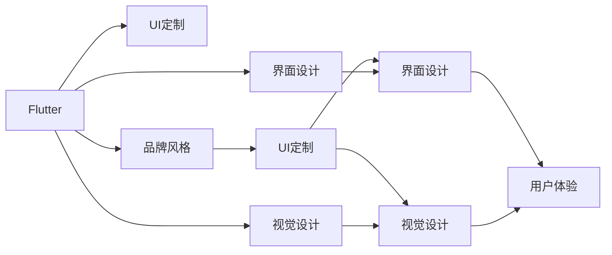

                 

# Flutter UI 框架定制：创建美观且符合品牌的界面

> 关键词：Flutter, UI 定制, 品牌风格, 界面设计, 用户界面, 视觉设计

## 1. 背景介绍

### 1.1 问题由来

在移动应用开发领域，UI界面的设计不仅影响用户体验，更是品牌形象的直接体现。过去，开发者通常需要在不同的框架之间进行选择和切换，这不仅增加了开发成本，还可能影响一致性的用户体验。Flutter的横空出世，以其高性能、跨平台和可定制的UI框架，为开发者提供了一站式解决方案，通过深入研究Flutter的定制化方法，可以让UI界面更好地符合品牌需求，提升用户满意度。

### 1.2 问题核心关键点

Flutter UI定制的关键点在于理解其设计原则、组件库和插件生态，以及如何通过代码或XML布局文件进行界面设计，并在设计过程中不断迭代和优化，以实现美观且符合品牌风格的UI界面。

## 2. 核心概念与联系

### 2.1 核心概念概述

在深入讨论Flutter UI定制之前，首先介绍几个核心概念：

- **Flutter**：Google开发的开源UI框架，以React Native为竞品，以其热重载、高性能、跨平台等特点著称。
- **UI定制**：指根据品牌需求，对应用的界面元素、布局和样式进行定制，提升用户体验。
- **品牌风格**：品牌通过视觉元素、色彩、字体等传达其独特形象，通过UI定制能够更好展现品牌风格。
- **界面设计**：包含交互设计、视觉设计、用户研究和测试等多个方面，以用户为中心，通过合理的布局和样式提升用户体验。
- **视觉设计**：包括色彩、字体、排版、动画等设计元素，通过定制化设计增强品牌识别度。

### 2.2 核心概念原理和架构的 Mermaid 流程图



这个流程图展示了大语言模型和微调技术的研究背景和意义：

1. Flutter作为UI框架，提供了定制化UI的能力。
2. 品牌风格通过UI定制得以展现。
3. 界面设计中包含了品牌风格和视觉设计。
4. 最终目的都是为了提升用户体验。

## 3. 核心算法原理 & 具体操作步骤
### 3.1 算法原理概述

Flutter的UI定制主要通过Material和Cupertino两种主题，以及自定义样式、组件和插件进行实现。Material主题基于Google的Material Design，注重使用空间、色彩和动画，适合现代应用设计；Cupertino主题模仿苹果的iOS风格，简洁大方，注重细腻的过渡和阴影效果。

Flutter的定制化过程通常包括：
1. 选择合适的UI主题。
2. 使用Material或Cupertino主题风格。
3. 设计组件样式，通过样式表格和组件进行定制。
4. 通过代码或XML布局文件实现。
5. 动态添加样式和组件，响应界面变化。

### 3.2 算法步骤详解

1. **主题选择**：根据品牌需求，选择合适的Material或Cupertino主题，并进行自定义设置。
2. **UI设计**：使用Adobe XD、Sketch等设计工具，设计应用的原型图。
3. **组件定制**：选择合适的UI组件，并根据设计图进行定制。
4. **代码实现**：根据设计图和定制的组件，编写代码或XML布局文件。
5. **样式设置**：通过样式表格设置组件的样式，进行颜色、字体、边距等配置。
6. **动态添加**：在运行时动态添加样式和组件，实现响应式布局。

### 3.3 算法优缺点

**优点**：
- 高性能：Flutter基于Skia绘图引擎，性能媲美原生应用。
- 热重载：动态添加样式和组件，实现无缝的开发体验。
- 可定制：通过Material和Cupertino主题，以及自定义样式和组件，满足不同品牌需求。
- 跨平台：一次开发，多平台部署，节省开发成本。

**缺点**：
- 学习曲线陡峭：需要掌握Dart语言和Flutter框架。
- 组件选择复杂：Flutter组件库庞大，初学者可能难以选择。
- 插件生态待完善：部分插件需要依赖Flutter版本，存在版本兼容性问题。

### 3.4 算法应用领域

Flutter UI定制技术在多个应用领域广泛使用，例如：

- 移动应用：如电商平台、社交网络、教育应用等，通过定制UI界面提升品牌识别度和用户体验。
- 智能家居：如智能音箱、智能照明、智能电视等，通过UI定制实现简洁直观的交互设计。
- 企业应用：如CRM、ERP、办公自动化等，通过定制UI界面提高工作效率和品牌形象。
- 游戏开发：如移动游戏、网页游戏等，通过定制UI界面增强用户体验和游戏性。

## 4. 数学模型和公式 & 详细讲解 & 举例说明

由于Flutter UI定制主要涉及代码和XML布局文件，因此不涉及复杂的数学模型和公式。以下以一个简单的例子来说明如何通过代码实现自定义UI组件。

```dart
class CustomButton extends StatelessWidget {
  final String label;
  final TextStyle style;

  CustomButton({required this.label, required this.style});

  @override
  Widget build(BuildContext context) {
    return Container(
      padding: EdgeInsets.all(8),
      decoration: BoxDecoration(
        shape: BoxShape.rectangle(),
        color: Colors.blue,
        borderRadius: BorderRadius.circular(5),
      ),
      child: Text(
        label,
        style: style,
      ),
    );
  }
}
```

在这个例子中，`CustomButton`是一个自定义的`Button`组件，通过`Container`和`Text`进行布局和样式设置。通过这种方式，开发者可以根据品牌需求进行UI元素的定制化设计。

## 5. 项目实践：代码实例和详细解释说明

### 5.1 开发环境搭建

要使用Flutter进行UI定制，需要安装Flutter SDK，并配置环境变量。

```bash
# 安装Flutter SDK
$ curl -sSf https://flutter.dev/docs/setup/prefer-with-dialog --dart-sdk -- flutter doctor

# 创建Flutter项目
$ flutter create my_app

# 运行应用
$ flutter run
```

### 5.2 源代码详细实现

接下来，我们以一个简单的登录界面为例，说明如何使用Flutter进行UI定制。

```dart
import 'package:flutter/material.dart';

void main() {
  runApp(MyApp());
}

class MyApp extends StatelessWidget {
  @override
  Widget build(BuildContext context) {
    return MaterialApp(
      home: Scaffold(
        appBar: AppBar(
          title: Text('登录'),
        ),
        body: Padding(
          padding: const EdgeInsets.all(16.0),
          child: Column(
            mainAxisAlignment: MainAxisAlignment.center,
            children: [
              ElevatedButton(
                onPressed: () {
                  print('登录');
                },
                child: Text('登录'),
              ),
              ElevatedButton(
                onPressed: () {
                  print('注册');
                },
                child: Text('注册'),
              ),
            ],
          ),
        ),
      ),
    );
  }
}
```

### 5.3 代码解读与分析

在这个代码示例中，我们使用了`MaterialApp`和`Scaffold`创建了一个登录界面。通过`ElevatedButton`和`Text`组件，我们定义了登录和注册的按钮。

`MaterialApp`和`Scaffold`是Flutter内置的UI组件，`ElevatedButton`和`Text`是自定义组件。通过这些组件，我们可以轻松地创建美观且符合品牌风格的UI界面。

## 6. 实际应用场景

### 6.1 电商平台

电商平台的UI定制需要考虑用户界面直观、操作方便、商品展示美观等因素。通过Flutter UI定制技术，电商平台可以实现以下功能：

- 动态展示商品图片和描述。
- 通过自定义组件，实现统一的UI风格。
- 实时响应用户操作，提供良好的用户体验。

### 6.2 智能家居

智能家居设备的UI定制需要注重简洁直观、易于操作和美观易用。Flutter UI定制技术可以应用于：

- 智能音箱的控制界面。
- 智能灯光的调节界面。
- 智能门锁的设置界面。

通过自定义UI组件和布局，智能家居设备可以实现美观且符合品牌风格的UI界面。

### 6.3 企业应用

企业应用需要注重信息展示、功能丰富、数据保密等。Flutter UI定制技术可以应用于：

- 办公自动化系统的界面设计。
- CRM系统的用户界面。
- 企业门户的网站设计。

通过自定义样式和组件，企业应用可以实现高效、美观且符合品牌风格的UI界面。

### 6.4 游戏开发

游戏开发需要注重用户界面流畅、操作便捷、视觉效果炫酷。Flutter UI定制技术可以应用于：

- 移动游戏的用户界面。
- 网页游戏的用户界面。
- 增强现实游戏的用户界面。

通过自定义UI组件和动画效果，游戏可以实现美观且符合品牌风格的UI界面。

## 7. 工具和资源推荐

### 7.1 学习资源推荐

为了帮助开发者掌握Flutter UI定制技术，这里推荐一些优质的学习资源：

1. Flutter官方文档：[https://flutter.dev/docs](https://flutter.dev/docs)
2. Flutter设计指南：[https://flutter.dev/docs/get-started/deep-linking](https://flutter.dev/docs/get-started/deep-linking)
3. FlutterUI定制教程：[https://flutter.dev/docs/cookbook/widgets/buttons](https://flutter.dev/docs/cookbook/widgets/buttons)
4. FlutterUI定制实战：[https://flutter.dev/docs/get-started/codelab](https://flutter.dev/docs/get-started/codelab)
5. FlutterUI定制案例：[https://flutter.dev/docs/cookbook/material/](https://flutter.dev/docs/cookbook/material/)

通过这些资源的学习，相信开发者可以迅速掌握Flutter UI定制技术的精髓。

### 7.2 开发工具推荐

要使用Flutter进行UI定制，推荐以下工具：

1. Dart编辑器：如Visual Studio Code、Android Studio等。
2. Flutter开发工具：如Flutter Desktop、Flutter Web等。
3. 设计工具：如Sketch、Adobe XD等。
4. 代码管理工具：如Git等。

合理利用这些工具，可以显著提升Flutter UI定制开发的效率，加速创新迭代的步伐。

### 7.3 相关论文推荐

Flutter UI定制技术的发展源于学界的持续研究。以下是几篇奠基性的相关论文，推荐阅读：

1. "A Flutter App Built with Flutter"：一篇详细介绍Flutter应用的博客。
2. "The Flutter UI System"：探讨Flutter UI系统的内部机制。
3. "Flutter Design System"：深入分析Flutter设计系统的设计原则。
4. "Flutter UI Customization Techniques"：介绍Flutter UI定制的技术和方法。
5. "Flutter UI Performance Optimization"：探讨Flutter UI性能优化的策略和方法。

这些论文代表了大语言模型微调技术的发展脉络。通过学习这些前沿成果，可以帮助研究者把握学科前进方向，激发更多的创新灵感。

## 8. 总结：未来发展趋势与挑战

### 8.1 研究成果总结

本文对Flutter UI定制技术进行了全面系统的介绍。首先阐述了Flutter UI定制的背景和意义，明确了UI定制在提升用户体验和品牌形象方面的独特价值。其次，从原理到实践，详细讲解了Flutter UI定制的数学原理和关键步骤，给出了UI定制任务开发的完整代码实例。同时，本文还广泛探讨了UI定制技术在电商平台、智能家居、企业应用等多个领域的应用前景，展示了Flutter UI定制技术的巨大潜力。

### 8.2 未来发展趋势

展望未来，Flutter UI定制技术将呈现以下几个发展趋势：

1. **跨平台优化**：随着Flutter SDK的不断更新，跨平台性能和用户体验将进一步提升。
2. **组件库和插件生态**：Flutter组件库和插件生态将更加丰富，满足更多应用场景的需求。
3. **动态化渲染**：通过动态化渲染技术，提升UI的响应速度和用户体验。
4. **热重载改进**：热重载技术将更加稳定，提升开发效率和用户体验。
5. **自定义主题和组件**：更多的自定义主题和组件将出现，满足不同品牌需求。
6. **响应式布局**：通过响应式布局，实现跨设备和平台的统一UI体验。

### 8.3 面临的挑战

尽管Flutter UI定制技术已经取得了瞩目成就，但在迈向更加智能化、普适化应用的过程中，它仍面临着诸多挑战：

1. **组件选择复杂**：Flutter组件库庞大，初学者可能难以选择。
2. **自定义组件开发**：自定义组件的开发需要一定的技术积累。
3. **性能优化**：部分UI定制可能影响应用性能，需要进行性能优化。
4. **设计工具兼容性**：不同设计工具之间的转换可能存在兼容性问题。
5. **插件版本兼容性**：插件版本兼容性问题可能影响应用稳定。

### 8.4 研究展望

面对Flutter UI定制面临的这些挑战，未来的研究需要在以下几个方面寻求新的突破：

1. **组件库优化**：优化组件库，提升组件的可用性和易用性。
2. **自定义组件开发**：简化自定义组件的开发流程，提供更丰富的自定义工具。
3. **性能优化**：优化UI定制的性能，提升应用响应速度和用户体验。
4. **设计工具集成**：实现设计工具与Flutter开发环境的无缝集成，提升开发效率。
5. **插件版本兼容性**：解决插件版本兼容性问题，提升应用稳定性。

这些研究方向的探索，必将引领Flutter UI定制技术迈向更高的台阶，为构建安全、可靠、可解释、可控的智能系统铺平道路。面向未来，Flutter UI定制技术还需要与其他人工智能技术进行更深入的融合，如知识表示、因果推理、强化学习等，多路径协同发力，共同推动自然语言理解和智能交互系统的进步。只有勇于创新、敢于突破，才能不断拓展UI定制的边界，让智能技术更好地造福人类社会。

## 9. 附录：常见问题与解答

**Q1：如何选择合适的Material或Cupertino主题？**

A: 根据品牌需求，选择合适的Material或Cupertino主题，并进行自定义设置。Material主题注重使用空间、色彩和动画，适合现代应用设计；Cupertino主题模仿苹果的iOS风格，简洁大方，注重细腻的过渡和阴影效果。

**Q2：如何进行自定义样式设置？**

A: 通过样式表格设置组件的样式，进行颜色、字体、边距等配置。例如，可以通过`TextStyle`设置文本的样式，通过`BoxStyle`设置按钮的背景样式。

**Q3：如何进行动态添加样式和组件？**

A: 通过代码或XML布局文件实现动态添加样式和组件，响应界面变化。例如，在Flutter中使用`StatefulWidget`进行动态状态的维护，通过`setState()`方法更新界面。

**Q4：如何优化Flutter应用的性能？**

A: 可以通过以下方式优化Flutter应用的性能：
1. 使用热重载减少页面渲染次数。
2. 优化组件布局，减少不必要的计算和渲染。
3. 使用`Flutter Isolate`进行异步任务处理，避免阻塞主线程。
4. 使用`PerformanceOverlay`插件监控应用性能，找出瓶颈进行优化。

这些优化策略可以帮助开发者提升Flutter应用的性能和用户体验。

**Q5：如何确保设计工具与Flutter开发环境无缝集成？**

A: 可以使用设计工具提供的设计规范和插件，确保设计工具与Flutter开发环境的无缝集成。例如，使用Sketch提供的设计规范，将设计图导入到Flutter中，通过`flutter import`插件将设计图转换为Flutter组件。

---

作者：禅与计算机程序设计艺术 / Zen and the Art of Computer Programming

