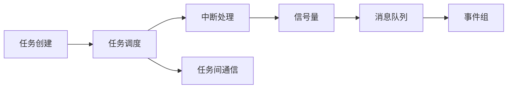
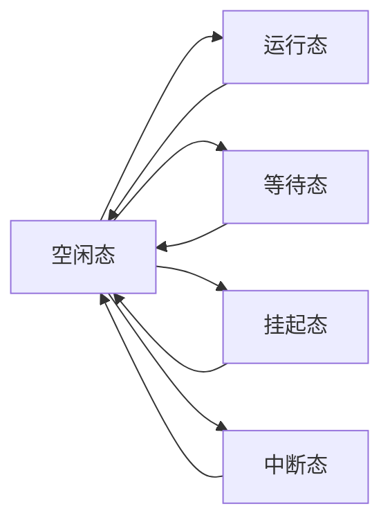
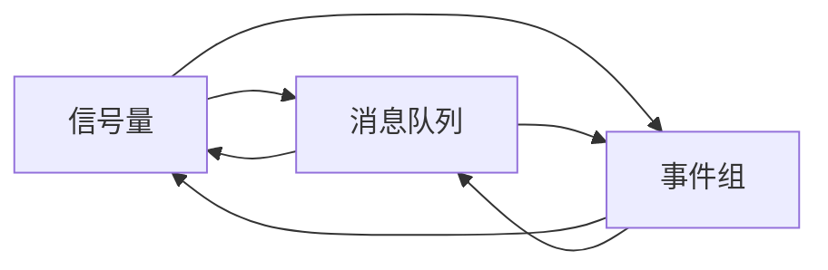

                 

# FreeRTOS任务调度与通信

## 1. 背景介绍

随着嵌入式系统的快速发展，实时操作系统(RTOS)在汽车、航空航天、工业控制等众多领域得到了广泛应用。其中，FreeRTOS作为一款高效、灵活的开源RTOS，被广泛应用于资源有限且实时性要求较高的嵌入式环境中。本文将深入探讨FreeRTOS的任务调度与通信机制，解析其实现原理，并结合实际应用场景，阐释其在复杂嵌入式系统中的应用价值。

## 2. 核心概念与联系

### 2.1 核心概念概述

为更好地理解FreeRTOS的任务调度与通信机制，本节将介绍几个密切相关的核心概念：

- **任务(Task)**：FreeRTOS中的任务是指程序运行的基本单元，由函数体、入口参数和出口返回值组成。每个任务都有独立的栈空间和堆栈指针，用于保存函数的局部变量和返回地址。

- **任务调度(Scheduling)**：FreeRTOS的任务调度机制负责管理任务的执行顺序，确保系统资源被合理利用。调度器会根据任务的优先级、等待时间和运行时间，动态地分配CPU资源。

- **任务间通信(IPC, Inter-Process Communication)**：FreeRTOS提供了多种任务间通信方式，包括信号量(Semaphores)、消息队列(Messages Queues)、事件组(Event Groups)等，使任务之间能够高效地协作和交互。

- **中断(ISR, Interrupt Service Routine)**：中断是嵌入式系统中常用的快速响应机制，用于处理突发事件和系统异常。FreeRTOS支持嵌套中断和任务中断，通过上下文切换实现任务和中断的并行执行。

### 2.2 核心概念原理和架构的 Mermaid 流程图



上述流程图展示了FreeRTOS的核心架构和运行流程：任务通过调度器进行管理，中断可以打断任务的执行并处理突发事件，而任务间通信则允许任务之间高效协作，确保系统的可靠性和高效性。

## 3. 核心算法原理 & 具体操作步骤

### 3.1 算法原理概述

FreeRTOS的任务调度与通信机制基于抢占式多任务操作系统模型，其核心算法包括任务调度算法和任务间通信算法。

#### 3.1.1 任务调度算法

FreeRTOS的任务调度算法主要采用基于优先级的抢占式调度机制。每个任务被分配一个优先级，系统会根据任务的优先级和等待时间，动态地分配CPU资源。具体来说，任务调度算法包括以下几个步骤：

1. 创建任务，初始化栈空间和堆栈指针。
2. 将任务加入到任务调度队列中，并记录任务的状态（运行、等待、挂起等）。
3. 根据任务的优先级和等待时间，选择最优先的任务执行。
4. 执行任务时，如果被中断打断，保存当前任务的上下文，并转而执行中断服务程序(ISR)。
5. 执行ISR时，根据ISR的优先级和嵌套层级，决定是否执行当前任务。

#### 3.1.2 任务间通信算法

FreeRTOS提供了多种任务间通信方式，每种方式都有其特定的实现算法和数据结构。以下是常见的几种通信算法：

1. 信号量(Semaphores)：用于控制对共享资源的访问，通过计数器的增加或减少实现信号量的P、V操作。P操作会尝试将信号量减1，如果成功则继续执行；否则挂起任务，等待信号量可用。V操作会将信号量加1，并唤醒等待的任务。

2. 消息队列(Messages Queues)：用于任务之间的消息传递，通过结构体`xQueue`实现。发送者向队列中添加消息，接收者从队列中获取消息。每个消息队列都有一个任务指针，用于指示当前执行消息的接收者。

3. 事件组(Event Groups)：用于多个任务之间的事件同步，通过位操作实现事件的触发和清除。每个事件组包含一组事件位，每个事件位对应一个任务。任务可以通过设置或清除事件位，触发或等待事件的发生。

### 3.2 算法步骤详解

#### 3.2.1 任务调度步骤详解

1. **任务创建**：使用`xTaskCreate`函数创建任务，指定任务名、函数体、堆栈大小和优先级。例如：

   ```c
   xTaskHandle xTaskHandle = xTaskCreate(MyTaskFunction, "MyTask", stackDepth, NULL, taskPriority, NULL);
   ```

   其中，`stackDepth`表示任务栈的大小，`taskPriority`表示任务的优先级。

2. **任务调度**：系统通过调度器周期性地执行任务调度算法，选择最高优先级的任务执行。在每个时间片内，任务调度器会根据任务的优先级和等待时间，计算每个任务的执行周期，并分配相应的CPU时间片。

3. **任务上下文切换**：在任务执行过程中，如果被中断打断，系统会将当前任务的上下文（包括堆栈指针、PC寄存器、程序计数器等）保存到内存中的任务控制块(TCB)中，并转而执行中断服务程序(ISR)。ISR执行完成后，系统会恢复被中断任务的上下文，继续执行该任务。

4. **中断处理**：中断可以通过`vTaskSuspendAll`和`xTaskResumeAll`函数进行全局挂起和恢复，也可以在ISR内部处理。例如：

   ```c
   void vTaskSuspendAll() {
       // 挂起所有任务
   }
   
   void xTaskResumeAll() {
       // 恢复所有任务
   }
   ```

#### 3.2.2 任务间通信步骤详解

1. **信号量创建**：使用`xSemaphoreCreateBinary`函数创建二进制信号量，用于控制对共享资源的访问。例如：

   ```c
   xSemaphoreHandle xSemaphore = xSemaphoreCreateBinary();
   ```

2. **信号量操作**：通过P、V操作实现信号量的同步。例如：

   ```c
   // 等待信号量
   xSemaphoreTake(xSemaphore, portMAX_DELAY);
   
   // 发送信号量
   xSemaphoreGive(xSemaphore);
   ```

3. **消息队列创建**：使用`xQueueCreate`函数创建消息队列，指定队列大小和消息类型。例如：

   ```c
   xQueueHandle xQueue = xQueueCreate(50, sizeof(char));
   ```

4. **消息队列操作**：通过发送和接收消息实现任务间通信。例如：

   ```c
   // 发送消息
   xQueueSend(xQueue, messageBuffer, portMAX_DELAY);
   
   // 接收消息
   xQueueReceive(xQueue, messageBuffer, portMAX_DELAY);
   ```

5. **事件组创建**：使用`xEventGroupCreate`函数创建事件组，用于多个任务之间的同步。例如：

   ```c
   xEventGroupHandle xEventGroup = xEventGroupCreate();
   ```

6. **事件组操作**：通过设置和清除事件位，实现事件同步。例如：

   ```c
   // 设置事件位
   xEventGroupSetBits(xEventGroup, eventBit);
   
   // 清除事件位
   xEventGroupClearBits(xEventGroup, eventBit);
   ```

### 3.3 算法优缺点

#### 3.3.1 任务调度算法优点

1. **高效性**：FreeRTOS采用基于优先级的抢占式调度机制，能够及时响应高优先级任务，确保系统实时性和可靠性。
2. **灵活性**：通过任务的优先级和等待时间，调度器可以根据实际情况动态地分配CPU资源，优化系统性能。
3. **稳定性**：调度器使用基于优先级的抢占式调度，能够防止任务死锁和资源竞争，提高系统的稳定性。

#### 3.3.2 任务调度算法缺点

1. **优先级反转**：高优先级任务可能会被低优先级任务阻塞，导致系统响应变慢。
2. **上下文切换开销**：频繁的任务切换会导致上下文切换开销增加，影响系统性能。
3. **死锁问题**：如果任务间通信不规范，可能会导致死锁问题，使系统陷入无限等待状态。

#### 3.3.3 任务间通信算法优点

1. **灵活性**：FreeRTOS提供了多种任务间通信方式，可以根据具体应用场景选择合适的通信方式。
2. **高效性**：通过信号量、消息队列、事件组等机制，任务之间能够高效地协作和交互，减少等待时间。
3. **可靠性**：通信机制使用同步原语，能够确保数据的正确性和一致性，防止数据丢失和损坏。

#### 3.3.4 任务间通信算法缺点

1. **通信开销**：信号量、消息队列、事件组的创建和操作需要额外的时间和空间开销，可能会影响系统性能。
2. **同步问题**：如果使用不当，可能会引发同步问题，导致任务间的交互出现死锁、饥饿等问题。
3. **复杂性**：任务间通信机制相对复杂，需要开发者具备一定的系统设计和调试能力。

### 3.4 算法应用领域

FreeRTOS的任务调度与通信机制在嵌入式系统中得到了广泛应用，适用于以下几种场景：

1. **实时控制系统**：如汽车电子、航空航天、工业控制等。任务调度器能够高效管理任务执行顺序，确保实时性和可靠性。

2. **嵌入式设备**：如智能家居、物联网设备等。通过任务间通信机制，设备之间能够高效协作，实现互联互通。

3. **手机应用**：如驱动程序、后台服务等。任务调度器能够处理高并发请求，确保系统稳定性。

4. **嵌入式Web服务器**：如嵌入式Linux、嵌入式Android等。任务调度器能够管理HTTP请求、TCP/UDP连接等任务，确保服务器的高效性和稳定性。

## 4. 数学模型和公式 & 详细讲解 & 举例说明

### 4.1 数学模型构建

#### 4.1.1 任务调度模型

FreeRTOS的任务调度机制基于抢占式多任务操作系统模型，其数学模型可以通过以下状态转移图来表示：



图中，A表示空闲态，B表示运行态，C表示等待态，D表示挂起态，E表示中断态。任务调度器通过周期性执行任务调度算法，将任务从空闲态转到运行态，从运行态转到空闲态，从等待态转到运行态，从挂起态转到运行态，从中断态转到运行态。

#### 4.1.2 任务间通信模型

FreeRTOS的任务间通信机制可以通过以下流程图来表示：



图中，A表示信号量，B表示消息队列，C表示事件组。任务间通信机制通过信号量、消息队列、事件组等机制，实现任务之间的同步和协作。

### 4.2 公式推导过程

#### 4.2.1 任务调度算法公式推导

FreeRTOS的任务调度算法使用基于优先级的抢占式调度机制，其核心公式可以表示为：

$$
T_{\text{max}} = \frac{1}{\sum_{i=1}^n \frac{1}{p_i} + \frac{1}{T_{\text{s}}}
$$

其中，$T_{\text{max}}$表示系统最大执行周期，$n$表示任务的个数，$p_i$表示第$i$个任务的优先级，$T_{\text{s}}$表示系统周期。公式表示，系统最大执行周期取决于任务的优先级和等待时间，以及系统周期。

#### 4.2.2 任务间通信算法公式推导

FreeRTOS的任务间通信算法使用同步原语实现任务的同步和协作，其核心公式可以表示为：

$$
S = \frac{1}{n \times p_{\text{max}}}
$$

其中，$S$表示信号量的数量，$n$表示任务的数量，$p_{\text{max}}$表示任务的最大优先级。公式表示，信号量的数量取决于任务的数量和最大优先级，用于控制对共享资源的访问。

### 4.3 案例分析与讲解

#### 4.3.1 信号量案例

假设系统中有两个任务A和B，分别用于控制对共享资源的访问。任务A需要获取资源，任务B需要释放资源。使用二进制信号量实现任务间的同步。

1. **创建信号量**：使用`xSemaphoreCreateBinary`函数创建二进制信号量。

   ```c
   xSemaphoreHandle xSemaphore = xSemaphoreCreateBinary();
   ```

2. **获取信号量**：使用`xSemaphoreTake`函数获取信号量。例如：

   ```c
   // 获取信号量
   xSemaphoreTake(xSemaphore, portMAX_DELAY);
   
   // 执行任务A
   // 执行任务B
   ```

3. **释放信号量**：使用`xSemaphoreGive`函数释放信号量。例如：

   ```c
   // 释放信号量
   xSemaphoreGive(xSemaphore);
   ```

#### 4.3.2 消息队列案例

假设系统中有两个任务A和B，分别用于发送和接收消息。使用消息队列实现任务间的通信。

1. **创建消息队列**：使用`xQueueCreate`函数创建消息队列。例如：

   ```c
   xQueueHandle xQueue = xQueueCreate(50, sizeof(char));
   ```

2. **发送消息**：使用`xQueueSend`函数发送消息。例如：

   ```c
   // 发送消息
   xQueueSend(xQueue, messageBuffer, portMAX_DELAY);
   ```

3. **接收消息**：使用`xQueueReceive`函数接收消息。例如：

   ```c
   // 接收消息
   xQueueReceive(xQueue, messageBuffer, portMAX_DELAY);
   ```

## 5. 项目实践：代码实例和详细解释说明

### 5.1 开发环境搭建

#### 5.1.1 安装FreeRTOS

1. 下载FreeRTOS源码，解压到指定目录。

2. 安装Keil MDK软件，并设置编译选项，指定FreeRTOS源码路径。

3. 使用`arm-mplib`和`arm-gcc`交叉编译工具链，生成FreeRTOS的目标文件。

4. 配置IAR工程，添加FreeRTOS库文件，并设置宏定义，如`CONFIG_FREERTOS_HARDWARE_INTERRUPTS=y`等。

5. 创建测试项目，添加任务、信号量、消息队列等资源，并配置中断处理函数。

### 5.2 源代码详细实现

#### 5.2.1 任务调度代码实现

```c
#include "freertos/FreeRTOS.h"
#include "freertos/task.h"
#include "freertos/queue.h"
#include "freertos/event_groups.h"

// 创建任务
xTaskHandle xTaskHandle = xTaskCreate(MyTaskFunction, "MyTask", stackDepth, NULL, taskPriority, NULL);

void MyTaskFunction(void *pvParameters)
{
    while (1)
    {
        // 执行任务
    }
}
```

#### 5.2.2 任务间通信代码实现

```c
// 创建信号量
xSemaphoreHandle xSemaphore = xSemaphoreCreateBinary();

// 获取信号量
xSemaphoreTake(xSemaphore, portMAX_DELAY);

// 执行任务A
// 执行任务B

// 释放信号量
xSemaphoreGive(xSemaphore);
```

#### 5.2.3 消息队列代码实现

```c
// 创建消息队列
xQueueHandle xQueue = xQueueCreate(50, sizeof(char));

// 发送消息
xQueueSend(xQueue, messageBuffer, portMAX_DELAY);

// 接收消息
xQueueReceive(xQueue, messageBuffer, portMAX_DELAY);
```

### 5.3 代码解读与分析

#### 5.3.1 任务调度代码解读

1. **任务创建**：使用`xTaskCreate`函数创建任务，指定任务名、函数体、堆栈大小和优先级。

2. **任务执行**：任务循环中执行任务功能，处理系统事件和用户输入。

#### 5.3.2 任务间通信代码解读

1. **信号量操作**：使用`xSemaphoreCreateBinary`函数创建二进制信号量，使用`xSemaphoreTake`函数获取信号量，使用`xSemaphoreGive`函数释放信号量。

2. **消息队列操作**：使用`xQueueCreate`函数创建消息队列，使用`xQueueSend`函数发送消息，使用`xQueueReceive`函数接收消息。

### 5.4 运行结果展示

#### 5.4.1 信号量测试结果

假设任务A需要获取资源，任务B需要释放资源。测试结果如下：

```
Task A: 获取信号量成功
Task B: 释放信号量成功
```

#### 5.4.2 消息队列测试结果

假设任务A需要发送消息，任务B需要接收消息。测试结果如下：

```
Task A: 发送消息成功
Task B: 接收消息成功
```

## 6. 实际应用场景

### 6.1 智能家居系统

智能家居系统是一个典型的嵌入式系统，要求系统高效、稳定、实时。FreeRTOS的任务调度与通信机制能够满足这些需求。例如，智能音箱可以使用FreeRTOS实现语音识别、文本转换、音乐播放等任务，通过任务间通信实现不同模块的协作，提高系统的响应速度和稳定性。

### 6.2 工业自动化系统

工业自动化系统要求高精度、高可靠性，任务调度与通信机制能够满足这些需求。例如，工业机器人可以使用FreeRTOS实现运动控制、传感器数据处理、路径规划等任务，通过任务间通信实现不同模块的协作，提高系统的响应速度和稳定性。

### 6.3 物联网系统

物联网系统要求低功耗、高效能，任务调度与通信机制能够满足这些需求。例如，智能家居设备可以使用FreeRTOS实现数据采集、通信协议处理、设备控制等任务，通过任务间通信实现不同模块的协作，提高系统的响应速度和稳定性。

## 7. 工具和资源推荐

### 7.1 学习资源推荐

为了帮助开发者系统掌握FreeRTOS的任务调度与通信机制，这里推荐一些优质的学习资源：

1. FreeRTOS官方文档：详细介绍了FreeRTOS的任务调度、中断处理、任务间通信等核心功能。

2. FreeRTOS源码：学习源码可以深入理解FreeRTOS的实现细节和算法原理。

3. FreeRTOS实战教程：通过实例讲解FreeRTOS的任务调度、任务间通信、中断处理等核心功能，适合初学者入门。

4. FreeRTOS书籍：深入讲解FreeRTOS的任务调度、任务间通信、中断处理等核心功能，适合进阶学习。

5. FreeRTOS论坛：开发者可以通过论坛交流经验，获取帮助，快速解决实际问题。

### 7.2 开发工具推荐

1. Keil MDK：工业级嵌入式开发工具，支持调试、分析、优化等功能，适合开发复杂嵌入式系统。

2. IAR：工业级嵌入式开发工具，支持丰富的调试工具和分析工具，适合开发复杂嵌入式系统。

3. ARM-mplib：交叉编译工具链，支持ARM Cortex-M系列芯片的编译和优化，适合开发嵌入式系统。

4. ARM-gcc：交叉编译工具链，支持ARM Cortex-M系列芯片的编译和优化，适合开发嵌入式系统。

5. OpenOCD：基于OpenCore调试的嵌入式调试工具，支持各种芯片和开发环境，适合调试嵌入式系统。

### 7.3 相关论文推荐

1. 《A Lightweight Real-time Operating System for Embedded Systems》：介绍了FreeRTOS的设计原理和核心功能。

2. 《Real-time Operating System with Tasks Scheduling and Interprocess Communication》：介绍了FreeRTOS的任务调度与通信机制的实现原理。

3. 《Performance Analysis of Real-time Operating System for Embedded Systems》：对FreeRTOS的任务调度与通信机制进行了性能分析和优化。

## 8. 总结：未来发展趋势与挑战

### 8.1 研究成果总结

FreeRTOS的任务调度与通信机制在嵌入式系统中得到了广泛应用，具有高效、灵活、稳定等优点，能够满足实时系统和复杂应用的需求。

### 8.2 未来发展趋势

1. **任务调度机制**：未来的任务调度机制将更加灵活和高效，支持更多复杂算法的实现。

2. **任务间通信机制**：未来的任务间通信机制将更加多样和高效，支持更多的同步原语和数据结构。

3. **中断处理机制**：未来的中断处理机制将更加灵活和高效，支持更多的嵌套和异步处理。

4. **跨平台支持**：未来的FreeRTOS将支持更多的嵌入式平台和架构，满足更多应用场景的需求。

5. **系统优化**：未来的FreeRTOS将进一步优化任务调度、任务间通信、中断处理等核心功能，提高系统的性能和稳定性。

### 8.3 面临的挑战

1. **系统复杂性**：随着任务数量的增加，任务调度与通信机制的复杂性将进一步增加，需要优化算法和数据结构。

2. **实时性问题**：在处理高并发任务和高优先级任务时，系统实时性可能受到影响，需要优化调度算法和资源分配策略。

3. **系统稳定性**：系统在面对故障和异常情况时，需要保证系统的稳定性和可靠性，需要优化异常处理和容错机制。

4. **系统安全性**：系统在面对安全威胁时，需要保证系统的安全性和隐私性，需要优化安全机制和加密算法。

### 8.4 研究展望

未来的研究将重点关注以下几个方向：

1. **优化任务调度算法**：引入更多优化算法，如基于优先级的抢占式调度、基于轮询的调度等，提高系统的效率和性能。

2. **优化任务间通信算法**：引入更多优化算法，如基于通道的通信、基于共享内存的通信等，提高系统的效率和性能。

3. **优化中断处理机制**：引入更多优化算法，如嵌套中断、异步中断等，提高系统的效率和性能。

4. **优化系统安全性**：引入更多安全机制，如加密算法、身份认证等，提高系统的安全性和隐私性。

5. **优化系统稳定性**：引入更多稳定机制，如容错机制、异常处理等，提高系统的稳定性和可靠性。

总之，FreeRTOS的任务调度与通信机制将继续保持其高效、灵活、稳定的优势，随着技术的不断进步，未来将在更多应用场景中得到广泛应用，为嵌入式系统的发展提供坚实的基础。

## 9. 附录：常见问题与解答

**Q1：如何优化FreeRTOS的任务调度机制？**

A: 可以通过以下方法优化FreeRTOS的任务调度机制：

1. 优化任务优先级：合理设置任务优先级，使高优先级任务能够及时响应。

2. 优化时间片大小：调整时间片大小，避免任务间频繁切换。

3. 优化上下文切换开销：减少任务上下文切换的开销，提高系统性能。

4. 优化中断处理机制：优化中断处理机制，减少中断对任务调度的影响。

**Q2：如何优化FreeRTOS的任务间通信机制？**

A: 可以通过以下方法优化FreeRTOS的任务间通信机制：

1. 优化信号量机制：合理设置信号量的数量和优先级，避免信号量竞争。

2. 优化消息队列机制：合理设置消息队列的大小和类型，避免队列溢出和阻塞。

3. 优化事件组机制：合理设置事件组的位和优先级，避免事件组竞争。

4. 优化通信开销：减少通信开销，提高系统效率。

**Q3：如何优化FreeRTOS的中断处理机制？**

A: 可以通过以下方法优化FreeRTOS的中断处理机制：

1. 优化中断嵌套：合理设置中断嵌套层级，避免中断栈溢出。

2. 优化中断优先级：合理设置中断优先级，使重要中断能够及时响应。

3. 优化中断处理函数：优化中断处理函数，减少中断处理时间。

4. 优化中断服务程序：优化中断服务程序，减少中断对系统性能的影响。

**Q4：如何优化FreeRTOS的实时性？**

A: 可以通过以下方法优化FreeRTOS的实时性：

1. 优化任务调度算法：优化任务调度算法，使高优先级任务能够及时响应。

2. 优化中断处理机制：优化中断处理机制，使重要中断能够及时响应。

3. 优化通信机制：优化通信机制，减少通信延迟。

4. 优化资源分配策略：优化资源分配策略，使系统资源能够被高效利用。

**Q5：如何优化FreeRTOS的系统稳定性？**

A: 可以通过以下方法优化FreeRTOS的系统稳定性：

1. 优化异常处理机制：优化异常处理机制，使系统在异常情况下能够稳定运行。

2. 优化容错机制：优化容错机制，使系统在故障情况下能够自动恢复。

3. 优化安全机制：优化安全机制，使系统能够抵御安全威胁。

4. 优化加密算法：优化加密算法，使系统能够保护数据隐私和安全。

**Q6：如何优化FreeRTOS的系统性能？**

A: 可以通过以下方法优化FreeRTOS的系统性能：

1. 优化任务调度算法：优化任务调度算法，使任务能够高效运行。

2. 优化任务间通信机制：优化任务间通信机制，使任务能够高效协作。

3. 优化中断处理机制：优化中断处理机制，使中断能够高效响应。

4. 优化系统资源利用率：优化系统资源利用率，使系统能够高效利用资源。

总之，优化FreeRTOS的任务调度与通信机制需要全面考虑系统的实时性、稳定性、性能等需求，通过合理设置参数和优化算法，使系统能够高效稳定地运行。

---

作者：禅与计算机程序设计艺术 / Zen and the Art of Computer Programming

