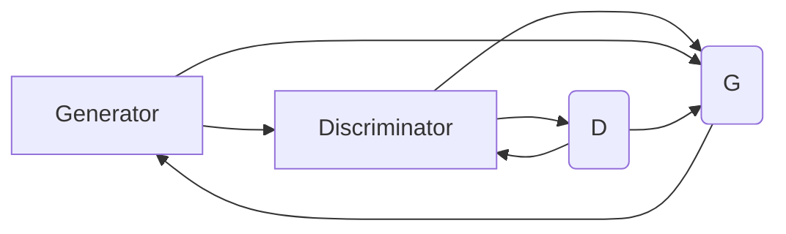

                 

## 1. 背景介绍

生成对抗网络（Generative Adversarial Networks，简称GANs）作为深度学习领域的一个里程碑，自提出以来就以其强大的生成能力、创新的训练机制和广泛的应用前景受到了广泛的关注。GANs通过训练两个相互竞争的神经网络——生成器和判别器，不断优化彼此，最终生成出逼真的样本，从而实现了从噪声数据生成高保真图像、音频、文本等多种类型的任务。

### 1.1 问题由来

GANs的提出背景源于深度学习在生成任务中的不足。传统的生成模型，如自编码器（Autoencoder），在生成过程中存在固有的信息瓶颈，难以保留输入数据的全局信息。GANs通过引入对抗机制，使得生成器和判别器在博弈过程中不断进步，从而逐步生成更加逼真的样本。

GANs能够生成高质量样本，已在图像生成、音频生成、视频生成等领域取得突破性进展。例如，DCGAN在图像生成中的表现卓越，StarGAN实现了多域图像转换，CycleGAN解决了域适应问题，ALI提升了图像质量和风格变换的灵活性。

### 1.2 问题核心关键点

GANs的核心在于通过一个生成器（Generator）和一个判别器（Discriminator）两个网络之间的对抗博弈，不断提升生成器的生成能力，同时判别器不断提升对真实样本的识别能力。GANs的目标是使生成器生成的样本与真实样本无法区分，即满足如下条件：

$$
D(\mathbf{G}_\theta(\mathbf{z})) \to 1 \text{ and } D(\mathbf{G}_\theta(\mathbf{z})) \to 0
$$

其中，$D(\cdot)$ 表示判别器的输出，$\mathbf{G}_\theta(\mathbf{z})$ 表示生成器生成的样本。

GANs的训练过程可以简单描述为以下步骤：

1. 初始化生成器和判别器网络。
2. 随机采样一个噪声向量 $\mathbf{z}$，使用生成器生成样本 $\mathbf{x} = \mathbf{G}_\theta(\mathbf{z})$。
3. 将生成的样本 $\mathbf{x}$ 和真实样本 $\mathbf{x}_{\text{real}}$ 输入判别器，得到判别器对样本的判断结果。
4. 根据判断结果更新生成器和判别器的权重。
5. 重复上述步骤，直至满足预设的停止条件。

GANs的训练是一个不断博弈的过程，生成器试图欺骗判别器，而判别器则努力识别真实样本。随着训练的进行，生成器的生成能力不断提升，判别器的判断能力也不断增强。

### 1.3 问题研究意义

GANs作为一种创新的深度学习技术，正在引领人工智能研究的新方向。其强大的生成能力为各种创造性任务提供了可能，如图像合成、语音合成、文本生成等。同时，GANs也带来了许多新的研究和应用机会，如数据增强、生成对抗博弈、对抗样本生成等。

此外，GANs还展示了深度学习模型的潜在危险性，即“对抗样本”问题。这使得研究者开始重视对抗样本防御和生成对抗样本的生成技术。

## 2. 核心概念与联系

### 2.1 核心概念概述

为更好地理解GANs，下面将介绍几个关键概念：

- 生成器（Generator）：GANs中的第一个网络，用于生成与输入噪声向量 $\mathbf{z}$ 相对应的样本 $\mathbf{x} = \mathbf{G}_\theta(\mathbf{z})$。生成器通常由多层神经网络构成，通过学习噪声数据与样本之间的关系，生成逼真的样本。

- 判别器（Discriminator）：GANs中的第二个网络，用于判断输入样本 $\mathbf{x}$ 是真实样本还是生成样本。判别器同样由多层神经网络构成，其输出通常是一个概率值，表示样本为真实样本的概率。

- 对抗损失（Adversarial Loss）：用于训练生成器和判别器的联合损失函数。生成器和判别器分别通过对抗损失函数进行训练，以提升各自的性能。

- 噪声向量（Noise Vector）：在生成器中，用于输入的随机向量，通常表示为 $\mathbf{z}$，在实际应用中可以使用随机数生成器或神经网络生成。

这些概念构成了GANs的基本框架，通过生成器和判别器的不断博弈，实现高质量样本的生成。

### 2.2 核心概念原理和架构的 Mermaid 流程图



这个流程图描述了GANs的基本架构：生成器生成样本，判别器判断样本的真实性，并通过判别器的反馈更新生成器，通过生成器的反馈更新判别器。

## 3. 核心算法原理 & 具体操作步骤
### 3.1 算法原理概述

GANs的训练过程通过对抗损失函数进行优化，使得生成器和判别器不断提升自身的性能。具体的训练流程如下：

1. 随机采样噪声向量 $\mathbf{z}$，使用生成器生成样本 $\mathbf{x} = \mathbf{G}_\theta(\mathbf{z})$。
2. 将生成的样本 $\mathbf{x}$ 和真实样本 $\mathbf{x}_{\text{real}}$ 输入判别器，得到判别器对样本的判断结果。
3. 计算判别器的损失函数 $L_D$ 和生成器的损失函数 $L_G$，分别更新判别器和生成器的参数。
4. 重复上述步骤，直至满足预设的停止条件。

生成器和判别器的对抗过程是GANs训练的核心，其中判别器试图区分真实样本和生成样本，而生成器则试图欺骗判别器，生成逼真的样本。

### 3.2 算法步骤详解

具体的GANs训练步骤如下：

1. 初始化生成器和判别器网络。
2. 固定判别器参数，使用生成器生成样本 $\mathbf{x} = \mathbf{G}_\theta(\mathbf{z})$。
3. 将生成的样本 $\mathbf{x}$ 和真实样本 $\mathbf{x}_{\text{real}}$ 输入判别器，得到判别器对样本的判断结果。
4. 计算判别器的损失函数 $L_D$ 和生成器的损失函数 $L_G$。
5. 根据损失函数更新生成器和判别器的参数。
6. 重复上述步骤，直至满足预设的停止条件。

### 3.3 算法优缺点

GANs作为一种创新的深度学习技术，具有以下优点：

- 生成高质量样本。通过对抗训练机制，GANs能够生成逼真度极高的高质量样本。
- 可扩展性强。GANs可以生成多种类型的样本，如图像、音频、文本等。
- 训练效率高。GANs在训练过程中，生成器和判别器可以并行训练，加速收敛。

同时，GANs也存在一些缺点：

- 训练不稳定。GANs的训练过程往往需要大量的样本和精细的调参，且容易陷入局部最优解。
- 生成样本质量难以控制。生成器生成的样本可能存在模糊、重叠等问题。
- 对抗样本生成。GANs生成的样本可能具有对抗性，容易受到对抗样本攻击。

### 3.4 算法应用领域

GANs的应用领域非常广泛，涵盖了图像生成、音频生成、视频生成、文本生成等多个方面。

- 图像生成：GANs可以生成逼真的图像，如GANs、DCGAN等。
- 音频生成：GANs可以生成逼真的音频，如WaveGAN、VQ-GAN等。
- 视频生成：GANs可以生成逼真的视频，如VideoGAN、V-GAN等。
- 文本生成：GANs可以生成自然流畅的文本，如TextGAN、GPT-2等。

此外，GANs还被应用于游戏生成、医学影像生成、模拟数据生成等领域，展示了其在各种任务中的强大能力。

## 4. 数学模型和公式 & 详细讲解 & 举例说明

### 4.1 数学模型构建

GANs的训练过程可以通过以下数学模型来描述：

假设生成器的输入为噪声向量 $\mathbf{z} \sim \mathcal{N}(0, 1)$，生成器的输出为样本 $\mathbf{x} = \mathbf{G}_\theta(\mathbf{z})$，判别器的输入为样本 $\mathbf{x}$，输出为真实性概率 $y \in [0, 1]$。

GANs的对抗损失函数由判别器的损失函数和生成器的损失函数组成：

$$
\mathcal{L}_{\text{GAN}} = \mathbb{E}_{x \sim \mathcal{D}} [\log D(x)] + \mathbb{E}_{z \sim \mathcal{N}(0, 1)} [\log (1 - D(G(z)))]
$$

其中，$\mathcal{D}$ 表示真实样本的分布。

### 4.2 公式推导过程

以下是GANs中两个重要的损失函数的推导过程：

- 判别器的损失函数：

$$
L_D(D) = -\frac{1}{m} \sum_{i=1}^m \log D(x^{(i)})
$$

其中，$x^{(i)}$ 表示真实样本。

- 生成器的损失函数：

$$
L_G(G) = -\frac{1}{m} \sum_{i=1}^m \log (1 - D(G(z^{(i)})))
$$

其中，$z^{(i)}$ 表示噪声向量。

判别器的损失函数旨在最大化判别器区分真实样本和生成样本的能力，生成器的损失函数旨在最大化生成器欺骗判别器，生成高质量样本的能力。

### 4.3 案例分析与讲解

以下以DCGAN为例，介绍GANs在图像生成中的应用。

DCGAN是GANs的一个变体，其生成器使用卷积神经网络（CNN），判别器同样使用CNN，并通过对抗训练机制生成逼真的图像。DCGAN的训练过程如下：

1. 随机采样噪声向量 $\mathbf{z}$，使用生成器生成样本 $\mathbf{x} = \mathbf{G}_\theta(\mathbf{z})$。
2. 将生成的样本 $\mathbf{x}$ 输入判别器，得到判别器对样本的判断结果。
3. 计算判别器的损失函数 $L_D$ 和生成器的损失函数 $L_G$，分别更新判别器和生成器的参数。
4. 重复上述步骤，直至满足预设的停止条件。

## 5. 项目实践：代码实例和详细解释说明
### 5.1 开发环境搭建

为了进行GANs的开发，我们需要准备好开发环境。以下是使用Python进行PyTorch开发的环境配置流程：

1. 安装Anaconda：从官网下载并安装Anaconda，用于创建独立的Python环境。

2. 创建并激活虚拟环境：
```bash
conda create -n gan-env python=3.8 
conda activate gan-env
```

3. 安装PyTorch：根据CUDA版本，从官网获取对应的安装命令。例如：
```bash
conda install pytorch torchvision torchaudio cudatoolkit=11.1 -c pytorch -c conda-forge
```

4. 安装GAN相关库：
```bash
pip install torchvision dlib imageio scipy opencv-python
```

5. 安装NVIDIA驱动和CUDA工具包：
```bash
conda install nvidia-cuda-11.1
```

6. 安装Tensorboard：
```bash
pip install tensorboard
```

完成上述步骤后，即可在`gan-env`环境中开始GANs的实践。

### 5.2 源代码详细实现

以下是使用PyTorch实现GANs的代码：

```python
import torch
import torch.nn as nn
import torch.optim as optim
import torchvision
import torchvision.transforms as transforms
import torchvision.datasets as datasets
from torch.utils.data import DataLoader
import matplotlib.pyplot as plt
import numpy as np

# 定义生成器网络
class Generator(nn.Module):
    def __init__(self):
        super(Generator, self).__init__()
        self.main = nn.Sequential(
            nn.ConvTranspose2d(100, 256, 4, 1, 0, bias=False),
            nn.BatchNorm2d(256),
            nn.ReLU(True),
            nn.ConvTranspose2d(256, 128, 4, 2, 1, bias=False),
            nn.BatchNorm2d(128),
            nn.ReLU(True),
            nn.ConvTranspose2d(128, 64, 4, 2, 1, bias=False),
            nn.BatchNorm2d(64),
            nn.ReLU(True),
            nn.ConvTranspose2d(64, 3, 4, 2, 1, bias=False),
            nn.Tanh()
        )

    def forward(self, input):
        return self.main(input)

# 定义判别器网络
class Discriminator(nn.Module):
    def __init__(self):
        super(Discriminator, self).__init__()
        self.main = nn.Sequential(
            nn.Conv2d(3, 64, 4, 2, 1, bias=False),
            nn.LeakyReLU(0.2, inplace=True),
            nn.Conv2d(64, 128, 4, 2, 1, bias=False),
            nn.BatchNorm2d(128),
            nn.LeakyReLU(0.2, inplace=True),
            nn.Conv2d(128, 256, 4, 2, 1, bias=False),
            nn.BatchNorm2d(256),
            nn.LeakyReLU(0.2, inplace=True),
            nn.Conv2d(256, 1, 4, 1, 0, bias=False),
            nn.Sigmoid()
        )

    def forward(self, input):
        return self.main(input)

# 定义GAN模型
class GAN(nn.Module):
    def __init__(self, generator, discriminator):
        super(GAN, self).__init__()
        self.generator = generator
        self.discriminator = discriminator

    def forward(self, input):
        fake = self.generator(input)
        real = self.discriminator(input)
        return fake, real

# 定义损失函数
criterion = nn.BCELoss()

# 定义生成器优化器
optimizer_G = optim.Adam(generator.parameters(), lr=0.0002)

# 定义判别器优化器
optimizer_D = optim.Adam(discriminator.parameters(), lr=0.0002)

# 定义训练函数
def train(GAN, train_loader, n_epochs):
    for epoch in range(n_epochs):
        for i, (batch_x, _) in enumerate(train_loader):
            # 固定判别器，更新生成器
            optimizer_G.zero_grad()
            b_real = batch_x
            b_fake = GAN(torch.randn(batch_size, 100)).detach()

            # 计算生成器的损失函数
            fake_loss = criterion(Discriminator(b_fake), torch.ones(batch_size, 1))
            real_loss = criterion(Discriminator(b_real), torch.zeros(batch_size, 1))
            generator_loss = fake_loss + real_loss
            generator_loss.backward()
            optimizer_G.step()

            # 固定生成器，更新判别器
            optimizer_D.zero_grad()
            fake_loss = criterion(Discriminator(b_fake), torch.zeros(batch_size, 1))
            real_loss = criterion(Discriminator(b_real), torch.ones(batch_size, 1))
            discriminator_loss = fake_loss + real_loss
            discriminator_loss.backward()
            optimizer_D.step()

            # 打印训练日志
            print(f"Epoch {epoch+1}, Batch {i+1}/{len(train_loader)}, Generator Loss: {generator_loss.item()}, Discriminator Loss: {discriminator_loss.item()}")

# 加载数据集
transform = transforms.Compose([
    transforms.Resize(64),
    transforms.ToTensor(),
    transforms.Normalize((0.5, 0.5, 0.5), (0.5, 0.5, 0.5))
])
train_data = datasets.MNIST(root='./data', train=True, transform=transform, download=True)
train_loader = DataLoader(train_data, batch_size=64, shuffle=True)

# 实例化生成器和判别器
generator = Generator()
discriminator = Discriminator()
GAN = GAN(generator, discriminator)

# 训练GAN
n_epochs = 200
train(GAN, train_loader, n_epochs)

# 生成并显示样本
z = torch.randn(64, 100)
fake = generator(z)
plt.imshow(torchvision.utils.make_grid(fake, ncols=8).numpy().transpose(1, 2, 0))
plt.show()
```

### 5.3 代码解读与分析

让我们再详细解读一下关键代码的实现细节：

**GAN模型类**：
- `Generator`类：定义生成器网络，使用多层卷积转置神经网络，通过对抗训练生成逼真的图像。
- `Discriminator`类：定义判别器网络，同样使用多层卷积神经网络，判断输入样本是否为真实样本。
- `GAN`类：定义GAN模型，包含生成器和判别器。

**损失函数和优化器**：
- `criterion`函数：定义二元交叉熵损失函数，用于计算生成器和判别器的损失。
- `optimizer_G`和`optimizer_D`：定义生成器和判别器的优化器，使用Adam优化算法。

**训练函数**：
- `train`函数：定义训练函数，包含生成器和判别器的更新过程。

**数据集加载**：
- `transforms.Compose`函数：定义数据预处理步骤，包括图像缩放、归一化等。
- `train_data`和`train_loader`：定义数据集和数据加载器，使用MNIST数据集。

以上代码展示了GANs的基本实现流程。生成器和判别器的训练过程通过对抗损失函数进行优化，生成器试图欺骗判别器，生成高质量样本，而判别器则不断提升对样本真实性的判断能力。

## 6. 实际应用场景
### 6.1 智能图像生成

GANs在图像生成方面取得了显著的进展，可以生成高质量、逼真的图像。GANs广泛应用于游戏、影视、广告等领域，通过生成逼真的图像，提升了用户体验和视觉冲击力。

例如，在影视制作中，GANs可以生成逼真的背景、特效等，大幅降低制作成本。在游戏开发中，GANs可以生成逼真的角色、场景等，提升游戏体验。

### 6.2 医学影像生成

GANs可以生成逼真的医学影像，辅助医生诊断和治疗。例如，GANs可以生成CT、MRI等医学影像，帮助医生进行病变检测、手术规划等任务。

医学影像生成的过程通常包括以下几个步骤：

1. 收集医学影像数据。
2. 将医学影像标注数据划分为训练集和测试集。
3. 使用GANs对医学影像进行生成。
4. 在测试集上评估生成的医学影像质量。
5. 将生成的医学影像应用于实际医疗任务。

通过GANs生成的医学影像，可以提升诊断和治疗的准确性和效率。

### 6.3 艺术创作

GANs可以生成逼真的艺术作品，如绘画、音乐等。GANs在艺术创作中的应用，主要通过生成逼真的艺术作品，激发创作者的灵感和创意，提高艺术创作的效率和质量。

例如，GANs可以生成逼真的画作，帮助艺术家进行创作灵感的发掘。GANs也可以生成逼真的音乐，帮助音乐家进行旋律和和声的创作。

### 6.4 未来应用展望

随着GANs技术的不断进步，其在生成领域的应用将更加广泛和深入。未来，GANs可能的应用场景包括：

1. 大规模图像生成：GANs可以生成大规模图像，如卫星图像、地形图等，应用于地理信息系统、城市规划等领域。
2. 高保真音频生成：GANs可以生成高保真音频，应用于电影配乐、音乐制作等领域。
3. 实时生成视频：GANs可以实时生成视频，应用于虚拟现实、增强现实等领域。
4. 文本生成和情感生成：GANs可以生成自然流畅的文本，应用于自动写作、情感分析等领域。
5. 个性化推荐：GANs可以生成个性化的推荐内容，应用于电商、新闻、视频等领域。

此外，GANs在科学计算、模拟仿真等领域的应用也将不断拓展。未来，随着GANs技术的不断成熟，其在各个领域的应用将更加广泛和深入，为人类带来更多创造力和便利。

## 7. 工具和资源推荐
### 7.1 学习资源推荐

为了帮助开发者系统掌握GANs的理论基础和实践技巧，这里推荐一些优质的学习资源：

1. 《Generative Adversarial Networks: Training GANs with Custom Loss Functions》系列博文：由大模型技术专家撰写，深入浅出地介绍了GANs的基本原理、训练方法和应用场景。

2. 《Generative Adversarial Networks with PyTorch》书籍：详细介绍了如何使用PyTorch实现GANs，涵盖了GANs的原理、实现细节和应用案例。

3. CS229《机器学习》课程：斯坦福大学开设的经典机器学习课程，系统介绍了GANs的基本概念和训练方法。

4. 《The Elements of AI》教材：芬兰国家教育委员会推出的免费教材，详细介绍了GANs的基本原理和应用案例，适合初学者入门。

5. 《Deep Learning with PyTorch》书籍：全面介绍了如何使用PyTorch实现深度学习模型，包括GANs在内。

通过学习这些资源，相信你一定能够系统掌握GANs的基本原理和应用方法，快速上手实践。

### 7.2 开发工具推荐

高效的开发离不开优秀的工具支持。以下是几款用于GANs开发的常用工具：

1. PyTorch：基于Python的开源深度学习框架，灵活动态的计算图，适合快速迭代研究。

2. TensorFlow：由Google主导开发的开源深度学习框架，生产部署方便，适合大规模工程应用。

3. Keras：基于TensorFlow的高层API，易于上手，适合快速原型开发。

4. OpenCV：开源计算机视觉库，提供了丰富的图像处理函数和算法。

5. Scikit-image：开源图像处理库，提供了许多基本的图像处理函数和算法。

6. Tensorboard：TensorFlow配套的可视化工具，可实时监测模型训练状态，并提供丰富的图表呈现方式。

合理利用这些工具，可以显著提升GANs开发的效率，加快创新迭代的步伐。

### 7.3 相关论文推荐

GANs作为一种创新的深度学习技术，吸引了众多学者的关注和研究。以下是几篇奠基性的相关论文，推荐阅读：

1. Generative Adversarial Nets：Ian Goodfellow等人的经典论文，详细介绍了GANs的基本原理和训练方法。

2. Progressive Growing of GANs for Improved Quality, Stability, and Variation：在GANs训练中，存在模式崩溃问题，该论文提出了一种渐进式训练方法，提高了GANs的稳定性和生成质量。

3. Wasserstein GAN：提出了WGAN，通过Wasserstein距离来优化GANs的训练，提升了GANs的生成质量。

4. CondGAN：提出了条件GANs，通过引入条件变量，生成具有特定特征的样本，提升了GANs的应用范围。

5. StarGAN：提出了StarGAN，通过生成多域样本，实现了多域图像转换，提升了GANs的多样性。

这些论文代表了大模型研究领域的前沿进展，通过学习这些论文，可以帮助研究者了解GANs的最新发展动态。

## 8. 总结：未来发展趋势与挑战

### 8.1 研究成果总结

GANs作为一种创新的深度学习技术，自提出以来就以其强大的生成能力、创新的训练机制和广泛的应用前景受到了广泛的关注。在图像生成、音频生成、视频生成、文本生成等领域，GANs已经取得了突破性进展，展示了其在生成任务中的强大能力。

### 8.2 未来发展趋势

展望未来，GANs将在以下几个方面继续发展：

1. 生成质量提升：通过改进训练机制和网络结构，进一步提升GANs的生成质量，减少生成样本的模糊、重叠等问题。

2. 模型稳定化：通过引入更加复杂的对抗机制和正则化技术，提高GANs的训练稳定性，减少训练过程中的模式崩溃等问题。

3. 数据多样化：通过引入多样化的数据源和预处理技术，提高GANs的生成多样性，减少生成样本的单一性和重复性。

4. 实时生成：通过优化模型结构和训练算法，实现实时生成，满足高实时性应用的需求。

5. 应用拓展：GANs在生成任务中的应用将不断拓展，从图像、音频、视频等领域，扩展到自然语言处理、音乐创作等领域。

### 8.3 面临的挑战

尽管GANs已经取得了显著进展，但在迈向更加智能化、普适化应用的过程中，仍然面临诸多挑战：

1. 训练不稳定：GANs的训练过程往往需要大量的样本和精细的调参，且容易陷入局部最优解。

2. 生成样本质量难以控制：生成器生成的样本可能存在模糊、重叠等问题，难以满足实际需求。

3. 对抗样本生成：GANs生成的样本可能具有对抗性，容易受到对抗样本攻击，带来安全隐患。

4. 应用限制：GANs在实际应用中仍存在一些限制，如生成样本的多样性和实时性等问题，需要进一步优化和改进。

5. 可解释性不足：GANs的生成过程缺乏可解释性，难以对其内部工作机制和决策逻辑进行分析和调试。

### 8.4 研究展望

未来的GANs研究将集中在以下几个方面：

1. 生成对抗博弈：通过引入更加复杂的博弈机制和目标函数，提高GANs的生成质量和稳定性。

2. 模型压缩与优化：通过模型压缩和优化技术，减少GANs的计算和存储开销，实现高效、实时的生成。

3. 跨领域应用：将GANs应用于跨领域生成任务，如多模态生成、跨域生成等，拓展GANs的应用范围。

4. 可解释性研究：通过引入可解释性技术，增强GANs的生成过程的透明性和可解释性，提高模型的可信度。

5. 伦理和安全研究：从伦理和安全的角度出发，研究GANs的生成内容，避免生成有害、有害的信息，确保模型的安全性。

总之，GANs作为一种创新的深度学习技术，未来在生成任务中仍有很大的发展空间，需要研究者不断探索和突破，才能充分发挥其在实际应用中的潜力。

## 9. 附录：常见问题与解答

**Q1：GANs在生成任务中的优势是什么？**

A: GANs在生成任务中的优势主要体现在以下几个方面：

1. 生成高质量样本：GANs通过对抗训练机制，可以生成高质量、逼真的样本，如图像、音频、文本等。

2. 生成多样性：GANs可以生成多样化的样本，满足不同用户的需求。

3. 实时生成：GANs可以实时生成样本，满足高实时性应用的需求。

4. 生成控制：通过引入条件变量，GANs可以生成具有特定特征的样本，满足特定的应用需求。

**Q2：GANs在训练过程中需要注意哪些问题？**

A: GANs在训练过程中需要注意以下几个问题：

1. 训练不稳定：GANs的训练过程往往需要大量的样本和精细的调参，且容易陷入局部最优解。

2. 生成样本质量难以控制：生成器生成的样本可能存在模糊、重叠等问题，难以满足实际需求。

3. 对抗样本生成：GANs生成的样本可能具有对抗性，容易受到对抗样本攻击，带来安全隐患。

4. 应用限制：GANs在实际应用中仍存在一些限制，如生成样本的多样性和实时性等问题，需要进一步优化和改进。

5. 可解释性不足：GANs的生成过程缺乏可解释性，难以对其内部工作机制和决策逻辑进行分析和调试。

**Q3：GANs在图像生成中的应用有哪些？**

A: GANs在图像生成中的应用非常广泛，主要包括：

1. 超分辨率：通过GANs生成高分辨率的图像，提升图像质量。

2. 图像修复：通过GANs修复损坏的图像，恢复图像细节。

3. 风格转换：通过GANs将一张图像的风格转换成另一种风格，增强艺术效果。

4. 图像生成：通过GANs生成逼真的图像，应用于游戏、影视、广告等领域。

**Q4：GANs在实际应用中需要考虑哪些问题？**

A: GANs在实际应用中需要考虑以下几个问题：

1. 数据集质量：GANs的训练过程对数据集的质量要求较高，需要准备高质量的数据集。

2. 训练时间：GANs的训练过程需要大量的计算资源和时间，需要考虑训练成本。

3. 应用场景：GANs在实际应用中需要考虑场景的特殊需求，如实时性、多样性等。

4. 安全性：GANs生成的样本可能存在对抗性，需要考虑安全性问题。

5. 伦理问题：GANs在生成内容时，需要考虑伦理问题，避免生成有害、有害的信息。

总之，GANs在实际应用中需要综合考虑多个因素，才能充分发挥其在生成任务中的潜力。

---

作者：禅与计算机程序设计艺术 / Zen and the Art of Computer Programming

