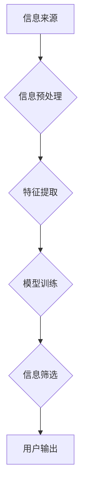

                 

## 信息过载与信息筛选技术：在信息洪流中找到有价值的信息

> 关键词：信息过载、信息筛选、机器学习、自然语言处理、推荐系统、知识图谱、深度学习、信息检索

### 1. 背景介绍

在当今数字时代，信息爆炸式增长，我们每天接触的海量数据呈指数级上升。从社交媒体的动态到新闻网站的报道，从学术论文到商业报告，信息无处不在，却并非全部都具有价值。这种信息过载现象给个人和组织带来了巨大的挑战，如何有效地筛选出有价值的信息，成为了当今社会亟需解决的关键问题。

信息过载带来的负面影响不容忽视：

* **效率低下:**  在海量信息中寻找所需信息需要花费大量时间和精力，降低了工作效率和学习效率。
* **决策困难:**  过多的信息可能导致信息茧房效应，限制了视野，难以做出明智的决策。
* **认知疲劳:**  持续处理大量信息会导致认知疲劳，影响注意力和记忆力。
* **知识沉淀困难:**  难以有效地整理和存储信息，导致知识积累缓慢，难以形成知识体系。

### 2. 核心概念与联系

信息筛选技术旨在帮助我们从海量信息中提取有价值的信息，并将其呈现给用户以易于理解的方式。它涉及到多个核心概念和技术，包括：

* **信息检索:**  利用关键词、语法规则等方法，从数据库或网络中搜索特定信息。
* **自然语言处理 (NLP):**  使计算机能够理解、分析和生成人类语言，用于信息提取、文本分类、情感分析等任务。
* **机器学习 (ML):**  利用算法从数据中学习模式，用于信息分类、推荐系统等应用。
* **深度学习 (DL):**  一种更高级的机器学习方法，利用多层神经网络模拟人类大脑的学习过程，能够处理更复杂的信息。
* **知识图谱 (KG):**  一种结构化的知识表示形式，将实体和关系以图的形式表示，用于知识推理、信息关联等任务。

这些技术相互关联，共同构成了信息筛选技术体系。

**Mermaid 流程图:**



### 3. 核心算法原理 & 具体操作步骤

#### 3.1 算法原理概述

信息筛选算法的核心是根据用户需求和信息特征，对信息进行排序和分类，从而筛选出最相关的和有价值的信息。常用的算法包括：

* **TF-IDF:**  基于词频和逆向文档频率的算法，用于衡量词语在文档中的重要性。
* **PageRank:**  基于网页链接结构的算法，用于衡量网页的重要性。
* **协同过滤:**  基于用户行为和物品相似性的算法，用于推荐用户可能感兴趣的物品。
* **深度学习模型:**  例如BERT、GPT等，能够学习更复杂的语义关系，提高信息筛选的准确性。

#### 3.2 算法步骤详解

以TF-IDF算法为例，其具体操作步骤如下：

1. **文本预处理:**  去除停用词、标点符号等无用信息，并将文本转换为词袋模型。
2. **计算词频 (TF):**  统计每个词语在文档中出现的频率。
3. **计算逆向文档频率 (IDF):**  计算每个词语在整个语料库中出现的频率，IDF值越高，表示该词语越独特。
4. **计算TF-IDF值:**  将TF值和IDF值相乘，得到每个词语在文档中的权重。
5. **排序和筛选:**  根据词语的TF-IDF值对文档进行排序，选择TF-IDF值最高的文档作为结果。

#### 3.3 算法优缺点

**优点:**

* 算法简单易实现。
* 能够有效地衡量词语在文档中的重要性。

**缺点:**

* 无法捕捉词语之间的语义关系。
* 对文本语义理解能力有限。

#### 3.4 算法应用领域

TF-IDF算法广泛应用于信息检索、文本分类、推荐系统等领域。

### 4. 数学模型和公式 & 详细讲解 & 举例说明

#### 4.1 数学模型构建

TF-IDF算法的核心是计算每个词语在文档中的权重。其数学模型如下：

* **词频 (TF):**  

$$TF(t,d) = \frac{f(t,d)}{ \sum_{t' \in d} f(t',d)}$$

其中：

* $t$ 表示词语
* $d$ 表示文档
* $f(t,d)$ 表示词语 $t$ 在文档 $d$ 中出现的频率

* **逆向文档频率 (IDF):**

$$IDF(t) = log_e \frac{N}{df(t)}$$

其中：

* $N$ 表示语料库中文档总数
* $df(t)$ 表示词语 $t$ 在语料库中出现的文档数

* **TF-IDF值:**

$$TF-IDF(t,d) = TF(t,d) * IDF(t)$$

#### 4.2 公式推导过程

* **词频 (TF):**  词频衡量了词语在文档中出现的频率，频率越高，表示该词语在该文档中越重要。
* **逆向文档频率 (IDF):**  IDF衡量了词语在整个语料库中的稀有程度，稀有度越高，表示该词语越独特，在区分文档时越有价值。
* **TF-IDF值:**  TF-IDF值将词频和逆向文档频率相结合，综合考虑了词语在文档和语料库中的重要性。

#### 4.3 案例分析与讲解

假设我们有一个语料库包含1000篇文档，其中包含以下词语：

* "计算机"
* "编程"
* "人工智能"

如果一个文档包含以下内容：

"计算机科学是一门研究计算机的学科，编程是计算机科学的核心内容，人工智能是计算机科学的未来发展方向。"

我们可以计算每个词语的TF-IDF值：

* **计算机:**  TF(计算机, 文档) = 2/5, IDF(计算机) = log_e(1000/500) = 0.693, TF-IDF(计算机, 文档) = 1.386
* **编程:**  TF(编程, 文档) = 1/5, IDF(编程) = log_e(1000/200) = 1.099, TF-IDF(编程, 文档) = 1.099
* **人工智能:**  TF(人工智能, 文档) = 1/5, IDF(人工智能) = log_e(1000/100) = 2.303, TF-IDF(人工智能, 文档) = 2.303

根据TF-IDF值，我们可以判断"人工智能"在该文档中最为重要。

### 5. 项目实践：代码实例和详细解释说明

#### 5.1 开发环境搭建

* Python 3.x
* scikit-learn
* NLTK

#### 5.2 源代码详细实现

```python
from sklearn.feature_extraction.text import TfidfVectorizer

# 文档集合
documents = [
    "计算机科学是一门研究计算机的学科",
    "编程是计算机科学的核心内容",
    "人工智能是计算机科学的未来发展方向"
]

# 创建TF-IDF向量化器
vectorizer = TfidfVectorizer()

# 将文档转换为TF-IDF矩阵
tfidf_matrix = vectorizer.fit_transform(documents)

# 打印TF-IDF矩阵
print(tfidf_matrix.toarray())
```

#### 5.3 代码解读与分析

* `TfidfVectorizer()` 创建TF-IDF向量化器对象。
* `fit_transform()` 方法将文档集合转换为TF-IDF矩阵。
* `toarray()` 方法将TF-IDF矩阵转换为NumPy数组，方便打印和分析。

#### 5.4 运行结果展示

运行以上代码，将输出一个TF-IDF矩阵，其中每个元素代表一个词语在每个文档中的权重。

### 6. 实际应用场景

信息筛选技术广泛应用于以下场景：

* **搜索引擎:**  Google、Bing等搜索引擎利用信息筛选技术，从海量网页中找到与用户搜索词语相关的网页。
* **推荐系统:**  Netflix、Amazon等平台利用信息筛选技术，推荐用户可能感兴趣的电影、商品等。
* **新闻聚合:**  新闻聚合平台利用信息筛选技术，从多个新闻源中筛选出用户感兴趣的新闻。
* **社交媒体:**  社交媒体平台利用信息筛选技术，推荐用户可能感兴趣的内容，过滤掉垃圾信息和广告。

### 6.4 未来应用展望

随着人工智能技术的不断发展，信息筛选技术将更加智能化和个性化。未来，信息筛选技术可能应用于以下领域：

* **医疗诊断:**  利用信息筛选技术，从海量医疗数据中筛选出与患者症状相关的疾病信息，辅助医生进行诊断。
* **金融风险控制:**  利用信息筛选技术，从海量金融数据中识别潜在的风险，帮助金融机构进行风险控制。
* **教育个性化:**  利用信息筛选技术，根据学生的学习情况和兴趣爱好，推荐个性化的学习内容。

### 7. 工具和资源推荐

#### 7.1 学习资源推荐

* **书籍:**
    * "Information Retrieval: Implementing and Evaluating Search Engines" by Manning, Raghavan, and Schütze
    * "Natural Language Processing with Python" by Bird, Klein, and Loper
* **在线课程:**
    * Coursera: "Natural Language Processing Specialization"
    * edX: "Machine Learning"

#### 7.2 开发工具推荐

* **Python:**  Python是一种流行的编程语言，广泛用于机器学习和自然语言处理。
* **scikit-learn:**  scikit-learn是一个用于机器学习的Python库，包含了多种信息筛选算法。
* **NLTK:**  NLTK是一个用于自然语言处理的Python库，提供了丰富的文本处理工具。

#### 7.3 相关论文推荐

* "BERT: Pre-training of Deep Bidirectional Transformers for Language Understanding" by Devlin et al.
* "Attention Is All You Need" by Vaswani et al.
* "A Survey of Text Classification Methods" by Pang and Lee

### 8. 总结：未来发展趋势与挑战

#### 8.1 研究成果总结

信息筛选技术取得了显著的进展，能够有效地从海量信息中提取有价值的信息。

#### 8.2 未来发展趋势

* **更智能的信息筛选:**  利用深度学习等先进算法，提高信息筛选的准确性和智能化程度。
* **更个性化的信息筛选:**  根据用户的兴趣爱好和需求，提供个性化的信息筛选服务。
* **跨模态信息筛选:**  融合文本、图像、音频等多种数据类型，实现更全面的信息筛选。

#### 8.3 面临的挑战

* **数据质量问题:**  信息筛选算法的性能依赖于数据质量，海量数据的清洗和预处理是一个挑战。
* **算法解释性问题:**  深度学习模型的决策过程难以解释，如何提高算法的透明度和可解释性是一个挑战。
* **信息伦理问题:**  信息筛选技术可能导致信息茧房效应和算法偏见，如何确保信息筛选的公平性和伦理性是一个挑战。

#### 8.4 研究展望

未来，信息筛选技术将继续朝着更智能、更个性化、更跨模态的方向发展，为我们提供更便捷、更有效的获取信息的方式。


### 9. 附录：常见问题与解答

**Q1: TF-IDF算法的局限性是什么？**

**A1:** TF-IDF算法无法捕捉词语之间的语义关系，对文本语义理解能力有限。

**Q2: 如何提高信息筛选的准确性？**

**A2:** 可以尝试使用更先进的算法，例如深度学习模型，并进行更细致的数据清洗和预处理。

**Q3: 信息筛选技术可能带来的伦理问题是什么？**

**A3:** 信息筛选技术可能导致信息茧房效应和算法偏见，需要关注信息的多样性和公平性。


作者：禅与计算机程序设计艺术 / Zen and the Art of Computer Programming 
<end_of_turn>

