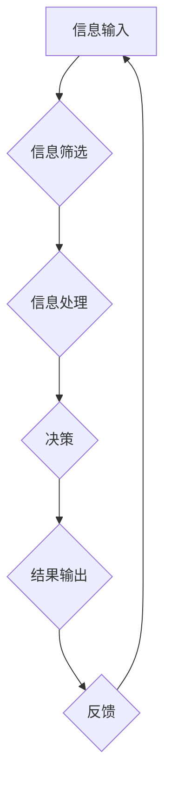

                 

## 信息过载与决策疲劳：如何简化选择以提高生活质量

> 关键词：信息过载、决策疲劳、算法优化、信息筛选、认知负荷、人工智能、生活质量

## 1. 背景介绍

在当今信息爆炸的时代，我们每天都被海量的信息包围。从新闻推送到社交媒体，从电子邮件到广告，信息无处不在，无时不刻地冲击着我们的感官和认知。然而，并非所有信息都是有价值的，很多信息都是重复、冗余、甚至错误的。这种信息过载导致我们难以集中注意力，难以做出明智的决策，最终影响着我们的生活质量。

决策疲劳是指在面对过多的选择时，我们感到精疲力尽，难以做出最佳选择。这种疲劳不仅体现在我们的工作和学习中，也影响着我们的日常生活，例如选择餐厅、购买商品、安排行程等等。决策疲劳会让我们感到焦虑、沮丧，甚至产生逃避心理，最终导致我们无法有效地管理自己的时间和精力。

## 2. 核心概念与联系

信息过载和决策疲劳是相互关联的两个问题。信息过载是决策疲劳的根源，而决策疲劳则是信息过载的直接后果。

**信息过载**是指我们接收的信息量超过了我们的处理能力，导致我们难以有效地理解、记忆和利用这些信息。

**决策疲劳**是指在面对过多的选择时，我们感到精疲力尽，难以做出最佳选择。

**Mermaid 流程图：**



## 3. 核心算法原理 & 具体操作步骤

为了应对信息过载和决策疲劳，我们可以利用一些算法和技术来简化选择，提高生活质量。

### 3.1  算法原理概述

**信息过滤算法**

信息过滤算法的核心目的是从海量信息中筛选出与用户需求相关的关键信息，减少用户的认知负荷。常见的算法包括：

* **关键词匹配:** 根据用户指定的关键词，从信息中提取包含这些关键词的内容。
* **文本分类:** 利用机器学习算法，将信息分类到不同的类别，例如新闻、社交媒体、邮件等。
* **内容聚类:** 将具有相似主题的信息聚类在一起，方便用户快速浏览和理解。

**决策支持算法**

决策支持算法旨在帮助用户做出更明智的决策。常见的算法包括：

* **多准则决策:** 将多个决策标准进行权重分配，并根据这些标准对不同的选择进行评估。
* **专家系统:** 利用专家知识和经验，为用户提供决策建议。
* **模拟优化:** 通过模拟不同的决策方案，预测其结果，帮助用户选择最佳方案。

### 3.2  算法步骤详解

**信息过滤算法步骤:**

1. **信息收集:** 从各种来源收集用户感兴趣的信息。
2. **信息预处理:** 对收集到的信息进行清洗、格式化和转换。
3. **关键词提取:** 利用自然语言处理技术，从信息中提取关键词。
4. **信息分类:** 根据关键词和用户需求，将信息分类到不同的类别。
5. **信息排序:** 根据用户需求和信息重要性，对信息进行排序。
6. **信息呈现:** 将筛选后的信息以用户友好的方式呈现出来。

**决策支持算法步骤:**

1. **问题定义:** 明确用户需要解决的问题。
2. **目标设定:** 确定用户希望达成的目标。
3. **标准确定:** 确定用于评估决策方案的标准。
4. **方案生成:** 生成可能的决策方案。
5. **方案评估:** 根据预先设定的标准，对每个方案进行评估。
6. **方案推荐:** 推荐最优或最符合用户需求的方案。

### 3.3  算法优缺点

**信息过滤算法:**

* **优点:** 可以有效地减少信息量，提高用户效率。
* **缺点:** 可能会遗漏一些重要的信息，需要不断调整算法参数以适应用户的需求。

**决策支持算法:**

* **优点:** 可以帮助用户做出更明智的决策，提高决策效率。
* **缺点:** 需要大量的专家知识和数据支持，算法的准确性取决于数据的质量。

### 3.4  算法应用领域

信息过滤和决策支持算法广泛应用于各个领域，例如：

* **搜索引擎:** 过滤海量网页，提供用户感兴趣的结果。
* **社交媒体:** 推荐用户感兴趣的内容和好友。
* **电子商务:** 推荐用户可能感兴趣的商品。
* **金融投资:** 分析市场数据，提供投资建议。
* **医疗诊断:** 辅助医生诊断疾病。

## 4. 数学模型和公式 & 详细讲解 & 举例说明

### 4.1  数学模型构建

信息过滤算法可以利用概率模型来评估信息的重要性。例如，我们可以使用贝叶斯定理来计算信息与用户需求的相关性。

**贝叶斯定理:**

$$P(A|B) = \frac{P(B|A)P(A)}{P(B)}$$

其中:

* $P(A|B)$ 是在已知事件 B 发生的情况下，事件 A 发生的概率。
* $P(B|A)$ 是在已知事件 A 发生的情况下，事件 B 发生的概率。
* $P(A)$ 是事件 A 发生的概率。
* $P(B)$ 是事件 B 发生的概率。

### 4.2  公式推导过程

假设我们有一个信息库，包含 N 个信息。用户对某个主题感兴趣，我们希望找到与该主题相关的 K 个信息。我们可以使用贝叶斯定理来计算每个信息的 relevance score，然后根据 score 排序信息，选择前 K 个信息。

**relevance score:**

$$score(i) = P(topic|info_i) * P(info_i)$$

其中:

* $score(i)$ 是信息 i 的 relevance score。
* $P(topic|info_i)$ 是在已知信息 i 属于某个主题的情况下，该主题发生的概率。
* $P(info_i)$ 是信息 i 发生的概率。

### 4.3  案例分析与讲解

例如，假设我们有一个信息库，包含 100 个信息，用户对 "人工智能" 这个主题感兴趣。我们可以使用贝叶斯定理来计算每个信息的 relevance score。

* $P(topic|info_i)$ 可以通过分析信息内容，统计信息中包含 "人工智能" 关键词的频率来计算。
* $P(info_i)$ 可以通过统计信息出现的频率来计算。

然后，我们可以根据计算出的 relevance score 排序信息，选择前 10 个与 "人工智能" 主题相关的最相关的信息。

## 5. 项目实践：代码实例和详细解释说明

### 5.1  开发环境搭建

为了演示信息过滤算法的实现，我们可以使用 Python 语言和 Scikit-learn 库进行开发。

**依赖库:**

```python
pip install scikit-learn
```

### 5.2  源代码详细实现

```python
from sklearn.feature_extraction.text import TfidfVectorizer
from sklearn.metrics.pairwise import cosine_similarity

# 样本数据
documents = [
    "人工智能是一种机器学习技术",
    "深度学习是人工智能的一个子领域",
    "自然语言处理是人工智能的重要应用",
    "计算机视觉也是人工智能的重要领域",
    "机器学习算法可以用于预测和分类"
]

# 创建 TF-IDF 向量化器
vectorizer = TfidfVectorizer()

# 将文本数据转换为向量
tfidf_matrix = vectorizer.fit_transform(documents)

# 计算文档之间的余弦相似度
cosine_similarities = cosine_similarity(tfidf_matrix, tfidf_matrix)

# 打印余弦相似度矩阵
print(cosine_similarities)

# 根据余弦相似度排序文档
sorted_indices = cosine_similarities.argsort()[0][::-1]

# 打印排序后的文档
for i in sorted_indices:
    print(documents[i])
```

### 5.3  代码解读与分析

这段代码首先使用 TF-IDF 向量化器将文本数据转换为向量，然后计算文档之间的余弦相似度。余弦相似度是一种衡量两个向量方向一致性的指标，值范围在 0 到 1 之间，值越大表示两个向量越相似。

最后，代码根据余弦相似度排序文档，并打印排序后的文档。

### 5.4  运行结果展示

运行这段代码后，会输出一个余弦相似度矩阵，以及根据相似度排序后的文档列表。

## 6. 实际应用场景

信息过滤和决策支持算法在现实生活中有着广泛的应用场景。

### 6.1  新闻推荐

新闻网站和应用程序可以使用信息过滤算法来推荐用户感兴趣的新闻，并根据用户的阅读习惯和偏好进行个性化推荐。

### 6.2  社交媒体

社交媒体平台可以使用信息过滤算法来推荐用户可能感兴趣的内容和好友，并过滤掉垃圾信息和恶意内容。

### 6.3  电子商务

电商平台可以使用信息过滤算法来推荐用户可能感兴趣的商品，并根据用户的购买历史和浏览记录进行个性化推荐。

### 6.4  未来应用展望

随着人工智能技术的不断发展，信息过滤和决策支持算法将会更加智能化和个性化。未来，我们可以期待看到以下应用场景：

* **智能助理:** 智能助理可以根据用户的需求，自动过滤信息，并提供个性化的决策建议。
* **个性化教育:** 教育平台可以根据学生的学习进度和兴趣，提供个性化的学习内容和学习建议。
* **医疗诊断辅助:** 医疗诊断辅助系统可以利用信息过滤和决策支持算法，帮助医生更快、更准确地诊断疾病。

## 7. 工具和资源推荐

### 7.1  学习资源推荐

* **书籍:**
    * 《信息检索》
    * 《机器学习》
    * 《自然语言处理》
* **在线课程:**
    * Coursera: 信息检索、机器学习、自然语言处理
    * edX: 信息检索、机器学习、自然语言处理
    * Udacity: 机器学习工程师、数据科学家

### 7.2  开发工具推荐

* **Python:** 广泛用于数据分析、机器学习和人工智能开发。
* **Scikit-learn:** Python 机器学习库，提供各种算法和工具。
* **TensorFlow:** Google 开发的开源机器学习框架。
* **PyTorch:** Facebook 开发的开源机器学习框架。

### 7.3  相关论文推荐

* **Information Filtering and Retrieval:** Manning, Raghavan, Schütze
* **Machine Learning:** Bishop
* **Natural Language Processing with Deep Learning:** Goldberg

## 8. 总结：未来发展趋势与挑战

### 8.1  研究成果总结

信息过滤和决策支持算法已经取得了显著的成果，在各个领域都有着广泛的应用。这些算法能够有效地减少信息量，提高用户效率，帮助用户做出更明智的决策。

### 8.2  未来发展趋势

未来，信息过滤和决策支持算法将会更加智能化和个性化。

* **深度学习:** 深度学习算法能够学习更复杂的模式，提高信息过滤和决策支持的准确性。
* **个性化推荐:** 随着用户数据的积累，信息过滤和决策支持算法能够提供更加个性化的推荐。
* **跨领域应用:** 信息过滤和决策支持算法将会应用到更多新的领域，例如医疗、教育、金融等。

### 8.3  面临的挑战

信息过滤和决策支持算法也面临着一些挑战。

* **数据质量:** 算法的准确性取决于数据的质量，而数据往往存在噪声、不完整和偏差等问题。
* **算法解释性:** 许多深度学习算法的决策过程难以解释，这可能会导致用户对算法结果缺乏信任。
* **隐私保护:** 信息过滤和决策支持算法需要处理大量用户数据，因此需要确保用户隐私的保护。

### 8.4  研究展望

未来，我们需要继续研究如何提高信息过滤和决策支持算法的准确性、解释性和隐私保护能力。同时，我们需要探索新的应用场景，并将这些算法应用到更多领域，以更好地服务于人类社会。

## 9. 附录：常见问题与解答

**Q1: 信息过滤算法如何处理负面信息？**

**A1:** 信息过滤算法可以根据用户的需求，过滤掉负面信息。例如，用户可以选择只接收正面评价的信息，或者设置关键词过滤，屏蔽掉包含特定负面关键词的信息。

**Q2: 决策支持算法如何避免偏见？**

**A2:** 决策支持算法的偏见主要来自于训练数据。为了避免偏见，我们需要使用尽可能全面、客观的数据进行训练，并定期评估算法的公平性。

**Q3: 如何评估信息过滤和决策支持算法的性能？**

**A3:** 信息过滤和决策支持算法的性能可以评估指标包括：

* **准确率:** 算法正确过滤信息或推荐决策的比例。
* **召回率:** 算法能够过滤或推荐所有相关信息或决策的比例。
* **F1-score:** 准确率和召回率的调和平均值。
* **用户满意度:** 用户对算法结果的满意程度。


作者：禅与计算机程序设计艺术 / Zen and the Art of Computer Programming 
<end_of_turn>

