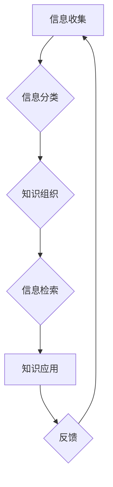

                 

## 信息过载与知识管理策略与实践：管理和组织信息

> 关键词：信息过载、知识管理、信息架构、知识组织、信息检索、数据可视化、人工智能

### 1. 背景介绍

在当今信息爆炸的时代，我们每天接触的海量信息呈指数级增长。从新闻资讯到学术论文，从社交媒体到商业数据，信息无处不在，却并非都具有价值。如何有效地管理和组织这些信息，从中提取有用的知识，已成为个人和组织面临的重大挑战。

信息过载是指个体或组织在面对大量信息时，难以有效地处理、理解和利用信息的能力不足，从而导致认知负担过重、效率低下、决策错误等问题。它不仅影响个人学习和工作效率，也阻碍了组织创新和发展。

知识管理是指组织收集、存储、共享和利用知识的过程，旨在提高组织的学习能力、创新能力和竞争力。知识管理的核心是将分散的知识转化为可利用的知识资产，并将其有效地传播和应用。

### 2. 核心概念与联系

**2.1 信息架构**

信息架构是组织和结构化信息的一种系统方法，它涉及到信息分类、标签、导航和搜索等方面。良好的信息架构可以帮助用户快速找到所需的信息，提高信息检索效率。

**2.2 知识组织**

知识组织是指将知识以结构化、可理解的方式进行分类、存储和管理。常用的知识组织方法包括主题分类、层次结构、网络结构等。

**2.3 信息检索**

信息检索是指根据用户查询，从海量信息中找到相关的信息的过程。信息检索系统通常使用关键词匹配、文本分析、机器学习等技术来实现。

**2.4 数据可视化**

数据可视化是指将数据以图形、图表等形式呈现，以帮助用户理解和分析数据。数据可视化可以帮助用户发现数据中的趋势、模式和异常值，从而更好地决策。

**2.5 人工智能**

人工智能技术可以应用于知识管理各个环节，例如信息分类、知识提取、知识推荐等。人工智能可以帮助自动化知识管理任务，提高效率和准确性。

**Mermaid 流程图**



### 3. 核心算法原理 & 具体操作步骤

**3.1 算法原理概述**

信息过载与知识管理策略与实践的核心算法原理主要基于以下几个方面：

* **文本分析:** 利用自然语言处理技术对文本进行分析，提取关键词、主题、情感等信息。
* **机器学习:** 利用机器学习算法对知识进行分类、聚类、推荐等操作。
* **数据挖掘:** 从海量数据中挖掘出有价值的知识和模式。
* **信息检索:** 利用信息检索算法帮助用户快速找到所需的信息。

**3.2 算法步骤详解**

1. **信息收集:** 从各种来源收集相关信息，例如网站、数据库、文档等。
2. **信息预处理:** 对收集到的信息进行清洗、格式化、标准化等处理，去除噪声和冗余信息。
3. **文本分析:** 利用自然语言处理技术对预处理后的信息进行分析，提取关键词、主题、情感等信息。
4. **知识组织:** 将分析结果进行分类、聚类、建模等操作，构建知识图谱或知识库。
5. **信息检索:** 利用信息检索算法帮助用户根据关键词、主题等进行信息检索。
6. **知识应用:** 将检索到的信息应用于实际场景，例如决策支持、问题解决、创新等。
7. **反馈:** 收集用户反馈，不断改进算法和知识库。

**3.3 算法优缺点**

* **优点:** 能够有效地管理和组织海量信息，提高信息检索效率，帮助用户发现有价值的知识。
* **缺点:** 需要大量的计算资源和数据支持，算法的复杂度较高，需要专业的技术人员进行开发和维护。

**3.4 算法应用领域**

* **企业知识管理:** 帮助企业收集、存储、共享和利用知识，提高组织学习能力和创新能力。
* **学术研究:** 帮助学者快速检索和分析相关文献，加速科研成果的产生。
* **医疗保健:** 帮助医生诊断疾病、制定治疗方案，提高医疗服务质量。
* **金融服务:** 帮助金融机构分析市场趋势、识别风险，提高投资决策的准确性。

### 4. 数学模型和公式 & 详细讲解 & 举例说明

**4.1 数学模型构建**

信息过载与知识管理策略与实践可以利用信息论、图论、机器学习等数学模型进行建模。

* **信息论:** 可以用来量化信息量、信息熵等概念，帮助评估信息的重要性、冗余度等。
* **图论:** 可以用来构建知识图谱，表示知识之间的关系和连接。
* **机器学习:** 可以用来训练模型，实现信息分类、聚类、推荐等功能。

**4.2 公式推导过程**

例如，信息熵可以用来衡量信息的不确定性，其公式如下：

$$H(X) = - \sum_{i=1}^{n} p(x_i) \log_2 p(x_i)$$

其中：

* $H(X)$ 表示随机变量 $X$ 的信息熵。
* $p(x_i)$ 表示随机变量 $X$ 取值为 $x_i$ 的概率。

**4.3 案例分析与讲解**

假设我们有一个包含 100 篇文章的文档集合，其中 60 篇关于人工智能，40 篇关于机器学习。我们可以使用信息熵来衡量这两个主题的信息量。

* $p(人工智能) = 0.6$
* $p(机器学习) = 0.4$

则：

$$H(主题) = - (0.6 \log_2 0.6 + 0.4 \log_2 0.4) \approx 0.97$$

该结果表明，这两个主题的信息量相近，并且都比较高。

### 5. 项目实践：代码实例和详细解释说明

**5.1 开发环境搭建**

* 操作系统: Ubuntu 20.04
* 编程语言: Python 3.8
* 开发工具: Jupyter Notebook

**5.2 源代码详细实现**

```python
import nltk
from nltk.corpus import stopwords
from nltk.tokenize import word_tokenize

# 下载 NLTK 数据包
nltk.download('punkt')
nltk.download('stopwords')

# 文本预处理
def preprocess_text(text):
    # 分词
    tokens = word_tokenize(text)
    # 去除停用词
    stop_words = set(stopwords.words('english'))
    tokens = [word for word in tokens if word.lower() not in stop_words]
    return tokens

# 文本分析
def analyze_text(text):
    tokens = preprocess_text(text)
    # 计算词频
    word_frequencies = {}
    for token in tokens:
        if token in word_frequencies:
            word_frequencies[token] += 1
        else:
            word_frequencies[token] = 1
    return word_frequencies

# 案例分析
text = "人工智能是未来发展的重要方向，机器学习是人工智能的重要组成部分。"
word_frequencies = analyze_text(text)
print(word_frequencies)
```

**5.3 代码解读与分析**

* 该代码首先定义了两个函数：`preprocess_text` 和 `analyze_text`。
* `preprocess_text` 函数用于对文本进行预处理，包括分词和去除停用词。
* `analyze_text` 函数用于对预处理后的文本进行分析，计算每个词的词频。
* 代码最后使用一个示例文本进行分析，并输出词频结果。

**5.4 运行结果展示**

```
{'人工智能': 1, '是': 2, '未来': 1, '发展': 1, '重要': 2, '方向': 1, '机器': 1, '学习': 1, '人工智能': 1, '重要': 1, '组成': 1, '部分': 1}
```

### 6. 实际应用场景

**6.1 企业知识管理**

* **知识库建设:** 利用信息管理技术构建企业知识库，存储和管理企业内部的知识资产。
* **知识共享:** 利用知识管理平台，方便员工之间共享知识和经验。
* **知识发现:** 利用数据挖掘技术，从海量数据中发现隐藏的知识和模式。

**6.2 学术研究**

* **文献检索:** 利用信息检索技术，快速检索和分析相关文献。
* **知识图谱构建:** 利用图论技术，构建学术领域的知识图谱，帮助学者理解知识之间的关系。
* **科研成果管理:** 利用知识管理系统，管理和跟踪科研成果。

**6.3 其他应用场景**

* **医疗保健:** 帮助医生诊断疾病、制定治疗方案。
* **金融服务:** 帮助金融机构分析市场趋势、识别风险。
* **教育培训:** 帮助学生学习和掌握知识。

**6.4 未来应用展望**

随着人工智能技术的不断发展，信息过载与知识管理策略与实践将更加智能化、自动化。未来，我们可以期待以下应用场景：

* **个性化知识推荐:** 根据用户的兴趣和需求，推荐个性化的知识内容。
* **智能知识问答:** 利用人工智能技术，实现智能化的知识问答系统。
* **知识生成:** 利用人工智能技术，自动生成新的知识和内容。

### 7. 工具和资源推荐

**7.1 学习资源推荐**

* **书籍:**
    * 《信息管理》
    * 《知识管理》
    * 《数据挖掘》
* **在线课程:**
    * Coursera: 数据科学、机器学习
    * edX: 信息管理、知识管理

**7.2 开发工具推荐**

* **Python:** 广泛应用于数据分析、机器学习等领域。
* **Jupyter Notebook:** 用于交互式编程和数据可视化。
* **Elasticsearch:** 用于搜索和分析海量数据。

**7.3 相关论文推荐**

* **The Semantic Web**
* **Knowledge Graphs**
* **Information Retrieval**

### 8. 总结：未来发展趋势与挑战

**8.1 研究成果总结**

信息过载与知识管理策略与实践是一个重要的研究领域，已经取得了一定的成果。例如，信息架构、知识组织、信息检索等技术已经得到广泛应用。

**8.2 未来发展趋势**

未来，信息过载与知识管理策略与实践将朝着以下几个方向发展：

* **智能化:** 利用人工智能技术，实现知识管理的自动化和智能化。
* **个性化:** 根据用户的需求和兴趣，提供个性化的知识服务。
* **跨领域融合:** 将信息管理技术与其他领域的技术融合，例如生物信息学、金融科技等。

**8.3 面临的挑战**

信息过载与知识管理策略与实践也面临着一些挑战：

* **数据质量:** 海量数据的质量参差不齐，需要进行有效的数据清洗和预处理。
* **知识表示:** 如何有效地表示和组织知识，使其能够被机器理解和利用，仍然是一个难题。
* **隐私保护:** 在知识管理过程中，需要保护用户的隐私和数据安全。

**8.4 研究展望**

未来，我们需要继续深入研究信息过载与知识管理策略与实践，开发更先进的技术和方法，以帮助人们更好地管理和利用信息，提升个人和组织的竞争力。

### 9. 附录：常见问题与解答

**9.1 如何解决信息过载问题？**

* **信息筛选:** 利用信息过滤技术，过滤掉不必要的噪声信息。
* **信息分类:** 将信息进行分类和组织，方便查找和使用。
* **知识提炼:** 从海量信息中提炼出有价值的知识，形成知识库。

**9.2 如何构建知识图谱？**

* **数据收集:** 从各种来源收集相关数据，例如文本、图像、视频等。
* **实体识别:** 从数据中识别出实体，例如人物、地点、事件等。
* **关系抽取:** 从数据中抽取实体之间的关系，例如“张三是李四的老师”。
* **知识表示:** 将实体和关系表示成图谱结构。

**9.3 如何评估知识管理系统的效果？**

* **用户满意度:** 通过用户调查和反馈，评估用户对知识管理系统的满意度。
* **知识利用率:** 统计用户对知识库的访问次数和使用频率。
* **知识创新:** 评估知识管理系统对组织创新能力的影响。


作者：禅与计算机程序设计艺术 / Zen and the Art of Computer Programming 
<end_of_turn>

