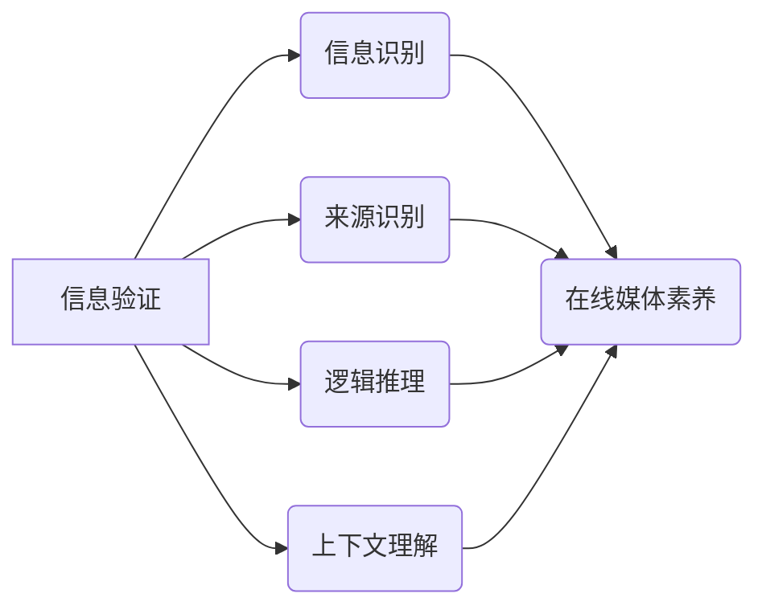

                 

## 信息验证和在线媒体素养：在假新闻和媒体操纵时代导航

> 关键词：信息验证、媒体素养、假新闻、深度学习、自然语言处理、网络安全、算法可解释性、信任

### 1. 背景介绍

互联网的蓬勃发展为人类带来了前所未有的信息获取便利，但也带来了新的挑战。假新闻、网络谣言和恶意信息传播的泛滥，严重威胁着社会稳定和公共秩序。在信息爆炸的时代，如何有效地识别和验证信息，提升在线媒体素养，成为每个人都必须面对的课题。

传统的信息验证方法主要依赖于人工审核和事实核查，效率低下且难以应对海量信息流。随着人工智能技术的快速发展，特别是深度学习和自然语言处理领域的突破，信息验证领域迎来了新的机遇。

### 2. 核心概念与联系

**2.1 信息验证的本质**

信息验证是指通过多种手段对信息的真实性、准确性和可靠性进行评估和判断的过程。它涉及到多个方面，包括：

* **事实核查:** 验证信息的真实性，例如事件是否发生、人物身份是否准确等。
* **来源识别:** 识别信息的来源，判断来源的可靠性和可信度。
* **逻辑推理:** 分析信息的逻辑关系，识别逻辑谬误和矛盾之处。
* **上下文理解:** 理解信息的语境和背景，避免片面理解和误判。

**2.2 在线媒体素养**

在线媒体素养是指在网络环境中获取、理解、评价和利用信息的能力。它包括以下几个方面：

* **信息识别:** 能够识别不同类型的信息，例如新闻、广告、社交媒体内容等。
* **信息评估:** 能够评估信息的可靠性和准确性，识别假新闻和虚假信息。
* **信息批判性思考:** 能够对信息进行批判性思考，分析信息背后的动机和目的。
* **信息责任:** 能够负责任地使用和传播信息，避免传播假新闻和恶意信息。

**2.3 核心概念关系图**



### 3. 核心算法原理 & 具体操作步骤

**3.1 算法原理概述**

信息验证算法通常基于深度学习和自然语言处理技术，通过训练模型识别和分类不同类型的信息，并评估信息的真实性和可靠性。常见的算法包括：

* **循环神经网络 (RNN):** 用于处理序列数据，例如文本，能够捕捉文本中的上下文信息和语义关系。
* **长短期记忆网络 (LSTM):** RNN 的一种改进型，能够更好地处理长序列数据，例如新闻文章。
* **BERT:** 基于 Transformer 架构的预训练语言模型，能够理解文本的深层语义和上下文关系。

**3.2 算法步骤详解**

1. **数据收集和预处理:** 收集大量文本数据，包括真实新闻、虚假新闻、社交媒体内容等，并进行预处理，例如文本清洗、分词、词向量化等。
2. **模型训练:** 使用深度学习框架，例如 TensorFlow 或 PyTorch，训练模型，例如 RNN 或 BERT，使其能够识别和分类不同类型的信息。
3. **模型评估:** 使用测试数据集评估模型的性能，例如准确率、召回率、F1-score 等。
4. **模型部署:** 将训练好的模型部署到线上平台，用于实时信息验证。

**3.3 算法优缺点**

* **优点:**

    * 能够处理海量信息流，提高信息验证效率。
    * 能够识别复杂的虚假信息，例如深度伪造、合成文本等。
    * 能够不断学习和改进，随着数据量的增加，模型性能会不断提升。

* **缺点:**

    * 需要大量的数据进行训练，数据质量直接影响模型性能。
    * 模型训练成本较高，需要强大的计算资源。
    * 模型的决策过程难以解释，缺乏透明度。

**3.4 算法应用领域**

* **新闻媒体:** 验证新闻真实性，识别假新闻和谣言。
* **社交媒体平台:** 识别恶意信息和网络攻击，维护平台安全。
* **搜索引擎:** 排序搜索结果，提升用户搜索体验。
* **教育领域:** 帮助学生识别虚假信息，提升媒体素养。

### 4. 数学模型和公式 & 详细讲解 & 举例说明

**4.1 数学模型构建**

信息验证算法通常使用概率模型来表示信息的真实性和可靠性。例如，可以使用贝叶斯网络来建模信息来源、内容特征和真实性之间的关系。

**4.2 公式推导过程**

假设我们有一个信息 $I$，其真实性为 $T$，来源为 $S$，内容特征为 $C$。我们可以使用贝叶斯公式来计算信息真实性的概率：

$$P(T|I,S,C) = \frac{P(I,S,C|T)P(T)}{P(I,S,C)}$$

其中：

* $P(T|I,S,C)$ 是信息 $I$ 真实性的后验概率，即在已知信息来源 $S$、内容特征 $C$ 和信息 $I$ 的情况下，信息 $T$ 的概率。
* $P(I,S,C|T)$ 是信息 $I$、来源 $S$ 和内容特征 $C$ 在信息 $T$ 为真的情况下出现的概率。
* $P(T)$ 是信息 $T$ 的先验概率，即在没有其他信息的情况下，信息 $T$ 为真的概率。
* $P(I,S,C)$ 是信息 $I$、来源 $S$ 和内容特征 $C$ 出现的概率。

**4.3 案例分析与讲解**

例如，我们有一个新闻报道，其来源是知名新闻机构，内容特征是客观事实描述，我们想要判断其真实性。我们可以根据贝叶斯公式计算新闻报道真实性的概率。

* $P(T)$：知名新闻机构发布真实新闻的概率较高，可以设定为 0.8。
* $P(I,S,C|T)$：如果新闻报道真实，则其来源、内容特征和信息都符合预期，概率较高，可以设定为 0.9。
* $P(I,S,C)$：可以根据历史数据统计，知名新闻机构发布的新闻中，客观事实描述的比例来计算。

通过代入这些值，我们可以计算出新闻报道真实性的后验概率。

### 5. 项目实践：代码实例和详细解释说明

**5.1 开发环境搭建**

* Python 3.6+
* TensorFlow 或 PyTorch
* Jupyter Notebook

**5.2 源代码详细实现**

```python
import tensorflow as tf

# 定义模型结构
model = tf.keras.Sequential([
    tf.keras.layers.Embedding(input_dim=vocab_size, output_dim=embedding_dim),
    tf.keras.layers.LSTM(units=128),
    tf.keras.layers.Dense(units=1, activation='sigmoid')
])

# 编译模型
model.compile(optimizer='adam', loss='binary_crossentropy', metrics=['accuracy'])

# 训练模型
model.fit(x_train, y_train, epochs=10, batch_size=32)

# 评估模型
loss, accuracy = model.evaluate(x_test, y_test)
print('Loss:', loss)
print('Accuracy:', accuracy)
```

**5.3 代码解读与分析**

* 该代码示例使用 TensorFlow 库构建了一个基于 LSTM 的信息验证模型。
* 模型输入是文本数据，经过 Embedding 层将文本转换为向量表示，然后输入 LSTM 层进行序列处理。
* 最后，模型输出一个值，表示信息的真实性概率。

**5.4 运行结果展示**

训练完成后，我们可以使用测试数据评估模型的性能，例如准确率、召回率等。

### 6. 实际应用场景

**6.1 新闻媒体**

* 自动识别和标记假新闻和谣言。
* 为新闻编辑提供信息真实性评估建议。
* 帮助用户识别虚假信息，提升新闻素养。

**6.2 社交媒体平台**

* 识别恶意信息和网络攻击，维护平台安全。
* 过滤垃圾信息和广告，提升用户体验。
* 帮助用户识别虚假信息，避免被误导。

**6.3 搜索引擎**

* 排序搜索结果，优先显示真实可靠的信息。
* 为用户提供信息来源和真实性评估。
* 帮助用户快速找到准确的信息。

**6.4 教育领域**

* 帮助学生识别虚假信息，提升媒体素养。
* 为教育机构提供信息验证工具，保障教学质量。
* 促进学生批判性思维和信息鉴别能力的培养。

**6.5 未来应用展望**

随着人工智能技术的不断发展，信息验证技术将更加智能化、自动化和个性化。未来，信息验证技术将应用于更广泛的领域，例如医疗、金融、法律等，为人们提供更安全、可靠的信息服务。

### 7. 工具和资源推荐

**7.1 学习资源推荐**

* **书籍:**

    * 《深度学习》 - Ian Goodfellow, Yoshua Bengio, Aaron Courville
    * 《自然语言处理》 - Jurafsky, Martin

* **在线课程:**

    * Coursera: 自然语言处理
    * edX: 深度学习

**7.2 开发工具推荐**

* **深度学习框架:** TensorFlow, PyTorch
* **自然语言处理库:** NLTK, spaCy
* **数据可视化工具:** Matplotlib, Seaborn

**7.3 相关论文推荐**

* **BERT: Pre-training of Deep Bidirectional Transformers for Language Understanding**
* **Attention Is All You Need**
* **Fake News Detection: A Survey**

### 8. 总结：未来发展趋势与挑战

**8.1 研究成果总结**

近年来，信息验证技术取得了显著进展，特别是深度学习和自然语言处理领域的突破，为信息验证提供了强大的技术支撑。

**8.2 未来发展趋势**

* **模型更加智能化:** 利用更先进的深度学习算法，例如 Transformer 和 Graph Neural Network，构建更智能、更精准的信息验证模型。
* **算法更加可解释:** 研究更可解释的深度学习算法，提高模型决策过程的透明度，增强用户信任。
* **跨模态信息验证:** 将文本、图像、音频等多种模态信息融合，构建更全面的信息验证系统。

**8.3 面临的挑战**

* **数据质量问题:** 信息验证算法依赖于高质量的数据，而真实信息和虚假信息的边界往往模糊，数据标注难度较大。
* **模型鲁棒性问题:** 现有的信息验证模型容易受到对抗样本攻击，需要提高模型的鲁棒性。
* **伦理问题:** 信息验证技术可能会被滥用，例如用于审查言论自由或操控舆论，需要关注伦理问题，确保技术应用的安全性与可控性。

**8.4 研究展望**

未来，信息验证技术将继续朝着更加智能化、自动化和可解释的方向发展，为构建更加安全、可靠的信息环境做出贡献。


### 9. 附录：常见问题与解答

**9.1 如何判断信息真实性？**

* 来源可靠性：判断信息来源是否可靠，例如是否来自知名媒体机构、专家学者或官方网站。
* 内容逻辑性：分析信息内容的逻辑关系，识别逻辑谬误和矛盾之处。
* 多方核实：通过多方渠道核实信息，例如搜索引擎、社交媒体、权威机构等。

**9.2 如何提高在线媒体素养？**

* 培养批判性思维：学会质疑信息，分析信息背后的动机和目的。
* 识别虚假信息：学习识别常见的虚假信息特征，例如标题党、情感化语言、缺乏证据等。
* 关注信息来源：注意信息来源的可靠性，避免盲目相信网络信息。
* 负责任地传播信息：避免传播未经核实的信息，传播信息时要注明来源。


作者：禅与计算机程序设计艺术 / Zen and the Art of Computer Programming 
<end_of_turn>

