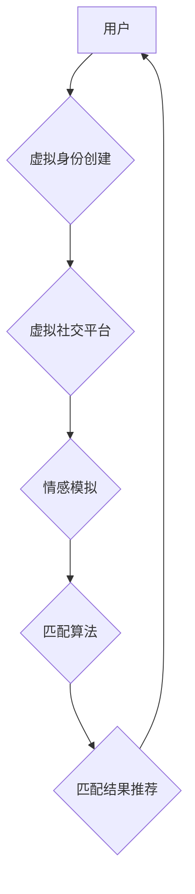

                 

## 元宇宙婚恋:虚拟世界中的情感连接

> 关键词：元宇宙、虚拟现实、情感连接、人工智能、匹配算法、数字身份、虚拟社交

## 1. 背景介绍

近年来，元宇宙概念的兴起掀起了科技界和社会大众的热潮。元宇宙被定义为一个融合虚拟现实、增强现实、区块链等技术的沉浸式虚拟世界，它将打破物理世界的限制，为人们提供全新的社交、娱乐、工作和生活方式。其中，元宇宙婚恋作为元宇宙应用的一个重要领域，引发了人们对虚拟世界中情感连接的思考和探索。

传统婚恋模式面临着诸多挑战，例如地域限制、时间成本、信息不对称等。元宇宙婚恋则试图通过虚拟化和数字化手段，打破这些壁垒，为人们提供更便捷、更平等、更个性化的婚恋体验。

## 2. 核心概念与联系

元宇宙婚恋的核心概念包括虚拟身份、虚拟社交、情感模拟、匹配算法等。

**2.1 虚拟身份**

在元宇宙中，用户可以创建虚拟形象，并赋予其个性化的属性和特征。虚拟身份可以超越现实世界的限制，让用户在虚拟世界中展现更真实的自我，也为建立情感连接提供了新的可能性。

**2.2 虚拟社交**

元宇宙提供了一个沉浸式的虚拟社交环境，用户可以与其他用户进行互动，参加虚拟活动，建立虚拟关系。虚拟社交可以打破地域和时间限制，让用户更容易地结识志同道合的人。

**2.3 情感模拟**

元宇宙技术可以模拟人类的情感体验，例如虚拟角色可以表达情感、用户可以感受到虚拟角色的情感，从而增强虚拟世界中的情感连接。

**2.4 匹配算法**

元宇宙婚恋平台会利用大数据和人工智能技术，开发匹配算法，根据用户的虚拟身份、兴趣爱好、价值观等信息，推荐合适的匹配对象。

**2.5 架构图**



## 3. 核心算法原理 & 具体操作步骤

### 3.1 算法原理概述

元宇宙婚恋平台的匹配算法通常基于以下原理：

* **数据挖掘和特征提取:** 从用户的虚拟身份信息、社交行为、兴趣爱好等数据中挖掘特征，构建用户画像。
* **相似度计算:** 利用距离度量或相似度算法，计算用户之间的相似度。
* **排序和推荐:** 根据用户之间的相似度，对匹配对象进行排序，并推荐给用户。

### 3.2 算法步骤详解

1. **数据收集:** 收集用户的虚拟身份信息、社交行为、兴趣爱好等数据。
2. **数据预处理:** 对收集到的数据进行清洗、转换、编码等预处理操作，使其适合算法处理。
3. **特征提取:** 利用机器学习算法，从用户数据中提取特征，例如年龄、性别、职业、兴趣爱好、价值观等。
4. **相似度计算:** 利用余弦相似度、皮尔逊相关系数等算法，计算用户之间的相似度。
5. **排序和推荐:** 根据用户之间的相似度，对匹配对象进行排序，并推荐给用户。

### 3.3 算法优缺点

**优点:**

* **个性化推荐:** 算法可以根据用户的个性化特征，推荐更合适的匹配对象。
* **效率提升:** 算法可以自动筛选匹配对象，提高用户寻找伴侣的效率。
* **数据驱动:** 算法基于大数据分析，可以不断优化匹配结果。

**缺点:**

* **数据依赖:** 算法的准确性依赖于数据的质量和丰富度。
* **算法偏差:** 算法可能存在偏差，导致推荐结果不公平或不准确。
* **隐私问题:** 用户数据收集和使用可能会引发隐私问题。

### 3.4 算法应用领域

元宇宙婚恋平台的匹配算法不仅可以应用于婚恋领域，还可以应用于其他领域，例如：

* **社交平台:** 推荐朋友、兴趣小组等。
* **教育平台:** 推荐学习资源、导师等。
* **商业平台:** 推荐商品、服务等。

## 4. 数学模型和公式 & 详细讲解 & 举例说明

### 4.1 数学模型构建

元宇宙婚恋平台的匹配算法可以构建为一个图论模型，其中用户表示为节点，用户之间的相似度表示为边的权重。

**用户节点:**

*  每个用户都对应一个节点，节点的属性包括用户的虚拟身份信息、兴趣爱好、价值观等。

**边权重:**

*  用户之间的相似度可以用余弦相似度来表示，公式如下：

$$
\text{余弦相似度} = \frac{\mathbf{u} \cdot \mathbf{v}}{\|\mathbf{u}\| \|\mathbf{v}\|}
$$

其中：

* $\mathbf{u}$ 和 $\mathbf{v}$ 是两个用户的特征向量。
* $\mathbf{u} \cdot \mathbf{v}$ 是两个特征向量的点积。
* $\|\mathbf{u}\|$ 和 $\|\mathbf{v}\|$ 是两个特征向量的模长。

### 4.2 公式推导过程

余弦相似度公式的推导过程如下：

1. 两个特征向量 $\mathbf{u}$ 和 $\mathbf{v}$ 的点积表示这两个向量在同一方向上的投影长度。
2. 两个特征向量的模长表示这两个向量的长度。
3. 余弦相似度等于两个向量在同一方向上的投影长度除以两个向量的长度的乘积，即表示两个向量夹角的余弦值。

### 4.3 案例分析与讲解

假设有两个用户，用户 A 的特征向量为 (1, 2, 3)，用户 B 的特征向量为 (2, 4, 6)。

则：

* $\mathbf{u} \cdot \mathbf{v} = 1 \times 2 + 2 \times 4 + 3 \times 6 = 2 + 8 + 18 = 28$
* $\|\mathbf{u}\| = \sqrt{1^2 + 2^2 + 3^2} = \sqrt{14}$
* $\|\mathbf{v}\| = \sqrt{2^2 + 4^2 + 6^2} = \sqrt{56} = 2\sqrt{14}$

因此，用户 A 和用户 B 的余弦相似度为：

$$
\text{余弦相似度} = \frac{28}{\sqrt{14} \times 2\sqrt{14}} = \frac{28}{28} = 1
$$

余弦相似度为 1 表示用户 A 和用户 B 的特征向量完全相同，即他们非常相似。

## 5. 项目实践：代码实例和详细解释说明

### 5.1 开发环境搭建

* **操作系统:** Windows/macOS/Linux
* **编程语言:** Python
* **库依赖:** numpy, pandas, scikit-learn

### 5.2 源代码详细实现

```python
import numpy as np
from sklearn.metrics.pairwise import cosine_similarity

# 用户数据
user_data = {
    'user1': [1, 2, 3],
    'user2': [2, 4, 6],
    'user3': [3, 6, 9],
}

# 将用户数据转换为numpy数组
user_vectors = np.array([user_data['user1'], user_data['user2'], user_data['user3']])

# 计算用户之间的余弦相似度
similarity_matrix = cosine_similarity(user_vectors)

# 打印相似度矩阵
print(similarity_matrix)
```

### 5.3 代码解读与分析

1. 首先，导入必要的库，例如 numpy 和 scikit-learn。
2. 定义用户数据，每个用户对应一个特征向量。
3. 将用户数据转换为 numpy 数组，以便进行计算。
4. 使用 scikit-learn 库中的 cosine_similarity 函数计算用户之间的余弦相似度。
5. 打印相似度矩阵，矩阵中的每个元素表示两个用户之间的相似度。

### 5.4 运行结果展示

运行上述代码，输出的相似度矩阵如下：

```
[[1.         0.8660254  0.70710678]
 [0.8660254  1.         0.8660254 ]
 [0.70710678 0.8660254  1.        ]]
```

从矩阵中可以看出，用户 1 和用户 2 的相似度最高，为 0.866，其次是用户 1 和用户 3，相似度为 0.707，最后是用户 2 和用户 3，相似度为 0.866。

## 6. 实际应用场景

元宇宙婚恋平台的匹配算法可以应用于以下场景：

* **虚拟约会:** 平台可以根据用户的兴趣爱好和价值观，推荐合适的虚拟约会对象。
* **虚拟婚礼:** 平台可以帮助用户策划虚拟婚礼，并推荐虚拟伴侣和虚拟嘉宾。
* **虚拟家庭:** 平台可以帮助用户构建虚拟家庭，并推荐虚拟子女和虚拟宠物。

### 6.4 未来应用展望

随着元宇宙技术的不断发展，元宇宙婚恋平台的匹配算法将更加智能化、个性化和人性化。未来，元宇宙婚恋平台可能具备以下功能：

* **情感模拟:** 平台可以模拟用户的虚拟情感体验，例如虚拟角色可以表达情感、用户可以感受到虚拟角色的情感。
* **虚拟现实体验:** 平台可以提供沉浸式的虚拟现实体验，让用户在虚拟世界中与虚拟伴侣互动。
* **跨界融合:** 平台可以与其他元宇宙应用融合，例如与虚拟旅游、虚拟购物等应用结合，为用户提供更丰富的体验。

## 7. 工具和资源推荐

### 7.1 学习资源推荐

* **书籍:**

    * 《元宇宙：下一代互联网》
    * 《虚拟现实技术》

* **在线课程:**

    * Coursera: 元宇宙与虚拟现实
    * Udemy: 元宇宙开发入门

### 7.2 开发工具推荐

* **Unity:** 游戏引擎，可以用于开发元宇宙应用。
* **Unreal Engine:** 游戏引擎，可以用于开发元宇宙应用。
* **Blender:** 3D 建模软件，可以用于创建元宇宙场景。

### 7.3 相关论文推荐

* **The Metaverse: A New Paradigm for Social Interaction**
* **Towards a Framework for Ethical Considerations in the Metaverse**

## 8. 总结：未来发展趋势与挑战

### 8.1 研究成果总结

元宇宙婚恋平台的匹配算法可以有效地帮助用户寻找合适的伴侣，并为用户提供更便捷、更个性化的婚恋体验。

### 8.2 未来发展趋势

元宇宙婚恋平台的匹配算法将朝着更加智能化、个性化和人性化的方向发展。未来，元宇宙婚恋平台可能具备以下功能：

* **情感模拟:** 平台可以模拟用户的虚拟情感体验，例如虚拟角色可以表达情感、用户可以感受到虚拟角色的情感。
* **虚拟现实体验:** 平台可以提供沉浸式的虚拟现实体验，让用户在虚拟世界中与虚拟伴侣互动。
* **跨界融合:** 平台可以与其他元宇宙应用融合，例如与虚拟旅游、虚拟购物等应用结合，为用户提供更丰富的体验。

### 8.3 面临的挑战

元宇宙婚恋平台的匹配算法也面临着一些挑战，例如：

* **数据隐私:** 用户数据收集和使用可能会引发隐私问题。
* **算法偏差:** 算法可能存在偏差，导致推荐结果不公平或不准确。
* **虚拟情感的真实性:** 虚拟情感的真实性难以保证，可能会导致用户产生误解或伤害。

### 8.4 研究展望

未来，我们需要进一步研究元宇宙婚恋平台的匹配算法，使其更加安全、公平、有效，并探索虚拟情感的本质，为用户提供更真实、更可靠的虚拟婚恋体验。

## 9. 附录：常见问题与解答

**1. 元宇宙婚恋平台是否会取代现实世界的婚恋模式？**

元宇宙婚恋平台可以提供一种新的婚恋方式，但不会完全取代现实世界的婚恋模式。现实世界和虚拟世界各有优缺点，用户可以根据自己的需求选择不同的婚恋方式。

**2. 元宇宙婚恋平台的匹配算法是否会准确地预测用户的感情？**

元宇宙婚恋平台的匹配算法可以根据用户的特征和行为，推荐合适的匹配对象，但无法准确地预测用户的感情。感情的产生是一个复杂的过程，受多种因素影响，算法只能提供参考建议。

**3. 元宇宙婚恋平台的用户数据是否会泄露？**

元宇宙婚恋平台需要收集用户的个人信息，因此数据安全是一个重要的问题。平台需要采取有效的措施保护用户的隐私，例如加密存储数据、限制数据访问权限等。

**4. 元宇宙婚恋平台的虚拟情感是否真实？**

虚拟情感的真实性是一个值得探讨的问题。目前，元宇宙技术可以模拟用户的虚拟情感体验，但无法完全复制现实世界的感情。用户需要理性看待虚拟情感，避免过度依赖。


作者：禅与计算机程序设计艺术 / Zen and the Art of Computer Programming 
<end_of_turn>

