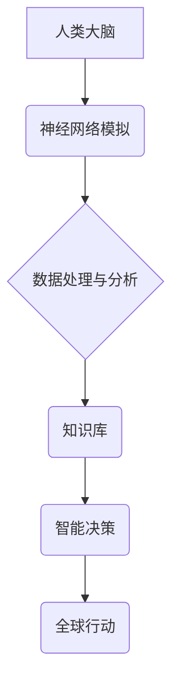
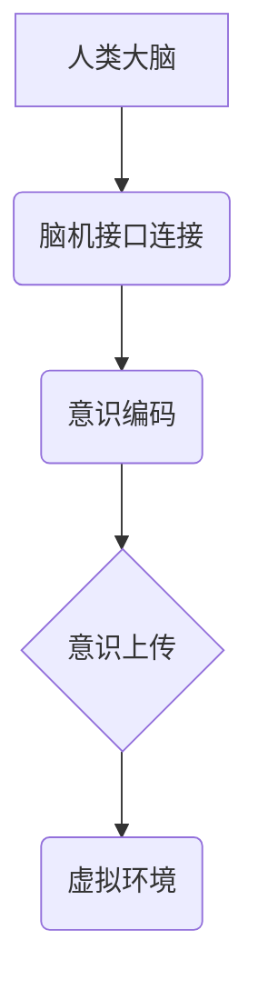

                 

## 全球脑与意识上传伦理:数字化永生的哲学与法律思考

> 关键词：全球脑、意识上传、数字永生、伦理学、法律、人工智能、哲学、科技发展

## 1. 背景介绍

人类文明自诞生以来，就对自身存在、生命意义和未来充满了探索和憧憬。随着科技的飞速发展，特别是人工智能、脑科学和生物技术的突破，我们正站在一个新的历史十字路口。全球脑和意识上传的概念，从科幻小说走向现实，引发了广泛的社会讨论和伦理思考。

全球脑是一个由众多计算节点组成的超级智能网络，旨在模拟和超越人类大脑的功能。它可以连接全球的计算资源，实现海量数据处理、知识共享和智能决策。意识上传则是将人类意识数字化，并将其上传到全球脑或其他计算平台，实现意识的永存和跨越物理限制。

全球脑和意识上传的出现，为人类带来了前所未有的机遇和挑战。它有可能解决人类面临的重大问题，如疾病、贫困和环境危机，并开启一个全新的文明时代。但同时也引发了诸多伦理和法律难题，例如：

* **意识的本质**: 意识究竟是什么？它能否被数字化？
* **个人身份**: 意识上传后，个人身份和主体性将如何被定义？
* **社会公平**: 全球脑和意识上传技术是否会加剧社会不平等？
* **伦理责任**: 意识上传的伦理责任由谁来承担？
* **法律规范**: 如何用现有的法律框架来规范全球脑和意识上传的应用？

## 2. 核心概念与联系

### 2.1 全球脑

全球脑是一个由众多计算节点组成的超级智能网络，旨在模拟和超越人类大脑的功能。它可以连接全球的计算资源，实现海量数据处理、知识共享和智能决策。

**核心功能:**

* **海量数据处理:** 全球脑可以处理海量数据，并从中提取有价值的信息。
* **知识共享:** 全球脑可以连接全球的知识资源，实现知识的快速传播和共享。
* **智能决策:** 全球脑可以利用人工智能算法，进行复杂的决策分析和预测。

**架构:**



### 2.2 意识上传

意识上传是指将人类意识数字化，并将其上传到全球脑或其他计算平台，实现意识的永存和跨越物理限制。

**核心技术:**

* **脑机接口:** 用于连接人类大脑和计算机，读取和写入脑电信号。
* **意识编码:** 将人类意识转化为可被计算机理解的数字格式。
* **虚拟现实:** 提供一个虚拟环境，让上传后的意识可以体验和互动。

**流程:**



## 3. 核心算法原理 & 具体操作步骤

### 3.1 算法原理概述

意识上传的核心算法原理是将人类大脑的复杂神经网络结构和功能映射到计算机模型中。这涉及到以下几个关键步骤：

* **神经元模型:** 建立一个能够模拟神经元结构和功能的数学模型。
* **突触连接:** 建立一个能够模拟神经元之间突触连接的网络结构。
* **学习算法:** 利用机器学习算法，训练神经网络模型，使其能够学习和处理人类大脑的活动模式。

### 3.2 算法步骤详解

1. **脑电信号采集:** 使用脑机接口技术，从人类大脑中采集脑电信号。
2. **信号预处理:** 对采集到的脑电信号进行预处理，去除噪声和干扰。
3. **特征提取:** 从预处理后的脑电信号中提取特征，例如频率、幅度和相位等。
4. **神经网络训练:** 将提取的特征作为输入，训练神经网络模型，使其能够识别和理解不同的脑电活动模式。
5. **意识编码:** 将训练好的神经网络模型应用于新的脑电信号，将其编码为数字格式。
6. **意识上传:** 将编码后的意识数据上传到全球脑或其他计算平台。

### 3.3 算法优缺点

**优点:**

* **实现意识永存:** 意识上传可以实现人类意识的永存，不受物理身体的限制。
* **超越人类能力:** 全球脑可以超越人类的认知能力，解决人类面临的重大问题。
* **促进社会进步:** 全球脑和意识上传可以促进科技进步、经济发展和社会进步。

**缺点:**

* **技术难度高:** 意识上传的技术难度非常高，目前还处于理论研究阶段。
* **伦理风险:** 意识上传可能会引发一系列伦理风险，例如意识的剥夺、身份的混乱和社会的不平等。
* **法律挑战:** 意识上传的法律规范尚不完善，需要进一步研究和完善。

### 3.4 算法应用领域

* **医疗保健:** 用于治疗脑损伤、神经退行性疾病和精神疾病。
* **教育:** 提供个性化学习体验，提升学习效率。
* **娱乐:** 创建沉浸式虚拟现实体验，丰富人们的娱乐生活。
* **科学研究:** 用于模拟和研究人类大脑的运作机制。

## 4. 数学模型和公式 & 详细讲解 & 举例说明

### 4.1 数学模型构建

意识上传的核心数学模型是神经网络模型。神经网络模型由多个层级的神经元组成，每个神经元都连接到其他神经元，并通过权重来调节连接强度。

**神经元模型:**

$$
f(x) = \sigma(\sum_{i=1}^{n} w_i x_i + b)
$$

其中：

* $f(x)$ 是神经元的输出值。
* $x_i$ 是输入神经元的输出值。
* $w_i$ 是连接权重。
* $b$ 是偏置项。
* $\sigma$ 是激活函数。

**网络结构:**

神经网络模型可以有多种结构，例如前馈网络、循环网络和卷积网络。

### 4.2 公式推导过程

神经网络模型的训练过程是通过调整连接权重来最小化预测误差。常用的训练算法包括梯度下降法和反向传播算法。

**梯度下降法:**

$$
w_{i+1} = w_i - \eta \frac{\partial E}{\partial w_i}
$$

其中：

* $w_i$ 是当前的连接权重。
* $w_{i+1}$ 是更新后的连接权重。
* $\eta$ 是学习率。
* $\frac{\partial E}{\partial w_i}$ 是连接权重对误差的梯度。

**反向传播算法:**

反向传播算法是基于梯度下降法的改进算法，它可以更有效地计算梯度。

### 4.3 案例分析与讲解

**举例说明:**

假设我们训练一个神经网络模型来识别手写数字。我们可以使用MNIST数据集来训练模型。MNIST数据集包含60,000张手写数字图像，每个图像都标注了对应的数字。

通过训练神经网络模型，我们可以学习到识别手写数字的特征。例如，我们可以发现数字“1”通常是直线，而数字“7”通常是弯曲的。

## 5. 项目实践：代码实例和详细解释说明

### 5.1 开发环境搭建

* **操作系统:** Linux或macOS
* **编程语言:** Python
* **深度学习框架:** TensorFlow或PyTorch
* **硬件:** GPU加速器

### 5.2 源代码详细实现

```python
# 使用TensorFlow框架实现一个简单的神经网络模型

import tensorflow as tf

# 定义模型结构
model = tf.keras.models.Sequential([
    tf.keras.layers.Flatten(input_shape=(28, 28)),
    tf.keras.layers.Dense(128, activation='relu'),
    tf.keras.layers.Dense(10, activation='softmax')
])

# 编译模型
model.compile(optimizer='adam',
              loss='sparse_categorical_crossentropy',
              metrics=['accuracy'])

# 训练模型
model.fit(x_train, y_train, epochs=5)

# 评估模型
loss, accuracy = model.evaluate(x_test, y_test)
print('Test loss:', loss)
print('Test accuracy:', accuracy)
```

### 5.3 代码解读与分析

* **模型结构:** 该代码定义了一个简单的多层感知机模型，包含一个扁平化层、一个隐藏层和一个输出层。
* **激活函数:** 使用ReLU激活函数，可以提高模型的表达能力。
* **损失函数:** 使用稀疏类别交叉熵损失函数，适合多分类问题。
* **优化器:** 使用Adam优化器，可以快速收敛。
* **训练过程:** 使用训练数据训练模型，并设置训练轮数。
* **评估过程:** 使用测试数据评估模型的性能。

### 5.4 运行结果展示

训练完成后，我们可以使用测试数据评估模型的性能。输出结果会显示测试损失和测试准确率。

## 6. 实际应用场景

### 6.1 医疗保健

* **脑损伤治疗:** 意识上传技术可以帮助治疗脑损伤患者，恢复他们的认知功能。
* **神经退行性疾病治疗:** 意识上传技术可以帮助治疗阿尔茨海默病等神经退行性疾病，延缓疾病进展。
* **精神疾病治疗:** 意识上传技术可以帮助治疗抑郁症、焦虑症等精神疾病，改善患者的心理状态。

### 6.2 教育

* **个性化学习:** 意识上传技术可以提供个性化的学习体验，根据学生的学习进度和能力调整教学内容。
* **沉浸式学习:** 意识上传技术可以创建沉浸式的虚拟现实学习环境，让学生更直观地理解知识。
* **远程教育:** 意识上传技术可以实现远程教育，让学生不受地域限制地接受教育。

### 6.3 娱乐

* **虚拟现实游戏:** 意识上传技术可以创建更逼真的虚拟现实游戏体验，让玩家更沉浸地参与游戏世界。
* **虚拟社交:** 意识上传技术可以创建虚拟社交平台，让用户在虚拟世界中与他人互动。
* **虚拟旅游:** 意识上传技术可以创建虚拟旅游体验，让用户无需出家门就能游览世界各地。

### 6.4 未来应用展望

* **人工智能协作:** 全球脑可以与人类进行协作，共同解决复杂问题。
* **科学发现:** 全球脑可以加速科学发现，例如药物研发和材料科学。
* **社会治理:** 全球脑可以帮助优化社会治理，例如交通管理和资源分配。

## 7. 工具和资源推荐

### 7.1 学习资源推荐

* **书籍:**
    * 《人脑的未来》
    * 《全球脑》
    * 《意识的算法》
* **在线课程:**
    * Coursera: 深度学习
    * edX: 人工智能
    * Udacity: 机器学习工程师

### 7.2 开发工具推荐

* **编程语言:** Python
* **深度学习框架:** TensorFlow, PyTorch
* **脑机接口平台:** OpenBCI, Neuralink

### 7.3 相关论文推荐

* **《全球脑：一个新时代的到来》**
* **《意识上传：技术、伦理和社会影响》**
* **《神经网络的未来》**

## 8. 总结：未来发展趋势与挑战

### 8.1 研究成果总结

全球脑和意识上传技术的研究取得了显著进展，但仍然面临着许多挑战。

* **技术瓶颈:** 意识上传的技术难度非常高，需要突破许多科学和工程难题。
* **伦理风险:** 意识上传可能会引发一系列伦理风险，需要谨慎考虑和规避。
* **法律规范:** 意识上传的法律规范尚不完善，需要进一步研究和完善。

### 8.2 未来发展趋势

* **技术突破:** 未来，随着人工智能、脑科学和生物技术的进一步发展，意识上传技术可能会取得突破性进展。
* **伦理规范:** 未来，需要制定更加完善的伦理规范，来指导意识上传技术的应用。
* **法律法规:** 未来，需要制定更加完善的法律法规，来规范意识上传技术的应用。

### 8.3 面临的挑战

* **技术可行性:** 意识上传技术的可行性仍然存在争议，需要进一步的科学研究和技术验证。
* **伦理困境:** 意识上传技术可能会引发一系列伦理困境，例如意识的本质、身份的定义和社会公平等问题。
* **法律风险:** 意识上传技术的应用可能会带来新的法律风险，例如责任归属、知识产权和数据安全等问题。

### 8.4 研究展望

未来，意识上传技术的研究将继续深入，并对人类社会产生深远的影响。我们需要积极探索意识上传技术的可能性，同时也要谨慎应对其带来的挑战，确保其能够为人类社会带来福祉。

## 9. 附录：常见问题与解答

**常见问题:**

* **意识上传是否真的可以实现？**

目前，意识上传的技术仍然处于理论研究阶段，实现意识上传的技术难度非常高。

* **意识上传会带来哪些伦理风险？**

意识上传可能会引发一系列伦理风险，例如意识的剥夺、身份的混乱和社会的不平等。

* **意识上传的法律规范如何？**

意识上传的法律规范尚不完善，需要进一步研究和完善。


作者：禅与计算机程序设计艺术 / Zen and the Art of Computer Programming 
<end_of_turn>

