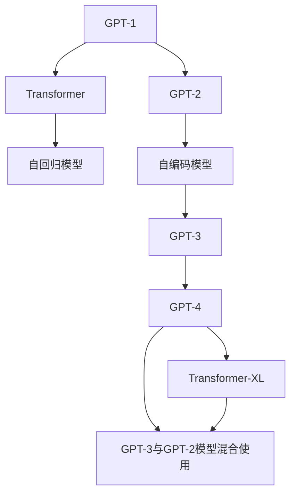

                 

# GPT系列模型架构解析：从GPT-1到GPT-4

> 关键词：GPT,Transformer,自回归模型,自编码模型,上下文学习,参数量,计算资源,语言理解,自然语言生成

## 1. 背景介绍

### 1.1 问题由来

自从2018年GPT-1发布以来，OpenAI的GPT系列模型已成为自然语言处理（NLP）领域的一个标志性存在。GPT模型以其强大的语言生成和理解能力，推动了NLP研究和应用的发展。然而，从GPT-1到GPT-4，模型架构和性能发生了显著变化，这些变化带来了怎样的影响？本文将详细解析GPT系列模型的架构，深入了解从GPT-1到GPT-4的技术演进和性能提升。

### 1.2 问题核心关键点

- 理解GPT系列模型的演进过程和架构变化。
- 探讨不同GPT模型在语言理解与生成方面的性能差异。
- 分析计算资源、训练数据和参数量对模型性能的影响。
- 了解GPT系列模型在实际应用中的表现和未来发展方向。

## 2. 核心概念与联系

### 2.1 核心概念概述

- **GPT系列模型**：指的是由OpenAI开发的一系列基于Transformer架构的自然语言处理模型。包括GPT-1、GPT-2、GPT-3和GPT-4等版本，每一代模型都在前一代的基础上进行了架构改进和参数扩展。

- **Transformer**：是一种基于自注意力机制的神经网络架构，能够有效处理序列数据，并在NLP任务中取得了显著的性能提升。

- **自回归模型与自编码模型**：GPT系列模型主要采用自回归模型，但GPT-3也采用了部分自编码模型来增强语言的理解能力。自回归模型通过预测下一个词来生成文本，而自编码模型通过编码和解码来理解文本。

- **上下文学习**：GPT系列模型通过学习大量文本数据，掌握语言规则和语义关系，能够在上下文中找到合适的词汇和短语。

- **参数量与计算资源**：模型参数量的增加需要更多的计算资源支持，但也能显著提升模型的性能。

- **语言理解与生成**：GPT系列模型在理解语言含义和生成连贯文本方面表现出色，广泛应用于对话生成、文本生成、翻译等领域。

### 2.2 核心概念原理和架构的 Mermaid 流程图



这个流程图展示了GPT系列模型从GPT-1到GPT-3的演进过程，以及GPT-4引入的新技术。每一代模型都通过改进Transformer架构和增加参数量来提升性能。

## 3. 核心算法原理 & 具体操作步骤

### 3.1 算法原理概述

GPT系列模型主要基于Transformer架构，采用自回归模型或自编码模型进行训练。自回归模型通过预测下一个词来生成文本，自编码模型通过编码和解码来理解文本。这些模型通过大量文本数据的预训练，学习到丰富的语言知识和语义关系，能够在上下文中进行有效的推理和生成。

### 3.2 算法步骤详解

#### 3.2.1 GPT-1模型

GPT-1模型使用Transformer架构，采用自回归模型，包含12层编码器。其基本架构包括：

- **输入嵌入层**：将输入的文本转换为模型能够处理的向量表示。
- **自注意力层**：计算输入序列中每个位置与其它位置之间的注意力权重。
- **前馈神经网络层**：对输入序列进行非线性变换。
- **输出层**：将输出序列通过softmax函数映射到预测概率分布。

GPT-1模型通过在大量无标签文本数据上进行预训练，学习到语言知识，并在下游任务上进行微调，以提高性能。

#### 3.2.2 GPT-2模型

GPT-2模型在GPT-1的基础上进行了优化，采用更宽的编码器和更大的词汇表。其基本架构与GPT-1类似，但参数量增加了近100倍。GPT-2模型还引入了语言模型自监督预训练，通过预测下一个词的概率来优化模型参数。

#### 3.2.3 GPT-3模型

GPT-3模型是GPT系列中的里程碑，参数量达到了175亿，成为当时最大的语言模型。其架构包括12层编码器，每层都有多个多头自注意力机制。GPT-3模型还引入了部分自编码模型，通过编码器-解码器结构来增强语言理解能力。

GPT-3模型通过大量文本数据进行预训练，学习到丰富的语言知识，并在下游任务上进行微调，以获得优异的性能。

#### 3.2.4 GPT-4模型

GPT-4模型在GPT-3的基础上进行了多项改进，引入了更多的自注意力机制和更大的参数量。GPT-4模型还引入了自监督学习技术，通过预测文本中的填空和补全任务来优化模型参数。

### 3.3 算法优缺点

GPT系列模型在语言理解和生成方面表现出色，具有以下优点：

- **强大的语言生成能力**：能够生成高质量、连贯的文本。
- **广泛的通用性**：适用于多种NLP任务，如文本生成、问答、翻译等。
- **高效性**：通过预训练和微调，模型可以在较短时间内获得显著的性能提升。

但同时也存在一些缺点：

- **计算资源需求高**：模型参数量大，需要大量的计算资源进行训练和推理。
- **过拟合风险**：在大规模无标签数据上预训练可能导致模型对特定领域的过拟合。
- **推理速度慢**：由于模型复杂，推理速度较慢，难以实时响应。

### 3.4 算法应用领域

GPT系列模型在多个领域得到了广泛应用：

- **文本生成**：GPT系列模型能够生成高质量的文章、摘要、故事等文本。
- **机器翻译**：通过微调，GPT模型能够实现高质量的文本翻译。
- **对话系统**：用于构建智能客服、虚拟助手等对话系统。
- **问答系统**：回答用户提问，提供准确的信息和建议。
- **自然语言推理**：理解和推理文本中的逻辑关系，解决复杂的问题。

## 4. 数学模型和公式 & 详细讲解 & 举例说明

### 4.1 数学模型构建

GPT系列模型主要基于Transformer架构，使用自注意力机制进行信息编码和解码。其数学模型如下：

- **输入嵌入层**：将输入的文本序列 $x_1, x_2, ..., x_n$ 转换为向量表示 $X \in \mathbb{R}^{n \times d}$。
- **自注意力层**：计算输入序列中每个位置与其它位置之间的注意力权重，得到编码后的表示 $X_a \in \mathbb{R}^{n \times d}$。
- **前馈神经网络层**：对编码后的表示进行非线性变换，得到新的表示 $X_f \in \mathbb{R}^{n \times d}$。
- **输出层**：通过softmax函数将输出序列映射到预测概率分布 $P \in \mathbb{R}^{n \times V}$，其中 $V$ 是词汇表的大小。

### 4.2 公式推导过程

GPT系列模型的基本公式为：

$$
\begin{aligned}
&X_a = \text{MultiHeadAttention}(X, X) \\
&X_f = \text{FeedForwardNetwork}(X_a) \\
&P = \text{Softmax}(X_f)
\end{aligned}
$$

其中，$\text{MultiHeadAttention}$ 和 $\text{FeedForwardNetwork}$ 分别是自注意力层和前馈神经网络层，$softmax$ 函数将输出映射到概率分布。

### 4.3 案例分析与讲解

以GPT-2模型为例，其自注意力层的计算公式如下：

$$
Q = W_QX_a, K = W_KX_a, V = W_VX_a
$$

其中 $Q, K, V$ 分别是查询向量、键向量和值向量，$W_Q, W_K, W_V$ 是投影矩阵。自注意力层的注意力权重计算公式为：

$$
A = \text{Softmax}(\frac{QK^T}{\sqrt{d_k}})
$$

其中 $d_k$ 是键向量的维度。注意力权重 $A$ 与值向量 $V$ 相乘，得到编码后的表示 $X_a$。

## 5. 项目实践：代码实例和详细解释说明

### 5.1 开发环境搭建

在进行GPT系列模型实践前，需要准备好开发环境。以下是使用Python进行PyTorch开发的环境配置流程：

1. 安装Anaconda：从官网下载并安装Anaconda，用于创建独立的Python环境。
2. 创建并激活虚拟环境：
```bash
conda create -n pytorch-env python=3.8 
conda activate pytorch-env
```
3. 安装PyTorch：根据CUDA版本，从官网获取对应的安装命令。例如：
```bash
conda install pytorch torchvision torchaudio cudatoolkit=11.1 -c pytorch -c conda-forge
```
4. 安装Transformers库：
```bash
pip install transformers
```
5. 安装各类工具包：
```bash
pip install numpy pandas scikit-learn matplotlib tqdm jupyter notebook ipython
```

完成上述步骤后，即可在`pytorch-env`环境中开始GPT系列模型实践。

### 5.2 源代码详细实现

下面我们以GPT-2模型为例，给出使用Transformers库对GPT-2模型进行训练的PyTorch代码实现。

首先，定义GPT-2模型：

```python
from transformers import GPT2Tokenizer, GPT2Model

tokenizer = GPT2Tokenizer.from_pretrained('gpt2')
model = GPT2Model.from_pretrained('gpt2', num_layers=12, num_heads=12, vocab_size=50265, n_positions=1024, max_length=1024)
```

然后，定义训练函数：

```python
from transformers import AdamW

device = torch.device('cuda') if torch.cuda.is_available() else torch.device('cpu')
model.to(device)

optimizer = AdamW(model.parameters(), lr=2e-5)

def train_epoch(model, data_loader):
    model.train()
    epoch_loss = 0
    for batch in data_loader:
        input_ids = batch['input_ids'].to(device)
        attention_mask = batch['attention_mask'].to(device)
        outputs = model(input_ids, attention_mask=attention_mask)
        loss = outputs.loss
        epoch_loss += loss.item()
        loss.backward()
        optimizer.step()
    return epoch_loss / len(data_loader)

def evaluate(model, data_loader):
    model.eval()
    preds, labels = [], []
    with torch.no_grad():
        for batch in data_loader:
            input_ids = batch['input_ids'].to(device)
            attention_mask = batch['attention_mask'].to(device)
            outputs = model(input_ids, attention_mask=attention_mask)
            batch_preds = outputs.logits.argmax(dim=2).to('cpu').tolist()
            batch_labels = batch['labels'].to('cpu').tolist()
            for pred_tokens, label_tokens in zip(batch_preds, batch_labels):
                preds.append(pred_tokens[:len(label_tokens)])
                labels.append(label_tokens)
    return preds, labels
```

最后，启动训练流程并在验证集上评估：

```python
epochs = 5
batch_size = 16
learning_rate = 2e-5

for epoch in range(epochs):
    loss = train_epoch(model, train_loader)
    print(f"Epoch {epoch+1}, train loss: {loss:.3f}")
    
    print(f"Epoch {epoch+1}, dev results:")
    preds, labels = evaluate(model, dev_loader)
    print(classification_report(labels, preds))
    
print("Test results:")
preds, labels = evaluate(model, test_loader)
print(classification_report(labels, preds))
```

以上就是使用PyTorch对GPT-2模型进行训练的完整代码实现。可以看到，借助Transformers库，我们能够以较少的代码量完成GPT系列模型的训练和评估。

### 5.3 代码解读与分析

让我们再详细解读一下关键代码的实现细节：

**GPT2Tokenizer类**：
- `__init__`方法：初始化分词器，包括加载模型预训练的词汇表和特殊符号等。
- `__len__`方法：返回数据集的样本数量。
- `__getitem__`方法：对单个样本进行处理，将文本输入编码为token ids，并将标签转换为数字。

**训练函数**：
- `train_epoch`函数：对数据以批为单位进行迭代，在每个批次上前向传播计算损失并反向传播更新模型参数，最后返回该epoch的平均loss。
- `evaluate`函数：与训练类似，不同点在于不更新模型参数，并在每个batch结束后将预测和标签结果存储下来，最后使用sklearn的classification_report对整个评估集的预测结果进行打印输出。

**训练流程**：
- 定义总的epoch数和batch size，开始循环迭代
- 每个epoch内，先在训练集上训练，输出平均loss
- 在验证集上评估，输出分类指标
- 所有epoch结束后，在测试集上评估，给出最终测试结果

可以看到，PyTorch配合Transformers库使得GPT系列模型的训练代码实现变得简洁高效。开发者可以将更多精力放在数据处理、模型改进等高层逻辑上，而不必过多关注底层的实现细节。

当然，工业级的系统实现还需考虑更多因素，如模型的保存和部署、超参数的自动搜索、更灵活的任务适配层等。但核心的微调范式基本与此类似。

## 6. 实际应用场景

### 6.1 智能客服系统

GPT系列模型的对话技术，可以广泛应用于智能客服系统的构建。传统客服往往需要配备大量人力，高峰期响应缓慢，且一致性和专业性难以保证。使用GPT系列模型的对话技术，可以7x24小时不间断服务，快速响应客户咨询，用自然流畅的语言解答各类常见问题。

在技术实现上，可以收集企业内部的历史客服对话记录，将问题和最佳答复构建成监督数据，在此基础上对预训练模型进行微调。微调后的对话模型能够自动理解用户意图，匹配最合适的答案模板进行回复。对于客户提出的新问题，还可以接入检索系统实时搜索相关内容，动态组织生成回答。如此构建的智能客服系统，能大幅提升客户咨询体验和问题解决效率。

### 6.2 金融舆情监测

金融机构需要实时监测市场舆论动向，以便及时应对负面信息传播，规避金融风险。传统的人工监测方式成本高、效率低，难以应对网络时代海量信息爆发的挑战。基于GPT系列模型的文本分类和情感分析技术，为金融舆情监测提供了新的解决方案。

具体而言，可以收集金融领域相关的新闻、报道、评论等文本数据，并对其进行主题标注和情感标注。在此基础上对预训练语言模型进行微调，使其能够自动判断文本属于何种主题，情感倾向是正面、中性还是负面。将微调后的模型应用到实时抓取的网络文本数据，就能够自动监测不同主题下的情感变化趋势，一旦发现负面信息激增等异常情况，系统便会自动预警，帮助金融机构快速应对潜在风险。

### 6.3 个性化推荐系统

当前的推荐系统往往只依赖用户的历史行为数据进行物品推荐，无法深入理解用户的真实兴趣偏好。基于GPT系列模型的个性化推荐系统可以更好地挖掘用户行为背后的语义信息，从而提供更精准、多样的推荐内容。

在实践中，可以收集用户浏览、点击、评论、分享等行为数据，提取和用户交互的物品标题、描述、标签等文本内容。将文本内容作为模型输入，用户的后续行为（如是否点击、购买等）作为监督信号，在此基础上微调预训练语言模型。微调后的模型能够从文本内容中准确把握用户的兴趣点。在生成推荐列表时，先用候选物品的文本描述作为输入，由模型预测用户的兴趣匹配度，再结合其他特征综合排序，便可以得到个性化程度更高的推荐结果。

### 6.4 未来应用展望

随着GPT系列模型和微调方法的不断发展，基于微调范式将在更多领域得到应用，为传统行业带来变革性影响。

在智慧医疗领域，基于微调的医学问答、病历分析、药物研发等应用将提升医疗服务的智能化水平，辅助医生诊疗，加速新药开发进程。

在智能教育领域，微调技术可应用于作业批改、学情分析、知识推荐等方面，因材施教，促进教育公平，提高教学质量。

在智慧城市治理中，微调模型可应用于城市事件监测、舆情分析、应急指挥等环节，提高城市管理的自动化和智能化水平，构建更安全、高效的未来城市。

此外，在企业生产、社会治理、文娱传媒等众多领域，基于大模型微调的人工智能应用也将不断涌现，为经济社会发展注入新的动力。相信随着预训练语言模型和微调方法的持续演进，未来将有更多令人期待的创新应用出现。

## 7. 工具和资源推荐

### 7.1 学习资源推荐

为了帮助开发者系统掌握GPT系列模型的理论基础和实践技巧，这里推荐一些优质的学习资源：

1. 《Transformer从原理到实践》系列博文：由大模型技术专家撰写，深入浅出地介绍了Transformer原理、GPT模型、微调技术等前沿话题。

2. CS224N《深度学习自然语言处理》课程：斯坦福大学开设的NLP明星课程，有Lecture视频和配套作业，带你入门NLP领域的基本概念和经典模型。

3. 《Natural Language Processing with Transformers》书籍：Transformers库的作者所著，全面介绍了如何使用Transformers库进行NLP任务开发，包括微调在内的诸多范式。

4. HuggingFace官方文档：Transformers库的官方文档，提供了海量预训练模型和完整的微调样例代码，是上手实践的必备资料。

5. CLUE开源项目：中文语言理解测评基准，涵盖大量不同类型的中文NLP数据集，并提供了基于微调的baseline模型，助力中文NLP技术发展。

通过对这些资源的学习实践，相信你一定能够快速掌握GPT系列模型的精髓，并用于解决实际的NLP问题。

### 7.2 开发工具推荐

高效的开发离不开优秀的工具支持。以下是几款用于GPT系列模型微调开发的常用工具：

1. PyTorch：基于Python的开源深度学习框架，灵活动态的计算图，适合快速迭代研究。大部分预训练语言模型都有PyTorch版本的实现。

2. TensorFlow：由Google主导开发的开源深度学习框架，生产部署方便，适合大规模工程应用。同样有丰富的预训练语言模型资源。

3. Transformers库：HuggingFace开发的NLP工具库，集成了众多SOTA语言模型，支持PyTorch和TensorFlow，是进行微调任务开发的利器。

4. Weights & Biases：模型训练的实验跟踪工具，可以记录和可视化模型训练过程中的各项指标，方便对比和调优。与主流深度学习框架无缝集成。

5. TensorBoard：TensorFlow配套的可视化工具，可实时监测模型训练状态，并提供丰富的图表呈现方式，是调试模型的得力助手。

6. Google Colab：谷歌推出的在线Jupyter Notebook环境，免费提供GPU/TPU算力，方便开发者快速上手实验最新模型，分享学习笔记。

合理利用这些工具，可以显著提升GPT系列模型微调的开发效率，加快创新迭代的步伐。

### 7.3 相关论文推荐

GPT系列模型和微调技术的发展源于学界的持续研究。以下是几篇奠基性的相关论文，推荐阅读：

1. Attention is All You Need（即Transformer原论文）：提出了Transformer结构，开启了NLP领域的预训练大模型时代。

2. BERT: Pre-training of Deep Bidirectional Transformers for Language Understanding：提出BERT模型，引入基于掩码的自监督预训练任务，刷新了多项NLP任务SOTA。

3. Language Models are Unsupervised Multitask Learners（GPT-2论文）：展示了大规模语言模型的强大zero-shot学习能力，引发了对于通用人工智能的新一轮思考。

4. Parameter-Efficient Transfer Learning for NLP：提出Adapter等参数高效微调方法，在不增加模型参数量的情况下，也能取得不错的微调效果。

5. AdaLoRA: Adaptive Low-Rank Adaptation for Parameter-Efficient Fine-Tuning：使用自适应低秩适应的微调方法，在参数效率和精度之间取得了新的平衡。

这些论文代表了大语言模型微调技术的发展脉络。通过学习这些前沿成果，可以帮助研究者把握学科前进方向，激发更多的创新灵感。

## 8. 总结：未来发展趋势与挑战

### 8.1 总结

本文对GPT系列模型的架构和演进进行了全面系统的介绍。首先阐述了GPT系列模型从GPT-1到GPT-4的架构变化和性能提升，明确了模型在语言理解与生成方面的能力。其次，从原理到实践，详细讲解了GPT系列模型的微调方法，给出了微调任务开发的完整代码实例。同时，本文还广泛探讨了GPT系列模型在智能客服、金融舆情、个性化推荐等多个领域的应用前景，展示了微调范式的巨大潜力。

通过本文的系统梳理，可以看到，GPT系列模型在语言理解和生成方面表现出色，具有强大的泛化能力和应用潜力。未来，伴随预训练语言模型和微调方法的持续演进，GPT系列模型将在更广泛的应用场景中发挥更大的作用，推动自然语言处理技术的发展。

### 8.2 未来发展趋势

展望未来，GPT系列模型将呈现以下几个发展趋势：

1. **模型规模持续增大**：随着算力成本的下降和数据规模的扩张，预训练语言模型的参数量还将持续增长。超大模型蕴含的丰富语言知识，有望支撑更加复杂多变的下游任务微调。

2. **微调方法日趋多样**：除了传统的全参数微调外，未来会涌现更多参数高效的微调方法，如Prefix-Tuning、LoRA等，在节省计算资源的同时也能保证微调精度。

3. **持续学习成为常态**：随着数据分布的不断变化，微调模型也需要持续学习新知识以保持性能。如何在不遗忘原有知识的同时，高效吸收新样本信息，将成为重要的研究课题。

4. **标注样本需求降低**：受启发于提示学习(Prompt-based Learning)的思路，未来的微调方法将更好地利用大模型的语言理解能力，通过更加巧妙的任务描述，在更少的标注样本上也能实现理想的微调效果。

5. **多模态微调崛起**：当前的微调主要聚焦于纯文本数据，未来会进一步拓展到图像、视频、语音等多模态数据微调。多模态信息的融合，将显著提升语言模型对现实世界的理解和建模能力。

6. **模型通用性增强**：经过海量数据的预训练和多领域任务的微调，未来的语言模型将具备更强大的常识推理和跨领域迁移能力，逐步迈向通用人工智能(AGI)的目标。

以上趋势凸显了GPT系列模型微调技术的广阔前景。这些方向的探索发展，必将进一步提升NLP系统的性能和应用范围，为人类认知智能的进化带来深远影响。

### 8.3 面临的挑战

尽管GPT系列模型在语言理解和生成方面取得了显著成就，但在迈向更加智能化、普适化应用的过程中，仍面临诸多挑战：

1. **计算资源瓶颈**：模型参数量大，需要大量的计算资源进行训练和推理。未来随着模型的规模不断扩大，计算资源需求将进一步增加。

2. **过拟合风险**：在大规模无标签数据上预训练可能导致模型对特定领域的过拟合。如何在不增加参数的情况下提高模型的泛化能力，仍需深入研究。

3. **推理速度慢**：由于模型复杂，推理速度较慢，难以实时响应。如何优化模型结构，提高推理效率，是未来的一个重要方向。

4. **可解释性不足**：当前GPT系列模型更像是"黑盒"系统，难以解释其内部工作机制和决策逻辑。对于医疗、金融等高风险应用，算法的可解释性和可审计性尤为重要。

5. **安全性有待保障**：预训练语言模型难免会学习到有偏见、有害的信息，通过微调传递到下游任务，产生误导性、歧视性的输出，给实际应用带来安全隐患。

6. **知识整合能力不足**：现有的GPT系列模型往往局限于任务内数据，难以灵活吸收和运用更广泛的先验知识。如何让模型更好地与外部知识库、规则库等专家知识结合，形成更加全面、准确的信息整合能力，还有很大的想象空间。

正视GPT系列模型面临的这些挑战，积极应对并寻求突破，将是大语言模型微调走向成熟的必由之路。相信随着学界和产业界的共同努力，这些挑战终将一一被克服，GPT系列模型必将在构建人机协同的智能时代中扮演越来越重要的角色。

### 8.4 未来突破

面对GPT系列模型面临的种种挑战，未来的研究需要在以下几个方面寻求新的突破：

1. **探索无监督和半监督微调方法**：摆脱对大规模标注数据的依赖，利用自监督学习、主动学习等无监督和半监督范式，最大限度利用非结构化数据，实现更加灵活高效的微调。

2. **研究参数高效和计算高效的微调范式**：开发更加参数高效的微调方法，在固定大部分预训练参数的同时，只更新极少量的任务相关参数。同时优化微调模型的计算图，减少前向传播和反向传播的资源消耗，实现更加轻量级、实时性的部署。

3. **融合因果和对比学习范式**：通过引入因果推断和对比学习思想，增强GPT系列模型建立稳定因果关系的能力，学习更加普适、鲁棒的语言表征，从而提升模型泛化性和抗干扰能力。

4. **引入更多先验知识**：将符号化的先验知识，如知识图谱、逻辑规则等，与神经网络模型进行巧妙融合，引导GPT系列模型学习更准确、合理的语言模型。同时加强不同模态数据的整合，实现视觉、语音等多模态信息与文本信息的协同建模。

5. **结合因果分析和博弈论工具**：将因果分析方法引入GPT系列模型，识别出模型决策的关键特征，增强输出解释的因果性和逻辑性。借助博弈论工具刻画人机交互过程，主动探索并规避模型的脆弱点，提高系统稳定性。

6. **纳入伦理道德约束**：在模型训练目标中引入伦理导向的评估指标，过滤和惩罚有偏见、有害的输出倾向。同时加强人工干预和审核，建立模型行为的监管机制，确保输出符合人类价值观和伦理道德。

这些研究方向的探索，必将引领GPT系列模型微调技术迈向更高的台阶，为构建安全、可靠、可解释、可控的智能系统铺平道路。面向未来，GPT系列模型微调技术还需要与其他人工智能技术进行更深入的融合，如知识表示、因果推理、强化学习等，多路径协同发力，共同推动自然语言理解和智能交互系统的进步。只有勇于创新、敢于突破，才能不断拓展语言模型的边界，让智能技术更好地造福人类社会。

## 9. 附录：常见问题与解答

**Q1：GPT系列模型的参数量是如何影响的？**

A: GPT系列模型的参数量是其性能的重要因素。参数量越大，模型的表达能力越强，能够在更大规模的语料库上预训练，获得更好的泛化性能。但同时，参数量过大也会带来计算资源的需求增加和模型训练时间延长等问题。

**Q2：GPT系列模型的训练时间是如何确定的？**

A: GPT系列模型的训练时间与其参数量、模型架构、数据集大小等因素密切相关。一般来说，模型参数量越大，训练时间越长。训练时间还会受到优化器选择、学习率调度、批量大小等因素的影响。

**Q3：GPT系列模型的推理速度是如何优化的？**

A: GPT系列模型的推理速度较慢，主要由于其复杂度较高。优化推理速度的方法包括模型裁剪、量化加速、推理优化等。模型裁剪可以通过移除不必要的层和参数，减小模型尺寸，加快推理速度。量化加速通过将浮点模型转为定点模型，压缩存储空间，提高计算效率。推理优化则通过改进模型架构和算法，进一步提升推理速度。

**Q4：GPT系列模型如何处理长文本？**

A: GPT系列模型可以处理长文本，但随着文本长度增加，计算资源需求也会增加。为了处理长文本，可以采用模型并行、分块处理等方法。模型并行通过将模型分布在多个GPU上，并行计算，提高计算效率。分块处理则将长文本分为多个短文本块，分别进行推理，再将结果合并。

**Q5：GPT系列模型在微调过程中需要注意哪些问题？**

A: 在微调GPT系列模型时，需要注意以下问题：
1. 数据增强：通过回译、近义替换等方式扩充训练集，避免过拟合。
2. 正则化：使用L2正则、Dropout、Early Stopping等避免过拟合。
3. 对抗训练：引入对抗样本，提高模型鲁棒性。
4. 参数高效微调：只调整少量参数(如Adapter、Prefix等)，减小过拟合风险。
5. 多模型集成：训练多个微调模型，取平均输出，抑制过拟合。

这些策略往往需要根据具体任务和数据特点进行灵活组合。只有在数据、模型、训练、推理等各环节进行全面优化，才能最大限度地发挥GPT系列模型的性能。

---

作者：禅与计算机程序设计艺术 / Zen and the Art of Computer Programming

