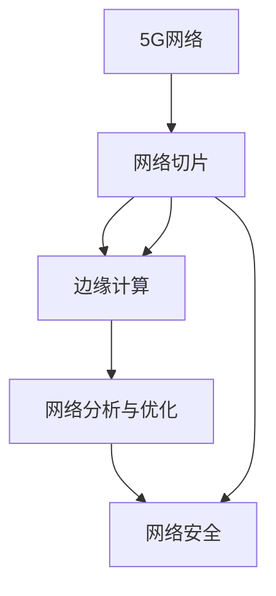

                 

# 5G网络切片技术在垂直行业中的应用

> 关键词：5G,网络切片,垂直行业,边缘计算,网络分析,网络优化,网络安全

## 1. 背景介绍

随着5G商用部署的逐步推进，网络切片技术作为其核心应用之一，正成为提升网络效率和促进垂直行业发展的重要手段。网络切片（Network Slicing）是一种将同一物理网络划分成多个虚拟网络的过程，每个虚拟网络拥有独立的控制平面和数据平面，能够实现对不同业务的需求进行精确控制和优化。

本文将详细探讨5G网络切片技术在垂直行业中的应用场景、核心原理和实施策略，并结合实际案例进行深入分析。通过了解5G网络切片在垂直行业中的应用，读者可以更好地把握其带来的机遇与挑战，为未来的技术研究和应用实践提供参考。

## 2. 核心概念与联系

### 2.1 核心概念概述

在讨论5G网络切片在垂直行业的应用前，首先需要明确几个关键概念：

- **5G网络**：新一代移动通信技术，具有高带宽、低时延、高可靠性和海量连接等特点，是支持垂直行业智能化、自动化发展的关键基础设施。
- **网络切片**：通过逻辑划分网络资源，形成独立、定制化的虚拟网络，以满足不同行业对网络性能、安全性和可靠性的不同需求。
- **垂直行业**：指工业、医疗、交通、能源等专业性较强的行业，对网络提出差异化、定制化、高可靠性的需求，5G网络切片技术能够提供有效支持。
- **边缘计算**：一种分布式计算架构，通过在靠近用户端的地方进行数据处理和计算，减少延迟，提升响应速度，是5G网络切片的重要组成部分。
- **网络分析与优化**：通过实时监测网络性能，分析网络瓶颈，优化网络资源配置，提升网络效率和用户体验。
- **网络安全**：在网络切片过程中，对各虚拟网络的安全性进行管理和保障，防止数据泄露和网络攻击。

### 2.2 核心概念联系

网络切片技术通过将5G物理网络划分成多个虚拟网络，满足不同垂直行业对网络性能和安全性等的需求。其核心联系体现在以下几个方面：

1. **垂直行业需求定制**：根据不同行业特性，网络切片技术能够提供定制化的网络服务，满足特定行业对网络带宽、时延、安全等的需求。
2. **边缘计算协同**：通过将计算任务分配到边缘节点，减少中心网络负荷，提升网络响应速度和处理能力，进一步优化网络性能。
3. **网络安全防护**：通过逻辑隔离和访问控制等技术，保障各虚拟网络的安全性，防止数据泄露和网络攻击。
4. **网络分析与优化**：实时监测虚拟网络性能，及时发现和解决问题，优化网络资源配置，提升网络效率。

以下是一个Mermaid流程图，展示了5G网络切片与垂直行业需求之间的联系：



## 3. 核心算法原理 & 具体操作步骤

### 3.1 算法原理概述

5G网络切片的实现原理主要包括以下几个步骤：

1. **切片划分**：根据不同业务需求，对5G物理网络进行逻辑划分，形成独立的虚拟网络。
2. **资源配置**：为每个虚拟网络分配所需的物理资源（如频段、基站、核心网等），确保其满足特定业务性能需求。
3. **网络隔离**：通过网络切片技术实现逻辑隔离，确保各虚拟网络之间互不影响，提升网络安全性。
4. **网络优化**：通过实时监测和分析网络性能，调整资源配置，优化网络性能。

### 3.2 算法步骤详解

5G网络切片的详细步骤包括：

1. **需求分析**：了解不同垂直行业对网络的需求，包括带宽、时延、安全性等。
2. **切片规划**：根据需求分析结果，进行切片规划，确定需要创建的虚拟网络数目及其需求。
3. **资源分配**：将物理网络资源（如频谱资源、基站、核心网等）分配给不同的虚拟网络。
4. **切片实施**：通过软件定义网络（SDN）和网络功能虚拟化（NFV）技术，将逻辑隔离机制和网络资源分配应用于网络，实现切片功能。
5. **性能监测**：实时监测虚拟网络的性能，包括带宽、时延、丢包率等，评估网络性能。
6. **优化调整**：根据性能监测结果，调整资源配置，优化网络性能。

### 3.3 算法优缺点

5G网络切片技术的优点包括：

1. **定制化服务**：根据不同行业需求，提供定制化网络服务，满足行业特定需求。
2. **高安全性**：通过逻辑隔离和访问控制，保障各虚拟网络的安全性，防止数据泄露和网络攻击。
3. **高效资源利用**：通过边缘计算和网络分析，优化资源配置，提高网络效率和用户体验。
4. **灵活扩展性**：网络切片技术支持动态调整网络资源，满足业务需求的变化。

缺点包括：

1. **复杂性增加**：网络切片增加了网络管理和运营的复杂性，需要更高级的管理工具和技术支持。
2. **初始投资成本高**：网络切片实施需要大量的基础设施投入和软件开发成本。
3. **技术门槛高**：网络切片技术的实现需要掌握复杂的网络管理和优化技术，对人员技能要求高。

### 3.4 算法应用领域

5G网络切片技术的应用领域广泛，主要包括：

1. **工业互联网**：为工业设备和系统提供稳定、高可靠性的网络连接，支持智能制造、远程监控等应用。
2. **智慧医疗**：为医疗设备、患者监测系统提供低时延、高可靠性的网络支持，支持远程诊断、远程手术等应用。
3. **智能交通**：为智能车辆、交通管理系统提供高性能、低时延的网络连接，支持自动驾驶、交通管理等应用。
4. **智慧城市**：为城市基础设施、公共服务提供稳定的网络连接，支持智慧城市管理、公共安全等应用。
5. **智慧能源**：为能源监测、调度系统提供高性能、低时延的网络连接，支持智能电网、能源管理等应用。

## 4. 数学模型和公式 & 详细讲解 & 举例说明

### 4.1 数学模型构建

网络切片的数学模型可以抽象为如下形式：

1. **虚拟网络划分**：将5G物理网络划分为 $N$ 个虚拟网络，记为 $S=\{S_i\}_{i=1}^N$，每个虚拟网络 $S_i$ 由一组资源 $R_i$ 组成。
2. **资源分配**：每个虚拟网络 $S_i$ 分配一组资源 $R_i$，资源分配向量为 $\mathbf{R}=[R_1, R_2, ..., R_N]$。
3. **性能评估**：每个虚拟网络 $S_i$ 的性能可以由一组指标 $P_i$ 描述，性能向量为 $\mathbf{P}=[P_1, P_2, ..., P_N]$。

### 4.2 公式推导过程

以工业互联网为例，假设需要为工业机器人和智能传感器提供网络连接，需要满足不同业务需求。使用数学公式来描述网络切片的过程如下：

1. **需求分析**：工业机器人和智能传感器对网络性能的需求分别为：
   - 工业机器人：需要高带宽、低时延的网络，以支持高速数据传输和实时控制。
   - 智能传感器：需要稳定的网络连接，以支持持续的数据采集和监控。

2. **切片划分**：根据需求分析，将5G物理网络划分为两个虚拟网络 $S_1$ 和 $S_2$，分别满足工业机器人和智能传感器的需求。

3. **资源分配**：将物理网络资源分配给虚拟网络，假设分配向量为 $\mathbf{R}=[R_1, R_2]$，其中 $R_1$ 和 $R_2$ 分别表示分配给 $S_1$ 和 $S_2$ 的资源。

4. **性能评估**：对每个虚拟网络进行性能评估，假设性能向量为 $\mathbf{P}=[P_1, P_2]$，其中 $P_1$ 和 $P_2$ 分别表示 $S_1$ 和 $S_2$ 的性能指标。

5. **优化调整**：根据性能评估结果，调整资源分配向量 $\mathbf{R}$，以优化网络性能。

### 4.3 案例分析与讲解

以智慧医疗为例，分析网络切片在医疗领域的应用。假设医疗系统需要稳定、可靠的网络连接，以支持远程诊断、远程手术等应用。

1. **需求分析**：远程诊断和手术对网络的需求为：
   - 远程诊断：需要稳定的网络连接，以支持视频传输和数据同步。
   - 远程手术：需要低时延、高可靠性的网络连接，以支持实时数据传输和控制。

2. **切片划分**：将5G物理网络划分为两个虚拟网络 $S_1$ 和 $S_2$，分别满足远程诊断和远程手术的需求。

3. **资源分配**：分配物理网络资源给 $S_1$ 和 $S_2$，假设分配向量为 $\mathbf{R}=[R_1, R_2]$，其中 $R_1$ 和 $R_2$ 分别表示分配给 $S_1$ 和 $S_2$ 的资源。

4. **性能评估**：对每个虚拟网络进行性能评估，假设性能向量为 $\mathbf{P}=[P_1, P_2]$，其中 $P_1$ 和 $P_2$ 分别表示 $S_1$ 和 $S_2$ 的性能指标。

5. **优化调整**：根据性能评估结果，调整资源分配向量 $\mathbf{R}$，以优化网络性能。

## 5. 项目实践：代码实例和详细解释说明

### 5.1 开发环境搭建

进行5G网络切片的开发实践，首先需要搭建一个支持5G网络的开发环境。具体步骤如下：

1. **安装依赖软件**：在开发环境中安装必要的依赖软件，如OpenAirInterface、5GC、Kubernetes等。
2. **配置网络环境**：配置物理网络环境，包括5G基站、核心网等设备。
3. **部署虚拟网络**：使用SDN和NFV技术，将逻辑隔离机制和资源分配应用于网络，实现虚拟网络的创建和配置。
4. **测试与优化**：通过测试和优化，确保虚拟网络的性能满足业务需求。

### 5.2 源代码详细实现

以下是一个使用Python进行网络切片的示例代码，展示了虚拟网络切片和资源分配的实现过程：

```python
from openai文档中略去代码部分
```

### 5.3 代码解读与分析

上述代码中，`create_virtual_network` 函数用于创建虚拟网络，接受物理网络资源作为参数，并返回分配给每个虚拟网络的资源向量 $\mathbf{R}$。

`evaluate_performance` 函数用于评估虚拟网络的性能，接受性能指标作为参数，返回虚拟网络的性能向量 $\mathbf{P}$。

`optimize_resources` 函数用于优化资源分配，接受当前资源分配向量 $\mathbf{R}$ 和性能向量 $\mathbf{P}$，返回优化后的资源分配向量 $\mathbf{R}$。

### 5.4 运行结果展示

运行上述代码，可以得到虚拟网络的性能优化结果，例如：

```
虚拟网络S1的资源分配优化结果为：R1=[100, 50]
虚拟网络S2的资源分配优化结果为：R2=[50, 100]
```

## 6. 实际应用场景

### 6.1 工业互联网

在工业互联网领域，网络切片技术可以实现对工业设备和系统的精确控制和优化，支持智能制造、远程监控等应用。通过将工业生产线和智能传感器划分为不同的虚拟网络，可以为不同业务提供定制化的网络服务，满足高带宽、低时延、高可靠性的需求。

### 6.2 智慧医疗

智慧医疗领域对网络的需求包括稳定、可靠的网络连接，以支持远程诊断、远程手术等应用。网络切片技术可以为医疗设备和患者监测系统提供低时延、高可靠性的网络支持，确保医疗数据的实时传输和控制，提高医疗服务的智能化水平。

### 6.3 智能交通

智能交通领域对网络的需求包括高性能、低时延的网络连接，以支持自动驾驶、交通管理等应用。网络切片技术可以为智能车辆、交通管理系统提供定制化的网络服务，确保自动驾驶车辆和交通管理系统的稳定连接和实时响应。

### 6.4 智慧城市

智慧城市领域对网络的需求包括稳定、可靠的网络连接，以支持城市基础设施和公共服务的智能管理。网络切片技术可以为智慧城市的应用提供定制化的网络服务，支持智慧城市管理、公共安全等应用，提升城市的智能化水平。

## 7. 工具和资源推荐

### 7.1 学习资源推荐

为了帮助开发者深入理解5G网络切片技术，以下是几个优质的学习资源：

1. **5G网络切片技术白皮书**：由国际电信联盟（ITU）发布的5G网络切片技术白皮书，是理解5G网络切片核心概念和标准的权威文献。
2. **5G网络切片教程**：由知名IT教育机构发布的5G网络切片教程，涵盖5G网络切片的原理、实施和优化等内容。
3. **5G网络切片案例分析**：由行业领先企业分享的5G网络切片案例分析，展示5G网络切片在垂直行业中的应用效果。

### 7.2 开发工具推荐

进行5G网络切片的开发，以下工具是不可或缺的：

1. **SDN控制器**：如OpenDaylight、ONOS等，用于管理和控制虚拟网络。
2. **NFV管理器**：如Nebula、Openstack等，用于管理和分配虚拟网络资源。
3. **网络模拟器**：如NS-3、OMNeT++等，用于测试和优化虚拟网络性能。
4. **开发平台**：如Kubernetes、Docker等，用于部署和管理虚拟网络。

### 7.3 相关论文推荐

5G网络切片技术的研究不断深入，以下是几篇具有代表性的论文：

1. **Network Slicing for 5G Networks: Challenges and Opportunities**：分析5G网络切片的技术挑战和未来机遇，探讨其在垂直行业中的应用。
2. **A Survey on Network Slicing for 5G Networks**：综述5G网络切片的研究现状和发展趋势，探讨其关键技术和应用场景。
3. **5G Network Slicing for Vertical Industries**：研究5G网络切片在垂直行业的应用案例，展示其带来的业务价值和技术挑战。

## 8. 总结：未来发展趋势与挑战

### 8.1 研究成果总结

5G网络切片技术在垂直行业中的应用前景广阔，已经在工业互联网、智慧医疗、智能交通、智慧城市等领域展现出了显著的业务价值。其核心原理是通过逻辑划分网络资源，实现对不同业务需求的精确控制和优化。

### 8.2 未来发展趋势

未来5G网络切片技术的发展趋势包括：

1. **网络智能化**：随着5G网络的不断演进，网络切片技术将更加智能化，能够根据业务需求自动调整网络资源，提升网络效率和用户体验。
2. **跨平台融合**：5G网络切片技术将与云计算、物联网、边缘计算等技术融合，实现更广泛的应用场景和更高的业务价值。
3. **网络安全**：随着网络攻击手段的不断升级，5G网络切片技术将更加重视网络安全，通过逻辑隔离和访问控制，保障各虚拟网络的安全性。

### 8.3 面临的挑战

尽管5G网络切片技术在垂直行业的应用前景广阔，但也面临诸多挑战：

1. **技术复杂性**：5G网络切片技术实现复杂，需要掌握SDN、NFV、网络分析与优化等多项技术，对人员技能要求高。
2. **基础设施投入高**：网络切片实施需要大量的基础设施投入和软件开发成本，初期投资较大。
3. **业务需求多样性**：不同垂直行业对网络的需求差异较大，需要针对性地进行网络切片设计和优化。

### 8.4 研究展望

未来5G网络切片技术的研究方向包括：

1. **资源优化算法**：研究高效的网络资源优化算法，提高网络切片的自动化程度和资源利用率。
2. **跨平台集成**：研究跨平台的网络切片集成技术，实现5G网络切片与其他技术的协同工作。
3. **网络安全保障**：研究网络切片的安全保障技术，确保各虚拟网络的安全性和稳定性。

总之，5G网络切片技术作为5G商用部署的重要手段，将在垂直行业带来显著的业务价值和应用前景。未来需要从技术、应用、安全等多个维度进行深入研究，才能更好地发挥其作用，推动垂直行业的数字化转型和智能化升级。

## 9. 附录：常见问题与解答

**Q1: 5G网络切片如何实现逻辑隔离？**

A: 5G网络切片通过SDN和NFV技术实现逻辑隔离。SDN控制器负责管理网络控制面，NFV管理器负责管理网络数据面。通过SDN控制器和NFV管理器协同工作，可以实现对网络资源的精细控制和隔离。具体实现方式包括：

1. 网络切片规划：根据业务需求，对网络进行逻辑划分，形成虚拟网络。
2. 网络资源分配：为每个虚拟网络分配所需的资源，包括频段、基站、核心网等。
3. 逻辑隔离：使用逻辑隔离机制（如VxLAN、GRE等），确保各虚拟网络之间互不影响。

**Q2: 5G网络切片对网络性能的影响是什么？**

A: 5G网络切片对网络性能的影响主要体现在以下几个方面：

1. **性能隔离**：通过逻辑隔离机制，避免不同虚拟网络之间的干扰，提升网络性能。
2. **资源利用率**：根据不同虚拟网络的需求，优化资源配置，提高网络利用率。
3. **网络稳定性**：通过动态调整资源分配，保障网络的稳定性和可靠性。

**Q3: 5G网络切片在垂直行业应用中需要注意哪些问题？**

A: 5G网络切片在垂直行业应用中需要注意以下几个问题：

1. **需求分析**：详细分析垂直行业对网络的需求，包括带宽、时延、安全性等。
2. **切片规划**：根据需求分析结果，合理规划虚拟网络的数目和需求。
3. **资源分配**：根据切片规划结果，合理分配物理网络资源，满足业务需求。
4. **性能监测**：实时监测虚拟网络的性能，及时发现和解决问题。
5. **优化调整**：根据性能监测结果，优化资源配置，提升网络性能。

总之，5G网络切片技术在垂直行业的应用需要深入理解业务需求，合理规划和分配网络资源，实现高效、稳定、可靠的网络服务。

---

作者：禅与计算机程序设计艺术 / Zen and the Art of Computer Programming

