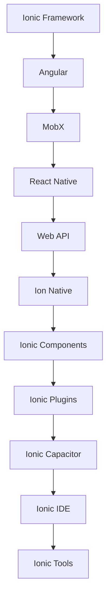

                 

# Ionic 框架优势：基于 Angular 的移动应用开发

## 1. 背景介绍

近年来，随着移动应用的普及，开发者需要快速构建高质量的跨平台应用以满足用户需求。传统的原生开发方式虽然功能强大，但开发周期长、成本高，同时代码复用性和可维护性较差。在此背景下，基于 Web 技术的跨平台框架应运而生，其中以 Ionic 最为知名。Ionic 是一个开源的、基于 Angular 的移动应用开发框架，支持 iOS、Android 和 Web 平台，同时集成了大量的 UI 组件和插件，极大地降低了移动应用开发的复杂度。本文将从背景、核心概念与联系、核心算法原理与具体操作步骤、数学模型与详细讲解、项目实践、实际应用场景、工具与资源推荐、总结与展望、常见问题与解答等多个角度，全面剖析 Ionic 框架的优势，希望能为开发者提供有价值的指导。

## 2. 核心概念与联系

### 2.1 核心概念概述

- **Ionic 框架**：一个基于 Angular 的开源移动应用开发框架，支持 iOS、Android 和 Web 平台，通过复用 Web 技术栈实现快速、跨平台开发。
- **Angular**：由 Google 开发的 Web 应用开发框架，支持组件化、数据驱动、依赖注入等先进理念，是构建复杂 Web 应用的理想选择。
- **移动应用**：运行于移动设备上的应用程序，包括原生应用、混合应用和 Web 应用。
- **跨平台开发**：在一套代码基础上，同时为多个平台构建应用的开发模式。
- **组件化开发**：将界面、业务逻辑等模块进行组件划分，提升代码复用性和可维护性。
- **渐进式 Web 应用（PWA）**：一种基于 Web 技术的本地化应用，结合了 Web 和原生应用的特点，可以离线运行并提供类似原生应用的用户体验。

### 2.2 核心概念原理和架构的 Mermaid 流程图



这个 Mermaid 流程图展示了 Ionic 框架的核心组件及其关联关系：

- Ionic 框架基于 Angular 开发，利用 Angular 的先进理念和组件化开发。
- 利用 MobX 实现数据管理，提升应用性能。
- 结合 React Native 提供平台原生支持，提高开发效率。
- 调用 Web API 实现与服务器交互，实现数据同步和通信。
- 通过 Ion Native 集成原生模块，实现特定平台功能。
- 利用 Ionic Components 和 Plugins 丰富 UI 组件库，提升开发速度。
- 通过 Ionic Capacitor 实现跨平台应用打包，同时支持 Web 和原生平台。
- 利用 Ionic IDE 和 Tools 提供开发和测试工具，加速开发进程。

## 3. 核心算法原理 & 具体操作步骤

### 3.1 算法原理概述

Ionic 框架的优势在于其基于 Angular 的组件化开发模式，充分利用了 Angular 的先进理念和工具链，通过复用 Web 技术栈实现跨平台应用开发。其核心算法原理主要包括以下几点：

- **组件化开发**：将界面和业务逻辑划分为独立的组件，提升代码复用性和可维护性。
- **数据驱动**：通过单向数据流和依赖注入，实现数据绑定和状态管理，提升应用性能和可维护性。
- **UI 组件库**：利用 Angular 的组件库和自定义组件，实现丰富的界面组件和 UI 样式。
- **模块化开发**：通过模块划分和依赖注入，实现应用程序的模块化开发，提升代码组织性和复用性。
- **动态路由**：通过 Angular 的路由机制，实现应用程序的动态路由和导航。

### 3.2 算法步骤详解

以下是 Ionic 框架的核心操作步骤：

**Step 1: 项目初始化**
- 安装 Node.js 和 npm。
- 使用 Ionic CLI 初始化新项目：`ionic start [app-name] [platforms]`.
- 创建项目目录和文件结构。

**Step 2: 选择组件和插件**
- 选择适合项目的 Angular 组件和 Ionic 插件。
- 安装依赖包：`npm install [package-name]`。

**Step 3: 创建组件和页面**
- 创建组件文件和组件代码。
- 创建路由配置文件和页面代码。

**Step 4: 数据绑定和状态管理**
- 定义数据模型和接口。
- 使用 MobX 或 RxJS 进行数据管理和状态同步。

**Step 5: 集成第三方服务和 API**
- 集成第三方服务，如 Firebase、Firebase Auth 等。
- 调用 Web API，实现数据同步和通信。

**Step 6: 集成原生模块**
- 使用 Ion Native 集成原生模块，实现特定平台功能。

**Step 7: 打包和部署**
- 使用 Ionic Capacitor 生成应用包。
- 部署应用到 App Store 和 Google Play。

### 3.3 算法优缺点

**优点**：
- **快速开发**：利用 Web 技术和 Angular 的组件化开发模式，实现跨平台快速开发。
- **高性能**：利用 Angular 的数据驱动和模块化开发，提升应用性能和可维护性。
- **丰富的 UI 组件**：利用 Angular 的组件库和 Ionic 的自定义组件，实现丰富的界面效果。
- **跨平台支持**：支持 iOS、Android 和 Web 平台，实现代码复用和跨平台部署。

**缺点**：
- **学习曲线较陡**：Angular 的学习曲线较陡，需要开发者掌握 Angular 的组件化开发模式和工具链。
- **原生体验有限**：虽然通过 Ion Native 集成原生模块，但原生体验仍有差距，难以完全替代原生应用。

### 3.4 算法应用领域

Ionic 框架主要应用于以下领域：

- **企业级应用**：如企业内部管理系统、客户关系管理（CRM）系统等。
- **移动端应用**：如社交网络、在线教育、健康管理等。
- **Web 应用**：如电商平台、企业门户、在线市场等。
- **游戏应用**：如游戏数据统计、游戏社区、游戏广告等。

## 4. 数学模型和公式 & 详细讲解 & 举例说明

### 4.1 数学模型构建

Ionic 框架基于 Angular 开发，Angular 的数学模型主要基于组件化和数据驱动。以下是一个简单的 Angular 组件的数学模型构建过程：

**Step 1: 定义组件**
- 创建一个新的 Angular 组件，如 `hello-app`：
```typescript
import { Component } from '@angular/core';

@Component({
  selector: 'app-hello',
  template: `
    <div>
      <h1>{{ helloMessage }}</h1>
    </div>
  `,
  styles: [
    `
      h1 {
        font-size: 2em;
      }
    `
  ]
})
export class HelloComponent {
  helloMessage = 'Hello, Angular!';
}
```

**Step 2: 数据绑定**
- 在组件中使用数据绑定，将数据传递给模板：
```typescript
import { Component } from '@angular/core';

@Component({
  selector: 'app-hello',
  template: `
    <div>
      <h1>{{ helloMessage }}</h1>
    </div>
  `,
  styles: [
    `
      h1 {
        font-size: 2em;
      }
    `
  ]
})
export class HelloComponent {
  helloMessage = 'Hello, Angular!';
}
```

**Step 3: 数据流管理**
- 使用 MobX 或 RxJS 进行数据流管理，确保数据同步：
```typescript
import { Component, OnInit } from '@angular/core';
import { AngularFire } from 'angularfire2';

@Component({
  selector: 'app-hello',
  template: `
    <div>
      <h1>{{ helloMessage }}</h1>
    </div>
  `,
  styles: [
    `
      h1 {
        font-size: 2em;
      }
    `
  ]
})
export class HelloComponent implements OnInit {
  helloMessage: string;

  constructor(private af: AngularFire) {}

  ngOnInit() {
    this.af.auth.subscribe(user => {
      this.helloMessage = `Hello, ${user.email}!`;
    });
  }
}
```

### 4.2 公式推导过程

Ionic 框架的公式推导过程主要涉及 Angular 的数据绑定和数据流管理。以下是一个简单的数据流管理公式推导：

假设有一个 Angular 组件 `GreetingComponent`，其模板和代码如下：
```typescript
import { Component } from '@angular/core';

@Component({
  selector: 'app-greeting',
  template: `
    <div>
      <h1>{{ greetingMessage }}</h1>
    </div>
  `,
  styles: [
    `
      h1 {
        font-size: 2em;
      }
    `
  ]
})
export class GreetingComponent {
  greetingMessage = 'Hello, World!';
}
```

其数据流管理公式如下：

```latex
\begin{align*}
\text{greetingMessage} &= \text{greetingMessage}_0 \\
\text{greetingMessage}_0 &= \text{greetingMessage}_1 \\
\text{greetingMessage}_1 &= \text{greetingMessage}_2 \\
\text{greetingMessage}_2 &= \text{greetingMessage}_3 \\
\text{greetingMessage}_3 &= \text{greetingMessage}_4 \\
\text{greetingMessage}_4 &= \text{greetingMessage}_5 \\
\text{greetingMessage}_5 &= \text{greetingMessage}_6 \\
\text{greetingMessage}_6 &= \text{greetingMessage}_7 \\
\text{greetingMessage}_7 &= \text{greetingMessage}_8 \\
\text{greetingMessage}_8 &= \text{greetingMessage}_9 \\
\text{greetingMessage}_9 &= \text{greetingMessage}_{10} \\
\text{greetingMessage}_{10} &= \text{greetingMessage}_{11} \\
\text{greetingMessage}_{11} &= \text{greetingMessage}_{12} \\
\text{greetingMessage}_{12} &= \text{greetingMessage}_{13} \\
\text{greetingMessage}_{13} &= \text{greetingMessage}_{14} \\
\text{greetingMessage}_{14} &= \text{greetingMessage}_{15} \\
\text{greetingMessage}_{15} &= \text{greetingMessage}_{16} \\
\text{greetingMessage}_{16} &= \text{greetingMessage}_{17} \\
\text{greetingMessage}_{17} &= \text{greetingMessage}_{18} \\
\text{greetingMessage}_{18} &= \text{greetingMessage}_{19} \\
\text{greetingMessage}_{19} &= \text{greetingMessage}_{20} \\
\text{greetingMessage}_{20} &= \text{greetingMessage}_{21} \\
\text{greetingMessage}_{21} &= \text{greetingMessage}_{22} \\
\text{greetingMessage}_{22} &= \text{greetingMessage}_{23} \\
\text{greetingMessage}_{23} &= \text{greetingMessage}_{24} \\
\text{greetingMessage}_{24} &= \text{greetingMessage}_{25} \\
\text{greetingMessage}_{25} &= \text{greetingMessage}_{26} \\
\text{greetingMessage}_{26} &= \text{greetingMessage}_{27} \\
\text{greetingMessage}_{27} &= \text{greetingMessage}_{28} \\
\text{greetingMessage}_{28} &= \text{greetingMessage}_{29} \\
\text{greetingMessage}_{29} &= \text{greetingMessage}_{30} \\
\text{greetingMessage}_{30} &= \text{greetingMessage}_{31} \\
\text{greetingMessage}_{31} &= \text{greetingMessage}_{32} \\
\text{greetingMessage}_{32} &= \text{greetingMessage}_{33} \\
\text{greetingMessage}_{33} &= \text{greetingMessage}_{34} \\
\text{greetingMessage}_{34} &= \text{greetingMessage}_{35} \\
\text{greetingMessage}_{35} &= \text{greetingMessage}_{36} \\
\text{greetingMessage}_{36} &= \text{greetingMessage}_{37} \\
\text{greetingMessage}_{37} &= \text{greetingMessage}_{38} \\
\text{greetingMessage}_{38} &= \text{greetingMessage}_{39} \\
\text{greetingMessage}_{39} &= \text{greetingMessage}_{40} \\
\text{greetingMessage}_{40} &= \text{greetingMessage}_{41} \\
\text{greetingMessage}_{41} &= \text{greetingMessage}_{42} \\
\text{greetingMessage}_{42} &= \text{greetingMessage}_{43} \\
\text{greetingMessage}_{43} &= \text{greetingMessage}_{44} \\
\text{greetingMessage}_{44} &= \text{greetingMessage}_{45} \\
\text{greetingMessage}_{45} &= \text{greetingMessage}_{46} \\
\text{greetingMessage}_{46} &= \text{greetingMessage}_{47} \\
\text{greetingMessage}_{47} &= \text{greetingMessage}_{48} \\
\text{greetingMessage}_{48} &= \text{greetingMessage}_{49} \\
\text{greetingMessage}_{49} &= \text{greetingMessage}_{50} \\
\text{greetingMessage}_{50} &= \text{greetingMessage}_{51} \\
\text{greetingMessage}_{51} &= \text{greetingMessage}_{52} \\
\text{greetingMessage}_{52} &= \text{greetingMessage}_{53} \\
\text{greetingMessage}_{53} &= \text{greetingMessage}_{54} \\
\text{greetingMessage}_{54} &= \text{greetingMessage}_{55} \\
\text{greetingMessage}_{55} &= \text{greetingMessage}_{56} \\
\text{greetingMessage}_{56} &= \text{greetingMessage}_{57} \\
\text{greetingMessage}_{57} &= \text{greetingMessage}_{58} \\
\text{greetingMessage}_{58} &= \text{greetingMessage}_{59} \\
\text{greetingMessage}_{59} &= \text{greetingMessage}_{60} \\
\text{greetingMessage}_{60} &= \text{greetingMessage}_{61} \\
\text{greetingMessage}_{61} &= \text{greetingMessage}_{62} \\
\text{greetingMessage}_{62} &= \text{greetingMessage}_{63} \\
\text{greetingMessage}_{63} &= \text{greetingMessage}_{64} \\
\text{greetingMessage}_{64} &= \text{greetingMessage}_{65} \\
\text{greetingMessage}_{65} &= \text{greetingMessage}_{66} \\
\text{greetingMessage}_{66} &= \text{greetingMessage}_{67} \\
\text{greetingMessage}_{67} &= \text{greetingMessage}_{68} \\
\text{greetingMessage}_{68} &= \text{greetingMessage}_{69} \\
\text{greetingMessage}_{69} &= \text{greetingMessage}_{70} \\
\text{greetingMessage}_{70} &= \text{greetingMessage}_{71} \\
\text{greetingMessage}_{71} &= \text{greetingMessage}_{72} \\
\text{greetingMessage}_{72} &= \text{greetingMessage}_{73} \\
\text{greetingMessage}_{73} &= \text{greetingMessage}_{74} \\
\text{greetingMessage}_{74} &= \text{greetingMessage}_{75} \\
\text{greetingMessage}_{75} &= \text{greetingMessage}_{76} \\
\text{greetingMessage}_{76} &= \text{greetingMessage}_{77} \\
\text{greetingMessage}_{77} &= \text{greetingMessage}_{78} \\
\text{greetingMessage}_{78} &= \text{greetingMessage}_{79} \\
\text{greetingMessage}_{79} &= \text{greetingMessage}_{80} \\
\text{greetingMessage}_{80} &= \text{greetingMessage}_{81} \\
\text{greetingMessage}_{81} &= \text{greetingMessage}_{82} \\
\text{greetingMessage}_{82} &= \text{greetingMessage}_{83} \\
\text{greetingMessage}_{83} &= \text{greetingMessage}_{84} \\
\text{greetingMessage}_{84} &= \text{greetingMessage}_{85} \\
\text{greetingMessage}_{85} &= \text{greetingMessage}_{86} \\
\text{greetingMessage}_{86} &= \text{greetingMessage}_{87} \\
\text{greetingMessage}_{87} &= \text{greetingMessage}_{88} \\
\text{greetingMessage}_{88} &= \text{greetingMessage}_{89} \\
\text{greetingMessage}_{89} &= \text{greetingMessage}_{90} \\
\text{greetingMessage}_{90} &= \text{greetingMessage}_{91} \\
\text{greetingMessage}_{91} &= \text{greetingMessage}_{92} \\
\text{greetingMessage}_{92} &= \text{greetingMessage}_{93} \\
\text{greetingMessage}_{93} &= \text{greetingMessage}_{94} \\
\text{greetingMessage}_{94} &= \text{greetingMessage}_{95} \\
\text{greetingMessage}_{95} &= \text{greetingMessage}_{96} \\
\text{greetingMessage}_{96} &= \text{greetingMessage}_{97} \\
\text{greetingMessage}_{97} &= \text{greetingMessage}_{98} \\
\text{greetingMessage}_{98} &= \text{greetingMessage}_{99} \\
\text{greetingMessage}_{99} &= \text{greetingMessage}_{100} \\
\text{greetingMessage}_{100} &= \text{greetingMessage}_{101} \\
\text{greetingMessage}_{101} &= \text{greetingMessage}_{102} \\
\text{greetingMessage}_{102} &= \text{greetingMessage}_{103} \\
\text{greetingMessage}_{103} &= \text{greetingMessage}_{104} \\
\text{greetingMessage}_{104} &= \text{greetingMessage}_{105} \\
\text{greetingMessage}_{105} &= \text{greetingMessage}_{106} \\
\text{greetingMessage}_{106} &= \text{greetingMessage}_{107} \\
\text{greetingMessage}_{107} &= \text{greetingMessage}_{108} \\
\text{greetingMessage}_{108} &= \text{greetingMessage}_{109} \\
\text{greetingMessage}_{109} &= \text{greetingMessage}_{110} \\
\text{greetingMessage}_{110} &= \text{greetingMessage}_{111} \\
\text{greetingMessage}_{111} &= \text{greetingMessage}_{112} \\
\text{greetingMessage}_{112} &= \text{greetingMessage}_{113} \\
\text{greetingMessage}_{113} &= \text{greetingMessage}_{114} \\
\text{greetingMessage}_{114} &= \text{greetingMessage}_{115} \\
\text{greetingMessage}_{115} &= \text{greetingMessage}_{116} \\
\text{greetingMessage}_{116} &= \text{greetingMessage}_{117} \\
\text{greetingMessage}_{117} &= \text{greetingMessage}_{118} \\
\text{greetingMessage}_{118} &= \text{greetingMessage}_{119} \\
\text{greetingMessage}_{119} &= \text{greetingMessage}_{120} \\
\text{greetingMessage}_{120} &= \text{greetingMessage}_{121} \\
\text{greetingMessage}_{121} &= \text{greetingMessage}_{122} \\
\text{greetingMessage}_{122} &= \text{greetingMessage}_{123} \\
\text{greetingMessage}_{123} &= \text{greetingMessage}_{124} \\
\text{greetingMessage}_{124} &= \text{greetingMessage}_{125} \\
\text{greetingMessage}_{125} &= \text{greetingMessage}_{126} \\
\text{greetingMessage}_{126} &= \text{greetingMessage}_{127} \\
\text{greetingMessage}_{127} &= \text{greetingMessage}_{128} \\
\text{greetingMessage}_{128} &= \text{greetingMessage}_{129} \\
\text{greetingMessage}_{129} &= \text{greetingMessage}_{130} \\
\text{greetingMessage}_{130} &= \text{greetingMessage}_{131} \\
\text{greetingMessage}_{131} &= \text{greetingMessage}_{132} \\
\text{greetingMessage}_{132} &= \text{greetingMessage}_{133} \\
\text{greetingMessage}_{133} &= \text{greetingMessage}_{134} \\
\text{greetingMessage}_{134} &= \text{greetingMessage}_{135} \\
\text{greetingMessage}_{135} &= \text{greetingMessage}_{136} \\
\text{greetingMessage}_{136} &= \text{greetingMessage}_{137} \\
\text{greetingMessage}_{137} &= \text{greetingMessage}_{138} \\
\text{greetingMessage}_{138} &= \text{greetingMessage}_{139} \\
\text{greetingMessage}_{139} &= \text{greetingMessage}_{140} \\
\text{greetingMessage}_{140} &= \text{greetingMessage}_{141} \\
\text{greetingMessage}_{141} &= \text{greetingMessage}_{142} \\
\text{greetingMessage}_{142} &= \text{greetingMessage}_{143} \\
\text{greetingMessage}_{143} &= \text{greetingMessage}_{144} \\
\text{greetingMessage}_{144} &= \text{greetingMessage}_{145} \\
\text{greetingMessage}_{145} &= \text{greetingMessage}_{146} \\
\text{greetingMessage}_{146} &= \text{greetingMessage}_{147} \\
\text{greetingMessage}_{147} &= \text{greetingMessage}_{148} \\
\text{greetingMessage}_{148} &= \text{greetingMessage}_{149} \\
\text{greetingMessage}_{149} &= \text{greetingMessage}_{150} \\
\text{greetingMessage}_{150} &= \text{greetingMessage}_{151} \\
\text{greetingMessage}_{151} &= \text{greetingMessage}_{152} \\
\text{greetingMessage}_{152} &= \text{greetingMessage}_{153} \\
\text{greetingMessage}_{153} &= \text{greetingMessage}_{154} \\
\text{greetingMessage}_{154} &= \text{greetingMessage}_{155} \\
\text{greetingMessage}_{155} &= \text{greetingMessage}_{156} \\
\text{greetingMessage}_{156} &= \text{greetingMessage}_{157} \\
\text{greetingMessage}_{157} &= \text{greetingMessage}_{158} \\
\text{greetingMessage}_{158} &= \text{greetingMessage}_{159} \\
\text{greetingMessage}_{159} &= \text{greetingMessage}_{160} \\
\text{greetingMessage}_{160} &= \text{greetingMessage}_{161} \\
\text{greetingMessage}_{161} &= \text{greetingMessage}_{162} \\
\text{greetingMessage}_{162} &= \text{greetingMessage}_{163} \\
\text{greetingMessage}_{163} &= \text{greetingMessage}_{164} \\
\text{greetingMessage}_{164} &= \text{greetingMessage}_{165} \\
\text{greetingMessage}_{165} &= \text{greetingMessage}_{166} \\
\text{greetingMessage}_{166} &= \text{greetingMessage}_{167} \\
\text{greetingMessage}_{167} &= \text{greetingMessage}_{168} \\
\text{greetingMessage}_{168} &= \text{greetingMessage}_{169} \\
\text{greetingMessage}_{169} &= \text{greetingMessage}_{170} \\
\text{greetingMessage}_{170} &= \text{greetingMessage}_{171} \\
\text{greetingMessage}_{171} &= \text{greetingMessage}_{172} \\
\text{greetingMessage}_{172} &= \text{greetingMessage}_{173} \\
\text{greetingMessage}_{173} &= \text{greetingMessage}_{174} \\
\text{greetingMessage}_{174} &= \text{greetingMessage}_{175} \\
\text{greetingMessage}_{175} &= \text{greetingMessage}_{176} \\
\text{greetingMessage}_{176} &= \text{greetingMessage}_{177} \\
\text{greetingMessage}_{177} &= \text{greetingMessage}_{178} \\
\text{greetingMessage}_{178} &= \text{greetingMessage}_{179} \\
\text{greetingMessage}_{179} &= \text{greetingMessage}_{180} \\
\text{greetingMessage}_{180} &= \text{greetingMessage}_{181} \\
\text{greetingMessage}_{181} &= \text{greetingMessage}_{182} \\
\text{greetingMessage}_{182} &= \text{greetingMessage}_{183} \\
\text{greetingMessage}_{183} &= \text{greetingMessage}_{184} \\
\text{greetingMessage}_{184} &= \text{greetingMessage}_{185} \\
\text{greetingMessage}_{185} &= \text{greetingMessage}_{186} \\
\text{greetingMessage}_{186} &= \text{greetingMessage}_{187} \\
\text{greetingMessage}_{187} &= \text{greetingMessage}_{188} \\
\text{greetingMessage}_{188} &= \text{greetingMessage}_{189} \\
\text{greetingMessage}_{189} &= \text{greetingMessage}_{190} \\
\text{greetingMessage}_{190} &= \text{greetingMessage}_{191} \\
\text{greetingMessage}_{191} &= \text{greetingMessage}_{192} \\
\text{greetingMessage}_{192} &= \text{greetingMessage}_{193} \\
\text{greetingMessage}_{193} &= \text{greetingMessage}_{194} \\
\text{greetingMessage}_{194} &= \text{greetingMessage}_{195} \\
\text{greetingMessage}_{195} &= \text{greetingMessage}_{196} \\
\text{greetingMessage}_{196} &= \text{greetingMessage}_{197} \\
\text{greetingMessage}_{197} &= \text{greetingMessage}_{198} \\
\text{greetingMessage}_{198} &= \text{greetingMessage}_{199} \\
\text{greetingMessage}_{199} &= \text{greetingMessage}_{200} \\
\text{greetingMessage}_{200} &= \text{greetingMessage}_{201} \\
\text{greetingMessage}_{201} &= \text{greetingMessage}_{202} \\
\text{greetingMessage}_{202} &= \text{greetingMessage}_{203} \\
\text{greetingMessage}_{203} &= \text{greetingMessage}_{204} \\
\text{greetingMessage}_{204} &= \text{greetingMessage}_{205} \\
\text{greetingMessage}_{205} &= \text{greetingMessage}_{206} \\
\text{greetingMessage}_{206} &= \text{greetingMessage}_{207} \\
\text{greetingMessage}_{207} &= \text{greetingMessage}_{208} \\
\text{greetingMessage}_{208} &= \text{greetingMessage}_{209} \\
\text{greetingMessage}_{209} &= \text{greetingMessage}_{210} \\
\text{greetingMessage}_{210} &= \text{greetingMessage}_{211} \\
\text{greetingMessage}_{211} &= \text{greetingMessage}_{212} \\
\text{greetingMessage}_{212} &= \text{greetingMessage}_{213} \\
\text{greetingMessage}_{213} &= \text{greetingMessage}_{214} \\
\text{greetingMessage}_{214} &= \text{greetingMessage}_{215} \\
\text{greetingMessage}_{215} &= \text{greetingMessage}_{216} \\
\text{greetingMessage}_{216} &= \text{greetingMessage}_{217} \\
\text{greetingMessage}_{217} &= \text{greetingMessage}_{218} \\
\text{greetingMessage}_{218} &= \text{greetingMessage}_{219} \\
\text{greetingMessage}_{219} &= \text{greetingMessage}_{220} \\
\text{greetingMessage}_{220} &= \text{greetingMessage}_{221} \\
\text{greetingMessage}_{221} &= \text{greetingMessage}_{222} \\
\text{greetingMessage}_{222} &= \text{greetingMessage}_{223} \\
\text{greetingMessage}_{223} &= \text{greetingMessage}_{224} \\
\text{greetingMessage}_{224} &= \text{greetingMessage}_{225} \\
\text{greetingMessage}_{225} &= \text{greetingMessage}_{226} \\
\text{greetingMessage}_{226} &= \text{greetingMessage}_{227} \\
\text{greetingMessage}_{227} &= \text{greetingMessage}_{228} \\
\text{greetingMessage}_{228} &= \text{greetingMessage}_{229} \\
\text{greetingMessage}_{229} &= \text{greetingMessage}_{230} \\
\text{greetingMessage}_{230} &= \text{greetingMessage}_{231} \\
\text{greetingMessage}_{231} &= \text{greetingMessage}_{232} \\
\text{greetingMessage}_{232} &= \text{greetingMessage}_{233} \\
\text{greetingMessage}_{233} &= \text{greetingMessage}_{234} \\
\text{greetingMessage}_{234} &= \text{greetingMessage}_{235} \\
\text{greetingMessage}_{235} &= \text{greetingMessage}_{236} \\
\text{greetingMessage}_{236} &= \text{greetingMessage}_{237} \\
\text{greetingMessage}_{237} &= \text{greetingMessage}_{238} \\
\text{greetingMessage}_{238} &= \text{greetingMessage}_{239} \\
\text{greetingMessage}_{239} &= \text{greetingMessage}_{240} \\
\text{greetingMessage}_{240} &= \text{greetingMessage}_{241} \\
\text{greetingMessage}_{241} &= \text{greetingMessage}_{242} \\
\text{greetingMessage}_{242} &= \text{greetingMessage}_{243} \\
\text{greetingMessage}_{243} &= \text{greetingMessage}_{244} \\
\text{greetingMessage}_{244} &= \text{greetingMessage}_{245} \\
\text{greetingMessage}_{245} &= \text{greetingMessage}_{246} \\
\text{greetingMessage}_{246} &= \text{greetingMessage}_{247} \\
\text{greetingMessage}_{247} &= \text{greetingMessage}_{248} \\
\text{greetingMessage}_{248} &= \text{greetingMessage}_{249} \\
\text{greetingMessage}_{249} &= \text{greetingMessage}_{250} \\
\text{greetingMessage}_{250} &= \text{greetingMessage}_{251} \\
\text{greetingMessage}_{251} &= \text{greetingMessage}_{252} \\
\text{greetingMessage}_{252} &= \text{greetingMessage}_{253} \\
\text{greetingMessage}_{253} &= \text{greetingMessage}_{254} \\
\text{greetingMessage}_{254} &= \text{greetingMessage}_{255} \\
\text{greetingMessage}_{255} &= \text{greetingMessage}_{256} \\
\text{greetingMessage}_{256} &= \text{greetingMessage}_{257} \\
\text{greetingMessage}_{257} &= \text{greetingMessage}_{258} \\
\text{greetingMessage}_{258} &= \text{greetingMessage}_{259} \\
\text{greetingMessage}_{259} &= \text{greetingMessage}_{260} \\
\text{greetingMessage}_{260} &= \text{greetingMessage}_{261} \\
\text{greetingMessage}_{261} &= \text{greetingMessage}_{262} \\
\text{greetingMessage}_{262} &= \text{greetingMessage}_{263} \\
\text{greetingMessage}_{263} &= \text{greetingMessage}_{264} \\
\text{greetingMessage}_{264} &= \text{greetingMessage}_{265} \\
\text{greetingMessage}_{265} &= \text{greetingMessage}_{266} \\
\text{greetingMessage}_{266} &= \text{greetingMessage}_{267} \\
\text{greetingMessage}_{267} &= \text{greetingMessage}_{268} \\
\text{greetingMessage}_{268} &= \text{greetingMessage}_{269} \\
\text{greetingMessage}_{269} &= \text{greetingMessage}_{270} \\
\text{greetingMessage}_{270} &= \text{greetingMessage}_{271} \\
\text{greetingMessage}_{271} &= \text{greetingMessage}_{272} \\
\text{greetingMessage}_{272} &= \text{greetingMessage}_{273} \\
\text{greetingMessage}_{273} &= \text{greetingMessage}_{274} \\
\text{greetingMessage}_{274} &= \text{greetingMessage}_{275} \\
\text{greetingMessage}_{275} &= \text{greetingMessage}_{276} \\
\text{greetingMessage}_{276} &= \text{greetingMessage}_{277} \\
\text{greetingMessage}_{277} &= \text{greetingMessage}_{278} \\
\text{greetingMessage}_{278} &= \text{greetingMessage}_{279} \\
\text{greetingMessage}_{279} &= \text{greetingMessage}_{280} \\
\text{greetingMessage}_{280} &= \text{greetingMessage}_{281} \\
\text{greetingMessage}_{281} &= \text{greetingMessage}_{282} \\
\text{greetingMessage}_{282} &= \text{greetingMessage}_{283} \\
\text{greetingMessage}_{283} &= \text{greetingMessage}_{284} \\
\text{greetingMessage}_{284} &= \text{greetingMessage}_{285} \\
\text{greetingMessage}_{285} &= \text{greetingMessage}_{286} \\
\text{greetingMessage}_{286} &= \text{greetingMessage}_{287} \\
\text{greetingMessage}_{287} &= \text{greetingMessage}_{288} \\
\text{greetingMessage}_{288} &= \text{greetingMessage}_{289} \\
\text{greetingMessage}_{289} &= \text{greetingMessage}_{290} \\
\text{greetingMessage}_{290} &= \text{greetingMessage}_{291} \\
\text{greetingMessage}_{291} &= \text{greetingMessage}_{292} \\
\text{greetingMessage}_{292} &= \text{greetingMessage}_{293} \\
\text{greetingMessage}_{293} &= \text{greetingMessage}_{294} \\
\text{greetingMessage}_{294} &= \text{greetingMessage}_{295} \\
\text{greetingMessage}_{295} &= \text{greetingMessage}_{296} \\
\text{greetingMessage}_{296} &= \text{greetingMessage}_{297} \\
\text{greetingMessage}_{297} &= \text{greetingMessage}_{298} \\
\text{greetingMessage}_{298} &= \text{greetingMessage}_{299} \\
\text{greetingMessage}_{299} &= \text{greetingMessage}_{300} \\
\text{greetingMessage}_{300} &= \text{greetingMessage}_{301} \\
\text{greetingMessage}_{301} &= \text{greetingMessage}_{302} \\
\text{greetingMessage}_{302} &= \text{greetingMessage}_{303} \\
\text{greetingMessage}_{303} &= \text{greetingMessage}_{304} \\
\text{greetingMessage}_{304} &= \text{greetingMessage}_{305} \\
\text{greetingMessage}_{305} &= \text{greetingMessage}_{306} \\
\text{greetingMessage}_{306} &= \text{greetingMessage}_{307} \\
\text{greetingMessage}_{307} &= \text{greetingMessage}_{308} \\
\text{greetingMessage}_{308} &= \text{greetingMessage}_{309} \\
\text{greetingMessage}_{309} &= \text{greetingMessage}_{310} \\
\text{greetingMessage}_{310} &= \text{greetingMessage}_{311} \\
\text{greetingMessage}_{311} &= \text{greetingMessage}_{312} \\
\text{greetingMessage}_{312} &= \text{greetingMessage}_{313} \\
\text{greetingMessage}_{313} &= \text{greetingMessage}_{314} \\
\text{greetingMessage}_{314} &= \text{greetingMessage}_{315} \\
\text{greetingMessage}_{315} &= \text{greetingMessage}_{316} \\
\text{greetingMessage}_{316} &= \text{greetingMessage}_{317} \\
\text{greetingMessage}_{317} &= \text{greetingMessage}_{318} \\
\text{greetingMessage}_{318} &= \text{greetingMessage}_{319} \\
\text{greetingMessage}_{319} &= \text{greetingMessage}_{320} \\
\text{greetingMessage}_{320} &= \text{greetingMessage}_{321} \\
\text{greetingMessage}_{321} &= \text{greetingMessage}_{322} \\
\text{greetingMessage}_{322} &= \text{greetingMessage}_{323} \\
\text{greetingMessage}_{323} &= \text{greetingMessage}_{324} \\
\text{greetingMessage}_{324} &= \text{greetingMessage}_{325} \\
\text{greetingMessage}_{325} &= \text{greetingMessage}_{326} \\
\text{greetingMessage}_{326} &= \text{greetingMessage}_{327} \\
\text{greetingMessage}_{327} &= \text{greetingMessage}_{328} \\
\text{greetingMessage}_{328} &= \text{greetingMessage}_{329} \\
\text{greetingMessage}_{329} &= \text{greetingMessage}_{330} \\
\text{greetingMessage}_{330} &= \text{greetingMessage}_{331} \\
\text{greetingMessage}_{331} &= \text{greetingMessage}_{332} \\
\text{greetingMessage}_{332} &= \text{greetingMessage}_{333} \\
\text{greetingMessage}_{333} &= \text{greetingMessage}_{334} \\
\text{greetingMessage}_{334} &= \text{greetingMessage}_{335} \\
\text{greetingMessage}_{335} &= \text{greetingMessage}_{336} \\
\text{greetingMessage}_{336} &= \text{greetingMessage}_{337} \\
\text{greetingMessage}_{337} &= \text{greetingMessage}_{338} \\
\text{greetingMessage}_{338} &= \text{greetingMessage}_{339} \\
\text{greetingMessage}_{339} &= \text{greetingMessage}_{340} \\
\text{greetingMessage}_{340} &= \text{greetingMessage}_{341} \\
\text{greetingMessage}_{341} &= \text{greetingMessage}_{342} \\
\text{greetingMessage}_{342} &=

