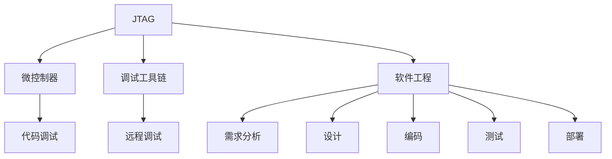

                 

# JTAG 调试：在嵌入式系统上

> 关键词：嵌入式系统，JTAG调试，微控制器，调试工具链，软件工程

## 1. 背景介绍

### 1.1 问题由来
嵌入式系统因其轻量、高效、定制化的特点，广泛应用于智能家居、工业控制、医疗设备、移动通信、航空航天等众多领域。然而，嵌入式系统的调试一直是一个棘手的问题。由于嵌入式系统常常受限于硬件资源，无法使用PC端常用的调试工具。

### 1.2 问题核心关键点
1. 嵌入式系统往往资源受限，无法支持PC端常用的调试工具。
2. 微控制器内部结构复杂，调试难度高。
3. 嵌入式系统内部软件工程复杂，代码调试难。
4. 需求变化快，调试周期长。

### 1.3 问题研究意义
通过基于JTAG的调试技术，可以有效解决嵌入式系统调试难、周期长的问题。JTAG是一种专门用于在芯片内部进行数据传输、监控和调试的接口标准，被广泛应用于嵌入式系统的调试和测试。掌握JTAG调试技术，对提升嵌入式系统开发效率，确保系统稳定运行具有重要意义。

## 2. 核心概念与联系

### 2.1 核心概念概述

为更好地理解基于JTAG的嵌入式系统调试方法，本节将介绍几个密切相关的核心概念：

- **JTAG（Joint Test Action Group）**：是一种专门用于在芯片内部进行数据传输、监控和调试的接口标准。JTAG接口被广泛应用于嵌入式系统的开发和调试过程中。
- **微控制器（MCU）**：是嵌入式系统的核心组件，内部集成了处理器、存储器、外设等资源，通过JTAG接口可以实现对内部代码的调试。
- **调试工具链**：包括调试器、模拟器等工具，用于实现对MCU内部代码的远程调试和测试。
- **软件工程（SE）**：是嵌入式系统调试的核心，包括需求分析、设计、编码、测试、部署等全生命周期管理。

这些核心概念之间的逻辑关系可以通过以下Mermaid流程图来展示：



这个流程图展示了大语言模型的核心概念及其之间的关系：

1. JTAG作为接口标准，用于连接微控制器和调试工具链，实现远程调试。
2. 微控制器是嵌入式系统的核心，内部集成了JTAG接口，供调试工具链接入。
3. 调试工具链包括调试器、模拟器等，通过JTAG接口实现对微控制器内部代码的调试和测试。
4. 软件工程是嵌入式系统调试的核心，贯穿需求分析、设计、编码、测试、部署等全生命周期。

这些概念共同构成了嵌入式系统调试的基本框架，使其能够实现高效的开发和测试。通过理解这些核心概念，我们可以更好地把握嵌入式系统调试的原理和技巧。

## 3. 核心算法原理 & 具体操作步骤
### 3.1 算法原理概述

基于JTAG的嵌入式系统调试，本质上是通过JTAG接口，将调试工具链接入微控制器的内部资源，实现对代码的远程监控和调试。其核心思想是：通过JTAG接口，将调试工具链与微控制器内部连接，在本地或远程环境中对嵌入式系统进行全面的测试和调试。

### 3.2 算法步骤详解

基于JTAG的嵌入式系统调试一般包括以下几个关键步骤：

**Step 1: 准备硬件和软件环境**
- 连接JTAG接口的硬件连接器，将调试工具链与微控制器连接。
- 在调试工具链上安装和配置JTAG调试器，设定调试参数。

**Step 2: 初始化调试环境**
- 开启JTAG接口，进入调试模式。
- 加载目标程序到微控制器中，设置断点、单步调试等调试选项。

**Step 3: 执行调试操作**
- 设置断点，执行单步调试、断点调试等。
- 查看寄存器、内存、外设等状态，监控系统运行情况。
- 调试程序中的错误和异常，定位问题原因。

**Step 4: 保存和导出调试信息**
- 将调试过程中采集到的寄存器、内存等状态信息保存下来。
- 将调试结果导出为报告或图表，便于分析和报告。

### 3.3 算法优缺点

基于JTAG的嵌入式系统调试方法具有以下优点：
1. 灵活性高。可以远程连接不同地点的微控制器，进行实时调试。
2. 调试全面。JTAG接口支持多种调试模式，可以全面监控微控制器的运行状态。
3. 定位准确。通过寄存器监控、单步调试等手段，能够准确定位系统中的问题。
4. 兼容性广。几乎所有主流微控制器都支持JTAG接口，调试工具链也相对丰富。

同时，该方法也存在一定的局限性：
1. 硬件依赖。调试过程需要依赖JTAG接口，而JTAG接口的性能和稳定性可能受制于硬件质量。
2. 资源占用高。调试工具链需要占用一定的硬件和软件资源，对系统的正常运行有一定影响。
3. 调试复杂。调试过程需要一定的技术门槛，初学者可能需要较长时间的学习。
4. 调试成本高。高性能的JTAG调试器往往价格不菲，增加了系统的开发成本。

尽管存在这些局限性，但就目前而言，基于JTAG的嵌入式系统调试仍是嵌入式系统开发中最主流的手段。未来相关研究的重点在于如何进一步降低调试成本，提高调试效率，同时兼顾硬件兼容性和软件稳定性等因素。

### 3.4 算法应用领域

基于JTAG的嵌入式系统调试方法在嵌入式系统的开发和维护中得到了广泛应用，主要应用于以下领域：

1. **嵌入式软件开发**：在嵌入式系统开发过程中，通过JTAG调试可以实时监控和调试程序的运行状态，确保程序的正确性和稳定性。
2. **嵌入式系统测试**：在嵌入式系统的测试过程中，通过JTAG调试可以全面测试系统的各个功能模块，确保系统的完整性和可靠性。
3. **嵌入式系统维护**：在嵌入式系统的维护过程中，通过JTAG调试可以实时监控系统的运行状态，及时发现和解决系统中的问题。
4. **嵌入式系统升级**：在嵌入式系统的升级过程中，通过JTAG调试可以确保新旧版本之间的平稳切换，避免系统出现问题。
5. **嵌入式系统安全**：在嵌入式系统的安全测试过程中，通过JTAG调试可以全面监控系统的运行状态，确保系统的安全性。

## 4. 数学模型和公式 & 详细讲解 & 举例说明
### 4.1 数学模型构建

本节将使用数学语言对基于JTAG的嵌入式系统调试过程进行更加严格的刻画。

记微控制器为 $M_{\text{MCU}}$，调试工具链为 $D$，JTAG接口为 $J$，则调试过程可以表示为 $M_{\text{MCU}} \leftrightarrow J \leftrightarrow D$。在调试过程中，$D$ 通过 $J$ 将调试指令和数据传输到 $M_{\text{MCU}}$ 中，并接收 $M_{\text{MCU}}$ 的状态信息和调试结果。

### 4.2 公式推导过程

以下是基于JTAG的嵌入式系统调试过程中的关键公式推导：

1. JTAG协议：JTAG协议定义了JTAG接口的调试操作和数据传输方式，包括测试模式进入、数据传输、寄存器访问等操作。JTAG协议中常用的操作包括：
   - 配置寄存器：通过JTAG接口配置微控制器的寄存器。
   - 读取寄存器：通过JTAG接口读取微控制器的寄存器。
   - 单步执行：通过JTAG接口单步执行程序的代码。
   - 断点调试：通过JTAG接口设置断点，在程序执行过程中暂停执行。

2. 调试指令格式：JTAG协议中常用的调试指令格式如下：

   | 指令格式 | 指令含义 |
   | --- | --- |
   | `0001 1010 1000 0001` | 配置寄存器 |
   | `0001 1010 0111 0001` | 读取寄存器 |
   | `0001 1010 1001 0001` | 单步执行 |
   | `0001 1010 1111 0001` | 断点调试 |

   其中，第一位为命令类型，后四位为命令参数，最后一位为命令指令。

3. 调试状态转换：在调试过程中，微控制器和调试工具链之间进行状态转换，包括：
   - 初始状态：微控制器和调试工具链均处于正常运行状态。
   - 调试状态：微控制器进入调试模式，调试工具链接入调试接口。
   - 恢复状态：微控制器退出调试模式，恢复正常运行状态。

### 4.3 案例分析与讲解

以下以一个简单的嵌入式系统为例，进行基于JTAG的调试过程分析：

1. **初始化调试环境**：将调试工具链与微控制器连接，进入调试模式，加载目标程序。
2. **设置断点**：通过JTAG接口在程序的关键位置设置断点，准备进行调试。
3. **单步执行**：通过JTAG接口单步执行程序，逐行查看程序的执行情况。
4. **读取寄存器**：通过JTAG接口读取微控制器的寄存器，查看程序状态和数据。
5. **断点调试**：在程序执行到断点时，程序暂停执行，调试工具链显示程序状态和调试信息。

通过以上步骤，可以实现对嵌入式系统的全面调试，发现并解决程序中的问题，确保系统的稳定运行。

## 5. 项目实践：代码实例和详细解释说明
### 5.1 开发环境搭建

在进行基于JTAG的嵌入式系统调试前，我们需要准备好开发环境。以下是使用ARM调试工具链进行嵌入式系统调试的环境配置流程：

1. 安装ARM调试工具链：从官网下载并安装ARM调试工具链，包括gcc、gdb、openocd等工具。
2. 连接JTAG接口：将JTAG接口连接至嵌入式系统，进入调试模式。
3. 配置gdb调试环境：在gdb中使用`target remote`命令，连接到嵌入式系统的JTAG接口。
4. 编译和加载程序：使用gcc编译程序，并使用`target remote`命令加载程序到嵌入式系统中。

完成上述步骤后，即可在ARM调试工具链环境下进行基于JTAG的调试实践。

### 5.2 源代码详细实现

下面我们以一个简单的嵌入式系统为例，给出使用ARM调试工具链对微控制器进行调试的代码实现。

首先，编写程序代码：

```c
#include <stdio.h>

void main() {
    printf("Hello, JTAG!\n");
}
```

然后，在ARM调试工具链中进行调试：

```bash
# 编译程序
arm-linux-gnueabihf-gcc -o hello hello.c

# 加载程序
target remote localhost:3333

# 设置断点
break main

# 单步执行
next

# 读取寄存器
info reg

# 断点调试
continue
```

通过以上代码，可以看出使用ARM调试工具链进行基于JTAG的嵌入式系统调试的基本步骤。可以看到，调试过程需要经过编译、加载、断点设置、单步执行、寄存器读取、断点调试等多个步骤，需要一定的技术门槛。

### 5.3 代码解读与分析

让我们再详细解读一下关键代码的实现细节：

1. **程序代码**：
   - `#include <stdio.h>`：包含标准输入输出库的头文件。
   - `void main()`：定义程序入口函数。
   - `printf("Hello, JTAG!\n");`：打印输出字符串。

2. **编译和加载程序**：
   - `arm-linux-gnueabihf-gcc -o hello hello.c`：使用ARM调试工具链中的gcc编译程序，生成可执行文件。
   - `target remote localhost:3333`：在gdb中使用`target remote`命令，连接到嵌入式系统的JTAG接口，进入调试模式。

3. **断点设置和单步执行**：
   - `break main`：在程序入口函数`main`处设置断点。
   - `next`：单步执行程序，逐行查看程序的执行情况。

4. **寄存器读取和断点调试**：
   - `info reg`：读取微控制器的寄存器，查看程序状态和数据。
   - `continue`：恢复程序的执行，继续调试。

可以看到，基于JTAG的嵌入式系统调试需要一定的技术门槛，但通过掌握基本的调试步骤和命令，可以高效地进行调试。

## 6. 实际应用场景
### 6.1 智能家居系统

基于JTAG的嵌入式系统调试技术，可以广泛应用于智能家居系统的开发和维护。智能家居系统通常包含多个嵌入式设备，如智能灯泡、智能门锁、智能音箱等，这些设备需要实时通信和监控，调试难度较高。

在技术实现上，可以借助JTAG接口，对各个嵌入式设备进行全面的调试和测试。调试过程中，可以在嵌入式设备上设置断点，单步执行程序，监控寄存器状态，确保设备的稳定运行。对于新功能的开发和调试，也可以通过JTAG接口实时监测设备的运行状态，快速定位问题，缩短开发周期。

### 6.2 工业控制系统

工业控制系统是嵌入式系统的重要应用领域，主要用于对生产线、机器人、自动化设备等进行监控和控制。工业控制系统需要高可靠性和高稳定性，调试难度较高。

通过基于JTAG的嵌入式系统调试技术，可以对工业控制系统进行全面的测试和调试，确保系统的可靠性和稳定性。调试过程中，可以在嵌入式设备上设置断点，单步执行程序，监控寄存器状态，定位系统中的问题。对于新功能的开发和调试，也可以通过JTAG接口实时监测设备的运行状态，快速定位问题，缩短开发周期。

### 6.3 医疗设备系统

医疗设备系统通常包含多个嵌入式设备，如监护仪、输液泵、呼吸机等，这些设备需要高精度和高可靠性，调试难度较高。

通过基于JTAG的嵌入式系统调试技术，可以对医疗设备系统进行全面的测试和调试，确保设备的可靠性和精度。调试过程中，可以在嵌入式设备上设置断点，单步执行程序，监控寄存器状态，定位系统中的问题。对于新功能的开发和调试，也可以通过JTAG接口实时监测设备的运行状态，快速定位问题，缩短开发周期。

### 6.4 未来应用展望

随着嵌入式系统的发展，基于JTAG的调试技术也将不断演进，应用场景将更加广泛。

在物联网领域，基于JTAG的调试技术可以广泛应用于各种传感器、智能穿戴设备、智能家居设备等的开发和维护。通过全面调试和测试，确保物联网设备的稳定运行和功能完备。

在智能汽车领域，基于JTAG的调试技术可以广泛应用于车载计算机、仪表盘、娱乐系统等的开发和维护。通过全面调试和测试，确保智能汽车的可靠性和安全性。

在工业自动化领域，基于JTAG的调试技术可以广泛应用于机器人、自动化生产线、智能仓储系统等的开发和维护。通过全面调试和测试，确保工业自动化的高效和稳定。

总之，基于JTAG的调试技术在嵌入式系统的开发和维护中具有重要意义，未来将在更多领域得到广泛应用，为智能技术的落地提供重要保障。

## 7. 工具和资源推荐
### 7.1 学习资源推荐

为了帮助开发者系统掌握基于JTAG的嵌入式系统调试的理论基础和实践技巧，这里推荐一些优质的学习资源：

1. **《嵌入式系统调试与测试技术》**：由嵌入式系统专家撰写，详细介绍了基于JTAG的嵌入式系统调试方法，涵盖JTAG协议、ARM调试工具链等基础知识。
2. **《嵌入式系统设计与开发》**：由嵌入式系统领域的权威教材，介绍了嵌入式系统调试的全生命周期管理，包括需求分析、设计、编码、测试、部署等环节。
3. **《JTAG协议详解》**：介绍了JTAG协议的原理和应用，包括调试指令格式、状态转换、调试器配置等细节。
4. **《嵌入式系统开发指南》**：介绍了嵌入式系统开发的全过程，包括需求分析、硬件设计、软件开发、调试与测试等环节。

通过对这些资源的学习实践，相信你一定能够快速掌握基于JTAG的嵌入式系统调试的精髓，并用于解决实际的嵌入式系统问题。

### 7.2 开发工具推荐

高效的开发离不开优秀的工具支持。以下是几款用于基于JTAG的嵌入式系统调试开发的常用工具：

1. **ARM调试工具链**：由ARM公司开发，包括gcc、gdb、openocd等工具，支持基于JTAG的调试。
2. **IAR Embedded Workbench**：一款流行的嵌入式开发环境，集成了JTAG调试器，支持多种嵌入式平台。
3. **Keil MDK**：一款功能强大的嵌入式开发环境，支持基于JTAG的调试，易于使用。
4. **JLink**：一款高性能的JTAG调试器，支持多种嵌入式平台，提供丰富的调试功能。
5. **Qemu**：一款开源的模拟器，支持基于JTAG的调试，适用于嵌入式系统的测试和仿真。

合理利用这些工具，可以显著提升基于JTAG的嵌入式系统调试任务的开发效率，加快创新迭代的步伐。

### 7.3 相关论文推荐

基于JTAG的嵌入式系统调试技术的发展源于学界的持续研究。以下是几篇奠基性的相关论文，推荐阅读：

1. **《JTAG调试技术的发展与展望》**：介绍了JTAG协议的发展历程和未来趋势，探讨了JTAG调试技术在嵌入式系统中的应用前景。
2. **《基于JTAG的嵌入式系统调试方法》**：详细介绍了基于JTAG的嵌入式系统调试方法，涵盖JTAG接口的配置、调试指令的使用、状态转换等细节。
3. **《JTAG调试在嵌入式系统中的应用》**：介绍了JTAG调试在嵌入式系统中的应用案例，展示了JTAG调试技术在实际应用中的效果和优势。

这些论文代表了大语言模型微调技术的发展脉络。通过学习这些前沿成果，可以帮助研究者把握学科前进方向，激发更多的创新灵感。

## 8. 总结：未来发展趋势与挑战
### 8.1 总结

本文对基于JTAG的嵌入式系统调试方法进行了全面系统的介绍。首先阐述了嵌入式系统调试的必要性和复杂性，明确了JTAG调试在嵌入式系统开发中的重要地位。其次，从原理到实践，详细讲解了JTAG调试的数学原理和关键步骤，给出了调试任务开发的完整代码实例。同时，本文还广泛探讨了JTAG调试在智能家居、工业控制、医疗设备等众多领域的应用前景，展示了JTAG调试范式的巨大潜力。此外，本文精选了JTAG调试技术的各类学习资源，力求为读者提供全方位的技术指引。

通过本文的系统梳理，可以看到，基于JTAG的嵌入式系统调试技术正在成为嵌入式系统开发的重要手段，极大地提升了嵌入式系统的开发效率和可靠性。未来，伴随嵌入式系统的发展，基于JTAG的调试技术还将继续演进，为智能技术的落地提供重要保障。

### 8.2 未来发展趋势

展望未来，基于JTAG的嵌入式系统调试技术将呈现以下几个发展趋势：

1. **调试工具的智能化**：随着人工智能技术的发展，未来的调试工具将更加智能化，可以自动识别和解决调试中的问题，减少人工干预。
2. **调试模式的灵活化**：未来的调试模式将更加灵活，可以根据不同的嵌入式系统，选择合适的调试方法。
3. **调试接口的多样化**：未来的调试接口将更加多样化，不仅限于JTAG接口，还可以扩展到USB接口、以太网接口等。
4. **调试过程的自动化**：未来的调试过程将更加自动化，可以通过脚本和工具链自动化地完成调试任务。
5. **调试环境的云化**：未来的调试环境将更加云化，可以通过云平台进行远程调试，提高调试效率。

这些趋势将使基于JTAG的嵌入式系统调试技术更加灵活、高效、智能，为嵌入式系统的开发和维护提供更强大的技术支持。

### 8.3 面临的挑战

尽管基于JTAG的嵌入式系统调试技术已经取得了瞩目成就，但在迈向更加智能化、普适化应用的过程中，它仍面临着诸多挑战：

1. **调试成本高**：高性能的JTAG调试器往往价格不菲，增加了系统的开发成本。
2. **调试效率低**：调试过程需要一定的技术门槛，初学者可能需要较长时间的学习。
3. **调试模式单一**：当前的调试模式主要基于JTAG接口，未来需要拓展到更多接口和平台。
4. **调试数据的安全性**：调试过程中，调试数据的安全性需要得到保障，避免数据泄露。

尽管存在这些挑战，但随着学界和产业界的共同努力，这些挑战终将一一被克服，基于JTAG的嵌入式系统调试技术必将在嵌入式系统的开发和维护中发挥更大的作用。相信随着技术的不断进步，嵌入式系统的调试效率和可靠性将进一步提升，智能技术的落地将更加便捷和高效。

### 8.4 研究展望

面对基于JTAG的嵌入式系统调试所面临的种种挑战，未来的研究需要在以下几个方面寻求新的突破：

1. **开发更智能的调试工具**：利用人工智能技术，开发更加智能化的调试工具，自动识别和解决调试中的问题。
2. **设计更灵活的调试模式**：设计多种调试模式，满足不同嵌入式系统的调试需求。
3. **拓展调试接口的多样化**：拓展调试接口到更多平台和设备，满足不同场景的调试需求。
4. **提升调试过程的自动化**：开发自动化调试工具和脚本，提升调试效率。
5. **保障调试数据的安全性**：通过加密和访问控制等措施，保障调试数据的安全性。

这些研究方向的探索，必将引领基于JTAG的嵌入式系统调试技术迈向更高的台阶，为智能技术的落地提供更强大的技术支持。面向未来，基于JTAG的调试技术还需要与其他人工智能技术进行更深入的融合，如知识表示、因果推理、强化学习等，多路径协同发力，共同推动嵌入式系统的进步。只有勇于创新、敢于突破，才能不断拓展JTAG调试的边界，让智能技术更好地造福人类社会。

## 9. 附录：常见问题与解答

**Q1: 嵌入式系统为什么需要使用JTAG调试？**

A: 嵌入式系统通常资源受限，无法使用PC端常用的调试工具。JTAG调试器可以通过调试接口直接与微控制器内部连接，实现对程序的远程监控和调试，提高了调试的效率和灵活性。

**Q2: JTAG接口的特点有哪些？**

A: JTAG接口具有以下特点：
1. 调试接口，支持对微控制器的全面监控和调试。
2. 数据传输接口，支持在调试过程中进行数据传输。
3. 测试接口，支持对微控制器的测试和验证。
4. 简单易用，支持多种嵌入式平台。

**Q3: 使用JTAG调试需要哪些步骤？**

A: 使用JTAG调试需要以下步骤：
1. 连接JTAG接口的硬件连接器，将调试工具链与微控制器连接。
2. 在调试工具链上安装和配置JTAG调试器，设定调试参数。
3. 开启JTAG接口，进入调试模式。
4. 加载目标程序到微控制器中，设置断点、单步调试等调试选项。
5. 设置断点，执行单步调试、断点调试等。
6. 查看寄存器、内存、外设等状态，监控系统运行情况。
7. 调试程序中的错误和异常，定位问题原因。
8. 保存和导出调试信息。

**Q4: JTAG调试器有哪些常用的调试指令？**

A: JTAG调试器常用的调试指令包括：
1. 配置寄存器。
2. 读取寄存器。
3. 单步执行。
4. 断点调试。

**Q5: JTAG接口的调试模式有哪些？**

A: JTAG接口的调试模式包括：
1. 连续模式。
2. 快速模式。
3. 单步模式。
4. 无执行模式。

---

作者：禅与计算机程序设计艺术 / Zen and the Art of Computer Programming

