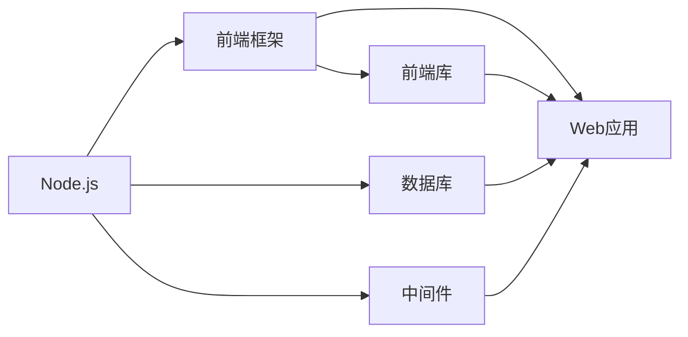

                 

# JavaScript全栈开发：Node.js与前端框架的结合

> 关键词：全栈开发, Node.js, 前端框架, JavaScript, 后端开发, 前端框架

## 1. 背景介绍

随着互联网技术的不断进步和Web应用的日益复杂，越来越多的开发者希望通过一种技术栈实现从后端到前端的全流程开发，以满足高效率、高灵活性的需求。这种全栈开发理念和实践正在成为行业的主流趋势。全栈开发不仅能够提高开发效率，减少代码维护成本，还能够提升应用性能和用户体验。

在这个过程中，Node.js和前端框架成为不可或缺的重要组成部分。Node.js作为一个后端平台，结合现代前端框架，能够实现高效、稳定的全栈应用开发。本文将详细介绍Node.js和前端框架的结合方式，通过具体实例展示全栈开发的实践。

## 2. 核心概念与联系

### 2.1 核心概念概述

**Node.js**：Node.js是一个基于Chrome V8引擎的JavaScript运行环境，提供了异步I/O、非阻塞I/O等特性，使得高并发的Web应用开发成为可能。Node.js的核心模块lib模块提供了丰富的API支持，能够实现基本的Web应用功能。

**前端框架**：前端框架是一组工具和库，用于构建交互式Web界面。常见的前端框架包括React、Vue.js和Angular等，它们能够简化前端开发，提高开发效率和应用性能。

**全栈开发**：全栈开发指的是使用同一种编程语言或技术栈实现应用的前端和后端功能。Node.js和前端框架的结合，可以实现从服务器到客户端的全栈开发。

### 2.2 核心概念原理和架构的 Mermaid 流程图



这个Mermaid流程图展示了Node.js和前端框架结合的基本架构：

1. Node.js作为后端平台，提供异步I/O和非阻塞I/O的支持，处理请求和响应。
2. 前端框架负责构建前端页面和应用逻辑，与Node.js进行交互。
3. 数据库用于存储数据，为应用提供数据支持。
4. 中间件用于处理请求和响应，提供额外的功能，如缓存、安全性等。

## 3. 核心算法原理 & 具体操作步骤

### 3.1 算法原理概述

全栈开发的核心在于前后端之间的无缝衔接和数据交互。Node.js提供了异步I/O和非阻塞I/O的特性，能够处理高并发的请求。前端框架提供了丰富的组件和库，用于构建交互式界面和应用逻辑。两者结合，能够实现高效、灵活的全栈应用。

### 3.2 算法步骤详解

以下是Node.js和前端框架结合的全栈开发具体操作步骤：

1. **环境搭建**：安装Node.js和NPM，使用npm初始化项目，创建package.json文件。
2. **前端开发**：使用前端框架开发页面和应用逻辑，编写HTML、CSS和JavaScript代码。
3. **后端开发**：使用Node.js编写后端逻辑，处理请求和响应，处理数据库操作等。
4. **数据交互**：在前端和后端之间定义API接口，实现数据的传输和交互。
5. **集成部署**：将前端和后端代码打包部署，实现应用的全面运行。

### 3.3 算法优缺点

**优点**：
- 提升开发效率：全栈开发减少了前后端之间的切换，提高了开发效率。
- 提高性能：Node.js的非阻塞I/O特性能够处理高并发请求，前端框架提供了高效的渲染引擎。
- 简化维护：全栈开发减少了代码维护的复杂性，统一代码库更容易维护。

**缺点**：
- 学习曲线陡峭：掌握全栈开发需要同时学习前端和后端技术，学习成本较高。
- 单点瓶颈：全栈开发存在单点瓶颈问题，一个环节出现问题可能会影响整个应用的稳定性。
- 性能优化难度大：前端和后端性能优化需要同时进行，对开发者要求较高。

### 3.4 算法应用领域

Node.js和前端框架的结合，可以应用于多种Web应用场景，包括但不限于：

- 电商网站：全栈开发可以处理用户请求、订单管理、商品展示等功能，提高用户购物体验。
- 在线教育：全栈开发可以构建交互式学习平台，提供课程管理、在线考试、互动问答等功能。
- 金融平台：全栈开发可以处理用户注册、交易管理、理财分析等功能，提升平台的安全性和性能。
- 游戏应用：全栈开发可以实现游戏逻辑、服务器渲染、实时通讯等功能，提供优质的游戏体验。

## 4. 数学模型和公式 & 详细讲解 & 举例说明

### 4.1 数学模型构建

全栈开发的核心在于前后端数据的交互和应用逻辑的处理。以下是一个简单的全栈开发数学模型构建：

- 前端：负责处理用户输入，渲染页面和界面，例如：
  - 获取用户输入：`<input type="text" id="username">`
  - 渲染页面：`document.getElementById("username").innerText = "Hello, " + username + "!"`
- 后端：负责处理请求和响应，处理数据库操作，例如：
  - 接收用户请求：`app.get("/hello", (req, res) => {`
  - 处理请求：`const username = req.query.username;`
  - 响应结果：`res.send("Hello, " + username + "!");`

### 4.2 公式推导过程

以下是一个简单的全栈开发公式推导过程：

假设用户在前端输入用户名`username`，点击提交按钮后，前端将用户名通过AJAX请求发送给后端，后端接收请求并处理，最终返回结果。

1. **前端发送请求**：`$.ajax({url: '/hello', type: 'GET', data: {username: 'John'}})`
2. **后端处理请求**：
  ```javascript
  app.get('/hello', (req, res) => {
    const username = req.query.username;
    res.send(`Hello, ${username}!`);
  });
  ```
3. **前端接收响应**：`$.ajax({url: '/hello', type: 'GET', data: {username: 'John'}, success: function(data) {`
4. **渲染结果**：`$("#output").html(data);`

### 4.3 案例分析与讲解

以下是一个简单的全栈开发案例分析：

假设我们正在开发一个简单的社交媒体应用，用户可以发布动态、查看动态和搜索动态。前端使用React框架，后端使用Node.js和Express框架。

1. **前端开发**：
  ```javascript
  class App extends React.Component {
    state = {
      posts: [],
      query: ''
    };
    componentDidMount() {
      fetch('/posts')
        .then(response => response.json())
        .then(posts => this.setState({ posts }));
    }
    handleQueryChange = event => {
      this.setState({ query: event.target.value });
    };
    handleSearch = async () => {
      const posts = await fetch(`/search?query=${this.state.query}`, {
        method: 'GET'
      }).then(response => response.json());
      this.setState({ posts });
    };
    render() {
      return (
        <div>
          <input
            type="text"
            value={this.state.query}
            onChange={this.handleQueryChange}
          />
          <button onClick={this.handleSearch}>Search</button>
          <ul>
            {this.state.posts.map(post => (
              <li key={post.id}>{post.content}</li>
            ))}
          </ul>
        </div>
      );
    }
  }
  ```

2. **后端开发**：
  ```javascript
  const express = require('express');
  const app = express();
  const fetch = require('node-fetch');
  const port = 3000;
  
  app.get('/posts', async (req, res) => {
    const posts = await fetch('https://example.com/posts')
      .then(response => response.json());
    res.json(posts);
  });
  
  app.get('/search', async (req, res) => {
    const posts = await fetch(`https://example.com/search?query=${req.query.query}`)
      .then(response => response.json());
    res.json(posts);
  });
  
  app.listen(port, () => {
    console.log(`App listening at http://localhost:${port}`);
  });
  ```

3. **数据交互**：
  - 前端通过AJAX请求发送请求到后端，后端处理请求并返回结果。
  - 前端通过异步渲染更新页面，显示结果。

## 5. 项目实践：代码实例和详细解释说明

### 5.1 开发环境搭建

以下是Node.js和React前端框架的开发环境搭建步骤：

1. **安装Node.js和NPM**：从官网下载并安装Node.js和NPM。
2. **创建项目目录**：`mkdir my-project`
3. **初始化项目**：`cd my-project`，`npm init`，按照提示填写相关信息。
4. **安装依赖**：`npm install express body-parser react react-dom react-router-dom`
5. **创建后端代码**：创建`server.js`文件，编写后端代码。
6. **创建前端代码**：创建`index.html`、`index.js`和`index.css`文件，编写前端代码。

### 5.2 源代码详细实现

以下是Node.js和React前端框架的源代码实现：

**后端代码（server.js）**：

```javascript
const express = require('express');
const bodyParser = require('body-parser');
const app = express();
const port = 3000;
const cors = require('cors');

app.use(cors());
app.use(bodyParser.json());
app.use(bodyParser.urlencoded({ extended: true }));

app.get('/posts', async (req, res) => {
  const posts = await fetch('https://example.com/posts')
    .then(response => response.json());
  res.json(posts);
});

app.post('/posts', async (req, res) => {
  const { title, content } = req.body;
  const post = { id: Date.now(), title, content };
  const posts = await fetch('https://example.com/posts')
    .then(response => response.json());
  posts.push(post);
  const updatedPosts = await fetch('https://example.com/posts', {
    method: 'POST',
    headers: { 'Content-Type': 'application/json' },
    body: JSON.stringify(posts)
  }).then(response => response.json());
  res.json(updatedPosts);
});

app.listen(port, () => {
  console.log(`App listening at http://localhost:${port}`);
});
```

**前端代码（index.js）**：

```javascript
import React, { useState, useEffect } from 'react';
import ReactDOM from 'react-dom';
import { BrowserRouter as Router, Route, Switch } from 'react-router-dom';
import axios from 'axios';

const PostList = () => {
  const [posts, setPosts] = useState([]);
  
  useEffect(() => {
    axios.get('/posts')
      .then(response => setPosts(response.data))
      .catch(error => console.log(error));
  }, []);
  
  return (
    <ul>
      {posts.map(post => (
        <li key={post.id}>{post.title}</li>
      ))}
    </ul>
  );
};

const CreatePost = () => {
  const [title, setTitle] = useState('');
  const [content, setContent] = useState('');
  
  const handleSubmit = async event => {
    event.preventDefault();
    const post = { title, content };
    const updatedPosts = await axios.post('/posts', post)
      .then(response => response.data);
    setPosts(updatedPosts);
  };
  
  return (
    <form onSubmit={handleSubmit}>
      <label>
        Title:
        <input type="text" value={title} onChange={event => setTitle(event.target.value)} />
      </label>
      <label>
        Content:
        <textarea value={content} onChange={event => setContent(event.target.value)} />
      </label>
      <button type="submit">Create Post</button>
    </form>
  );
};

ReactDOM.render(
  <Router>
    <Switch>
      <Route exact path="/" component={PostList} />
      <Route path="/create" component={CreatePost} />
    </Switch>
  </Router>,
  document.getElementById('root')
);
```

### 5.3 代码解读与分析

**后端代码**：
- 使用`express`框架创建HTTP服务器，处理请求和响应。
- 使用`body-parser`中间件解析请求体数据。
- 使用`cors`中间件允许跨域请求。
- 使用`fetch`函数处理HTTP请求，返回JSON数据。
- 使用异步处理逻辑，提高性能。

**前端代码**：
- 使用`react`框架构建页面和应用逻辑。
- 使用`react-router-dom`库实现路由功能。
- 使用`axios`库进行HTTP请求。
- 使用`useState`和`useEffect`钩子处理状态和副作用。
- 使用异步处理逻辑，提高性能。

### 5.4 运行结果展示

以下是在Node.js和React前端框架下的全栈开发运行结果：

- 访问`http://localhost:3000`，展示所有文章列表。
- 点击创建按钮，进入创建文章页面。
- 输入文章标题和内容，点击创建按钮。
- 返回所有文章列表，并展示新创建的文章。

## 6. 实际应用场景

### 6.1 电商网站

电商网站需要处理大量的商品展示、用户登录、购物车管理等功能。使用全栈开发，可以将前端和后端集成在一起，提高开发效率和用户体验。

- 前端：展示商品列表、商品详情、购物车等页面。
- 后端：处理用户登录、订单管理、支付等功能。
- 数据交互：前端通过AJAX请求获取商品数据，后端处理订单信息并返回结果。

### 6.2 在线教育平台

在线教育平台需要提供丰富的课程内容、在线答题、互动交流等功能。使用全栈开发，可以构建统一的前端和后端，提升平台性能和用户体验。

- 前端：展示课程列表、视频播放、在线答题等页面。
- 后端：处理课程管理、答题记录、互动交流等功能。
- 数据交互：前端通过AJAX请求获取课程数据，后端处理答题记录并返回结果。

### 6.3 金融平台

金融平台需要处理用户注册、交易管理、理财分析等功能。使用全栈开发，可以提高平台的安全性和性能。

- 前端：展示交易记录、理财计划、用户设置等页面。
- 后端：处理用户注册、交易管理、理财分析等功能。
- 数据交互：前端通过AJAX请求获取交易数据，后端处理理财分析并返回结果。

### 6.4 游戏应用

游戏应用需要处理游戏逻辑、服务器渲染、实时通讯等功能。使用全栈开发，可以提供优质的游戏体验。

- 前端：展示游戏界面、角色控制、社交功能等。
- 后端：处理游戏逻辑、服务器渲染、实时通讯等功能。
- 数据交互：前端通过AJAX请求获取游戏数据，后端处理实时通讯并返回结果。

## 7. 工具和资源推荐

### 7.1 学习资源推荐

以下是学习Node.js和前端框架的推荐资源：

1. **《JavaScript全栈开发》书籍**：介绍Node.js和React全栈开发的实战案例和技巧。
2. **《Node.js高级开发》课程**：深入讲解Node.js的核心技术和最佳实践。
3. **《React官方文档》**：详细介绍React框架的使用方法和API。
4. **《Node.js和React实战》课程**：结合实际案例，讲解Node.js和React的全栈开发。
5. **《JavaScript全栈开发实战》视频**：通过实际项目，展示Node.js和React的结合使用。

### 7.2 开发工具推荐

以下是Node.js和前端框架的开发工具推荐：

1. **Visual Studio Code**：功能强大且易于扩展的编辑器，支持Node.js和React的开发。
2. **GitHub**：代码托管平台，提供丰富的开源项目和社区支持。
3. **npm**：Node.js的包管理器，方便依赖管理和版本控制。
4. **Postman**：HTTP请求测试工具，支持自动化测试和数据交互调试。
5. **Webpack**：前端打包工具，支持模块化和代码优化。

### 7.3 相关论文推荐

以下是Node.js和前端框架的相关论文推荐：

1. **《The Node.js Book》**：讲解Node.js的核心技术和最佳实践。
2. **《Mastering React》**：详细讲解React框架的使用方法和API。
3. **《High-Performance JavaScript》**：介绍Node.js和React的性能优化技巧。
4. **《Full-Stack JavaScript》**：结合实际案例，展示Node.js和React的全栈开发。
5. **《Full-Stack JavaScript with React》**：通过实际项目，展示Node.js和React的结合使用。

## 8. 总结：未来发展趋势与挑战

### 8.1 研究成果总结

Node.js和前端框架的结合，推动了全栈开发的快速发展。通过全栈开发，可以实现高效、灵活、可靠的全栈应用，提升了开发效率和用户体验。

### 8.2 未来发展趋势

未来的全栈开发将呈现以下几个发展趋势：

1. **微服务架构**：通过微服务架构，将应用拆分为多个微服务，提升系统的可维护性和可扩展性。
2. **无服务器架构**：通过无服务器架构，实现按需计算，降低运维成本和部署难度。
3. **Serverless Framework**：结合Node.js和Serverless框架，实现全栈应用的快速部署和扩展。
4. **DevOps和CI/CD**：通过DevOps和CI/CD流程，实现全栈应用的自动化构建、测试和部署。
5. **容器化和Kubernetes**：通过容器化和Kubernetes，实现全栈应用的自动化运维和管理。

### 8.3 面临的挑战

尽管全栈开发有诸多优势，但在实际应用中仍面临以下挑战：

1. **技术栈选择**：选择合适的技术栈和工具，需要考虑应用场景、性能需求和开发成本等因素。
2. **性能优化**：全栈应用的性能优化需要同时关注前端和后端，难度较大。
3. **系统复杂性**：全栈应用的复杂性较高，需要精心设计架构和代码结构。
4. **团队协作**：全栈开发需要前端和后端协作，需要提升团队协作能力。
5. **技术更新**：Node.js和前端框架的技术更新较快，需要持续学习和跟进。

### 8.4 研究展望

未来的全栈开发研究需要在以下几个方面进行深入探索：

1. **微服务和无服务器架构**：研究如何将全栈应用拆分为微服务和实现无服务器架构，提升系统的可维护性和可扩展性。
2. **DevOps和CI/CD**：研究如何实现全栈应用的自动化构建、测试和部署，提升开发效率和系统稳定性。
3. **容器化和Kubernetes**：研究如何将全栈应用容器化和部署到Kubernetes，实现自动化运维和管理。
4. **前端性能优化**：研究如何优化前端性能，提升用户体验和系统性能。
5. **新技术应用**：研究如何将新技术如WebAssembly、WebRTC等应用到全栈开发中，提升应用功能和性能。

## 9. 附录：常见问题与解答

**Q1：什么是全栈开发？**

A: 全栈开发指的是使用同一种编程语言或技术栈实现应用的前端和后端功能。全栈开发能够提高开发效率，减少前后端之间的切换，提高应用性能和用户体验。

**Q2：Node.js和前端框架如何结合？**

A: 使用Node.js和前端框架结合，可以构建高效、灵活的全栈应用。Node.js提供后端逻辑处理和数据交互，前端框架提供页面渲染和用户交互。两者通过API接口进行交互，实现数据传输和应用逻辑的协同。

**Q3：全栈开发有什么优势？**

A: 全栈开发的优势在于：提升开发效率，减少前后端之间的切换；提高应用性能，处理高并发请求；简化维护，统一代码库更容易维护。

**Q4：全栈开发有什么挑战？**

A: 全栈开发的挑战在于：技术栈选择难度大，需要考虑应用场景、性能需求和开发成本；性能优化难度大，需要同时关注前端和后端；系统复杂性高，需要精心设计架构和代码结构；团队协作困难，需要提升前端和后端协作能力；技术更新快，需要持续学习和跟进。

**Q5：全栈开发未来有什么发展趋势？**

A: 全栈开发未来将呈现微服务架构、无服务器架构、DevOps和CI/CD、容器化和Kubernetes、前端性能优化、新技术应用等发展趋势。

---

作者：禅与计算机程序设计艺术 / Zen and the Art of Computer Programming

