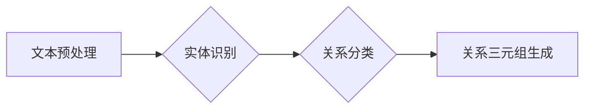

                 

## 关系抽取：从非结构化文本中提取知识

> 关键词：关系抽取，自然语言处理，知识图谱，深度学习，实体识别，关系分类

### 1. 背景介绍

在海量非结构化文本数据时代，如何有效地从文本中提取结构化知识，是人工智能领域的一项重要课题。关系抽取（Relation Extraction，RE）作为自然语言处理（NLP）的重要分支，致力于从文本中识别出实体之间的关系，并将其表示为知识三元组（实体1，关系，实体2）。

关系抽取技术在构建知识图谱、信息检索、问答系统、文本摘要等领域有着广泛的应用前景。例如，我们可以利用关系抽取技术从新闻报道中提取人物关系，构建人物关系网络；从学术论文中提取研究方向和成果关系，构建知识图谱；从产品评论中提取产品属性和用户评价关系，为产品改进提供数据支持。

### 2. 核心概念与联系

关系抽取的核心是识别文本中的实体和关系。

* **实体识别（Named Entity Recognition，NER）**：是指识别文本中的命名实体，例如人名、地名、机构名、时间、日期等。
* **关系分类（Relation Classification）**：是指识别实体之间的关系类型，例如“雇用”、“居住”、“出版”等。

关系抽取通常可以分为以下几个步骤：

1. **文本预处理**：对文本进行清洗、分词、词性标注等处理，以便于后续的实体识别和关系分类。
2. **实体识别**：利用NER模型识别文本中的实体。
3. **关系分类**：利用关系分类模型识别实体之间的关系类型。
4. **关系三元组生成**：将识别出的实体和关系组合成知识三元组。

**Mermaid 流程图**



### 3. 核心算法原理 & 具体操作步骤

#### 3.1  算法原理概述

关系抽取算法主要分为两大类：

* **基于规则的方法**：利用人工编写的规则来识别实体和关系。这种方法优点是易于理解和实现，但缺点是规则难以覆盖所有情况，且难以扩展。
* **基于机器学习的方法**：利用机器学习算法从训练数据中学习实体和关系的特征，并预测关系类型。这种方法优点是能够学习到更复杂的模式，但缺点是需要大量的训练数据，且模型解释性较差。

近年来，深度学习方法在关系抽取领域取得了显著的进展。

#### 3.2  算法步骤详解

以深度学习方法为例，其具体操作步骤如下：

1. **数据预处理**：将文本数据转换为机器可理解的格式，例如将文本转换为词向量表示。
2. **模型训练**：利用深度学习模型，例如循环神经网络（RNN）或图神经网络（GNN），从训练数据中学习实体和关系的特征。
3. **模型评估**：利用测试数据评估模型的性能，例如准确率、召回率、F1-score等。
4. **模型部署**：将训练好的模型部署到实际应用场景中，用于提取实体和关系。

#### 3.3  算法优缺点

**深度学习方法**

* **优点**：能够学习到更复杂的模式，性能优于传统方法。
* **缺点**：需要大量的训练数据，模型解释性较差。

**基于规则的方法**

* **优点**：易于理解和实现，且无需训练数据。
* **缺点**：规则难以覆盖所有情况，且难以扩展。

#### 3.4  算法应用领域

关系抽取技术在以下领域有着广泛的应用：

* **知识图谱构建**：从文本中提取实体和关系，构建知识图谱。
* **信息检索**：利用关系信息提高信息检索的准确率。
* **问答系统**：利用关系信息回答用户的问题。
* **文本摘要**：利用关系信息生成文本摘要。
* **社会网络分析**：分析社交网络中的关系和互动模式。

### 4. 数学模型和公式 & 详细讲解 & 举例说明

#### 4.1  数学模型构建

关系抽取任务可以建模为一个分类问题，即给定一个文本片段，预测实体之间的关系类型。

假设我们有一个文本片段 $T$，包含两个实体 $e_1$ 和 $e_2$，我们需要预测 $e_1$ 和 $e_2$ 之间的关系类型 $r$。

我们可以将关系抽取任务表示为以下概率模型：

$$P(r|T, e_1, e_2)$$

其中，$P(r|T, e_1, e_2)$ 表示给定文本片段 $T$ 和实体 $e_1$、$e_2$ 的条件下，关系类型 $r$ 的概率。

#### 4.2  公式推导过程

为了计算 $P(r|T, e_1, e_2)$，我们可以利用贝叶斯定理：

$$P(r|T, e_1, e_2) = \frac{P(T, e_1, e_2|r)P(r)}{P(T, e_1, e_2)}$$

其中：

* $P(T, e_1, e_2|r)$ 表示给定关系类型 $r$ 的条件下，文本片段 $T$ 和实体 $e_1$、$e_2$ 出现的概率。
* $P(r)$ 表示关系类型 $r$ 的先验概率。
* $P(T, e_1, e_2)$ 表示文本片段 $T$ 和实体 $e_1$、$e_2$ 出现的概率。

#### 4.3  案例分析与讲解

例如，我们想要预测句子 “ Barack Obama is the president of the United States ” 中 “Barack Obama” 和 “United States” 之间的关系类型。

我们可以利用上述公式进行计算。

* $P(T, e_1, e_2|r)$：如果关系类型为 “总统”，那么 $P(T, e_1, e_2|r)$ 会比较高，因为句子结构符合 “人 + 是 + 职位” 的模式。
* $P(r)$：根据训练数据，我们可以计算出不同关系类型的先验概率。
* $P(T, e_1, e_2)$：可以忽略，因为我们只关心给定关系类型 $r$ 的条件下，文本片段 $T$ 和实体 $e_1$、$e_2$ 出现的概率。

最终，我们可以根据贝叶斯定理计算出关系类型 $r$ 的后验概率，并选择概率最高的类型作为预测结果。

### 5. 项目实践：代码实例和详细解释说明

#### 5.1  开发环境搭建

关系抽取项目开发环境搭建需要以下软件：

* Python 3.x
* TensorFlow 或 PyTorch 深度学习框架
* NLTK 自然语言处理库
* SpaCy 实体识别库
* 其他必要的库，例如 Pandas、Scikit-learn 等。

#### 5.2  源代码详细实现

以下是一个简单的关系抽取代码示例，使用 TensorFlow 框架和 BERT 模型进行实体识别和关系分类：

```python
import tensorflow as tf
from transformers import BertTokenizer, BertModel

# 加载预训练模型和词典
tokenizer = BertTokenizer.from_pretrained('bert-base-uncased')
model = BertModel.from_pretrained('bert-base-uncased')

# 定义输入文本和实体
text = "Barack Obama is the president of the United States"
entity1 = "Barack Obama"
entity2 = "United States"

# 将文本转换为 BERT 模型输入格式
input_ids = tokenizer.encode(text, add_special_tokens=True)
attention_mask = [1] * len(input_ids)

# 获取 BERT 模型的输出
outputs = model(tf.constant([input_ids]), attention_mask=attention_mask)

# 使用输出进行实体识别和关系分类
# ...

# 打印结果
print(f"实体1: {entity1}")
print(f"实体2: {entity2}")
print(f"关系类型: {predicted_relation}")
```

#### 5.3  代码解读与分析

* 代码首先加载预训练的 BERT 模型和词典。
* 然后，将输入文本和实体转换为 BERT 模型输入格式。
* 使用 BERT 模型获取文本的表示向量。
* 最后，利用输出进行实体识别和关系分类。

#### 5.4  运行结果展示

运行上述代码后，可以得到预测的实体和关系类型。

### 6. 实际应用场景

#### 6.1  新闻报道分析

关系抽取技术可以从新闻报道中提取人物关系、事件关系等信息，构建新闻事件网络，帮助我们理解新闻事件的背景、发展和影响。

#### 6.2  学术论文分析

关系抽取技术可以从学术论文中提取研究方向、成果关系等信息，构建知识图谱，帮助我们了解学术领域的最新进展和研究热点。

#### 6.3  产品评论分析

关系抽取技术可以从产品评论中提取产品属性和用户评价关系等信息，帮助我们了解用户对产品的评价和需求。

#### 6.4  未来应用展望

随着深度学习技术的不断发展，关系抽取技术将有更广泛的应用场景，例如：

* **医疗领域**: 从医疗文献中提取疾病、症状、治疗方法等关系，辅助医生诊断和治疗。
* **金融领域**: 从金融文本中提取公司、股票、市场等关系，辅助投资者进行风险评估和投资决策。
* **法律领域**: 从法律文件和判决书中提取法律条款、案例关系，辅助律师进行法律研究和诉讼准备。

### 7. 工具和资源推荐

#### 7.1  学习资源推荐

* **书籍**:
    * 《深度学习》 - Ian Goodfellow, Yoshua Bengio, Aaron Courville
    * 《自然语言处理入门》 - Jacob Eisenstein
* **在线课程**:
    * Coursera: Natural Language Processing Specialization
    * edX: Deep Learning
* **博客**:
    * Jay Alammar's Blog: https://jalammar.github.io/
    * Sebastian Ruder's Blog: https://ruder.io/

#### 7.2  开发工具推荐

* **TensorFlow**: https://www.tensorflow.org/
* **PyTorch**: https://pytorch.org/
* **SpaCy**: https://spacy.io/
* **NLTK**: https://www.nltk.org/

#### 7.3  相关论文推荐

* **Relation Extraction via Multi-Task Learning** - Zhilin Yang et al. (2017)
* **BERT: Pre-training of Deep Bidirectional Transformers for Language Understanding** - Jacob Devlin et al. (2018)
* **Graph Convolutional Networks for Text Classification** - Thomas N. Kipf and Max Welling (2016)

### 8. 总结：未来发展趋势与挑战

#### 8.1  研究成果总结

近年来，关系抽取技术取得了显著的进展，深度学习方法在关系抽取领域取得了优异的性能。

#### 8.2  未来发展趋势

* **跨语言关系抽取**: 发展能够跨语言进行关系抽取的模型。
* **低资源场景关系抽取**: 研究在低资源场景下进行关系抽取的方法。
* **多模态关系抽取**: 将文本、图像、音频等多模态信息融合到关系抽取模型中。

#### 8.3  面临的挑战

* **数据标注**: 关系抽取任务需要大量的标注数据，数据标注成本高昂。
* **模型解释性**: 深度学习模型的解释性较差，难以理解模型的决策过程。
* **噪声数据**: 现实世界中的文本数据往往包含噪声，这会影响模型的性能。

#### 8.4  研究展望

未来，关系抽取技术将继续朝着更智能、更通用、更可靠的方向发展。

### 9. 附录：常见问题与解答

#### 9.1  关系抽取与命名实体识别有什么区别？

关系抽取和命名实体识别都是自然语言处理的任务，但它们的目标不同。

* **命名实体识别 (NER)**：是指识别文本中的命名实体，例如人名、地名、机构名等。
* **关系抽取 (RE)**：是指识别文本中实体之间的关系类型，例如“雇用”、“居住”、“出版”等。

#### 9.2  关系抽取有哪些常用的算法？

关系抽取常用的算法包括：

* **基于规则的方法**：利用人工编写的规则来识别实体和关系。
* **基于机器学习的方法**：利用机器学习算法从训练数据中学习实体和关系的特征。
* **基于深度学习的方法**：利用深度学习模型，例如循环神经网络（RNN）或图神经网络（GNN），从文本数据中学习实体和关系的表示。

#### 9.3  关系抽取的应用场景有哪些？

关系抽取技术在以下领域有着广泛的应用场景：

* **知识图谱构建**
* **信息检索**
* **问答系统**
* **文本摘要**
* **社会网络分析**

**作者：禅与计算机程序设计艺术 / Zen and the Art of Computer Programming**


<end_of_turn>

