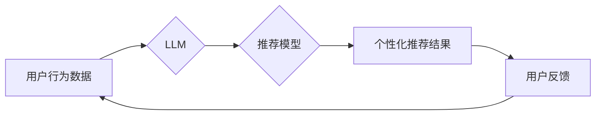

                 

## 利用LLM提升推荐系统的新颖性与惊喜度

> 关键词：推荐系统、LLM、自然语言处理、新颖性、惊喜度、个性化推荐、内容生成

## 1. 背景介绍

推荐系统是互联网时代的重要组成部分，它通过分析用户行为和偏好，为用户提供个性化的内容推荐，例如商品、视频、音乐等。传统的推荐系统主要依赖于协同过滤、内容过滤和基于知识图谱的方法，但这些方法往往存在以下问题：

* **冷启动问题:**  对于新用户或新商品，缺乏历史数据，难以进行准确的推荐。
* **数据稀疏性问题:** 用户行为数据往往稀疏，难以挖掘出潜在的关联性。
* **推荐结果单一性问题:**  传统的推荐系统往往倾向于推荐用户已喜欢的类型，缺乏新颖性和惊喜度。

近年来，大语言模型（LLM）的快速发展为推荐系统带来了新的机遇。LLM拥有强大的文本理解和生成能力，可以帮助推荐系统解决上述问题，提升推荐结果的新颖性和惊喜度。

## 2. 核心概念与联系

### 2.1  LLM概述

大语言模型（LLM）是一种基于Transformer架构的深度学习模型，通过训练海量文本数据，学习语言的语法、语义和上下文关系。LLM可以进行多种自然语言处理任务，例如文本生成、翻译、问答、摘要等。

### 2.2  推荐系统与LLM的结合

LLM可以与推荐系统相结合，通过以下方式提升推荐结果的新颖性和惊喜度：

* **理解用户需求:** LLM可以分析用户的文本描述、评论和行为数据，更深入地理解用户的兴趣和偏好。
* **生成个性化推荐文案:** LLM可以根据用户的兴趣和偏好，生成个性化的推荐文案，吸引用户的注意力。
* **发现新颖的关联性:** LLM可以挖掘用户行为数据中潜在的关联性，推荐用户可能感兴趣但未曾接触过的内容。
* **增强交互体验:** LLM可以与用户进行自然语言交互，提供更人性化的推荐体验。

### 2.3  架构图



## 3. 核心算法原理 & 具体操作步骤

### 3.1  算法原理概述

LLM可以用于推荐系统中的多个环节，例如用户画像构建、推荐内容生成、推荐排序等。

* **用户画像构建:** LLM可以分析用户的文本数据，例如评论、社交媒体帖子等，构建用户的兴趣、偏好和价值观的画像。
* **推荐内容生成:** LLM可以根据用户的画像和历史行为数据，生成个性化的推荐内容，例如商品描述、视频标题、音乐推荐等。
* **推荐排序:** LLM可以学习用户对不同内容的偏好，对推荐结果进行排序，提升推荐的准确性和新颖度。

### 3.2  算法步骤详解

以LLM辅助推荐内容生成为例，具体步骤如下：

1. **数据预处理:** 收集用户行为数据、商品信息、文本评论等数据，进行清洗、格式化和向量化处理。
2. **LLM训练:** 使用预训练的LLM模型，在文本数据上进行微调，使其能够生成符合用户偏好的推荐内容。
3. **内容生成:** 根据用户的画像和历史行为数据，输入到LLM模型中，生成个性化的推荐内容。
4. **内容评估:** 使用指标，例如点击率、转化率等，评估推荐内容的质量和效果。
5. **模型优化:** 根据评估结果，对LLM模型进行调整和优化，提升推荐效果。

### 3.3  算法优缺点

**优点:**

* 能够理解用户需求，生成更个性化的推荐内容。
* 能够挖掘用户行为数据中潜在的关联性，推荐新颖的内容。
* 能够增强用户与推荐系统的交互体验。

**缺点:**

* 训练LLM模型需要大量的计算资源和数据。
* LLM模型的生成内容可能存在偏差或错误。
* 如何评估LLM生成的推荐内容的质量是一个挑战。

### 3.4  算法应用领域

LLM辅助推荐系统可以应用于各个领域，例如：

* **电商推荐:** 为用户推荐个性化的商品。
* **内容推荐:** 为用户推荐个性化的视频、音乐、文章等内容。
* **社交推荐:** 为用户推荐新的朋友或兴趣小组。
* **教育推荐:** 为学生推荐个性化的学习资源。

## 4. 数学模型和公式 & 详细讲解 & 举例说明

### 4.1  数学模型构建

LLM推荐系统可以基于用户-商品交互矩阵构建数学模型，其中用户和商品分别表示为行和列，交互矩阵的每个元素表示用户对商品的评分或偏好程度。

### 4.2  公式推导过程

LLM可以利用矩阵分解等方法，对用户-商品交互矩阵进行分解，得到用户向量和商品向量。用户向量表示用户的兴趣偏好，商品向量表示商品的特征。

$$
\mathbf{R} = \mathbf{U} \mathbf{V}^T
$$

其中：

* $\mathbf{R}$ 是用户-商品交互矩阵。
* $\mathbf{U}$ 是用户向量矩阵。
* $\mathbf{V}$ 是商品向量矩阵。

通过最小化用户-商品交互矩阵与分解结果之间的误差，可以得到用户向量和商品向量。

### 4.3  案例分析与讲解

假设有一个用户-商品交互矩阵，其中用户1对商品A评分为5，用户2对商品B评分为4，则可以利用矩阵分解方法，得到用户1和商品A的向量，用户2和商品B的向量。

## 5. 项目实践：代码实例和详细解释说明

### 5.1  开发环境搭建

推荐系统开发环境通常包括以下组件：

* **编程语言:** Python 是推荐系统开发的常用语言。
* **深度学习框架:** TensorFlow、PyTorch 等深度学习框架可以用于训练LLM模型。
* **数据存储:** MySQL、MongoDB 等数据库可以用于存储用户行为数据和商品信息。
* **云计算平台:** AWS、Azure、GCP 等云计算平台可以提供计算资源和存储空间。

### 5.2  源代码详细实现

以下是一个使用Python和PyTorch实现LLM辅助推荐系统的简单代码示例：

```python
import torch
import torch.nn as nn

class Recommender(nn.Module):
    def __init__(self, embedding_dim, num_users, num_items):
        super(Recommender, self).__init__()
        self.user_embeddings = nn.Embedding(num_users, embedding_dim)
        self.item_embeddings = nn.Embedding(num_items, embedding_dim)

    def forward(self, user_ids, item_ids):
        user_embeddings = self.user_embeddings(user_ids)
        item_embeddings = self.item_embeddings(item_ids)
        return torch.sum(user_embeddings * item_embeddings, dim=1)

# ... 其他代码 ...
```

### 5.3  代码解读与分析

该代码示例定义了一个简单的推荐模型，它使用嵌入层将用户和商品映射到低维向量空间，然后计算用户和商品向量的点积作为推荐评分。

### 5.4  运行结果展示

运行该代码示例可以得到用户对不同商品的推荐评分，并根据评分进行排序，生成推荐结果。

## 6. 实际应用场景

### 6.1  电商推荐

LLM可以帮助电商平台生成更个性化的商品推荐，例如根据用户的浏览历史、购买记录和评论，推荐用户可能感兴趣的商品。

### 6.2  内容推荐

LLM可以帮助内容平台推荐更符合用户兴趣的视频、音乐、文章等内容，例如根据用户的阅读习惯、观看记录和点赞行为，推荐用户可能喜欢的视频。

### 6.3  社交推荐

LLM可以帮助社交平台推荐新的朋友或兴趣小组，例如根据用户的兴趣爱好、社交关系和行为数据，推荐用户可能感兴趣的人或群组。

### 6.4  未来应用展望

LLM在推荐系统领域的应用前景广阔，未来可能在以下方面得到进一步发展：

* **更精准的个性化推荐:** LLM可以更深入地理解用户的需求和偏好，生成更精准的个性化推荐。
* **更丰富的推荐内容:** LLM可以生成多种类型的推荐内容，例如文本、图像、视频等，丰富用户的推荐体验。
* **更智能的交互体验:** LLM可以与用户进行自然语言交互，提供更智能的推荐体验。

## 7. 工具和资源推荐

### 7.1  学习资源推荐

* **书籍:**

    * 《深度学习》 by Ian Goodfellow, Yoshua Bengio, and Aaron Courville
    * 《自然语言处理》 by Dan Jurafsky and James H. Martin

* **在线课程:**

    * Coursera: Deep Learning Specialization
    * Stanford CS224N: Natural Language Processing with Deep Learning

### 7.2  开发工具推荐

* **深度学习框架:** TensorFlow、PyTorch
* **自然语言处理库:** NLTK、spaCy
* **云计算平台:** AWS、Azure、GCP

### 7.3  相关论文推荐

* **BERT: Pre-training of Deep Bidirectional Transformers for Language Understanding**
* **GPT-3: Language Models are Few-Shot Learners**
* **LLaMA: Open and Efficient Foundation Language Models**

## 8. 总结：未来发展趋势与挑战

### 8.1  研究成果总结

LLM在推荐系统领域取得了显著的成果，能够提升推荐结果的新颖性和惊喜度，并为用户提供更个性化和智能的推荐体验。

### 8.2  未来发展趋势

未来LLM在推荐系统领域的应用将更加广泛和深入，例如：

* **多模态推荐:** 将文本、图像、视频等多种模态信息融合到推荐系统中，提供更丰富的推荐体验。
* **动态推荐:** 根据用户的实时行为和环境变化，动态调整推荐结果。
* **解释性推荐:** 为推荐结果提供解释，帮助用户理解推荐背后的逻辑。

### 8.3  面临的挑战

LLM在推荐系统领域的应用也面临一些挑战，例如：

* **数据隐私:** LLM模型训练需要大量用户数据，如何保护用户隐私是一个重要问题。
* **模型可解释性:** LLM模型的决策过程往往难以解释，如何提高模型的可解释性是一个挑战。
* **公平性与偏见:** LLM模型可能存在公平性与偏见问题，需要进行相应的调优和改进。

### 8.4  研究展望

未来研究将继续探索LLM在推荐系统领域的应用，解决上述挑战，并开发出更智能、更安全、更公平的推荐系统。

## 9. 附录：常见问题与解答

### 9.1  LLM模型训练需要多少数据？

LLM模型的训练数据量通常非常大，通常需要数十亿甚至数百亿个文本数据。

### 9.2  如何评估LLM生成的推荐内容的质量？

LLM生成的推荐内容的质量可以根据点击率、转化率、用户满意度等指标进行评估。

### 9.3  LLM模型训练需要多少计算资源？

LLM模型的训练需要大量的计算资源，通常需要使用高性能GPU集群进行训练。


作者：禅与计算机程序设计艺术 / Zen and the Art of Computer Programming 
<end_of_turn>

