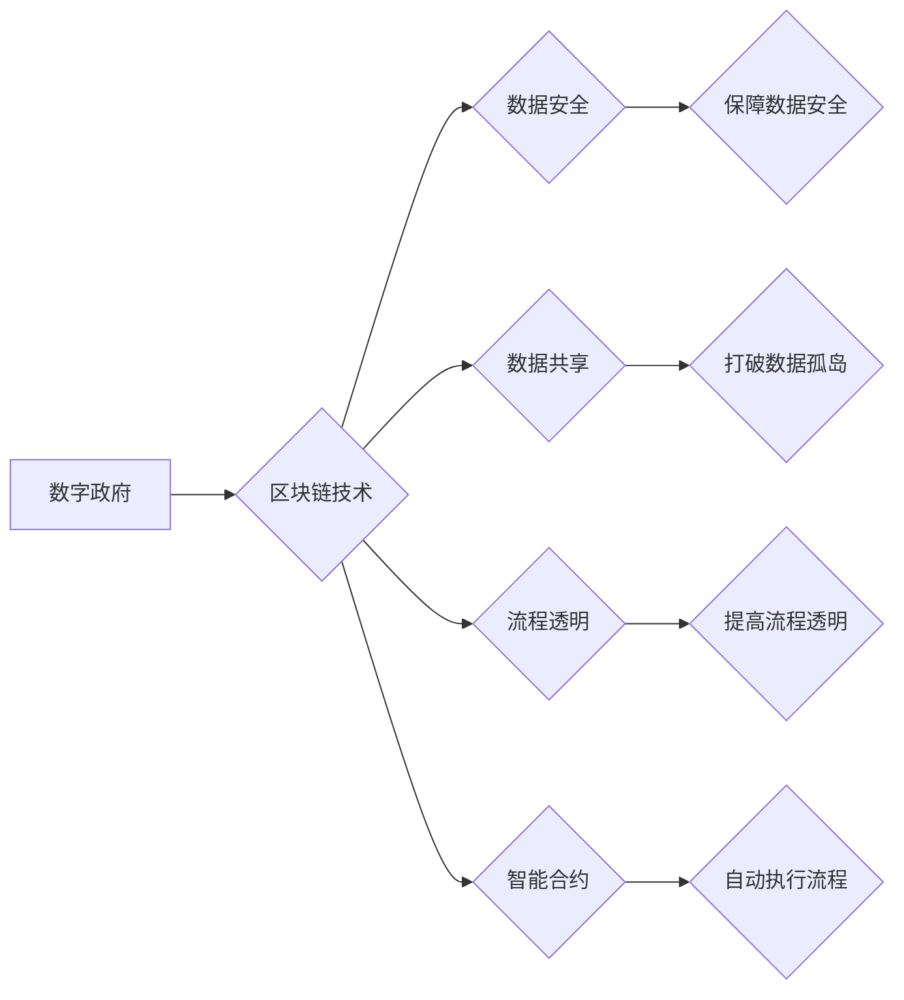

                 

## 区块链在数字政府中的应用与挑战

> 关键词：区块链、数字政府、透明度、安全、去中心化、数据共享、智能合约、应用场景、挑战

## 1. 背景介绍

数字政府是利用信息技术手段，提升政府服务效率、加强政府与公民互动、促进社会治理现代化的重要举措。随着信息技术的快速发展，特别是区块链技术的兴起，数字政府迎来了一次新的变革机遇。区块链作为一种分布式、去中心化、不可篡改的账本技术，具有天然的信任机制和数据安全保障能力，为数字政府建设提供了强大的技术支撑。

传统数字政府系统往往存在着数据孤岛、信息不对称、效率低下、安全风险等问题。区块链技术可以有效解决这些问题，为数字政府建设提供新的解决方案。

## 2. 核心概念与联系

### 2.1 区块链概述

区块链是一种分布式账本技术，它由一系列相互连接的区块组成。每个区块包含着多个交易记录，并通过加密算法进行安全保护。区块链的特点是：

* **分布式:** 数据存储在多个节点上，而不是集中在单一服务器上。
* **去中心化:** 没有中心控制机构，所有节点都拥有数据副本。
* **不可篡改:** 数据一旦写入区块链，就无法被修改或删除。
* **透明公开:** 所有交易记录都公开透明，任何人都可以查看。

### 2.2 数字政府概述

数字政府是指利用信息技术手段，提升政府服务效率、加强政府与公民互动、促进社会治理现代化的重要举措。数字政府的目标是：

* **提高政府服务效率:** 通过在线化、自动化等手段，简化政府办事流程，提高服务效率。
* **加强政府与公民互动:** 通过互联网、移动互联网等平台，加强政府与公民的沟通和互动。
* **促进社会治理现代化:** 通过信息化手段，提高社会治理水平，构建更加透明、高效、公平的社会治理体系。

### 2.3 区块链与数字政府的联系

区块链技术可以为数字政府建设提供以下方面的支持：

* **数据安全:** 区块链的不可篡改性可以保障政府数据的安全性和完整性。
* **数据共享:** 区块链可以实现不同部门之间的数据共享，打破数据孤岛。
* **流程透明:** 区块链可以记录所有政府流程的交易记录，提高流程的透明度和可追溯性。
* **智能合约:** 区块链上的智能合约可以自动执行政府服务流程，提高效率和降低成本。

**区块链与数字政府的联系流程图**



## 3. 核心算法原理 & 具体操作步骤

### 3.1 算法原理概述

区块链的核心算法包括：

* **哈希算法:** 用于生成区块的唯一标识，并确保数据的完整性。
* **密码学算法:** 用于加密和解密数据，保障数据的安全性和隐私性。
* **共识机制:** 用于验证交易和生成新的区块，确保区块链的安全性。

### 3.2 算法步骤详解

1. **交易广播:** 用户发起交易请求，并将交易信息广播到网络中。
2. **交易验证:** 节点验证交易的合法性，并将其添加到待验证交易池中。
3. **区块打包:** 节点将待验证交易打包成区块，并计算区块的哈希值。
4. **共识机制:** 节点通过共识机制验证区块的合法性，并将其添加到区块链中。
5. **区块传播:** 节点将新的区块广播到网络中，所有节点都将更新其区块链副本。

### 3.3 算法优缺点

**优点:**

* **安全性:** 哈希算法和密码学算法确保数据的安全性和完整性。
* **透明度:** 所有交易记录都公开透明，任何人都可以查看。
* **去中心化:** 没有中心控制机构，提高了系统的抗攻击性。

**缺点:**

* **性能:** 区块链的处理能力有限，无法处理大量交易。
* **可扩展性:** 区块链的规模有限，难以扩展到更大的网络。
* **监管:** 区块链的匿名性可能导致监管难度增加。

### 3.4 算法应用领域

区块链技术在数字政府领域的应用场景广泛，包括：

* **电子政务:** 实现政府服务在线化、自动化，提高服务效率。
* **身份认证:** 建立安全可靠的数字身份体系，防止身份欺诈。
* **数据共享:** 实现不同部门之间的数据共享，打破数据孤岛。
* **供应链管理:** 追踪政府采购物资的来源和流向，提高采购透明度。
* **投票系统:** 建立安全可靠的电子投票系统，提高投票的公平性和安全性。

## 4. 数学模型和公式 & 详细讲解 & 举例说明

### 4.1 数学模型构建

区块链的数学模型主要基于密码学和图论。

* **密码学模型:** 用于保证数据的安全性和完整性。常用的密码学算法包括哈希算法、公钥加密算法、数字签名算法等。
* **图论模型:** 用于描述区块链网络的结构和节点之间的关系。区块链可以看作是一个由节点和边组成的图，节点代表区块，边代表区块之间的连接关系。

### 4.2 公式推导过程

**哈希函数:**

哈希函数将任意长度的数据映射到固定长度的哈希值。常用的哈希函数包括SHA-256、MD5等。

$$H(x) = y$$

其中，$x$ 是输入数据，$y$ 是哈希值。

**公钥加密算法:**

公钥加密算法使用一对密钥对进行加密和解密。公钥可以公开使用，而私钥只能由拥有者使用。

$$E_pk(m) = c$$

$$D_{sk}(c) = m$$

其中，$p$ 是公钥，$k$ 是私钥，$m$ 是明文，$c$ 是密文。

### 4.3 案例分析与讲解

**案例:** 假设Alice想发送一条消息给Bob，可以使用公钥加密算法进行加密。Alice首先获取Bob的公钥，然后使用公钥加密消息，发送给Bob。Bob收到消息后，使用自己的私钥解密消息。

**公式应用:**

$$E_{Bob's\ pk}(Alice's\ message) = encrypted\ message$$

$$D_{Bob's\ sk}(encrypted\ message) = Alice's\ message$$

## 5. 项目实践：代码实例和详细解释说明

### 5.1 开发环境搭建

* **操作系统:** Ubuntu 20.04 LTS
* **编程语言:** Python 3.8
* **区块链框架:** Hyperledger Fabric

### 5.2 源代码详细实现

```python
# 定义智能合约
from fabric_contract_api import Contract

class VotingContract(Contract):
    def __init__(self, ctx):
        super().__init__(ctx)

    def vote(self, candidate):
        # 验证投票资格
        # ...

        # 记录投票结果
        # ...

        return "投票成功"

# 部署智能合约
# ...
```

### 5.3 代码解读与分析

* **智能合约定义:** 使用Hyperledger Fabric提供的Contract类定义智能合约。
* **投票方法:** 定义一个vote方法，用于处理投票操作。
* **投票资格验证:** 在vote方法中，需要验证用户的投票资格。
* **投票结果记录:** 记录用户的投票结果，并更新智能合约的状态。

### 5.4 运行结果展示

* **部署智能合约:** 使用Fabric CLI工具部署智能合约到区块链网络中。
* **发起投票:** 使用Fabric SDK或其他工具发起投票操作。
* **查看投票结果:** 使用Fabric CLI工具或其他工具查看投票结果。

## 6. 实际应用场景

### 6.1 电子政务

区块链可以用于构建安全可靠的电子政务平台，实现政府服务在线化、自动化，提高服务效率。例如，可以使用区块链技术实现电子身份认证、电子签章、电子合同等功能，简化政府办事流程，提高办事效率。

### 6.2 身份认证

区块链可以用于建立安全可靠的数字身份体系，防止身份欺诈。例如，可以使用区块链技术实现公民身份认证、企业法人认证等功能，提高身份认证的安全性。

### 6.3 数据共享

区块链可以实现不同部门之间的数据共享，打破数据孤岛。例如，可以使用区块链技术实现医疗数据共享、教育数据共享等功能，提高数据利用效率。

### 6.4 未来应用展望

区块链技术在数字政府领域的应用前景广阔，未来可能应用于以下领域：

* **智慧城市:** 建立智慧城市平台，实现城市管理的智能化和数据化。
* **公共服务:** 提供更加便捷、高效、透明的公共服务。
* **社会治理:** 提升社会治理水平，构建更加公平、公正、透明的社会治理体系。

## 7. 工具和资源推荐

### 7.1 学习资源推荐

* **Hyperledger Fabric官方文档:** https://hyperledger-fabric.readthedocs.io/en/latest/
* **区块链技术入门书籍:** 《区块链技术入门》、《区块链：从原理到实践》

### 7.2 开发工具推荐

* **Fabric SDK:** https://github.com/hyperledger/fabric-sdk-python
* **Truffle Suite:** https://trufflesuite.com/

### 7.3 相关论文推荐

* **Blockchain Technology for Government Applications:** https://arxiv.org/abs/1803.06734
* **A Survey of Blockchain Applications in E-Government:** https://ieeexplore.ieee.org/document/8808567

## 8. 总结：未来发展趋势与挑战

### 8.1 研究成果总结

区块链技术为数字政府建设提供了新的解决方案，可以有效解决传统数字政府系统存在的问题。

### 8.2 未来发展趋势

* **技术成熟度提升:** 区块链技术的性能、可扩展性和安全性将不断提升。
* **应用场景拓展:** 区块链技术在数字政府领域的应用场景将不断拓展。
* **标准化规范制定:** 区块链技术在数字政府领域的应用将逐步规范化。

### 8.3 面临的挑战

* **技术复杂性:** 区块链技术本身较为复杂，需要专业人员进行开发和维护。
* **监管政策:** 区块链技术的监管政策尚不完善，需要政府部门制定相应的政策法规。
* **公众认知度:** 公众对区块链技术的认知度还比较低，需要加强宣传和教育。

### 8.4 研究展望

未来，区块链技术在数字政府领域的应用将更加广泛和深入，需要进一步研究以下问题：

* 如何提高区块链技术的性能和可扩展性？
* 如何制定完善的区块链技术监管政策？
* 如何提高公众对区块链技术的认知度？


## 9. 附录：常见问题与解答

**常见问题:**

* **区块链技术是否安全可靠？**

**解答:** 区块链技术具有天然的安全性，数据存储在多个节点上，难以被篡改。

* **区块链技术是否适用于所有数字政府应用场景？**

**解答:** 区块链技术适用于需要保障数据安全、透明性和不可篡改性的应用场景。

* **区块链技术的应用成本高吗？**

**解答:** 区块链技术的应用成本取决于具体的应用场景和技术方案。

**作者：禅与计算机程序设计艺术 / Zen and the Art of Computer Programming**<end_of_turn>

