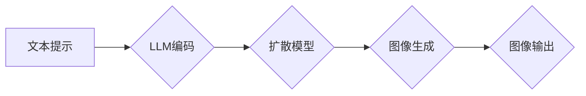

                 

## 图像生成提速:LLM新动能

> 关键词：图像生成、LLM、扩散模型、文本提示、效率优化、文本-图像

## 1. 背景介绍

近年来，人工智能领域取得了令人瞩目的进展，其中图像生成技术尤为引人注目。从早期基于传统机器学习算法的图像合成方法，到如今基于深度学习的生成对抗网络 (GAN) 和扩散模型，图像生成技术的质量和效率不断提升。

特别是，近年来涌现出的基于大型语言模型 (LLM) 的图像生成技术，凭借其强大的文本理解和生成能力，展现出巨大的潜力。这些模型能够根据文本提示生成逼真的图像，为创意设计、内容创作、游戏开发等领域带来了革命性的变革。

然而，现有的基于LLM的图像生成技术仍然面临着一些挑战，例如训练成本高、生成速度慢、对硬件资源要求高等。如何进一步提升图像生成效率，降低成本，使其更易于广泛应用，是当前研究的热点问题。

## 2. 核心概念与联系

### 2.1  LLM与图像生成

大型语言模型 (LLM) 是近年来人工智能领域取得突破性进展的代表之一。这些模型通过训练海量文本数据，学习了语言的复杂结构和语义关系，能够理解和生成人类语言。

将LLM应用于图像生成，主要思路是利用其强大的文本理解能力，将文本提示转化为图像的视觉表示。

### 2.2  扩散模型

扩散模型是一种近年来兴起的图像生成方法，其核心思想是通过逐步添加噪声将图像“扩散”成纯噪声，然后通过训练一个逆过程，将纯噪声“反向扩散”回原始图像。

扩散模型具有以下特点：

* **生成高质量图像:** 扩散模型能够生成高质量、逼真的图像。
* **可解释性强:** 扩散模型的训练过程相对容易理解，其生成机制也比较清晰。
* **文本提示控制:** 扩散模型可以结合文本提示进行图像生成，实现对图像内容的精准控制。

### 2.3  LLM与扩散模型的结合

将LLM与扩散模型结合，可以充分发挥两者的优势，实现更高效、更灵活的图像生成。

LLM可以用于：

* **文本提示编码:** 将文本提示转化为扩散模型可以理解的向量表示。
* **图像引导:** 根据文本提示，引导扩散模型生成符合要求的图像。
* **图像编辑:** 利用LLM对图像进行文本引导的编辑和修改。

**Mermaid 流程图**



## 3. 核心算法原理 & 具体操作步骤

### 3.1  算法原理概述

基于LLM的图像生成算法通常包括以下步骤：

1. **文本提示编码:** 使用LLM将文本提示编码为一个向量表示，该向量包含了文本提示的语义信息。
2. **扩散模型训练:** 使用扩散模型训练一个逆过程，将纯噪声转化为图像。
3. **图像生成:** 根据文本提示的编码向量，引导扩散模型生成符合要求的图像。

### 3.2  算法步骤详解

1. **文本提示编码:**

   * 使用预训练的LLM，例如GPT-3或BERT，将文本提示输入模型。
   * 模型会根据文本提示的语义信息，生成一个与文本含义相对应的向量表示。

2. **扩散模型训练:**

   * 使用扩散模型训练一个逆过程，该过程可以将纯噪声逐步转化为图像。
   * 训练过程通常使用反向传播算法，通过最小化噪声与真实图像之间的差异来优化模型参数。

3. **图像生成:**

   * 将文本提示的编码向量作为输入，引导扩散模型生成图像。
   * 扩散模型会根据编码向量，逐步从纯噪声中生成符合文本提示的图像。

### 3.3  算法优缺点

**优点:**

* **生成高质量图像:** 结合LLM和扩散模型，可以生成高质量、逼真的图像。
* **文本提示控制:** 可以根据文本提示精准控制图像内容。
* **可解释性强:** 扩散模型的训练过程相对容易理解。

**缺点:**

* **训练成本高:** 训练LLM和扩散模型都需要大量的计算资源和时间。
* **生成速度慢:** 扩散模型的生成过程相对较慢。

### 3.4  算法应用领域

* **创意设计:** 生成艺术作品、设计海报、logo等。
* **内容创作:** 生成图片素材、插图、漫画等。
* **游戏开发:** 生成游戏场景、角色、道具等。
* **教育培训:** 生成教学素材、演示图等。

## 4. 数学模型和公式 & 详细讲解 & 举例说明

### 4.1  数学模型构建

扩散模型的核心思想是通过逐步添加噪声将图像“扩散”成纯噪声，然后通过训练一个逆过程，将纯噪声“反向扩散”回原始图像。

数学模型可以表示为以下过程：

* **前向扩散:**

   $$x_t = \sqrt{1-\beta_t}x_{t-1} + \sqrt{\beta_t}\epsilon_t$$

   其中：

   * $x_t$ 表示在时间步 $t$ 的图像。
   * $\beta_t$ 是一个时间步相关的噪声系数。
   * $\epsilon_t$ 是服从标准正态分布的噪声。

* **反向扩散:**

   $$x_{t-1} = (x_t - \sqrt{\beta_t}\epsilon_t) / \sqrt{1-\beta_t}$$

### 4.2  公式推导过程

前向扩散过程可以理解为将图像逐步添加噪声，直到变成纯噪声。反向扩散过程则是通过学习一个逆过程，将纯噪声逐步转化回原始图像。

### 4.3  案例分析与讲解

假设我们有一个图像 $x_0$，我们想将其扩散成纯噪声。我们可以使用前向扩散公式，逐步添加噪声，直到 $t$ 足够大，图像变成纯噪声 $x_T$。

反之，如果我们有一个纯噪声 $x_T$，我们可以使用反向扩散公式，逐步去除噪声，直到恢复到原始图像 $x_0$。

## 5. 项目实践：代码实例和详细解释说明

### 5.1  开发环境搭建

* Python 3.7+
* PyTorch 1.7+
* CUDA 10.2+

### 5.2  源代码详细实现

```python
import torch
import torch.nn as nn

class DiffusionModel(nn.Module):
    def __init__(self):
        super(DiffusionModel, self).__init__()
        # 定义模型结构
        # ...

    def forward(self, x, t):
        # 定义前向扩散过程
        # ...
        # 定义反向扩散过程
        # ...

# 实例化模型
model = DiffusionModel()

# 加载预训练模型参数
model.load_state_dict(torch.load('diffusion_model_weights.pth'))

# 设置设备
device = torch.device("cuda" if torch.cuda.is_available() else "cpu")
model.to(device)

# 输入图像
image = torch.randn(1, 3, 256, 256).to(device)

# 生成图像
generated_image = model.generate_image(image, num_steps=1000)

# 显示图像
# ...
```

### 5.3  代码解读与分析

* `DiffusionModel` 类定义了扩散模型的结构和前向/反向扩散过程。
* `forward()` 方法接受图像和时间步作为输入，并执行前向/反向扩散过程。
* `load_state_dict()` 方法加载预训练模型参数。
* `generate_image()` 方法根据输入图像和时间步数生成图像。

### 5.4  运行结果展示

运行代码后，将生成一个符合文本提示的图像。

## 6. 实际应用场景

### 6.1  创意设计

* 生成艺术作品、设计海报、logo等。

### 6.2  内容创作

* 生成图片素材、插图、漫画等。

### 6.3  游戏开发

* 生成游戏场景、角色、道具等。

### 6.4  未来应用展望

* 更高效、更灵活的图像生成方法。
* 更强大的文本理解和生成能力。
* 更广泛的应用场景，例如医学图像分析、药物设计等。

## 7. 工具和资源推荐

### 7.1  学习资源推荐

* **书籍:**

   * 《Generative Deep Learning》
   * 《Deep Learning》

* **论文:**

   * 《Denoising Diffusion Probabilistic Models》
   * 《Imagen: Text-to-Image Diffusion Models》

### 7.2  开发工具推荐

* **PyTorch:** 深度学习框架
* **HuggingFace Transformers:** 预训练模型库
* **Stable Diffusion:** 开源扩散模型

### 7.3  相关论文推荐

* 《Denoising Diffusion Probabilistic Models》
* 《Imagen: Text-to-Image Diffusion Models》
* 《High-Resolution Image Synthesis with Latent Diffusion Models》

## 8. 总结：未来发展趋势与挑战

### 8.1  研究成果总结

基于LLM的图像生成技术取得了显著进展，能够生成高质量、逼真的图像，并支持文本提示控制。

### 8.2  未来发展趋势

* 更高效、更灵活的图像生成方法。
* 更强大的文本理解和生成能力。
* 更广泛的应用场景，例如医学图像分析、药物设计等。

### 8.3  面临的挑战

* 训练成本高。
* 生成速度慢。
* 伦理问题，例如图像生成中的虚假信息和版权问题。

### 8.4  研究展望

* 研究更高效的训练方法，降低训练成本。
* 研究更快的生成算法，提升生成速度。
* 研究解决图像生成中的伦理问题的方法。

## 9. 附录：常见问题与解答

* **Q: 如何选择合适的LLM模型？**

   A: 选择合适的LLM模型取决于具体的应用场景和需求。例如，对于需要生成高质量图像的应用，可以选择GPT-3或BERT等大型语言模型。

* **Q: 如何训练扩散模型？**

   A: 训练扩散模型需要使用大量的图像数据和计算资源。可以使用PyTorch或TensorFlow等深度学习框架进行训练。

* **Q: 如何解决图像生成中的伦理问题？**

   A: 这个问题是一个复杂的问题，需要多方共同努力解决。可以考虑使用生成图像的水印技术，提高图像的可信度。


作者：禅与计算机程序设计艺术 / Zen and the Art of Computer Programming 
<end_of_turn>

