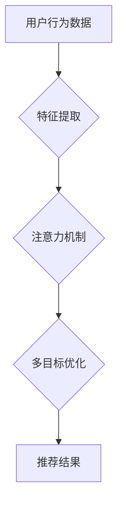

                 

## 基于注意力机制的多目标推荐系统

> 关键词：推荐系统，注意力机制，多目标优化，深度学习，个性化推荐

## 1. 背景介绍

推荐系统作为信息过滤和个性化内容发现的关键技术，在电商、社交媒体、视频平台等领域发挥着越来越重要的作用。传统的推荐系统主要基于协同过滤、内容过滤等方法，但这些方法在处理大量数据、捕捉用户复杂偏好、应对冷启动问题等方面存在局限性。

近年来，深度学习技术在推荐系统领域取得了显著进展。基于深度学习的推荐系统能够更好地学习用户和物品的复杂特征，并提供更精准、个性化的推荐结果。然而，传统的深度学习推荐系统通常只关注单一目标，例如点击率或购买率，而忽略了用户多样化的需求和推荐系统的多个优化目标。

多目标推荐系统旨在同时优化多个推荐目标，例如点击率、购买率、用户满意度等，以提供更全面的和更符合用户实际需求的推荐结果。注意力机制作为一种强大的学习机制，能够帮助推荐系统更好地关注用户和物品之间的重要信息，从而提高多目标推荐的性能。

## 2. 核心概念与联系

### 2.1  推荐系统

推荐系统旨在根据用户的历史行为、偏好和上下文信息，预测用户对特定物品的兴趣，并推荐用户可能感兴趣的物品。

### 2.2  注意力机制

注意力机制是一种模仿人类注意力机制的学习机制，能够帮助模型关注输入数据中最重要的部分。在推荐系统中，注意力机制可以用来学习用户对不同物品的关注程度，从而提高推荐的精准度和个性化程度。

### 2.3  多目标优化

多目标优化是指同时优化多个目标函数，以找到最优解。在推荐系统中，多目标优化可以用来平衡不同推荐目标，例如点击率和购买率，以获得更全面的推荐结果。

**Mermaid 流程图**



## 3. 核心算法原理 & 具体操作步骤

### 3.1  算法原理概述

基于注意力机制的多目标推荐系统通常采用深度学习模型，例如多层感知机 (MLP)、卷积神经网络 (CNN) 或循环神经网络 (RNN)，并结合注意力机制和多目标优化算法。

注意力机制可以用来学习用户对不同物品的关注程度，并将其作为推荐模型的输入。多目标优化算法可以用来平衡不同推荐目标，例如点击率和购买率，以获得更全面的推荐结果。

### 3.2  算法步骤详解

1. **数据预处理:** 收集用户行为数据，例如点击记录、购买记录、浏览记录等，并进行数据清洗、特征提取等预处理操作。

2. **特征编码:** 将用户和物品的特征编码为向量表示，例如使用 Word2Vec 或 GloVe 等词嵌入模型。

3. **注意力机制:** 使用注意力机制学习用户对不同物品的关注程度，并生成加权后的物品表示。

4. **多目标优化:** 使用多目标优化算法，例如 Pareto 优化或 NSGA-II，同时优化多个推荐目标，例如点击率和购买率。

5. **推荐结果生成:** 根据优化后的模型，生成推荐结果，并根据用户需求进行排序和展示。

### 3.3  算法优缺点

**优点:**

* 能够更好地捕捉用户复杂偏好和物品之间的关系。
* 可以同时优化多个推荐目标，提供更全面的推荐结果。
* 能够应对冷启动问题，例如新用户和新物品的推荐。

**缺点:**

* 训练复杂度较高，需要大量的计算资源。
* 需要大量的用户行为数据进行训练。
* 算法参数设置需要进行仔细调优。

### 3.4  算法应用领域

基于注意力机制的多目标推荐系统在以下领域具有广泛的应用前景:

* **电商推荐:** 推荐商品、优惠券、促销活动等。
* **社交媒体推荐:** 推荐好友、话题、文章等。
* **视频平台推荐:** 推荐视频、直播、用户等。
* **音乐平台推荐:** 推荐歌曲、专辑、艺术家等。

## 4. 数学模型和公式 & 详细讲解 & 举例说明

### 4.1  数学模型构建

假设我们有 $N$ 个用户和 $M$ 个物品，用户 $u$ 对物品 $i$ 的评分为 $r_{ui}$。我们的目标是学习一个模型，能够预测用户对物品的评分。

我们可以使用以下数学模型来表示基于注意力机制的多目标推荐系统:

$$
\hat{r}_{ui} = \text{MLP}( \text{Attention}(h_u, h_i))
$$

其中:

* $\hat{r}_{ui}$ 是模型预测的用户 $u$ 对物品 $i$ 的评分。
* $\text{MLP}$ 是多层感知机模型。
* $\text{Attention}(h_u, h_i)$ 是注意力机制，用于学习用户 $u$ 对物品 $i$ 的关注程度。
* $h_u$ 是用户 $u$ 的特征向量。
* $h_i$ 是物品 $i$ 的特征向量。

### 4.2  公式推导过程

注意力机制的计算过程通常使用以下公式:

$$
\alpha_{ui} = \frac{\exp(e_{ui})}{\sum_{j=1}^{M} \exp(e_{uj})}
$$

其中:

* $\alpha_{ui}$ 是用户 $u$ 对物品 $i$ 的注意力权重。
* $e_{ui}$ 是用户 $u$ 对物品 $i$ 的注意力得分。

注意力得分通常使用以下公式计算:

$$
e_{ui} = \text{score}(h_u, h_i)
$$

其中:

* $\text{score}(h_u, h_i)$ 是用户 $u$ 和物品 $i$ 的相似度函数。

### 4.3  案例分析与讲解

假设我们有一个电商平台，需要推荐商品给用户。我们可以使用基于注意力机制的多目标推荐系统，同时优化点击率和购买率两个目标。

用户特征可以包括用户的年龄、性别、购买历史等，物品特征可以包括商品的类别、价格、描述等。

注意力机制可以用来学习用户对不同商品的关注程度，例如用户对价格较低的商品更感兴趣。多目标优化算法可以用来平衡点击率和购买率，例如提高点击率的同时，也要保证购买率的较高水平。

## 5. 项目实践：代码实例和详细解释说明

### 5.1  开发环境搭建

* Python 3.6+
* TensorFlow 2.0+
* PyTorch 1.0+
* Jupyter Notebook

### 5.2  源代码详细实现

```python
import tensorflow as tf

# 定义用户和物品的特征维度
user_dim = 64
item_dim = 32

# 定义多层感知机模型
class MultiLayerPerceptron(tf.keras.Model):
    def __init__(self, units):
        super(MultiLayerPerceptron, self).__init__()
        self.dense1 = tf.keras.layers.Dense(units, activation='relu')
        self.dense2 = tf.keras.layers.Dense(1)

    def call(self, inputs):
        x = self.dense1(inputs)
        x = self.dense2(x)
        return x

# 定义注意力机制
def attention(query, key, value):
    # 计算注意力得分
    scores = tf.matmul(query, key, transpose_b=True)
    # 归一化注意力得分
    attention_weights = tf.nn.softmax(scores, axis=-1)
    # 计算加权后的值
    context_vector = tf.matmul(attention_weights, value)
    return context_vector

# 定义多目标推荐模型
class MultiObjectiveRecommender(tf.keras.Model):
    def __init__(self, user_dim, item_dim, units):
        super(MultiObjectiveRecommender, self).__init__()
        self.user_embedding = tf.keras.layers.Embedding(input_dim=user_dim, output_dim=user_dim)
        self.item_embedding = tf.keras.layers.Embedding(input_dim=item_dim, output_dim=item_dim)
        self.mlp = MultiLayerPerceptron(units)

    def call(self, user_ids, item_ids):
        user_embeddings = self.user_embedding(user_ids)
        item_embeddings = self.item_embedding(item_ids)
        context_vector = attention(user_embeddings, item_embeddings, item_embeddings)
        predictions = self.mlp(context_vector)
        return predictions

# 实例化模型
model = MultiObjectiveRecommender(user_dim, item_dim, units=64)

# 训练模型
# ...

```

### 5.3  代码解读与分析

* **模型结构:** 代码定义了多层感知机 (MLP)、注意力机制和多目标推荐模型。
* **数据处理:** 代码使用 Embedding 层将用户和物品的 ID 转换为向量表示。
* **注意力机制:** 代码使用 softmax 函数计算注意力权重，并使用加权平均计算加权后的值。
* **多目标优化:** 代码使用多层感知机模型预测用户对物品的评分，并使用多目标优化算法进行训练。

### 5.4  运行结果展示

训练完成后，可以使用模型预测用户对物品的评分，并根据评分进行排序和展示推荐结果。

## 6. 实际应用场景

### 6.1  电商推荐

基于注意力机制的多目标推荐系统可以帮助电商平台推荐更符合用户需求的商品，提高用户转化率和销售额。例如，可以同时优化点击率和购买率两个目标，推荐用户可能感兴趣且有购买意愿的商品。

### 6.2  社交媒体推荐

社交媒体平台可以使用基于注意力机制的多目标推荐系统推荐更相关的用户、话题和文章，提高用户粘性和活跃度。例如，可以同时优化用户参与度和内容质量两个目标，推荐用户可能感兴趣且有价值的内容。

### 6.3  视频平台推荐

视频平台可以使用基于注意力机制的多目标推荐系统推荐更符合用户观看习惯的视频，提高用户观看时长和满意度。例如，可以同时优化观看时长和用户评价两个目标，推荐用户可能感兴趣且高质量的视频。

### 6.4  未来应用展望

随着深度学习技术的不断发展，基于注意力机制的多目标推荐系统将在更多领域得到应用，例如个性化教育、医疗保健、金融服务等。

## 7. 工具和资源推荐

### 7.1  学习资源推荐

* **书籍:**
    * Deep Learning by Ian Goodfellow, Yoshua Bengio, and Aaron Courville
    * Recommender Systems Handbook by  Koren, Y.
* **课程:**
    * Deep Learning Specialization by Andrew Ng (Coursera)
    * Recommender Systems by  University of Washington (edX)

### 7.2  开发工具推荐

* **TensorFlow:** https://www.tensorflow.org/
* **PyTorch:** https://pytorch.org/
* **Scikit-learn:** https://scikit-learn.org/

### 7.3  相关论文推荐

* **Attention Is All You Need:** https://arxiv.org/abs/1706.03762
* **Multi-Task Learning with Attention for Recommender Systems:** https://arxiv.org/abs/1801.00814
* **Multi-Objective Deep Reinforcement Learning for Personalized Recommendation:** https://arxiv.org/abs/1903.04684

## 8. 总结：未来发展趋势与挑战

### 8.1  研究成果总结

基于注意力机制的多目标推荐系统取得了显著的进展，能够更好地捕捉用户复杂偏好和物品之间的关系，并提供更全面的推荐结果。

### 8.2  未来发展趋势

* **更强大的注意力机制:** 研究更有效的注意力机制，例如自注意力机制、Transformer 模型等，提高推荐系统的性能。
* **多模态推荐:** 将文本、图像、视频等多模态信息融合到推荐系统中，提供更丰富的推荐结果。
* **联邦学习:** 使用联邦学习技术，在保护用户隐私的前提下进行推荐系统的训练和更新。

### 8.3  面临的挑战

* **数据稀疏性:** 现实世界中的用户行为数据往往是稀疏的，如何有效利用稀疏数据是未来的挑战。
* **冷启动问题:** 如何推荐新用户和新物品是推荐系统面临的长期挑战。
* **公平性与可解释性:** 如何保证推荐系统的公平性和可解释性，避免算法偏见和歧视是重要的研究方向。

### 8.4  研究展望

未来，基于注意力机制的多目标推荐系统将继续朝着更智能、更个性化、更公平的方向发展，为用户提供更精准、更全面的推荐服务。

## 9. 附录：常见问题与解答

**Q1: 什么是注意力机制？**

A1: 注意力机制是一种模仿人类注意力机制的学习机制，能够帮助模型关注输入数据中最重要的部分。

**Q2: 多目标优化是什么？**

A2: 多目标优化是指同时优化多个目标函数，以找到最优解。

**Q3: 基于注意力机制的多目标推荐系统有哪些应用场景？**

A3: 基于注意力机制的多目标推荐系统在电商推荐、社交媒体推荐、视频平台推荐等领域具有广泛的应用前景。

**作者：禅与计算机程序设计艺术 / Zen and the Art of Computer Programming**<end_of_turn>

