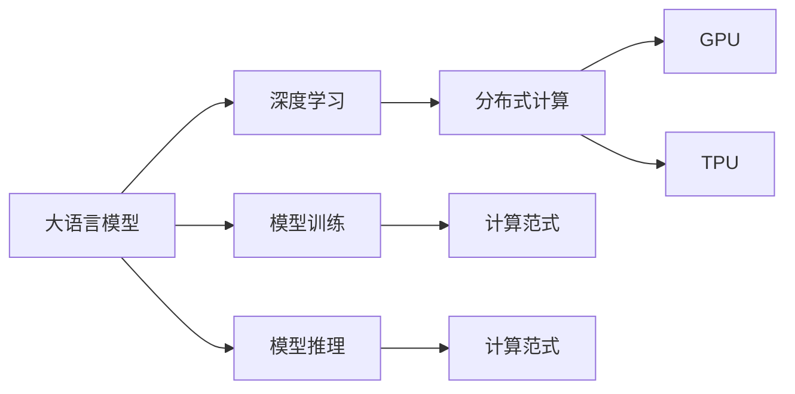

                 

# LLM vs CPU：计算范式的革命性对比

> 关键词：大语言模型,计算范式,深度学习,人工智能,分布式计算,GPU,TPU,模型训练,推理加速,优化

## 1. 背景介绍

### 1.1 问题由来
在人工智能(AI)技术迅猛发展的当下，大语言模型(Large Language Models, LLMs)作为深度学习领域的热门研究对象，逐渐从实验室走向了实际应用，其背后驱动的计算范式也正在经历着深刻变革。传统意义上的计算，往往被限定在CPU上执行。而随着AI计算需求的大幅增长，人们开始探索更高效、更适应大规模并行计算的计算范式。大语言模型在训练和推理时的高计算需求，使得计算范式革新显得尤为重要。

在深度学习模型中，GPU和TPU成为了处理大模型计算的核心硬件。但这些高速运算硬件的引入，仅仅解决了“能够计算”的问题，如何更高效地使用这些硬件，以提高模型训练和推理的速度，成为了一个亟待解决的问题。而深度学习模型的优化，本质上是一种基于模型的优化技术，其核心是对模型结构和参数进行精心调整，以最小化损失函数，使得模型能够更准确地拟合训练数据。因此，本文将深入探讨深度学习模型优化中的关键概念，对比基于不同计算范式的模型训练和推理加速，并探讨未来可能的计算范式变革。

### 1.2 问题核心关键点
本文将主要关注以下几个核心问题：
- 大语言模型的计算需求与传统CPU计算范式的对比。
- 如何在GPU和TPU上高效进行模型训练和推理加速。
- 计算范式变革对未来大语言模型应用的影响。

## 2. 核心概念与联系

### 2.1 核心概念概述

为了更清楚地理解大语言模型与计算范式之间的关系，本节将介绍几个关键概念：

- 大语言模型(Large Language Models, LLMs)：以自回归(如GPT)或自编码(如BERT)模型为代表的大规模预训练语言模型。通过在大规模无标签文本语料上进行预训练，学习通用的语言表示，具备强大的语言理解和生成能力。

- 深度学习(Deep Learning)：一种基于多层神经网络的机器学习算法，通过对数据的复杂特征进行建模，实现对数据的高级抽象与处理。

- 分布式计算(Distributed Computing)：通过将任务分解成若干子任务，在多个计算节点上并行执行，以加速计算过程。

- GPU (Graphics Processing Unit)：一种专门用于图形渲染和科学计算的硬件加速器，可以大幅提升并行计算效率。

- TPU (Tensor Processing Unit)：一种专门为深度学习模型设计的硬件加速器，通过集成更高效的计算单元和更紧密的硬件集成，进一步提升了深度学习模型的训练和推理速度。

- 模型训练与推理加速：通过优化模型结构、参数、计算方式等手段，在GPU和TPU上实现高效计算，以提升模型性能。

这些概念之间存在密切联系，构成了深度学习模型在大语言模型中的应用基础。通过深入理解这些概念，可以更好地把握深度学习模型在大语言模型中的应用范式和优化手段。

### 2.2 核心概念原理和架构的 Mermaid 流程图(Mermaid 流程节点中不要有括号、逗号等特殊字符)



这个流程图展示了大语言模型与深度学习、分布式计算、GPU和TPU之间的联系：

1. 大语言模型通过深度学习实现语言的高级抽象。
2. 深度学习模型通过分布式计算提高计算效率。
3. GPU和TPU为深度学习提供高效计算硬件支持。
4. 深度学习模型通过不同的计算范式优化训练和推理。

## 3. 核心算法原理 & 具体操作步骤

### 3.1 算法原理概述

深度学习模型优化包括模型训练和推理加速两个方面。在训练阶段，模型需要不断地调整参数以最小化损失函数。而在推理阶段，模型则需要快速、准确地输出结果。因此，深度学习模型优化需要在保证精度的情况下，尽可能地提升计算效率。

以大语言模型为例，其训练通常涉及大规模的无标签数据集，需要处理复杂的深度神经网络结构，具有高度的计算复杂性。为了在GPU和TPU上高效进行训练和推理，需要采用以下优化方法：

- **参数优化**：通过调整模型参数，减少计算量，提高训练和推理效率。
- **计算图优化**：对计算图进行重构，减少冗余计算，提高计算效率。
- **分布式计算**：通过将计算任务分配到多个节点，实现并行计算，加速训练和推理过程。

### 3.2 算法步骤详解

深度学习模型优化涉及多个步骤，具体如下：

**Step 1: 选择优化算法**
- 确定优化算法（如SGD、Adam、AdamW等）和其相关超参数（如学习率、动量等）。

**Step 2: 训练数据准备**
- 将训练数据集分为批次进行训练。

**Step 3: 计算图构建**
- 构建计算图，确保各层之间的数据流动。

**Step 4: 分布式计算**
- 将计算任务分配到多个GPU或TPU节点上进行并行计算。

**Step 5: 梯度下降**
- 通过反向传播计算损失函数的梯度，并使用优化算法更新模型参数。

**Step 6: 训练完成**
- 监控训练过程中的各项指标（如损失函数、准确率等），调整参数以优化模型。

**Step 7: 推理加速**
- 在推理阶段，对计算图进行优化，如剪枝、量化、并行计算等，以提升推理速度。

### 3.3 算法优缺点

深度学习模型的优化方法具有以下优点：
- **高效性**：通过优化算法和计算图优化，可以大幅提升计算效率。
- **可扩展性**：分布式计算可以轻松地扩展到多个GPU或TPU节点，以处理更大规模的数据集。
- **可控性**：优化方法可以精细调整，以达到最优性能。

同时，也存在以下缺点：
- **复杂性**：优化算法和计算图重构较为复杂，需要一定的专业知识和经验。
- **资源需求**：高效的优化往往需要更多的计算资源，如GPU、TPU等。
- **调试困难**：深度学习模型的调试和调试难度较大，需要大量的实验和调试过程。

### 3.4 算法应用领域

深度学习模型的优化方法广泛应用于以下几个领域：

- 自然语言处理(NLP)：如大语言模型微调、机器翻译、文本分类等任务。
- 计算机视觉(CV)：如图像分类、物体检测、图像分割等任务。
- 语音识别(SR)：如自动语音识别、语音合成等任务。
- 信号处理(SP)：如音频处理、信号处理等任务。
- 推荐系统(Reco)：如协同过滤、内容推荐等任务。

此外，深度学习模型优化还被应用于众多其他领域，如医疗诊断、金融分析、游戏AI等，展示了其广泛的应用前景。

## 4. 数学模型和公式 & 详细讲解 & 举例说明

### 4.1 数学模型构建

在深度学习中，模型的优化目标是通过最小化损失函数来提升模型的准确性。假设模型的损失函数为 $L(\theta)$，其中 $\theta$ 为模型参数。优化目标是求解最小值：

$$
\min_\theta L(\theta)
$$

优化算法通过不断地更新参数 $\theta$，使得 $L(\theta)$ 逐渐减小。常见的优化算法包括梯度下降法、随机梯度下降法、Adam等。

### 4.2 公式推导过程

以梯度下降法为例，其基本思路是通过计算损失函数对参数的梯度，反向传播更新模型参数。假设模型输出为 $y$，真实标签为 $y_0$，则梯度下降法的更新公式为：

$$
\theta = \theta - \eta \nabla_{\theta}L(\theta)
$$

其中，$\eta$ 为学习率，$\nabla_{\theta}L(\theta)$ 为损失函数对参数的梯度。

在实际应用中，梯度下降法通常使用批量梯度下降法(batch gradient descent)，即每次更新时使用一批数据计算梯度，如下所示：

$$
\theta = \theta - \eta \frac{1}{m}\sum_{i=1}^m \nabla_{\theta}L(\theta)
$$

其中 $m$ 为批量大小。

### 4.3 案例分析与讲解

假设我们使用一个简单的线性回归模型，其损失函数为均方误差损失：

$$
L(y,y_0) = \frac{1}{2m} \sum_{i=1}^m (y - y_0)^2
$$

其中 $y$ 为模型预测值，$y_0$ 为真实标签。通过梯度下降法，可以计算出模型参数的更新公式为：

$$
w = w - \eta \frac{1}{m} \sum_{i=1}^m (y - y_0) \nabla_{w}L(y,y_0)
$$

通过不断迭代更新参数 $w$，直至损失函数最小化。

## 5. 项目实践：代码实例和详细解释说明

### 5.1 开发环境搭建

为了在GPU和TPU上高效进行深度学习模型优化，需要配置相应的开发环境。以下是使用PyTorch搭建开发环境的步骤：

1. 安装Anaconda：从官网下载并安装Anaconda，用于创建独立的Python环境。

2. 创建并激活虚拟环境：
```bash
conda create -n pytorch-env python=3.8 
conda activate pytorch-env
```

3. 安装PyTorch：根据CUDA版本，从官网获取对应的安装命令。例如：
```bash
conda install pytorch torchvision torchaudio cudatoolkit=11.1 -c pytorch -c conda-forge
```

4. 安装transformers库：
```bash
pip install transformers
```

5. 安装各类工具包：
```bash
pip install numpy pandas scikit-learn matplotlib tqdm jupyter notebook ipython
```

完成上述步骤后，即可在`pytorch-env`环境中开始深度学习模型优化实践。

### 5.2 源代码详细实现

这里以一个简单的线性回归模型为例，展示在GPU上使用PyTorch进行优化。

首先，定义模型和损失函数：

```python
import torch
import torch.nn as nn
import torch.optim as optim

class LinearRegression(nn.Module):
    def __init__(self, input_dim):
        super(LinearRegression, self).__init__()
        self.linear = nn.Linear(input_dim, 1)

    def forward(self, x):
        return self.linear(x)

def loss_function(y_pred, y_true):
    return torch.mean((y_pred - y_true)**2)
```

然后，定义训练和评估函数：

```python
device = torch.device('cuda') if torch.cuda.is_available() else torch.device('cpu')

model = LinearRegression(input_dim=1).to(device)
optimizer = optim.SGD(model.parameters(), lr=0.01)

def train(model, train_data, batch_size, num_epochs):
    for epoch in range(num_epochs):
        for batch_idx, (data, target) in enumerate(train_loader):
            data, target = data.to(device), target.to(device)
            optimizer.zero_grad()
            output = model(data)
            loss = loss_function(output, target)
            loss.backward()
            optimizer.step()
            if batch_idx % 100 == 0:
                print('Train Epoch: {} [{}/{} ({:.0f}%)]\tLoss: {:.6f}'.format(
                    epoch, batch_idx * len(data), len(train_loader.dataset),
                    100. * batch_idx / len(train_loader), loss.item()))

def evaluate(model, test_data):
    model.eval()
    test_loss = 0
    with torch.no_grad():
        for data, target in test_loader:
            data, target = data.to(device), target.to(device)
            output = model(data)
            test_loss += loss_function(output, target).item()
    print('\nTest set: Average loss: {:.4f}\n'.format(test_loss / len(test_loader.dataset)))
```

最后，启动训练流程并在测试集上评估：

```python
epochs = 200
batch_size = 64

train(model, train_loader, batch_size, epochs)
evaluate(model, test_loader)
```

以上就是使用PyTorch对线性回归模型进行GPU训练和评估的完整代码实现。可以看到，PyTorch配合GPU硬件，使得深度学习模型的训练过程变得简洁高效。

### 5.3 代码解读与分析

让我们再详细解读一下关键代码的实现细节：

**LinearRegression类**：
- `__init__`方法：初始化模型线性层。
- `forward`方法：定义前向传播过程。

**loss_function函数**：
- 定义均方误差损失函数。

**train函数**：
- 在每个epoch中，对训练集进行迭代，前向传播计算损失，反向传播更新模型参数。

**evaluate函数**：
- 在测试集上评估模型的损失函数。

**train函数**：
- 在训练过程中，每个batch的损失函数会累加，并打印输出。

**训练和评估函数**：
- 使用PyTorch的DataLoader，方便将数据集划分为批次进行迭代。
- 在模型训练和评估过程中，将数据和标签转换为GPU tensor，以加速计算。

通过这些代码，我们可以看到在GPU上优化深度学习模型的大致流程。但具体应用中，还需根据实际任务和数据集特点进行优化。

## 6. 实际应用场景

### 6.1 金融风控预测

金融领域对风险预测有着极高的要求。传统的风控预测往往依赖于专家知识和统计模型，但这些方法在处理大规模数据和复杂模型时显得力不从心。基于GPU和TPU的深度学习模型优化，可以在较短的时间内进行大数据训练，快速生成准确的预测结果。

具体而言，可以收集金融领域的历史交易数据、用户行为数据等，通过深度学习模型进行训练，得到一个可以预测用户风险的模型。在测试数据集上评估模型效果，并使用优化后的模型对新交易进行实时风险预测。通过分布式计算，还可以进一步提高模型的处理能力，应对突发的高并发请求。

### 6.2 医学影像诊断

医学影像诊断是一个高风险、高精度的任务。深度学习模型在处理大规模医学影像数据时，可以通过GPU和TPU加速计算，提升诊断准确率。

具体而言，可以收集大量的医学影像数据，并标注其中的病变部位。使用深度学习模型对影像进行训练，得到一个可以检测病变的模型。通过优化模型结构和参数，可以在短时间内得到准确率较高的诊断结果。在测试数据集上评估模型效果，并使用优化后的模型对新影像进行实时诊断，以提升医生的诊断效率和诊断准确率。

### 6.3 自动驾驶

自动驾驶技术需要实时处理大量的传感器数据，包括摄像头、雷达、激光雷达等。通过GPU和TPU加速计算，可以在短时间内处理和分析这些数据，实现更精准的驾驶决策。

具体而言，可以收集大量的传感器数据，并标注其中的行为和决策。使用深度学习模型对数据进行训练，得到一个可以自动驾驶的模型。通过优化模型结构和参数，可以在短时间内得到稳定的驾驶决策。在测试数据集上评估模型效果，并使用优化后的模型进行实际驾驶，以提升自动驾驶的安全性和可靠性。

### 6.4 未来应用展望

随着深度学习模型的不断优化，基于GPU和TPU的计算范式将在更多领域得到应用，为各行各业带来变革性影响。

在智慧医疗领域，基于GPU和TPU的深度学习模型可以处理海量医学影像数据，提升诊断准确率。在自动驾驶领域，可以实时处理传感器数据，实现更精准的驾驶决策。在金融风控领域，可以实时进行风险预测，提升风险控制能力。

此外，深度学习模型优化还将在更多领域得到应用，如智能制造、智慧城市、智能安防等，为各行各业带来新的技术突破。相信随着深度学习模型的不断发展，基于GPU和TPU的计算范式必将在更多领域大放异彩。

## 7. 工具和资源推荐

### 7.1 学习资源推荐

为了帮助开发者系统掌握深度学习模型的优化技术，这里推荐一些优质的学习资源：

1. 《深度学习》课程：斯坦福大学开设的深度学习课程，涵盖深度学习的基本概念和经典模型。

2. 《深度学习实战》书籍：结合实例，深入浅出地介绍深度学习模型的优化方法，适合实际应用开发。

3. 《TensorFlow实战》书籍：详细介绍TensorFlow框架的优化方法和应用场景，适合TensorFlow用户。

4. PyTorch官方文档：提供丰富的优化算法和计算图优化技术，适合PyTorch用户。

5. GitHub上的深度学习项目：提供大量开源的深度学习项目和代码示例，适合实际应用开发。

通过这些资源的学习实践，相信你一定能够快速掌握深度学习模型优化的精髓，并用于解决实际的深度学习问题。

### 7.2 开发工具推荐

高效的深度学习模型优化离不开优秀的工具支持。以下是几款用于深度学习模型优化的常用工具：

1. PyTorch：基于Python的开源深度学习框架，灵活动态的计算图，适合快速迭代研究。

2. TensorFlow：由Google主导开发的开源深度学习框架，生产部署方便，适合大规模工程应用。

3. Transformers库：HuggingFace开发的NLP工具库，集成了众多SOTA语言模型，支持PyTorch和TensorFlow，适合自然语言处理任务。

4. Weights & Biases：模型训练的实验跟踪工具，可以记录和可视化模型训练过程中的各项指标，方便对比和调优。

5. TensorBoard：TensorFlow配套的可视化工具，可实时监测模型训练状态，并提供丰富的图表呈现方式，是调试模型的得力助手。

合理利用这些工具，可以显著提升深度学习模型优化的开发效率，加快创新迭代的步伐。

### 7.3 相关论文推荐

深度学习模型优化源于学界的持续研究。以下是几篇奠基性的相关论文，推荐阅读：

1. ImageNet Classification with Deep Convolutional Neural Networks（AlexNet论文）：提出深度卷积神经网络，并使用GPU进行训练，展示了GPU对深度学习的加速作用。

2. Deep Residual Learning for Image Recognition（ResNet论文）：提出残差网络结构，并使用GPU进行训练，展示了深度网络的训练技巧和优化方法。

3. Optimal Speed for Deep Learning（TPU论文）：介绍谷歌自主研发的TPU硬件，并展示其在深度学习模型训练中的卓越性能。

4. Efficient Estimation of Weighted Sums in Fully Shuffled Mini-Batch SGD（Adam论文）：提出Adam优化算法，并展示其在GPU和TPU上的高效性能。

5. ImageNet Classification with Deep Convolutional Neural Networks（AlexNet论文）：提出深度卷积神经网络，并使用GPU进行训练，展示了GPU对深度学习的加速作用。

这些论文代表了大规模深度学习模型优化技术的发展脉络。通过学习这些前沿成果，可以帮助研究者把握学科前进方向，激发更多的创新灵感。

## 8. 总结：未来发展趋势与挑战

### 8.1 总结

本文对基于GPU和TPU的深度学习模型优化进行了全面系统的介绍。首先阐述了深度学习模型优化在大语言模型中的应用背景和意义，明确了GPU和TPU计算范式在大规模深度学习模型中的重要性。其次，从原理到实践，详细讲解了深度学习模型的优化过程和关键步骤，给出了模型训练和推理加速的完整代码实例。同时，本文还广泛探讨了深度学习模型优化在金融风控、医学影像、自动驾驶等多个行业领域的应用前景，展示了深度学习模型的广阔应用空间。此外，本文精选了深度学习模型优化的各类学习资源，力求为读者提供全方位的技术指引。

通过本文的系统梳理，可以看到，基于GPU和TPU的深度学习模型优化技术正在成为深度学习模型应用的重要范式，极大地拓展了深度学习模型的应用边界，催生了更多的落地场景。得益于大规模深度学习模型的参数量和计算需求，GPU和TPU等高速运算硬件的引入，使得深度学习模型训练和推理变得更加高效，也为NLP、CV、SR等多个领域带来了新的技术突破。未来，伴随深度学习模型的不断发展，基于GPU和TPU的计算范式必将在更多领域大放异彩，推动人工智能技术更好地服务于人类社会。

### 8.2 未来发展趋势

展望未来，深度学习模型优化技术将呈现以下几个发展趋势：

1. **更高效的数据处理技术**：随着深度学习模型参数量的不断增长，如何高效地处理大规模数据集，成为了一个重要的研究方向。分布式计算、数据并行等技术将进一步发展，以应对更大规模的数据处理需求。

2. **更高级的优化算法**：优化算法的研究将进一步深入，新的优化算法将不断涌现。如自适应学习率算法、更高效的梯度下降算法等，将进一步提升深度学习模型的训练和推理效率。

3. **更灵活的计算图优化**：随着深度学习模型结构的复杂化，计算图优化技术将进一步发展。剪枝、量化、并行计算等技术将更加灵活和高效，以应对更复杂的模型结构。

4. **更广泛的应用领域**：深度学习模型优化技术将进一步应用于更多领域，如自动驾驶、智能制造、智慧城市等。新的应用场景将不断涌现，推动深度学习技术的广泛应用。

5. **更高的模型泛化能力**：深度学习模型的泛化能力将进一步提升，通过优化算法和计算图优化，模型将在更多领域中展现出更好的性能。

这些趋势凸显了深度学习模型优化技术的广阔前景。这些方向的探索发展，必将进一步提升深度学习模型的性能和应用范围，为人工智能技术的发展注入新的动力。

### 8.3 面临的挑战

尽管深度学习模型优化技术已经取得了瞩目成就，但在迈向更加智能化、普适化应用的过程中，仍面临诸多挑战：

1. **资源消耗问题**：随着深度学习模型参数量的不断增长，GPU和TPU等高速运算硬件的资源消耗也随之增加，如何优化计算资源的使用，是一个重要的研究方向。

2. **模型训练时间问题**：深度学习模型的训练时间较长，特别是在大规模数据集上，如何加快模型训练速度，是一个重要的挑战。

3. **模型泛化能力问题**：深度学习模型的泛化能力较弱，如何提升模型的泛化能力，使其在不同的数据集上都能保持较好的表现，是一个重要的研究课题。

4. **模型可解释性问题**：深度学习模型的决策过程往往难以解释，如何在保证模型性能的同时，提高模型的可解释性，是一个重要的研究方向。

5. **模型公平性问题**：深度学习模型在处理不同数据集时，可能会出现偏见，如何确保模型的公平性，是一个重要的研究课题。

这些挑战需要在未来的研究中加以克服，才能使深度学习模型优化技术更好地服务于实际应用。

### 8.4 研究展望

面对深度学习模型优化技术所面临的挑战，未来的研究需要在以下几个方面寻求新的突破：

1. **更高效的分布式计算技术**：通过更高效的分布式计算技术，如混合精度训练、模型并行等，进一步提升深度学习模型的训练和推理效率。

2. **更高级的优化算法**：开发更高级的优化算法，如自适应学习率算法、更高效的梯度下降算法等，以应对更复杂的模型结构。

3. **更广泛的应用场景**：深入探索深度学习模型在更多领域的应用场景，如自动驾驶、智能制造、智慧城市等，推动深度学习技术的广泛应用。

4. **更全面的模型优化方法**：结合更多优化方法，如数据增强、对抗训练、正则化等，进一步提升深度学习模型的泛化能力和公平性。

5. **更灵活的计算图优化**：通过灵活的计算图优化，如剪枝、量化、并行计算等，应对更复杂的模型结构，提升深度学习模型的效率。

这些研究方向的探索，必将引领深度学习模型优化技术迈向更高的台阶，为深度学习技术的广泛应用提供新的动力。相信随着深度学习模型的不断发展，基于GPU和TPU的计算范式必将在更多领域大放异彩，推动人工智能技术更好地服务于人类社会。

## 9. 附录：常见问题与解答

**Q1：深度学习模型优化需要哪些硬件支持？**

A: 深度学习模型优化需要高性能的GPU和TPU等硬件支持。这些硬件可以大幅提升计算效率，使得深度学习模型能够在短时间内完成训练和推理。但同时，大规模深度学习模型也需要较大的内存和存储资源，这些硬件也需要配备足够的内存和存储设备，以支持大规模数据的处理和存储。

**Q2：深度学习模型的训练和推理速度如何提升？**

A: 提升深度学习模型的训练和推理速度，可以从以下几个方面入手：
1. **数据并行**：通过将数据集划分为多个子集，并行处理，可以在多GPU或多TPU上同时训练，提升训练速度。
2. **模型并行**：将深度学习模型划分为多个子模块，并行处理，可以在多GPU或多TPU上同时训练，提升训练速度。
3. **剪枝和量化**：通过剪枝和量化技术，可以减少模型参数量，降低计算量，提升训练和推理速度。
4. **自适应学习率**：通过自适应学习率算法，可以动态调整学习率，提升训练速度和效果。
5. **混合精度训练**：使用混合精度训练，可以在保持较高精度的同时，大幅提升计算速度。

**Q3：深度学习模型优化存在哪些风险和挑战？**

A: 深度学习模型优化存在以下风险和挑战：
1. **资源消耗**：大规模深度学习模型需要高性能的GPU和TPU等硬件支持，资源消耗较大。
2. **模型泛化能力**：深度学习模型往往存在过拟合风险，泛化能力较弱。
3. **模型公平性**：深度学习模型在处理不同数据集时，可能会出现偏见，影响公平性。
4. **模型可解释性**：深度学习模型的决策过程往往难以解释，影响可解释性。
5. **计算复杂度**：深度学习模型的计算复杂度较高，需要大量的计算资源和时间。

这些风险和挑战需要在未来的研究中加以克服，才能使深度学习模型优化技术更好地服务于实际应用。

**Q4：未来深度学习模型的优化方向有哪些？**

A: 未来深度学习模型的优化方向主要有以下几个：
1. **更高效的分布式计算技术**：通过更高效的分布式计算技术，如混合精度训练、模型并行等，进一步提升深度学习模型的训练和推理效率。
2. **更高级的优化算法**：开发更高级的优化算法，如自适应学习率算法、更高效的梯度下降算法等，以应对更复杂的模型结构。
3. **更广泛的应用场景**：深入探索深度学习模型在更多领域的应用场景，如自动驾驶、智能制造、智慧城市等，推动深度学习技术的广泛应用。
4. **更全面的模型优化方法**：结合更多优化方法，如数据增强、对抗训练、正则化等，进一步提升深度学习模型的泛化能力和公平性。
5. **更灵活的计算图优化**：通过灵活的计算图优化，如剪枝、量化、并行计算等，应对更复杂的模型结构，提升深度学习模型的效率。

这些方向的研究，必将引领深度学习模型优化技术迈向更高的台阶，为深度学习技术的广泛应用提供新的动力。

---

作者：禅与计算机程序设计艺术 / Zen and the Art of Computer Programming

