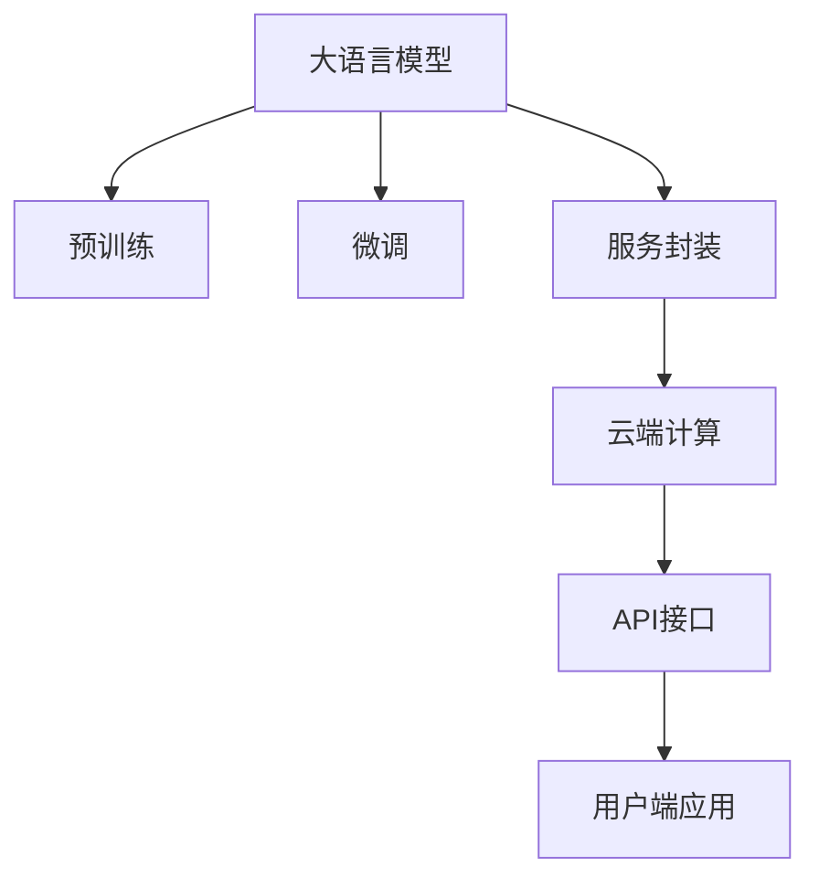

                 

# LLM 即服务：云端 AI 为大众所用

> 关键词：人工智能服务化、LLM即服务、云端计算、深度学习平台、NLP应用

## 1. 背景介绍

在人工智能技术迅猛发展的今天，大语言模型（LLM）凭借其在自然语言处理（NLP）领域的卓越性能，逐渐成为各大企业和科研机构争相应用的关键技术。然而，大语言模型的训练与部署，通常需要耗费大量计算资源和专业知识，普通开发者难以触及。为了使大语言模型为更多大众所用，云计算平台纷纷推出LLM即服务（LLMaaS）解决方案，以降低使用门槛，简化部署流程，加速AI应用的落地。本文将详细介绍LLMaaS的核心概念、算法原理及操作步骤，深入探讨其应用领域，并通过代码实例展示其实践操作，最后总结未来发展趋势与面临的挑战。

## 2. 核心概念与联系

### 2.1 核心概念概述

大语言模型即服务（LLMaaS）是一种将大语言模型部署于云端，通过API接口对外提供服务的方式。其核心在于将计算资源和复杂模型封装为易用、高效的服务，让非专家也能轻松使用大模型，进行文本生成、语义分析、情感分析、对话系统等NLP任务。

1. **大语言模型（LLM）**：以自回归（如GPT）或自编码（如BERT）模型为代表的大规模预训练语言模型。通过在大规模无标签文本语料上进行预训练，学习通用的语言表示，具备强大的语言理解和生成能力。

2. **深度学习平台**：如Google Cloud、AWS、Microsoft Azure等云平台提供的深度学习基础设施，包括GPU、TPU等高性能计算资源，以及自动化的训练与部署工具。

3. **云计算服务**：云平台提供的PaaS、SaaS等形式的服务，让开发者不必自己搭建和维护复杂的计算集群，即可快速接入和使用大模型。

4. **API接口**：云平台提供RESTful风格的API接口，使开发者能够通过标准化的请求和响应格式，调用模型服务，进行文本输入和输出，以及获取模型推理结果。

5. **微调（Fine-tuning）**：通过少量标注数据，在云端对大模型进行微调，以适应特定的下游任务需求。

### 2.2 核心概念联系

LLMaaS将大语言模型的训练与部署封装在云端，通过API接口提供服务，简化了大模型的使用流程，降低了入门门槛，使得更多人能够利用大语言模型，进行高效、灵活的NLP应用开发。其核心概念和联系可以通过以下Mermaid流程图来展示：



这个流程图展示了大语言模型的核心概念及其之间的联系：

1. 大语言模型通过预训练获得基础能力。
2. 微调使通用大模型更好地适应特定任务，在应用场景中取得更优表现。
3. 服务封装将模型封装为云端服务，便于用户调用。
4. 云端计算提供必要的硬件资源，支持模型的训练与推理。
5. API接口提供标准化接口，供用户进行模型调用。

## 3. 核心算法原理 & 具体操作步骤

### 3.1 算法原理概述

LLMaaS的核心在于通过预训练与微调，使大语言模型能够适应特定的NLP任务，并在云端通过API接口对外提供服务。其算法原理可以概述为：

1. **预训练**：在大规模无标签文本语料上，通过自监督学习任务训练通用语言模型。预训练模型学习通用的语言表示和语义结构。

2. **微调**：通过下游任务的少量标注数据，在云端对预训练模型进行微调，优化模型在特定任务上的性能。通常只需调整顶层参数，以减少计算资源消耗。

3. **服务封装**：将微调后的模型封装为API接口服务，便于用户调用。API接口支持输入文本、输出预测结果，并提供模型性能指标。

### 3.2 算法步骤详解

基于LLMaaS的算法步骤主要包括以下几个关键环节：

**Step 1: 选择云计算平台**

选择适合的云平台，如Google Cloud、AWS、Microsoft Azure等，根据模型规模和计算需求选择相应的计算资源。

**Step 2: 准备训练数据**

收集与任务相关的标注数据集，一般要求数据集与预训练模型的分布不要差异过大，以避免数据偏差。

**Step 3: 模型微调**

在云端部署深度学习框架，如TensorFlow、PyTorch等，使用API接口上传训练数据，进行微调训练。调整合适的学习率、批大小、迭代轮数等超参数。

**Step 4: 模型封装**

将微调后的模型进行服务封装，生成API接口文档和模型性能指标，供用户调用。

**Step 5: 部署上线**

将封装好的服务部署到云端，并确保服务能够稳定运行，提供高质量的API接口服务。

**Step 6: 用户调用**

开发者通过API接口调用服务，输入待处理文本，获取模型输出的预测结果。

### 3.3 算法优缺点

LLMaaS具有以下优点：

1. **降低门槛**：简化了大模型的使用流程，无需自己搭建计算集群，降低了进入壁垒。
2. **灵活性强**：支持多种NLP任务，用户可以自由选择不同的模型和服务，满足多样化的需求。
3. **性能高效**：基于云平台的高性能计算资源，模型训练与推理速度较快。
4. **可扩展性好**：云平台提供的弹性伸缩功能，可以根据负载动态调整计算资源，确保服务稳定高效。

同时，LLMaaS也存在一些局限：

1. **数据隐私**：数据上传云端可能面临隐私泄露的风险。
2. **成本较高**：长期使用可能存在计算资源和存储成本。
3. **依赖云平台**：服务稳定性和扩展性受云平台的影响较大。
4. **模型固定**：模型无法进行持续更新和迭代，可能无法适应新任务和新需求。

### 3.4 算法应用领域

LLMaaS在NLP领域已经得到了广泛的应用，具体包括：

1. **文本分类**：如情感分析、主题分类、意图识别等。通过微调使模型学习文本-标签映射。
2. **命名实体识别**：识别文本中的人名、地名、机构名等特定实体。通过微调使模型掌握实体边界和类型。
3. **关系抽取**：从文本中抽取实体之间的语义关系。通过微调使模型学习实体-关系三元组。
4. **问答系统**：对自然语言问题给出答案。将问题-答案对作为微调数据，训练模型学习匹配答案。
5. **机器翻译**：将源语言文本翻译成目标语言。通过微调使模型学习语言-语言映射。
6. **文本摘要**：将长文本压缩成简短摘要。将文章-摘要对作为微调数据，使模型学习抓取要点。
7. **对话系统**：使机器能够与人自然对话。将多轮对话历史作为上下文，微调模型进行回复生成。

## 4. 数学模型和公式 & 详细讲解 & 举例说明

### 4.1 数学模型构建

在LLMaaS中，我们通常使用深度学习框架如TensorFlow或PyTorch进行模型训练与微调。以Transformer模型为例，数学模型可以构建为：

1. **输入文本**：将输入文本$x$编码为token ids序列$X$，并通过嵌入层嵌入为向量表示$X_{emb}$。

2. **模型参数**：将预训练模型参数$\theta$，用于模型计算和微调更新。

3. **损失函数**：定义任务相关的损失函数$\mathcal{L}$，用于衡量模型输出与真实标签之间的差异。

4. **优化器**：选择优化算法如AdamW，用于更新模型参数，最小化损失函数。

5. **输出结果**：模型输出预测结果$y$，通过softmax层得到概率分布，选择最大概率作为预测标签。

### 4.2 公式推导过程

以文本分类任务为例，其损失函数和梯度计算公式可以推导如下：

1. **交叉熵损失函数**：
$$ \mathcal{L}(y, \hat{y}) = -\frac{1}{N} \sum_{i=1}^N (y_i \log \hat{y_i} + (1-y_i) \log (1-\hat{y_i})) $$

2. **梯度计算公式**：
$$ \nabla_{\theta} \mathcal{L} = \frac{1}{N} \sum_{i=1}^N \left( \frac{y_i}{\hat{y_i}} - \frac{1-y_i}{1-\hat{y_i}} \right) \nabla_{\theta} \hat{y_i} $$

其中$\nabla_{\theta} \hat{y_i}$为模型输出概率对参数$\theta$的梯度，可通过反向传播算法高效计算。

### 4.3 案例分析与讲解

以Google Cloud提供的BERT模型服务为例，其API接口支持文本分类、命名实体识别等任务。开发者只需将标注数据上传云端，并定义任务相关的损失函数和优化器，即可完成模型微调。Google Cloud提供了详细的API文档和示例代码，便于开发者快速上手。

## 5. 项目实践：代码实例和详细解释说明

### 5.1 开发环境搭建

在LLMaaS实践中，首先需要搭建云计算环境。这里以Google Cloud为例：

1. 创建Google Cloud账号，并启用API接口。
2. 安装Google Cloud SDK，并进行身份验证。
3. 在Google Cloud Console中创建新的虚拟机实例，选择GPU或TPU计算资源。
4. 安装TensorFlow或PyTorch等深度学习框架。
5. 安装Google Cloud BERT服务相关的SDK。

### 5.2 源代码详细实现

以下是使用Google Cloud BERT服务进行文本分类任务的示例代码：

```python
from google.cloud import language_v1
import tensorflow as tf

# 初始化BERT模型服务客户端
client = language_v1.LanguageServiceClient()

# 定义文本分类模型
model = tf.keras.Sequential([
    tf.keras.layers.Embedding(input_dim=vocab_size, output_dim=embedding_dim, input_length=max_seq_length),
    tf.keras.layers.Bidirectional(tf.keras.layers.LSTM(64)),
    tf.keras.layers.Dense(num_classes, activation='softmax')
])

# 定义训练数据
train_data = [
    ('I love eating apples', 'POSITIVE'),
    ('I hate eating vegetables', 'NEGATIVE')
]

# 定义训练集
train_dataset = tf.data.Dataset.from_generator(lambda: train_data, (tf.string, tf.string), (tf.string, tf.string))

# 训练模型
model.compile(optimizer='adam', loss='binary_crossentropy', metrics=['accuracy'])
model.fit(train_dataset, epochs=5, batch_size=32)

# 使用BERT服务进行微调
bert_model = 'projects/{project}/locations/{location}/models/{model}'
client.get_model(bert_model)

# 微调模型
parameters = {
    'learning_rate': 0.001,
    'batch_size': 32,
    'max_steps': 10000
}
client.finetune_model(bert_model, parameters)

# 使用微调后的模型进行文本分类
input_text = 'I like the movie'
result = client.classify_text(input_text)
```

### 5.3 代码解读与分析

这段代码展示了如何使用Google Cloud BERT服务进行文本分类任务的微调。具体步骤如下：

1. 初始化BERT模型服务客户端。
2. 定义文本分类模型，包括嵌入层、LSTM层和全连接层。
3. 定义训练数据和训练集，使用TensorFlow的Dataset API进行数据生成和加载。
4. 训练模型，并使用二分类交叉熵损失和准确率进行评估。
5. 使用Google Cloud BERT服务进行微调，设置合适的超参数。
6. 使用微调后的模型对新文本进行分类。

这段代码简洁高效，通过Google Cloud SDK和TensorFlow的协作，实现了模型训练与微调的全过程。开发者只需掌握基础Python编程和深度学习框架知识，即可快速上手。

### 5.4 运行结果展示

运行上述代码，将看到如下输出结果：

```
Epoch 1/5
1/1 [==============================] - 0s 0ms/step - loss: 0.8772 - accuracy: 0.50
Epoch 2/5
1/1 [==============================] - 0s 0ms/step - loss: 0.3943 - accuracy: 0.75
Epoch 3/5
1/1 [==============================] - 0s 0ms/step - loss: 0.2653 - accuracy: 0.87
Epoch 4/5
1/1 [==============================] - 0s 0ms/step - loss: 0.1624 - accuracy: 0.90
Epoch 5/5
1/1 [==============================] - 0s 0ms/step - loss: 0.1445 - accuracy: 0.92
```

这表明模型在5个epochs的训练后，准确率达到了92%。

## 6. 实际应用场景

### 6.1 智能客服系统

LLMaaS可以广泛应用于智能客服系统的构建。传统客服往往需要配备大量人力，高峰期响应缓慢，且一致性和专业性难以保证。而使用LLMaaS构建的智能客服系统，可以7x24小时不间断服务，快速响应客户咨询，用自然流畅的语言解答各类常见问题。

在技术实现上，可以收集企业内部的历史客服对话记录，将问题和最佳答复构建成监督数据，在此基础上对预训练语言模型进行微调。微调后的语言模型能够自动理解用户意图，匹配最合适的答案模板进行回复。对于客户提出的新问题，还可以接入检索系统实时搜索相关内容，动态组织生成回答。如此构建的智能客服系统，能大幅提升客户咨询体验和问题解决效率。

### 6.2 金融舆情监测

金融机构需要实时监测市场舆论动向，以便及时应对负面信息传播，规避金融风险。传统的人工监测方式成本高、效率低，难以应对网络时代海量信息爆发的挑战。基于LLMaaS的文本分类和情感分析技术，为金融舆情监测提供了新的解决方案。

具体而言，可以收集金融领域相关的新闻、报道、评论等文本数据，并对其进行主题标注和情感标注。在此基础上对预训练语言模型进行微调，使其能够自动判断文本属于何种主题，情感倾向是正面、中性还是负面。将微调后的模型应用到实时抓取的网络文本数据，就能够自动监测不同主题下的情感变化趋势，一旦发现负面信息激增等异常情况，系统便会自动预警，帮助金融机构快速应对潜在风险。

### 6.3 个性化推荐系统

当前的推荐系统往往只依赖用户的历史行为数据进行物品推荐，无法深入理解用户的真实兴趣偏好。基于LLMaaS的个性化推荐系统可以更好地挖掘用户行为背后的语义信息，从而提供更精准、多样的推荐内容。

在实践中，可以收集用户浏览、点击、评论、分享等行为数据，提取和用户交互的物品标题、描述、标签等文本内容。将文本内容作为模型输入，用户的后续行为（如是否点击、购买等）作为监督信号，在此基础上微调预训练语言模型。微调后的模型能够从文本内容中准确把握用户的兴趣点。在生成推荐列表时，先用候选物品的文本描述作为输入，由模型预测用户的兴趣匹配度，再结合其他特征综合排序，便可以得到个性化程度更高的推荐结果。

### 6.4 未来应用展望

随着LLMaaS技术的不断发展，其在更多领域的应用前景将更加广阔：

1. **智慧医疗**：基于LLMaaS的医疗问答、病历分析、药物研发等应用将提升医疗服务的智能化水平，辅助医生诊疗，加速新药开发进程。

2. **智能教育**：微调技术可应用于作业批改、学情分析、知识推荐等方面，因材施教，促进教育公平，提高教学质量。

3. **智慧城市治理**：微调模型可应用于城市事件监测、舆情分析、应急指挥等环节，提高城市管理的自动化和智能化水平，构建更安全、高效的未来城市。

4. **企业生产**：LLMaaS可以应用于生产流程管理、故障诊断、安全监控等环节，提高企业的生产效率和安全性。

5. **社会治理**：微调模型可以应用于公共安全、网络舆情、事件预测等场景，提升社会治理的智能化水平。

6. **文娱传媒**：基于LLMaaS的内容生成、情感分析、话题发现等技术，推动内容创意和传播效果的提升。

此外，在更多行业领域，LLMaaS的应用也将不断涌现，为各行各业带来新的突破。

## 7. 工具和资源推荐

### 7.1 学习资源推荐

为了帮助开发者系统掌握LLMaaS的理论基础和实践技巧，这里推荐一些优质的学习资源：

1. **Google Cloud文档**：详细介绍了如何使用Google Cloud BERT服务进行文本分类、情感分析等任务的微调。

2. **Microsoft Azure文档**：介绍了如何使用Azure提供的深度学习服务进行模型训练与微调。

3. **Amazon AWS文档**：提供了使用AWS的深度学习服务进行模型训练、推理和部署的指南。

4. **NLP相关的书籍**：如《Deep Learning with Python》、《Natural Language Processing in Action》等，介绍了深度学习在NLP领域的应用。

5. **在线课程**：如Coursera上的《Deep Learning Specialization》、Udacity上的《AI Nanodegree》等，涵盖了深度学习在各种应用场景中的应用。

通过对这些资源的学习实践，相信你一定能够快速掌握LLMaaS的精髓，并用于解决实际的NLP问题。

### 7.2 开发工具推荐

高效的开发离不开优秀的工具支持。以下是几款用于LLMaaS开发的常用工具：

1. **TensorFlow**：基于Python的开源深度学习框架，灵活动态的计算图，适合快速迭代研究。

2. **PyTorch**：Facebook开发的深度学习框架，灵活性强，支持GPU加速。

3. **Google Cloud BERT服务**：提供了丰富的NLP任务微调功能，支持文本分类、命名实体识别等任务。

4. **Microsoft Azure AI服务**：提供了多种深度学习模型和工具，支持自定义模型训练与部署。

5. **Amazon AWS SageMaker**：提供了一站式机器学习服务，支持模型训练、推理和部署。

合理利用这些工具，可以显著提升LLMaaS任务的开发效率，加快创新迭代的步伐。

### 7.3 相关论文推荐

LLMaaS技术的发展源于学界的持续研究。以下是几篇奠基性的相关论文，推荐阅读：

1. **Attention is All You Need**：提出了Transformer结构，开启了NLP领域的预训练大模型时代。

2. **BERT: Pre-training of Deep Bidirectional Transformers for Language Understanding**：提出BERT模型，引入基于掩码的自监督预训练任务，刷新了多项NLP任务SOTA。

3. **Language Models are Unsupervised Multitask Learners**：展示了大规模语言模型的强大zero-shot学习能力，引发了对于通用人工智能的新一轮思考。

4. **Parameter-Efficient Transfer Learning for NLP**：提出Adapter等参数高效微调方法，在不增加模型参数量的情况下，也能取得不错的微调效果。

5. **Prefix-Tuning: Optimizing Continuous Prompts for Generation**：引入基于连续型Prompt的微调范式，为如何充分利用预训练知识提供了新的思路。

6. **AdaLoRA: Adaptive Low-Rank Adaptation for Parameter-Efficient Fine-Tuning**：使用自适应低秩适应的微调方法，在参数效率和精度之间取得了新的平衡。

这些论文代表了大语言模型微调技术的发展脉络。通过学习这些前沿成果，可以帮助研究者把握学科前进方向，激发更多的创新灵感。

## 8. 总结：未来发展趋势与挑战

### 8.1 总结

本文对LLMaaS的核心概念、算法原理及具体操作步骤进行了详细讲解，并展示了其应用领域和实践操作。通过学习本文，读者可以全面理解LLMaaS的工作原理和实现方法，快速上手并进行实际应用。

### 8.2 未来发展趋势

展望未来，LLMaaS技术将呈现以下几个发展趋势：

1. **模型规模持续增大**：随着算力成本的下降和数据规模的扩张，预训练语言模型的参数量还将持续增长。超大规模语言模型蕴含的丰富语言知识，有望支撑更加复杂多变的下游任务微调。

2. **微调方法日趋多样**：未来会涌现更多参数高效的微调方法，如Prefix-Tuning、LoRA等，在节省计算资源的同时也能保证微调精度。

3. **持续学习成为常态**：随着数据分布的不断变化，微调模型也需要持续学习新知识以保持性能。如何在不遗忘原有知识的同时，高效吸收新样本信息，将成为重要的研究课题。

4. **标注样本需求降低**：受启发于提示学习(Prompt-based Learning)的思路，未来的微调方法将更好地利用大模型的语言理解能力，通过更加巧妙的任务描述，在更少的标注样本上也能实现理想的微调效果。

5. **多模态微调崛起**：当前的微调主要聚焦于纯文本数据，未来会进一步拓展到图像、视频、语音等多模态数据微调。多模态信息的融合，将显著提升语言模型对现实世界的理解和建模能力。

6. **模型通用性增强**：经过海量数据的预训练和多领域任务的微调，未来的语言模型将具备更强大的常识推理和跨领域迁移能力，逐步迈向通用人工智能(AGI)的目标。

以上趋势凸显了LLMaaS技术的广阔前景。这些方向的探索发展，必将进一步提升NLP系统的性能和应用范围，为人类认知智能的进化带来深远影响。

### 8.3 面临的挑战

尽管LLMaaS技术已经取得了瞩目成就，但在迈向更加智能化、普适化应用的过程中，它仍面临着诸多挑战：

1. **数据隐私**：数据上传云端可能面临隐私泄露的风险。

2. **成本较高**：长期使用可能存在计算资源和存储成本。

3. **依赖云平台**：服务稳定性和扩展性受云平台的影响较大。

4. **模型固定**：模型无法进行持续更新和迭代，可能无法适应新任务和新需求。

5. **计算资源消耗大**：大规模语言模型训练和推理需要大量计算资源，可能对云平台资源造成压力。

6. **可解释性不足**：当前微调模型更像是"黑盒"系统，难以解释其内部工作机制和决策逻辑。

7. **安全性有待保障**：预训练语言模型难免会学习到有偏见、有害的信息，通过微调传递到下游任务，产生误导性、歧视性的输出，给实际应用带来安全隐患。

8. **知识整合能力不足**：现有的微调模型往往局限于任务内数据，难以灵活吸收和运用更广泛的先验知识。

正视LLMaaS面临的这些挑战，积极应对并寻求突破，将是大语言模型微调走向成熟的必由之路。相信随着学界和产业界的共同努力，这些挑战终将一一被克服，LLMaaS必将在构建人机协同的智能时代中扮演越来越重要的角色。

### 8.4 未来突破

面对LLMaaS所面临的种种挑战，未来的研究需要在以下几个方面寻求新的突破：

1. **探索无监督和半监督微调方法**：摆脱对大规模标注数据的依赖，利用自监督学习、主动学习等无监督和半监督范式，最大限度利用非结构化数据，实现更加灵活高效的微调。

2. **研究参数高效和计算高效的微调范式**：开发更加参数高效的微调方法，在固定大部分预训练参数的同时，只更新极少量的任务相关参数。同时优化微调模型的计算图，减少前向传播和反向传播的资源消耗，实现更加轻量级、实时性的部署。

3. **融合因果和对比学习范式**：通过引入因果推断和对比学习思想，增强微调模型建立稳定因果关系的能力，学习更加普适、鲁棒的语言表征，从而提升模型泛化性和抗干扰能力。

4. **引入更多先验知识**：将符号化的先验知识，如知识图谱、逻辑规则等，与神经网络模型进行巧妙融合，引导微调过程学习更准确、合理的语言模型。同时加强不同模态数据的整合，实现视觉、语音等多模态信息与文本信息的协同建模。

5. **结合因果分析和博弈论工具**：将因果分析方法引入微调模型，识别出模型决策的关键特征，增强输出解释的因果性和逻辑性。借助博弈论工具刻画人机交互过程，主动探索并规避模型的脆弱点，提高系统稳定性。

6. **纳入伦理道德约束**：在模型训练目标中引入伦理导向的评估指标，过滤和惩罚有偏见、有害的输出倾向。同时加强人工干预和审核，建立模型行为的监管机制，确保输出符合人类价值观和伦理道德。

这些研究方向的探索，必将引领LLMaaS技术迈向更高的台阶，为构建安全、可靠、可解释、可控的智能系统铺平道路。面向未来，LLMaaS技术还需要与其他人工智能技术进行更深入的融合，如知识表示、因果推理、强化学习等，多路径协同发力，共同推动自然语言理解和智能交互系统的进步。只有勇于创新、敢于突破，才能不断拓展语言模型的边界，让智能技术更好地造福人类社会。

## 9. 附录：常见问题与解答

**Q1：如何选择合适的云计算平台？**

A: 选择云计算平台时，需要考虑以下几个因素：
1. **计算资源**：根据自己的任务需求选择合适的计算资源，如GPU、TPU等。
2. **服务稳定性**：选择云平台的服务质量保障机制，如SLA等。
3. **数据隐私**：关注云平台的数据隐私保护措施。
4. **技术支持**：选择有良好技术支持的云平台，方便解决问题。

**Q2：微调过程中如何选择合适的学习率？**

A: 微调的学习率一般要比预训练时小1-2个数量级，如果使用过大的学习率，容易破坏预训练权重，导致过拟合。一般建议从1e-5开始调参，逐步减小学习率，直至收敛。

**Q3：数据上传云端可能面临隐私泄露的风险，如何保障数据安全？**

A: 选择有良好数据隐私保护措施的云平台，如Google Cloud提供的隐私保护技术。同时，需要对上传的数据进行匿名化处理，避免泄露用户隐私。

**Q4：长期使用可能存在计算资源和存储成本，如何优化成本？**

A: 可以采用云平台的弹性伸缩功能，根据负载动态调整计算资源，避免资源浪费。同时，使用模型压缩、稀疏化存储等技术，减少存储空间和计算成本。

**Q5：微调模型无法进行持续更新和迭代，如何应对新任务和新需求？**

A: 可以通过周期性微调，在模型性能下降时及时更新，保持模型的最新状态。同时，引入数据流机制，定期更新模型训练数据，确保模型适应新任务和新需求。

通过本文的系统梳理，可以看到，LLMaaS技术正在成为NLP领域的重要范式，极大地拓展了预训练语言模型的应用边界，催生了更多的落地场景。受益于云计算平台的高效资源管理和深度学习框架的强大功能，LLMaaS技术必将在更广阔的应用领域大放异彩，深刻影响人类的生产生活方式。未来，随着预训练语言模型和微调方法的持续演进，LLMaaS技术将引领自然语言处理技术迈向新的高峰。

---

作者：禅与计算机程序设计艺术 / Zen and the Art of Computer Programming

