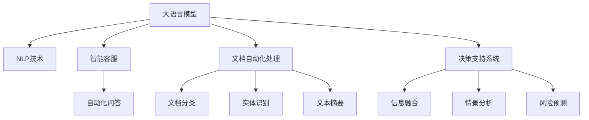

                 

# 大语言模型在政府和公共服务中的应用：提高效率和透明度

## 1. 背景介绍

在政府和公共服务领域，传统的业务流程往往依赖于纸质文件和人工审批，效率低下、透明度不足，给民众和企业带来了诸多不便。近年来，随着人工智能技术的迅猛发展，尤其是大语言模型(LLM)的崛起，使得政府和公共服务部门能够借助先进的自然语言处理能力，快速响应民众诉求，提高行政效率和政策透明度。

大语言模型在政府和公共服务中的应用，可以归结为三个核心方面：智能客服、智能化文档处理和智能化决策辅助。智能客服通过自然语言理解(NLU)技术，能够及时解答民众咨询，减少等待时间；智能化文档处理则通过文本分类、摘要、实体识别等任务，提高文档处理的自动化水平；智能化决策辅助则利用大模型的多模态融合能力，辅助决策者进行信息筛选、情景分析和风险预测，以提高政策制定的科学性和公正性。

本文将详细介绍大语言模型在政府和公共服务中的应用原理、操作步骤、以及如何构建高效的政府AI系统，为政府部门提供技术参考和借鉴。

## 2. 核心概念与联系

### 2.1 核心概念概述

为更好地理解大语言模型在政府和公共服务中的应用，本节将介绍几个密切相关的核心概念：

- 大语言模型(Large Language Model, LLM)：以自回归(如GPT)或自编码(如BERT)模型为代表的大规模预训练语言模型。通过在大规模无标签文本语料上进行预训练，学习通用的语言表示，具备强大的语言理解和生成能力。

- 自然语言处理(Natural Language Processing, NLP)：通过计算机技术处理、分析和生成自然语言，实现机器对人类语言的理解和理解。

- 智能客服(Intelligent Customer Service)：基于AI技术，通过自然语言理解与生成技术，自动解答用户咨询，提供24/7全天候服务，提升用户满意度。

- 文档自动化处理(Document Automation)：利用自然语言处理技术，自动分类、抽取和生成文本信息，减少人工处理成本，提高文档处理效率。

- 决策支持系统(Decision Support System, DSS)：通过整合多模态数据，辅助决策者进行信息筛选和情景分析，提高决策质量和效率。

这些核心概念之间的逻辑关系可以通过以下Mermaid流程图来展示：



这个流程图展示了大语言模型的核心概念及其之间的关系：

1. 大语言模型通过预训练获得基础能力。
2. NLP技术作为大语言模型的核心应用，涵盖了智能客服、文档自动化处理和决策支持等多个场景。
3. 智能客服和文档自动化处理通过自动化问答、文档分类、实体识别、文本摘要等任务，提升服务效率和质量。
4. 决策支持系统通过信息融合、情景分析和风险预测等技术，辅助决策者进行科学决策。

## 3. 核心算法原理 & 具体操作步骤
### 3.1 算法原理概述

大语言模型在政府和公共服务中的应用，本质上是一个基于监督学习的自然语言处理过程。其核心思想是：将大语言模型视作一个强大的"文本处理器"，通过在政府和公共服务领域的特定数据集上进行有监督学习，优化模型在特定任务上的性能。

形式化地，假设大语言模型为 $M_{\theta}$，其中 $\theta$ 为模型参数。给定政府和公共服务领域的数据集 $D=\{(x_i,y_i)\}_{i=1}^N, x_i \in \text{Text}, y_i \in \text{Task}$，任务 $T$ 的标签为 $y_i$，任务 $T$ 可以是文本分类、实体识别、摘要生成等。微调的目标是找到新的模型参数 $\hat{\theta}$，使得：

$$
\hat{\theta}=\mathop{\arg\min}_{\theta} \mathcal{L}(M_{\theta},D)
$$

其中 $\mathcal{L}$ 为针对任务 $T$ 设计的损失函数，用于衡量模型预测输出与真实标签之间的差异。常见的损失函数包括交叉熵损失、均方误差损失等。

通过梯度下降等优化算法，微调过程不断更新模型参数 $\theta$，最小化损失函数 $\mathcal{L}$，使得模型输出逼近真实标签。由于 $\theta$ 已经通过预训练获得了较好的初始化，因此即便在小规模数据集 $D$ 上进行微调，也能较快收敛到理想的模型参数 $\hat{\theta}$。

### 3.2 算法步骤详解

大语言模型在政府和公共服务中的应用，一般包括以下几个关键步骤：

**Step 1: 准备数据集和预训练模型**

- 选择合适的预训练语言模型 $M_{\theta}$ 作为初始化参数，如 BERT、GPT等。
- 准备政府和公共服务领域的数据集 $D$，划分为训练集、验证集和测试集。数据集应包含各种类型的文本数据，如政府公告、客服记录、合同文档等。

**Step 2: 设计任务适配层**

- 根据具体任务类型，在预训练模型顶层设计合适的输出层和损失函数。
- 例如，对于文本分类任务，通常在顶层添加线性分类器和交叉熵损失函数。
- 对于实体识别任务，通常使用序列标注模型，损失函数包括位置损失和分类损失。

**Step 3: 设置微调超参数**

- 选择合适的优化算法及其参数，如 AdamW、SGD 等，设置学习率、批大小、迭代轮数等。
- 设置正则化技术及强度，包括权重衰减、Dropout、Early Stopping等。
- 确定冻结预训练参数的策略，如仅微调顶层，或全部参数都参与微调。

**Step 4: 执行梯度训练**

- 将训练集数据分批次输入模型，前向传播计算损失函数。
- 反向传播计算参数梯度，根据设定的优化算法和学习率更新模型参数。
- 周期性在验证集上评估模型性能，根据性能指标决定是否触发 Early Stopping。
- 重复上述步骤直到满足预设的迭代轮数或 Early Stopping 条件。

**Step 5: 部署和评估**

- 使用微调后的模型对新数据进行推理预测，集成到实际的应用系统中。
- 在实际应用中，持续收集新的数据，定期重新微调模型，以适应数据分布的变化。
- 对微调后的模型进行性能评估，对比微调前后的效果。

以上是基于监督学习微调大语言模型的一般流程。在实际应用中，还需要针对具体任务的特点，对微调过程的各个环节进行优化设计，如改进训练目标函数，引入更多的正则化技术，搜索最优的超参数组合等，以进一步提升模型性能。

### 3.3 算法优缺点

大语言模型在政府和公共服务中的应用，具有以下优点：

1. 提升效率。通过自动化处理文档和客服咨询，显著减少人工处理成本，提高政府和公共服务部门的效率。
2. 提高透明度。通过文本处理和信息整合，公开透明地展示政策制定和执行的依据，提升公众信任。
3. 增强公平性。通过自然语言理解，识别并纠正错误信息，减少歧视性决策，促进政策公平。
4. 优化决策质量。通过多模态融合，辅助决策者进行信息筛选和情景分析，提高决策科学性。

但同时也存在一些局限性：

1. 依赖高质量数据。微调效果很大程度上取决于数据的质量和数量，数据收集和标注成本较高。
2. 模型复杂度高。大模型的参数规模和计算资源需求大，对硬件设备要求较高。
3. 解释性不足。模型决策过程复杂，难以进行精确的因果分析和责任归属。
4. 安全风险。模型可能受到恶意攻击或输入误导，导致错误输出，带来安全隐患。

尽管存在这些局限性，但就目前而言，大语言模型在政府和公共服务中的应用，已经展示了其巨大的潜力和应用前景。

### 3.4 算法应用领域

大语言模型在政府和公共服务领域的应用，覆盖了以下主要场景：

- 智能客服：用于解答公民咨询、处理事务申请等，提升服务效率和用户体验。
- 文档自动化处理：自动分类、摘要、标注文档信息，减少人工工作量，提高文档处理速度。
- 智能决策支持：多模态数据融合，辅助决策者进行政策制定、风险预测等，提高决策质量和效率。
- 风险监测：通过文本分析和情感分析，及时发现和处理违规行为，保障社会稳定。
- 法规合规：利用自然语言处理技术，自动化检查政策法规的合规性，减少人工检查成本。
- 舆情监测：通过情感分析和主题分类，实时监控和分析社会舆情，提供决策参考。

## 4. 数学模型和公式 & 详细讲解  
### 4.1 数学模型构建

本节将使用数学语言对大语言模型在政府和公共服务中的应用进行更加严格的刻画。

记大语言模型为 $M_{\theta}$，其中 $\theta$ 为模型参数。假设政府和公共服务领域的数据集为 $D=\{(x_i,y_i)\}_{i=1}^N, x_i \in \text{Text}, y_i \in \text{Task}$。

定义模型 $M_{\theta}$ 在数据样本 $(x,y)$ 上的损失函数为 $\ell(M_{\theta}(x),y)$，则在数据集 $D$ 上的经验风险为：

$$
\mathcal{L}(\theta) = \frac{1}{N} \sum_{i=1}^N \ell(M_{\theta}(x_i),y_i)
$$

微调的优化目标是最小化经验风险，即找到最优参数：

$$
\theta^* = \mathop{\arg\min}_{\theta} \mathcal{L}(\theta)
$$

在实践中，我们通常使用基于梯度的优化算法（如SGD、Adam等）来近似求解上述最优化问题。设 $\eta$ 为学习率，$\lambda$ 为正则化系数，则参数的更新公式为：

$$
\theta \leftarrow \theta - \eta \nabla_{\theta}\mathcal{L}(\theta) - \eta\lambda\theta
$$

其中 $\nabla_{\theta}\mathcal{L}(\theta)$ 为损失函数对参数 $\theta$ 的梯度，可通过反向传播算法高效计算。

### 4.2 公式推导过程

以下我们以文本分类任务为例，推导交叉熵损失函数及其梯度的计算公式。

假设模型 $M_{\theta}$ 在输入 $x$ 上的输出为 $\hat{y}=M_{\theta}(x) \in [0,1]$，表示样本属于正类的概率。真实标签 $y \in \{0,1\}$。则二分类交叉熵损失函数定义为：

$$
\ell(M_{\theta}(x),y) = -[y\log \hat{y} + (1-y)\log (1-\hat{y})]
$$

将其代入经验风险公式，得：

$$
\mathcal{L}(\theta) = -\frac{1}{N}\sum_{i=1}^N [y_i\log M_{\theta}(x_i)+(1-y_i)\log(1-M_{\theta}(x_i))]
$$

根据链式法则，损失函数对参数 $\theta_k$ 的梯度为：

$$
\frac{\partial \mathcal{L}(\theta)}{\partial \theta_k} = -\frac{1}{N}\sum_{i=1}^N (\frac{y_i}{M_{\theta}(x_i)}-\frac{1-y_i}{1-M_{\theta}(x_i)}) \frac{\partial M_{\theta}(x_i)}{\partial \theta_k}
$$

其中 $\frac{\partial M_{\theta}(x_i)}{\partial \theta_k}$ 可进一步递归展开，利用自动微分技术完成计算。

在得到损失函数的梯度后，即可带入参数更新公式，完成模型的迭代优化。重复上述过程直至收敛，最终得到适应政府和公共服务任务的最优模型参数 $\theta^*$。

## 5. 项目实践：代码实例和详细解释说明
### 5.1 开发环境搭建

在进行政府和公共服务领域的大语言模型微调实践前，我们需要准备好开发环境。以下是使用Python进行PyTorch开发的环境配置流程：

1. 安装Anaconda：从官网下载并安装Anaconda，用于创建独立的Python环境。

2. 创建并激活虚拟环境：
```bash
conda create -n pytorch-env python=3.8 
conda activate pytorch-env
```

3. 安装PyTorch：根据CUDA版本，从官网获取对应的安装命令。例如：
```bash
conda install pytorch torchvision torchaudio cudatoolkit=11.1 -c pytorch -c conda-forge
```

4. 安装Transformers库：
```bash
pip install transformers
```

5. 安装各类工具包：
```bash
pip install numpy pandas scikit-learn matplotlib tqdm jupyter notebook ipython
```

完成上述步骤后，即可在`pytorch-env`环境中开始微调实践。

### 5.2 源代码详细实现

这里我们以智能客服系统中的智能问答系统为例，给出使用Transformers库对BERT模型进行微调的PyTorch代码实现。

首先，定义智能问答系统的数据处理函数：

```python
from transformers import BertTokenizer
from torch.utils.data import Dataset
import torch

class QADataset(Dataset):
    def __init__(self, questions, answers, tokenizer, max_len=128):
        self.questions = questions
        self.answers = answers
        self.tokenizer = tokenizer
        self.max_len = max_len
        
    def __len__(self):
        return len(self.questions)
    
    def __getitem__(self, item):
        question = self.questions[item]
        answer = self.answers[item]
        
        encoding = self.tokenizer(question, return_tensors='pt', max_length=self.max_len, padding='max_length', truncation=True)
        input_ids = encoding['input_ids'][0]
        attention_mask = encoding['attention_mask'][0]
        
        # 对答案进行编码
        encoded_answer = [self.tokenizer.vocab[answer]] + [self.tokenizer.vocab['<end>']] # <end>表示答案结束
        encoded_answer.extend([self.tokenizer.vocab['<unk>']] * (self.max_len - len(encoded_answer)))
        labels = torch.tensor(encoded_answer, dtype=torch.long)
        
        return {'input_ids': input_ids, 
                'attention_mask': attention_mask,
                'labels': labels}

# 加载预训练模型和分词器
tokenizer = BertTokenizer.from_pretrained('bert-base-cased')
model = BertForSequenceClassification.from_pretrained('bert-base-cased', num_labels=2) # 二分类任务

# 准备数据集
train_dataset = QADataset(train_questions, train_answers, tokenizer)
dev_dataset = QADataset(dev_questions, dev_answers, tokenizer)
test_dataset = QADataset(test_questions, test_answers, tokenizer)
```

然后，定义模型和优化器：

```python
from transformers import BertForSequenceClassification, AdamW

model = BertForSequenceClassification.from_pretrained('bert-base-cased', num_labels=2) # 二分类任务

optimizer = AdamW(model.parameters(), lr=2e-5)
```

接着，定义训练和评估函数：

```python
from torch.utils.data import DataLoader
from tqdm import tqdm
from sklearn.metrics import classification_report

device = torch.device('cuda') if torch.cuda.is_available() else torch.device('cpu')
model.to(device)

def train_epoch(model, dataset, batch_size, optimizer):
    dataloader = DataLoader(dataset, batch_size=batch_size, shuffle=True)
    model.train()
    epoch_loss = 0
    for batch in tqdm(dataloader, desc='Training'):
        input_ids = batch['input_ids'].to(device)
        attention_mask = batch['attention_mask'].to(device)
        labels = batch['labels'].to(device)
        model.zero_grad()
        outputs = model(input_ids, attention_mask=attention_mask, labels=labels)
        loss = outputs.loss
        epoch_loss += loss.item()
        loss.backward()
        optimizer.step()
    return epoch_loss / len(dataloader)

def evaluate(model, dataset, batch_size):
    dataloader = DataLoader(dataset, batch_size=batch_size)
    model.eval()
    preds, labels = [], []
    with torch.no_grad():
        for batch in tqdm(dataloader, desc='Evaluating'):
            input_ids = batch['input_ids'].to(device)
            attention_mask = batch['attention_mask'].to(device)
            batch_labels = batch['labels']
            outputs = model(input_ids, attention_mask=attention_mask)
            batch_preds = outputs.logits.argmax(dim=2).to('cpu').tolist()
            batch_labels = batch_labels.to('cpu').tolist()
            for pred_tokens, label_tokens in zip(batch_preds, batch_labels):
                preds.append(pred_tokens)
                labels.append(label_tokens)
                
    print(classification_report(labels, preds))
```

最后，启动训练流程并在测试集上评估：

```python
epochs = 5
batch_size = 16

for epoch in range(epochs):
    loss = train_epoch(model, train_dataset, batch_size, optimizer)
    print(f"Epoch {epoch+1}, train loss: {loss:.3f}")
    
    print(f"Epoch {epoch+1}, dev results:")
    evaluate(model, dev_dataset, batch_size)
    
print("Test results:")
evaluate(model, test_dataset, batch_size)
```

以上就是使用PyTorch对BERT进行智能问答系统微调的完整代码实现。可以看到，得益于Transformers库的强大封装，我们可以用相对简洁的代码完成BERT模型的加载和微调。

### 5.3 代码解读与分析

让我们再详细解读一下关键代码的实现细节：

**QADataset类**：
- `__init__`方法：初始化问题、答案、分词器等关键组件。
- `__len__`方法：返回数据集的样本数量。
- `__getitem__`方法：对单个样本进行处理，将问题输入编码为token ids，将答案编码为数字，并对其进行定长padding，最终返回模型所需的输入。

**标签与id的映射**：
- 定义了标签与数字id之间的映射关系，用于将token-wise的预测结果解码回真实的标签。

**训练和评估函数**：
- 使用PyTorch的DataLoader对数据集进行批次化加载，供模型训练和推理使用。
- 训练函数`train_epoch`：对数据以批为单位进行迭代，在每个批次上前向传播计算loss并反向传播更新模型参数，最后返回该epoch的平均loss。
- 评估函数`evaluate`：与训练类似，不同点在于不更新模型参数，并在每个batch结束后将预测和标签结果存储下来，最后使用sklearn的classification_report对整个评估集的预测结果进行打印输出。

**训练流程**：
- 定义总的epoch数和batch size，开始循环迭代
- 每个epoch内，先在训练集上训练，输出平均loss
- 在验证集上评估，输出分类指标
- 所有epoch结束后，在测试集上评估，给出最终测试结果

可以看到，PyTorch配合Transformers库使得BERT微调的代码实现变得简洁高效。开发者可以将更多精力放在数据处理、模型改进等高层逻辑上，而不必过多关注底层的实现细节。

当然，工业级的系统实现还需考虑更多因素，如模型的保存和部署、超参数的自动搜索、更灵活的任务适配层等。但核心的微调范式基本与此类似。

## 6. 实际应用场景
### 6.1 智能客服系统

智能客服系统是大语言模型在政府和公共服务领域的重要应用之一。传统客服往往需要配备大量人力，高峰期响应缓慢，且一致性和专业性难以保证。使用大语言模型微调后的智能客服系统，可以7x24小时不间断服务，快速响应客户咨询，用自然流畅的语言解答各类常见问题。

在技术实现上，可以收集政府和公共服务部门的历史客服对话记录，将问题-回答对作为微调数据，训练模型学习匹配答案。微调后的模型能够自动理解用户意图，匹配最合适的答案模板进行回复。对于客户提出的新问题，还可以接入检索系统实时搜索相关内容，动态组织生成回答。如此构建的智能客服系统，能大幅提升客户咨询体验和问题解决效率。

### 6.2 文档自动化处理

文档自动化处理是大语言模型在政府和公共服务领域的另一个重要应用。传统的文档处理通常依赖人工，耗时耗力，且错误率高。利用大语言模型，可以自动对文档进行分类、摘要、标注等处理，提高文档处理的自动化水平。

具体而言，可以收集政府和公共服务领域的各类文档，如法律法规、合同协议、财务报表等，使用自然语言处理技术自动进行文本分类和实体识别。通过实体识别，自动抽取文档中的关键信息，如公司名称、日期、金额等，并进行结构化存储。对于长篇文档，使用文本摘要技术自动生成精炼的摘要，方便快速浏览和检索。

### 6.3 智能决策支持

智能决策支持是大语言模型在政府和公共服务领域的高级应用。通过整合多模态数据，辅助决策者进行信息筛选和情景分析，提高决策质量和效率。

具体实现中，可以利用大语言模型的多模态融合能力，自动抽取文本数据中的关键信息，如政策法规、市场数据、舆情分析等，进行融合和分析。使用实体识别技术识别重要实体，使用关系抽取技术建立实体之间的关联，形成全面的信息图谱。通过情景分析技术，对政策影响、风险预测等进行定量分析，为决策者提供科学依据。

### 6.4 未来应用展望

随着大语言模型和微调方法的不断发展，大语言模型在政府和公共服务领域的应用将呈现以下几个趋势：

1. 智能化程度提高。随着模型的训练规模和数据量的增加，政府和公共服务领域的智能化水平将不断提高，实现更精准的服务和决策。
2. 实时性增强。利用边缘计算和模型压缩技术，实现模型的轻量化部署，提高系统响应速度。
3. 个性化服务普及。通过用户画像和历史行为分析，提供个性化的服务和推荐，提升用户体验。
4. 跨部门协同。构建统一的数据共享和应用平台，实现跨部门的信息互联互通，提高政府治理的协同性和效率。
5. 智能化治理。通过大数据、人工智能等技术手段，构建智慧政府，提升城市治理的智能化水平。

## 7. 工具和资源推荐
### 7.1 学习资源推荐

为了帮助开发者系统掌握大语言模型在政府和公共服务领域的应用理论基础和实践技巧，这里推荐一些优质的学习资源：

1. 《Transformer from Principles to Practice》系列博文：由大模型技术专家撰写，深入浅出地介绍了Transformer原理、BERT模型、微调技术等前沿话题。

2. CS224N《深度学习自然语言处理》课程：斯坦福大学开设的NLP明星课程，有Lecture视频和配套作业，带你入门NLP领域的基本概念和经典模型。

3. 《Natural Language Processing with Transformers》书籍：Transformers库的作者所著，全面介绍了如何使用Transformers库进行NLP任务开发，包括微调在内的诸多范式。

4. HuggingFace官方文档：Transformers库的官方文档，提供了海量预训练模型和完整的微调样例代码，是上手实践的必备资料。

5. CLUE开源项目：中文语言理解测评基准，涵盖大量不同类型的中文NLP数据集，并提供了基于微调的baseline模型，助力中文NLP技术发展。

通过对这些资源的学习实践，相信你一定能够快速掌握大语言模型在政府和公共服务领域的应用精髓，并用于解决实际的NLP问题。
###  7.2 开发工具推荐

高效的开发离不开优秀的工具支持。以下是几款用于政府和公共服务领域的大语言模型微调开发的常用工具：

1. PyTorch：基于Python的开源深度学习框架，灵活动态的计算图，适合快速迭代研究。大部分预训练语言模型都有PyTorch版本的实现。

2. TensorFlow：由Google主导开发的开源深度学习框架，生产部署方便，适合大规模工程应用。同样有丰富的预训练语言模型资源。

3. Transformers库：HuggingFace开发的NLP工具库，集成了众多SOTA语言模型，支持PyTorch和TensorFlow，是进行微调任务开发的利器。

4. Weights & Biases：模型训练的实验跟踪工具，可以记录和可视化模型训练过程中的各项指标，方便对比和调优。与主流深度学习框架无缝集成。

5. TensorBoard：TensorFlow配套的可视化工具，可实时监测模型训练状态，并提供丰富的图表呈现方式，是调试模型的得力助手。

6. Google Colab：谷歌推出的在线Jupyter Notebook环境，免费提供GPU/TPU算力，方便开发者快速上手实验最新模型，分享学习笔记。

合理利用这些工具，可以显著提升大语言模型在政府和公共服务领域的应用开发效率，加快创新迭代的步伐。

### 7.3 相关论文推荐

大语言模型和微调技术的发展源于学界的持续研究。以下是几篇奠基性的相关论文，推荐阅读：

1. Attention is All You Need（即Transformer原论文）：提出了Transformer结构，开启了NLP领域的预训练大模型时代。

2. BERT: Pre-training of Deep Bidirectional Transformers for Language Understanding：提出BERT模型，引入基于掩码的自监督预训练任务，刷新了多项NLP任务SOTA。

3. Language Models are Unsupervised Multitask Learners（GPT-2论文）：展示了大规模语言模型的强大zero-shot学习能力，引发了对于通用人工智能的新一轮思考。

4. Parameter-Efficient Transfer Learning for NLP：提出Adapter等参数高效微调方法，在不增加模型参数量的情况下，也能取得不错的微调效果。

5. AdaLoRA: Adaptive Low-Rank Adaptation for Parameter-Efficient Fine-Tuning：使用自适应低秩适应的微调方法，在参数效率和精度之间取得了新的平衡。

这些论文代表了大语言模型微调技术的发展脉络。通过学习这些前沿成果，可以帮助研究者把握学科前进方向，激发更多的创新灵感。

## 8. 总结：未来发展趋势与挑战
### 8.1 总结

本文对大语言模型在政府和公共服务中的应用进行了全面系统的介绍。首先阐述了大语言模型和微调技术在政府和公共服务领域的研究背景和意义，明确了在提升效率和透明度方面的独特价值。其次，从原理到实践，详细讲解了政府和公共服务领域大语言模型微调的过程，给出了微调任务开发的完整代码实例。同时，本文还广泛探讨了智能客服、文档自动化处理和智能化决策支持等实际应用场景，展示了微调范式的巨大潜力。

通过本文的系统梳理，可以看到，大语言模型在政府和公共服务领域的应用，正逐步实现从数字化向智能化、个性化的转变，成为推动政府治理现代化和公共服务高质量发展的重要力量。

### 8.2 未来发展趋势

展望未来，大语言模型在政府和公共服务领域的应用将呈现以下几个趋势：

1. 智能化水平提高。随着模型的训练规模和数据量的增加，政府和公共服务领域的智能化水平将不断提高，实现更精准的服务和决策。
2. 实时性增强。利用边缘计算和模型压缩技术，实现模型的轻量化部署，提高系统响应速度。
3. 个性化服务普及。通过用户画像和历史行为分析，提供个性化的服务和推荐，提升用户体验。
4. 跨部门协同。构建统一的数据共享和应用平台，实现跨部门的信息互联互通，提高政府治理的协同性和效率。
5. 智能化治理。通过大数据、人工智能等技术手段，构建智慧政府，提升城市治理的智能化水平。

## 8.3 面临的挑战

尽管大语言模型在政府和公共服务领域的应用已经取得显著成效，但在迈向更加智能化、普适化应用的过程中，仍面临诸多挑战：

1. 数据隐私保护。政府和公共服务领域涉及大量敏感数据，如何保护数据隐私和安全性，是大语言模型应用中的重要问题。
2. 模型鲁棒性不足。模型面对域外数据时，泛化性能往往大打折扣，如何提高模型的鲁棒性，避免过拟合，是一个长期挑战。
3. 模型复杂度高。大模型的参数规模和计算资源需求大，对硬件设备要求较高，如何降低模型的复杂度，提高部署效率，是一个亟需解决的问题。
4. 解释性不足。模型决策过程复杂，难以进行精确的因果分析和责任归属，如何提高模型的可解释性，是一个重要的研究方向。
5. 安全风险。模型可能受到恶意攻击或输入误导，导致错误输出，带来安全隐患，如何保障模型的安全性，是一个重要的研究课题。

尽管存在这些挑战，但大语言模型在政府和公共服务领域的应用，已经展示了其巨大的潜力和应用前景。随着技术的不断进步和经验的积累，相信未来这些挑战终将得到有效应对，大语言模型将进一步推动政府治理的智能化进程。

### 8.4 研究展望

面向未来，大语言模型在政府和公共服务领域的应用，需要从以下几个方向进行深入研究：

1. 探索无监督和半监督微调方法。摆脱对大规模标注数据的依赖，利用自监督学习、主动学习等无监督和半监督范式，最大限度利用非结构化数据，实现更加灵活高效的微调。
2. 研究参数高效和计算高效的微调范式。开发更加参数高效的微调方法，在固定大部分预训练参数的同时，只更新极少量的任务相关参数。同时优化微调模型的计算图，减少前向传播和反向传播的资源消耗，实现更加轻量级、实时性的部署。
3. 融合因果和对比学习范式。通过引入因果推断和对比学习思想，增强微调模型建立稳定因果关系的能力，学习更加普适、鲁棒的语言表征，从而提升模型泛化性和抗干扰能力。
4. 引入更多先验知识。将符号化的先验知识，如知识图谱、逻辑规则等，与神经网络模型进行巧妙融合，引导微调过程学习更准确、合理的语言模型。同时加强不同模态数据的整合，实现视觉、语音等多模态信息与文本信息的协同建模。
5. 结合因果分析和博弈论工具。将因果分析方法引入微调模型，识别出模型决策的关键特征，增强输出解释的因果性和逻辑性。借助博弈论工具刻画人机交互过程，主动探索并规避模型的脆弱点，提高系统稳定性。
6. 纳入伦理道德约束。在模型训练目标中引入伦理导向的评估指标，过滤和惩罚有偏见、有害的输出倾向。同时加强人工干预和审核，建立模型行为的监管机制，确保输出符合人类价值观和伦理道德。

这些研究方向将引领大语言模型在政府和公共服务领域的应用不断突破，为构建安全、可靠、可解释、可控的智能系统提供有力支持。

## 9. 附录：常见问题与解答

**Q1：大语言模型微调是否适用于所有政府和公共服务任务？**

A: 大语言模型微调在大多数政府和公共服务任务上都能取得不错的效果，特别是对于数据量较小的任务。但对于一些特定领域的任务，如医学、法律等，仅仅依靠通用语料预训练的模型可能难以很好地适应。此时需要在特定领域语料上进一步预训练，再进行微调，才能获得理想效果。此外，对于一些需要时效性、个性化很强的任务，如对话、推荐等，微调方法也需要针对性的改进优化。

**Q2：如何缓解大语言模型在微调过程中的过拟合问题？**

A: 过拟合是微调面临的主要挑战，尤其是在标注数据不足的情况下。常见的缓解策略包括：
1. 数据增强：通过回译、近义替换等方式扩充训练集
2. 正则化：使用L2正则、Dropout、Early Stopping等避免过拟合
3. 对抗训练：引入对抗样本，提高模型鲁棒性
4. 参数高效微调：只调整少量参数(如Adapter、Prefix等)，减小过拟合风险
5. 多模型集成：训练多个微调模型，取平均输出，抑制过拟合

这些策略往往需要根据具体任务和数据特点进行灵活组合。只有在数据、模型、训练、推理等各环节进行全面优化，才能最大限度地发挥大语言模型微调的威力。

**Q3：大语言模型在政府和公共服务中的应用是否会影响数据隐私和安全性？**

A: 大语言模型在政府和公共服务中的应用，确实涉及大量敏感数据。为了保护数据隐私和安全，需要注意以下几个方面：
1. 数据脱敏：在训练和推理过程中，对敏感数据进行脱敏处理，防止数据泄露。
2. 数据加密：使用数据加密技术，保护数据在传输和存储过程中的安全。
3. 访问控制：限制数据访问权限，确保只有授权人员可以访问敏感数据。
4. 模型审计：定期对模型进行审计，发现和修复潜在的安全漏洞。

通过这些措施，可以有效保护数据隐私和安全性，确保大语言模型在政府和公共服务领域的安全应用。

**Q4：大语言模型在政府和公共服务中的应用是否需要高成本的硬件设备？**

A: 大语言模型的参数规模和计算资源需求大，对硬件设备要求较高。但通过一些优化措施，可以降低硬件成本，提高部署效率：
1. 模型压缩：使用模型压缩技术，减小模型参数规模，降低计算需求。
2. 混合精度训练：使用混合精度训练技术，减少内存和计算开销。
3. 模型并行：使用模型并行技术，提高计算效率，适应大规模数据处理需求。
4. 边缘计算：将模型部署在边缘设备上，减少数据传输成本，提高系统响应速度。

通过这些优化措施，可以在保证性能的同时，降低硬件成本，提高大语言模型在政府和公共服务领域的应用价值。

**Q5：大语言模型在政府和公共服务中的应用是否需要高成本的标注数据？**

A: 大语言模型在政府和公共服务中的应用，通常需要标注数据进行微调。但通过一些无监督和半监督方法，可以降低标注数据的需求，甚至实现零样本学习：
1. 数据增强：通过回译、近义替换等方式扩充训练集
2. 主动学习：利用模型预测结果，自动选择高价值样本进行标注
3. 自监督学习：使用自监督任务，如掩码语言模型、句子完成等，训练模型获得语言知识
4. 零样本学习：通过精心设计的提示模板，引导模型进行推理和生成

这些方法可以在一定程度上降低标注成本，提升大语言模型在政府和公共服务领域的应用效果。

---

作者：禅与计算机程序设计艺术 / Zen and the Art of Computer Programming

