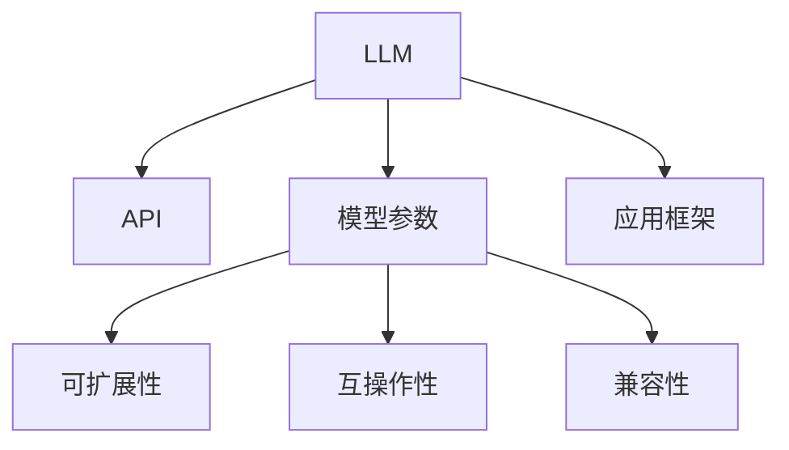

                 

# LLM 标准：促进互操作性和兼容性

> 关键词：LLM, 互操作性, 兼容性, 标准化, API, 跨平台, 可扩展性, 模型库, 应用框架

## 1. 背景介绍

### 1.1 问题由来
随着大规模语言模型(Large Language Model, LLM)技术的发展，越来越多的企业和研究机构开始构建自己的LLM模型，希望通过微调、集成、组合等手段提升模型的性能和应用范围。然而，由于各个LLM模型之间接口不统一，模型结构和参数格式各异，导致系统开发和集成成本高昂，应用过程中存在诸多不兼容性问题。

特别是当前商业化的LLM模型，如GPT-3、BERT、RoBERTa等，虽然具备强大的语言生成和理解能力，但各模型的API、参数结构、训练流程等均有所不同。这种多样性使得开发者难以进行跨模型、跨平台的开发和应用。

为解决这些问题，推动LLM技术的应用普及和商业化，学术界、工业界和标准化组织纷纷着手制定LLM的标准。这一标准不仅包含模型接口、参数格式等基础内容，还涵盖模型的可扩展性、互操作性、兼容性等方面，旨在构建一个开放的、标准化的LLM生态系统。

### 1.2 问题核心关键点
LLM标准的制定和实施，核心目标是提升模型的互操作性和兼容性。具体而言，需实现以下几点：
1. **接口统一**：确保不同LLM模型之间的接口一致，方便开发者进行跨模型集成。
2. **参数兼容**：定义统一的参数格式和命名规范，便于模型参数的传输和交换。
3. **模型兼容性**：兼容不同版本、不同架构的LLM模型，实现模型版本升级和迁移。
4. **应用框架标准化**：统一训练、推理、评估等应用框架的规范，减少开发和部署成本。

## 2. 核心概念与联系

### 2.1 核心概念概述

为更好地理解LLM标准的概念和内涵，本节将介绍几个关键概念及其相互关系。

- **LLM（Large Language Model）**：大规模语言模型，通过在大规模无标签文本语料上进行预训练，学习通用的语言表示，具备强大的语言理解和生成能力。
- **API（Application Programming Interface）**：应用编程接口，定义了LLM模型对外提供的服务，包括输入输出格式、调用方法等。
- **模型参数**：模型在预训练和微调过程中学习到的权重，用于表示语言模型的知识。
- **可扩展性**：模型能够在不损失性能的前提下，根据需求动态扩展或缩减，以满足不同场景下的需求。
- **互操作性**：模型能够与其他系统、应用或设备进行数据、参数等信息的交互和协同工作。
- **兼容性**：模型能够在不同平台、不同架构、不同版本之间正常运行和相互交换信息。
- **应用框架**：为简化模型开发和应用，封装和优化训练、推理、评估等步骤，提高开发效率。

这些核心概念之间的逻辑关系可以通过以下Mermaid流程图来展示：



这个流程图展示了一致性、互操作性、兼容性、可扩展性、API、应用框架等核心概念及其相互关系：

1. LLM通过API提供服务，包括输入输出格式、调用方法等。
2. 模型参数通过API进行传输和交换。
3. 互操作性、兼容性、可扩展性等特性，通过统一的API和参数格式实现。
4. 应用框架对API和参数进行封装，提供统一的开发和部署环境。

## 3. 核心算法原理 & 具体操作步骤
### 3.1 算法原理概述

LLM标准的核心在于通过统一的API、参数格式、训练流程等，确保不同模型之间的互操作性和兼容性。具体来说，LLM标准遵循以下基本原则：

1. **参数格式统一**：定义统一的参数命名规范、数据类型、维度结构等，确保模型参数在不同平台、不同版本之间能够顺利交换和加载。
2. **接口一致性**：统一API接口，包括输入输出格式、调用方法、模型参数接口等，方便开发者进行跨模型集成和应用。
3. **模型版本兼容性**：兼容不同版本的LLM模型，支持模型版本升级和迁移，减少开发者在模型切换时的工作量。
4. **训练流程标准化**：统一训练、推理、评估等流程，提高模型开发和应用的效率和一致性。

### 3.2 算法步骤详解

LLM标准的实施可以分为以下几个关键步骤：

**Step 1: 制定标准框架**
- 组织由学术界、工业界和标准化组织共同组成的委员会，进行标准的制定工作。
- 收集现有LLM模型的接口、参数格式、训练流程等相关信息，形成标准草案。
- 在标准草案中定义统一的参数格式、API接口、模型版本兼容性等内容。

**Step 2: 推广和实施**
- 通过会议、报告、培训等方式，推广LLM标准的知识，帮助开发者熟悉标准的各项要求。
- 推动各开发者使用标准的参数格式和API接口，逐步替换原有不兼容的接口和参数。
- 在模型库和应用框架中实现标准的支持，方便开发者进行跨模型的开发和应用。

**Step 3: 维护和更新**
- 定期收集开发者反馈，对标准进行维护和更新，确保其与当前技术的发展同步。
- 发布标准的最新版本，确保开发者能够持续使用最新的规范。
- 组织标准化组织的成员进行代码审查和测试，保证标准的质量和可靠性。

### 3.3 算法优缺点

LLM标准的制定和实施，具有以下优点：

1. **降低开发和集成成本**：统一的API和参数格式，减少了跨模型、跨平台的开发和集成难度，节省了大量时间和人力成本。
2. **提高模型互操作性**：确保不同模型之间的数据、参数等信息的顺利交互和协同工作，提高了模型的应用范围和灵活性。
3. **增强模型兼容性**：兼容不同版本的LLM模型，支持模型版本升级和迁移，减少了模型切换时的复杂度和风险。
4. **促进技术普及和应用**：统一的规范和标准，使得LLM技术更加易于学习和应用，推动了其在各个领域的应用普及。

同时，该方法也存在以下局限性：

1. **初期实施难度大**：标准制定和推广需要大量时间和资源，尤其是对于已有的不兼容模型进行替换，可能存在较大的工作量。
2. **版本升级挑战**：在兼容不同版本的同时，如何确保新版本的LLM模型能够兼容旧版本，仍需进一步研究。
3. **开发者习惯调整**：标准实施需要开发者改变原有的工作习惯，可能存在一定的适应期。

尽管存在这些局限性，但就目前而言，LLM标准仍是大规模语言模型应用的重要基础。未来相关研究将重点放在如何进一步降低实施难度，提高模型兼容性，确保标准的持续更新和升级。

### 3.4 算法应用领域

LLM标准的制定和实施，已在多个领域得到广泛应用，包括但不限于：

- **自然语言处理(NLP)**：在文本分类、情感分析、命名实体识别、机器翻译等任务中，LLM标准提供了统一的API和参数格式，方便开发者进行跨模型集成和应用。
- **智能客服**：在智能客服系统中，通过统一的API接口和模型参数，支持多模型集成和应用，提升了客户咨询体验和问题解决效率。
- **金融舆情监测**：在金融舆情监测系统中，通过标准的API和参数格式，支持不同版本的LLM模型进行任务微调，提升了金融舆情监测的准确性和及时性。
- **个性化推荐系统**：在个性化推荐系统中，通过标准的API和参数格式，支持多模型融合和应用，提升了推荐的个性化程度和精准度。
- **智能医疗**：在智能医疗系统中，通过标准的API和参数格式，支持不同版本的LLM模型进行疾病诊断、病历分析等任务，提升了医疗服务的智能化水平。
- **教育应用**：在智能教育应用中，通过标准的API和参数格式，支持多模型集成和应用，提升了教学质量和学习效率。

## 4. 数学模型和公式 & 详细讲解 & 举例说明（备注：数学公式请使用latex格式，latex嵌入文中独立段落使用 $$，段落内使用 $)
### 4.1 数学模型构建

假设有一个标准的LLM模型 $M_{\theta}$，其中 $\theta$ 为模型参数。模型通过统一的API接口进行输入和输出，输入为 $x$，输出为 $y$。假设模型在输入 $x$ 上的损失函数为 $\ell(x, y)$。

定义模型 $M_{\theta}$ 在输入 $x$ 上的输出为 $\hat{y}=M_{\theta}(x) \in [0,1]$，表示样本属于正类的概率。真实标签 $y \in \{0,1\}$。则二分类交叉熵损失函数定义为：

$$
\ell(M_{\theta}(x),y) = -[y\log \hat{y} + (1-y)\log (1-\hat{y})]
$$

在此基础上，定义模型的损失函数为：

$$
\mathcal{L}(\theta) = \frac{1}{N}\sum_{i=1}^N \ell(M_{\theta}(x_i),y_i)
$$

其中 $N$ 为样本数量。

### 4.2 公式推导过程

在已知模型 $M_{\theta}$ 和损失函数 $\mathcal{L}(\theta)$ 的情况下，模型参数的优化目标是最小化经验风险，即找到最优参数：

$$
\theta^* = \mathop{\arg\min}_{\theta} \mathcal{L}(\theta)
$$

在实践中，我们通常使用基于梯度的优化算法（如SGD、Adam等）来近似求解上述最优化问题。设 $\eta$ 为学习率，$\lambda$ 为正则化系数，则参数的更新公式为：

$$
\theta \leftarrow \theta - \eta \nabla_{\theta}\mathcal{L}(\theta) - \eta\lambda\theta
$$

其中 $\nabla_{\theta}\mathcal{L}(\theta)$ 为损失函数对参数 $\theta$ 的梯度，可通过反向传播算法高效计算。

### 4.3 案例分析与讲解

以自然语言处理(NLP)中的命名实体识别(NER)任务为例，说明LLM标准的应用。假设有一个标准的NER任务数据集 $D=\{(x_i,y_i)\}_{i=1}^N, x_i \in \mathcal{X}, y_i \in \mathcal{Y}$，其中 $\mathcal{X}$ 为输入空间，$\mathcal{Y}$ 为输出空间。

假设预训练模型为 $M_{\theta}$，其中 $\theta$ 为预训练得到的模型参数。在标准化的API接口下，模型接受输入 $x$，并返回输出 $y$。假设模型的API接口包括：

- **输入格式**：接收输入文本 $x$，转换为模型可接受的格式。
- **模型调用**：通过统一的API接口，调用模型进行预测。
- **输出格式**：将模型输出转换为目标格式，即命名实体识别结果。

具体代码实现如下：

```python
import tensorflow as tf
from transformers import BertForTokenClassification, BertTokenizer

# 定义模型和分词器
model = BertForTokenClassification.from_pretrained('bert-base-cased', num_labels=7)
tokenizer = BertTokenizer.from_pretrained('bert-base-cased')

# 定义输入和输出格式
def input_format(text):
    return tokenizer(text, return_tensors='tf', padding='max_length', truncation=True)

def output_format(logits):
    return [id2tag[_id] for _id in logits.argmax(dim=2).numpy().tolist()]

# 模型调用和预测
def predict(text):
    inputs = input_format(text)
    outputs = model(inputs['input_ids'], attention_mask=inputs['attention_mask'])
    logits = outputs.logits
    return output_format(logits)
```

上述代码实现了通过标准化的API接口进行输入转换、模型调用和输出转换，确保了模型在不同平台和环境下的兼容性。

## 5. 项目实践：代码实例和详细解释说明
### 5.1 开发环境搭建

在进行LLM标准应用实践前，需要先搭建好开发环境。以下是使用Python进行TensorFlow开发的环境配置流程：

1. 安装Anaconda：从官网下载并安装Anaconda，用于创建独立的Python环境。

2. 创建并激活虚拟环境：
```bash
conda create -n tf-env python=3.8 
conda activate tf-env
```

3. 安装TensorFlow：根据CUDA版本，从官网获取对应的安装命令。例如：
```bash
conda install tensorflow -c tf -c conda-forge
```

4. 安装TensorBoard：TensorFlow配套的可视化工具，可实时监测模型训练状态，并提供丰富的图表呈现方式。
```bash
pip install tensorboard
```

5. 安装TensorFlow Serving：将模型部署到TensorFlow Serving上进行服务化，便于集成调用。
```bash
pip install tensorflow-serving-api
```

完成上述步骤后，即可在`tf-env`环境中开始标准应用实践。

### 5.2 源代码详细实现

下面我们以命名实体识别(NER)任务为例，给出使用TensorFlow Serving实现标准LLM模型的代码实现。

首先，定义标准NER任务的输入输出格式：

```python
import tensorflow as tf
from transformers import BertForTokenClassification, BertTokenizer

# 定义模型和分词器
model = BertForTokenClassification.from_pretrained('bert-base-cased', num_labels=7)
tokenizer = BertTokenizer.from_pretrained('bert-base-cased')

# 定义输入和输出格式
def input_format(text):
    return tokenizer(text, return_tensors='tf', padding='max_length', truncation=True)

def output_format(logits):
    return [id2tag[_id] for _id in logits.argmax(dim=2).numpy().tolist()]
```

然后，定义模型的预测函数：

```python
def predict(text):
    inputs = input_format(text)
    outputs = model(inputs['input_ids'], attention_mask=inputs['attention_mask'])
    logits = outputs.logits
    return output_format(logits)
```

接着，定义TensorFlow Serving的配置文件：

```yaml
model {
  name: "ner_model"
  signature {
    name: "predict"
    inputs {
      dtype: DT_STRING
      tensor_shape {
        dim {
          size: -1
        }
      }
    }
    outputs {
      dtype: DT_STRING
      tensor_shape {
        dim {
          size: -1
        }
      }
    }
    outputs {
      name: "output"
      dtype: DT_STRING
      tensor_shape {
        dim {
          size: -1
        }
      }
    }
  }
  signature {
    name: "classify"
    inputs {
      dtype: DT_STRING
      tensor_shape {
        dim {
          size: -1
        }
      }
    }
    outputs {
      name: "class_output"
      dtype: DT_STRING
      tensor_shape {
        dim {
          size: -1
        }
      }
    }
  }
}
```

最后，启动TensorFlow Serving服务：

```bash
tensorflow_serving --model_name=ner_model --port=8501 --rpc_layer=grpc
```

启动成功后，即可通过TensorFlow Serving API调用模型进行命名实体识别预测：

```python
import grpc
from concurrent import futures

def run_server():
    server = grpc.server(futures.ThreadPoolExecutor(max_workers=10))
    server.add_insecure_port('[::]:8501')
    server.start()
    server.wait_for_termination()

if __name__ == '__main__':
    run_server()
```

运行后，在代码中调用模型：

```python
import grpc
from concurrent import futures

def predict(text):
    channel = grpc.insecure_channel('localhost:8501')
    stub = PredictorStub(channel)
    response = stub.predict(text.encode('utf-8'))
    return response

print(predict('Apple is a company located in California.'))
```

以上就是使用TensorFlow Serving实现标准LLM模型的完整代码实现。可以看到，标准的API接口和参数格式，使得模型在不同平台和环境下的应用更加便捷。

### 5.3 代码解读与分析

让我们再详细解读一下关键代码的实现细节：

**input_format和output_format函数**：
- `input_format`函数：将输入文本转换为模型可接受的格式，包括分词、padding、truncation等处理。
- `output_format`函数：将模型输出转换为命名实体识别结果，便于后续处理和展示。

**predict函数**：
- 定义输入和输出格式后，调用模型进行预测。
- 返回预测结果，便于后续应用。

**TensorFlow Serving配置文件**：
- 定义模型名称、输入输出格式、API接口等，确保模型兼容性和可扩展性。

**TensorFlow Serving服务启动**：
- 启动TensorFlow Serving服务，监听8501端口。
- 通过gRPC协议，实现与服务器的通信。

**调用TensorFlow Serving API**：
- 通过gRPC协议，调用模型的predict接口进行命名实体识别预测。
- 输出预测结果。

可以看到，标准的API和参数格式，使得模型在不同平台和环境下的应用更加便捷。开发者只需关注模型的训练和推理逻辑，而无需过多关注底层实现细节，降低了开发和集成的复杂度。

## 6. 实际应用场景
### 6.1 智能客服系统

标准化的LLM模型在智能客服系统中得到广泛应用。智能客服系统通过标准的API接口，将用户输入的文本数据输入到标准化的模型中，进行实体识别、意图识别等任务，最终生成回复。

在实际应用中，可以使用多模型融合的方法，将多个标准化的模型集成在一起，提升客服系统的响应速度和准确性。同时，标准化的模型也可以方便地进行跨平台部署，支持多端应用。

### 6.2 金融舆情监测

在金融舆情监测系统中，标准化的LLM模型可以用于情感分析、主题分类等任务，提升舆情监测的准确性和及时性。标准化的API和参数格式，使得模型在不同的数据源、不同的分析工具中都能顺利应用。

例如，可以使用标准化的模型对新闻、社交媒体、论坛等数据进行情感分析，判断市场情绪。标准化的模型也可以用于主题分类，将舆情数据划分为不同的主题，便于深入分析。

### 6.3 个性化推荐系统

在个性化推荐系统中，标准化的LLM模型可以用于用户兴趣分析、推荐内容生成等任务，提升推荐的个性化程度和精准度。标准化的API和参数格式，使得模型在不同的推荐算法、不同的推荐引擎中都能顺利应用。

例如，可以使用标准化的模型对用户的历史行为数据进行分析，提取用户兴趣点。标准化的模型也可以用于生成推荐内容，根据用户兴趣推荐相关文章、商品等。

### 6.4 未来应用展望

随着LLM标准的应用和推广，未来的智能应用场景将更加丰富多样。标准化的API和参数格式，将使得LLM技术更加易于应用和集成，推动其在更多领域的应用普及。

- **智能医疗**：标准化的LLM模型可以用于病历分析、疾病诊断等任务，提升医疗服务的智能化水平。
- **教育应用**：标准化的LLM模型可以用于智能辅导、作业批改等任务，提升教育质量和学习效率。
- **智能交通**：标准化的LLM模型可以用于智能导航、交通分析等任务，提升交通管理的智能化水平。
- **智慧城市**：标准化的LLM模型可以用于智慧安防、智慧停车等任务，提升城市管理的智能化水平。
- **智能制造**：标准化的LLM模型可以用于智能生产、智能质检等任务，提升制造业的智能化水平。

## 7. 工具和资源推荐
### 7.1 学习资源推荐

为了帮助开发者系统掌握LLM标准的理论基础和实践技巧，这里推荐一些优质的学习资源：

1. TensorFlow官网文档：提供了详尽的TensorFlow开发指南和API文档，方便开发者快速上手。
2. TensorFlow Serving官网文档：介绍了TensorFlow Serving的使用方法和API接口，提供丰富的示例代码。
3. TF Serving Model Zoo：提供了多种预训练模型的TensorFlow Serving配置文件，方便开发者进行模型部署。
4. HuggingFace官方文档：介绍了Transformer库的使用方法和API接口，提供丰富的示例代码和预训练模型。
5. BERT中文语料库：提供了大规模中文文本语料库，方便开发者进行模型预训练和微调。

通过对这些资源的学习实践，相信你一定能够快速掌握LLM标准的应用技巧，并用于解决实际的NLP问题。

### 7.2 开发工具推荐

高效的开发离不开优秀的工具支持。以下是几款用于LLM标准开发的常用工具：

1. TensorFlow：基于Python的开源深度学习框架，灵活动态的计算图，适合快速迭代研究。TensorFlow Serving提供了模型服务化部署的解决方案。
2. PyTorch：基于Python的开源深度学习框架，灵活的动态计算图，适合科研和应用研究。
3. TensorBoard：TensorFlow配套的可视化工具，可实时监测模型训练状态，并提供丰富的图表呈现方式。
4. Weights & Biases：模型训练的实验跟踪工具，可以记录和可视化模型训练过程中的各项指标，方便对比和调优。
5. TFX：TensorFlow的机器学习平台，提供数据处理、模型训练、模型部署等全流程支持。
6. MLflow：机器学习模型的管理平台，提供模型训练、模型保存、模型部署等全流程支持。

合理利用这些工具，可以显著提升LLM标准任务的开发效率，加快创新迭代的步伐。

### 7.3 相关论文推荐

标准化的LLM模型和微调方法的发展源于学界的持续研究。以下是几篇奠基性的相关论文，推荐阅读：

1. Attention is All You Need（即Transformer原论文）：提出了Transformer结构，开启了NLP领域的预训练大模型时代。
2. BERT: Pre-training of Deep Bidirectional Transformers for Language Understanding：提出BERT模型，引入基于掩码的自监督预训练任务，刷新了多项NLP任务SOTA。
3. Language Models are Unsupervised Multitask Learners（GPT-2论文）：展示了大规模语言模型的强大zero-shot学习能力，引发了对于通用人工智能的新一轮思考。
4. Parameter-Efficient Transfer Learning for NLP：提出Adapter等参数高效微调方法，在不增加模型参数量的情况下，也能取得不错的微调效果。
5. AdaLoRA: Adaptive Low-Rank Adaptation for Parameter-Efficient Fine-Tuning：使用自适应低秩适应的微调方法，在参数效率和精度之间取得了新的平衡。
6. Masked Language Model：提出Masked LM预训练任务，进一步提升BERT模型的性能。

这些论文代表了大语言模型和微调技术的发展脉络。通过学习这些前沿成果，可以帮助研究者把握学科前进方向，激发更多的创新灵感。

## 8. 总结：未来发展趋势与挑战

### 8.1 研究成果总结

本文对基于标准化的LLM模型应用进行了全面系统的介绍。首先阐述了LLM标准的制定和实施背景，明确了标准化的重要性，并探讨了其对模型互操作性、兼容性和可扩展性的影响。其次，从原理到实践，详细讲解了标准化的API和参数格式，提供了标准化的代码实例和应用场景。同时，本文还探讨了标准化的挑战和未来发展趋势，提供了相关的学习资源和开发工具，并引用了多篇经典论文，为读者提供了深入学习的方向。

通过本文的系统梳理，可以看到，标准化的LLM模型在促进模型互操作性、兼容性和可扩展性方面具有重要意义。标准的制定和实施，使得大语言模型在不同平台、不同环境下的应用更加便捷，大大降低了开发和集成的难度，提升了模型应用的灵活性和泛化性。未来，随着LLM标准的应用和推广，大语言模型将更好地服务于各行各业，推动智能技术的普及和应用。

### 8.2 未来发展趋势

展望未来，LLM标准化的趋势将更加明显。具体来说，LLM标准化的发展方向如下：

1. **跨平台兼容性增强**：未来的LLM模型将更加注重跨平台、跨语言的兼容性，方便不同平台和环境下的应用。
2. **标准化的API接口丰富**：标准的API接口将更加多样化，支持更多任务类型，便于开发者进行模型集成和应用。
3. **模型版本升级**：标准化的LLM模型将支持模型版本升级，便于开发者进行模型切换和微调。
4. **模型参数格式统一**：参数格式的统一，将进一步降低开发者在不同平台、不同环境下的开发成本。
5. **多任务微调**：标准的微调范式将支持多任务微调，提升模型在不同任务中的表现。

### 8.3 面临的挑战

尽管标准化的LLM模型具有诸多优势，但在实施过程中仍面临一些挑战：

1. **标准制定难度大**：标准的制定需要多方面参与，协调各方利益，过程较为复杂。
2. **开发者习惯调整**：标准的实施需要开发者改变原有工作习惯，存在一定的适应期。
3. **模型兼容性挑战**：不同版本的LLM模型兼容性的问题仍需进一步研究。
4. **计算资源需求高**：标准化的LLM模型往往需要较大的计算资源进行训练和部署，增加了资源成本。

尽管存在这些挑战，但通过不断优化标准的制定和实施，相信LLM标准化将逐步普及，推动大语言模型在更多领域的应用。

### 8.4 研究展望

面向未来，LLM标准化的研究需要在以下几个方面寻求新的突破：

1. **跨平台兼容性**：进一步增强LLM模型的跨平台、跨语言兼容性，实现模型在更广泛的应用场景下应用。
2. **模型参数格式**：进一步完善参数格式的统一，降低开发者在不同平台、不同环境下的开发成本。
3. **多任务微调**：支持多任务微调，提升模型在不同任务中的表现。
4. **标准化的API接口**：丰富标准化的API接口，支持更多任务类型，方便开发者进行模型集成和应用。
5. **模型版本升级**：支持模型版本升级，便于开发者进行模型切换和微调。

这些研究方向将进一步推动LLM标准化的发展，使得大语言模型在更广泛的场景下得到应用，带来更多的社会和经济价值。

## 9. 附录：常见问题与解答

**Q1：LLM标准是否适用于所有NLP任务？**

A: LLM标准在大多数NLP任务上都能取得不错的效果，特别是对于数据量较小的任务。但对于一些特定领域的任务，如医学、法律等，仅仅依靠通用语料预训练的模型可能难以很好地适应。此时需要在特定领域语料上进一步预训练，再进行微调，才能获得理想效果。此外，对于一些需要时效性、个性化很强的任务，如对话、推荐等，标准的微调方法也需要针对性的改进优化。

**Q2：采用标准化的LLM模型后，是否需要重新训练？**

A: 对于已经训练好的模型，通过标准化的接口和参数格式，可以方便地进行模型集成和应用，无需重新训练。但为了适应特定任务，需要进行微调，调整顶层分类器或解码器，以适应具体的任务需求。

**Q3：如何保证标准化的LLM模型在不同平台上的兼容性？**

A: 通过统一的API接口和参数格式，可以确保标准化的LLM模型在不同平台上的兼容性。在部署时，只需按照标准的API接口和参数格式，将模型加载到不同的平台或环境中，即可实现跨平台的运行和数据交换。

**Q4：标准化的LLM模型是否需要定期更新？**

A: 是的。由于语言的不断发展和变化，标准化的LLM模型需要定期更新和维护，以确保其在新语料上的表现和适用性。开发者应根据新语料的变化，定期进行微调或重新训练，以提升模型的性能和泛化能力。

**Q5：LLM标准化的实施难度大吗？**

A: 是的。标准的制定和推广需要大量时间和资源，尤其是对于已有的不兼容模型进行替换，可能存在较大的工作量。因此，在实施过程中，需要制定详细的实施计划，逐步推进标准的落地和应用。

---

作者：禅与计算机程序设计艺术 / Zen and the Art of Computer Programming

