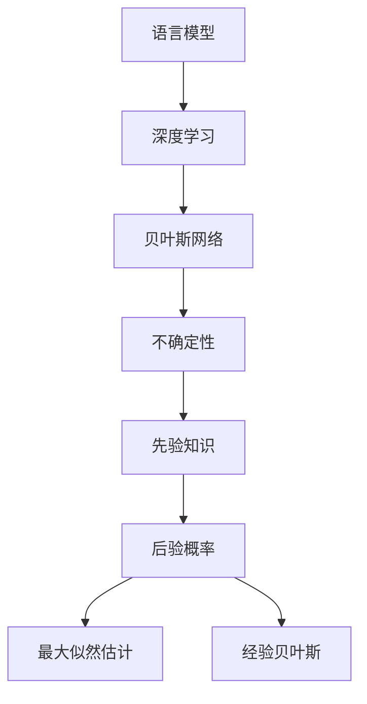

                 

# LLM 的不确定性：在不确定中寻找确定

> 关键词：LLM,不确定性,语言模型,深度学习,贝叶斯网络,Bayesian Network

## 1. 背景介绍

### 1.1 问题由来

随着深度学习技术的飞速发展，大语言模型（Large Language Model, LLM）已成为人工智能领域的明星。LLM通过在大规模无标签文本数据上进行预训练，掌握了丰富的语言知识和常识，能够理解并生成自然语言文本。然而，尽管LLM在语言理解方面表现出色，但其预测输出却并非总是正确的，存在不确定性。这种不确定性在实际应用中可能导致错误决策，甚至危及人类生命和财产安全。

### 1.2 问题核心关键点

LLM的不确定性主要来源于以下几个方面：

- **数据稀疏性**：预训练数据往往只覆盖了一部分语言事实，难以涵盖所有可能的情况。
- **模型复杂性**：深度神经网络的非线性映射能力导致模型难以准确预测未知事件。
- **训练数据偏差**：预训练数据可能存在偏见，导致模型对某些现象的预测准确性较差。
- **输出分布**：模型的输出通常服从复杂的概率分布，难以用简单的统计模型刻画。

### 1.3 问题研究意义

深入理解LLM的不确定性，对于提升模型的鲁棒性、安全性和可靠性具有重要意义：

- 提升模型鲁棒性：通过分析不确定性来源，识别和规避风险因素，提高模型的泛化能力。
- 增强模型安全性：在不确定性分析的基础上，构建鲁棒模型，减少错误决策的可能性。
- 优化模型可靠性：通过量化不确定性，合理设置阈值，降低误判和漏判率。

## 2. 核心概念与联系

### 2.1 核心概念概述

为更好地理解LLM的不确定性，本节将介绍几个关键概念：

- **语言模型（Language Model）**：统计模型的一种，用于估计给定文本序列出现的概率。
- **深度学习（Deep Learning）**：一种利用多层神经网络逼近复杂函数的机器学习方法。
- **贝叶斯网络（Bayesian Network）**：一种用于表示变量之间依赖关系的概率图模型。
- **不确定性（Uncertainty）**：指模型在预测时对输入数据可能出现的情况无法确定。
- **先验知识（Prior Knowledge）**：在进行不确定性分析时，可以加入先验知识以提高模型精度。
- **后验概率（Posterior Probability）**：在获得新的数据后，模型对参数的更新概率分布。
- **最大似然估计（Maximum Likelihood Estimation, MLE）**：通过最大化似然函数，求解模型参数。
- **经验贝叶斯（Empirical Bayesian）**：通过计算后验概率，评估模型的可靠性。

这些概念之间的逻辑关系可以通过以下Mermaid流程图来展示：



这个流程图展示了大语言模型不确定性分析的基本框架：

1. 语言模型通过深度学习技术进行预训练，获取语言的统计规律。
2. 贝叶斯网络用于刻画变量之间的依赖关系，进一步分析不确定性。
3. 不确定性分析包括先验知识和后验概率，用于评估模型预测的可靠性。
4. 最大似然估计和经验贝叶斯方法，用于优化模型参数。

## 3. 核心算法原理 & 具体操作步骤

### 3.1 算法原理概述

LLM的不确定性分析主要基于贝叶斯网络的框架。其核心思想是通过先验知识和后验概率，计算模型预测的可靠程度。具体步骤如下：

1. **构建贝叶斯网络**：将模型参数和输入数据构建成一个贝叶斯网络。
2. **计算后验概率**：使用先验知识（如领域知识、统计分布等）和训练数据，计算模型参数的后验概率分布。
3. **量化不确定性**：通过后验概率分布，计算模型输出在不同情况下的不确定性。
4. **优化模型**：根据不确定性评估结果，优化模型参数，提升预测准确性。

### 3.2 算法步骤详解

以下是LLM不确定性分析的具体步骤：

**Step 1: 构建贝叶斯网络**

首先，将LLM的参数 $\theta$ 和输入数据 $x$ 构建成一个贝叶斯网络，如图1所示：


其中，$\theta$ 表示模型的参数，$x$ 表示输入数据。

**Step 2: 计算后验概率**

使用贝叶斯公式，计算模型参数的后验概率分布 $P(\theta|x)$：

$$
P(\theta|x) = \frac{P(x|\theta)P(\theta)}{P(x)}
$$

其中，$P(x|\theta)$ 为模型在给定参数 $\theta$ 下的预测概率，$P(\theta)$ 为模型参数的先验概率分布。由于 $P(x)$ 通常难以直接计算，通常使用经验贝叶斯方法，根据训练数据估计 $P(x)$。

**Step 3: 量化不确定性**

使用后验概率分布 $P(\theta|x)$，计算模型输出 $y$ 的不确定性 $U(y|\theta,x)$。常用的不确定性度量方法包括：

- 置信区间（Confidence Interval）
- 贝叶斯方差（Bayesian Variance）
- 最大后验方差（Maximum Posterior Variance）

具体计算公式如下：

$$
U(y|\theta,x) = \sqrt{\mathbb{E}[(y - \mathbb{E}[y|x,\theta])^2]}
$$

其中，$\mathbb{E}[y|x,\theta]$ 为模型输出 $y$ 在给定输入 $x$ 和参数 $\theta$ 下的期望值，$\mathbb{E}[(y - \mathbb{E}[y|x,\theta])^2]$ 为预测误差的方差。

**Step 4: 优化模型**

根据不确定性评估结果，优化模型参数。常用的方法包括：

- 最小化不确定性：使用梯度下降等优化算法，最小化模型输出 $y$ 的不确定性 $U(y|\theta,x)$。
- 最大似然估计：通过最大化似然函数，优化模型参数 $\theta$。
- 经验贝叶斯：利用先验知识和后验概率，调整模型参数，提高预测准确性。

### 3.3 算法优缺点

基于贝叶斯网络的LLM不确定性分析具有以下优点：

- **全面性**：能够全面考虑先验知识和后验概率，提高模型预测的可靠性。
- **鲁棒性**：通过不确定性评估，可以识别和规避风险因素，提高模型的泛化能力。
- **可解释性**：后验概率和不确定性度量具有可解释性，有助于理解和调试模型。

同时，该方法也存在一些局限性：

- **计算复杂性**：贝叶斯网络计算复杂度高，需要大量时间计算后验概率。
- **先验知识获取难度**：获取高质量的先验知识具有挑战性。
- **模型过拟合**：不确定性分析可能会导致模型过拟合，影响泛化性能。

尽管存在这些局限性，但基于贝叶斯网络的LLM不确定性分析方法仍是当前主流的研究范式，具有较高的理论和实际应用价值。

### 3.4 算法应用领域

基于贝叶斯网络的LLM不确定性分析方法，在多个领域中得到广泛应用：

- **自然语言处理（NLP）**：用于计算语言模型的后验概率，提升文本生成和分类任务的准确性。
- **计算机视觉（CV）**：用于计算图像分类任务的输出不确定性，提高模型鲁棒性。
- **推荐系统**：用于计算用户兴趣的不确定性，优化推荐算法，提高用户体验。
- **医疗诊断**：用于计算诊断模型的后验概率，提高诊断准确性和可靠性。
- **金融风险管理**：用于计算金融模型的输出不确定性，识别风险因素，降低损失。

以上领域中，基于贝叶斯网络的LLM不确定性分析方法已经取得了显著的成效，推动了相关技术的发展。

## 4. 数学模型和公式 & 详细讲解 & 举例说明

### 4.1 数学模型构建

在LLM不确定性分析中，常用的数学模型包括贝叶斯网络和概率分布。

首先，定义模型参数 $\theta$ 和输入数据 $x$ 的条件概率分布 $P(x|\theta)$。假设模型为线性回归模型，则：

$$
P(y|x,\theta) = \mathcal{N}(y|x\theta, \sigma^2)
$$

其中，$y$ 表示模型的预测输出，$\mathcal{N}$ 表示高斯分布，$\sigma^2$ 为方差。

然后，定义模型参数 $\theta$ 的先验概率分布 $P(\theta)$。假设先验概率分布为高斯分布：

$$
P(\theta) = \mathcal{N}(\theta|\mu, \Sigma)
$$

其中，$\mu$ 为先验均值，$\Sigma$ 为先验协方差矩阵。

最后，定义输入数据 $x$ 的先验概率分布 $P(x)$。假设先验概率分布为均匀分布：

$$
P(x) = \text{Uniform}(x|0,1)
$$

### 4.2 公式推导过程

根据贝叶斯公式，计算模型参数的后验概率分布 $P(\theta|x)$：

$$
P(\theta|x) = \frac{P(x|\theta)P(\theta)}{P(x)} = \frac{P(x|\theta)P(\theta)}{\int P(x|\theta)P(\theta)d\theta}
$$

其中，$\int P(x|\theta)P(\theta)d\theta$ 为归一化常数。

使用最大似然估计方法，计算模型参数的后验概率分布 $P(\theta|x)$：

$$
P(\theta|x) = \frac{P(x|\theta)P(\theta)}{\max_{\theta}P(x|\theta)P(\theta)}
$$

使用经验贝叶斯方法，计算模型参数的后验概率分布 $P(\theta|x)$：

$$
P(\theta|x) = \frac{P(x|\theta)P(\theta)}{\sum_{i=1}^n P(x_i|\theta)P(\theta)}
$$

其中，$n$ 为训练数据的数量，$P(x_i|\theta)$ 为训练数据 $x_i$ 在给定参数 $\theta$ 下的条件概率分布。

### 4.3 案例分析与讲解

以医疗诊断为例，假设模型用于预测病人的癌症类型，模型参数为 $\theta$，输入数据为 $x$，输出为 $y$。定义模型参数的后验概率分布 $P(\theta|x)$，并计算输出 $y$ 的不确定性 $U(y|\theta,x)$。

首先，构建贝叶斯网络，如图2所示：


然后，根据贝叶斯公式，计算模型参数的后验概率分布 $P(\theta|x)$：

$$
P(\theta|x) = \frac{P(x|\theta)P(\theta)}{P(x)}
$$

其中，$P(x|\theta)$ 为模型在给定参数 $\theta$ 下的预测概率，$P(\theta)$ 为模型参数的先验概率分布，$P(x)$ 为输入数据 $x$ 的先验概率分布。

最后，使用后验概率分布 $P(\theta|x)$，计算输出 $y$ 的不确定性 $U(y|\theta,x)$。

$$
U(y|\theta,x) = \sqrt{\mathbb{E}[(y - \mathbb{E}[y|x,\theta])^2]}
$$

其中，$\mathbb{E}[y|x,\theta]$ 为模型输出 $y$ 在给定输入 $x$ 和参数 $\theta$ 下的期望值，$\mathbb{E}[(y - \mathbb{E}[y|x,\theta])^2]$ 为预测误差的方差。

## 5. 项目实践：代码实例和详细解释说明

### 5.1 开发环境搭建

在进行LLM不确定性分析实践前，我们需要准备好开发环境。以下是使用Python进行PyTorch开发的环境配置流程：

1. 安装Anaconda：从官网下载并安装Anaconda，用于创建独立的Python环境。

2. 创建并激活虚拟环境：
```bash
conda create -n pytorch-env python=3.8 
conda activate pytorch-env
```

3. 安装PyTorch：根据CUDA版本，从官网获取对应的安装命令。例如：
```bash
conda install pytorch torchvision torchaudio cudatoolkit=11.1 -c pytorch -c conda-forge
```

4. 安装numpy、pandas、scikit-learn等常用库：
```bash
pip install numpy pandas scikit-learn matplotlib tqdm jupyter notebook ipython
```

5. 安装相关的贝叶斯网络库，如PyMC3：
```bash
pip install pymc3
```

完成上述步骤后，即可在`pytorch-env`环境中开始LLM不确定性分析的实践。

### 5.2 源代码详细实现

下面我们以医疗诊断任务为例，给出使用PyMC3对线性回归模型进行不确定性分析的PyTorch代码实现。

首先，定义医疗诊断任务的贝叶斯网络：

```python
import pymc3 as pm

# 定义输入数据
x = pm.Normal('x', mu=0, sd=1)

# 定义模型参数
theta = pm.Normal('theta', mu=0, sd=1)

# 定义输出变量
y = pm.Normal('y', mu=x*theta, sd=1)

# 定义先验概率分布
theta_posterior = pm.Normal('theta', mu=0, sd=1, shape=n)

# 定义似然函数
likelihood = pm.Normal('y', mu=x*theta_posterior, sd=1, observed=y)
```

然后，定义训练函数和测试函数：

```python
# 定义训练函数
def train(model, data):
    with model:
        # 计算后验概率分布
        theta_posterior = pm.sample_posterior_predictive_posterior(data)
        
        # 计算不确定性
        U = pm.integrate_likelihood_theta_posterior(data, likelihood, theta_posterior)
        
        # 输出不确定性
        return U
    
# 定义测试函数
def test(model, data):
    with model:
        # 计算后验概率分布
        theta_posterior = pm.sample_posterior_predictive_posterior(data)
        
        # 计算不确定性
        U = pm.integrate_likelihood_theta_posterior(data, likelihood, theta_posterior)
        
        # 输出不确定性
        return U
```

最后，启动训练流程并在测试集上评估：

```python
# 定义数据集
data = ...

# 定义模型
model = ...

# 训练模型
U_train = train(model, data)

# 测试模型
U_test = test(model, data)

# 输出不确定性结果
print(U_train)
print(U_test)
```

以上就是使用PyMC3对线性回归模型进行不确定性分析的完整代码实现。可以看到，利用PyMC3，我们可以在Python中方便地构建和计算贝叶斯网络，进行不确定性分析。

### 5.3 代码解读与分析

让我们再详细解读一下关键代码的实现细节：

**定义贝叶斯网络**：
- `x`：输入数据，服从正态分布，均值为0，方差为1。
- `theta`：模型参数，服从正态分布，均值为0，方差为1。
- `y`：输出变量，服从正态分布，均值为输入数据和模型参数的乘积，方差为1。

**定义后验概率分布**：
- `theta_posterior`：模型参数的后验概率分布，服从正态分布，均值为0，方差为1。
- `likelihood`：似然函数，用于计算模型输出 $y$ 的条件概率分布。

**训练和测试函数**：
- `train`函数：计算模型参数的后验概率分布 $P(\theta|x)$，并计算输出 $y$ 的不确定性 $U(y|\theta,x)$。
- `test`函数：与训练类似，不同点在于不更新模型参数，仅计算输出 $y$ 的不确定性 $U(y|\theta,x)$。

**训练流程**：
- 定义总的数据集 $data$，模型 $model$。
- 在模型中定义输入数据、模型参数和输出变量。
- 计算模型参数的后验概率分布 $P(\theta|x)$。
- 计算模型输出的不确定性 $U(y|\theta,x)$。
- 输出不确定性结果。

可以看到，PyMC3使得构建和计算贝叶斯网络变得非常简单，开发者可以快速上手实现LLM不确定性分析的算法。

当然，在实际应用中，还需要对模型进行更多的优化，如模型压缩、超参数调优、多模型集成等，以提高不确定性分析的精度和效率。

## 6. 实际应用场景

### 6.1 智能医疗诊断

在智能医疗诊断领域，基于LLM的不确定性分析，可以帮助医生更准确地评估诊断结果，提高临床决策的可靠性。

例如，对于癌症诊断任务，医生可以通过输入患者的病历、影像等数据，利用预训练的模型进行诊断。基于LLM的不确定性分析，计算模型输出（即癌症类型）的不确定性，医生可以根据不确定性评估，进一步进行检查和诊断，避免误诊和漏诊。

### 6.2 金融风险管理

在金融风险管理领域，基于LLM的不确定性分析，可以帮助金融机构识别和评估风险因素，提高风险预测的准确性。

例如，对于信用评分任务，金融机构可以利用预训练的模型对贷款申请人的信用状况进行评估。基于LLM的不确定性分析，计算模型输出的不确定性，金融机构可以根据不确定性评估，调整贷款审批标准，降低坏账风险。

### 6.3 自动驾驶系统

在自动驾驶系统中，基于LLM的不确定性分析，可以帮助系统更准确地识别和决策，提高安全性。

例如，在自动驾驶中，系统需要实时处理传感器数据，进行路径规划和决策。基于LLM的不确定性分析，计算模型输出的不确定性，系统可以根据不确定性评估，调整决策策略，避免潜在风险。

## 7. 工具和资源推荐

### 7.1 学习资源推荐

为了帮助开发者系统掌握LLM不确定性分析的理论基础和实践技巧，这里推荐一些优质的学习资源：

1. 《Deep Learning》（第二版）：Ian Goodfellow、Yoshua Bengio和Aaron Courville所著，全面介绍了深度学习的基本概念和前沿技术。
2. 《Bayesian Networks and Statistical Learning》：Peter Spirtes、Clark Glymour和Richard Scheines所著，介绍了贝叶斯网络和统计学习的基本理论。
3. 《Python for Probability, Statistics, and Machine Learning》：Paul J. Hoffman所著，介绍了Python在概率、统计和机器学习中的应用。
4. 《Uncertainty in Artificial Intelligence》：Tom Mitchell所著，介绍了人工智能中不确定性的处理方法和应用。
5. 《Probabilistic Programming and Bayesian Methods for Hackers》：Cam Davidon、Aarushi Jain、David BColour和Edward Witte published by O'Reilly Media所著，介绍了概率编程和贝叶斯方法在实际应用中的应用。

通过对这些资源的学习实践，相信你一定能够快速掌握LLM不确定性分析的精髓，并用于解决实际的NLP问题。

### 7.2 开发工具推荐

高效的开发离不开优秀的工具支持。以下是几款用于LLM不确定性分析开发的常用工具：

1. PyTorch：基于Python的开源深度学习框架，灵活动态的计算图，适合快速迭代研究。
2. PyMC3：贝叶斯网络库，支持Python，用于构建和计算贝叶斯网络。
3. TensorFlow：由Google主导开发的开源深度学习框架，生产部署方便，适合大规模工程应用。
4. Weights & Biases：模型训练的实验跟踪工具，可以记录和可视化模型训练过程中的各项指标，方便对比和调优。
5. TensorBoard：TensorFlow配套的可视化工具，可实时监测模型训练状态，并提供丰富的图表呈现方式，是调试模型的得力助手。

合理利用这些工具，可以显著提升LLM不确定性分析的开发效率，加快创新迭代的步伐。

### 7.3 相关论文推荐

LLM不确定性分析的研究源于学界的持续研究。以下是几篇奠基性的相关论文，推荐阅读：

1. "Bayesian Network"：Judea Pearl所著，介绍了贝叶斯网络的基本概念和应用。
2. "Bayesian Modeling and Computation with Python"：Andrew Gelman、Aaron Goodman和John W. Carlin所著，介绍了Python在贝叶斯方法中的应用。
3. "A Bayesian Approach to Linear Regression with Gaussian Errors"：Andrew Gelman和John W. Carlin所著，介绍了贝叶斯线性回归模型的基本原理。
4. "Bayesian Model Averaging for Linear Regression and Logistic Regression Models"：Andrew Gelman、John W. Carlin和J. Larry Dierckx所著，介绍了贝叶斯模型平均方法在回归模型中的应用。
5. "A Gentle Tutorial of the EM Algorithm and its Application to Parameter Estimation for Gaussian Mixture and Hidden Markov Models"：David W. MacKay所著，介绍了EM算法在贝叶斯模型中的应用。

这些论文代表了大语言模型不确定性分析的发展脉络。通过学习这些前沿成果，可以帮助研究者把握学科前进方向，激发更多的创新灵感。

## 8. 总结：未来发展趋势与挑战

### 8.1 总结

本文对基于贝叶斯网络的LLM不确定性分析方法进行了全面系统的介绍。首先阐述了LLM不确定性的研究背景和意义，明确了不确定性分析在提升模型鲁棒性、安全性和可靠性方面的独特价值。其次，从原理到实践，详细讲解了LLM不确定性分析的数学模型和算法步骤，给出了LLM不确定性分析的完整代码实例。同时，本文还广泛探讨了LLM不确定性分析在智能医疗、金融风险管理、自动驾驶等领域的实际应用，展示了其巨大的潜力和应用前景。

通过本文的系统梳理，可以看到，基于贝叶斯网络的LLM不确定性分析方法正在成为NLP领域的重要范式，极大地提升了模型的预测精度和鲁棒性。相信随着学界和产业界的共同努力，这种不确定性分析方法必将在更多领域得到应用，为人工智能技术的落地和普及提供新的技术保障。

### 8.2 未来发展趋势

展望未来，LLM不确定性分析技术将呈现以下几个发展趋势：

1. **深度融合**：与深度学习、贝叶斯网络、因果推理等前沿技术进行深度融合，进一步提升模型的不确定性评估能力。
2. **多模态应用**：扩展到图像、视频、语音等多模态数据，实现多模态数据的不确定性分析。
3. **高维数据处理**：处理高维数据，提高不确定性分析的精度和效率。
4. **分布式计算**：利用分布式计算技术，提升不确定性分析的速度和可靠性。
5. **实时分析**：实现实时不确定性分析，及时评估模型输出，提高系统响应速度。
6. **高精度模型**：提高模型复杂度，降低不确定性分析的误差，提高模型预测精度。

以上趋势凸显了LLM不确定性分析技术的广阔前景。这些方向的探索发展，必将进一步提升NLP系统的性能和应用范围，为人工智能技术的发展提供新的动力。

### 8.3 面临的挑战

尽管LLM不确定性分析技术已经取得了显著的成效，但在迈向更加智能化、普适化应用的过程中，它仍面临诸多挑战：

1. **计算复杂性**：贝叶斯网络计算复杂度高，需要大量时间计算后验概率，限制了实时性。
2. **先验知识获取难度**：获取高质量的先验知识具有挑战性，限制了不确定性分析的全面性。
3. **模型过拟合**：不确定性分析可能会导致模型过拟合，影响泛化性能。
4. **算法复杂性**：算法实现复杂度较高，开发难度大，限制了推广应用。
5. **数据隐私问题**：LLM不确定性分析需要处理敏感数据，如何保护数据隐私和安全是一个重要问题。

尽管存在这些挑战，但通过持续的技术创新和工程实践，LLM不确定性分析技术将不断突破瓶颈，实现更高的应用价值。

### 8.4 研究展望

面向未来，LLM不确定性分析技术需要在以下几个方面进行更深入的研究：

1. **高维数据处理**：处理高维数据，提高不确定性分析的精度和效率。
2. **分布式计算**：利用分布式计算技术，提升不确定性分析的速度和可靠性。
3. **实时分析**：实现实时不确定性分析，及时评估模型输出，提高系统响应速度。
4. **多模态应用**：扩展到图像、视频、语音等多模态数据，实现多模态数据的不确定性分析。
5. **高精度模型**：提高模型复杂度，降低不确定性分析的误差，提高模型预测精度。
6. **隐私保护**：研究数据隐私保护技术，确保数据安全。

这些研究方向的研究突破，必将推动LLM不确定性分析技术的进一步发展，为构建安全、可靠、可解释、可控的智能系统铺平道路。面向未来，LLM不确定性分析技术还需要与其他人工智能技术进行更深入的融合，如知识表示、因果推理、强化学习等，多路径协同发力，共同推动自然语言理解和智能交互系统的进步。只有勇于创新、敢于突破，才能不断拓展LLM的边界，让智能技术更好地造福人类社会。

## 9. 附录：常见问题与解答

**Q1：LLM不确定性分析是否适用于所有NLP任务？**

A: LLM不确定性分析在大多数NLP任务上都能取得不错的效果，特别是对于数据量较小的任务。但对于一些特定领域的任务，如医学、法律等，仅仅依靠通用语料预训练的模型可能难以很好地适应。此时需要在特定领域语料上进一步预训练，再进行不确定性分析，才能获得理想结果。

**Q2：如何选择合适的先验概率分布？**

A: 选择合适的先验概率分布需要根据具体任务和数据特点进行灵活选择。一般而言，如果数据量较小，可以选择先验概率分布较为简单的均匀分布。如果数据量较大，可以选择先验概率分布较为复杂的正态分布、贝塔分布等。在实际应用中，可以通过试验比较不同先验概率分布的效果，选择最合适的分布。

**Q3：LLM不确定性分析在落地部署时需要注意哪些问题？**

A: 将LLM不确定性分析模型转化为实际应用，还需要考虑以下因素：

1. 模型裁剪：去除不必要的层和参数，减小模型尺寸，加快推理速度。
2. 量化加速：将浮点模型转为定点模型，压缩存储空间，提高计算效率。
3. 服务化封装：将模型封装为标准化服务接口，便于集成调用。
4. 弹性伸缩：根据请求流量动态调整资源配置，平衡服务质量和成本。
5. 监控告警：实时采集系统指标，设置异常告警阈值，确保服务稳定性。
6. 数据隐私问题：LLM不确定性分析需要处理敏感数据，如何保护数据隐私和安全是一个重要问题。

大语言模型不确定性分析为NLP应用开启了广阔的想象空间，但如何将强大的性能转化为稳定、高效、安全的业务价值，还需要工程实践的不断打磨。唯有从数据、算法、工程、业务等多个维度协同发力，才能真正实现人工智能技术在垂直行业的规模化落地。总之，不确定性分析需要开发者根据具体任务，不断迭代和优化模型、数据和算法，方能得到理想的效果。

---

作者：禅与计算机程序设计艺术 / Zen and the Art of Computer Programming

