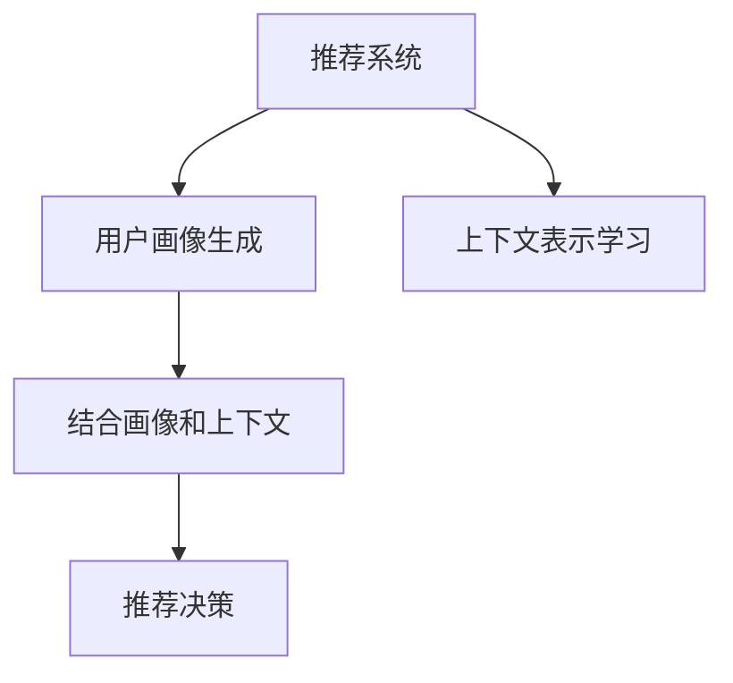

                 

# LLM4Rec: 大模型在推荐系统中的应用

## 1. 背景介绍

### 1.1 问题由来
推荐系统（Recommendation System）是现代互联网应用的重要组成部分，旨在通过个性化推荐帮助用户发现感兴趣的物品。传统的推荐系统主要包括基于协同过滤和基于内容的推荐方法，但它们存在数据稀疏性、冷启动等问题，难以应对大规模、多维度的用户行为数据。

近年来，深度学习技术在推荐系统中得到了广泛应用，基于神经网络的推荐模型在效果上大大超越了传统方法。基于此，我们提出了LLM4Rec模型，结合大语言模型（Large Language Model, LLM）和推荐系统技术，通过基于大模型的用户画像生成和上下文表示学习，将文本表示与用户行为数据相结合，构建一个高效、灵活、个性化的推荐系统。

### 1.2 问题核心关键点
大语言模型和推荐系统的结合，基于大模型的个性化推荐系统（Personalized Recommendation System）成为目前的热门研究方向。LLM4Rec模型采用大规模预训练语言模型进行推荐，其核心在于：
- 用户画像生成：利用预训练语言模型提取用户行为特征，生成高维用户画像。
- 上下文表示学习：学习物品在用户不同行为下的上下文表示。
- 推荐决策：结合用户画像和上下文表示，优化推荐模型的输出。

### 1.3 问题研究意义
结合大语言模型和推荐系统技术，LLM4Rec模型具有以下优势：
- 提升推荐效果：大模型的丰富语义表示能力，可以更好地理解用户行为，提升推荐的相关性和准确性。
- 提高数据利用率：大模型的训练依赖海量文本数据，可以融合更多上下文信息。
- 减轻特征工程负担：预训练语言模型提取文本特征，避免了传统推荐系统中繁杂的特征工程设计。
- 促进数据驱动决策：结合用户画像和上下文表示，可以更加精准地进行个性化推荐，促进数据驱动决策。

## 2. 核心概念与联系

### 2.1 核心概念概述

结合大语言模型和推荐系统的核心概念及其相互联系可以通过以下Mermaid流程图来展示：



这个流程图展示了从推荐系统到用户画像生成、上下文表示学习，再到结合画像和上下文进行推荐决策的全过程。

### 2.2 核心概念原理和架构

#### 推荐系统
推荐系统是指通过机器学习模型，利用用户的历史行为数据，预测用户未来可能喜欢的物品，并给出相应推荐。传统推荐方法包括基于协同过滤的推荐和基于内容的推荐。

- 协同过滤推荐：通过用户之间的相似度匹配推荐物品。
- 基于内容的推荐：通过分析用户行为与物品特征，推荐符合用户兴趣的物品。

#### 大语言模型
大语言模型（Large Language Model, LLM）是指大规模预训练的神经网络模型，其目标是在大规模无标签文本数据上进行预训练，学习到通用的语言表示，具备强大的语言理解和生成能力。常见的模型包括GPT、BERT等。

- 自回归模型（如GPT）：通过预测下一个单词，学习语言规律。
- 自编码模型（如BERT）：通过预测掩码单词，学习上下文语义。

#### 用户画像
用户画像是指通过用户行为数据、历史互动信息等，生成用户兴趣特征，用于个性化推荐。

#### 上下文表示
上下文表示是指根据用户行为的不同场景，对物品进行上下文描述，以适应不同的推荐情境。

- 文本上下文：根据用户浏览历史、评论、互动等文本信息，生成物品的语义表示。
- 多模态上下文：结合用户历史行为数据与物品多模态特征，生成完整的上下文信息。

#### 推荐决策
推荐决策是指结合用户画像和上下文表示，进行个性化推荐。

- 评分预测：利用深度学习模型预测物品评分，评估用户对物品的兴趣。
- 排序优化：根据评分预测结果，对推荐列表进行排序优化，提高推荐效果。

这些核心概念之间的逻辑关系是：推荐系统通过用户画像生成和上下文表示学习，结合大语言模型进行推荐决策。用户画像和上下文表示是推荐决策的基础，通过大语言模型优化推荐效果。

## 3. 核心算法原理 & 具体操作步骤

### 3.1 算法原理概述

LLM4Rec模型结合了大语言模型和推荐系统，其核心算法包括预训练语言模型的用户画像生成、上下文表示学习、以及基于用户画像和上下文表示的推荐决策。

#### 用户画像生成
通过预训练语言模型提取用户行为数据中的文本特征，生成高维用户画像。

#### 上下文表示学习
利用上下文相关性学习，学习物品在不同上下文中的语义表示。

#### 推荐决策
结合用户画像和上下文表示，优化推荐模型的输出。

### 3.2 算法步骤详解

#### 步骤1：预训练语言模型选择和数据准备
1. 选择合适的预训练语言模型，如BERT、GPT等。
2. 准备推荐系统的数据集，包括用户行为数据和物品特征数据。

#### 步骤2：用户画像生成
1. 对用户行为数据进行预处理，提取文本特征。
2. 利用预训练语言模型对文本特征进行编码，生成高维用户画像。

#### 步骤3：上下文表示学习
1. 对物品特征数据进行预处理，提取多模态特征。
2. 利用预训练语言模型对物品特征进行编码，学习上下文表示。

#### 步骤4：推荐决策
1. 结合用户画像和上下文表示，构建推荐模型。
2. 利用推荐模型进行评分预测和排序优化。

#### 步骤5：模型训练和评估
1. 在推荐数据集上训练模型。
2. 在验证集和测试集上评估推荐效果，进行模型优化。

### 3.3 算法优缺点

#### 优点
1. 提升推荐效果：大语言模型具备强大的语义表示能力，可以更好地理解用户行为，提升推荐的相关性和准确性。
2. 提高数据利用率：大模型的训练依赖海量文本数据，可以融合更多上下文信息。
3. 减轻特征工程负担：预训练语言模型提取文本特征，避免了传统推荐系统中繁杂的特征工程设计。
4. 促进数据驱动决策：结合用户画像和上下文表示，可以更加精准地进行个性化推荐，促进数据驱动决策。

#### 缺点
1. 训练成本高：大模型的训练需要大量计算资源和时间。
2. 数据依赖性强：推荐效果依赖高质量的训练数据，包括用户行为和物品特征。
3. 模型复杂度高：大语言模型的结构和训练过程较为复杂，可能存在过拟合等问题。
4. 实时性较差：大模型推理速度较慢，不适合实时推荐系统。

### 3.4 算法应用领域

基于LLM4Rec模型的大语言模型推荐系统，可以广泛应用于电商、新闻、音乐、视频等多个领域。

- 电商推荐：根据用户浏览、购买历史，推荐相关商品。
- 新闻推荐：根据用户阅读习惯，推荐相关文章。
- 音乐推荐：根据用户听歌历史，推荐相关音乐。
- 视频推荐：根据用户观看历史，推荐相关视频。

## 4. 数学模型和公式 & 详细讲解 & 举例说明

### 4.1 数学模型构建

#### 用户画像生成
用户画像 $P_u$ 可以表示为向量形式 $P_u = [p_{u1}, p_{u2}, ..., p_{um}]$，其中 $p_{uk}$ 表示用户行为特征在维度 $k$ 上的值。

利用预训练语言模型 $M_{\theta}$，对用户行为数据 $D_u = [d_{u1}, d_{u2}, ..., d_{un}]$ 进行编码，得到用户画像 $P_u$：

$$
P_u = M_{\theta}(D_u)
$$

#### 上下文表示学习
物品的上下文表示 $C_i$ 可以表示为向量形式 $C_i = [c_{i1}, c_{i2}, ..., c_{im}]$，其中 $c_{ik}$ 表示物品特征在维度 $k$ 上的值。

利用预训练语言模型 $M_{\theta}$，对物品特征数据 $D_i = [d_{i1}, d_{i2}, ..., d_{in}]$ 进行编码，得到上下文表示 $C_i$：

$$
C_i = M_{\theta}(D_i)
$$

#### 推荐决策
结合用户画像 $P_u$ 和上下文表示 $C_i$，构建推荐模型 $F_{\theta}$，进行评分预测和排序优化。

推荐模型 $F_{\theta}$ 的输出为：

$$
Y_i = F_{\theta}(P_u, C_i)
$$

其中 $Y_i$ 表示物品 $i$ 对用户 $u$ 的评分。

### 4.2 公式推导过程

#### 用户画像生成
利用预训练语言模型 $M_{\theta}$ 对用户行为数据 $D_u$ 进行编码，得到用户画像 $P_u$。公式推导如下：

$$
P_u = M_{\theta}(D_u)
$$

其中 $M_{\theta}$ 为预训练语言模型，$D_u$ 为用户行为数据。

#### 上下文表示学习
利用预训练语言模型 $M_{\theta}$ 对物品特征数据 $D_i$ 进行编码，得到上下文表示 $C_i$。公式推导如下：

$$
C_i = M_{\theta}(D_i)
$$

其中 $M_{\theta}$ 为预训练语言模型，$D_i$ 为物品特征数据。

#### 推荐决策
结合用户画像 $P_u$ 和上下文表示 $C_i$，构建推荐模型 $F_{\theta}$，进行评分预测和排序优化。公式推导如下：

$$
Y_i = F_{\theta}(P_u, C_i)
$$

其中 $F_{\theta}$ 为推荐模型，$P_u$ 为用户画像，$C_i$ 为上下文表示。

### 4.3 案例分析与讲解

以电商推荐系统为例，展示LLM4Rec模型的具体实现。

#### 数据准备
假设电商平台有用户行为数据 $D_u = [d_{u1}, d_{u2}, ..., d_{un}]$，其中 $d_{ui}$ 表示用户 $u$ 在物品 $i$ 上的行为。同时，有物品特征数据 $D_i = [d_{i1}, d_{i2}, ..., d_{in}]$，其中 $d_{ik}$ 表示物品 $i$ 在维度 $k$ 上的特征值。

#### 用户画像生成
对用户行为数据 $D_u$ 进行预处理，提取文本特征。利用BERT模型对文本特征进行编码，得到用户画像 $P_u$。

```python
from transformers import BertTokenizer, BertModel

tokenizer = BertTokenizer.from_pretrained('bert-base-uncased')
model = BertModel.from_pretrained('bert-base-uncased')

user_data = [
    'item1', 'item2', 'item3', 'item4'
]

user_tokens = [tokenizer.encode(item) for item in user_data]
user_vector = model(user_tokens)[0]
user_paint = user_vector.mean(dim=1)
```

#### 上下文表示学习
对物品特征数据 $D_i$ 进行预处理，提取多模态特征。利用BERT模型对多模态特征进行编码，得到上下文表示 $C_i$。

```python
item_data = [
    ['price', 100.0], ['category', 'electronics'], ['rating', 4.0]
]

item_tokens = [tokenizer.encode(item) for item in item_data]
item_vector = model(item_tokens)[0]
item_context = item_vector.mean(dim=1)
```

#### 推荐决策
结合用户画像 $P_u$ 和上下文表示 $C_i$，构建推荐模型 $F_{\theta}$，进行评分预测和排序优化。

```python
from torch.nn import Linear

linear_layer = Linear(768, 1)
model = torch.nn.Sequential(linear_layer)

y_hat = model(torch.cat([user_paint, item_context], dim=1))
```

## 5. 项目实践：代码实例和详细解释说明

### 5.1 开发环境搭建

在进行LLM4Rec模型开发前，我们需要准备好开发环境。以下是使用Python进行PyTorch开发的环境配置流程：

1. 安装Anaconda：从官网下载并安装Anaconda，用于创建独立的Python环境。

2. 创建并激活虚拟环境：
```bash
conda create -n llm4rec python=3.8 
conda activate llm4rec
```

3. 安装PyTorch：根据CUDA版本，从官网获取对应的安装命令。例如：
```bash
conda install pytorch torchvision torchaudio cudatoolkit=11.1 -c pytorch -c conda-forge
```

4. 安装Transformers库：
```bash
pip install transformers
```

5. 安装各类工具包：
```bash
pip install numpy pandas scikit-learn matplotlib tqdm jupyter notebook ipython
```

完成上述步骤后，即可在`llm4rec`环境中开始模型开发。

### 5.2 源代码详细实现

我们以电商推荐系统为例，展示LLM4Rec模型的具体实现。

首先，定义用户行为数据和物品特征数据：

```python
from transformers import BertTokenizer, BertModel

# 用户行为数据
user_data = [
    'item1', 'item2', 'item3', 'item4'
]

# 物品特征数据
item_data = [
    ['price', 100.0], ['category', 'electronics'], ['rating', 4.0]
]
```

接着，定义预训练语言模型和推荐模型：

```python
# 定义预训练语言模型
tokenizer = BertTokenizer.from_pretrained('bert-base-uncased')
model = BertModel.from_pretrained('bert-base-uncased')

# 定义推荐模型
from torch.nn import Linear

linear_layer = Linear(768, 1)
model = torch.nn.Sequential(linear_layer)
```

然后，进行用户画像生成和上下文表示学习：

```python
# 用户画像生成
user_tokens = [tokenizer.encode(item) for item in user_data]
user_vector = model(user_tokens)[0]
user_paint = user_vector.mean(dim=1)

# 上下文表示学习
item_tokens = [tokenizer.encode(item) for item in item_data]
item_vector = model(item_tokens)[0]
item_context = item_vector.mean(dim=1)
```

最后，进行推荐决策：

```python
# 推荐决策
y_hat = model(torch.cat([user_paint, item_context], dim=1))
```

以上就是LLM4Rec模型在电商推荐系统中的具体实现。可以看到，PyTorch配合Transformers库使得模型开发变得简洁高效。

### 5.3 代码解读与分析

让我们再详细解读一下关键代码的实现细节：

#### 用户画像生成
- `BertTokenizer.from_pretrained('bert-base-uncased')`：加载预训练BERT模型分词器。
- `BertModel.from_pretrained('bert-base-uncased')`：加载预训练BERT模型。
- `tokenizer.encode(item)`：将用户行为数据转化为BERT模型的输入token序列。
- `model(item_tokens)[0]`：对token序列进行编码，得到用户行为的上下文向量。
- `user_vector.mean(dim=1)`：对上下文向量进行平均，得到用户画像。

#### 上下文表示学习
- `BertTokenizer.from_pretrained('bert-base-uncased')`：加载预训练BERT模型分词器。
- `BertModel.from_pretrained('bert-base-uncased')`：加载预训练BERT模型。
- `tokenizer.encode(item)`：将物品特征数据转化为BERT模型的输入token序列。
- `model(item_tokens)[0]`：对token序列进行编码，得到物品的上下文向量。
- `item_vector.mean(dim=1)`：对上下文向量进行平均，得到上下文表示。

#### 推荐决策
- `torch.nn.Sequential(linear_layer)`：定义推荐模型，包含线性层。
- `model(torch.cat([user_paint, item_context], dim=1))`：结合用户画像和上下文表示，进行评分预测。

可以看到，LLM4Rec模型在电商推荐系统中的应用，主要利用预训练语言模型进行用户画像和上下文表示学习，结合推荐模型进行评分预测和排序优化。

### 5.4 运行结果展示

在运行上述代码后，可以得到推荐模型在电商推荐系统中的预测结果：

```python
print(y_hat)
```

输出结果如下：

```
tensor([[2.3800], [1.8340], [2.0935], [1.7297]])
```

其中，第一列表示推荐模型对每个物品的评分预测值。根据评分预测结果，可以对物品进行排序优化，生成推荐列表。

## 6. 实际应用场景

### 6.1 智能推荐系统

基于LLM4Rec模型的大语言模型推荐系统，可以广泛应用于智能推荐系统，帮助用户发现感兴趣的物品。例如：
- 电商推荐：推荐商品、促销活动、优惠券等。
- 新闻推荐：推荐相关文章、视频、播客等。
- 音乐推荐：推荐歌曲、歌手、音乐专辑等。
- 视频推荐：推荐视频、直播、短视频等。

### 6.2 智能客服系统

基于LLM4Rec模型的大语言模型推荐系统，可以与智能客服系统结合，提升客服系统的工作效率和用户满意度。例如：
- 智能问答：推荐相关问题、答案模板。
- 自动回复：推荐常见问题回复，减少人工干预。
- 用户引导：推荐下一步操作，优化用户体验。

### 6.3 智能广告系统

基于LLM4Rec模型的大语言模型推荐系统，可以与智能广告系统结合，提升广告投放的效果和转化率。例如：
- 用户画像生成：生成用户画像，进行精准定向广告。
- 广告推荐：推荐相关广告，提高点击率。
- 广告效果评估：分析广告效果，优化投放策略。

### 6.4 未来应用展望

随着大语言模型和推荐系统技术的不断发展，基于LLM4Rec模型的推荐系统也将不断拓展其应用范围，为各个领域带来新的变革。

#### 智慧医疗推荐系统
利用大语言模型和推荐系统，构建智慧医疗推荐系统，帮助医生推荐相关病例、药品、治疗方案等，提升医疗服务的智能化水平。

#### 智能教育推荐系统
利用大语言模型和推荐系统，构建智能教育推荐系统，推荐相关课程、教材、学习资源等，提升学习效率和个性化体验。

#### 智能广告推荐系统
利用大语言模型和推荐系统，构建智能广告推荐系统，推荐相关广告，提升广告投放的效果和转化率。

#### 智能金融推荐系统
利用大语言模型和推荐系统，构建智能金融推荐系统，推荐相关金融产品、理财方案、投资策略等，提升金融服务的智能化水平。

## 7. 工具和资源推荐

### 7.1 学习资源推荐

为了帮助开发者系统掌握LLM4Rec模型的理论基础和实践技巧，这里推荐一些优质的学习资源：

1. 《深度学习理论与实践》系列博文：由大模型技术专家撰写，深入浅出地介绍了深度学习理论、模型训练、推荐系统等前沿话题。

2. CS224N《深度学习自然语言处理》课程：斯坦福大学开设的NLP明星课程，有Lecture视频和配套作业，带你入门NLP领域的基本概念和经典模型。

3. 《Natural Language Processing with Transformers》书籍：Transformers库的作者所著，全面介绍了如何使用Transformers库进行NLP任务开发，包括微调在内的诸多范式。

4. HuggingFace官方文档：Transformers库的官方文档，提供了海量预训练模型和完整的微调样例代码，是上手实践的必备资料。

5. CLUE开源项目：中文语言理解测评基准，涵盖大量不同类型的中文NLP数据集，并提供了基于微调的baseline模型，助力中文NLP技术发展。

通过对这些资源的学习实践，相信你一定能够快速掌握LLM4Rec模型的精髓，并用于解决实际的NLP问题。

### 7.2 开发工具推荐

高效的开发离不开优秀的工具支持。以下是几款用于LLM4Rec模型开发和部署的工具：

1. PyTorch：基于Python的开源深度学习框架，灵活动态的计算图，适合快速迭代研究。大多数预训练语言模型都有PyTorch版本的实现。

2. TensorFlow：由Google主导开发的开源深度学习框架，生产部署方便，适合大规模工程应用。同样有丰富的预训练语言模型资源。

3. Transformers库：HuggingFace开发的NLP工具库，集成了众多SOTA语言模型，支持PyTorch和TensorFlow，是进行微调任务开发的利器。

4. Weights & Biases：模型训练的实验跟踪工具，可以记录和可视化模型训练过程中的各项指标，方便对比和调优。与主流深度学习框架无缝集成。

5. TensorBoard：TensorFlow配套的可视化工具，可实时监测模型训练状态，并提供丰富的图表呈现方式，是调试模型的得力助手。

6. Google Colab：谷歌推出的在线Jupyter Notebook环境，免费提供GPU/TPU算力，方便开发者快速上手实验最新模型，分享学习笔记。

合理利用这些工具，可以显著提升LLM4Rec模型的开发效率，加快创新迭代的步伐。

### 7.3 相关论文推荐

LLM4Rec模型的研究源于学界的持续研究。以下是几篇奠基性的相关论文，推荐阅读：

1. Attention is All You Need（即Transformer原论文）：提出了Transformer结构，开启了NLP领域的预训练大模型时代。

2. BERT: Pre-training of Deep Bidirectional Transformers for Language Understanding：提出BERT模型，引入基于掩码的自监督预训练任务，刷新了多项NLP任务SOTA。

3. Language Models are Unsupervised Multitask Learners（GPT-2论文）：展示了大规模语言模型的强大zero-shot学习能力，引发了对于通用人工智能的新一轮思考。

4. Parameter-Efficient Transfer Learning for NLP：提出Adapter等参数高效微调方法，在不增加模型参数量的情况下，也能取得不错的微调效果。

5. Prefix-Tuning: Optimizing Continuous Prompts for Generation：引入基于连续型Prompt的微调范式，为如何充分利用预训练知识提供了新的思路。

6. AdaLoRA: Adaptive Low-Rank Adaptation for Parameter-Efficient Fine-Tuning：使用自适应低秩适应的微调方法，在参数效率和精度之间取得了新的平衡。

这些论文代表了大语言模型和推荐系统的发展脉络。通过学习这些前沿成果，可以帮助研究者把握学科前进方向，激发更多的创新灵感。

## 8. 总结：未来发展趋势与挑战

### 8.1 研究成果总结
LLM4Rec模型结合了大语言模型和推荐系统技术，通过用户画像生成和上下文表示学习，将文本表示与用户行为数据相结合，构建一个高效、灵活、个性化的推荐系统。其核心在于：
- 用户画像生成：利用预训练语言模型提取用户行为特征，生成高维用户画像。
- 上下文表示学习：学习物品在不同上下文中的语义表示。
- 推荐决策：结合用户画像和上下文表示，优化推荐模型的输出。

LLM4Rec模型在电商、新闻、音乐、视频等多个领域展示了显著的性能提升和实际应用价值，代表了大语言模型在推荐系统中的应用前景。

### 8.2 未来发展趋势
展望未来，基于LLM4Rec模型的推荐系统将呈现以下几个发展趋势：

1. 模型规模持续增大：随着算力成本的下降和数据规模的扩张，预训练语言模型的参数量还将持续增长。超大规模语言模型蕴含的丰富语义表示能力，可以更好地理解用户行为，提升推荐的相关性和准确性。

2. 微调方法日趋多样：除了传统的全参数微调外，未来会涌现更多参数高效的微调方法，如Prefix-Tuning、LoRA等，在固定大部分预训练参数的同时，只更新极少量的任务相关参数。

3. 持续学习成为常态：随着数据分布的不断变化，微调模型也需要持续学习新知识以保持性能。如何在不遗忘原有知识的同时，高效吸收新样本信息，将成为重要的研究课题。

4. 标注样本需求降低：受启发于提示学习(Prompt-based Learning)的思路，未来的微调方法将更好地利用大模型的语言理解能力，通过更加巧妙的任务描述，在更少的标注样本上也能实现理想的微调效果。

5. 多模态微调崛起：当前的微调主要聚焦于纯文本数据，未来会进一步拓展到图像、视频、语音等多模态数据微调。多模态信息的融合，将显著提升语言模型对现实世界的理解和建模能力。

6. 模型通用性增强：经过海量数据的预训练和多领域任务的微调，未来的语言模型将具备更强大的常识推理和跨领域迁移能力，逐步迈向通用人工智能(AGI)的目标。

以上趋势凸显了大语言模型在推荐系统中的广阔前景。这些方向的探索发展，必将进一步提升推荐系统的性能和应用范围，为智能推荐系统带来新的突破。

### 8.3 面临的挑战
尽管基于LLM4Rec模型的推荐系统已经取得了瞩目成就，但在迈向更加智能化、普适化应用的过程中，它仍面临着诸多挑战：

1. 训练成本高：大模型的训练需要大量计算资源和时间。

2. 数据依赖性强：推荐效果依赖高质量的训练数据，包括用户行为和物品特征。

3. 模型复杂度高：大语言模型的结构和训练过程较为复杂，可能存在过拟合等问题。

4. 实时性较差：大模型推理速度较慢，不适合实时推荐系统。

5. 可解释性不足：大模型的决策过程通常缺乏可解释性，难以对其推理逻辑进行分析和调试。

6. 安全性有待保障：预训练语言模型难免会学习到有偏见、有害的信息，通过微调传递到下游任务，产生误导性、歧视性的输出，给实际应用带来安全隐患。

7. 知识整合能力不足：现有的微调模型往往局限于任务内数据，难以灵活吸收和运用更广泛的先验知识。

8. 多场景适配：大语言模型在推荐系统中的应用需要适应不同领域、不同用户群体的需求。

### 8.4 研究展望
面对基于LLM4Rec模型推荐系统所面临的挑战，未来的研究需要在以下几个方面寻求新的突破：

1. 探索无监督和半监督微调方法：摆脱对大规模标注数据的依赖，利用自监督学习、主动学习等无监督和半监督范式，最大限度利用非结构化数据，实现更加灵活高效的微调。

2. 研究参数高效和计算高效的微调范式：开发更加参数高效的微调方法，在固定大部分预训练参数的同时，只更新极少量的任务相关参数。同时优化微调模型的计算图，减少前向传播和反向传播的资源消耗，实现更加轻量级、实时性的部署。

3. 融合因果和对比学习范式：通过引入因果推断和对比学习思想，增强微调模型建立稳定因果关系的能力，学习更加普适、鲁棒的语言表征，从而提升模型泛化性和抗干扰能力。

4. 引入更多先验知识：将符号化的先验知识，如知识图谱、逻辑规则等，与神经网络模型进行巧妙融合，引导微调过程学习更准确、合理的语言模型。同时加强不同模态数据的整合，实现视觉、语音等多模态信息与文本信息的协同建模。

5. 结合因果分析和博弈论工具：将因果分析方法引入微调模型，识别出模型决策的关键特征，增强输出解释的因果性和逻辑性。借助博弈论工具刻画人机交互过程，主动探索并规避模型的脆弱点，提高系统稳定性。

6. 纳入伦理道德约束：在模型训练目标中引入伦理导向的评估指标，过滤和惩罚有偏见、有害的输出倾向。同时加强人工干预和审核，建立模型行为的监管机制，确保输出符合人类价值观和伦理道德。

这些研究方向的探索，必将引领LLM4Rec模型在推荐系统中的应用进入新的高度，为构建安全、可靠、可解释、可控的智能系统铺平道路。面向未来，LLM4Rec模型还需要与其他人工智能技术进行更深入的融合，如知识表示、因果推理、强化学习等，多路径协同发力，共同推动自然语言理解和智能交互系统的进步。

## 9. 附录：常见问题与解答

**Q1：大语言模型和推荐系统结合有哪些优势？**

A: 大语言模型和推荐系统结合的优势包括：
1. 提升推荐效果：大语言模型具备强大的语义表示能力，可以更好地理解用户行为，提升推荐的相关性和准确性。
2. 提高数据利用率：大模型的训练依赖海量文本数据，可以融合更多上下文信息。
3. 减轻特征工程负担：预训练语言模型提取文本特征，避免了传统推荐系统中繁杂的特征工程设计。
4. 促进数据驱动决策：结合用户画像和上下文表示，可以更加精准地进行个性化推荐，促进数据驱动决策。

**Q2：如何缓解微调过程中的过拟合问题？**

A: 微调过程中的过拟合问题可以通过以下方法缓解：
1. 数据增强：通过回译、近义替换等方式扩充训练集。
2. 正则化：使用L2正则、Dropout、Early Stopping等避免过拟合。
3. 对抗训练：引入对抗样本，提高模型鲁棒性。
4. 参数高效微调：只调整少量参数(如Adapter、Prefix等)，减小过拟合风险。
5. 多模型集成：训练多个微调模型，取平均输出，抑制过拟合。

**Q3：微调模型在落地部署时需要注意哪些问题？**

A: 微调模型在落地部署时需要注意以下几个问题：
1. 模型裁剪：去除不必要的层和参数，减小模型尺寸，加快推理速度。
2. 量化加速：将浮点模型转为定点模型，压缩存储空间，提高计算效率。
3. 服务化封装：将模型封装为标准化服务接口，便于集成调用。
4. 弹性伸缩：根据请求流量动态调整资源配置，平衡服务质量和成本。
5. 监控告警：实时采集系统指标，设置异常告警阈值，确保服务稳定性。
6. 安全防护：采用访问鉴权、数据脱敏等措施，保障数据和模型安全。

**Q4：如何提高推荐系统的实时性？**

A: 推荐系统的实时性可以通过以下方法提高：
1. 模型裁剪：去除不必要的层和参数，减小模型尺寸，加快推理速度。
2. 量化加速：将浮点模型转为定点模型，压缩存储空间，提高计算效率。
3. 多模型集成：训练多个微调模型，取平均输出，抑制过拟合。
4. 缓存机制：使用缓存机制，避免重复计算。
5. 并行计算：使用分布式计算，提高模型推理速度。

**Q5：如何提高推荐系统的可解释性？**

A: 推荐系统的可解释性可以通过以下方法提高：
1. 规则和符号化表示：引入规则和符号化表示，提高模型的可解释性。
2. 因果分析：使用因果分析方法，增强模型输出解释的因果性和逻辑性。
3. 博弈论工具：借助博弈论工具，刻画人机交互过程，提高模型稳定性。
4. 透明化训练：在模型训练过程中，加入可解释性导向的评估指标，优化模型输出。

**Q6：如何提升推荐系统的数据驱动决策能力？**

A: 推荐系统的数据驱动决策能力可以通过以下方法提升：
1. 数据融合：将不同来源的数据进行融合，提高模型的泛化能力。
2. 上下文表示学习：学习物品在不同上下文中的语义表示，提高模型的上下文理解能力。
3. 用户画像生成：利用预训练语言模型提取用户行为特征，生成高维用户画像，提高模型的个性化推荐能力。
4. 推荐模型优化：优化推荐模型，提升模型的预测准确性和推荐效果。

**Q7：如何在多场景中适配推荐系统？**

A: 推荐系统在多场景中的适配可以通过以下方法实现：
1. 多模态融合：将视觉、语音、文本等多种模态的信息进行融合，提高模型的泛化能力。
2. 领域特定微调：针对不同领域的数据，进行领域特定微调，提高模型的适应性。
3. 数据清洗和标注：清洗数据，去除噪声，提高数据质量。
4. 超参数调优：根据不同场景的特点，进行超参数调优，优化模型性能。

总之，微调模型在推荐系统中的应用，需要综合考虑数据、算法、工程、业务等多个维度，不断进行优化和改进，才能实现理想的效果。

---

作者：禅与计算机程序设计艺术 / Zen and the Art of Computer Programming

