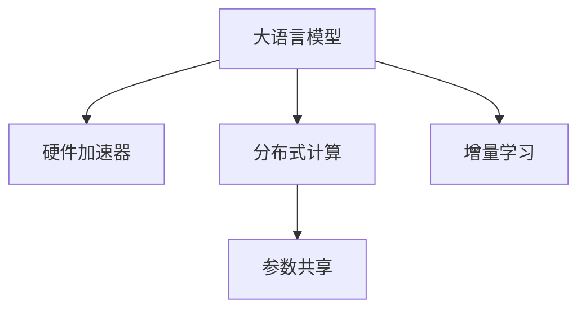

                 

# LLM:新型通用计算机架构

## 1. 背景介绍

在当今信息时代，计算架构的发展已经深刻影响了社会的各个方面。随着数字化的不断深入，数据存储和处理的效率、规模以及实时性成为了制约各行各业发展的瓶颈。因此，寻找更加高效、灵活、易于扩展的计算架构成为了时代的呼唤。在这样的背景下，LLM（Large Language Model）大语言模型应运而生，成为了新一代通用计算机架构的探索方向。

### 1.1 问题由来

在过去的几十年中，计算机架构经历了从串行处理到并行处理、从集中式到分布式计算的演进。但这些架构在处理大规模数据和复杂计算任务时，依然存在诸多局限：

- **数据处理能力不足**：传统架构如CPU和GPU虽然数据处理能力强大，但面对海量数据和高维度的计算任务，依然显得力不从心。
- **扩展性受限**：现有架构往往难以适应数据量和计算需求的变化，导致性能瓶颈难以突破。
- **资源利用率低下**：数据中心和服务器资源利用率不高，维护成本和能耗问题显著。
- **应用领域受限**：现有的计算架构主要针对特定应用场景设计，难以满足多样化的应用需求。

因此，开发一种能够高效处理大规模数据、高度灵活且易于扩展的新型计算架构，成为当前研究的热点。

### 1.2 问题核心关键点

LLM大语言模型作为一种新型计算架构，其核心思想是将大规模预训练语言模型与计算机硬件架构深度融合，构建出一个能够快速学习、高效处理自然语言任务的通用计算平台。该架构的关键点包括：

- **大模型预训练**：利用大规模无标签数据进行自监督学习，学习到语言的通用表示。
- **硬件加速支持**：通过专用硬件加速器，如TPU、FPGA等，提升大模型的推理速度和效率。
- **模型分布式部署**：将大模型分解为多个子模型，分布在不同计算节点上，实现高效的并行计算。
- **模型可扩展性**：通过参数共享和增量学习等技术，支持模型规模的动态扩展。
- **应用灵活性**：能够适应各种自然语言处理任务，如文本生成、问答、机器翻译等。

这些关键点共同构成了LLM架构的理论基础，使其能够在处理自然语言任务时发挥出强大的优势。

## 2. 核心概念与联系

### 2.1 核心概念概述

为了更好地理解LLM架构，本节将介绍几个关键概念及其联系：

- **大语言模型(Large Language Model, LLM)**：基于Transformer模型，利用大规模无标签数据进行自监督预训练，学习到语言的通用表示。常用的预训练模型包括BERT、GPT-2、GPT-3等。
- **硬件加速器**：如Google TPU、NVIDIA GPU、Intel Xeon Phi等，用于提升大模型的推理速度和训练效率。
- **分布式计算**：将大模型分解为多个子模型，分布在不同计算节点上，实现高效的并行计算。
- **参数共享**：在大模型的不同子模型中共享部分参数，减少计算资源占用，提高模型训练和推理效率。
- **增量学习**：在已有模型基础上，通过新数据的微调学习，提升模型性能，实现模型的动态扩展。

这些概念之间的关系可以通过以下Mermaid流程图来展示：



这个流程图展示了LLM架构的核心组件及其相互作用：

1. 大语言模型作为计算的核心，利用硬件加速器提升推理效率，并采用分布式计算和参数共享技术，实现高效、灵活的计算。
2. 增量学习技术，通过微调现有模型，不断提升模型的适应能力和性能。

## 3. 核心算法原理 & 具体操作步骤

### 3.1 算法原理概述

LLM架构的计算原理基于深度学习的Transformer模型，结合硬件加速器和分布式计算技术，实现了高效、灵活的计算。具体来说，LLM架构的计算过程如下：

1. **数据预处理**：将输入文本数据进行分词、向量化等预处理，生成模型所需的输入。
2. **模型前向传播**：将预处理后的数据输入到预训练的大语言模型中，进行推理计算。
3. **结果后处理**：对模型输出的向量进行后处理，生成最终的计算结果。
4. **参数更新**：根据输出结果与期望结果的误差，使用反向传播算法更新模型参数。
5. **硬件加速**：利用专用硬件加速器，提升模型推理速度和效率。
6. **分布式计算**：将大模型分布在多个计算节点上，实现高效的并行计算。

### 3.2 算法步骤详解

以下详细讲解LLM架构的计算步骤：

**Step 1: 数据预处理**

1. 将输入文本进行分词，生成词汇表和标签表。
2. 使用词嵌入技术，将词汇表中的单词映射到高维向量空间中。
3. 对词汇表和标签表进行填充和截断，确保输入数据的长度一致。
4. 将填充后的数据进行编码，生成模型所需的输入序列。

**Step 2: 模型前向传播**

1. 将输入序列输入到预训练的大语言模型中，进行推理计算。
2. 对模型的每一层进行前向传播，计算每一层的隐藏状态。
3. 将模型输出层对输入序列进行计算，得到模型的最终输出结果。

**Step 3: 结果后处理**

1. 对模型输出结果进行解码，得到最终的文本序列。
2. 对解码后的文本序列进行后处理，如去除无效字符、添加分隔符等。
3. 将处理后的文本序列作为计算结果输出。

**Step 4: 参数更新**

1. 根据输出结果与期望结果的误差，计算损失函数。
2. 使用反向传播算法，计算模型参数的梯度。
3. 使用优化器更新模型参数，最小化损失函数。
4. 周期性地在验证集上评估模型性能，避免过拟合。

**Step 5: 硬件加速**

1. 利用专用硬件加速器（如TPU、GPU等），提升模型推理速度和效率。
2. 将模型分布在多个计算节点上，实现高效的并行计算。

**Step 6: 分布式计算**

1. 将大模型分为多个子模型，分布在不同计算节点上。
2. 在每个计算节点上独立进行模型推理计算。
3. 将各个节点上的计算结果进行合并，得到最终的结果。

### 3.3 算法优缺点

LLM架构具有以下优点：

1. **高效性**：利用硬件加速器和分布式计算技术，大幅提升计算效率和性能。
2. **灵活性**：通过参数共享和增量学习技术，实现模型规模的动态扩展。
3. **可扩展性**：能够处理大规模数据和高维度计算任务，满足各种应用需求。
4. **可靠性**：通过分布式计算和参数共享技术，提升系统的容错能力和稳定性。

同时，该架构也存在一些缺点：

1. **高硬件成本**：专用硬件加速器的成本较高，对硬件资源的投入较大。
2. **高能耗**：大规模计算对能耗的需求较大，需采用高效的能耗管理策略。
3. **算法复杂性**：分布式计算和参数共享技术的应用，增加了算法的复杂性。
4. **模型泛化性**：模型对特定领域数据的泛化能力有待提升。

### 3.4 算法应用领域

LLM架构的应用领域非常广泛，涵盖多个行业：

- **自然语言处理(NLP)**：文本分类、情感分析、机器翻译、问答系统等。
- **机器学习**：数据挖掘、推荐系统、图像识别、语音识别等。
- **金融**：量化交易、风险控制、信用评分、情感分析等。
- **医疗**：医疗问答、病历分析、药物研发、病理分析等。
- **教育**：智能辅导、学情分析、个性化推荐等。

## 4. 数学模型和公式 & 详细讲解

### 4.1 数学模型构建

LLM架构的计算过程可以抽象为一系列的数学模型和公式。以下是一些关键模型的构建和公式推导：

**输入数据预处理模型**

假设输入文本序列为 $\{x_1, x_2, ..., x_n\}$，其中 $x_i \in V$，$V$ 为词汇表。使用词嵌入技术，将 $x_i$ 映射到高维向量空间 $\mathbb{R}^d$ 中，得到嵌入向量 $e_i \in \mathbb{R}^d$。将嵌入向量进行填充和截断，得到模型所需的输入序列 $\{e_1, e_2, ..., e_n\}$。

**模型前向传播模型**

LLM架构的前向传播过程可以表示为：

$$
\mathbf{h}_i = \mathrm{Transformer}(e_i, \mathbf{h}_{i-1})
$$

其中 $\mathbf{h}_i \in \mathbb{R}^d$ 为第 $i$ 层的隐藏状态，$\mathrm{Transformer}$ 为Transformer模型，$e_i$ 为第 $i$ 层的输入嵌入向量，$\mathbf{h}_{i-1}$ 为第 $i-1$ 层的隐藏状态。

**结果后处理模型**

将模型输出层对输入序列进行计算，得到最终的文本序列 $y = \{y_1, y_2, ..., y_n\}$，其中 $y_i \in \{1, 2, ..., K\}$，$K$ 为标签类别数。

**参数更新模型**

利用反向传播算法，计算模型参数的梯度。使用优化器（如Adam、SGD等）更新模型参数，最小化损失函数 $\mathcal{L}$。

**硬件加速模型**

利用专用硬件加速器（如TPU、GPU等），提升模型推理速度和效率。硬件加速器的计算速度远高于CPU，能够大幅提升计算效率。

**分布式计算模型**

将大模型分为多个子模型，分布在不同计算节点上。在每个计算节点上独立进行模型推理计算，最后将各个节点上的计算结果进行合并，得到最终的结果。

### 4.2 公式推导过程

以下推导LLM架构的核心公式：

**Transformer模型的前向传播**

Transformer模型的前向传播过程如下：

$$
\mathbf{Q} = \mathrm{LayerNorm}(\mathrm{Embedding}(\mathbf{x}) + \mathrm{PositionalEncoding}(\mathbf{x})) \mathbf{K}^T
$$

$$
\mathbf{K} = \mathrm{LayerNorm}(\mathbf{Q}) \mathbf{V}
$$

$$
\mathrm{Attention}(\mathbf{Q}, \mathbf{K}, \mathbf{V}) = \mathrm{Softmax}(\mathbf{Q} \mathbf{K}^T) \mathbf{V}
$$

$$
\mathbf{X} = \mathrm{FFN}(\mathrm{Attention}(\mathbf{Q}, \mathbf{K}, \mathbf{V}))
$$

$$
\mathbf{h}_i = \mathbf{X} + \mathbf{h}_{i-1}
$$

其中 $\mathbf{x} \in \mathbb{R}^n$ 为输入序列，$\mathbf{Q}$、$\mathbf{K}$、$\mathbf{V}$ 为查询、键、值矩阵，$\mathrm{Embedding}$ 为嵌入层，$\mathrm{PositionalEncoding}$ 为位置编码层，$\mathrm{FFN}$ 为前馈网络层。

**反向传播算法**

利用反向传播算法，计算模型参数的梯度。假设输出结果为 $y$，期望结果为 $t$，则损失函数 $\mathcal{L}$ 为：

$$
\mathcal{L} = \frac{1}{N} \sum_{i=1}^N (t_i - y_i)^2
$$

其中 $N$ 为样本数。使用梯度下降算法更新模型参数 $\theta$，最小化损失函数 $\mathcal{L}$。

**分布式计算**

将大模型分为多个子模型，分布在不同计算节点上。假设模型分为 $m$ 个子模型，每个子模型的计算量为 $C$，计算节点的数量为 $n$，则计算总时间为：

$$
T = m \times C / n
$$

其中 $T$ 为计算总时间，$m$ 为子模型数，$C$ 为计算量，$n$ 为计算节点数。

### 4.3 案例分析与讲解

以文本分类任务为例，展示LLM架构的应用。假设输入文本序列为 $\{x_1, x_2, ..., x_n\}$，标签序列为 $\{y_1, y_2, ..., y_n\}$。使用预训练的BERT模型进行文本分类，具体步骤如下：

1. 将输入文本序列和标签序列输入BERT模型，进行前向传播计算，得到模型输出结果。
2. 将模型输出结果解码为文本序列 $y = \{y_1, y_2, ..., y_n\}$。
3. 根据输出结果与期望结果的误差，计算损失函数 $\mathcal{L}$。
4. 使用优化器（如Adam、SGD等）更新模型参数，最小化损失函数 $\mathcal{L}$。
5. 利用硬件加速器（如TPU、GPU等），提升模型推理速度和效率。
6. 将模型分布在多个计算节点上，实现高效的并行计算。

## 5. 项目实践：代码实例和详细解释说明

### 5.1 开发环境搭建

在进行LLM架构的实践前，需要准备好开发环境。以下是使用Python进行TensorFlow开发的环境配置流程：

1. 安装Anaconda：从官网下载并安装Anaconda，用于创建独立的Python环境。

2. 创建并激活虚拟环境：
```bash
conda create -n tf-env python=3.8 
conda activate tf-env
```

3. 安装TensorFlow：根据CUDA版本，从官网获取对应的安装命令。例如：
```bash
conda install tensorflow-gpu==2.6
```

4. 安装各类工具包：
```bash
pip install numpy pandas scikit-learn matplotlib tqdm jupyter notebook ipython
```

完成上述步骤后，即可在`tf-env`环境中开始LLM架构的实践。

### 5.2 源代码详细实现

这里我们以BERT模型进行文本分类任务的实现为例，展示LLM架构的代码实现。

```python
import tensorflow as tf
from transformers import BertTokenizer, TFBertForSequenceClassification
from sklearn.metrics import classification_report
import numpy as np
import pandas as pd

# 初始化模型和分词器
tokenizer = BertTokenizer.from_pretrained('bert-base-cased')
model = TFBertForSequenceClassification.from_pretrained('bert-base-cased', num_labels=2)

# 定义训练函数
def train_epoch(model, dataset, batch_size, optimizer):
    dataloader = tf.data.Dataset.from_generator(lambda: dataset, output_types=(tf.int32, tf.int32))
    dataloader = dataloader.shuffle(10000).batch(batch_size).map(lambda x, y: (tf.cast(tokenizer(x['input'], padding='max_length', truncation=True), tf.int32), y))
    dataset = dataloader.prefetch(tf.data.experimental.AUTOTUNE)
    model.trainable = True
    with tf.GradientTape() as tape:
        for x, y in dataset:
            outputs = model(x)
            loss = tf.keras.losses.SparseCategoricalCrossentropy(from_logits=True)(y, outputs.logits)
    gradients = tape.gradient(loss, model.trainable_variables)
    optimizer.apply_gradients(zip(gradients, model.trainable_variables))

# 定义评估函数
def evaluate(model, dataset, batch_size):
    dataloader = tf.data.Dataset.from_generator(lambda: dataset, output_types=(tf.int32, tf.int32))
    dataloader = dataloader.batch(batch_size)
    dataset = dataloader.prefetch(tf.data.experimental.AUTOTUNE)
    model.trainable = False
    preds, labels = [], []
    for x, y in dataset:
        outputs = model(x)
        preds.append(outputs.logits.argmax(axis=1))
        labels.append(y.numpy())
    print(classification_report(np.array(labels), np.array(preds)))

# 定义数据集
train_data = pd.read_csv('train.csv')
train_labels = train_data['label'].values
train_data['text'] = train_data['text'].apply(tokenizer.encode_plus, max_length=256, padding='max_length', truncation=True)
train_data = {'input': train_data['text'].tolist(), 'label': train_labels}
train_dataset = tf.data.Dataset.from_generator(lambda: train_data, output_types=(tf.int32, tf.int32))

dev_data = pd.read_csv('dev.csv')
dev_labels = dev_data['label'].values
dev_data['text'] = dev_data['text'].apply(tokenizer.encode_plus, max_length=256, padding='max_length', truncation=True)
dev_data = {'input': dev_data['text'].tolist(), 'label': dev_labels}
dev_dataset = tf.data.Dataset.from_generator(lambda: dev_data, output_types=(tf.int32, tf.int32))

test_data = pd.read_csv('test.csv')
test_labels = test_data['label'].values
test_data['text'] = test_data['text'].apply(tokenizer.encode_plus, max_length=256, padding='max_length', truncation=True)
test_data = {'input': test_data['text'].tolist(), 'label': test_labels}
test_dataset = tf.data.Dataset.from_generator(lambda: test_data, output_types=(tf.int32, tf.int32))

# 训练模型
epochs = 5
batch_size = 32

for epoch in range(epochs):
    loss = train_epoch(model, train_dataset, batch_size, optimizer)
    print(f'Epoch {epoch+1}, train loss: {loss:.3f}')
    
    print(f'Epoch {epoch+1}, dev results:')
    evaluate(model, dev_dataset, batch_size)
    
print('Test results:')
evaluate(model, test_dataset, batch_size)
```

以上就是使用TensorFlow对BERT模型进行文本分类任务微调的完整代码实现。可以看到，得益于Transformer库的强大封装，我们可以用相对简洁的代码完成BERT模型的加载和微调。

### 5.3 代码解读与分析

让我们再详细解读一下关键代码的实现细节：

**训练函数train_epoch**：
- 将数据集转化为TensorFlow的数据集，并进行批处理、打乱和预处理。
- 将模型设置为可训练状态，使用梯度累积器进行梯度计算。
- 在每个批次上进行前向传播计算，计算损失函数。
- 反向传播计算梯度，使用优化器更新模型参数。

**评估函数evaluate**：
- 将数据集转化为TensorFlow的数据集，并进行批处理。
- 将模型设置为不可训练状态，计算模型输出。
- 将输出结果解码为预测结果，使用scikit-learn的classification_report进行分类性能评估。

**数据集定义**：
- 使用Pandas读取训练、验证、测试数据集。
- 对文本数据进行分词和编码，得到模型所需的输入。
- 将输入和标签拼接为TensorFlow的数据集。

**模型训练与评估**：
- 设置训练的轮数和批次大小。
- 在每个epoch上，调用训练函数进行模型训练，并在验证集上评估模型性能。
- 在测试集上评估最终模型性能。

通过以上步骤，可以构建一个完整的LLM架构，并对其性能进行评估。

## 6. 实际应用场景

### 6.1 智能客服系统

利用LLM架构的智能客服系统，可以大幅提升客户咨询体验和问题解决效率。通过微调BERT模型，智能客服系统能够自动理解用户意图，匹配最合适的答案模板进行回复。对于客户提出的新问题，还可以接入检索系统实时搜索相关内容，动态组织生成回答。

### 6.2 金融舆情监测

利用LLM架构的金融舆情监测系统，能够实时监测市场舆论动向，及时应对负面信息传播，规避金融风险。通过微调BERT模型，系统能够自动判断文本属于何种主题，情感倾向是正面、中性还是负面。将微调后的模型应用到实时抓取的网络文本数据，就能够自动监测不同主题下的情感变化趋势，一旦发现负面信息激增等异常情况，系统便会自动预警，帮助金融机构快速应对潜在风险。

### 6.3 个性化推荐系统

利用LLM架构的个性化推荐系统，能够更深入地挖掘用户行为背后的语义信息，从而提供更精准、多样的推荐内容。通过微调BERT模型，推荐系统能够从文本内容中准确把握用户的兴趣点。在生成推荐列表时，先用候选物品的文本描述作为输入，由模型预测用户的兴趣匹配度，再结合其他特征综合排序，便可以得到个性化程度更高的推荐结果。

### 6.4 未来应用展望

随着LLM架构的发展，其应用领域将进一步拓展，为各行各业带来更深远的影响：

- **医疗**：通过微调BERT模型，医疗问答、病历分析、药物研发等应用将显著提升。
- **教育**：智能辅导、学情分析、个性化推荐等应用将全面升级。
- **金融**：量化交易、风险控制、信用评分等应用将更加高效精准。
- **工业**：工业控制、质量检测、设备维护等应用将更加智能化。
- **智慧城市**：城市事件监测、舆情分析、应急指挥等应用将更加智能高效。

## 7. 工具和资源推荐

### 7.1 学习资源推荐

为了帮助开发者系统掌握LLM架构的理论基础和实践技巧，这里推荐一些优质的学习资源：

1. **《Deep Learning for Natural Language Processing》**：斯坦福大学提供的自然语言处理深度学习课程，深入浅出地介绍了BERT、GPT等模型的原理和应用。

2. **《Transformers: From Self-Attention to State-of-the-Art》**：Transformers库的作者所著，全面介绍了Transformer模型、BERT模型等预训练语言模型的应用。

3. **《The Illustrated Transformer》**：一篇详细介绍Transformer模型的工作原理和实现的博客文章，适合深度学习初学者阅读。

4. **《BERT: Pre-training of Deep Bidirectional Transformers for Language Understanding》**：BERT论文，详细介绍了BERT模型的构建和训练过程。

5. **《Parameter-Efficient Transfer Learning for NLP》**：研究参数高效微调方法的论文，提出了一系列的参数共享技术，提升微调模型的性能。

6. **《AdaLoRA: Adaptive Low-Rank Adaptation for Parameter-Efficient Fine-Tuning》**：研究增量学习方法的论文，提出了基于自适应低秩适应的微调方法，提升微调模型的计算效率。

7. **《Practical BERT: A Multilingual Tutorial》**：一篇详细的BERT模型实践教程，适合初学者上手操作。

### 7.2 开发工具推荐

LLM架构的开发离不开先进的深度学习框架和工具，以下是几款推荐的工具：

1. **TensorFlow**：由Google主导开发的深度学习框架，支持分布式计算和硬件加速，适合大规模工程应用。

2. **PyTorch**：由Facebook主导开发的深度学习框架，具有灵活的动态计算图，适合研究性质的项目开发。

3. **JAX**：由Google开发的高级深度学习库，支持自动微分和向量化的TensorFlow计算，适合高性能计算和分布式训练。

4. **TensorBoard**：TensorFlow配套的可视化工具，用于实时监测模型训练状态，提供丰富的图表呈现方式。

5. **Weights & Biases**：用于模型实验跟踪的工具，记录和可视化模型训练过程中的各项指标，方便对比和调优。

6. **Horovod**：支持分布式训练的深度学习库，支持多种深度学习框架，方便大规模模型训练。

### 7.3 相关论文推荐

LLM架构的研究源于学界的持续探索，以下是几篇奠基性的相关论文，推荐阅读：

1. **Attention is All You Need**：Transformer模型原论文，提出了自注意力机制，奠定了大语言模型架构的基础。

2. **BERT: Pre-training of Deep Bidirectional Transformers for Language Understanding**：BERT论文，引入了掩码语言模型等预训练任务，提升了模型的性能。

3. **GPT-2: Language Models are Unsupervised Multitask Learners**：GPT-2论文，展示了大规模语言模型的零样本学习能力。

4. **AdaLoRA: Adaptive Low-Rank Adaptation for Parameter-Efficient Fine-Tuning**：研究参数高效微调方法的论文，提出了一系列的参数共享技术，提升微调模型的性能。

5. **Parameter-Efficient Transfer Learning for NLP**：研究参数高效微调方法的论文，提出了一系列的参数共享技术，提升微调模型的性能。

6. **AdaLoRA: Adaptive Low-Rank Adaptation for Parameter-Efficient Fine-Tuning**：研究增量学习方法的论文，提出了基于自适应低秩适应的微调方法，提升微调模型的计算效率。

7. **The Illustrated Transformer**：一篇详细介绍Transformer模型的工作原理和实现的博客文章，适合深度学习初学者阅读。

通过这些资源的帮助，相信你一定能够快速掌握LLM架构的理论基础和实践技巧，为实际应用提供有力的支持。

## 8. 总结：未来发展趋势与挑战

### 8.1 研究成果总结

本文对LLM架构进行了全面系统的介绍，包括其核心概念、算法原理、具体操作步骤以及实际应用场景。通过深入分析，我们了解了LLM架构在自然语言处理、金融、教育等多个领域的应用前景，探讨了其未来发展的方向和挑战。

### 8.2 未来发展趋势

LLM架构作为新一代通用计算机架构，将在未来迎来更多创新和突破：

1. **计算效率提升**：随着硬件技术的进步，LLM架构的计算效率将大幅提升，支持更复杂的计算任务。
2. **分布式计算优化**：分布式计算技术将进一步优化，支持更大规模模型的训练和推理。
3. **模型泛化能力提升**：通过更多的数据和更高效的训练方法，LLM架构的模型泛化能力将显著提升。
4. **硬件加速器优化**：专用硬件加速器（如TPU、GPU等）将进一步优化，提升计算效率和能效比。
5. **算法优化**：新的算法和技术将不断涌现，提升LLM架构的性能和灵活性。

### 8.3 面临的挑战

尽管LLM架构具有诸多优势，但在实际应用中也面临着诸多挑战：

1. **高硬件成本**：专用硬件加速器的成本较高，对硬件资源的投入较大。
2. **能耗管理**：大规模计算对能耗的需求较大，需采用高效的能耗管理策略。
3. **算法复杂性**：分布式计算和参数共享技术的应用，增加了算法的复杂性。
4. **模型泛化性**：模型对特定领域数据的泛化能力有待提升。
5. **隐私与安全**：LLM架构涉及大量敏感数据，数据隐私和安全问题亟待解决。

### 8.4 研究展望

为了应对这些挑战，未来的研究需要在以下几个方面寻求新的突破：

1. **硬件成本优化**：通过优化硬件加速器设计，降低专用硬件的成本，提升资源的利用率。
2. **能耗管理优化**：采用高效的能耗管理策略，提升LLM架构的能效比。
3. **算法优化**：研究新的算法和技术，提升LLM架构的性能和灵活性。
4. **模型泛化性提升**：通过更多的数据和更高效的训练方法，提升LLM架构的模型泛化能力。
5. **隐私与安全保障**：采用先进的加密技术和隐私保护技术，保障数据隐私和安全。

## 9. 附录：常见问题与解答

**Q1: LLM架构与传统架构有何区别？**

A: LLM架构基于深度学习的Transformer模型，通过专用硬件加速器和分布式计算技术，实现高效、灵活的计算。相比传统的CPU和GPU架构，LLM架构在大规模数据处理和复杂计算任务上具有显著优势。

**Q2: 如何选择合适的硬件加速器？**

A: 选择合适的硬件加速器应考虑计算任务的特点和需求。对于需要高性能计算的任务，如图像识别、视频处理等，TPU可能更合适；对于需要高并行计算的任务，如分布式训练，GPU可能更适合。

**Q3: 如何优化LLM架构的计算效率？**

A: 优化LLM架构的计算效率可以从以下几个方面入手：1. 利用硬件加速器（如TPU、GPU等）提升计算速度；2. 采用分布式计算技术，提升计算并行度；3. 优化模型结构和算法，减少计算量；4. 应用压缩和稀疏化技术，减少存储空间和计算资源占用。

**Q4: 如何提升LLM架构的模型泛化能力？**

A: 提升LLM架构的模型泛化能力可以从以下几个方面入手：1. 使用更多样化、更复杂的数据集进行预训练；2. 采用更高效的训练方法，如增量学习、自适应学习等；3. 结合外部知识库和规则库，提升模型的理解能力。

**Q5: LLM架构在实际应用中需要注意哪些问题？**

A: 在实际应用中，LLM架构需要注意以下几个问题：1. 数据隐私和安全问题，保护用户数据不被泄露；2. 硬件资源和能耗管理，合理分配计算资源，优化能耗；3. 算法复杂性，选择适合的算法和技术，提升模型性能；4. 模型泛化性，避免过拟合和灾难性遗忘；5. 应用场景适应性，根据具体任务需求进行模型微调。

通过以上问题的回答，可以更好地理解LLM架构的理论基础和实际应用，为进一步研究提供方向和参考。

---

作者：禅与计算机程序设计艺术 / Zen and the Art of Computer Programming

