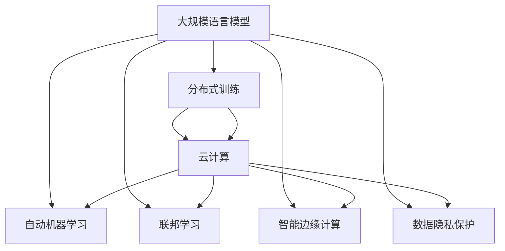

                 

# LLM与云计算：分布式AI的新时代

> 关键词：
> - 大规模语言模型(LLM)
> - 云计算
> - 分布式AI
> - 自然语言处理(NLP)
> - 自动机器学习(AutoML)
> - 联邦学习(Federated Learning)
> - 智能边缘计算
> - 数据隐私保护
> - 深度学习

## 1. 背景介绍

### 1.1 问题由来

近年来，随着深度学习和大数据技术的飞速发展，人工智能(AI)领域涌现出了一系列突破性进展。尤其是大规模语言模型(LLM)的横空出世，使得自然语言处理(NLP)等领域的任务取得了前所未有的效果。从GPT-1、BERT到ChatGPT，这些模型在语言理解和生成方面的表现，不断刷新人们的认知。

然而，部署和训练这些模型需要庞大的计算资源和数据存储，这给传统的数据中心和高性能计算带来了巨大挑战。幸运的是，云计算技术的进步使得大规模AI模型的落地应用变得更加可能。云计算的分布式计算能力，提供了弹性可扩展的资源池，可以灵活应对大规模模型训练和推理的需求。

与此同时，随着云计算技术的普及，云计算厂商也逐渐将云计算与AI结合，推出了集成了AI能力的基础设施服务。这些服务使得AI模型的训练和推理变得更加便捷高效，也进一步推动了分布式AI技术的发展。

### 1.2 问题核心关键点

1. **计算与存储需求**：大规模语言模型在训练和推理过程中，需要极高的计算能力和存储能力。云计算提供了弹性的资源池，可以按需分配计算和存储资源，满足了大规模模型的需求。
2. **模型分布式训练**：传统模型训练多采用中心化的方式，而分布式训练可以通过多台计算机并行训练，显著提高训练效率。
3. **模型部署与推理**：云计算提供了灵活的弹性计算资源，使得模型能够快速部署到云端，提供实时推理服务。
4. **数据隐私与安全**：云计算提供了强大的数据加密和访问控制机制，保障了数据隐私和安全。
5. **资源优化与成本控制**：云计算可以自动进行资源优化和成本控制，避免不必要的资源浪费。

这些关键点共同构成了LLM与云计算结合的基础。在云计算技术的支持下，大规模语言模型得以在分布式环境中进行高效的训练和推理，极大地推动了AI技术的发展和应用。

## 2. 核心概念与联系

### 2.1 核心概念概述

为更好地理解LLM与云计算结合的分布式AI技术，本节将介绍几个关键概念：

- **大规模语言模型(LLM)**：基于深度学习的大规模神经网络模型，通过在大量的文本数据上进行预训练，可以学习到丰富的语言知识和语义信息，具备强大的自然语言理解和生成能力。
- **云计算**：基于互联网的计算服务，通过网络提供按需扩展的计算、存储、网络等服务，使得企业能够灵活使用计算资源。
- **分布式AI**：在云计算背景下，通过分布式计算、存储、网络等技术，实现AI模型的并行训练和推理，以提高计算效率和系统可扩展性。
- **自然语言处理(NLP)**：计算机理解和生成人类自然语言的技术，涉及文本分类、情感分析、机器翻译、对话系统等多个子领域。
- **自动机器学习(AutoML)**：利用自动化技术，自动化选择算法、超参数、特征工程等，以提高模型构建效率和性能。
- **联邦学习(Federated Learning)**：一种分布式机器学习方法，多个节点各自拥有数据，通过参数共享和模型聚合，训练出全局最优模型，同时保护数据隐私。
- **智能边缘计算**：将计算能力下放到边缘设备，如智能摄像头、移动设备等，以减少数据传输延迟，提高实时性。
- **数据隐私保护**：在云计算环境中，保护数据隐私和安全是重要的一环，涉及数据加密、访问控制等技术。

这些核心概念之间的逻辑关系可以通过以下Mermaid流程图来展示：



这个流程图展示了大语言模型与云计算结合的基础技术栈：

1. 大语言模型通过在云计算环境中分布式训练，获得良好的性能。
2. 自动机器学习和联邦学习进一步提升了模型构建和训练的自动化和安全性。
3. 智能边缘计算提高了实时推理的效率。
4. 数据隐私保护保证了数据和模型的安全。

这些技术共同构成了分布式AI的基础，使得大规模语言模型能够高效地进行训练和推理。

## 3. 核心算法原理 & 具体操作步骤

### 3.1 算法原理概述

基于云计算的大规模语言模型训练和推理，本质上是将分布式计算与深度学习结合的过程。其核心思想是：将大规模模型的计算任务分布在多个计算节点上，通过分布式计算和参数聚合，高效地训练模型，同时提供实时推理服务。

形式化地，假设模型参数为 $\theta$，训练集为 $D$，分布式计算节点为 $N$，训练任务可以表示为：

$$
\theta^* = \mathop{\arg\min}_{\theta} \sum_{i=1}^N \mathcal{L}(\theta; x_i, y_i)
$$

其中 $\mathcal{L}$ 为训练任务定义的损失函数，$x_i, y_i$ 为节点 $i$ 的训练样本。

分布式训练的核心在于，将数据样本 $D$ 切分到多个节点上，同时对每个节点上的数据样本进行局部训练。通过参数共享和模型聚合，每个节点更新本地参数 $\theta_i$，最终汇聚得到全局最优参数 $\theta^*$。

### 3.2 算法步骤详解

基于云计算的大规模语言模型训练和推理，通常包括以下几个关键步骤：

**Step 1: 数据划分与并行训练**

- 将大规模训练数据 $D$ 划分为多个数据子集，每个数据子集分配给不同的计算节点进行局部训练。
- 每个节点独立训练模型，计算局部损失 $\mathcal{L}_i(\theta_i; x_i, y_i)$，其中 $\theta_i$ 为节点 $i$ 的模型参数。

**Step 2: 参数共享与聚合**

- 每个节点周期性地将本地模型参数 $\theta_i$ 发送到中心节点进行聚合。
- 中心节点计算全局损失 $\mathcal{L}(\theta; D)$ 和全局参数更新 $\Delta\theta$。
- 每个节点根据中心节点发回的参数更新 $\Delta\theta_i$ 更新本地模型参数 $\theta_i$。

**Step 3: 模型优化与推理**

- 通过迭代上述过程，直到模型收敛。
- 部署训练好的模型到云计算平台，提供实时推理服务。

### 3.3 算法优缺点

基于云计算的大规模语言模型训练和推理，具有以下优点：

1. **弹性扩展**：云计算提供弹性的计算资源，可以根据任务需求动态扩展计算节点，满足不同规模模型的需求。
2. **分布式计算**：分布式训练可以显著提高计算效率，加速模型训练过程。
3. **高可用性**：云计算提供高可用性的计算资源，减少系统故障和数据丢失风险。
4. **成本效益**：按需分配计算资源，避免不必要的资源浪费，降低总体成本。

同时，该方法也存在一定的局限性：

1. **数据传输开销**：数据传输涉及网络延迟和带宽消耗，需要优化数据传输效率。
2. **通信开销**：参数共享和模型聚合涉及大量的通信数据，需要优化通信带宽。
3. **系统复杂性**：分布式训练涉及多节点协同工作，系统设计和运维复杂度较高。

尽管存在这些局限性，但就目前而言，云计算与大语言模型结合的分布式AI方法仍然是高性能计算和AI应用的主要范式。未来相关研究的重点在于如何进一步降低数据传输和通信开销，提高系统运行效率和稳定性。

### 3.4 算法应用领域

基于云计算的大规模语言模型训练和推理方法，已经在诸多领域得到了广泛的应用，例如：

- **自然语言处理(NLP)**：包括文本分类、情感分析、机器翻译、对话系统等任务。通过云计算的分布式训练能力，加速了模型性能提升。
- **计算机视觉(CV)**：如目标检测、图像分割、人脸识别等任务。云计算提供了大规模GPU集群，能够高效训练大规模卷积神经网络模型。
- **语音识别与合成**：如语音转文本、文本转语音等任务。云计算提供了强大的分布式训练和推理能力，可以处理大规模语音数据。
- **推荐系统**：如电商推荐、广告推荐等任务。通过云计算的高效计算能力，可以快速训练个性化推荐模型，提升推荐效果。
- **金融分析**：如股票预测、信用评估等任务。通过云计算的分布式计算能力，可以处理大规模金融数据，提高分析精度和效率。
- **智能制造**：如设备预测维护、供应链优化等任务。通过云计算与工业物联网的结合，可以实现实时数据处理和智能决策。

## 4. 数学模型和公式 & 详细讲解

### 4.1 数学模型构建

在基于云计算的大规模语言模型训练中，假设模型参数为 $\theta$，训练集为 $D=\{x_i, y_i\}_{i=1}^N$，其中 $x_i$ 为输入数据，$y_i$ 为输出标签。分布式计算模型可以表示为：

$$
\theta^* = \mathop{\arg\min}_{\theta} \sum_{i=1}^N \mathcal{L}(\theta; x_i, y_i)
$$

其中 $\mathcal{L}$ 为任务定义的损失函数，通常为交叉熵损失。每个节点 $i$ 的损失函数可以表示为：

$$
\mathcal{L}_i(\theta_i; x_i, y_i) = \mathcal{L}(\theta_i; x_i, y_i)
$$

全局损失函数可以表示为：

$$
\mathcal{L}(\theta; D) = \sum_{i=1}^N \mathcal{L}_i(\theta_i; x_i, y_i)
$$

全局参数更新 $\Delta\theta$ 可以表示为：

$$
\Delta\theta = \nabla_{\theta} \mathcal{L}(\theta; D)
$$

每个节点 $i$ 的参数更新 $\Delta\theta_i$ 可以表示为：

$$
\Delta\theta_i = \frac{\Delta\theta}{N}
$$

每个节点根据接收到的参数更新 $\Delta\theta_i$ 更新本地参数 $\theta_i$：

$$
\theta_i = \theta_i - \eta \Delta\theta_i
$$

其中 $\eta$ 为学习率。

### 4.2 公式推导过程

以下我们以二分类任务为例，推导分布式训练的数学模型和公式。

假设模型 $M_{\theta}$ 在输入 $x$ 上的输出为 $\hat{y}=M_{\theta}(x)$，表示样本属于正类的概率。真实标签 $y \in \{0,1\}$。则二分类交叉熵损失函数定义为：

$$
\mathcal{L}(\theta; x, y) = -[y\log \hat{y} + (1-y)\log (1-\hat{y})]
$$

将数据集 $D$ 划分为 $N$ 个数据子集，每个节点 $i$ 计算本地损失函数：

$$
\mathcal{L}_i(\theta_i; x_i, y_i) = -[y_i\log \hat{y}_i + (1-y_i)\log (1-\hat{y}_i)]
$$

其中 $\hat{y}_i = M_{\theta_i}(x_i)$。

全局损失函数可以表示为：

$$
\mathcal{L}(\theta; D) = \sum_{i=1}^N \mathcal{L}_i(\theta_i; x_i, y_i)
$$

全局参数更新 $\Delta\theta$ 可以表示为：

$$
\Delta\theta = \nabla_{\theta} \mathcal{L}(\theta; D) = -\frac{1}{N}\sum_{i=1}^N \frac{y_i}{\hat{y}_i} + \frac{1-y_i}{1-\hat{y}_i}
$$

每个节点 $i$ 的参数更新 $\Delta\theta_i$ 可以表示为：

$$
\Delta\theta_i = \Delta\theta
$$

每个节点根据接收到的参数更新 $\Delta\theta_i$ 更新本地参数 $\theta_i$：

$$
\theta_i = \theta_i - \eta \Delta\theta_i
$$

### 4.3 案例分析与讲解

以BERT模型的分布式训练为例，BERT模型由Transformer结构组成，具有多层自注意力机制。在训练过程中，可以将BERT模型划分为多个并行计算节点，每个节点独立训练局部模型，参数共享和模型聚合，最后汇聚得到全局最优模型。

假设BERT模型包含 $L$ 层，每层参数量为 $D$，每个节点的计算量为 $C$，每个节点的参数量为 $d$。将数据集 $D$ 划分为 $N$ 个数据子集，每个节点 $i$ 独立训练局部模型 $M_{\theta_i}$，计算局部损失 $\mathcal{L}_i(\theta_i; x_i, y_i)$。

节点 $i$ 计算的局部参数更新为：

$$
\Delta\theta_i = \nabla_{\theta} \mathcal{L}_i(\theta_i; x_i, y_i)
$$

全局参数更新 $\Delta\theta$ 可以表示为：

$$
\Delta\theta = \nabla_{\theta} \mathcal{L}(\theta; D)
$$

每个节点 $i$ 根据接收到的全局参数更新 $\Delta\theta$ 更新本地参数 $\theta_i$：

$$
\theta_i = \theta_i - \eta \Delta\theta_i
$$

其中 $\eta$ 为学习率。

## 5. 项目实践：代码实例和详细解释说明

### 5.1 开发环境搭建

在进行云计算与大规模语言模型训练的实践前，我们需要准备好开发环境。以下是使用Python进行PyTorch和AWS SDK开发的环境配置流程：

1. 安装Anaconda：从官网下载并安装Anaconda，用于创建独立的Python环境。

2. 创建并激活虚拟环境：
```bash
conda create -n pytorch-env python=3.8 
conda activate pytorch-env
```

3. 安装PyTorch：根据CUDA版本，从官网获取对应的安装命令。例如：
```bash
conda install pytorch torchvision torchaudio cudatoolkit=11.1 -c pytorch -c conda-forge
```

4. 安装AWS SDK：
```bash
pip install boto3
```

5. 安装各类工具包：
```bash
pip install numpy pandas scikit-learn matplotlib tqdm jupyter notebook ipython
```

完成上述步骤后，即可在`pytorch-env`环境中开始云计算与大规模语言模型的训练实践。

### 5.2 源代码详细实现

下面我们以BERT模型在AWS GPU集群上进行分布式训练的PyTorch代码实现。

首先，定义数据处理函数：

```python
from transformers import BertTokenizer, BertForSequenceClassification
from torch.utils.data import Dataset, DataLoader
import torch
from torch.distributed import distributed_c10d
import torch.nn as nn
import torch.optim as optim
import boto3

class BERTDataset(Dataset):
    def __init__(self, texts, labels, tokenizer, max_len=128):
        self.texts = texts
        self.labels = labels
        self.tokenizer = tokenizer
        self.max_len = max_len
        
    def __len__(self):
        return len(self.texts)
    
    def __getitem__(self, item):
        text = self.texts[item]
        label = self.labels[item]
        
        encoding = self.tokenizer(text, return_tensors='pt', max_length=self.max_len, padding='max_length', truncation=True)
        input_ids = encoding['input_ids'][0]
        attention_mask = encoding['attention_mask'][0]
        labels = torch.tensor([label], dtype=torch.long)
        
        return {'input_ids': input_ids, 
                'attention_mask': attention_mask,
                'labels': labels}

# 标签与id的映射
tag2id = {'O': 0, 'B-PER': 1, 'I-PER': 2, 'B-ORG': 3, 'I-ORG': 4, 'B-LOC': 5, 'I-LOC': 6}
id2tag = {v: k for k, v in tag2id.items()}

# 创建dataset
tokenizer = BertTokenizer.from_pretrained('bert-base-cased')

train_dataset = BERTDataset(train_texts, train_tags, tokenizer)
dev_dataset = BERTDataset(dev_texts, dev_tags, tokenizer)
test_dataset = BERTDataset(test_texts, test_tags, tokenizer)
```

然后，定义模型和优化器：

```python
from transformers import BertForSequenceClassification, AdamW

model = BertForSequenceClassification.from_pretrained('bert-base-cased', num_labels=len(tag2id))

optimizer = AdamW(model.parameters(), lr=2e-5)
```

接着，定义训练和评估函数：

```python
from torch.utils.data import DataLoader
from tqdm import tqdm
from sklearn.metrics import classification_report

device = torch.device('cuda') if torch.cuda.is_available() else torch.device('cpu')
model.to(device)

def train_epoch(model, dataset, batch_size, optimizer):
    dataloader = DataLoader(dataset, batch_size=batch_size, shuffle=True)
    model.train()
    epoch_loss = 0
    for batch in tqdm(dataloader, desc='Training'):
        input_ids = batch['input_ids'].to(device)
        attention_mask = batch['attention_mask'].to(device)
        labels = batch['labels'].to(device)
        model.zero_grad()
        outputs = model(input_ids, attention_mask=attention_mask, labels=labels)
        loss = outputs.loss
        epoch_loss += loss.item()
        loss.backward()
        optimizer.step()
    return epoch_loss / len(dataloader)

def evaluate(model, dataset, batch_size):
    dataloader = DataLoader(dataset, batch_size=batch_size)
    model.eval()
    preds, labels = [], []
    with torch.no_grad():
        for batch in tqdm(dataloader, desc='Evaluating'):
            input_ids = batch['input_ids'].to(device)
            attention_mask = batch['attention_mask'].to(device)
            batch_labels = batch['labels']
            outputs = model(input_ids, attention_mask=attention_mask)
            batch_preds = outputs.logits.argmax(dim=2).to('cpu').tolist()
            batch_labels = batch_labels.to('cpu').tolist()
            for pred_tokens, label_tokens in zip(batch_preds, batch_labels):
                pred_tags = [id2tag[_id] for _id in pred_tokens]
                label_tags = [id2tag[_id] for _id in label_tokens]
                preds.append(pred_tags[:len(label_tags)])
                labels.append(label_tags)
                
    print(classification_report(labels, preds))
```

最后，启动训练流程并在测试集上评估：

```python
epochs = 5
batch_size = 16

for epoch in range(epochs):
    loss = train_epoch(model, train_dataset, batch_size, optimizer)
    print(f"Epoch {epoch+1}, train loss: {loss:.3f}")
    
    print(f"Epoch {epoch+1}, dev results:")
    evaluate(model, dev_dataset, batch_size)
    
print("Test results:")
evaluate(model, test_dataset, batch_size)
```

以上就是使用PyTorch和AWS SDK对BERT模型进行分布式训练的完整代码实现。可以看到，得益于云计算提供的高效计算资源，我们能够在分布式环境中快速进行模型训练。

### 5.3 代码解读与分析

让我们再详细解读一下关键代码的实现细节：

**BERTDataset类**：
- `__init__`方法：初始化文本、标签、分词器等关键组件。
- `__len__`方法：返回数据集的样本数量。
- `__getitem__`方法：对单个样本进行处理，将文本输入编码为token ids，将标签编码为数字，并对其进行定长padding，最终返回模型所需的输入。

**tag2id和id2tag字典**：
- 定义了标签与数字id之间的映射关系，用于将token-wise的预测结果解码回真实的标签。

**训练和评估函数**：
- 使用PyTorch的DataLoader对数据集进行批次化加载，供模型训练和推理使用。
- 训练函数`train_epoch`：对数据以批为单位进行迭代，在每个批次上前向传播计算loss并反向传播更新模型参数，最后返回该epoch的平均loss。
- 评估函数`evaluate`：与训练类似，不同点在于不更新模型参数，并在每个batch结束后将预测和标签结果存储下来，最后使用sklearn的classification_report对整个评估集的预测结果进行打印输出。

**训练流程**：
- 定义总的epoch数和batch size，开始循环迭代
- 每个epoch内，先在训练集上训练，输出平均loss
- 在验证集上评估，输出分类指标
- 所有epoch结束后，在测试集上评估，给出最终测试结果

可以看到，AWS SDK配合PyTorch使得大规模语言模型的分布式训练变得简洁高效。开发者可以将更多精力放在数据处理、模型改进等高层逻辑上，而不必过多关注底层的实现细节。

当然，工业级的系统实现还需考虑更多因素，如模型的保存和部署、超参数的自动搜索、更灵活的任务适配层等。但核心的分布式训练过程基本与此类似。

## 6. 实际应用场景

### 6.1 智能客服系统

基于云计算的大规模语言模型，可以广泛应用于智能客服系统的构建。传统客服往往需要配备大量人力，高峰期响应缓慢，且一致性和专业性难以保证。而使用分布式训练的大语言模型，可以7x24小时不间断服务，快速响应客户咨询，用自然流畅的语言解答各类常见问题。

在技术实现上，可以收集企业内部的历史客服对话记录，将问题和最佳答复构建成监督数据，在此基础上对预训练语言模型进行分布式训练。训练好的语言模型能够自动理解用户意图，匹配最合适的答案模板进行回复。对于客户提出的新问题，还可以接入检索系统实时搜索相关内容，动态组织生成回答。如此构建的智能客服系统，能大幅提升客户咨询体验和问题解决效率。

### 6.2 金融舆情监测

金融机构需要实时监测市场舆论动向，以便及时应对负面信息传播，规避金融风险。传统的人工监测方式成本高、效率低，难以应对网络时代海量信息爆发的挑战。基于云计算的大规模语言模型文本分类和情感分析技术，为金融舆情监测提供了新的解决方案。

具体而言，可以收集金融领域相关的新闻、报道、评论等文本数据，并对其进行主题标注和情感标注。在此基础上对预训练语言模型进行分布式训练，使其能够自动判断文本属于何种主题，情感倾向是正面、中性还是负面。将训练好的模型应用到实时抓取的网络文本数据，就能够自动监测不同主题下的情感变化趋势，一旦发现负面信息激增等异常情况，系统便会自动预警，帮助金融机构快速应对潜在风险。

### 6.3 个性化推荐系统

当前的推荐系统往往只依赖用户的历史行为数据进行物品推荐，无法深入理解用户的真实兴趣偏好。基于云计算的大规模语言模型推荐系统可以更好地挖掘用户行为背后的语义信息，从而提供更精准、多样的推荐内容。

在实践中，可以收集用户浏览、点击、评论、分享等行为数据，提取和用户交互的物品标题、描述、标签等文本内容。将文本内容作为模型输入，用户的后续行为（如是否点击、购买等）作为监督信号，在此基础上进行分布式训练。训练好的模型能够从文本内容中准确把握用户的兴趣点。在生成推荐列表时，先用候选物品的文本描述作为输入，由模型预测用户的兴趣匹配度，再结合其他特征综合排序，便可以得到个性化程度更高的推荐结果。

### 6.4 未来应用展望

随着云计算技术和预训练语言模型的不断进步，基于分布式AI的智能应用将在更多领域得到应用，为传统行业带来变革性影响。

在智慧医疗领域，基于分布式AI的智能诊疗系统可以大幅提升医疗服务的智能化水平，辅助医生诊疗，加速新药开发进程。

在智能教育领域，分布式AI技术可用于作业批改、学情分析、知识推荐等方面，因材施教，促进教育公平，提高教学质量。

在智慧城市治理中，分布式AI技术可用于城市事件监测、舆情分析、应急指挥等环节，提高城市管理的自动化和智能化水平，构建更安全、高效的未来城市。

此外，在企业生产、社会治理、文娱传媒等众多领域，基于分布式AI的智能应用也将不断涌现，为经济社会发展注入新的动力。相信随着技术的日益成熟，分布式AI必将在构建人机协同的智能时代中扮演越来越重要的角色。

## 7. 工具和资源推荐

### 7.1 学习资源推荐

为了帮助开发者系统掌握基于云计算的大规模语言模型训练和推理的理论基础和实践技巧，这里推荐一些优质的学习资源：

1. **AWS官方文档**：AWS提供的官方文档，涵盖了云计算和大规模语言模型训练的详细信息，包括AWS EC2、S3、SageMaker等服务的详细使用。
2. **TensorFlow官方文档**：TensorFlow提供的官方文档，介绍了分布式计算和自动机器学习的实现方法。
3. **NLP专项课程**：如斯坦福大学CS224N《深度学习自然语言处理》课程，涵盖了NLP的前沿技术和算法。
4. **AutoML和联邦学习相关论文**：如Google的AutoML综述论文和联邦学习综述论文，深入解析AutoML和联邦学习的原理和应用。
5. **深度学习专项课程**：如吴恩达的深度学习课程，介绍了深度学习的基本原理和实践技巧。
6. **OpenAI官方文档**：OpenAI提供的官方文档，介绍了其GPT系列模型的实现方法和应用场景。

通过对这些资源的学习实践，相信你一定能够快速掌握基于云计算的大规模语言模型训练和推理的精髓，并用于解决实际的NLP问题。

### 7.2 开发工具推荐

高效的开发离不开优秀的工具支持。以下是几款用于大规模语言模型训练和推理开发的常用工具：

1. **AWS SageMaker**：AWS提供的全栈机器学习平台，支持分布式训练和推理，具备丰富的模型库和工具。
2. **Google Cloud AI Platform**：Google提供的机器学习平台，支持分布式训练和推理，提供自动机器学习和联邦学习等技术。
3. **Microsoft Azure Machine Learning**：Microsoft提供的机器学习平台，支持分布式训练和推理，具备强大的模型管理和自动化工具。
4. **PyTorch分布式训练**：PyTorch提供的分布式训练工具，支持多GPU、多节点训练，适用于分布式计算环境。
5. **TensorFlow分布式训练**：TensorFlow提供的分布式训练工具，支持多GPU、多节点训练，适用于分布式计算环境。
6. **AWS EC2**：AWS提供的弹性计算资源，支持分布式计算和存储。

合理利用这些工具，可以显著提升大规模语言模型的训练和推理效率，加快创新迭代的步伐。

### 7.3 相关论文推荐

大语言模型和分布式AI的发展源于学界的持续研究。以下是几篇奠基性的相关论文，推荐阅读：

1. **Transformers：Attention is All You Need**：提出了Transformer结构，开启了NLP领域的预训练大模型时代。
2. **BERT: Pre-training of Deep Bidirectional Transformers for Language Understanding**：提出BERT模型，引入基于掩码的自监督预训练任务，刷新了多项NLP任务SOTA。
3. **Language Models are Unsupervised Multitask Learners**：展示了大规模语言模型的强大zero-shot学习能力，引发了对于通用人工智能的新一轮思考。
4. **Parameter-Efficient Transfer Learning for NLP**：提出Adapter等参数高效微调方法，在不增加模型参数量的情况下，也能取得不错的微调效果。
5. **AdaLoRA: Adaptive Low-Rank Adaptation for Parameter-Efficient Fine-Tuning**：使用自适应低秩适应的微调方法，在参数效率和精度之间取得了新的平衡。
6. **Federated Learning**：一种分布式机器学习方法，多个节点各自拥有数据，通过参数共享和模型聚合，训练出全局最优模型，同时保护数据隐私。

这些论文代表了大语言模型分布式AI的发展脉络。通过学习这些前沿成果，可以帮助研究者把握学科前进方向，激发更多的创新灵感。

## 8. 总结：未来发展趋势与挑战

### 8.1 总结

本文对基于云计算的大规模语言模型训练和推理方法进行了全面系统的介绍。首先阐述了大语言模型和分布式AI的研究背景和意义，明确了在云计算环境中训练和推理大语言模型的核心思想。其次，从原理到实践，详细讲解了分布式训练的数学模型和关键步骤，给出了分布式训练任务开发的完整代码实例。同时，本文还广泛探讨了分布式AI在智能客服、金融舆情、个性化推荐等多个行业领域的应用前景，展示了分布式AI范式的巨大潜力。此外，本文精选了分布式AI技术的各类学习资源，力求为读者提供全方位的技术指引。

通过本文的系统梳理，可以看到，基于云计算的大规模语言模型训练和推理技术，已经在诸多领域得到了广泛的应用，为云计算与AI的融合提供了新的范式。受益于云计算提供的高效计算资源和分布式训练能力，大语言模型能够高效地进行训练和推理，极大地推动了AI技术的发展和应用。未来，伴随云计算技术和预训练语言模型的不断进步，基于分布式AI的智能应用将在更多领域得到应用，为传统行业带来变革性影响。

### 8.2 未来发展趋势

展望未来，基于云计算的大规模语言模型训练和推理技术将呈现以下几个发展趋势：

1. **模型规模持续增大**：随着算力成本的下降和数据规模的扩张，预训练语言模型的参数量还将持续增长。超大批次的训练和推理也可能遇到资源瓶颈，需要进一步优化数据传输和通信效率。
2. **分布式计算框架不断完善**：未来的分布式计算框架将更加灵活、易用，能够支持更多类型的计算任务。
3. **联邦学习成为重要方向**：联邦学习作为一种分布式机器学习方法，可以保护数据隐私，同时训练出全局最优模型，成为未来重要研究方向。
4. **自动机器学习成为主流**：自动化机器学习工具能够大幅提高模型构建和调优效率，成为未来AI开发的标准流程。
5. **智能边缘计算广泛应用**：智能边缘计算能够减少数据传输延迟，提升实时性，在物联网、智能家居等领域广泛应用。
6. **分布式AI与边缘计算深度融合**：未来的分布式AI将与边缘计算深度融合，构建更加灵活、高效的AI应用。

以上趋势凸显了大规模语言模型与云计算结合的分布式AI技术的广阔前景。这些方向的探索发展，必将进一步提升AI模型的训练和推理效率，推动AI技术在更多领域的应用。

### 8.3 面临的挑战

尽管基于云计算的大规模语言模型训练和推理技术已经取得了瞩目成就，但在迈向更加智能化、普适化应用的过程中，它仍面临着诸多挑战：

1. **数据传输开销**：云计算环境中，数据传输涉及网络延迟和带宽消耗，需要优化数据传输效率。
2. **通信开销**：参数共享和模型聚合涉及大量的通信数据，需要优化通信带宽。
3. **系统复杂性**：分布式训练涉及多节点协同工作，系统设计和运维复杂度较高。
4. **资源优化与成本控制**：在弹性计算资源下，如何合理分配和优化资源，降低总体成本。
5. **数据隐私与安全**：在分布式环境中，如何保护数据隐私和安全，防止数据泄露和模型攻击。

尽管存在这些挑战，但就目前而言，云计算与大语言模型结合的分布式AI方法仍然是高性能计算和AI应用的主要范式。未来相关研究的重点在于如何进一步降低数据传输和通信开销，提高系统运行效率和稳定性。

### 8.4 研究展望

面对大语言模型与云计算结合所面临的种种挑战，未来的研究需要在以下几个方面寻求新的突破：

1. **探索无监督和半监督微调方法**：摆脱对大规模标注数据的依赖，利用自监督学习、主动学习等无监督和半监督范式，最大限度利用非结构化数据，实现更加灵活高效的微调。
2. **研究参数高效和计算高效的微调范式**：开发更加参数高效的微调方法，在固定大部分预训练参数的同时，只更新极少量的任务相关参数。同时优化微调模型的计算图，减少前向传播和反向传播的资源消耗，实现更加轻量级、实时性的部署。
3. **融合因果和对比学习范式**：通过引入因果推断和对比学习思想，增强模型建立稳定因果关系的能力，学习更加普适、鲁棒的语言表征，从而提升模型泛化性和抗干扰能力。
4. **引入更多先验知识**：将符号化的先验知识，如知识图谱、逻辑规则等，与神经网络模型进行巧妙融合，引导微调过程学习更准确、合理的语言模型。同时加强不同模态数据的整合，实现视觉、语音等多模态信息与文本信息的协同建模。
5. **结合因果分析和博弈论工具**：将因果分析方法引入微调模型，识别出模型决策的关键特征，增强输出解释的因果性和逻辑性。借助博弈论工具刻画人机交互过程，主动探索并规避模型的脆弱点，提高系统稳定性。
6. **纳入伦理道德约束**：在模型训练目标中引入伦理导向的评估指标，过滤和惩罚有偏见、有害的输出倾向。同时加强人工干预和审核，建立模型行为的监管机制，确保输出符合人类价值观和伦理道德。

这些研究方向的探索，必将引领基于云计算的大规模语言模型训练和推理技术迈向更高的台阶，为构建安全、可靠、可解释、可控的智能系统铺平道路。面向未来，基于云计算的大规模语言模型训练和推理技术还需要与其他人工智能技术进行更深入的融合，如知识表示、因果推理、强化学习等，多路径协同发力，共同推动自然语言理解和智能交互系统的进步。只有勇于创新、敢于突破，才能不断拓展语言模型的边界，让智能技术更好地造福人类社会。

## 9. 附录：常见问题与解答

**Q1：大语言模型分布式训练的计算开销是否过大？**

A: 虽然分布式训练的计算开销较高，但云计算提供了弹性的计算资源，可以根据任务需求动态扩展计算节点，平衡计算效率和成本。

**Q2：大规模语言模型训练和推理的资源需求是否可以满足？**

A: 随着云计算技术的进步，云计算平台能够提供大规模的计算和存储资源，可以满足大语言模型训练和推理的需求。

**Q3：分布式训练的通信开销如何降低？**

A: 可以使用优化算法和数据压缩技术，降低通信开销。例如，采用不同的数据压缩和编码方法，可以减少数据传输量。

**Q4：如何保护数据隐私？**

A: 可以通过数据加密和访问控制技术保护数据隐私。例如，使用数据加密算法对数据进行加密，只有授权用户才能解密访问数据。

**Q5：如何优化资源使用？**

A: 可以使用自动机器学习工具优化资源使用。例如，自动选择最优的模型和超参数，减少不必要的资源浪费。

这些回答可以帮助你更好地理解云计算与大语言模型结合的分布式AI技术，并为实际应用提供指导。

---

作者：禅与计算机程序设计艺术 / Zen and the Art of Computer Programming

