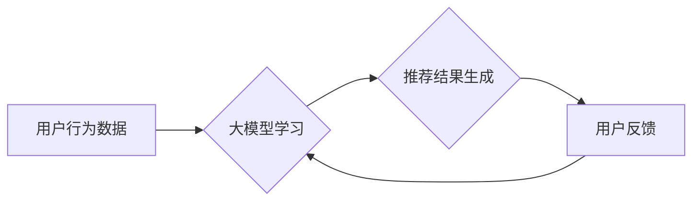

                 

## 大模型推荐中的推荐多样性与用户满意度权衡

> 关键词：大模型推荐、推荐多样性、用户满意度、个性化推荐、冷启动问题、推荐算法

## 1. 背景介绍

随着大规模语言模型（LLM）的快速发展，它们在推荐系统领域展现出巨大的潜力。大模型能够学习用户偏好、物品特征以及交互关系的复杂模式，从而提供更精准、更个性化的推荐。然而，在追求个性化推荐的同时，如何兼顾推荐多样性，避免推荐结果过于单一，成为一个亟待解决的关键问题。

推荐多样性是指推荐结果在内容、风格、类别等方面呈现多样性的程度。多样性高的推荐能够满足用户探索新内容的渴望，提升用户体验，并促进平台内容的丰富和更新。然而，传统的基于协同过滤或内容过滤的推荐算法往往倾向于推荐用户已喜欢的类型，导致推荐结果缺乏多样性。

用户满意度是衡量推荐系统效果的重要指标。用户满意度不仅取决于推荐结果的准确性，还与推荐结果的多样性、新颖性、相关性等因素密切相关。当推荐结果过于单一，用户可能会感到乏味和失望，从而降低用户满意度。

因此，在实际应用中，需要权衡推荐多样性和用户满意度之间的关系，找到一个平衡点，才能构建出真正有效的推荐系统。

## 2. 核心概念与联系

### 2.1 推荐多样性

推荐多样性是指推荐结果在内容、风格、类别等方面呈现多样性的程度。多样性高的推荐能够满足用户探索新内容的渴望，提升用户体验，并促进平台内容的丰富和更新。

### 2.2 用户满意度

用户满意度是衡量推荐系统效果的重要指标。用户满意度不仅取决于推荐结果的准确性，还与推荐结果的多样性、新颖性、相关性等因素密切相关。

### 2.3 权衡关系

推荐多样性和用户满意度之间存在着相互影响的关系。

* **多样性过高会导致用户满意度降低:** 当推荐结果过于分散，缺乏关联性，用户可能会感到困惑和失望。
* **多样性过低会导致用户体验单一:** 当推荐结果过于单一，用户可能会感到乏味和缺乏新鲜感。

因此，需要找到一个平衡点，既要保证推荐结果的多样性，又要满足用户的个性化需求。

**Mermaid 流程图**



## 3. 核心算法原理 & 具体操作步骤

### 3.1 算法原理概述

为了兼顾推荐多样性和用户满意度，可以采用以下几种核心算法原理：

* **基于多样性的推荐算法:** 这些算法在推荐结果生成过程中，会 explicitly 考虑多样性指标，例如推荐结果的类别分布、主题分布、风格分布等。
* **基于用户的兴趣探索算法:** 这些算法会根据用户的历史行为和偏好，推荐一些与用户已知兴趣相关的，但又有一定的差异性的内容，以满足用户的探索需求。
* **基于对抗学习的推荐算法:** 这些算法会将多样性作为对抗目标，通过训练一个对抗网络，来生成多样性高的推荐结果。

### 3.2 算法步骤详解

以基于多样性的推荐算法为例，其具体操作步骤如下：

1. **数据预处理:** 收集用户行为数据、物品特征数据等，并进行清洗、转换、编码等预处理操作。
2. **模型训练:** 使用大模型训练一个推荐模型，该模型能够学习用户偏好、物品特征以及交互关系的复杂模式。
3. **多样性度量:** 定义一个多样性度量指标，例如推荐结果的类别分布熵、主题分布均匀度等。
4. **多样性优化:** 在推荐结果生成过程中，使用多样性度量指标作为优化目标，通过调整模型参数或推荐策略，来生成多样性高的推荐结果。
5. **用户反馈收集:** 收集用户的反馈信息，例如点击、评分、评论等，并将其反馈到模型训练过程中，以不断优化推荐效果。

### 3.3 算法优缺点

**优点:**

* 可以生成多样性高的推荐结果，满足用户的探索需求。
* 可以提升用户体验和满意度。

**缺点:**

* 需要定义和计算多样性度量指标，这有一定的难度。
* 需要在推荐多样性和准确性之间进行权衡，找到一个平衡点。

### 3.4 算法应用领域

基于多样性的推荐算法可以应用于各种场景，例如：

* **电商推荐:** 推荐多样化的商品，满足用户的不同需求。
* **音乐推荐:** 推荐多样化的音乐风格，帮助用户发现新的音乐。
* **新闻推荐:** 推荐多样化的新闻主题，提供更全面的信息。

## 4. 数学模型和公式 & 详细讲解 & 举例说明

### 4.1 数学模型构建

假设我们有一个推荐系统，包含 $N$ 个用户和 $M$ 个物品。用户 $u$ 对物品 $i$ 的评分为 $r_{ui}$。我们希望构建一个数学模型，来预测用户 $u$ 对物品 $i$ 的评分，并同时考虑推荐多样性。

我们可以使用以下公式来构建数学模型：

$$
\hat{r}_{ui} = \alpha \cdot f(u, i) + \beta \cdot D(u, i)
$$

其中：

* $\hat{r}_{ui}$ 是模型预测的用户 $u$ 对物品 $i$ 的评分。
* $f(u, i)$ 是一个基于用户和物品特征的评分函数，例如协同过滤或内容过滤模型。
* $D(u, i)$ 是一个多样性度量函数，例如推荐结果的类别分布熵。
* $\alpha$ 和 $\beta$ 是两个权重参数，用于控制评分函数和多样性度量函数的相对重要性。

### 4.2 公式推导过程

为了优化模型性能，我们需要选择合适的评分函数、多样性度量函数和权重参数。

* **评分函数:** 常见的评分函数包括协同过滤模型、内容过滤模型、深度学习模型等。

* **多样性度量函数:** 常见的多样性度量函数包括类别分布熵、主题分布均匀度、风格分布多样性等。

* **权重参数:** 可以通过交叉验证等方法来选择合适的权重参数。

### 4.3 案例分析与讲解

假设我们有一个电商推荐系统，需要推荐用户喜欢的商品。我们可以使用以下方法来构建推荐模型：

1. **评分函数:** 使用协同过滤模型来预测用户对商品的评分。
2. **多样性度量函数:** 使用类别分布熵来衡量推荐结果的多样性。
3. **权重参数:** 通过交叉验证，选择合适的 $\alpha$ 和 $\beta$ 值。

通过训练模型，我们可以生成多样性高的商品推荐结果，并提高用户满意度。

## 5. 项目实践：代码实例和详细解释说明

### 5.1 开发环境搭建

* Python 3.7+
* TensorFlow/PyTorch
* scikit-learn
* Pandas
* Numpy

### 5.2 源代码详细实现

```python
import tensorflow as tf
from sklearn.metrics.pairwise import cosine_similarity

# 定义用户-物品评分矩阵
ratings = tf.constant([[5, 4, 3, 2, 1],
                      [4, 5, 2, 1, 3],
                      [3, 2, 5, 4, 1],
                      [2, 1, 4, 5, 3],
                      [1, 3, 1, 3, 5]])

# 计算用户-用户相似度矩阵
user_similarity = cosine_similarity(ratings)

# 定义多样性度量函数
def diversity_metric(recommendations):
  # 计算推荐结果的类别分布熵
  # ...

# 定义推荐算法
def recommend(user_id, top_k=5):
  # 获取用户相似用户
  similar_users = tf.argsort(user_similarity[user_id])[::-1][1:]

  # 获取相似用户的推荐列表
  recommendations = []
  for similar_user in similar_users:
    # 获取相似用户的评分
    similar_user_ratings = ratings[similar_user]
    # 获取相似用户评分最高的物品
    top_items = tf.argsort(similar_user_ratings)[-top_k:][::-1]
    # 添加到推荐列表
    recommendations.extend(top_items)

  # 计算推荐结果的多样性
  diversity = diversity_metric(recommendations)

  # 返回多样性最高的推荐结果
  return recommendations

# 获取用户1的推荐列表
recommendations = recommend(0, top_k=5)

# 打印推荐结果
print(recommendations)
```

### 5.3 代码解读与分析

* 代码首先定义了用户-物品评分矩阵和用户-用户相似度矩阵。
* 然后定义了多样性度量函数和推荐算法。
* 推荐算法首先获取用户相似用户的评分，然后根据相似用户的评分，推荐物品。
* 最后，计算推荐结果的多样性，并返回多样性最高的推荐结果。

### 5.4 运行结果展示

运行代码后，会输出用户1的推荐列表，其中包含多样性最高的物品。

## 6. 实际应用场景

### 6.1 电商推荐

在电商平台，可以利用大模型推荐多样化的商品，例如推荐用户可能感兴趣的新品、爆款、特价商品等，以满足用户的不同需求。

### 6.2 音乐推荐

音乐平台可以利用大模型推荐多样化的音乐风格，例如推荐用户可能喜欢的流行音乐、摇滚音乐、古典音乐等，以帮助用户发现新的音乐。

### 6.3 新闻推荐

新闻平台可以利用大模型推荐多样化的新闻主题，例如推荐用户可能感兴趣的财经新闻、科技新闻、体育新闻等，以提供更全面的信息。

### 6.4 未来应用展望

随着大模型技术的不断发展，大模型推荐在更多领域将会得到应用，例如：

* 个性化教育推荐
* 个性化医疗推荐
* 个性化旅游推荐

## 7. 工具和资源推荐

### 7.1 学习资源推荐

* **书籍:**
    * 《深度学习》
    * 《推荐系统实践》
* **在线课程:**
    * Coursera: Recommender Systems
    * Udacity: Deep Learning Nanodegree

### 7.2 开发工具推荐

* **TensorFlow:** 开源深度学习框架
* **PyTorch:** 开源深度学习框架
* **Scikit-learn:** 机器学习库

### 7.3 相关论文推荐

* **Diversity in Recommender Systems: A Survey**
* **A Survey on Deep Learning for Recommender Systems**

## 8. 总结：未来发展趋势与挑战

### 8.1 研究成果总结

大模型推荐在兼顾推荐多样性和用户满意度方面取得了显著进展。基于多样性的推荐算法、对抗学习算法等新方法不断涌现，为构建更有效的推荐系统提供了新的思路。

### 8.2 未来发展趋势

* **更强大的大模型:** 随着大模型技术的不断发展，大模型推荐系统将能够学习更复杂的用户偏好和物品特征，生成更精准、更个性化的推荐结果。
* **更有效的多样性度量:** 研究人员将继续探索更有效的多样性度量函数，以更好地衡量推荐结果的多样性。
* **更个性化的推荐体验:** 大模型推荐系统将能够根据用户的个性化需求，提供更个性化的推荐体验。

### 8.3 面临的挑战

* **冷启动问题:** 当用户或物品数据不足时，大模型推荐系统难以准确预测用户偏好，导致推荐效果不佳。
* **数据隐私问题:** 大模型推荐系统需要收集大量的用户数据，如何保护用户隐私是一个重要的挑战。
* **算法解释性问题:** 大模型推荐系统的决策过程往往是复杂的，难以解释，这可能会导致用户对推荐结果的信任度降低。

### 8.4 研究展望

未来，大模型推荐领域的研究将继续围绕以下几个方向展开：

* **解决冷启动问题:** 研究更有效的冷启动算法，例如基于知识图谱的推荐、基于迁移学习的推荐等。
* **保障数据隐私:** 研究隐私保护技术，例如联邦学习、差分隐私等，以保障用户数据隐私。
* **提升算法解释性:** 研究可解释性机器学习方法，使大模型推荐系统的决策过程更加透明。


## 9. 附录：常见问题与解答

**Q1: 如何衡量推荐多样性？**

**A1:** 推荐多样性可以衡量推荐结果在内容、风格、类别等方面的差异性。常见的度量指标包括类别分布熵、主题分布均匀度、风格分布多样性等。

**Q2: 如何平衡推荐多样性和用户满意度？**

**A2:** 可以通过调整推荐算法中的参数，例如多样性权重、相似度阈值等，来平衡推荐多样性和用户满意度。

**Q3: 大模型推荐系统有哪些应用场景？**

**A3:** 大模型推荐系统可以应用于电商推荐、音乐推荐、新闻推荐、个性化教育推荐、个性化医疗推荐等多个领域。


作者：禅与计算机程序设计艺术 / Zen and the Art of Computer Programming<end_of_turn>

