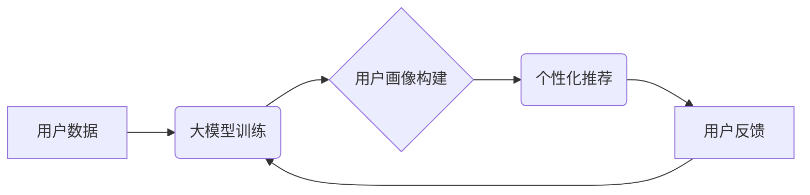

                 

## 大模型是未来个性化推荐的发展方向

> 关键词：大模型、个性化推荐、深度学习、Transformer、用户画像、推荐算法

### 1. 背景介绍

个性化推荐作为互联网时代的核心技术之一，旨在为用户提供更加精准、有效的推荐服务，提升用户体验和商业价值。传统的个性化推荐方法主要依赖于用户行为数据和显性反馈，例如用户浏览历史、购买记录、评分等。然而，随着数据量的激增和用户行为的多样性，传统的基于规则和协同过滤的推荐算法逐渐面临挑战。

近年来，深度学习技术的快速发展为个性化推荐领域带来了新的机遇。深度学习模型能够自动学习用户兴趣和偏好，并从海量数据中挖掘更深层的特征，从而实现更精准的推荐。其中，大模型作为深度学习领域的新兴技术，凭借其强大的学习能力和泛化能力，展现出巨大的潜力，成为未来个性化推荐发展的重要方向。

### 2. 核心概念与联系

#### 2.1 大模型

大模型是指参数规模庞大、训练数据海量、计算资源消耗巨大的深度学习模型。与传统深度学习模型相比，大模型拥有更强的学习能力和泛化能力，能够处理更复杂的任务，并生成更精细的结果。

#### 2.2 个性化推荐

个性化推荐是指根据用户的个人特征、兴趣偏好、行为模式等信息，为用户提供定制化的商品、服务或内容推荐。其目标是提高用户满意度、提升转化率，并增强用户粘性。

#### 2.3 联系

大模型能够通过学习海量用户数据，构建更精准的用户画像，并理解用户之间的潜在关联。这些能力为个性化推荐提供了强大的支持，使得推荐结果更加精准、个性化。

**Mermaid 流程图**



### 3. 核心算法原理 & 具体操作步骤

#### 3.1 算法原理概述

大模型在个性化推荐中的应用主要基于以下核心算法原理：

* **深度学习**: 大模型利用多层神经网络结构，从海量数据中学习用户兴趣和偏好。
* **Transformer**: Transformer是一种新型的深度学习架构，能够有效处理序列数据，例如用户行为历史和商品描述。
* **自注意力机制**: 自注意力机制能够捕捉用户行为和商品之间的潜在关联，提升推荐的精准度。

#### 3.2 算法步骤详解

1. **数据预处理**: 收集用户行为数据、商品信息等数据，并进行清洗、转换、编码等预处理操作。
2. **模型训练**: 利用大模型架构，训练模型以学习用户兴趣和偏好。训练过程中，使用自注意力机制捕捉用户行为和商品之间的关联。
3. **用户画像构建**: 根据训练好的模型，构建每个用户的个性化画像，包括用户兴趣、偏好、行为模式等信息。
4. **推荐生成**: 根据用户的个性化画像，预测用户对不同商品的兴趣，并生成个性化的推荐列表。
5. **效果评估**: 通过用户点击、购买等行为数据，评估推荐算法的性能，并进行模型优化和迭代。

#### 3.3 算法优缺点

**优点**:

* **精准度高**: 大模型能够学习更深层的用户特征，提升推荐的精准度。
* **个性化强**: 大模型能够构建个性化的用户画像，提供更加个性化的推荐。
* **泛化能力强**: 大模型能够从海量数据中学习通用特征，具有较强的泛化能力。

**缺点**:

* **计算资源消耗大**: 大模型训练需要大量的计算资源，成本较高。
* **数据依赖性强**: 大模型的性能依赖于训练数据的质量和数量。
* **解释性差**: 大模型的决策过程较为复杂，难以解释其推荐结果。

#### 3.4 算法应用领域

大模型在个性化推荐领域具有广泛的应用场景，例如：

* **电商推荐**: 为用户推荐个性化的商品，提升转化率。
* **内容推荐**: 为用户推荐个性化的新闻、视频、音乐等内容。
* **社交推荐**: 为用户推荐新的朋友、兴趣小组等。
* **广告推荐**: 为用户推荐个性化的广告，提升广告效果。

### 4. 数学模型和公式 & 详细讲解 & 举例说明

#### 4.1 数学模型构建

大模型在个性化推荐中的应用通常基于以下数学模型：

* **用户-商品交互矩阵**: 用来表示用户对商品的评分或行为，例如点击、购买等。

* **嵌入向量**: 将用户和商品映射到低维向量空间，方便模型学习用户兴趣和商品特征之间的关联。

#### 4.2 公式推导过程

* **用户嵌入**:  $u_i = \text{Embedding}(user_i)$，其中 $user_i$ 表示第 $i$ 个用户，$u_i$ 是其对应的嵌入向量。

* **商品嵌入**: $v_j = \text{Embedding}(item_j)$，其中 $item_j$ 表示第 $j$ 个商品，$v_j$ 是其对应的嵌入向量。

* **预测评分**: $r_{ij} = f(u_i, v_j)$，其中 $r_{ij}$ 是用户 $i$ 对商品 $j$ 的预测评分，$f$ 是一个评分函数，例如点积或多层感知机。

#### 4.3 案例分析与讲解

假设有一个电商平台，用户和商品的交互数据如下：

| 用户 | 商品1 | 商品2 | 商品3 |
|---|---|---|---|
| 用户1 | 5 | 3 | 4 |
| 用户2 | 4 | 5 | 2 |
| 用户3 | 3 | 2 | 5 |

我们可以使用大模型训练一个推荐模型，并预测用户对商品的评分。例如，预测用户1对商品4的评分：

* 用户1的嵌入向量: $u_1$
* 商品4的嵌入向量: $v_4$
* 预测评分: $r_{14} = f(u_1, v_4)$

通过训练模型，我们可以得到 $u_1$ 和 $v_4$ 的最佳嵌入向量，从而得到 $r_{14}$ 的预测值。

### 5. 项目实践：代码实例和详细解释说明

#### 5.1 开发环境搭建

* Python 3.7+
* TensorFlow 2.0+
* PyTorch 1.0+
* CUDA 10.0+ (可选)

#### 5.2 源代码详细实现

```python
import tensorflow as tf

# 定义用户-商品交互矩阵
ratings = tf.constant([[5, 3, 4],
                       [4, 5, 2],
                       [3, 2, 5]])

# 定义用户和商品的嵌入维度
embedding_dim = 10

# 定义用户嵌入层
user_embeddings = tf.keras.layers.Embedding(input_dim=ratings.shape[0], output_dim=embedding_dim)

# 定义商品嵌入层
item_embeddings = tf.keras.layers.Embedding(input_dim=ratings.shape[1], output_dim=embedding_dim)

# 定义评分函数
def rating_function(user_embedding, item_embedding):
    return tf.reduce_sum(user_embedding * item_embedding)

# 定义模型
model = tf.keras.Sequential([
    user_embeddings,
    item_embeddings,
    rating_function
])

# 编译模型
model.compile(optimizer='adam', loss='mse')

# 训练模型
model.fit(ratings, ratings, epochs=10)

# 预测用户对商品的评分
user_id = 0
item_id = 2
user_embedding = user_embeddings(tf.constant([user_id]))
item_embedding = item_embeddings(tf.constant([item_id]))
predicted_rating = rating_function(user_embedding, item_embedding)
print(f'Predicted rating for user {user_id} and item {item_id}: {predicted_rating.numpy()}')
```

#### 5.3 代码解读与分析

* 代码首先定义了用户-商品交互矩阵和嵌入维度。
* 然后定义了用户嵌入层和商品嵌入层，将用户和商品映射到低维向量空间。
* 定义了评分函数，计算用户对商品的预测评分。
* 最后定义了模型，编译模型，并训练模型。
* 训练完成后，可以使用模型预测用户对商品的评分。

#### 5.4 运行结果展示

运行代码后，会输出用户对商品的预测评分。

### 6. 实际应用场景

#### 6.1 电商推荐

大模型在电商推荐领域具有广泛的应用场景，例如：

* **商品推荐**: 根据用户的浏览历史、购买记录、评分等信息，推荐用户可能感兴趣的商品。
* **个性化促销**: 为不同用户推荐个性化的促销活动，提升转化率。
* **新品推荐**: 为用户推荐新上市的商品，提高用户粘性。

#### 6.2 内容推荐

大模型在内容推荐领域也具有广泛的应用场景，例如：

* **新闻推荐**: 根据用户的阅读历史、兴趣偏好，推荐用户可能感兴趣的新闻。
* **视频推荐**: 根据用户的观看历史、兴趣偏好，推荐用户可能感兴趣的视频。
* **音乐推荐**: 根据用户的听歌历史、兴趣偏好，推荐用户可能感兴趣的音乐。

#### 6.3 社交推荐

大模型在社交推荐领域可以帮助用户发现新的朋友、兴趣小组等，例如：

* **朋友推荐**: 根据用户的社交关系、兴趣偏好，推荐用户可能认识的朋友。
* **兴趣小组推荐**: 根据用户的兴趣爱好，推荐用户可能感兴趣的兴趣小组。

#### 6.4 未来应用展望

随着大模型技术的不断发展，其在个性化推荐领域的应用场景将更加广泛，例如：

* **多模态推荐**: 将文本、图像、音频等多模态数据融合，提供更加丰富的个性化推荐。
* **实时推荐**: 利用大模型的实时推理能力，为用户提供更加即时的个性化推荐。
* **跨平台推荐**: 将用户数据跨平台整合，提供更加全面的个性化推荐。

### 7. 工具和资源推荐

#### 7.1 学习资源推荐

* **书籍**:
    * 《深度学习》 - Ian Goodfellow, Yoshua Bengio, Aaron Courville
    * 《自然语言处理》 - Dan Jurafsky, James H. Martin
* **在线课程**:
    * Coursera: Deep Learning Specialization
    * Udacity: Deep Learning Nanodegree
* **博客**:
    * The Gradient
    * Towards Data Science

#### 7.2 开发工具推荐

* **TensorFlow**: https://www.tensorflow.org/
* **PyTorch**: https://pytorch.org/
* **Hugging Face**: https://huggingface.co/

#### 7.3 相关论文推荐

* **Attention Is All You Need**: https://arxiv.org/abs/1706.03762
* **BERT: Pre-training of Deep Bidirectional Transformers for Language Understanding**: https://arxiv.org/abs/1810.04805
* **GPT-3: Language Models are Few-Shot Learners**: https://arxiv.org/abs/2005.14165

### 8. 总结：未来发展趋势与挑战

#### 8.1 研究成果总结

大模型在个性化推荐领域取得了显著的成果，能够提供更加精准、个性化的推荐，提升用户体验和商业价值。

#### 8.2 未来发展趋势

* **模型规模和能力的提升**: 大模型的规模和能力将继续提升，能够处理更复杂的任务，并生成更精细的结果。
* **多模态融合**: 大模型将融合文本、图像、音频等多模态数据，提供更加丰富的个性化推荐。
* **联邦学习**: 联邦学习技术将使大模型能够在保护用户隐私的前提下进行训练和部署。

#### 8.3 面临的挑战

* **计算资源消耗**: 大模型训练需要大量的计算资源，成本较高。
* **数据依赖性**: 大模型的性能依赖于训练数据的质量和数量。
* **解释性差**: 大模型的决策过程较为复杂，难以解释其推荐结果。

#### 8.4 研究展望

未来研究将重点关注以下几个方面:

* **降低训练成本**: 研究更有效的训练方法，降低大模型的训练成本。
* **提升数据利用效率**: 研究如何利用更少的数据训练更强大的大模型。
* **提高模型解释性**: 研究如何解释大模型的决策过程，提升模型的可解释性。


### 9. 附录：常见问题与解答

**Q1: 大模型的训练需要多少计算资源？**

A1: 大模型的训练需要大量的计算资源，例如数百甚至数千个GPU。

**Q2: 大模型的训练需要多少数据？**

A2: 大模型的训练需要海量数据，例如数十亿甚至数百亿个数据点。

**Q3: 如何解释大模型的推荐结果？**

A3: 由于大模型的决策过程较为复杂，解释其推荐结果仍然是一个挑战。目前的研究方法包括：

* **注意力机制**: 分析大模型对哪些数据点给予了更多的关注。
* **特征重要性**: 分析哪些特征对大模型的预测结果影响最大。
* **可解释性模型**: 使用更易于解释的模型来近似大模型的预测结果。


作者：禅与计算机程序设计艺术 / Zen and the Art of Computer Programming 
<end_of_turn>

