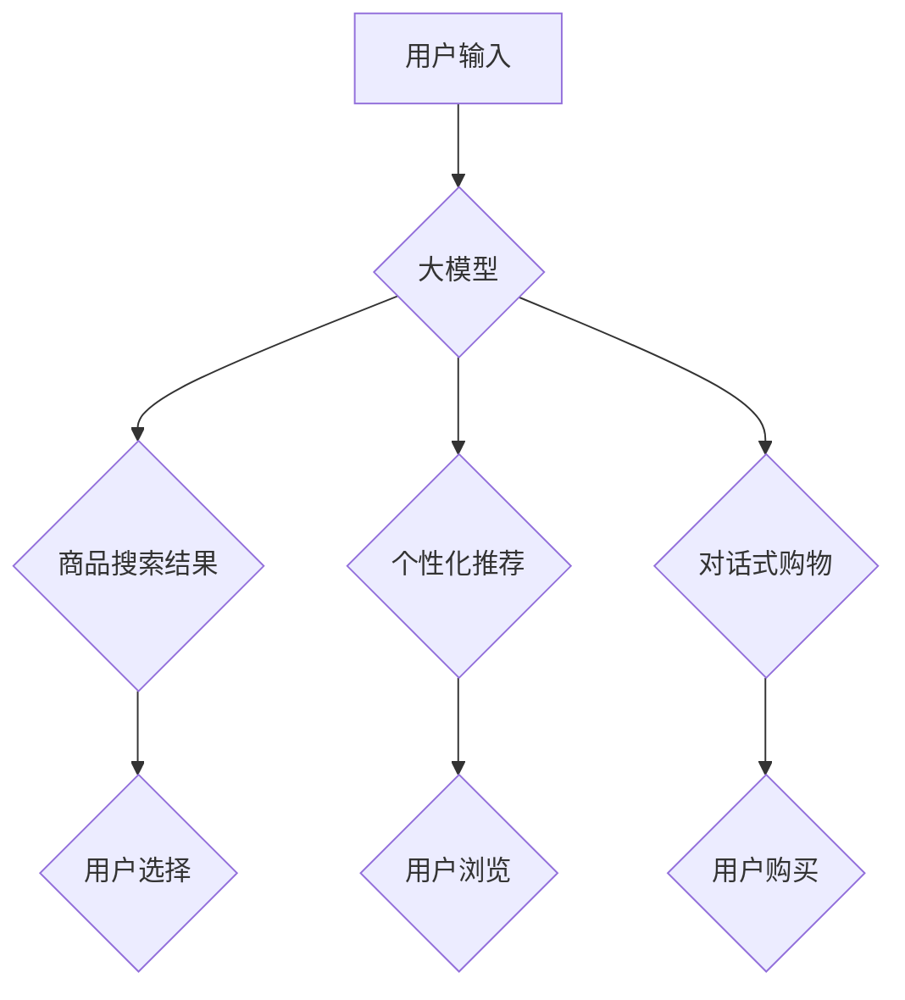

                 

## 大模型赋能电商平台：从搜索到购买的全流程优化

> 关键词：大模型、电商平台、自然语言处理、推荐系统、搜索引擎、对话系统、个性化体验

## 1. 背景介绍

电子商务平台作为当今数字经济的重要组成部分，其发展离不开技术创新。近年来，大模型技术在自然语言处理、计算机视觉等领域取得了突破性进展，为电商平台的智能化转型提供了强大的技术支撑。大模型能够理解和生成人类语言，并从海量数据中提取知识和模式，为电商平台提供从搜索到购买的全流程优化方案。

传统电商平台的搜索引擎主要依赖关键词匹配，难以理解用户真实需求，推荐系统则往往基于用户历史行为，缺乏个性化和精准度。大模型的应用可以打破这些局限，实现更智能、更精准、更个性化的电商体验。

## 2. 核心概念与联系

### 2.1 大模型概述

大模型是指参数量达到数亿甚至数千亿的深度学习模型，通过训练海量数据，能够掌握丰富的语言知识和模式。常见的代表性大模型包括GPT-3、BERT、LaMDA等。

### 2.2 大模型与电商平台的联系

大模型可以应用于电商平台的多个环节，例如：

* **搜索引擎优化:** 大模型可以理解用户自然语言查询，并返回更精准、更相关的商品结果。
* **推荐系统增强:** 大模型可以分析用户行为、商品属性、文本描述等多方面信息，提供更个性化、更精准的商品推荐。
* **对话式购物体验:** 大模型可以构建对话式购物系统，帮助用户更便捷地查询商品信息、完成购买流程。
* **内容生成与营销:** 大模型可以生成商品描述、促销文案等内容，提升营销效果。

### 2.3 大模型架构



## 3. 核心算法原理 & 具体操作步骤

### 3.1 算法原理概述

大模型的训练主要基于深度学习算法，例如Transformer。Transformer模型通过自注意力机制，能够捕捉文本序列中的长距离依赖关系，从而实现更精准的语言理解和生成。

### 3.2 算法步骤详解

1. **数据预处理:** 收集并预处理电商平台的海量文本数据，例如商品描述、用户评论、搜索日志等。
2. **模型训练:** 使用深度学习框架（如TensorFlow、PyTorch）训练Transformer模型，并根据电商平台的具体需求进行参数调整。
3. **模型评估:** 使用测试数据评估模型的性能，例如准确率、召回率、F1-score等。
4. **模型部署:** 将训练好的模型部署到电商平台的服务器上，并将其集成到搜索引擎、推荐系统、对话系统等模块中。

### 3.3 算法优缺点

**优点:**

* 能够理解和生成自然语言，提升用户体验。
* 能够从海量数据中提取知识和模式，提供更精准的推荐和搜索结果。
* 能够个性化定制服务，满足不同用户的需求。

**缺点:**

* 训练成本高，需要大量计算资源和数据。
* 模型解释性差，难以理解模型的决策过程。
* 存在潜在的偏见和误导性问题。

### 3.4 算法应用领域

大模型在电商平台的应用领域非常广泛，例如：

* **商品搜索:** 理解用户自然语言查询，返回更精准的商品结果。
* **商品推荐:** 根据用户行为、商品属性、文本描述等信息，提供个性化商品推荐。
* **对话式购物:** 构建对话式购物系统，帮助用户更便捷地查询商品信息、完成购买流程。
* **内容生成:** 生成商品描述、促销文案等内容，提升营销效果。
* **客户服务:** 自动回复用户常见问题，提升客户服务效率。

## 4. 数学模型和公式 & 详细讲解 & 举例说明

### 4.1 数学模型构建

大模型的训练基于深度学习算法，其核心是构建一个复杂的数学模型，用来模拟人类语言的生成和理解过程。

一个典型的Transformer模型包含多个编码器和解码器层，每个层都包含多个子层，例如自注意力层、前馈神经网络层等。

### 4.2 公式推导过程

Transformer模型的训练目标是最大化模型输出的概率与真实标签的匹配度。

可以使用交叉熵损失函数来衡量模型的预测结果与真实标签之间的差异。

$$
Loss = -\sum_{i=1}^{N} y_i \log(p_i)
$$

其中：

* $N$ 是样本数量
* $y_i$ 是真实标签
* $p_i$ 是模型预测的概率

### 4.3 案例分析与讲解

例如，在商品搜索任务中，大模型需要将用户的自然语言查询转换为商品关键词，并返回与这些关键词相关的商品结果。

可以使用词嵌入技术将单词映射到向量空间，然后使用注意力机制计算每个单词在查询中的重要性。

最终，模型会根据查询的上下文信息，选择最相关的商品关键词，并返回相应的商品结果。

## 5. 项目实践：代码实例和详细解释说明

### 5.1 开发环境搭建

* Python 3.7+
* TensorFlow 2.x 或 PyTorch 1.x
* CUDA 和 cuDNN (可选，用于GPU加速)

### 5.2 源代码详细实现

```python
# 使用TensorFlow构建一个简单的Transformer模型
import tensorflow as tf

# 定义模型结构
class SimpleTransformer(tf.keras.Model):
    def __init__(self, vocab_size, embedding_dim, num_heads, num_layers):
        super(SimpleTransformer, self).__init__()
        self.embedding = tf.keras.layers.Embedding(vocab_size, embedding_dim)
        self.transformer_layers = tf.keras.layers.StackedRNNCells([
            tf.keras.layers.TransformerLayer(
                num_heads=num_heads,
                units=embedding_dim
            ) for _ in range(num_layers)
        ])

    def call(self, inputs):
        embedded = self.embedding(inputs)
        output = self.transformer_layers(embedded)
        return output

# 实例化模型
model = SimpleTransformer(vocab_size=10000, embedding_dim=128, num_heads=8, num_layers=6)

# 训练模型
model.compile(optimizer='adam', loss='sparse_categorical_crossentropy', metrics=['accuracy'])
model.fit(x_train, y_train, epochs=10)

```

### 5.3 代码解读与分析

* 该代码示例展示了如何使用TensorFlow构建一个简单的Transformer模型。
* 模型包含嵌入层、Transformer层和输出层。
* 嵌入层将单词映射到向量空间，Transformer层用于捕捉文本序列中的长距离依赖关系，输出层用于预测下一个单词。
* 训练模型时，使用交叉熵损失函数和Adam优化器。

### 5.4 运行结果展示

训练完成后，可以使用测试数据评估模型的性能，例如准确率、召回率、F1-score等。

## 6. 实际应用场景

### 6.1 商品搜索优化

大模型可以理解用户自然语言查询，并返回更精准、更相关的商品结果。例如，用户搜索“冬季保暖外套”，大模型可以理解用户需求，并返回符合条件的商品，例如羽绒服、羊毛大衣等。

### 6.2 个性化推荐

大模型可以分析用户行为、商品属性、文本描述等多方面信息，提供更个性化、更精准的商品推荐。例如，根据用户的浏览历史、购买记录、兴趣爱好等信息，大模型可以推荐用户可能感兴趣的商品。

### 6.3 对话式购物体验

大模型可以构建对话式购物系统，帮助用户更便捷地查询商品信息、完成购买流程。例如，用户可以通过聊天机器人询问商品价格、库存情况、尺码等信息，并直接在对话中完成购买。

### 6.4 未来应用展望

大模型在电商平台的应用前景广阔，未来可能应用于以下领域：

* **智能客服:** 自动回复用户常见问题，提升客户服务效率。
* **商品内容生成:** 自动生成商品描述、促销文案等内容，提升营销效果。
* **个性化营销:** 根据用户的行为和偏好，提供个性化的营销方案。
* **虚拟试衣间:** 利用计算机视觉和大模型技术，实现虚拟试衣间功能。

## 7. 工具和资源推荐

### 7.1 学习资源推荐

* **书籍:**
    * 《深度学习》 - Ian Goodfellow, Yoshua Bengio, Aaron Courville
    * 《自然语言处理》 - Jurafsky, Martin
* **在线课程:**
    * Coursera: 深度学习 Specialization
    * Stanford CS224N: 自然语言处理与深度学习

### 7.2 开发工具推荐

* **深度学习框架:** TensorFlow, PyTorch
* **自然语言处理库:** NLTK, spaCy, Hugging Face Transformers
* **云计算平台:** AWS, Azure, Google Cloud

### 7.3 相关论文推荐

* Attention Is All You Need - Vaswani et al. (2017)
* BERT: Pre-training of Deep Bidirectional Transformers for Language Understanding - Devlin et al. (2018)
* GPT-3: Language Models are Few-Shot Learners - Brown et al. (2020)

## 8. 总结：未来发展趋势与挑战

### 8.1 研究成果总结

大模型技术在电商平台的应用取得了显著成果，例如搜索结果的精准度提升、推荐系统的个性化程度增强、对话式购物体验的改善等。

### 8.2 未来发展趋势

未来，大模型在电商平台的应用将朝着以下方向发展:

* **模型规模和能力的提升:** 随着计算资源的不断发展，大模型的规模和能力将进一步提升，能够处理更复杂的任务，提供更精准的解决方案。
* **多模态融合:** 大模型将融合文本、图像、音频等多模态数据，提供更全面的用户体验。
* **边缘计算:** 将大模型部署到边缘设备上，实现更低延迟、更个性化的服务。

### 8.3 面临的挑战

大模型在电商平台的应用也面临一些挑战:

* **数据安全和隐私保护:** 大模型需要训练海量数据，如何保证数据安全和用户隐私是需要解决的关键问题。
* **模型解释性和可控性:** 大模型的决策过程往往难以理解，如何提高模型的解释性和可控性是未来研究的重要方向。
* **公平性和偏见:** 大模型可能存在公平性和偏见问题，需要采取措施确保模型的公平性和公正性。

### 8.4 研究展望

未来，大模型技术将继续推动电商平台的智能化转型，为用户提供更便捷、更智能、更个性化的购物体验。

## 9. 附录：常见问题与解答

* **Q: 大模型训练成本高，如何降低成本？**

A: 可以使用预训练模型，并进行微调，降低训练成本。还可以利用云计算平台的资源，共享计算资源，降低成本。

* **Q: 如何保证大模型的公平性和公正性？**

A: 可以采用数据清洗、模型调优等方法，减少模型的偏见。还可以进行公平性评估，并根据评估结果进行模型调整。

* **Q: 大模型的决策过程难以理解，如何提高模型的解释性？**

A: 可以使用可解释机器学习方法，例如LIME、SHAP等，解释模型的决策过程。也可以设计可视化工具，帮助用户理解模型的决策逻辑。


作者：禅与计算机程序设计艺术 / Zen and the Art of Computer Programming 
<end_of_turn>

