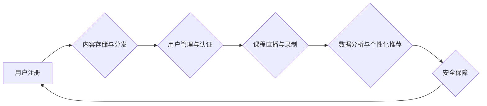

                 

## 如何利用云计算提升知识付费的技术水平

> 关键词：云计算、知识付费、技术架构、数据分析、人工智能、内容分发、安全保障、成本优化

## 1. 背景介绍

知识付费行业近年来蓬勃发展，人们对高质量知识的需求日益增长。然而，传统知识付费模式面临着诸多挑战，例如内容生产成本高、用户获取成本高、内容传播效率低等。云计算作为一种新型的计算模式，为知识付费行业提供了新的机遇和可能性。

云计算的优势在于其弹性、可扩展性、高可用性和成本效益，可以帮助知识付费平台解决传统模式的痛点，提升技术水平，打造更优质的用户体验。

## 2. 核心概念与联系

### 2.1 云计算概念

云计算是指通过互联网，按需提供计算资源、存储资源、网络资源等服务的一种模式。其核心特点包括：

* **按需自服务:** 用户可以根据自身需求随时随地获取所需的资源。
* **弹性伸缩:** 云计算资源可以根据用户需求动态伸缩，满足峰值流量和瞬时需求。
* **资源池化:** 云计算资源被池化管理，可以灵活分配给不同的用户和应用。
* **快速部署:** 云计算平台提供快速部署和配置的服务，缩短了应用上线时间。
* **高可用性:** 云计算平台采用冗余和负载均衡技术，确保服务的高可用性。

### 2.2 云计算与知识付费的关系

云计算可以为知识付费平台提供以下方面的支持：

* **内容存储和分发:** 云存储服务可以提供海量、安全的存储空间，用于存储知识付费平台的课程、文档、音频等内容。云 CDN 服务可以加速内容分发，降低用户访问延迟。
* **用户管理和认证:** 云平台提供的身份认证和授权服务可以帮助知识付费平台安全地管理用户身份和权限。
* **课程直播和录制:** 云计算平台可以提供强大的直播和录制功能，支持知识付费平台进行在线课程直播和录制。
* **数据分析和个性化推荐:** 云平台提供的机器学习和数据分析服务可以帮助知识付费平台分析用户行为，进行个性化推荐，提升用户粘性。
* **安全保障:** 云平台提供完善的安全防护措施，保障知识付费平台和用户数据安全。

**Mermaid 流程图**



## 3. 核心算法原理 & 具体操作步骤

### 3.1 算法原理概述

知识付费平台的推荐算法通常基于用户行为数据和内容特征数据，通过机器学习模型预测用户对特定内容的兴趣，并将其推荐给用户。常见的推荐算法包括：

* **协同过滤:** 基于用户对相似内容的喜好进行推荐。
* **内容过滤:** 基于内容的特征进行推荐。
* **混合推荐:** 结合协同过滤和内容过滤算法进行推荐。

### 3.2 算法步骤详解

**协同过滤算法步骤:**

1. **数据收集:** 收集用户对内容的评分、浏览记录、购买记录等行为数据。
2. **用户相似度计算:** 计算用户之间的相似度，例如使用余弦相似度或皮尔逊相关系数。
3. **推荐内容:** 为用户推荐与其相似用户喜欢的、但用户未接触过的内容。

**内容过滤算法步骤:**

1. **内容特征提取:** 从内容中提取特征，例如关键词、主题、作者等。
2. **用户兴趣建模:** 建立用户对不同特征的偏好模型，例如使用朴素贝叶斯或逻辑回归。
3. **推荐内容:** 为用户推荐与其兴趣模型匹配的内容。

### 3.3 算法优缺点

**协同过滤算法:**

* **优点:** 可以发现用户之间的隐性关系，推荐个性化内容。
* **缺点:** 数据稀疏性问题，新用户和新内容推荐效果较差。

**内容过滤算法:**

* **优点:** 不需要用户行为数据，可以推荐新内容。
* **缺点:** 推荐结果可能过于单一，缺乏个性化。

### 3.4 算法应用领域

推荐算法广泛应用于电商、社交媒体、视频网站等领域，在知识付费平台中，可以用于推荐课程、文章、视频等内容，提升用户体验和平台活跃度。

## 4. 数学模型和公式 & 详细讲解 & 举例说明

### 4.1 数学模型构建

协同过滤算法的数学模型通常基于矩阵分解，将用户-内容交互矩阵分解成用户特征矩阵和内容特征矩阵的乘积。

假设用户集合为U，内容集合为C，用户-内容交互矩阵为R，其中R(u,c)表示用户u对内容c的评分。

则用户特征矩阵为U，内容特征矩阵为V，则有：

$$R \approx U V^T$$

其中，U(u,k)表示用户u的第k个特征，V(c,k)表示内容c的第k个特征。

### 4.2 公式推导过程

通过最小化用户-内容交互矩阵与预测矩阵之间的误差，可以得到用户特征矩阵和内容特征矩阵的最佳解。

常用的误差函数为均方误差（MSE）：

$$MSE = \frac{1}{N} \sum_{u \in U} \sum_{c \in C} (R(u,c) - \hat{R}(u,c))^2$$

其中，N为用户-内容交互矩阵的非零元素个数，$\hat{R}(u,c)$为预测的用户对内容c的评分。

通过梯度下降算法等优化方法，可以迭代更新用户特征矩阵和内容特征矩阵，最小化MSE。

### 4.3 案例分析与讲解

假设有一个用户-内容交互矩阵，其中用户1对内容1评分为5，用户2对内容1评分为3，用户1对内容2评分为4，用户2对内容2评分为2。

通过矩阵分解，可以得到用户特征矩阵和内容特征矩阵，并预测用户对其他内容的评分。

例如，可以预测用户1对内容3的评分，如果内容3与内容1和内容2的特征相似度较高，则预测的评分也可能较高。

## 5. 项目实践：代码实例和详细解释说明

### 5.1 开发环境搭建

* **云平台选择:** AWS、Azure、Google Cloud 等
* **编程语言:** Python、Java、Go 等
* **框架选择:** Flask、Django、Spring Boot 等
* **数据库选择:** MySQL、PostgreSQL、MongoDB 等

### 5.2 源代码详细实现

```python
# 使用Python和Scikit-learn库实现协同过滤算法

from sklearn.metrics.pairwise import cosine_similarity

# 用户-内容交互矩阵
ratings = {
    'user1': {'content1': 5, 'content2': 4},
    'user2': {'content1': 3, 'content2': 2},
}

# 将用户-内容交互矩阵转换为用户特征矩阵和内容特征矩阵
user_features = cosine_similarity(ratings)
content_features = cosine_similarity(ratings.T)

# 预测用户对新内容的评分
new_content = {'content3': 10}
predicted_ratings = user_features @ content_features[new_content]

# 打印预测结果
print(predicted_ratings)
```

### 5.3 代码解读与分析

* 该代码首先定义了用户-内容交互矩阵。
* 然后使用Scikit-learn库的`cosine_similarity`函数计算用户特征矩阵和内容特征矩阵。
* 最后使用矩阵乘法预测用户对新内容的评分。

### 5.4 运行结果展示

运行该代码后，可以得到用户对新内容的评分预测结果。

## 6. 实际应用场景

### 6.1 在线课程推荐

知识付费平台可以利用云计算和推荐算法，为用户推荐个性化的在线课程，提升用户学习体验和课程转化率。

### 6.2 内容分发优化

云 CDN 服务可以加速知识付费平台内容的传播，降低用户访问延迟，提升用户粘性。

### 6.3 数据分析与用户画像

云平台提供的机器学习和数据分析服务可以帮助知识付费平台分析用户行为，构建用户画像，进行精准营销和内容运营。

### 6.4 未来应用展望

* **人工智能驱动的个性化学习:** 利用人工智能技术，为用户提供更加个性化的学习路径和内容推荐。
* **沉浸式学习体验:** 利用虚拟现实和增强现实技术，打造更加沉浸式的学习体验。
* **跨平台知识付费:** 将知识付费服务扩展到更多平台，例如移动端、智能家居等。

## 7. 工具和资源推荐

### 7.1 学习资源推荐

* **云计算平台官方文档:** AWS、Azure、Google Cloud 等
* **机器学习库:** Scikit-learn、TensorFlow、PyTorch 等
* **在线课程:** Coursera、edX、Udemy 等

### 7.2 开发工具推荐

* **云开发平台:** AWS Amplify、Azure Functions、Google Cloud Functions 等
* **代码编辑器:** VS Code、Sublime Text、Atom 等
* **版本控制系统:** Git、GitHub 等

### 7.3 相关论文推荐

* **Collaborative Filtering for Implicit Feedback Datasets**
* **Matrix Factorization Techniques for Recommender Systems**
* **Deep Learning for Recommender Systems**

## 8. 总结：未来发展趋势与挑战

### 8.1 研究成果总结

云计算为知识付费行业提供了新的技术支撑，推荐算法可以帮助平台提升用户体验和内容传播效率。

### 8.2 未来发展趋势

未来，知识付费行业将更加注重个性化、智能化和沉浸式体验，云计算和人工智能技术将发挥更加重要的作用。

### 8.3 面临的挑战

* **数据安全和隐私保护:** 云计算平台需要保障用户数据安全和隐私。
* **算法公平性和可解释性:** 推荐算法需要保证公平性和可解释性，避免算法偏见和歧视。
* **成本控制:** 云计算成本需要合理控制，避免平台负担过重。

### 8.4 研究展望

未来研究方向包括：

* **开发更加精准和个性化的推荐算法。**
* **利用人工智能技术打造更加沉浸式的学习体验。**
* **探索新的云计算架构和技术，降低成本和提高效率。**

## 9. 附录：常见问题与解答

* **Q: 云计算对知识付费平台有什么优势？**

* **A:** 云计算可以提供弹性、可扩展、高可用性和成本效益的计算资源，帮助知识付费平台解决传统模式的痛点，提升技术水平。

* **Q: 如何选择合适的云计算平台？**

* **A:** 需要根据平台的具体需求，例如存储空间、计算能力、地域限制等，选择合适的云计算平台。

* **Q: 如何保障知识付费平台的数据安全？**

* **A:** 云计算平台需要采用完善的安全防护措施，例如数据加密、访问控制、安全审计等，保障用户数据安全。


作者：禅与计算机程序设计艺术 / Zen and the Art of Computer Programming 
<end_of_turn>

