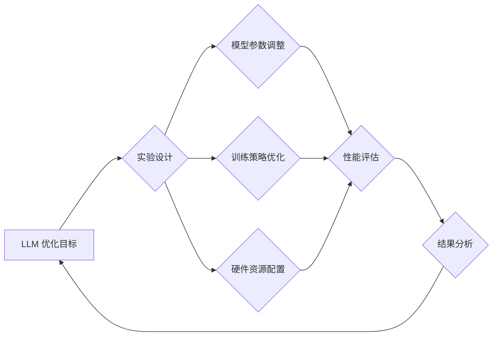

                 

## 实验设计大师：LLM 优化研究过程

> 关键词：LLM、实验设计、模型优化、超参数调优、性能评估、机器学习、深度学习

## 1. 背景介绍

大型语言模型 (LLM) 近年来取得了令人瞩目的成就，在自然语言处理、文本生成、代码生成等领域展现出强大的能力。然而，LLM 的训练和优化是一个复杂而具有挑战性的过程，需要精心设计的实验方案才能有效地提升模型性能。

传统的机器学习模型优化方法，例如梯度下降，在处理 LLM 的海量参数时显得不够高效。LLM 的训练需要大量的计算资源和时间，因此，如何有效地利用资源，加速训练过程，并提高模型的最终性能，成为一个重要的研究方向。

## 2. 核心概念与联系

### 2.1  LLM 优化

LLM 优化是指通过调整模型参数、训练策略和硬件资源等因素，以提高模型的性能和效率的过程。

### 2.2  实验设计

实验设计是科学研究的重要环节，它涉及到如何制定实验方案、收集数据、分析结果等一系列步骤。在 LLM 优化研究中，实验设计可以帮助我们系统地评估不同优化策略的效果，并找到最优的方案。

### 2.3  关系

LLM 优化和实验设计密切相关。实验设计为 LLM 优化提供了科学的框架和方法，帮助我们进行系统性的研究和评估。

**Mermaid 流程图**



## 3. 核心算法原理 & 具体操作步骤

### 3.1  算法原理概述

LLM 优化算法主要包括以下几种：

* **梯度下降法:** 这是最常用的优化算法，通过计算梯度来更新模型参数，使其朝着降低损失函数的方向移动。
* **Adam 优化器:** Adam 是一种基于梯度下降的优化器，它结合了动量和自适应学习率的优点，可以更快地收敛到最优解。
* **RMSprop 优化器:** RMSprop 是一种自适应学习率的优化器，它可以有效地解决梯度消失和梯度爆炸的问题。

### 3.2  算法步骤详解

以梯度下降法为例，其具体操作步骤如下：

1. **初始化模型参数:** 将模型参数随机初始化。
2. **计算损失函数:** 使用训练数据计算模型的损失函数值。
3. **计算梯度:** 计算损失函数对模型参数的梯度。
4. **更新模型参数:** 使用梯度下降公式更新模型参数。
5. **重复步骤 2-4:** 直到损失函数收敛或达到最大迭代次数。

### 3.3  算法优缺点

| 算法 | 优点 | 缺点 |
|---|---|---|
| 梯度下降法 | 简单易实现 | 容易陷入局部最优解，收敛速度慢 |
| Adam 优化器 | 收敛速度快，鲁棒性强 | 需要更多的内存空间 |
| RMSprop 优化器 | 可以有效地解决梯度消失和梯度爆炸问题 | 对于某些模型可能效果不佳 |

### 3.4  算法应用领域

LLM 优化算法广泛应用于自然语言处理、计算机视觉、语音识别等领域。

## 4. 数学模型和公式 & 详细讲解 & 举例说明

### 4.1  数学模型构建

LLM 优化通常基于最小化损失函数的数学模型。损失函数衡量模型预测结果与真实值的差异。常见的损失函数包括交叉熵损失、均方误差损失等。

### 4.2  公式推导过程

梯度下降法的核心公式如下：

$$
\theta_{t+1} = \theta_t - \eta \nabla L(\theta_t)
$$

其中：

* $\theta$ 表示模型参数
* $t$ 表示迭代次数
* $\eta$ 表示学习率
* $\nabla L(\theta_t)$ 表示损失函数 $L$ 对参数 $\theta_t$ 的梯度

### 4.3  案例分析与讲解

假设我们训练一个二分类模型，其损失函数为交叉熵损失。

$$
L(y, \hat{y}) = -y \log(\hat{y}) - (1-y) \log(1-\hat{y})
$$

其中：

* $y$ 表示真实标签
* $\hat{y}$ 表示模型预测的概率

通过计算梯度并应用梯度下降公式，我们可以更新模型参数，使其朝着降低损失函数的方向移动。

## 5. 项目实践：代码实例和详细解释说明

### 5.1  开发环境搭建

* Python 3.7+
* PyTorch 或 TensorFlow
* CUDA 和 cuDNN (可选)

### 5.2  源代码详细实现

```python
import torch
import torch.nn as nn

# 定义模型
class SimpleModel(nn.Module):
    def __init__(self):
        super(SimpleModel, self).__init__()
        self.linear = nn.Linear(10, 1)

    def forward(self, x):
        return torch.sigmoid(self.linear(x))

# 实例化模型
model = SimpleModel()

# 定义损失函数和优化器
criterion = nn.BCELoss()
optimizer = torch.optim.Adam(model.parameters(), lr=0.001)

# 训练数据
data = torch.randn(100, 10)
labels = torch.randint(0, 2, (100,))

# 训练循环
for epoch in range(10):
    # 前向传播
    outputs = model(data)
    loss = criterion(outputs, labels)

    # 反向传播
    optimizer.zero_grad()
    loss.backward()

    # 更新参数
    optimizer.step()

    print(f'Epoch [{epoch+1}/{10}], Loss: {loss.item():.4f}')
```

### 5.3  代码解读与分析

* 代码首先定义了一个简单的模型，包含一个线性层和一个 sigmoid 激活函数。
* 然后定义了交叉熵损失函数和 Adam 优化器。
* 训练循环中，首先进行前向传播，计算模型输出和损失函数值。
* 然后进行反向传播，计算梯度并更新模型参数。
* 最后打印当前 epoch 的损失值。

### 5.4  运行结果展示

训练完成后，我们可以使用测试数据评估模型的性能。

## 6. 实际应用场景

LLM 优化技术广泛应用于以下场景：

* **自然语言理解:** 提升机器翻译、文本摘要、问答系统等任务的性能。
* **文本生成:** 生成高质量的文本内容，例如新闻报道、小说、诗歌等。
* **代码生成:** 自动生成代码，提高开发效率。
* **语音识别:** 提高语音识别系统的准确率。

### 6.4  未来应用展望

随着 LLM 的不断发展，其优化技术也将迎来新的突破。未来，LLM 优化技术可能应用于以下领域：

* **个性化学习:** 根据用户的学习风格和需求，个性化优化模型参数，提高学习效率。
* **自动驾驶:** 优化 LLM 模型，提高自动驾驶系统的安全性、可靠性和智能化程度。
* **医疗诊断:** 优化 LLM 模型，辅助医生进行疾病诊断和治疗方案制定。

## 7. 工具和资源推荐

### 7.1  学习资源推荐

* **书籍:**
    * Deep Learning by Ian Goodfellow, Yoshua Bengio, and Aaron Courville
    * Hands-On Machine Learning with Scikit-Learn, Keras & TensorFlow by Aurélien Géron
* **在线课程:**
    * Coursera: Deep Learning Specialization
    * Udacity: Deep Learning Nanodegree

### 7.2  开发工具推荐

* **PyTorch:** 开源深度学习框架，支持 GPU 加速。
* **TensorFlow:** 谷歌开发的开源深度学习框架，拥有丰富的生态系统。
* **Jupyter Notebook:** 用于交互式编程和数据可视化的工具。

### 7.3  相关论文推荐

* Attention Is All You Need (Vaswani et al., 2017)
* BERT: Pre-training of Deep Bidirectional Transformers for Language Understanding (Devlin et al., 2018)
* GPT-3: Language Models are Few-Shot Learners (Brown et al., 2020)

## 8. 总结：未来发展趋势与挑战

### 8.1  研究成果总结

LLM 优化研究取得了显著进展，例如 Adam 优化器、RMSprop 优化器等算法的提出，以及各种高效的训练策略和硬件资源配置方案。

### 8.2  未来发展趋势

* **自动化优化:** 自动化 LLMs 的参数调整和训练策略优化，降低人工干预。
* **联邦学习:** 在不共享原始数据的情况下，通过分布式训练来优化 LLMs。
* **可解释性:** 研究 LLMs 优化过程的可解释性，帮助我们更好地理解模型的行为。

### 8.3  面临的挑战

* **计算资源:** LLM 的训练和优化需要大量的计算资源，这对于资源有限的机构和个人来说是一个挑战。
* **数据标注:** LLM 的训练需要大量的标注数据，数据标注成本高昂，且标注质量难以保证。
* **模型复杂度:** LLM 的模型复杂度不断提高，这使得其优化过程更加复杂和困难。

### 8.4  研究展望

未来，LLM 优化研究将继续朝着自动化、高效、可解释的方向发展，并应用于更多领域，为人类社会带来更多价值。

## 9. 附录：常见问题与解答

* **Q: 如何选择合适的 LLM 优化算法？**

* **A:** 选择合适的 LLM 优化算法需要根据具体任务和模型的特点进行选择。例如，对于小规模模型，梯度下降法可能足够有效；而对于大规模模型，Adam 优化器或 RMSprop 优化器可能更合适。

* **Q: 如何提高 LLM 的训练效率？**

* **A:** 可以通过以下方法提高 LLM 的训练效率：
    * 使用 GPU 加速训练
    * 采用混合精度训练
    * 使用数据并行训练
    * 优化模型架构

* **Q: 如何评估 LLM 的性能？**

* **A:** LLM 的性能可以根据具体任务进行评估。例如，对于机器翻译任务，可以使用 BLEU 分数进行评估；对于文本摘要任务，可以使用 ROUGE 分数进行评估。


作者：禅与计算机程序设计艺术 / Zen and the Art of Computer Programming 
<end_of_turn>

