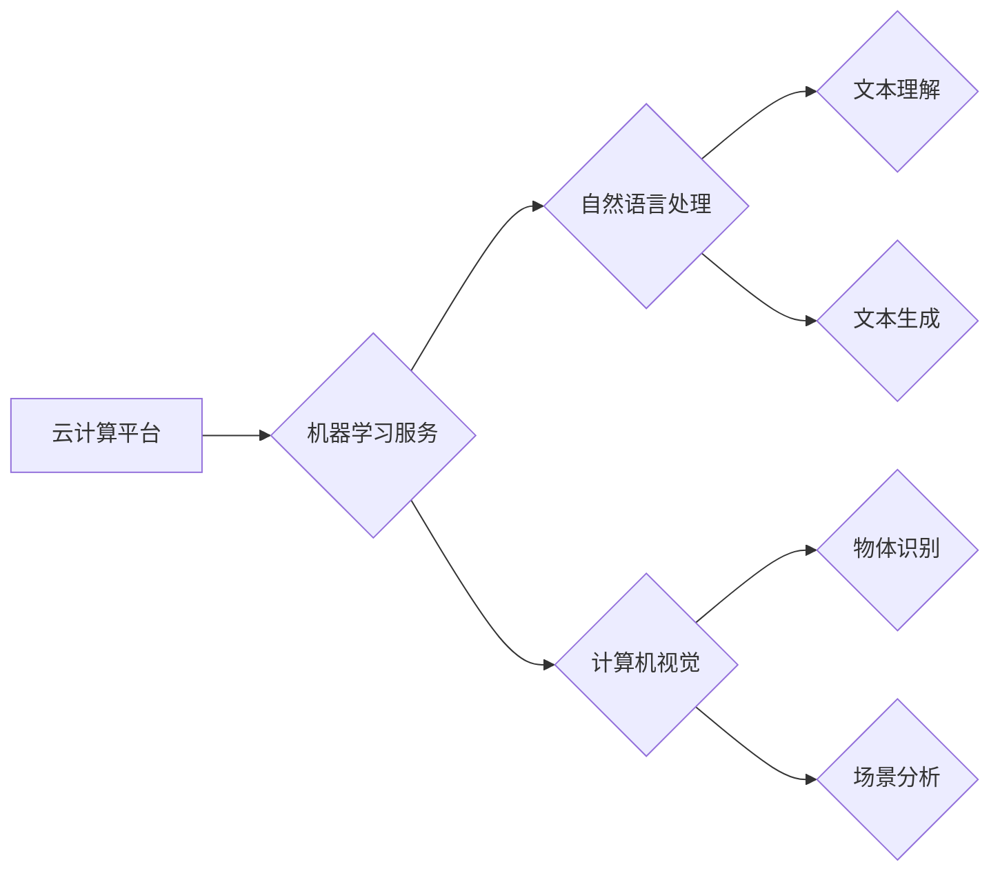

                 

## 微软的AI战略：对行业的影响

> 关键词：人工智能、微软、Azure AI、OpenAI、行业影响、云计算、机器学习、自然语言处理、计算机视觉

## 1. 背景介绍

人工智能（AI）正以惊人的速度发展，深刻地改变着各个行业。作为科技巨头，微软积极拥抱AI浪潮，制定了雄心勃勃的AI战略，旨在将AI技术融入其产品和服务，并推动AI的广泛应用。本文将深入探讨微软的AI战略，分析其核心概念、技术架构、算法原理以及对行业的影响。

### 1.1  AI的兴起与发展

人工智能的概念可以追溯到20世纪50年代，但直到近年来，随着计算能力的提升、数据量的爆炸式增长以及算法的进步，AI技术才取得了突破性进展。深度学习、强化学习等新兴算法的出现，使得AI能够处理更复杂的任务，并取得令人惊叹的成果。

### 1.2  微软的AI愿景

微软将AI视为其未来发展的核心驱动力，其AI战略的核心目标是：

* **democratize AI**: 使AI技术更易于获取和使用，让每个人都能受益于AI的强大能力。
* **empower every developer**: 为每个开发者提供AI工具和平台，让他们能够轻松地将AI集成到自己的应用程序中。
* **build responsible AI**: 确保AI技术被负责任地开发和使用，并致力于解决AI带来的伦理和社会问题。

## 2. 核心概念与联系

微软的AI战略围绕着以下核心概念展开：

* **云计算**: 微软Azure云平台是其AI战略的基础，提供强大的计算资源、存储服务和AI工具，支持各种规模的AI应用开发和部署。
* **机器学习**: 机器学习是AI的核心技术之一，微软在机器学习领域拥有丰富的经验和技术积累，并提供了一系列机器学习服务，例如Azure Machine Learning。
* **自然语言处理**: 自然语言处理（NLP）是AI领域的重要分支，微软在NLP领域取得了显著进展，例如其开发的BERT模型在文本理解和生成方面表现出色。
* **计算机视觉**: 计算机视觉是AI应用于图像和视频处理的领域，微软在计算机视觉领域也取得了重要成果，例如其开发的Azure Computer Vision服务可以识别物体、分析场景等。

**Mermaid 流程图**



## 3. 核心算法原理 & 具体操作步骤

### 3.1  算法原理概述

微软在AI领域广泛应用各种算法，例如深度学习、强化学习、图神经网络等。这些算法的核心原理是通过学习数据中的模式和关系，从而实现对复杂问题的解决。

* **深度学习**: 深度学习是一种基于多层神经网络的机器学习方法，能够学习数据的抽象特征，并进行复杂的模式识别和预测。

* **强化学习**: 强化学习是一种通过奖励机制训练智能体的方法，智能体通过与环境交互，学习如何执行最佳行动以获得最大奖励。

* **图神经网络**: 图神经网络是一种专门用于处理图结构数据的算法，能够学习图中节点和边的关系，并进行节点分类、链接预测等任务。

### 3.2  算法步骤详解

以深度学习为例，其基本步骤如下：

1. **数据收集和预处理**: 收集大量相关数据，并进行清洗、格式化等预处理操作。
2. **模型构建**: 根据任务需求选择合适的深度学习模型架构，例如卷积神经网络（CNN）、循环神经网络（RNN）等。
3. **模型训练**: 使用训练数据训练模型，调整模型参数以最小化预测误差。
4. **模型评估**: 使用测试数据评估模型的性能，例如准确率、召回率等指标。
5. **模型部署**: 将训练好的模型部署到实际应用场景中，用于进行预测或决策。

### 3.3  算法优缺点

**深度学习**:

* **优点**: 表现出色，能够学习复杂模式，自动化程度高。
* **缺点**: 需要大量数据训练，训练时间长，解释性差。

**强化学习**:

* **优点**: 可以学习复杂的策略，适应动态环境。
* **缺点**: 训练过程复杂，需要设计合理的奖励机制。

**图神经网络**:

* **优点**: 能够处理图结构数据，学习节点和边的关系。
* **缺点**: 对于大型图数据，计算复杂度较高。

### 3.4  算法应用领域

微软的AI算法广泛应用于各个领域，例如：

* **搜索引擎**: 提升搜索结果的准确性和相关性。
* **语音识别**: 实现更准确的语音转文本。
* **图像识别**: 自动识别物体、场景和人脸。
* **自然语言理解**: 理解用户自然语言输入，并提供相应的回复。
* **个性化推荐**: 根据用户的兴趣和行为，推荐个性化的产品和服务。

## 4. 数学模型和公式 & 详细讲解 & 举例说明

### 4.1  数学模型构建

深度学习模型的核心是神经网络，其结构由多个层组成，每一层包含多个神经元。每个神经元接收来自上一层的输入信号，并通过激活函数进行处理，输出到下一层。

**神经网络模型**

$$
y = f(W_1x_1 + b_1)
$$

其中：

* $y$ 是输出值
* $x_1$ 是输入值
* $W_1$ 是权重矩阵
* $b_1$ 是偏置项
* $f$ 是激活函数

### 4.2  公式推导过程

深度学习模型的训练过程是通过反向传播算法来进行的。反向传播算法的核心思想是通过计算误差，并反向传播到各层神经元，调整权重和偏置项，以最小化预测误差。

**反向传播算法**

$$
\Delta W = \eta \frac{\partial Loss}{\partial W}
$$

其中：

* $\Delta W$ 是权重更新量
* $\eta$ 是学习率
* $Loss$ 是损失函数
* $\frac{\partial Loss}{\partial W}$ 是损失函数对权重的梯度

### 4.3  案例分析与讲解

以图像分类为例，我们可以使用卷积神经网络（CNN）进行模型训练。CNN模型通过卷积层和池化层来提取图像特征，并通过全连接层进行分类。

**CNN模型结构**

```
输入层 -> 卷积层 -> 池化层 -> 全连接层 -> 输出层
```

训练过程中，CNN模型会学习到图像特征的表示，并根据这些特征进行分类。

## 5. 项目实践：代码实例和详细解释说明

### 5.1  开发环境搭建

使用Python语言开发AI项目，需要安装以下软件：

* Python 3.x
* TensorFlow 或 PyTorch 深度学习框架
* NumPy 科学计算库
* Pandas 数据处理库

### 5.2  源代码详细实现

以下是一个简单的图像分类代码示例，使用TensorFlow框架：

```python
import tensorflow as tf

# 定义模型结构
model = tf.keras.models.Sequential([
    tf.keras.layers.Conv2D(32, (3, 3), activation='relu', input_shape=(28, 28, 1)),
    tf.keras.layers.MaxPooling2D((2, 2)),
    tf.keras.layers.Conv2D(64, (3, 3), activation='relu'),
    tf.keras.layers.MaxPooling2D((2, 2)),
    tf.keras.layers.Flatten(),
    tf.keras.layers.Dense(10, activation='softmax')
])

# 编译模型
model.compile(optimizer='adam',
              loss='sparse_categorical_crossentropy',
              metrics=['accuracy'])

# 训练模型
model.fit(x_train, y_train, epochs=5)

# 评估模型
loss, accuracy = model.evaluate(x_test, y_test)
print('Test Loss:', loss)
print('Test Accuracy:', accuracy)
```

### 5.3  代码解读与分析

* **模型结构**: 代码定义了一个简单的CNN模型，包含卷积层、池化层和全连接层。
* **编译模型**: 使用Adam优化器、交叉熵损失函数和准确率指标编译模型。
* **训练模型**: 使用训练数据训练模型，训练5个epochs。
* **评估模型**: 使用测试数据评估模型的性能，打印测试损失和准确率。

### 5.4  运行结果展示

训练完成后，模型会输出测试损失和准确率，可以根据结果评估模型的性能。

## 6. 实际应用场景

微软的AI技术已广泛应用于各个行业，例如：

### 6.1  医疗保健

* **疾病诊断**: 使用AI算法分析医学影像，辅助医生诊断疾病。
* **药物研发**: 利用AI加速药物研发过程，发现新的药物候选物。
* **个性化治疗**: 根据患者的基因信息和病史，提供个性化的治疗方案。

### 6.2  金融服务

* **欺诈检测**: 使用AI算法识别金融交易中的欺诈行为。
* **风险管理**: 利用AI评估投资风险，帮助金融机构做出更明智的决策。
* **客户服务**: 使用AI聊天机器人提供客户服务，提高客户体验。

### 6.3  教育

* **个性化学习**: 根据学生的学习进度和能力，提供个性化的学习内容和辅导。
* **智能评分**: 使用AI自动批改作业，提高教师的工作效率。
* **虚拟助手**: 使用AI虚拟助手帮助学生完成学习任务，例如查找资料、预约辅导等。

### 6.4  未来应用展望

随着AI技术的不断发展，其应用场景将更加广泛，例如：

* **自动驾驶**: 使用AI技术实现自动驾驶汽车，提高交通安全和效率。
* **机器人**: 使用AI技术开发更智能的机器人，用于工业生产、服务业等领域。
* **人机交互**: 使用AI技术开发更自然、更智能的人机交互方式，例如语音控制、手势识别等。

## 7. 工具和资源推荐

### 7.1  学习资源推荐

* **Microsoft Learn**: 微软官方的在线学习平台，提供丰富的AI相关课程和教程。
* **Coursera**: 在线教育平台，提供来自世界知名大学的AI课程。
* **Udacity**: 在线教育平台，提供AI相关的专业证书课程。

### 7.2  开发工具推荐

* **Azure Machine Learning**: 微软云平台上的机器学习服务，提供各种机器学习算法和工具。
* **TensorFlow**: 开源深度学习框架，支持多种平台和硬件。
* **PyTorch**: 开源深度学习框架，以其灵活性和易用性而闻名。

### 7.3  相关论文推荐

* **Attention Is All You Need**: 提出Transformer模型， revolutionized natural language processing.
* **Deep Residual Learning for Image Recognition**: 提出ResNet模型，解决深度神经网络训练中的梯度消失问题。
* **Generative Adversarial Networks**: 提出GAN模型，用于生成逼真的图像、文本和音频等数据。

## 8. 总结：未来发展趋势与挑战

### 8.1  研究成果总结

微软在AI领域取得了显著的成果，其AI战略已成为科技行业的重要参考。

### 8.2  未来发展趋势

* **边缘计算**: 将AI模型部署到边缘设备，实现更低延迟和更高效率的AI应用。
* **联邦学习**: 在不共享原始数据的情况下，训练联合模型，保护数据隐私。
* **AI伦理**: 关注AI技术的伦理问题，确保AI技术被负责任地开发和使用。

### 8.3  面临的挑战

* **数据获取**: 训练高质量的AI模型需要大量数据，数据获取和标注仍然是一个挑战。
* **算法解释**: 深度学习模型的决策过程难以解释，缺乏透明度，需要进一步研究算法可解释性。
* **公平性**: AI算法可能存在偏见，需要确保AI技术公平公正地应用于各个群体。

### 8.4  研究展望

未来，微软将继续投入AI研究，推动AI技术的进步，并将其应用于更多领域，为人类社会带来更多福祉。

## 9. 附录：常见问题与解答

**Q1: 微软的Azure AI平台有哪些服务？**

**A1**: Azure AI平台提供多种服务，包括：

* **Azure Machine Learning**: 机器学习平台，提供模型训练、部署和管理工具。
* **Azure Cognitive Services**: 提供预训练的AI模型，例如图像识别、语音识别、自然语言理解等。
* **Azure Bot Service**: 用于开发和部署聊天机器人。

**Q2: 如何学习微软的AI技术？**

**A2**: 可以通过以下方式学习微软的AI技术：

* **Microsoft Learn**: 微软官方的在线学习平台，提供丰富的AI相关课程和教程。
* **Coursera**: 在线教育平台，提供来自世界知名大学的AI课程。
* **Udacity**: 在线教育平台，提供AI相关的专业证书课程。


作者：禅与计算机程序设计艺术 / Zen and the Art of Computer Programming 
<end_of_turn>

